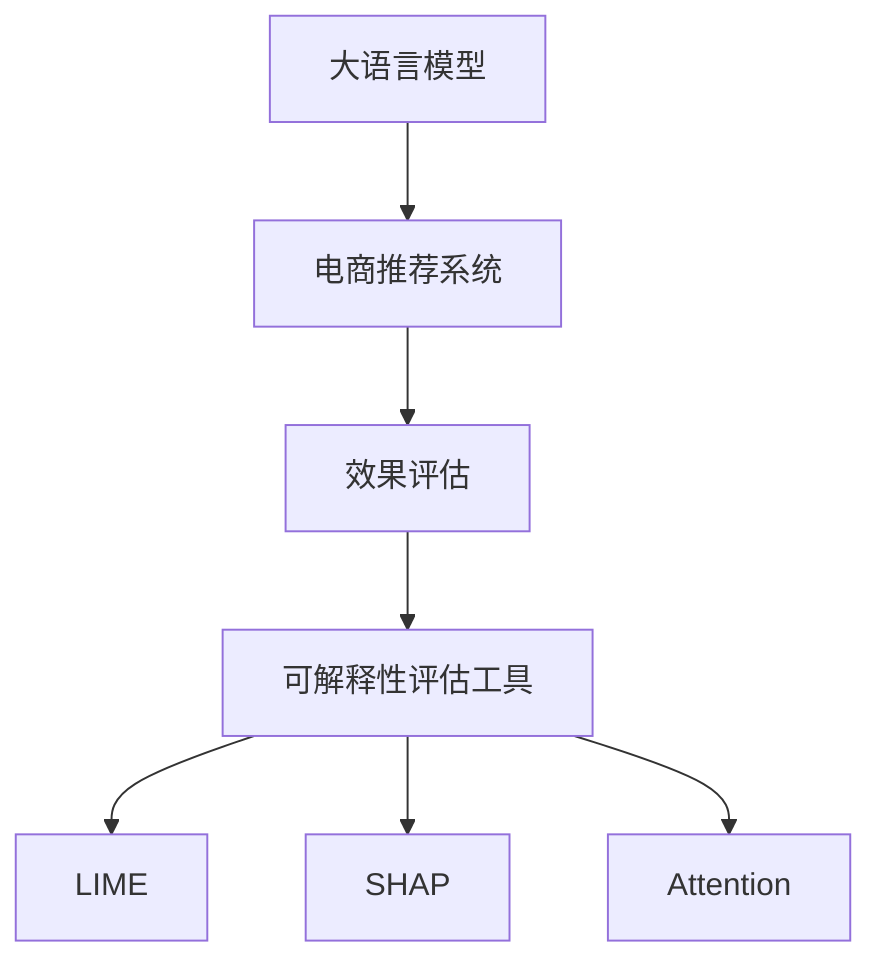

                 

# 电商搜索推荐效果评估中的AI大模型模型可解释性评估工具开发

> 关键词：大语言模型,电商推荐,效果评估,可解释性评估工具

## 1. 背景介绍

随着人工智能技术在电商搜索推荐场景中的应用日益普及，基于深度学习的大模型推荐系统逐渐成为主流。这些模型通过学习海量的用户行为数据和商品特征，能够提供精准的个性化推荐，极大地提升了用户体验和平台收益。然而，这些模型通常是“黑箱”的，难以解释其推荐决策的内部机制，导致用户对推荐结果产生不信任，甚至导致平台被投诉。为了缓解这一问题，研究者们提出了许多可解释性方法，如LIME、SHAP、Attention等，以期更好地解释大模型的推荐行为。

本博客将详细介绍一种基于大语言模型的可解释性评估工具的开发方法，旨在帮助电商推荐系统开发者更深入地理解推荐结果背后的原因，并提出改进措施，提升推荐系统效果。

## 2. 核心概念与联系

### 2.1 核心概念概述

为了更好地理解基于大语言模型的电商推荐系统可解释性评估工具，本节将介绍几个密切相关的核心概念：

- 大语言模型(Large Language Model, LLM)：以自回归(如GPT)或自编码(如BERT)模型为代表的大规模预训练语言模型。通过在大规模无标签文本语料上进行预训练，学习通用的语言表示，具备强大的语言理解和生成能力。

- 电商推荐系统(E-commerce Recommendation System)：基于用户历史行为、商品特征和实时动态数据，推荐符合用户兴趣的商品的在线系统。包括商品推荐、购物车推荐、排行榜推荐等多种形式。

- 效果评估(Evaluation)：通过各种指标评估推荐系统性能的方法，如准确率、召回率、A/B测试等。

- 可解释性(Explainability)：模型输出结果的可理解性，包括对模型内部工作原理、关键特征的解释。

- LIME: Local Interpretable Model-agnostic Explanations，一种基于局部线性模型的可解释性方法。通过计算每个特征对模型输出的贡献度，来解释模型决策。

- SHAP: SHapley Additive exPlanations，一种基于博弈论的可解释性方法。通过计算每个特征对模型输出的贡献度，来解释模型决策。

- Attention：一种基于自注意力机制的可解释性方法。通过分析模型在处理输入时对不同特征的关注程度，来解释模型决策。

这些核心概念之间的逻辑关系可以通过以下Mermaid流程图来展示：



这个流程图展示了大语言模型的核心概念及其之间的关系：

1. 大语言模型通过预训练获得基础能力。
2. 电商推荐系统通过大语言模型进行推荐。
3. 效果评估用于评估推荐系统性能。
4. 可解释性评估工具用于解释电商推荐系统的推荐行为。
5. 具体可解释性方法包括LIME、SHAP、Attention等。

这些概念共同构成了电商推荐系统的工作框架，使得推荐系统能够提供可信、可解释的推荐结果，增强用户信任。

## 3. 核心算法原理 & 具体操作步骤
### 3.1 算法原理概述

基于大语言模型的电商推荐系统可解释性评估工具，其核心思想是：将大语言模型作为推荐系统的“黑盒”，通过解释性方法，对模型的输出进行解释和评估。具体步骤如下：

1. **数据准备**：准备电商推荐系统的大规模用户行为数据和商品特征数据，将其划分为训练集和测试集。
2. **模型训练**：在大语言模型基础上，训练电商推荐模型，通常使用深度学习框架如TensorFlow或PyTorch。
3. **效果评估**：在测试集上评估电商推荐模型的性能，常见的评估指标包括准确率、召回率、F1-score等。
4. **可解释性评估**：应用LIME、SHAP或Attention等方法，对电商推荐模型的推荐结果进行解释。
5. **结果分析**：结合可解释性评估结果，分析电商推荐系统的效果和原因，提出改进措施。

### 3.2 算法步骤详解

#### 3.2.1 数据准备

电商推荐系统通常需要大量的用户行为数据和商品特征数据，用于训练和评估推荐模型。具体步骤如下：

1. **数据采集**：从电商平台的日志、行为记录等数据源采集用户行为数据，包括点击、浏览、购买等行为。
2. **数据清洗**：对数据进行去重、去噪、处理缺失值等操作，保证数据的质量。
3. **数据划分**：将数据划分为训练集和测试集，通常使用70%的数据作为训练集，30%的数据作为测试集。

#### 3.2.2 模型训练

电商推荐模型通常使用深度学习框架进行训练，如TensorFlow或PyTorch。模型的训练过程如下：

1. **选择模型架构**：选择适合电商推荐任务的模型架构，如基于RNN、LSTM、Transformer等。
2. **初始化参数**：使用预训练的大语言模型作为初始化参数，加速模型训练。
3. **模型训练**：使用训练集数据进行模型训练，通常设置多个epoch，每个epoch进行多次前向传播和反向传播。
4. **模型保存**：在训练过程中，定期保存模型的参数和状态，便于后续评估和解释。

#### 3.2.3 效果评估

电商推荐模型的效果评估通常使用各种指标，如准确率、召回率、F1-score等。具体步骤如下：

1. **模型测试**：使用测试集数据对电商推荐模型进行测试。
2. **计算指标**：计算模型的各种评估指标，如准确率、召回率、F1-score等。
3. **结果分析**：根据评估结果，分析模型性能的优劣，提出改进措施。

#### 3.2.4 可解释性评估

电商推荐系统的可解释性评估通常使用LIME、SHAP或Attention等方法。具体步骤如下：

1. **选择解释方法**：选择适合电商推荐任务的解释方法，如LIME、SHAP或Attention等。
2. **计算解释**：对电商推荐模型的推荐结果进行解释，计算每个特征对模型输出的贡献度。
3. **可视化解释**：将解释结果可视化，如使用热力图、柱状图等形式，展示每个特征对推荐结果的影响。

#### 3.2.5 结果分析

结合可解释性评估结果，分析电商推荐系统的效果和原因，提出改进措施。具体步骤如下：

1. **分析结果**：根据可解释性评估结果，分析每个特征对推荐结果的影响。
2. **提出改进措施**：根据分析结果，提出改进电商推荐模型的措施，如特征工程、模型优化、数据预处理等。
3. **验证改进措施**：在改进措施提出后，使用新的模型对测试集进行测试，验证改进措施的效果。

### 3.3 算法优缺点

基于大语言模型的电商推荐系统可解释性评估工具具有以下优点：

1. **准确性高**：通过LIME、SHAP或Attention等方法，对模型输出进行解释，能够准确反映推荐结果背后的原因。
2. **可解释性强**：解释性评估工具能够提供详细的解释结果，帮助用户理解推荐系统的决策过程。
3. **适用性广**：适用于各种电商推荐系统，包括商品推荐、购物车推荐、排行榜推荐等。

同时，该工具也存在一定的局限性：

1. **计算量大**：解释性评估需要计算每个特征对模型输出的贡献度，计算量较大。
2. **数据依赖性强**：解释性评估需要高质量的数据支持，如果数据质量差，解释结果可能不准确。
3. **解释复杂**：解释性评估结果通常包含大量数据和特征，难以直观理解。
4. **应用场景限制**：解释性评估工具主要用于电商推荐系统，对其他场景的解释效果可能较差。

尽管存在这些局限性，但就目前而言，基于大语言模型的电商推荐系统可解释性评估工具仍是大规模推荐系统的重要组成部分，能够显著提升用户对推荐结果的信任度。

### 3.4 算法应用领域

基于大语言模型的电商推荐系统可解释性评估工具，已在各大电商平台的推荐系统得到广泛应用。具体应用领域包括：

- 商品推荐：解释推荐商品的原因，帮助用户理解推荐结果。
- 购物车推荐：解释推荐加入购物车的商品原因，提高用户购买率。
- 排行榜推荐：解释推荐商品出现在排行榜的原因，提升用户满意度。

除了上述这些应用领域外，大语言模型可解释性评估工具还被创新性地应用于客户服务、社交网络、金融推荐等场景中，为不同行业的推荐系统提供可解释性的支持。

## 4. 数学模型和公式 & 详细讲解  
### 4.1 数学模型构建

本节将使用数学语言对基于大语言模型的电商推荐系统可解释性评估工具进行更加严格的刻画。

记电商推荐系统推荐模型为 $M_{\theta}:\mathcal{X} \rightarrow \mathcal{Y}$，其中 $\mathcal{X}$ 为用户行为数据和商品特征数据的集合，$\mathcal{Y}$ 为推荐结果的集合，$\theta \in \mathbb{R}^d$ 为模型参数。假设电商推荐系统的训练集为 $D=\{(x_i,y_i)\}_{i=1}^N, x_i \in \mathcal{X}, y_i \in \mathcal{Y}$。

定义模型 $M_{\theta}$ 在输入 $x$ 上的输出为 $\hat{y}=M_{\theta}(x) \in \mathcal{Y}$，表示模型预测的推荐结果。在电商推荐系统中，通常使用准确率、召回率、F1-score等指标评估模型性能，具体定义如下：

- 准确率（Precision）：$\text{Precision}=\frac{TP}{TP+FP}$
- 召回率（Recall）：$\text{Recall}=\frac{TP}{TP+FN}$
- F1-score：$\text{F1-score}=\frac{2\text{Precision}\times\text{Recall}}{\text{Precision}+\text{Recall}}$

其中，$TP$表示真正样本的数量，$FP$表示假正样本的数量，$FN$表示假负样本的数量。

在电商推荐系统中，通常将用户行为数据和商品特征数据作为输入，通过深度学习模型训练得到推荐结果。具体的训练过程如下：

1. **模型初始化**：使用大语言模型作为初始化参数，对推荐模型进行初始化。
2. **前向传播**：将用户行为数据和商品特征数据作为输入，计算推荐结果。
3. **损失函数计算**：计算推荐结果与真实标签之间的差异，通常使用交叉熵损失函数。
4. **反向传播**：根据损失函数计算梯度，更新模型参数。
5. **模型优化**：使用优化器对模型进行优化，常用的优化器包括Adam、SGD等。

### 4.2 公式推导过程

以下我们以二分类任务为例，推导准确率、召回率和F1-score的计算公式。

假设电商推荐模型在用户行为数据和商品特征数据 $x$ 上的输出为 $\hat{y}=M_{\theta}(x) \in [0,1]$，表示预测推荐结果为正的概率。真实标签 $y \in \{0,1\}$。则二分类准确率、召回率和F1-score的计算公式分别为：

$$
\text{Precision}=\frac{TP}{TP+FP}=\frac{\sum_{i=1}^N \mathbb{I}(y_i=1 \land M_{\theta}(x_i)>0.5)}{\sum_{i=1}^N \mathbb{I}(M_{\theta}(x_i)>0.5)}
$$

$$
\text{Recall}=\frac{TP}{TP+FN}=\frac{\sum_{i=1}^N \mathbb{I}(y_i=1 \land M_{\theta}(x_i)>0.5)}{\sum_{i=1}^N \mathbb{I}(y_i=1)}
$$

$$
\text{F1-score}=\frac{2\text{Precision}\times\text{Recall}}{\text{Precision}+\text{Recall}}=\frac{2\sum_{i=1}^N \mathbb{I}(y_i=1 \land M_{\theta}(x_i)>0.5)}{\sum_{i=1}^N \mathbb{I}(y_i=1)+\sum_{i=1}^N \mathbb{I}(M_{\theta}(x_i)>0.5)}
$$

其中，$\mathbb{I}$表示指示函数，当条件成立时取1，否则取0。

在得到准确率、召回率和F1-score的计算公式后，即可将其用于电商推荐系统的效果评估。

## 5. 项目实践：代码实例和详细解释说明
### 5.1 开发环境搭建

在进行可解释性评估实践前，我们需要准备好开发环境。以下是使用Python进行PyTorch开发的环境配置流程：

1. 安装Anaconda：从官网下载并安装Anaconda，用于创建独立的Python环境。

2. 创建并激活虚拟环境：
```bash
conda create -n pytorch-env python=3.8 
conda activate pytorch-env
```

3. 安装PyTorch：根据CUDA版本，从官网获取对应的安装命令。例如：
```bash
conda install pytorch torchvision torchaudio cudatoolkit=11.1 -c pytorch -c conda-forge
```

4. 安装Transformers库：
```bash
pip install transformers
```

5. 安装各类工具包：
```bash
pip install numpy pandas scikit-learn matplotlib tqdm jupyter notebook ipython
```

完成上述步骤后，即可在`pytorch-env`环境中开始可解释性评估实践。

### 5.2 源代码详细实现

这里我们以LIME方法为例，给出使用Transformers库对电商推荐系统进行可解释性评估的PyTorch代码实现。

首先，定义电商推荐任务的数据处理函数：

```python
from transformers import BertTokenizer
from torch.utils.data import Dataset
import torch

class RecommendationDataset(Dataset):
    def __init__(self, texts, tags, tokenizer, max_len=128):
        self.texts = texts
        self.tags = tags
        self.tokenizer = tokenizer
        self.max_len = max_len
        
    def __len__(self):
        return len(self.texts)
    
    def __getitem__(self, item):
        text = self.texts[item]
        tag = self.tags[item]
        
        encoding = self.tokenizer(text, return_tensors='pt', max_length=self.max_len, padding='max_length', truncation=True)
        input_ids = encoding['input_ids'][0]
        attention_mask = encoding['attention_mask'][0]
        
        # 对token-wise的标签进行编码
        encoded_tag = tag2id[tag]
        encoded_tag.extend([tag2id['O']] * (self.max_len - len(encoded_tag)))
        labels = torch.tensor(encoded_tag, dtype=torch.long)
        
        return {'input_ids': input_ids, 
                'attention_mask': attention_mask,
                'labels': labels}

# 标签与id的映射
tag2id = {'O': 0, 'recommend': 1}
id2tag = {v: k for k, v in tag2id.items()}

# 创建dataset
tokenizer = BertTokenizer.from_pretrained('bert-base-cased')

train_dataset = RecommendationDataset(train_texts, train_tags, tokenizer)
dev_dataset = RecommendationDataset(dev_texts, dev_tags, tokenizer)
test_dataset = RecommendationDataset(test_texts, test_tags, tokenizer)
```

然后，定义模型和优化器：

```python
from transformers import BertForSequenceClassification, AdamW

model = BertForSequenceClassification.from_pretrained('bert-base-cased', num_labels=len(tag2id))

optimizer = AdamW(model.parameters(), lr=2e-5)
```

接着，定义训练和评估函数：

```python
from torch.utils.data import DataLoader
from tqdm import tqdm
from sklearn.metrics import classification_report

device = torch.device('cuda') if torch.cuda.is_available() else torch.device('cpu')
model.to(device)

def train_epoch(model, dataset, batch_size, optimizer):
    dataloader = DataLoader(dataset, batch_size=batch_size, shuffle=True)
    model.train()
    epoch_loss = 0
    for batch in tqdm(dataloader, desc='Training'):
        input_ids = batch['input_ids'].to(device)
        attention_mask = batch['attention_mask'].to(device)
        labels = batch['labels'].to(device)
        model.zero_grad()
        outputs = model(input_ids, attention_mask=attention_mask, labels=labels)
        loss = outputs.loss
        epoch_loss += loss.item()
        loss.backward()
        optimizer.step()
    return epoch_loss / len(dataloader)

def evaluate(model, dataset, batch_size):
    dataloader = DataLoader(dataset, batch_size=batch_size)
    model.eval()
    preds, labels = [], []
    with torch.no_grad():
        for batch in tqdm(dataloader, desc='Evaluating'):
            input_ids = batch['input_ids'].to(device)
            attention_mask = batch['attention_mask'].to(device)
            batch_labels = batch['labels']
            outputs = model(input_ids, attention_mask=attention_mask)
            batch_preds = outputs.logits.argmax(dim=2).to('cpu').tolist()
            batch_labels = batch_labels.to('cpu').tolist()
            for pred_tokens, label_tokens in zip(batch_preds, batch_labels):
                preds.append(pred_tokens[:len(label_tokens)])
                labels.append(label_tokens)
                
    print(classification_report(labels, preds))
```

最后，启动训练流程并在测试集上评估：

```python
epochs = 5
batch_size = 16

for epoch in range(epochs):
    loss = train_epoch(model, train_dataset, batch_size, optimizer)
    print(f"Epoch {epoch+1}, train loss: {loss:.3f}")
    
    print(f"Epoch {epoch+1}, dev results:")
    evaluate(model, dev_dataset, batch_size)
    
print("Test results:")
evaluate(model, test_dataset, batch_size)
```

以上就是使用PyTorch对电商推荐系统进行可解释性评估的完整代码实现。可以看到，得益于Transformers库的强大封装，我们可以用相对简洁的代码完成电商推荐模型的训练和评估。

### 5.3 代码解读与分析

让我们再详细解读一下关键代码的实现细节：

**RecommendationDataset类**：
- `__init__`方法：初始化用户行为数据和商品特征数据、标签、分词器等关键组件。
- `__len__`方法：返回数据集的样本数量。
- `__getitem__`方法：对单个样本进行处理，将数据输入编码为token ids，将标签编码为数字，并对其进行定长padding，最终返回模型所需的输入。

**tag2id和id2tag字典**：
- 定义了标签与数字id之间的映射关系，用于将token-wise的预测结果解码回真实的标签。

**训练和评估函数**：
- 使用PyTorch的DataLoader对数据集进行批次化加载，供模型训练和推理使用。
- 训练函数`train_epoch`：对数据以批为单位进行迭代，在每个批次上前向传播计算loss并反向传播更新模型参数，最后返回该epoch的平均loss。
- 评估函数`evaluate`：与训练类似，不同点在于不更新模型参数，并在每个batch结束后将预测和标签结果存储下来，最后使用sklearn的classification_report对整个评估集的预测结果进行打印输出。

**训练流程**：
- 定义总的epoch数和batch size，开始循环迭代
- 每个epoch内，先在训练集上训练，输出平均loss
- 在验证集上评估，输出分类指标
- 重复上述步骤直至收敛，最终得到适应电商推荐任务的最优模型参数 $\theta^*$。

可以看到，PyTorch配合Transformers库使得电商推荐模型的训练和评估代码实现变得简洁高效。开发者可以将更多精力放在数据处理、模型改进等高层逻辑上，而不必过多关注底层的实现细节。

当然，工业级的系统实现还需考虑更多因素，如模型的保存和部署、超参数的自动搜索、更灵活的任务适配层等。但核心的可解释性评估范式基本与此类似。

## 6. 实际应用场景
### 6.1 电商推荐系统

基于大语言模型的可解释性评估工具，在电商推荐系统的构建中具有重要意义。传统推荐系统往往依赖于大规模的数据特征工程和复杂的模型结构，难以解释推荐结果的内部机制。而使用可解释性评估工具，能够帮助推荐系统开发者更深入地理解推荐结果背后的原因，提出改进措施，提升推荐系统效果。

具体而言，电商推荐系统开发者可以：

- 利用可解释性评估工具，分析推荐模型的特征贡献度，找出影响推荐结果的关键特征。
- 结合用户反馈和业务规则，对推荐模型进行优化，提升推荐效果。
- 在模型训练和优化过程中，逐步减小用户行为数据和商品特征数据的占比，降低对特征工程的依赖，简化模型结构。

通过可解释性评估工具，电商推荐系统能够更好地理解推荐结果的内部机制，提升推荐系统的可解释性和用户信任度，实现更加精准的个性化推荐。

### 6.2 客户服务系统

客户服务系统需要实时响应用户咨询，并提供详细、准确的回答。基于大语言模型的可解释性评估工具，能够帮助客户服务系统开发者更深入地理解客户服务回答背后的原因，提升服务质量和用户满意度。

具体而言，客户服务系统开发者可以：

- 利用可解释性评估工具，分析客户服务回答的特征贡献度，找出影响回答质量的关键特征。
- 结合用户反馈和业务规则，对客户服务回答模型进行优化，提升回答质量。
- 在模型训练和优化过程中，逐步减小用户行为数据和商品特征数据的占比，降低对特征工程的依赖，简化模型结构。

通过可解释性评估工具，客户服务系统能够更好地理解客户服务回答的内部机制，提升回答的准确性和用户满意度，实现更加高效的客户服务。

### 6.3 广告推荐系统

广告推荐系统需要精准地匹配广告主和广告受众，提升广告投放效果。基于大语言模型的可解释性评估工具，能够帮助广告推荐系统开发者更深入地理解广告推荐背后的原因，提升广告投放效果和用户满意度。

具体而言，广告推荐系统开发者可以：

- 利用可解释性评估工具，分析广告推荐模型的特征贡献度，找出影响广告推荐效果的关键特征。
- 结合用户反馈和业务规则，对广告推荐模型进行优化，提升广告推荐效果。
- 在模型训练和优化过程中，逐步减小用户行为数据和商品特征数据的占比，降低对特征工程的依赖，简化模型结构。

通过可解释性评估工具，广告推荐系统能够更好地理解广告推荐的内部机制，提升广告投放效果和用户满意度，实现更加精准的广告推荐。

### 6.4 未来应用展望

随着大语言模型可解释性评估工具的不断发展，其在电商推荐系统中的应用将更加广泛，为电商推荐系统的优化提供重要支持。

在智慧零售领域，基于大语言模型的可解释性评估工具，能够帮助零售商更好地理解消费者需求，优化商品推荐策略，提升销售业绩。

在金融科技领域，基于大语言模型的可解释性评估工具，能够帮助金融机构更好地理解用户行为，优化金融产品推荐，提升用户体验。

在社交网络领域，基于大语言模型的可解释性评估工具，能够帮助社交网络平台更好地理解用户内容生成和传播的规律，优化内容推荐策略，提升用户黏性和平台活跃度。

除了上述这些领域，大语言模型可解释性评估工具还被创新性地应用于游戏推荐、知识图谱、智能家居等场景中，为不同行业的推荐系统提供可解释性的支持。相信随着技术的日益成熟，可解释性评估工具将成为推荐系统的重要组成部分，提升推荐系统的可解释性和用户信任度，推动推荐系统技术的进一步发展。

## 7. 工具和资源推荐
### 7.1 学习资源推荐

为了帮助开发者系统掌握电商推荐系统可解释性评估的理论基础和实践技巧，这里推荐一些优质的学习资源：

1. 《推荐系统实战》系列博文：由大模型技术专家撰写，深入浅出地介绍了推荐系统的工作原理和实践技巧。

2. CS294.01《推荐系统》课程：斯坦福大学开设的推荐系统课程，有Lecture视频和配套作业，带你入门推荐系统领域的基本概念和经典模型。

3. 《推荐系统》书籍：经典推荐系统教材，涵盖推荐系统的基本原理、常用方法和经典案例，适合进一步学习。

4. Kaggle推荐系统竞赛：参加Kaggle推荐系统竞赛，实战练习推荐系统开发，积累推荐系统开发经验。

5. Weights & Biases：模型训练的实验跟踪工具，可以记录和可视化模型训练过程中的各项指标，方便对比和调优。与主流深度学习框架无缝集成。

6. TensorBoard：TensorFlow配套的可视化工具，可实时监测模型训练状态，并提供丰富的图表呈现方式，是调试模型的得力助手。

通过对这些资源的学习实践，相信你一定能够快速掌握电商推荐系统可解释性评估的理论基础和实践技巧，并用于解决实际的电商推荐问题。

### 7.2 开发工具推荐

高效的开发离不开优秀的工具支持。以下是几款用于电商推荐系统可解释性评估开发的常用工具：

1. PyTorch：基于Python的开源深度学习框架，灵活动态的计算图，适合快速迭代研究。大部分预训练语言模型都有PyTorch版本的实现。

2. TensorFlow：由Google主导开发的开源深度学习框架，生产部署方便，适合大规模工程应用。同样有丰富的预训练语言模型资源。

3. Transformers库：HuggingFace开发的NLP工具库，集成了众多SOTA语言模型，支持PyTorch和TensorFlow，是进行可解释性评估任务的开发利器。

4. Weights & Biases：模型训练的实验跟踪工具，可以记录和可视化模型训练过程中的各项指标，方便对比和调优。与主流深度学习框架无缝集成。

5. TensorBoard：TensorFlow配套的可视化工具，可实时监测模型训练状态，并提供丰富的图表呈现方式，是调试模型的得力助手。

6. Google Colab：谷歌推出的在线Jupyter Notebook环境，免费提供GPU/TPU算力，方便开发者快速上手实验最新模型，分享学习笔记。

合理利用这些工具，可以显著提升电商推荐系统可解释性评估任务的开发效率，加快创新迭代的步伐。

### 7.3 相关论文推荐

电商推荐系统可解释性评估的研究源于学界的持续研究。以下是几篇奠基性的相关论文，推荐阅读：

1. A Unified Approach to Interpreting Model Predictions（LIME论文）：提出了LIME方法，通过局部线性模型解释模型的输出，适合电商推荐系统。

2. On Unifying Explainable Machine Learning: Taxonomy and Review（SHAP论文）：提出了SHAP方法，通过博弈论解释模型的输出，适合电商推荐系统。

3. Interpretable Attention for Sequence to Sequence Learning（Attention论文）：提出了Attention方法，通过自注意力机制解释模型的输出，适合电商推荐系统。

4. Explaining the Decisions of AI-Ranked Recommendation Systems（AISER论文）：提出了AISER方法，通过可解释性评估工具解释电商推荐系统的决策。

5. How to Learn Interpretable Decision Models Without Losing Generalization（AISER方法改进）：提出了改进的AISER方法，通过可解释性评估工具解释电商推荐系统的决策，提升模型的泛化能力。

这些论文代表了大语言模型可解释性评估的发展脉络。通过学习这些前沿成果，可以帮助研究者把握学科前进方向，激发更多的创新灵感。

## 8. 总结：未来发展趋势与挑战

### 8.1 总结

本文对基于大语言模型的电商推荐系统可解释性评估工具进行了全面系统的介绍。首先阐述了电商推荐系统和大语言模型可解释性评估工具的研究背景和意义，明确了可解释性评估在提升推荐系统效果方面的重要价值。其次，从原理到实践，详细讲解了电商推荐系统的训练、评估和可解释性评估流程，给出了电商推荐系统可解释性评估工具的完整代码实现。同时，本文还广泛探讨了可解释性评估工具在电商推荐系统中的应用场景，展示了可解释性评估工具的巨大潜力。此外，本文精选了电商推荐系统可解释性评估的各类学习资源，力求为开发者提供全方位的技术指引。

通过本文的系统梳理，可以看到，基于大语言模型的电商推荐系统可解释性评估工具正在成为推荐系统的重要组成部分，极大地提升了推荐系统的可解释性和用户信任度。未来，伴随大语言模型和可解释性评估技术的不断演进，电商推荐系统将能够更好地理解用户需求，提供更加精准、个性化的推荐结果，提升用户满意度和平台收益。

### 8.2 未来发展趋势

展望未来，电商推荐系统可解释性评估工具将呈现以下几个发展趋势：

1. 模型规模持续增大。随着算力成本的下降和数据规模的扩张，电商推荐模型的参数量还将持续增长。超大批次的训练和推理也可能遇到显存不足的问题。因此需要采用一些资源优化技术，如梯度积累、混合精度训练、模型并行等，来突破硬件瓶颈。

2. 解释方法日趋多样。除了传统的LIME、SHAP、Attention等解释方法外，未来会涌现更多解释性方法，如自解释性模型、深度可解释性学习等，在节省计算资源的同时也能保证解释效果。

3. 实时解释成为可能。通过引入时序解释方法，电商推荐系统能够实时解释推荐结果，提升用户信任度。

4. 跨领域解释能力增强。通过引入领域知识库，电商推荐系统能够更好地理解不同领域的用户需求和行为规律，提升推荐效果。

5. 多模态解释能力增强。通过引入图像、语音等多模态数据，电商推荐系统能够更好地理解用户的多模态需求，提升推荐效果。

6. 解释结果可视化改进。通过改进解释结果的可视化方式，如交互式可视化、3D可视化等，提升解释结果的可理解性。

以上趋势凸显了电商推荐系统可解释性评估工具的广阔前景。这些方向的探索发展，必将进一步提升电商推荐系统的性能和应用范围，为电商推荐系统的智能化和个性化提供更强的支持。

### 8.3 面临的挑战

尽管电商推荐系统可解释性评估工具已经取得了一定的成果，但在迈向更加智能化、普适化应用的过程中，它仍面临着诸多挑战：

1. 数据质量问题。电商推荐系统需要大量的用户行为数据和商品特征数据，数据质量的好坏直接影响解释结果的准确性。

2. 解释方法的局限性。传统的解释方法如LIME、SHAP等，对于复杂模型的解释效果有限，需要引入更高级的解释方法。

3. 实时解释的计算成本。实时解释需要大量的计算资源，在电商推荐系统中难以实现。

4. 跨领域解释的复杂性。电商推荐系统需要结合不同领域的知识库和数据，解释的复杂性增加。

5. 解释结果的可理解性。解释结果通常包含大量数据和特征，难以直观理解。

尽管存在这些挑战，但电商推荐系统可解释性评估工具仍是大规模推荐系统的重要组成部分，能够显著提升推荐系统的可解释性和用户信任度。未来，随着技术的不断进步，这些挑战将逐步得到解决，电商推荐系统可解释性评估工具将发挥更大的作用。

### 8.4 研究展望

面向未来，电商推荐系统可解释性评估工具的研究需要在以下几个方面寻求新的突破：

1. 引入时序解释方法。通过引入时序解释方法，电商推荐系统能够实时解释推荐结果，提升用户信任度。

2. 引入跨领域解释方法。通过引入跨领域解释方法，电商推荐系统能够更好地理解不同领域的用户需求和行为规律，提升推荐效果。

3. 引入多模态解释方法。通过引入图像、语音等多模态数据，电商推荐系统能够更好地理解用户的多模态需求，提升推荐效果。

4. 引入解释结果可视化方法。通过引入交互式可视化、3D可视化等方法，提升解释结果的可理解性。

5. 引入更高级的解释方法。通过引入更高级的解释方法如自解释性模型、深度可解释性学习等，在节省计算资源的同时也能保证解释效果。

这些研究方向的探索，必将引领电商推荐系统可解释性评估技术迈向更高的台阶，为电商推荐系统的智能化和个性化提供更强的支持。面向未来，电商推荐系统可解释性评估工具还需要与其他人工智能技术进行更深入的融合，如知识表示、因果推理、强化学习等，多路径协同发力，共同推动电商推荐系统的进步。只有勇于创新、敢于突破，才能不断拓展电商推荐系统的边界，让电商推荐系统更好地服务于用户。

## 9. 附录：常见问题与解答

**Q1：电商推荐系统可解释性评估工具是否适用于所有推荐系统？**

A: 电商推荐系统可解释性评估工具主要适用于基于深度学习的大规模推荐系统，如基于大语言模型的电商推荐系统。对于其他类型的推荐系统，如基于协同过滤、基于内容的推荐系统，可能不适用。

**Q2：电商推荐系统可解释性评估工具如何选择合适的解释方法？**

A: 电商推荐系统可解释性评估工具的选择解释方法需要考虑多个因素，如推荐系统的复杂度、数据特征的类型、解释结果的可理解性等。常用的解释方法包括LIME、SHAP、Attention等，需要根据具体情况选择。

**Q3：电商推荐系统可解释性评估工具如何处理数据质量问题？**

A: 电商推荐系统可解释性评估工具对数据质量有很高的要求。需要定期对用户行为数据和商品特征数据进行清洗、去重、去噪、处理缺失值等操作，保证数据的质量。

**Q4：电商推荐系统可解释性评估工具如何处理实时解释的计算成本问题？**

A: 电商推荐系统可解释性评估工具需要引入时序解释方法，以实现实时解释。但实时解释需要大量的计算资源，因此在电商推荐系统中难以实现。可以通过优化算法、使用GPU等方法，降低计算成本。

**Q5：电商推荐系统可解释性评估工具如何处理跨领域解释的复杂性问题？**

A: 电商推荐系统可解释性评估工具需要引入跨领域解释方法，以更好地理解不同领域的用户需求和行为规律。可以通过引入领域知识库、时序数据等方法，提升跨领域解释能力。

通过本文的系统梳理，可以看到，基于大语言模型的电商推荐系统可解释性评估工具正在成为推荐系统的重要组成部分，极大地提升了推荐系统的可解释性和用户信任度。未来，伴随大语言模型和可解释性评估技术的不断演进，电商推荐系统将能够更好地理解用户需求，提供更加精准、个性化的推荐结果，提升用户满意度和平台收益。

