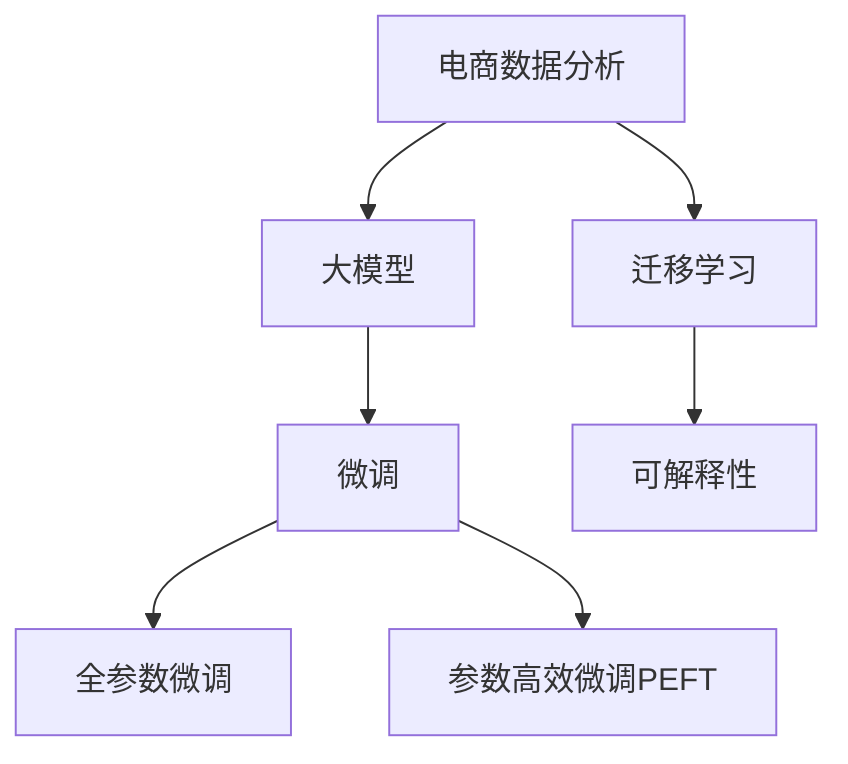

                 

# 电商数据分析：AI大模型的新维度

## 1. 背景介绍

### 1.1 问题由来

随着电商行业的蓬勃发展，大数据和人工智能技术在电商领域的应用越来越广泛。传统电商数据分析主要依赖于统计方法和规则引擎，如回归分析、时间序列预测、分类与聚类等，这些方法依赖于领域知识，并且需要人工特征工程，使得模型训练和部署成本较高。

而基于大模型的新范式，如Transformers、BERT、GPT等，通过大规模预训练，学习到了丰富的语言知识和结构表示，可以在电商数据分析中发挥重要作用。与传统方法相比，大模型具有以下优势：

1. **自适应能力**：大模型可以通过微调适应不同电商领域的特定任务。
2. **泛化能力**：大模型可以在不同规模、不同领域的数据上表现良好。
3. **集成知识**：大模型可以整合领域知识和先验信息，提供更全面和准确的分析结果。

因此，本文将探讨如何利用大模型进行电商数据分析，分析其在电商行业中的应用前景和潜在挑战。

### 1.2 问题核心关键点

利用大模型进行电商数据分析的核心问题包括：

1. 如何选择合适的预训练模型和微调策略。
2. 如何处理电商领域的多样性和复杂性。
3. 如何评估大模型在电商领域的表现。
4. 如何处理电商数据中的隐私和安全性问题。
5. 如何提高大模型的实时性和可解释性。

本文将围绕这些问题展开，详细介绍大模型在电商数据分析中的应用。

## 2. 核心概念与联系

### 2.1 核心概念概述

为更好地理解大模型在电商数据分析中的应用，本节将介绍几个密切相关的核心概念：

- **电商数据分析**：指利用数据分析技术，对电商平台的用户行为、交易数据、供应链管理等方面进行深入挖掘和分析，以优化电商运营，提升用户体验，提高营销效果。
- **大模型**：以Transformer结构为代表的深度学习模型，通过在大规模无标签文本语料上进行预训练，学习到丰富的语言知识和结构表示。常见的预训练模型包括BERT、GPT等。
- **微调(Fine-Tuning)**：指在预训练模型的基础上，使用下游任务的少量标注数据，通过有监督学习优化模型在该任务上的性能。
- **迁移学习(Transfer Learning)**：指将一个领域学习到的知识，迁移应用到另一个不同但相关的领域的学习范式。
- **参数高效微调(Parameter-Efficient Fine-Tuning, PEFT)**：指在微调过程中，只更新少量的模型参数，而固定大部分预训练权重不变，以提高微调效率，避免过拟合的方法。
- **可解释性(Explainability)**：指模型输出的结果能够被理解和解释，有助于用户理解模型决策过程和提升模型可信度。

这些核心概念之间的逻辑关系可以通过以下Mermaid流程图来展示：



这个流程图展示了大模型在电商数据分析中的应用框架，以及不同概念之间的联系。

## 3. 核心算法原理 & 具体操作步骤

### 3.1 算法原理概述

基于大模型的电商数据分析，本质上是一个有监督的迁移学习过程。其核心思想是：将预训练的大模型视作一个强大的"特征提取器"，通过在电商领域的具体任务上进行微调，使得模型输出能够匹配任务标签，从而获得针对特定电商任务的优化的模型。

形式化地，假设预训练模型为 $M_{\theta}$，其中 $\theta$ 为预训练得到的模型参数。给定电商领域的具体任务 $T$ 的标注数据集 $D=\{(x_i, y_i)\}_{i=1}^N$，微调的目标是找到新的模型参数 $\hat{\theta}$，使得：

$$
\hat{\theta}=\mathop{\arg\min}_{\theta} \mathcal{L}(M_{\theta},D)
$$

其中 $\mathcal{L}$ 为针对任务 $T$ 设计的损失函数，用于衡量模型预测输出与真实标签之间的差异。常见的损失函数包括交叉熵损失、均方误差损失等。

通过梯度下降等优化算法，微调过程不断更新模型参数 $\theta$，最小化损失函数 $\mathcal{L}$，使得模型输出逼近真实标签。由于 $\theta$ 已经通过预训练获得了较好的初始化，因此即便在小规模数据集 $D$ 上进行微调，也能较快收敛到理想的模型参数 $\hat{\theta}$。

### 3.2 算法步骤详解

基于大模型的电商数据分析，一般包括以下几个关键步骤：

**Step 1: 准备预训练模型和数据集**
- 选择合适的预训练语言模型 $M_{\theta}$ 作为初始化参数，如 BERT、GPT等。
- 准备电商领域的具体任务 $T$ 的标注数据集 $D$，划分为训练集、验证集和测试集。一般要求标注数据与预训练数据的分布不要差异过大。

**Step 2: 添加任务适配层**
- 根据任务类型，在预训练模型顶层设计合适的输出层和损失函数。
- 对于电商领域的具体任务，如用户购买行为预测、推荐系统、供应链管理等，通常使用二分类、多分类、回归等任务适配层。

**Step 3: 设置微调超参数**
- 选择合适的优化算法及其参数，如 AdamW、SGD 等，设置学习率、批大小、迭代轮数等。
- 设置正则化技术及强度，包括权重衰减、Dropout、Early Stopping等。
- 确定冻结预训练参数的策略，如仅微调顶层，或全部参数都参与微调。

**Step 4: 执行梯度训练**
- 将训练集数据分批次输入模型，前向传播计算损失函数。
- 反向传播计算参数梯度，根据设定的优化算法和学习率更新模型参数。
- 周期性在验证集上评估模型性能，根据性能指标决定是否触发 Early Stopping。
- 重复上述步骤直到满足预设的迭代轮数或 Early Stopping 条件。

**Step 5: 测试和部署**
- 在测试集上评估微调后模型 $M_{\hat{\theta}}$ 的性能，对比微调前后的精度提升。
- 使用微调后的模型对新样本进行推理预测，集成到实际的应用系统中。
- 持续收集新的数据，定期重新微调模型，以适应数据分布的变化。

以上是基于大模型进行电商数据分析的一般流程。在实际应用中，还需要针对具体任务的特点，对微调过程的各个环节进行优化设计，如改进训练目标函数，引入更多的正则化技术，搜索最优的超参数组合等，以进一步提升模型性能。

### 3.3 算法优缺点

基于大模型的电商数据分析方法具有以下优点：

1. **高效性**：通过微调，大模型可以在较短时间内获得针对特定电商任务的优化的模型，大大降低了开发和训练成本。
2. **泛化能力**：大模型通过大规模预训练，能够学习到通用的语言知识和结构表示，在电商领域中同样表现出色。
3. **可解释性**：大模型的输出可以被解释，有助于理解模型决策过程，提升模型的可信度。
4. **灵活性**：大模型可以通过微调，适应电商领域的多种任务，如用户行为预测、推荐系统、供应链管理等。

同时，该方法也存在一定的局限性：

1. **依赖标注数据**：微调的效果很大程度上取决于标注数据的质量和数量，获取高质量标注数据的成本较高。
2. **迁移能力有限**：当目标任务与预训练数据的分布差异较大时，微调的性能提升有限。
3. **负面效果传递**：预训练模型的固有偏见、有害信息等，可能通过微调传递到下游任务，造成负面影响。
4. **可解释性不足**：微调模型的决策过程通常缺乏可解释性，难以对其推理逻辑进行分析和调试。

尽管存在这些局限性，但就目前而言，基于大模型的电商数据分析方法仍是大模型应用的最主流范式。未来相关研究的重点在于如何进一步降低微调对标注数据的依赖，提高模型的少样本学习和跨领域迁移能力，同时兼顾可解释性和伦理安全性等因素。

### 3.4 算法应用领域

基于大模型的电商数据分析方法在电商领域已经得到了广泛的应用，覆盖了几乎所有常见任务，例如：

- **用户行为预测**：如用户购买行为预测、流失用户识别等。通过微调使模型学习用户行为与购买意愿之间的关系。
- **推荐系统**：为用户推荐商品、优惠活动等。将用户历史行为、商品属性等信息作为微调数据，训练模型学习用户与商品间的相似度。
- **供应链管理**：预测供应链中的需求、库存、物流等环节。通过微调使模型学习供应链数据与需求预测之间的关系。
- **客户服务**：利用自然语言处理技术，对用户反馈、投诉等进行自动分类和处理。
- **广告投放**：对广告效果进行预测和优化，根据用户行为进行定向投放。
- **金融风控**：通过分析交易数据，识别欺诈行为、异常交易等风险。

除了上述这些经典任务外，大模型在电商领域的新应用也在不断涌现，如用户情感分析、智能客服、内容推荐等，为电商技术带来了新的创新方向。

## 4. 数学模型和公式 & 详细讲解  
### 4.1 数学模型构建

本节将使用数学语言对基于大模型的电商数据分析过程进行更加严格的刻画。

记预训练语言模型为 $M_{\theta}$，其中 $\theta$ 为模型参数。假设电商领域的具体任务为 $T$，任务类型为分类、回归等，训练集为 $D=\{(x_i,y_i)\}_{i=1}^N$。

定义模型 $M_{\theta}$ 在输入 $x$ 上的损失函数为 $\ell(M_{\theta}(x),y)$，则在数据集 $D$ 上的经验风险为：

$$
\mathcal{L}(\theta) = \frac{1}{N} \sum_{i=1}^N \ell(M_{\theta}(x_i),y_i)
$$

微调的优化目标是最小化经验风险，即找到最优参数：

$$
\theta^* = \mathop{\arg\min}_{\theta} \mathcal{L}(\theta)
$$

在实践中，我们通常使用基于梯度的优化算法（如SGD、Adam等）来近似求解上述最优化问题。设 $\eta$ 为学习率，$\lambda$ 为正则化系数，则参数的更新公式为：

$$
\theta \leftarrow \theta - \eta \nabla_{\theta}\mathcal{L}(\theta) - \eta\lambda\theta
$$

其中 $\nabla_{\theta}\mathcal{L}(\theta)$ 为损失函数对参数 $\theta$ 的梯度，可通过反向传播算法高效计算。

### 4.2 公式推导过程

以下我们以用户购买行为预测为例，推导交叉熵损失函数及其梯度的计算公式。

假设模型 $M_{\theta}$ 在输入 $x$ 上的输出为 $\hat{y}=M_{\theta}(x) \in [0,1]$，表示用户购买行为的概率。真实标签 $y \in \{0,1\}$。则二分类交叉熵损失函数定义为：

$$
\ell(M_{\theta}(x),y) = -[y\log \hat{y} + (1-y)\log (1-\hat{y})]
$$

将其代入经验风险公式，得：

$$
\mathcal{L}(\theta) = -\frac{1}{N}\sum_{i=1}^N [y_i\log M_{\theta}(x_i)+(1-y_i)\log(1-M_{\theta}(x_i))]
$$

根据链式法则，损失函数对参数 $\theta_k$ 的梯度为：

$$
\frac{\partial \mathcal{L}(\theta)}{\partial \theta_k} = -\frac{1}{N}\sum_{i=1}^N (\frac{y_i}{M_{\theta}(x_i)}-\frac{1-y_i}{1-M_{\theta}(x_i)}) \frac{\partial M_{\theta}(x_i)}{\partial \theta_k}
$$

其中 $\frac{\partial M_{\theta}(x_i)}{\partial \theta_k}$ 可进一步递归展开，利用自动微分技术完成计算。

在得到损失函数的梯度后，即可带入参数更新公式，完成模型的迭代优化。重复上述过程直至收敛，最终得到适应电商领域用户购买行为预测的最优模型参数 $\theta^*$。

## 5. 项目实践：代码实例和详细解释说明
### 5.1 开发环境搭建

在进行电商数据分析实践前，我们需要准备好开发环境。以下是使用Python进行PyTorch开发的环境配置流程：

1. 安装Anaconda：从官网下载并安装Anaconda，用于创建独立的Python环境。

2. 创建并激活虚拟环境：
```bash
conda create -n pytorch-env python=3.8 
conda activate pytorch-env
```

3. 安装PyTorch：根据CUDA版本，从官网获取对应的安装命令。例如：
```bash
conda install pytorch torchvision torchaudio cudatoolkit=11.1 -c pytorch -c conda-forge
```

4. 安装Transformers库：
```bash
pip install transformers
```

5. 安装各类工具包：
```bash
pip install numpy pandas scikit-learn matplotlib tqdm jupyter notebook ipython
```

完成上述步骤后，即可在`pytorch-env`环境中开始电商数据分析实践。

### 5.2 源代码详细实现

下面我们以用户购买行为预测任务为例，给出使用Transformers库对BERT模型进行电商数据分析的PyTorch代码实现。

首先，定义任务数据处理函数：

```python
from transformers import BertTokenizer
from torch.utils.data import Dataset
import torch

class PurchaseBehaviorDataset(Dataset):
    def __init__(self, texts, labels, tokenizer, max_len=128):
        self.texts = texts
        self.labels = labels
        self.tokenizer = tokenizer
        self.max_len = max_len
        
    def __len__(self):
        return len(self.texts)
    
    def __getitem__(self, item):
        text = self.texts[item]
        label = self.labels[item]
        
        encoding = self.tokenizer(text, return_tensors='pt', max_length=self.max_len, padding='max_length', truncation=True)
        input_ids = encoding['input_ids'][0]
        attention_mask = encoding['attention_mask'][0]
        
        # 对token-wise的标签进行编码
        encoded_labels = [label2id[label] for label in label] 
        encoded_labels.extend([label2id['O']] * (self.max_len - len(encoded_labels)))
        labels = torch.tensor(encoded_labels, dtype=torch.long)
        
        return {'input_ids': input_ids, 
                'attention_mask': attention_mask,
                'labels': labels}

# 标签与id的映射
label2id = {'O': 0, 'Buy': 1, 'NotBuy': 2}
id2label = {v: k for k, v in label2id.items()}

# 创建dataset
tokenizer = BertTokenizer.from_pretrained('bert-base-cased')

train_dataset = PurchaseBehaviorDataset(train_texts, train_labels, tokenizer)
dev_dataset = PurchaseBehaviorDataset(dev_texts, dev_labels, tokenizer)
test_dataset = PurchaseBehaviorDataset(test_texts, test_labels, tokenizer)
```

然后，定义模型和优化器：

```python
from transformers import BertForTokenClassification, AdamW

model = BertForTokenClassification.from_pretrained('bert-base-cased', num_labels=len(label2id))

optimizer = AdamW(model.parameters(), lr=2e-5)
```

接着，定义训练和评估函数：

```python
from torch.utils.data import DataLoader
from tqdm import tqdm
from sklearn.metrics import classification_report

device = torch.device('cuda') if torch.cuda.is_available() else torch.device('cpu')
model.to(device)

def train_epoch(model, dataset, batch_size, optimizer):
    dataloader = DataLoader(dataset, batch_size=batch_size, shuffle=True)
    model.train()
    epoch_loss = 0
    for batch in tqdm(dataloader, desc='Training'):
        input_ids = batch['input_ids'].to(device)
        attention_mask = batch['attention_mask'].to(device)
        labels = batch['labels'].to(device)
        model.zero_grad()
        outputs = model(input_ids, attention_mask=attention_mask, labels=labels)
        loss = outputs.loss
        epoch_loss += loss.item()
        loss.backward()
        optimizer.step()
    return epoch_loss / len(dataloader)

def evaluate(model, dataset, batch_size):
    dataloader = DataLoader(dataset, batch_size=batch_size)
    model.eval()
    preds, labels = [], []
    with torch.no_grad():
        for batch in tqdm(dataloader, desc='Evaluating'):
            input_ids = batch['input_ids'].to(device)
            attention_mask = batch['attention_mask'].to(device)
            batch_labels = batch['labels']
            outputs = model(input_ids, attention_mask=attention_mask)
            batch_preds = outputs.logits.argmax(dim=2).to('cpu').tolist()
            batch_labels = batch_labels.to('cpu').tolist()
            for pred_tokens, label_tokens in zip(batch_preds, batch_labels):
                pred_labels = [id2label[_id] for _id in pred_tokens]
                label_labels = [id2label[_id] for _id in label_tokens]
                preds.append(pred_labels[:len(label_labels)])
                labels.append(label_labels)
                
    print(classification_report(labels, preds))
```

最后，启动训练流程并在测试集上评估：

```python
epochs = 5
batch_size = 16

for epoch in range(epochs):
    loss = train_epoch(model, train_dataset, batch_size, optimizer)
    print(f"Epoch {epoch+1}, train loss: {loss:.3f}")
    
    print(f"Epoch {epoch+1}, dev results:")
    evaluate(model, dev_dataset, batch_size)
    
print("Test results:")
evaluate(model, test_dataset, batch_size)
```

以上就是使用PyTorch对BERT进行电商数据分析任务微调的完整代码实现。可以看到，得益于Transformers库的强大封装，我们可以用相对简洁的代码完成BERT模型的加载和微调。

### 5.3 代码解读与分析

让我们再详细解读一下关键代码的实现细节：

**PurchaseBehaviorDataset类**：
- `__init__`方法：初始化文本、标签、分词器等关键组件。
- `__len__`方法：返回数据集的样本数量。
- `__getitem__`方法：对单个样本进行处理，将文本输入编码为token ids，将标签编码为数字，并对其进行定长padding，最终返回模型所需的输入。

**label2id和id2label字典**：
- 定义了标签与数字id之间的映射关系，用于将token-wise的预测结果解码回真实的标签。

**训练和评估函数**：
- 使用PyTorch的DataLoader对数据集进行批次化加载，供模型训练和推理使用。
- 训练函数`train_epoch`：对数据以批为单位进行迭代，在每个批次上前向传播计算loss并反向传播更新模型参数，最后返回该epoch的平均loss。
- 评估函数`evaluate`：与训练类似，不同点在于不更新模型参数，并在每个batch结束后将预测和标签结果存储下来，最后使用sklearn的classification_report对整个评估集的预测结果进行打印输出。

**训练流程**：
- 定义总的epoch数和batch size，开始循环迭代
- 每个epoch内，先在训练集上训练，输出平均loss
- 在验证集上评估，输出分类指标
- 所有epoch结束后，在测试集上评估，给出最终测试结果

可以看到，PyTorch配合Transformers库使得BERT微调的代码实现变得简洁高效。开发者可以将更多精力放在数据处理、模型改进等高层逻辑上，而不必过多关注底层的实现细节。

当然，工业级的系统实现还需考虑更多因素，如模型的保存和部署、超参数的自动搜索、更灵活的任务适配层等。但核心的微调范式基本与此类似。

## 6. 实际应用场景
### 6.1 用户行为预测

用户行为预测是大模型在电商领域的重要应用场景。通过分析用户的历史浏览、购买、评价等数据，预测其未来的行为，可以帮助电商平台进行个性化推荐、精准营销和库存管理。

具体而言，可以将用户的历史行为数据作为微调输入，将未来是否购买、购买时间等作为监督信号。微调后的模型能够学习到用户购买行为与各种因素之间的关系，预测用户未来的购买意愿。例如，在电商平台上，用户浏览某商品10分钟后，微调后的模型可以预测其是否会购买该商品，从而进行个性化推荐。

### 6.2 推荐系统

推荐系统是大模型在电商领域的另一大应用场景。通过分析用户历史行为数据和商品属性信息，训练推荐模型，可以为用户推荐合适的商品。

在实践中，可以将用户历史浏览、购买、评价等行为数据作为输入，商品属性信息作为标签，对预训练语言模型进行微调。微调后的模型可以学习到用户与商品之间的相似度，进行精准推荐。例如，在电商平台上，根据用户浏览历史，推荐其可能感兴趣的商品。

### 6.3 供应链管理

供应链管理是大模型在电商领域的又一重要应用场景。通过分析供应链中的订单数据、库存数据等，预测未来的需求、库存和物流情况，可以优化供应链管理，降低运营成本，提高运营效率。

具体而言，可以将供应链中的订单数据、库存数据等作为微调输入，将未来的需求、库存和物流情况作为监督信号。微调后的模型可以学习到供应链数据与需求预测之间的关系，进行供应链优化。例如，在电商平台上，根据过去订单数据，预测未来需求，从而优化库存管理和物流配送。

### 6.4 未来应用展望

随着大模型和微调方法的不断发展，基于大模型的方法将在更多领域得到应用，为电商技术带来更多的创新方向。

在智慧物流领域，基于大模型的路径规划、配送优化、智能仓储等应用将提高物流效率，降低物流成本。

在智慧零售领域，基于大模型的客户分析、店铺推荐、智能客服等应用将提升用户体验，优化零售管理。

在智能客服领域，基于大模型的客服机器人将提高客服效率，减少人工成本。

此外，在广告投放、金融风控、内容推荐等众多领域，大模型的新应用也在不断涌现，为电商技术带来新的突破。相信随着技术的日益成熟，大模型微调必将在电商领域带来更多的创新和应用，推动电商技术向更加智能化、普适化方向发展。

## 7. 工具和资源推荐
### 7.1 学习资源推荐

为了帮助开发者系统掌握大模型在电商数据分析中的应用，这里推荐一些优质的学习资源：

1. 《Transformer从原理到实践》系列博文：由大模型技术专家撰写，深入浅出地介绍了Transformer原理、BERT模型、电商数据分析等前沿话题。

2. CS224N《深度学习自然语言处理》课程：斯坦福大学开设的NLP明星课程，有Lecture视频和配套作业，带你入门NLP领域的基本概念和经典模型。

3. 《Natural Language Processing with Transformers》书籍：Transformers库的作者所著，全面介绍了如何使用Transformers库进行NLP任务开发，包括电商数据分析在内的诸多范式。

4. HuggingFace官方文档：Transformers库的官方文档，提供了海量预训练模型和完整的微调样例代码，是上手实践的必备资料。

5. Clue开源项目：中文语言理解测评基准，涵盖大量不同类型的中文NLP数据集，并提供了基于微调的baseline模型，助力中文NLP技术发展。

通过对这些资源的学习实践，相信你一定能够快速掌握大模型在电商数据分析中的应用，并用于解决实际的电商问题。
###  7.2 开发工具推荐

高效的开发离不开优秀的工具支持。以下是几款用于大模型电商数据分析开发的常用工具：

1. PyTorch：基于Python的开源深度学习框架，灵活动态的计算图，适合快速迭代研究。大部分预训练语言模型都有PyTorch版本的实现。

2. TensorFlow：由Google主导开发的开源深度学习框架，生产部署方便，适合大规模工程应用。同样有丰富的预训练语言模型资源。

3. Transformers库：HuggingFace开发的NLP工具库，集成了众多SOTA语言模型，支持PyTorch和TensorFlow，是进行电商数据分析开发的利器。

4. Weights & Biases：模型训练的实验跟踪工具，可以记录和可视化模型训练过程中的各项指标，方便对比和调优。与主流深度学习框架无缝集成。

5. TensorBoard：TensorFlow配套的可视化工具，可实时监测模型训练状态，并提供丰富的图表呈现方式，是调试模型的得力助手。

6. Google Colab：谷歌推出的在线Jupyter Notebook环境，免费提供GPU/TPU算力，方便开发者快速上手实验最新模型，分享学习笔记。

合理利用这些工具，可以显著提升大模型电商数据分析任务的开发效率，加快创新迭代的步伐。

### 7.3 相关论文推荐

大模型和电商数据分析领域的研究源于学界的持续研究。以下是几篇奠基性的相关论文，推荐阅读：

1. Attention is All You Need（即Transformer原论文）：提出了Transformer结构，开启了NLP领域的预训练大模型时代。

2. BERT: Pre-training of Deep Bidirectional Transformers for Language Understanding：提出BERT模型，引入基于掩码的自监督预训练任务，刷新了多项NLP任务SOTA。

3. Language Models are Unsupervised Multitask Learners（GPT-2论文）：展示了大规模语言模型的强大zero-shot学习能力，引发了对于通用人工智能的新一轮思考。

4. Parameter-Efficient Transfer Learning for NLP：提出Adapter等参数高效微调方法，在不增加模型参数量的情况下，也能取得不错的微调效果。

5. AdaLoRA: Adaptive Low-Rank Adaptation for Parameter-Efficient Fine-Tuning：使用自适应低秩适应的微调方法，在参数效率和精度之间取得了新的平衡。

这些论文代表了大模型电商数据分析领域的发展脉络。通过学习这些前沿成果，可以帮助研究者把握学科前进方向，激发更多的创新灵感。

## 8. 总结：未来发展趋势与挑战

### 8.1 总结

本文对基于大模型的电商数据分析方法进行了全面系统的介绍。首先阐述了大模型和微调技术在电商领域的应用背景和优势，明确了电商数据分析的重要性和潜力。其次，从原理到实践，详细讲解了基于大模型的电商数据分析过程，给出了电商数据分析任务开发的完整代码实例。同时，本文还广泛探讨了电商数据分析方法在电商行业中的应用前景和潜在挑战。

通过本文的系统梳理，可以看到，基于大模型的电商数据分析方法正在成为电商领域的重要范式，极大地拓展了电商数据分析的技术边界，提升了电商运营的智能化水平。大模型通过微调，能够快速适应电商领域的各种任务，如用户行为预测、推荐系统、供应链管理等，带来更精准、更高效、更个性化的电商体验。未来，伴随大模型和微调方法的不断演进，相信电商数据分析技术将不断突破，为电商产业带来更多的创新和应用，推动电商行业向更加智能化、普适化的方向发展。

### 8.2 未来发展趋势

展望未来，大模型电商数据分析技术将呈现以下几个发展趋势：

1. **模型规模持续增大**：随着算力成本的下降和数据规模的扩张，预训练语言模型的参数量还将持续增长。超大规模语言模型蕴含的丰富语言知识，有望支撑更加复杂多变的电商数据分析任务。

2. **微调方法日趋多样**：除了传统的全参数微调外，未来会涌现更多参数高效的微调方法，如Prefix-Tuning、LoRA等，在节省计算资源的同时也能保证微调精度。

3. **实时性增强**：基于大模型的电商数据分析模型将追求更高的实时性，通过模型裁剪、量化加速、分布式训练等技术手段，实现快速推理和实时响应。

4. **可解释性提升**：大模型电商数据分析模型将更加注重可解释性，通过引入因果分析和博弈论工具，增强模型的决策透明性，让用户理解模型的预测过程。

5. **跨领域融合**：大模型电商数据分析将与其他人工智能技术进行更深入的融合，如知识表示、因果推理、强化学习等，多路径协同发力，共同推动电商数据分析技术的发展。

以上趋势凸显了大模型电商数据分析技术的广阔前景。这些方向的探索发展，必将进一步提升电商数据分析模型的性能和应用范围，为电商行业带来更多的创新和应用，推动电商行业向更加智能化、普适化的方向发展。

### 8.3 面临的挑战

尽管大模型电商数据分析技术已经取得了瞩目成就，但在迈向更加智能化、普适化应用的过程中，它仍面临着诸多挑战：

1. **数据隐私和安全**：电商领域涉及大量敏感用户数据，如何保护用户隐私和数据安全，是大模型电商数据分析亟需解决的问题。

2. **计算资源瓶颈**：大规模语言模型的参数量和计算量较大，对计算资源的需求较高，如何优化模型结构和算法，提高模型训练和推理的效率，是未来研究的重要方向。

3. **跨领域适应性不足**：当前大模型电商数据分析方法在特定电商领域表现优异，但在其他领域的数据上效果可能不佳，如何提高模型的跨领域适应性，拓展应用场景，是未来研究的重要课题。

4. **模型泛化能力不足**：电商领域数据的多样性和复杂性使得大模型电商数据分析模型的泛化能力不足，如何提高模型的泛化能力，是未来研究的难点之一。

5. **模型鲁棒性不足**：电商领域数据中可能存在噪声、缺失等异常情况，如何提高模型的鲁棒性，增强模型的泛化能力和鲁棒性，是未来研究的重要方向。

6. **伦理和合规性问题**：大模型电商数据分析模型需要考虑伦理和合规性问题，如何设计合规的模型架构，避免有害信息和偏见，是未来研究的重要方向。

正视大模型电商数据分析所面临的这些挑战，积极应对并寻求突破，将是大模型电商数据分析走向成熟的必由之路。相信随着学界和产业界的共同努力，这些挑战终将一一被克服，大模型电商数据分析技术必将在电商领域带来更多的创新和应用，推动电商行业向更加智能化、普适化的方向发展。

### 8.4 未来突破

面对大模型电商数据分析所面临的种种挑战，未来的研究需要在以下几个方面寻求新的突破：

1. **无监督和半监督学习**：摆脱对大规模标注数据的依赖，利用自监督学习、主动学习等无监督和半监督范式，最大限度利用非结构化数据，实现更加灵活高效的电商数据分析。

2. **参数高效微调**：开发更加参数高效的微调方法，在固定大部分预训练参数的同时，只更新极少量的任务相关参数。同时优化微调模型的计算图，减少前向传播和反向传播的资源消耗，实现更加轻量级、实时性的部署。

3. **因果分析和博弈论工具**：将因果分析方法引入电商数据分析模型，识别出模型决策的关键特征，增强输出的因果性和逻辑性。借助博弈论工具刻画人机交互过程，主动探索并规避模型的脆弱点，提高系统稳定性。

4. **融合知识库和规则库**：将符号化的先验知识，如知识图谱、逻辑规则等，与神经网络模型进行巧妙融合，引导电商数据分析过程学习更准确、合理的语言模型。同时加强不同模态数据的整合，实现视觉、语音等多模态信息与文本信息的协同建模。

5. **结合因果分析和博弈论工具**：将因果分析方法引入电商数据分析模型，识别出模型决策的关键特征，增强输出的因果性和逻辑性。借助博弈论工具刻画人机交互过程，主动探索并规避模型的脆弱点，提高系统稳定性。

6. **纳入伦理道德约束**：在模型训练目标中引入伦理导向的评估指标，过滤和惩罚有偏见、有害的输出倾向。同时加强人工干预和审核，建立模型行为的监管机制，确保输出符合人类价值观和伦理道德。

这些研究方向的探索，必将引领大模型电商数据分析技术迈向更高的台阶，为构建安全、可靠、可解释、可控的智能系统铺平道路。面向未来，大模型电商数据分析技术还需要与其他人工智能技术进行更深入的融合，如知识表示、因果推理、强化学习等，多路径协同发力，共同推动电商数据分析技术的发展。只有勇于创新、敢于突破，才能不断拓展大模型电商数据分析的边界，让智能技术更好地造福电商行业。

## 9. 附录：常见问题与解答

**Q1：大模型电商数据分析是否适用于所有电商领域？**

A: 大模型电商数据分析方法在大多数电商领域都能取得不错的效果，特别是对于数据量较大的电商领域。但对于一些特定领域的电商，如垂直电商、社交电商等，由于领域数据的多样性和复杂性，大模型电商数据分析可能需要进行更深入的领域适配和优化。

**Q2：微调过程中如何选择合适的学习率？**

A: 电商数据分析的学习率一般要比预训练时小1-2个数量级，如果使用过大的学习率，容易破坏预训练权重，导致过拟合。一般建议从1e-5开始调参，逐步减小学习率，直至收敛。也可以使用warmup策略，在开始阶段使用较小的学习率，再逐渐过渡到预设值。需要注意的是，不同的优化器(如AdamW、Adafactor等)以及不同的学习率调度策略，可能需要设置不同的学习率阈值。

**Q3：电商数据分析过程中如何处理数据隐私和安全问题？**

A: 电商数据分析过程中，需要特别注意数据隐私和安全问题。通常可以采用以下措施：
1. 数据匿名化：通过去除或扰动敏感信息，保护用户隐私。
2. 数据加密：对数据进行加密存储和传输，防止数据泄露。
3. 访问控制：限制数据访问权限，只有授权人员才能访问和处理数据。
4. 审计和监控：记录和监控数据访问和使用情况，发现异常行为及时处理。
5. 合规性检查：确保数据分析过程符合法律法规要求，避免法律风险。

**Q4：电商数据分析模型在部署时需要注意哪些问题？**

A: 将电商数据分析模型转化为实际应用，还需要考虑以下因素：
1. 模型裁剪：去除不必要的层和参数，减小模型尺寸，加快推理速度。
2. 量化加速：将浮点模型转为定点模型，压缩存储空间，提高计算效率。
3. 服务化封装：将模型封装为标准化服务接口，便于集成调用。
4. 弹性伸缩：根据请求流量动态调整资源配置，平衡服务质量和成本。
5. 监控告警：实时采集系统指标，设置异常告警阈值，确保服务稳定性。
6. 安全防护：采用访问鉴权、数据脱敏等措施，保障数据和模型安全。

大模型电商数据分析为电商技术带来了新的创新方向，但如何将强大的性能转化为稳定、高效、安全的业务价值，还需要工程实践的不断打磨。唯有从数据、算法、工程、业务等多个维度协同发力，才能真正实现人工智能技术在电商领域的应用。总之，电商数据分析需要开发者根据具体任务，不断迭代和优化模型、数据和算法，方能得到理想的效果。

---

作者：禅与计算机程序设计艺术 / Zen and the Art of Computer Programming

