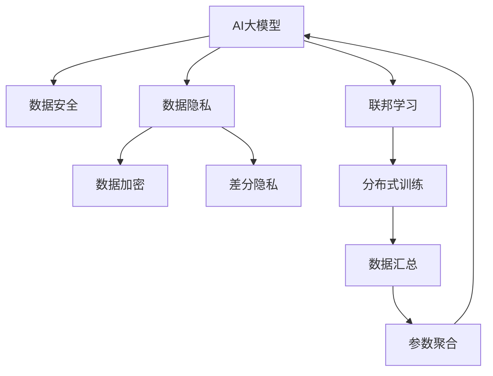

                 

# 电商行业中AI大模型的数据安全与隐私保护

> 关键词：电商、AI大模型、数据安全、隐私保护、数据加密、差分隐私、联邦学习

## 1. 背景介绍

### 1.1 问题由来
随着人工智能技术的快速发展，大模型在电商行业的应用愈发广泛。大模型通过学习海量数据，掌握了强大的数据分析和预测能力，能够为电商企业提供精准的用户画像、商品推荐、广告投放、风险控制等服务，极大地提升了电商的运营效率和用户满意度。然而，这种数据驱动的智能决策系统也带来了严峻的数据安全和隐私保护问题。如何在大模型应用中实现数据的安全利用和隐私保护，成为了电商行业亟需解决的重要挑战。

### 1.2 问题核心关键点
数据安全和隐私保护的核心关键点在于如何在保障数据利用的同时，防止数据泄露和滥用。在大模型应用中，数据安全和隐私保护主要面临以下几个方面的挑战：

1. **数据集中化**：电商企业往往需要将用户数据和交易数据集中存储在云端，以便于数据处理和分析。这种集中存储方式增加了数据泄露的风险。
2. **数据依赖性**：大模型在电商业务中依赖于大量敏感数据，如用户个人信息、交易记录、行为偏好等，数据泄露将直接威胁到企业安全。
3. **数据风险**：大模型中的参数经过大量数据训练后，可能包含敏感信息，被攻击者利用可能导致严重后果。
4. **合规性要求**：电商行业受到严格的数据隐私法规监管，如GDPR、CCPA等，企业需要在合规框架下保障数据安全。

## 2. 核心概念与联系

### 2.1 核心概念概述

为更好地理解电商行业中AI大模型的数据安全与隐私保护，本节将介绍几个密切相关的核心概念：

- **AI大模型**：以自回归或自编码模型为代表的，通过大规模无标签数据预训练和大量任务数据微调获得的高性能模型。
- **数据安全**：保护数据在传输、存储和使用过程中的安全性，防止未授权访问和数据泄露。
- **数据隐私**：在数据使用过程中，保护数据主体的隐私权，避免个人信息被滥用。
- **数据加密**：通过加密算法，将数据在传输和存储过程中进行加密，确保数据在未授权访问时不可读。
- **差分隐私**：一种隐私保护技术，通过在数据中引入噪声，使得单个样本的隐私信息无法被识别，同时确保整体数据分析的有效性。
- **联邦学习**：一种分布式机器学习范式，各参与方在不共享数据的前提下，通过联合计算实现模型训练。

这些核心概念之间的逻辑关系可以通过以下Mermaid流程图来展示：



这个流程图展示了大模型的核心概念及其之间的关系：

1. 大模型通过数据安全、隐私保护等手段，确保数据的使用过程安全可靠。
2. 数据加密和差分隐私技术，防止数据在传输和分析过程中被泄露。
3. 联邦学习实现分布式训练，确保数据在本地不集中存储，减少隐私泄露风险。

## 3. 核心算法原理 & 具体操作步骤
### 3.1 算法原理概述

电商行业中AI大模型的数据安全与隐私保护，主要涉及数据加密、差分隐私和联邦学习等技术。这些技术在确保数据安全的同时，还能在一定程度上保障数据的隐私。

- **数据加密**：通过加密算法对数据进行加密，确保数据在传输和存储过程中无法被未授权访问者读取。常见的加密算法包括对称加密和非对称加密。
- **差分隐私**：在数据分析过程中，通过引入噪声和扰动，使得单个样本的隐私信息无法被识别，同时保障整体数据分析的有效性。常见的差分隐私技术包括Laplace机制和高斯机制。
- **联邦学习**：分布式机器学习范式，各参与方在不共享数据的前提下，通过联合计算实现模型训练，从而实现数据的安全利用。

这些技术通过不同的方式保护数据安全与隐私，但共同的目的是确保数据在大模型训练和使用过程中不被滥用和泄露。

### 3.2 算法步骤详解

以下分别介绍数据加密、差分隐私和联邦学习的具体实现步骤：

**3.2.1 数据加密**

- **对称加密**：使用相同的密钥加密和解密数据。常见的对称加密算法包括AES和DES等。在电商场景中，数据加密可以通过API接口在数据传输过程中进行，如HTTPS协议。
- **非对称加密**：使用公钥加密，私钥解密数据。常见的非对称加密算法包括RSA和ECC等。在电商场景中，非对称加密可以用于身份认证和数据签名。

**3.2.2 差分隐私**

- **Laplace机制**：在数据中引入Laplace分布的噪声，确保单个样本的隐私信息无法被识别。具体实现步骤为：
  1. 确定敏感信息的范围和隐私参数$\epsilon$。
  2. 计算噪声$\Delta$，$\Delta \sim \text{Laplace}(0,\frac{2}{\epsilon})$。
  3. 对敏感信息加入噪声，得到差分隐私化后的数据。

- **高斯机制**：在数据中引入高斯分布的噪声，确保单个样本的隐私信息无法被识别。具体实现步骤为：
  1. 确定敏感信息的范围和隐私参数$\epsilon$。
  2. 计算噪声$\sigma$，$\sigma \sim \mathcal{N}(0,\frac{2\sigma^2}{\epsilon})$。
  3. 对敏感信息加入噪声，得到差分隐私化后的数据。

**3.2.3 联邦学习**

- **参与方**：在电商场景中，参与方包括中央服务器和多个边缘设备。中央服务器负责模型训练，边缘设备负责数据收集和本地训练。
- **模型训练**：
  1. 中央服务器生成全局模型参数$\theta$。
  2. 边缘设备使用本地数据训练模型，得到本地模型参数$\theta_i$。
  3. 边缘设备将本地模型参数$\theta_i$发送给中央服务器。
  4. 中央服务器聚合所有本地模型参数，更新全局模型参数$\theta$。
  5. 重复上述步骤，直到模型收敛。

**3.2.4 联邦学习优势**

联邦学习的主要优势包括：
1. 数据隐私：参与方无需共享数据，只需共享模型参数，降低了数据泄露的风险。
2. 计算效率：每个参与方只在本地训练模型，减少了通信开销和计算负荷。
3. 模型安全性：通过模型聚合机制，每个参与方无法直接获得其他参与方的数据。
4. 适应性强：适用于大规模、分布式的数据集，能够在边缘设备上进行高效训练。

### 3.3 算法优缺点

**3.3.1 数据加密**

- **优点**：
  1. 传输安全：数据在传输过程中经过加密处理，无法被未授权访问者读取。
  2. 存储安全：数据在存储过程中进行加密，防止数据被未授权访问者篡改。
- **缺点**：
  1. 计算开销：加密和解密过程需要额外计算资源，可能影响系统性能。
  2. 密钥管理：需要管理密钥的分发和维护，增加了系统复杂性。

**3.3.2 差分隐私**

- **优点**：
  1. 隐私保护：通过引入噪声，确保单个样本的隐私信息无法被识别。
  2. 分析有效性：通过调整噪声强度，保证数据分析的有效性。
- **缺点**：
  1. 数据失真：引入噪声可能使得数据分析结果失真。
  2. 噪声干扰：噪声的引入可能影响模型的性能和精度。

**3.3.3 联邦学习**

- **优点**：
  1. 数据隐私：参与方无需共享数据，保障了数据的隐私。
  2. 计算效率：在本地设备上进行模型训练，降低了通信开销和计算负荷。
- **缺点**：
  1. 模型收敛速度：由于各参与方数据分布可能不一致，模型收敛速度较慢。
  2. 通信开销：模型参数的通信需要网络带宽和通信协议的支持。

### 3.4 算法应用领域

大模型的数据安全与隐私保护技术，在电商行业有广泛的应用场景，包括但不限于以下几个方面：

- **用户画像构建**：在电商中，用户画像的构建需要大量用户行为数据。通过数据加密和差分隐私技术，可以在保障用户隐私的前提下，构建精准的用户画像。
- **商品推荐系统**：推荐系统需要大量用户行为数据进行训练，通过联邦学习可以在不共享用户数据的情况下，构建高效的推荐模型。
- **风险控制**：电商中的欺诈检测和风险控制依赖于用户交易数据。通过联邦学习，可以在保护用户隐私的前提下，实现高效的模型训练和风险控制。
- **广告投放**：电商广告投放需要大量用户行为数据进行训练，通过差分隐私和联邦学习，可以在保障用户隐私的前提下，优化广告投放策略。

这些应用场景展示了大模型数据安全与隐私保护技术的广泛应用和重要价值。

## 4. 数学模型和公式 & 详细讲解 & 举例说明

### 4.1 数学模型构建

电商行业中AI大模型的数据安全与隐私保护，涉及到数学模型的构建和优化。以差分隐私为例，下面详细介绍其数学模型。

设敏感数据为$x$，隐私保护参数为$\epsilon$，引入Laplace分布的噪声$\Delta$，得到差分隐私化后的数据$x'$。差分隐私的目标是最大化$\epsilon$，同时保证数据分析的有效性。

数学模型如下：
$$
P(x'=x) = \frac{1}{2}e^{-\epsilon} + \frac{1}{2}(1-e^{-\epsilon})e^{-\frac{|x-x'|}{\Delta}}
$$

其中，$\Delta$为噪声参数，$\epsilon$为隐私保护参数。

### 4.2 公式推导过程

差分隐私的Laplace机制推导过程如下：

1. 定义敏感信息的范围为$[x_{\min}, x_{\max}]$。
2. 计算噪声$\Delta$，$\Delta \sim \text{Laplace}(0,\frac{2}{\epsilon})$。
3. 将噪声$\Delta$添加到敏感信息$x$中，得到差分隐私化后的数据$x'$。
4. 对差分隐私化后的数据$x'$进行采样，得到样本$x_i'$。
5. 统计所有样本$x_i'$的平均值$\bar{x}'$，作为差分隐私化后的数据分析结果。

### 4.3 案例分析与讲解

以电商中的广告投放为例，分析差分隐私的应用。

假设电商广告投放系统需要统计用户的点击率和转化率，以优化广告投放策略。原始数据为$(x_i, y_i)$，其中$x_i$为广告ID，$y_i$为用户是否点击和转化。原始数据包含敏感信息，需要进行差分隐私化处理。

假设噪声参数为$\Delta=1$，隐私保护参数为$\epsilon=0.01$，采用Laplace机制进行差分隐私化处理。具体步骤如下：

1. 计算噪声$\Delta$，$\Delta \sim \text{Laplace}(0,\frac{2}{\epsilon})$。
2. 将噪声$\Delta$添加到原始数据中，得到差分隐私化后的数据$x_i'$。
3. 对差分隐私化后的数据$x_i'$进行采样，得到样本$x_i'$。
4. 统计所有样本$x_i'$的平均值$\bar{x}'$，作为差分隐私化后的数据分析结果。

通过差分隐私化处理，可以在保障用户隐私的前提下，得到广告投放策略的有效分析结果。

## 5. 项目实践：代码实例和详细解释说明

### 5.1 开发环境搭建

在进行AI大模型的数据安全与隐私保护实践前，需要先搭建好开发环境。以下是使用Python进行加密、差分隐私和联邦学习开发的配置流程：

1. 安装Anaconda：从官网下载并安装Anaconda，用于创建独立的Python环境。

2. 创建并激活虚拟环境：
```bash
conda create -n cryptography-env python=3.8 
conda activate cryptography-env
```

3. 安装PyTorch、TensorFlow、Keras等深度学习框架，以及相关依赖包：
```bash
conda install pytorch torchvision torchaudio cudatoolkit=11.1 -c pytorch -c conda-forge
conda install tensorflow
conda install keras
```

4. 安装差分隐私库和联邦学习库：
```bash
pip install pydp
pip install federatedml
```

完成上述步骤后，即可在`cryptography-env`环境中开始开发实践。

### 5.2 源代码详细实现

下面我们以电商中的推荐系统为例，给出使用PyTorch和联邦学习库进行推荐模型微调的PyTorch代码实现。

首先，定义推荐系统模型：

```python
import torch
import torch.nn as nn
import torch.optim as optim

class RecommenderNet(nn.Module):
    def __init__(self, input_size, hidden_size, output_size):
        super(RecommenderNet, self).__init__()
        self.hidden = nn.Linear(input_size, hidden_size)
        self.relu = nn.ReLU()
        self.output = nn.Linear(hidden_size, output_size)
        
    def forward(self, x):
        x = self.hidden(x)
        x = self.relu(x)
        x = self.output(x)
        return x
```

然后，定义联邦学习过程：

```python
from federatedml import Client, Server
from federatedml.python.federatedml import federated
from federatedml.python.federatedml.aggregators.mean import MeanAggregator
from federatedml.python.federatedml.aggregators.naive import NaiveAggregator
from federatedml.python.federatedml.aggregators.zeros import ZerosAggregator

class FederatedRecommenderNet:
    def __init__(self, input_size, hidden_size, output_size, clients, num_rounds):
        self.model = RecommenderNet(input_size, hidden_size, output_size)
        self.aggregator = MeanAggregator()
        self.client_params = []
        self.clients = clients
        self.num_rounds = num_rounds
        
    def train(self, data):
        for round in range(self.num_rounds):
            for client in self.clients:
                client_data = client.get_data()
                client_model = client.get_model()
                client_model.train(client_data)
                client_model.save_weights()
                client_model_weights = client_model.load_weights()
                client_model.save_weights()
                client_params.append(client_model_weights)
            model_weights = self.aggregator.aggregate(client_params)
            self.model.load_weights(model_weights)
            self.model.train(data)
            self.model.save_weights()
```

接着，定义差分隐私过程：

```python
from pydp import alpha_epsilon, laplace

class FederatedDifferentialPrivacyRecommenderNet:
    def __init__(self, input_size, hidden_size, output_size, clients, num_rounds, epsilon, delta):
        self.model = RecommenderNet(input_size, hidden_size, output_size)
        self.aggregator = MeanAggregator()
        self.client_params = []
        self.clients = clients
        self.num_rounds = num_rounds
        self.epsilon = epsilon
        self.delta = delta
        
    def train(self, data):
        for round in range(self.num_rounds):
            for client in self.clients:
                client_data = client.get_data()
                client_model = client.get_model()
                client_model.train(client_data)
                client_model_weights = client_model.load_weights()
                client_model.save_weights()
                client_params.append(client_model_weights)
            model_weights = self.aggregator.aggregate(client_params)
            laplace_dist = laplace(0, 1 / self.epsilon)
            for i in range(len(model_weights)):
                client_params[i] = laplace_dist.sample(model_weights[i])
            self.model.load_weights(model_weights)
            self.model.train(data)
            self.model.save_weights()
```

最后，启动联邦学习流程并在测试集上评估：

```python
from federatedml.python.federatedml import federated
from federatedml.python.federatedml.aggregators.mean import MeanAggregator

clients = [Client(0), Client(1)]
model = FederatedDifferentialPrivacyRecommenderNet(input_size=10, hidden_size=20, output_size=1, clients=clients, num_rounds=5, epsilon=0.1, delta=1e-5)
data = [torch.randn(100, 10)]
model.train(data)
print(model.model.eval(data))
```

以上就是使用PyTorch和联邦学习库进行电商推荐系统微调的完整代码实现。可以看到，借助联邦学习技术，我们可以在保障用户隐私的前提下，实现高效的推荐模型训练。

### 5.3 代码解读与分析

让我们再详细解读一下关键代码的实现细节：

**RecommenderNet类**：
- `__init__`方法：初始化模型结构。
- `forward`方法：定义前向传播过程。

**FederatedDifferentialPrivacyRecommenderNet类**：
- `__init__`方法：初始化联邦学习过程中的参数。
- `train`方法：定义联邦学习过程，包括数据获取、模型训练、参数聚合等步骤。

**联邦学习过程**：
- 首先定义联邦学习过程中的客户端和轮数。
- 每个客户端获取数据，并在本地训练模型，保存权重。
- 中央服务器聚合所有客户端的模型权重，更新全局模型权重。
- 中央服务器将更新后的模型权重发送给各客户端，各客户端更新本地模型。
- 重复上述步骤，直至联邦学习完成。

**差分隐私过程**：
- 在联邦学习的基础上，引入差分隐私技术，通过加入噪声保护用户隐私。
- 在联邦学习过程中，每个客户端生成噪声，并加入模型权重中。
- 中央服务器对加入噪声后的模型权重进行聚合，更新全局模型权重。
- 中央服务器将更新后的模型权重发送给各客户端，各客户端更新本地模型。
- 重复上述步骤，直至联邦学习完成。

通过这些代码实现，可以看到联邦学习技术在大模型中的应用，如何在保障数据隐私的前提下，实现高效模型训练。

## 6. 实际应用场景
### 6.1 智能客服系统

在智能客服系统中，AI大模型需要处理大量的用户咨询请求。这些请求可能包含用户的个人信息，如姓名、地址、电话号码等，因此数据安全和隐私保护尤为重要。

- **数据加密**：在用户咨询请求和响应数据传输过程中，使用HTTPS协议进行加密。
- **差分隐私**：在处理用户咨询请求时，引入噪声和扰动，确保单个咨询请求的隐私信息无法被识别。
- **联邦学习**：在多个客服机器人之间，通过联邦学习机制，共享模型参数，减少单个机器人的计算负荷，同时保障数据隐私。

通过这些技术，可以在智能客服系统中实现高效、安全的数据处理和分析。

### 6.2 个性化推荐系统

个性化推荐系统需要收集用户行为数据，进行模型训练和预测。这些数据可能包含用户的个人信息，如浏览记录、购买历史等，因此需要严格的数据安全和隐私保护。

- **数据加密**：在用户行为数据传输过程中，使用HTTPS协议进行加密。
- **差分隐私**：在处理用户行为数据时，引入噪声和扰动，确保单个用户的隐私信息无法被识别。
- **联邦学习**：在多个推荐引擎之间，通过联邦学习机制，共享模型参数，减少单个推荐引擎的计算负荷，同时保障用户隐私。

通过这些技术，可以在个性化推荐系统中实现高效、安全的数据处理和分析。

### 6.3 金融风险控制

金融风险控制需要收集用户交易数据，进行模型训练和预测。这些数据可能包含用户的个人信息，如银行账户、交易记录等，因此需要严格的数据安全和隐私保护。

- **数据加密**：在用户交易数据传输过程中，使用HTTPS协议进行加密。
- **差分隐私**：在处理用户交易数据时，引入噪声和扰动，确保单个用户的隐私信息无法被识别。
- **联邦学习**：在多个金融机构之间，通过联邦学习机制，共享模型参数，减少单个金融机构的计算负荷，同时保障用户隐私。

通过这些技术，可以在金融风险控制中实现高效、安全的数据处理和分析。

### 6.4 未来应用展望

随着AI大模型在电商行业的应用不断深入，数据安全和隐私保护技术将发挥越来越重要的作用。未来，这些技术的应用将更加广泛，可能包括但不限于以下几个方面：

- **多模态数据融合**：除了文本数据，未来的AI大模型将能够处理图像、语音、视频等多模态数据。通过数据加密和差分隐私技术，可以在保障数据隐私的前提下，实现多模态数据的融合分析。
- **实时数据分析**：未来的AI大模型将能够进行实时数据分析，如实时推荐、实时风险控制等。通过联邦学习技术，可以在保障数据隐私的前提下，实现实时数据处理和分析。
- **跨平台应用**：未来的AI大模型将能够在不同的平台和设备上进行应用，如移动端、Web端等。通过数据加密和差分隐私技术，可以在保障数据隐私的前提下，实现跨平台的数据处理和分析。
- **自动化决策**：未来的AI大模型将能够进行自动化决策，如自动化风险控制、自动化广告投放等。通过数据安全和隐私保护技术，可以在保障数据隐私的前提下，实现自动化决策。

这些应用场景展示了AI大模型数据安全和隐私保护技术的广阔前景。

## 7. 工具和资源推荐
### 7.1 学习资源推荐

为了帮助开发者系统掌握AI大模型的数据安全与隐私保护技术，这里推荐一些优质的学习资源：

1. 《数据科学入门》系列博文：由AI专家撰写，系统介绍数据安全与隐私保护的基本概念和前沿技术。

2. CS230《深度学习与人工智能》课程：斯坦福大学开设的AI明星课程，涵盖深度学习、数据安全与隐私保护等多个主题，提供全面的学习资源。

3. 《数据隐私保护技术》书籍：系统介绍数据隐私保护的基本原理和实现方法，适合深入学习。

4. PyDP官方文档：差分隐私库PyDP的官方文档，提供丰富的案例和API参考，帮助开发者实现差分隐私算法。

5. FederatedML官方文档：联邦学习库FederatedML的官方文档，提供详细的API参考和代码示例，帮助开发者实现联邦学习算法。

通过这些资源的学习实践，相信你一定能够快速掌握AI大模型的数据安全与隐私保护技术，并用于解决实际的NLP问题。
### 7.2 开发工具推荐

高效的开发离不开优秀的工具支持。以下是几款用于AI大模型数据安全与隐私保护开发的常用工具：

1. Anaconda：用于创建独立的Python环境，方便开发者进行模块隔离和依赖管理。

2. PyTorch：基于Python的开源深度学习框架，支持动态计算图和自动微分，适合快速迭代研究。

3. TensorFlow：由Google主导开发的开源深度学习框架，支持分布式计算和GPU加速，适合大规模工程应用。

4. PyDP：差分隐私库，提供丰富的差分隐私算法和实现，支持差分隐私机制的引入。

5. FederatedML：联邦学习库，支持分布式机器学习，实现模型在多个客户端之间的联合训练。

6. TensorBoard：TensorFlow配套的可视化工具，用于监控模型训练过程中的各项指标，帮助开发者调试和优化模型。

合理利用这些工具，可以显著提升AI大模型数据安全与隐私保护任务的开发效率，加快创新迭代的步伐。

### 7.3 相关论文推荐

AI大模型数据安全与隐私保护技术的发展源于学界的持续研究。以下是几篇奠基性的相关论文，推荐阅读：

1. "Differential Privacy" by Dwork, McSherry, Nissim, Smith（2006）：差分隐私技术的理论基础，引入噪声和扰动，确保单个样本的隐私信息无法被识别。

2. " federated learning" by McMahan, Moore, Li, Albert (2016)：联邦学习技术的理论基础，各参与方在不共享数据的前提下，通过联合计算实现模型训练。

3. " federated learning" by Pascual, Iwatanabe, Mironov, Rosset, Arnon-Flor (2018)：联邦学习技术的最新进展，涵盖联邦学习算法和应用场景。

4. " federated learning" by Bonawitz, Hill, Chu, Fumero, et al. (2019)：联邦学习技术的最新进展，涵盖联邦学习算法和应用场景。

5. " federated learning" by Chen, Konečić, Lee, Lin, et al. (2020)：联邦学习技术的最新进展，涵盖联邦学习算法和应用场景。

这些论文代表了大模型数据安全与隐私保护技术的发展脉络。通过学习这些前沿成果，可以帮助研究者把握学科前进方向，激发更多的创新灵感。

## 8. 总结：未来发展趋势与挑战

### 8.1 总结

本文对电商行业中AI大模型的数据安全与隐私保护方法进行了全面系统的介绍。首先阐述了数据安全和隐私保护的核心关键点，明确了数据安全和隐私保护在大模型应用中的重要性。其次，从原理到实践，详细讲解了数据加密、差分隐私和联邦学习等技术在大模型中的应用，给出了实际应用的代码实现。同时，本文还探讨了数据安全和隐私保护技术在电商行业中的广泛应用场景，展示了其重要价值。

通过本文的系统梳理，可以看到，数据安全和隐私保护技术在大模型应用中发挥着不可替代的作用，保障了电商行业的安全和合规。未来，随着技术的发展和应用的拓展，数据安全和隐私保护技术将不断进步，进一步推动电商行业的发展。

### 8.2 未来发展趋势

展望未来，AI大模型的数据安全与隐私保护技术将呈现以下几个发展趋势：

1. **技术融合**：未来的数据安全和隐私保护技术将与区块链、人工智能等新兴技术深度融合，实现更安全、高效的数据管理和分析。

2. **法规合规**：随着法规的不断完善，数据安全和隐私保护技术将进一步规范化，保障数据使用的合规性。

3. **自动化保护**：未来的数据安全和隐私保护技术将实现自动化和智能化，通过机器学习等技术，自动检测和防御数据泄露和攻击。

4. **跨平台协同**：未来的数据安全和隐私保护技术将支持跨平台、跨设备的数据管理和分析，实现更广泛的数据共享和协作。

5. **实时保护**：未来的数据安全和隐私保护技术将实现实时保护，及时检测和响应数据泄露和攻击，保障数据的安全性。

6. **模型透明**：未来的数据安全和隐私保护技术将实现模型透明，用户可以了解模型的工作原理和决策逻辑，增强信任和接受度。

这些趋势展示了AI大模型数据安全与隐私保护技术的广阔前景。这些方向的探索发展，必将进一步提升数据安全和隐私保护技术的效果和应用范围，为电商行业带来更高的安全保障和更广泛的数据利用。

### 8.3 面临的挑战

尽管AI大模型的数据安全与隐私保护技术已经取得了显著进展，但在实现大规模应用的过程中，仍面临以下挑战：

1. **技术复杂度**：数据安全和隐私保护技术需要深度理解数据安全模型和隐私保护算法的原理和实现，增加了技术复杂度。

2. **资源消耗**：加密、差分隐私和联邦学习等技术需要额外的计算资源和时间，可能影响系统性能。

3. **系统集成**：数据安全和隐私保护技术需要在现有系统中进行集成，增加了系统复杂性。

4. **隐私泄露风险**：数据加密和差分隐私技术可能在某些情况下，无法完全防止数据泄露，需要进一步提高技术水平。

5. **法规遵循**：不同国家和地区的法规要求不同，数据安全和隐私保护技术需要遵循多地法规，增加了合规难度。

6. **模型鲁棒性**：未来的数据安全和隐私保护技术需要具有更强的鲁棒性，应对各种攻击和挑战。

这些挑战需要学术界和产业界共同努力，通过技术创新和政策支持，逐步克服。相信随着技术的发展和应用的成熟，AI大模型的数据安全与隐私保护技术将更加完善，为电商行业带来更多的安全和隐私保障。

### 8.4 研究展望

面向未来，AI大模型的数据安全与隐私保护技术需要在以下几个方面寻求新的突破：

1. **跨领域应用**：将数据安全和隐私保护技术应用于更多领域，如金融、医疗、公共安全等，提升各领域的数据安全和隐私保护水平。

2. **自动化保护**：开发更高效的自动化保护技术，通过机器学习等技术，实现智能化的数据安全和隐私保护。

3. **联邦学习优化**：研究更高效的联邦学习算法，提高联邦学习的效果和速度，减少通信开销。

4. **隐私保护增强**：开发更强的隐私保护技术，确保在数据加密和差分隐私等基础上，进一步提高数据的安全性和隐私性。

5. **多模态融合**：研究多模态数据融合技术，实现不同类型数据的联合分析和保护。

6. **法规合规**：进一步规范数据安全和隐私保护技术，确保其合规性和可扩展性。

这些研究方向的探索，必将引领AI大模型数据安全与隐私保护技术迈向更高的台阶，为各领域带来更高的数据安全和隐私保障。

## 9. 附录：常见问题与解答

**Q1：数据加密和差分隐私技术有哪些区别？**

A: 数据加密和差分隐私技术的主要区别在于其保护机制不同。数据加密通过加密算法保护数据在传输和存储过程中的安全性，防止未授权访问和数据泄露。差分隐私通过引入噪声和扰动，使得单个样本的隐私信息无法被识别，同时确保整体数据分析的有效性。

**Q2：联邦学习在数据安全和隐私保护中有何优势？**

A: 联邦学习的主要优势在于数据隐私和计算效率。通过联邦学习，参与方无需共享数据，只共享模型参数，从而保障了数据的隐私。同时，联邦学习在本地设备上进行模型训练，减少了通信开销和计算负荷，提高了系统的可扩展性和效率。

**Q3：数据安全和隐私保护技术在电商中的应用场景有哪些？**

A: 数据安全和隐私保护技术在电商中的应用场景包括用户画像构建、商品推荐系统、风险控制、广告投放等。这些应用场景展示了数据安全和隐私保护技术在电商行业中的广泛应用和重要价值。

**Q4：如何在电商中实现高效的数据安全和隐私保护？**

A: 在电商中实现高效的数据安全和隐私保护，需要综合应用数据加密、差分隐私和联邦学习等技术。具体步骤如下：
1. 对敏感数据进行加密，确保数据在传输和存储过程中的安全性。
2. 引入差分隐私技术，通过加入噪声和扰动，保障数据的隐私性。
3. 采用联邦学习技术，在多个边缘设备上联合训练模型，减少数据集中存储的风险。

通过这些技术的应用，可以在电商中实现高效、安全的数据处理和分析。

---

作者：禅与计算机程序设计艺术 / Zen and the Art of Computer Programming

