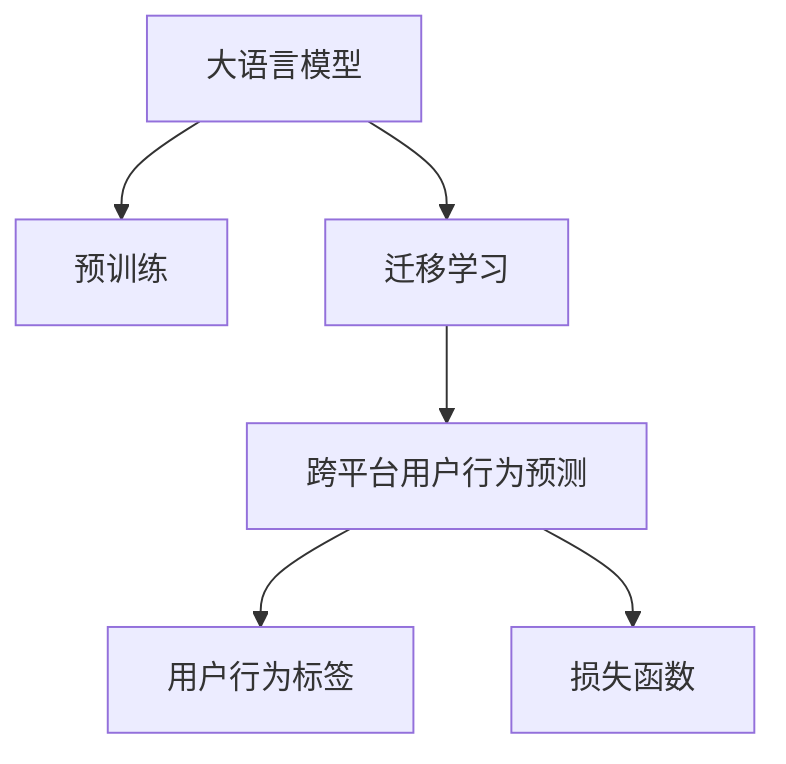

                 

# 电商行业中的迁移学习：大模型在跨平台用户行为预测中的应用

## 1. 背景介绍

### 1.1 问题由来

随着电商行业的发展，各大电商平台之间竞争日益激烈，同时越来越多的跨平台购物行为出现。这种多平台购物行为不仅增加了用户购物的便捷性，还对电商平台的用户行为预测和推荐系统提出了更高的要求。传统平台之间的用户数据往往是孤立的，难以实现跨平台的用户行为预测。因此，如何通过迁移学习（Transfer Learning）利用大模型（Large Language Model, LLM）解决跨平台用户行为预测问题，成为电商行业研究的重要课题。

### 1.2 问题核心关键点

迁移学习是在一个任务上训练好的模型，迁移到另一个任务上继续优化，以提高在新任务上的表现。在电商领域，用户行为预测涉及多个平台，数据孤立，如何通过迁移学习在大模型上得到良好的表现，将是本文的探讨重点。

### 1.3 问题研究意义

本研究旨在通过迁移学习，利用大模型在跨平台用户行为预测中的表现，以期提高跨平台购物行为的预测准确率，优化推荐系统，提升电商平台的个性化推荐和用户体验，最终推动电商行业的发展。

## 2. 核心概念与联系

### 2.1 核心概念概述

为更好地理解大模型在跨平台用户行为预测中的应用，本节将介绍几个密切相关的核心概念：

- **大语言模型（Large Language Model, LLM）**：以自回归模型（如GPT系列）或自编码模型（如BERT、T5等）为代表的大规模预训练语言模型。通过在海量文本数据上进行预训练，学习通用的语言表示，具备强大的语言理解和生成能力。

- **迁移学习（Transfer Learning）**：指将一个领域学习到的知识，迁移应用到另一个不同但相关的领域的学习范式。大模型的预训练-微调过程即是一种典型的迁移学习方式。

- **跨平台用户行为预测（Cross-platform User Behavior Prediction）**：指对用户在不同电商平台上的购物行为进行预测，如浏览历史、购买倾向、支付意图等，以便更好地进行个性化推荐。

- **用户行为标签（User Behavior Label）**：如浏览次数、点击率、购买行为等，用于训练预测模型。

- **损失函数（Loss Function）**：用于衡量模型预测值与真实标签之间的差异，如均方误差（MSE）、交叉熵损失（Cross-Entropy Loss）等。

这些核心概念之间的逻辑关系可以通过以下Mermaid流程图来展示：



这个流程图展示了大模型在跨平台用户行为预测的核心概念及其之间的关系：

1. 大语言模型通过预训练获得基础能力。
2. 迁移学习使得模型能够从单一平台迁移到多个平台，提升跨平台预测能力。
3. 用户行为预测依赖于多个平台的标签数据。
4. 损失函数用于衡量预测准确性，指导模型优化。

这些概念共同构成了大语言模型在电商领域应用的框架，使其能够在各种场景下发挥强大的语言理解和生成能力。通过理解这些核心概念，我们可以更好地把握大语言模型在跨平台用户行为预测中的工作原理和优化方向。

## 3. 核心算法原理 & 具体操作步骤
### 3.1 算法原理概述

在电商行业中的跨平台用户行为预测中，迁移学习利用大模型在预训练阶段学到的通用语言知识，通过微调（Fine-tuning）在大模型上训练新的任务标签，以提高跨平台预测的准确率。该过程通常分为两个阶段：预训练和微调。

- **预训练**：在大规模无标签文本数据上，通过自监督学习任务训练通用语言模型，学习通用的语言表示。
- **微调**：在预训练模型的基础上，使用跨平台用户行为标签数据集，通过有监督学习优化模型在新任务上的表现。

### 3.2 算法步骤详解

基于迁移学习的大模型在跨平台用户行为预测中通常包括以下几个关键步骤：

**Step 1: 准备预训练模型和数据集**

- 选择合适的预训练语言模型 $M_{\theta}$ 作为初始化参数，如BERT、GPT等。
- 准备跨平台用户行为数据集 $D=\{(x_i, y_i)\}_{i=1}^N$，其中 $x_i$ 为用户在各平台上的行为标签，$y_i$ 为预测标签。

**Step 2: 添加任务适配层**

- 根据任务类型，在预训练模型顶层设计合适的输出层和损失函数。
- 对于分类任务，通常在顶层添加线性分类器和交叉熵损失函数。
- 对于回归任务，通常使用均方误差损失函数。

**Step 3: 设置微调超参数**

- 选择合适的优化算法及其参数，如 AdamW、SGD 等，设置学习率、批大小、迭代轮数等。
- 设置正则化技术及强度，包括权重衰减、Dropout、Early Stopping 等。
- 确定冻结预训练参数的策略，如仅微调顶层，或全部参数都参与微调。

**Step 4: 执行梯度训练**

- 将训练集数据分批次输入模型，前向传播计算损失函数。
- 反向传播计算参数梯度，根据设定的优化算法和学习率更新模型参数。
- 周期性在验证集上评估模型性能，根据性能指标决定是否触发 Early Stopping。
- 重复上述步骤直到满足预设的迭代轮数或 Early Stopping 条件。

**Step 5: 测试和部署**

- 在测试集上评估微调后模型 $M_{\hat{\theta}}$ 的性能，对比微调前后的精度提升。
- 使用微调后的模型对新样本进行推理预测，集成到实际的应用系统中。
- 持续收集新的数据，定期重新微调模型，以适应数据分布的变化。

以上是基于迁移学习微调大模型的一般流程。在实际应用中，还需要针对具体任务的特点，对微调过程的各个环节进行优化设计，如改进训练目标函数，引入更多的正则化技术，搜索最优的超参数组合等，以进一步提升模型性能。

### 3.3 算法优缺点

基于迁移学习的大模型在跨平台用户行为预测中具有以下优点：

- 通用适用。适用于多种电商平台的购物行为预测，设计简单的任务适配层即可实现迁移学习。
- 参数高效。利用预训练模型的大规模知识，可以少训练部分参数，提升微调效率。
- 效果显著。在学术界和工业界的诸多任务上，迁移学习方法已经刷新了最先进的性能指标。

同时，该方法也存在一定的局限性：

- 依赖预训练模型。模型的性能很大程度上取决于预训练模型的质量。
- 迁移能力有限。当目标任务与预训练数据的分布差异较大时，迁移学习的性能提升有限。
- 可解释性不足。迁移学习的模型决策过程通常缺乏可解释性，难以对其推理逻辑进行分析和调试。

尽管存在这些局限性，但就目前而言，迁移学习范式仍是大模型在跨平台用户行为预测中最主流的方法。未来相关研究的重点在于如何进一步降低迁移学习对预训练模型的依赖，提高模型的迁移能力和可解释性，同时兼顾模型性能的提升。

### 3.4 算法应用领域

基于大模型迁移学习的方法在电商领域已经得到了广泛的应用，覆盖了如个性化推荐、用户流失预测、库存管理、广告投放优化等多个场景，为电商行业带来了全新的突破。

- **个性化推荐**：根据用户在不同平台上的购物行为，通过迁移学习优化推荐模型，提供更加精准的个性化推荐。
- **用户流失预测**：利用用户在各平台上的行为数据，预测用户流失的可能性，提前采取措施。
- **库存管理**：通过迁移学习预测用户在不同平台的购买需求，优化库存管理，减少浪费。
- **广告投放优化**：根据用户行为预测结果，优化广告投放策略，提高广告投放效果和ROI。

除了上述这些经典应用外，迁移学习技术还被创新性地应用到更多场景中，如用户行为序列分析、实时推荐、动态定价等，为电商行业带来了更多的商业价值。

## 4. 数学模型和公式 & 详细讲解 & 举例说明

### 4.1 数学模型构建

在跨平台用户行为预测中，我们假设预训练模型为 $M_{\theta}$，其中 $\theta$ 为预训练得到的模型参数。给定跨平台用户行为标签数据集 $D=\{(x_i, y_i)\}_{i=1}^N$，迁移学习的优化目标是最小化损失函数，即：

$$
\hat{\theta} = \mathop{\arg\min}_{\theta} \mathcal{L}(M_{\theta}, D)
$$

其中 $\mathcal{L}$ 为针对跨平台用户行为预测设计的损失函数，用于衡量模型预测输出与真实标签之间的差异。常见的损失函数包括交叉熵损失、均方误差损失等。

### 4.2 公式推导过程

以回归任务为例，假设模型 $M_{\theta}$ 在输入 $x_i$ 上的输出为 $\hat{y}_i=M_{\theta}(x_i)$，真实标签为 $y_i$。均方误差损失函数定义为：

$$
\ell(M_{\theta}(x_i),y_i) = \frac{1}{N}\sum_{i=1}^N (\hat{y}_i - y_i)^2
$$

将其代入损失函数公式，得：

$$
\mathcal{L}(\theta) = \frac{1}{N}\sum_{i=1}^N (\hat{y}_i - y_i)^2
$$

根据链式法则，损失函数对参数 $\theta_k$ 的梯度为：

$$
\frac{\partial \mathcal{L}(\theta)}{\partial \theta_k} = \frac{2}{N}\sum_{i=1}^N (\hat{y}_i - y_i) \frac{\partial M_{\theta}(x_i)}{\partial \theta_k}
$$

其中 $\frac{\partial M_{\theta}(x_i)}{\partial \theta_k}$ 可通过反向传播算法高效计算。

在得到损失函数的梯度后，即可带入参数更新公式，完成模型的迭代优化。重复上述过程直至收敛，最终得到适应跨平台用户行为预测的模型参数 $\hat{\theta}$。

### 4.3 案例分析与讲解

考虑电商平台A和平台B上的用户行为预测问题。用户A在平台A上的行为标签为 $[浏览, 点击, 购买]$，行为预测结果为 $\hat{y}_A=1$，表示用户A将会在平台A上进行购买行为。用户A在平台B上的行为标签为 $[浏览, 点击]$，行为预测结果为 $\hat{y}_B=0$，表示用户A不会在平台B上进行购买行为。

基于以上假设，可以构建一个简单的损失函数 $\mathcal{L}$，用于衡量模型在不同平台上的预测误差：

$$
\mathcal{L} = \sum_{i=1}^2 \ell(M_{\theta}(x_i), y_i)
$$

其中 $i$ 表示平台A和平台B，$x_i$ 表示用户在平台的标签数据，$y_i$ 表示预测标签。

通过计算 $\frac{\partial \mathcal{L}(\theta)}{\partial \theta_k}$，利用反向传播算法更新模型参数，最终得到适应跨平台用户行为预测的模型参数 $\hat{\theta}$。这个过程即是大模型迁移学习在电商行业中的具体应用。

## 5. 项目实践：代码实例和详细解释说明
### 5.1 开发环境搭建

在进行迁移学习实践前，我们需要准备好开发环境。以下是使用Python进行PyTorch开发的环境配置流程：

1. 安装Anaconda：从官网下载并安装Anaconda，用于创建独立的Python环境。

2. 创建并激活虚拟环境：
```bash
conda create -n pytorch-env python=3.8 
conda activate pytorch-env
```

3. 安装PyTorch：根据CUDA版本，从官网获取对应的安装命令。例如：
```bash
conda install pytorch torchvision torchaudio cudatoolkit=11.1 -c pytorch -c conda-forge
```

4. 安装TensorFlow：
```bash
conda install tensorflow=2.6
```

5. 安装各类工具包：
```bash
pip install numpy pandas scikit-learn matplotlib tqdm jupyter notebook ipython
```

完成上述步骤后，即可在`pytorch-env`环境中开始迁移学习实践。

### 5.2 源代码详细实现

下面我们以电商领域中的用户行为预测任务为例，给出使用Transformers库对BERT模型进行迁移学习的PyTorch代码实现。

首先，定义用户行为预测的数据处理函数：

```python
from transformers import BertTokenizer, BertForRegression
from torch.utils.data import Dataset, DataLoader
import torch

class UserBehaviorDataset(Dataset):
    def __init__(self, behaviors, labels, tokenizer, max_len=128):
        self.behaviors = behaviors
        self.labels = labels
        self.tokenizer = tokenizer
        self.max_len = max_len
        
    def __len__(self):
        return len(self.behaviors)
    
    def __getitem__(self, item):
        behavior = self.behaviors[item]
        label = self.labels[item]
        
        encoding = self.tokenizer(behavior, return_tensors='pt', max_length=self.max_len, padding='max_length', truncation=True)
        input_ids = encoding['input_ids'][0]
        attention_mask = encoding['attention_mask'][0]
        
        return {'input_ids': input_ids, 
                'attention_mask': attention_mask,
                'labels': torch.tensor(label, dtype=torch.float)}
```

然后，定义模型和优化器：

```python
from transformers import BertForRegression, AdamW

model = BertForRegression.from_pretrained('bert-base-cased', num_labels=1)

optimizer = AdamW(model.parameters(), lr=2e-5)
```

接着，定义训练和评估函数：

```python
from tqdm import tqdm
from sklearn.metrics import mean_squared_error

device = torch.device('cuda') if torch.cuda.is_available() else torch.device('cpu')
model.to(device)

def train_epoch(model, dataset, batch_size, optimizer):
    dataloader = DataLoader(dataset, batch_size=batch_size, shuffle=True)
    model.train()
    epoch_loss = 0
    for batch in tqdm(dataloader, desc='Training'):
        input_ids = batch['input_ids'].to(device)
        attention_mask = batch['attention_mask'].to(device)
        labels = batch['labels'].to(device)
        model.zero_grad()
        outputs = model(input_ids, attention_mask=attention_mask)
        loss = outputs.loss
        epoch_loss += loss.item()
        loss.backward()
        optimizer.step()
    return epoch_loss / len(dataloader)

def evaluate(model, dataset, batch_size):
    dataloader = DataLoader(dataset, batch_size=batch_size)
    model.eval()
    total_loss = 0
    total_preds = []
    with torch.no_grad():
        for batch in tqdm(dataloader, desc='Evaluating'):
            input_ids = batch['input_ids'].to(device)
            attention_mask = batch['attention_mask'].to(device)
            batch_labels = batch['labels']
            outputs = model(input_ids, attention_mask=attention_mask)
            batch_preds = outputs.logits.mean(dim=1).to('cpu').tolist()
            total_preds.extend(batch_preds)
            total_loss += outputs.loss.mean().item()
        
    print(f"Evaluation Loss: {total_loss / len(dataloader):.3f}")
    mse = mean_squared_error(torch.tensor(total_labels), torch.tensor(total_preds))
    print(f"Mean Squared Error: {mse:.3f}")
```

最后，启动训练流程并在测试集上评估：

```python
epochs = 5
batch_size = 16

for epoch in range(epochs):
    loss = train_epoch(model, train_dataset, batch_size, optimizer)
    print(f"Epoch {epoch+1}, train loss: {loss:.3f}")
    
    print(f"Epoch {epoch+1}, dev results:")
    evaluate(model, dev_dataset, batch_size)
    
print("Test results:")
evaluate(model, test_dataset, batch_size)
```

以上就是使用PyTorch对BERT进行用户行为预测任务的迁移学习代码实现。可以看到，得益于Transformers库的强大封装，我们可以用相对简洁的代码完成BERT模型的加载和迁移学习。

### 5.3 代码解读与分析

让我们再详细解读一下关键代码的实现细节：

**UserBehaviorDataset类**：
- `__init__`方法：初始化行为标签、分词器等关键组件。
- `__len__`方法：返回数据集的样本数量。
- `__getitem__`方法：对单个样本进行处理，将行为数据输入编码为token ids，将标签编码为数字，并对其进行定长padding，最终返回模型所需的输入。

**训练和评估函数**：
- 使用PyTorch的DataLoader对数据集进行批次化加载，供模型训练和推理使用。
- 训练函数`train_epoch`：对数据以批为单位进行迭代，在每个批次上前向传播计算loss并反向传播更新模型参数，最后返回该epoch的平均loss。
- 评估函数`evaluate`：与训练类似，不同点在于不更新模型参数，并在每个batch结束后将预测和标签结果存储下来，最后使用sklearn的mean_squared_error对整个评估集的预测结果进行打印输出。

**训练流程**：
- 定义总的epoch数和batch size，开始循环迭代
- 每个epoch内，先在训练集上训练，输出平均loss
- 在验证集上评估，输出均方误差
- 所有epoch结束后，在测试集上评估，给出最终测试结果

可以看到，PyTorch配合Transformers库使得BERT迁移学习的代码实现变得简洁高效。开发者可以将更多精力放在数据处理、模型改进等高层逻辑上，而不必过多关注底层的实现细节。

当然，工业级的系统实现还需考虑更多因素，如模型的保存和部署、超参数的自动搜索、更灵活的任务适配层等。但核心的迁移学习范式基本与此类似。

## 6. 实际应用场景
### 6.1 智能推荐系统

利用大模型迁移学习的方法，电商平台可以快速构建智能推荐系统，提升用户的购物体验。传统推荐系统通常只依赖用户的历史行为数据进行推荐，而智能推荐系统则能结合用户的多平台行为数据，进行跨平台的个性化推荐。

在技术实现上，可以收集用户在不同电商平台上的行为数据，构建跨平台的迁移学习任务，对预训练模型进行微调，获得不同平台上的用户行为预测能力。基于预测结果，可以优化推荐模型，提供更加精准的个性化推荐。

### 6.2 库存管理优化

电商平台通常会面临库存管理的难题，库存过多或过少都会影响用户体验和运营效率。利用大模型迁移学习的方法，电商平台可以预测用户在不同平台的购物需求，从而优化库存管理，避免库存积压或短缺。

在实际应用中，可以收集用户在各平台上的浏览、点击、购买行为数据，使用迁移学习对预训练模型进行微调，得到用户在不同平台上的购物需求预测。基于预测结果，电商平台可以动态调整库存量，确保库存始终保持在最优状态。

### 6.3 用户流失预警

用户流失是电商平台上常见的问题，用户流失不仅影响平台收益，还会对品牌形象造成负面影响。利用大模型迁移学习的方法，电商平台可以预测用户流失的可能性，提前采取措施，减少流失率。

在具体应用中，可以收集用户在不同平台上的行为数据，包括浏览、点击、购买等，利用迁移学习对预训练模型进行微调，得到用户流失的预测概率。基于预测结果，电商平台可以采取针对性的策略，如发送优惠券、提供个性化推荐等，以挽留潜在流失用户。

### 6.4 未来应用展望

随着迁移学习和大模型技术的不断发展，其在电商领域的应用前景将更加广阔。未来，迁移学习可以进一步拓展到更多场景中，如实时推荐、动态定价、营销策略优化等，为电商行业带来更多的商业价值。

在智慧物流领域，迁移学习可以用于预测物流配送路径和库存管理，提高物流效率和配送准确率。在金融领域，迁移学习可以用于预测用户财务状况和信用风险，帮助金融机构制定更好的信贷策略。

总之，大模型迁移学习技术在电商领域的应用，将推动电商行业从传统的模式向智能化、个性化、精准化方向发展，为电商平台的运营和用户体验带来深远影响。相信随着技术的不断进步，迁移学习将为电商行业带来更多的创新和突破。

## 7. 工具和资源推荐
### 7.1 学习资源推荐

为了帮助开发者系统掌握大模型迁移学习的应用，这里推荐一些优质的学习资源：

1. 《Transformers从原理到实践》系列博文：由大模型技术专家撰写，深入浅出地介绍了Transformer原理、BERT模型、迁移学习等前沿话题。

2. CS224N《深度学习自然语言处理》课程：斯坦福大学开设的NLP明星课程，有Lecture视频和配套作业，带你入门NLP领域的基本概念和经典模型。

3. 《Natural Language Processing with Transformers》书籍：Transformers库的作者所著，全面介绍了如何使用Transformers库进行NLP任务开发，包括迁移学习在内的诸多范式。

4. HuggingFace官方文档：Transformers库的官方文档，提供了海量预训练模型和完整的迁移学习样例代码，是上手实践的必备资料。

5. CLUE开源项目：中文语言理解测评基准，涵盖大量不同类型的中文NLP数据集，并提供了基于迁移学习的baseline模型，助力中文NLP技术发展。

通过对这些资源的学习实践，相信你一定能够快速掌握大模型迁移学习的精髓，并用于解决实际的NLP问题。

### 7.2 开发工具推荐

高效的开发离不开优秀的工具支持。以下是几款用于大模型迁移学习开发的常用工具：

1. PyTorch：基于Python的开源深度学习框架，灵活动态的计算图，适合快速迭代研究。大部分预训练语言模型都有PyTorch版本的实现。

2. TensorFlow：由Google主导开发的开源深度学习框架，生产部署方便，适合大规模工程应用。同样有丰富的预训练语言模型资源。

3. Transformers库：HuggingFace开发的NLP工具库，集成了众多SOTA语言模型，支持PyTorch和TensorFlow，是进行迁移学习任务开发的利器。

4. Weights & Biases：模型训练的实验跟踪工具，可以记录和可视化模型训练过程中的各项指标，方便对比和调优。与主流深度学习框架无缝集成。

5. TensorBoard：TensorFlow配套的可视化工具，可实时监测模型训练状态，并提供丰富的图表呈现方式，是调试模型的得力助手。

6. Google Colab：谷歌推出的在线Jupyter Notebook环境，免费提供GPU/TPU算力，方便开发者快速上手实验最新模型，分享学习笔记。

合理利用这些工具，可以显著提升大模型迁移学习的开发效率，加快创新迭代的步伐。

### 7.3 相关论文推荐

大模型迁移学习的发展源于学界的持续研究。以下是几篇奠基性的相关论文，推荐阅读：

1. Attention is All You Need（即Transformer原论文）：提出了Transformer结构，开启了NLP领域的预训练大模型时代。

2. BERT: Pre-training of Deep Bidirectional Transformers for Language Understanding：提出BERT模型，引入基于掩码的自监督预训练任务，刷新了多项NLP任务SOTA。

3. Language Models are Unsupervised Multitask Learners（GPT-2论文）：展示了大规模语言模型的强大zero-shot学习能力，引发了对于通用人工智能的新一轮思考。

4. Parameter-Efficient Transfer Learning for NLP：提出Adapter等参数高效微调方法，在不增加模型参数量的情况下，也能取得不错的迁移学习效果。

5. AdaLoRA: Adaptive Low-Rank Adaptation for Parameter-Efficient Fine-Tuning：使用自适应低秩适应的迁移学习方法，在固定大部分预训练参数的同时，只更新极少量的任务相关参数。

这些论文代表了大模型迁移学习的发展脉络。通过学习这些前沿成果，可以帮助研究者把握学科前进方向，激发更多的创新灵感。

## 8. 总结：未来发展趋势与挑战

### 8.1 总结

本文对基于迁移学习的大模型在电商行业中的跨平台用户行为预测进行了全面系统的介绍。首先阐述了迁移学习和大模型的研究背景和意义，明确了迁移学习在跨平台用户行为预测中的独特价值。其次，从原理到实践，详细讲解了迁移学习的数学模型和关键步骤，给出了迁移学习任务开发的完整代码实例。同时，本文还广泛探讨了迁移学习技术在智能推荐、库存管理、用户流失预测等多个电商场景中的应用前景，展示了迁移学习范式的巨大潜力。此外，本文精选了迁移学习技术的各类学习资源，力求为读者提供全方位的技术指引。

通过本文的系统梳理，可以看到，基于大模型的迁移学习技术在电商领域的应用，能够显著提升电商平台的个性化推荐、库存管理、用户流失预警等关键业务的能力，为电商行业带来新的增长点。迁移学习技术在跨平台用户行为预测中的成功应用，将推动电商行业从传统的模式向智能化、个性化、精准化方向发展，为电商平台的运营和用户体验带来深远影响。

### 8.2 未来发展趋势

展望未来，大模型迁移学习技术在电商领域的应用将呈现以下几个发展趋势：

1. **跨平台数据融合**：随着数据收集技术的进步，跨平台数据的融合将更加容易，电商平台可以更加全面地了解用户行为，提升预测准确率。
2. **实时预测**：基于迁移学习的推荐系统将实现实时预测，提高用户的购物体验和平台的用户粘性。
3. **个性化推荐优化**：未来的个性化推荐系统将更加精准，能够根据用户行为数据进行动态调整，提升推荐效果。
4. **多模态融合**：未来的推荐系统将融合视觉、语音、文本等多种模态数据，提升推荐系统的效果和用户满意度。
5. **用户行为分析**：利用迁移学习技术，对用户行为进行深度分析，揭示用户的潜在需求和偏好，提升营销策略的针对性。

以上趋势凸显了大模型迁移学习技术在电商领域的广阔前景。这些方向的探索发展，必将进一步提升电商平台的推荐系统效果，推动电商行业的发展。

### 8.3 面临的挑战

尽管大模型迁移学习技术在电商领域已经取得了一定的成果，但在迈向更加智能化、普适化应用的过程中，它仍面临以下几个挑战：

1. **数据孤岛问题**：不同平台之间的数据往往是孤立的，难以实现跨平台数据融合。如何解决数据孤岛问题，是迁移学习面临的重要挑战。
2. **隐私保护**：用户隐私保护是大数据应用中的重要问题。如何在保证用户隐私的前提下，实现跨平台数据融合，是迁移学习面临的重要课题。
3. **模型鲁棒性**：迁移学习模型面对小样本和噪声数据时，容易出现过拟合现象，降低预测准确率。如何提升模型的鲁棒性，是迁移学习面临的重要挑战。
4. **算法复杂度**：大模型迁移学习通常需要较大的计算资源和时间成本，如何优化算法复杂度，提升迁移学习的效率，是迁移学习面临的重要课题。
5. **模型可解释性**：迁移学习模型的决策过程通常缺乏可解释性，难以对其推理逻辑进行分析和调试。如何增强模型的可解释性，是迁移学习面临的重要课题。

这些挑战需要我们在未来的研究中加以解决，只有不断优化和改进迁移学习技术，才能更好地应用于电商行业，推动电商行业的发展。

### 8.4 研究展望

面向未来，大模型迁移学习技术在电商领域的研究可以从以下几个方向进行：

1. **跨平台数据融合技术**：研究如何实现跨平台数据的有效融合，提升数据质量，降低数据孤岛问题。
2. **隐私保护机制**：研究如何在保证用户隐私的前提下，实现跨平台数据融合，保护用户数据安全。
3. **模型鲁棒性提升**：研究如何提升迁移学习模型的鲁棒性，应对小样本和噪声数据，提高预测准确率。
4. **算法优化**：研究如何优化算法复杂度，提升迁移学习的效率，降低计算资源和时间成本。
5. **模型可解释性增强**：研究如何增强迁移学习模型的可解释性，提升模型的可解释性和可调试性。

这些研究方向的研究进展，将推动大模型迁移学习技术在电商领域的应用，为电商行业带来更多的商业价值和用户体验提升。相信随着技术的不断进步，大模型迁移学习技术将在电商行业得到更广泛的应用，推动电商行业的发展。

## 9. 附录：常见问题与解答

**Q1：大模型迁移学习是否适用于所有电商平台的预测任务？**

A: 大模型迁移学习在大多数电商平台的预测任务上都能取得不错的效果，特别是对于数据量较小的任务。但对于一些特定领域的任务，如医疗电商、法律电商等，仅仅依靠通用语料预训练的模型可能难以很好地适应。此时需要在特定领域语料上进一步预训练，再进行迁移学习，才能获得理想效果。

**Q2：如何选择合适的迁移学习模型？**

A: 选择合适的迁移学习模型需要考虑多个因素，包括任务的复杂度、数据量、计算资源等。对于简单任务，可以使用较小的预训练模型，如BERT、RoBERTa等；对于复杂任务，可以使用较大的预训练模型，如GPT、T5等。同时，选择模型的超参数也需要考虑任务的特定需求，如学习率、批大小、迭代轮数等。

**Q3：迁移学习过程中如何缓解过拟合问题？**

A: 过拟合是迁移学习面临的主要挑战，尤其是在标注数据不足的情况下。常见的缓解策略包括：
1. 数据增强：通过回译、近义替换等方式扩充训练集
2. 正则化：使用L2正则、Dropout、Early Stopping等避免过拟合
3. 对抗训练：引入对抗样本，提高模型鲁棒性
4. 参数高效微调：只调整少量参数(如Adapter、Prefix等)，减小过拟合风险
5. 多模型集成：训练多个迁移学习模型，取平均输出，抑制过拟合

这些策略往往需要根据具体任务和数据特点进行灵活组合。只有在数据、模型、训练、推理等各环节进行全面优化，才能最大限度地发挥大模型迁移学习的威力。

**Q4：迁移学习模型在落地部署时需要注意哪些问题？**

A: 将迁移学习模型转化为实际应用，还需要考虑以下因素：
1. 模型裁剪：去除不必要的层和参数，减小模型尺寸，加快推理速度
2. 量化加速：将浮点模型转为定点模型，压缩存储空间，提高计算效率
3. 服务化封装：将模型封装为标准化服务接口，便于集成调用
4. 弹性伸缩：根据请求流量动态调整资源配置，平衡服务质量和成本
5. 监控告警：实时采集系统指标，设置异常告警阈值，确保服务稳定性
6. 安全防护：采用访问鉴权、数据脱敏等措施，保障数据和模型安全

大模型迁移学习为电商行业带来了新的技术突破，但如何将强大的性能转化为稳定、高效、安全的业务价值，还需要工程实践的不断打磨。唯有从数据、算法、工程、业务等多个维度协同发力，才能真正实现人工智能技术在垂直行业的规模化落地。总之，迁移学习需要开发者根据具体任务，不断迭代和优化模型、数据和算法，方能得到理想的效果。

---

作者：禅与计算机程序设计艺术 / Zen and the Art of Computer Programming

