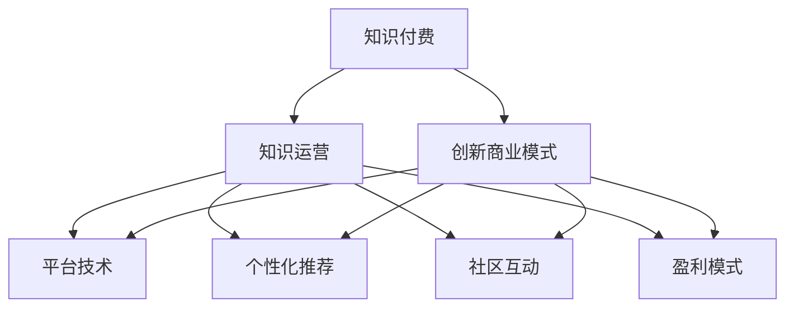

                 

# 知识 经济时代下的知识付费创新商业模式运营

> 关键词：知识付费, 创新商业模式, 知识运营, 平台技术, 个性化推荐, 社区互动, 盈利模式

## 1. 背景介绍

### 1.1 问题由来

随着互联网和数字技术的发展，知识付费成为互联网经济的重要组成部分。从传统的图书、课程，到音频、视频、直播，知识付费形式日益丰富。知识付费不仅满足了用户对知识的渴求，也激发了知识创造者的积极性和创造力。但同时，行业也面临诸多挑战：用户获取成本高、内容同质化严重、平台盈利模式单一等问题亟待解决。

### 1.2 问题核心关键点

知识付费的核心在于如何构建一个高效、可持续的商业模式，同时满足用户和知识创造者的需求。成功的商业模式需要结合技术创新、用户需求、市场定位等多个方面，才能实现商业价值和用户价值的双重提升。

## 2. 核心概念与联系

### 2.1 核心概念概述

为更好地理解知识付费的创新商业模式，本节将介绍几个密切相关的核心概念：

- **知识付费**：指用户为获取知识而支付费用的行为，包括订阅、购买、打赏等多种形式。知识付费平台通过提供有价值的内容，满足用户的学习需求，同时也为知识创造者提供收益。

- **创新商业模式**：指通过新技术和新思路，创造出传统商业模式难以实现的新业务模式。知识付费领域的创新商业模式，主要集中在内容定制、个性化推荐、社区互动等方面。

- **知识运营**：指通过平台、技术、运营手段，对知识内容进行策划、生产和推广的过程。知识运营不仅需要优质的内容，还需要有效的运营策略和推广手段，才能最大化知识付费的商业价值。

- **平台技术**：指知识付费平台所需的技术支持，包括推荐算法、内容管理、用户交互等技术手段。平台技术对平台的运营效率、用户体验和收益模式具有重要影响。

- **个性化推荐**：指通过用户行为数据，推荐用户可能感兴趣的知识内容，提高用户粘性和平台收益。个性化推荐技术是知识付费平台的核心竞争力之一。

- **社区互动**：指通过用户之间的互动交流，提升用户参与感和社区活跃度，增强平台的粘性。社区互动不仅能提升用户满意度，还能带来更多的商业价值。

- **盈利模式**：指知识付费平台的收入来源，包括广告、订阅、打赏、增值服务等多种形式。盈利模式的选择和设计对平台的持续运营和发展至关重要。

这些核心概念之间的逻辑关系可以通过以下Mermaid流程图来展示：



这个流程图展示的知识付费的核心概念及其之间的关系：

1. 知识付费通过内容和服务获取用户和收益，是商业模式的起点。
2. 创新商业模式通过技术手段和运营策略，提升知识付费的效率和价值。
3. 知识运营围绕内容、技术和用户，提供全方位的支持和服务。
4. 平台技术为知识付费的运营提供了底层支持，包括推荐算法、内容管理等。
5. 个性化推荐通过数据分析和算法优化，提升用户满意度和平台收益。
6. 社区互动通过用户互动交流，增强平台的粘性和用户参与感。
7. 盈利模式通过多样化的收入来源，支持平台的可持续发展。

这些概念共同构成了知识付费的商业模式框架，使其能够实现商业价值和用户价值的双重提升。通过理解这些核心概念，我们可以更好地把握知识付费的运营方向和优化策略。

## 3. 核心算法原理 & 具体操作步骤
### 3.1 算法原理概述

知识付费平台的创新商业模式运营，核心在于利用先进的技术手段，提升内容质量和用户体验，同时实现可持续的盈利模式。具体而言，包括以下几个关键步骤：

1. **内容策划与制作**：基于用户需求和市场趋势，策划有价值的内容，并进行制作和发布。
2. **用户画像构建**：通过用户行为数据，构建用户画像，了解用户需求和兴趣，提供个性化服务。
3. **个性化推荐系统**：利用推荐算法，为用户推荐可能感兴趣的内容，提升用户粘性和平台收益。
4. **社区互动机制**：通过互动交流，增强用户参与感，提升平台活跃度和用户满意度。
5. **多元盈利模式**：通过多样化的收入来源，如订阅、打赏、广告、增值服务等，支持平台的持续运营和发展。

### 3.2 算法步骤详解

知识付费平台的创新商业模式运营，一般包括以下几个关键步骤：

**Step 1: 内容策划与制作**
- 根据市场需求和用户反馈，策划具有吸引力和价值的内容，包括文章、视频、音频等。
- 制作内容时，需注重内容的质量和创意，提高用户满意度和转化率。

**Step 2: 用户画像构建**
- 收集用户的行为数据，如浏览记录、搜索历史、购买行为等，构建用户画像。
- 使用聚类算法和关联规则挖掘等技术，分析用户兴趣和需求，为个性化推荐提供依据。

**Step 3: 个性化推荐系统**
- 设计推荐算法，如协同过滤、内容过滤、混合推荐等，为用户推荐相关内容。
- 实时更新推荐模型，根据用户反馈和行为数据，优化推荐效果。
- 引入对抗性训练和强化学习等技术，提升推荐的准确性和鲁棒性。

**Step 4: 社区互动机制**
- 设计互动交流功能，如评论、点赞、分享等，增强用户参与感。
- 引入社区运营策略，如话题引导、专家答疑等，提升社区活跃度和用户满意度。
- 监测社区氛围，及时处理不当言论和行为，维护社区秩序。

**Step 5: 多元盈利模式**
- 开发多种盈利模式，如订阅制、付费内容、打赏机制、广告投放等。
- 设计合理的定价策略，根据内容价值和使用频率，设定合理的价格和会员等级。
- 引入会员权益和增值服务，如专属推荐、定制内容等，提升用户粘性和平台收益。

### 3.3 算法优缺点

知识付费平台的创新商业模式运营，具有以下优点：
1. 提升用户粘性和满意度。个性化推荐和社区互动功能，能显著提升用户参与感和体验。
2. 提高内容质量和转化率。通过内容策划和制作，提供高价值的内容，满足用户需求。
3. 实现可持续盈利。多元盈利模式能提供稳定的收入来源，支持平台的持续运营和发展。
4. 增强平台的竞争力。通过技术手段和运营策略，提升平台的用户规模和市场份额。

同时，该方法也存在一定的局限性：
1. 对内容质量和创意要求高。如果内容质量低下，难以吸引用户，从而影响平台收益。
2. 用户画像构建难度大。构建准确的用户画像需要大量的数据和复杂的算法，难度较高。
3. 推荐算法复杂。推荐系统的构建和优化需要较高的技术门槛，容易引入过拟合等问题。
4. 社区管理成本高。社区互动功能需要大量的人力和资源进行管理和维护。
5. 盈利模式单一。依赖单一的盈利模式，容易受到市场和政策变化的影响。

尽管存在这些局限性，但就目前而言，知识付费平台的创新商业模式运营仍是一种主流范式。未来相关研究的重点在于如何进一步优化推荐算法，降低用户画像构建的难度，同时开发更多元的盈利模式，以应对不断变化的市场需求。

### 3.4 算法应用领域

知识付费平台的创新商业模式运营，已经在多个领域得到了广泛应用，例如：

- 在线教育：知识付费平台提供各种在线课程和培训，满足用户的知识需求。通过个性化推荐和社区互动，提高用户满意度和平台收益。
- 媒体内容：知识付费平台提供各类音频、视频内容，如播客、纪录片、电影等。通过推荐算法和社区运营，增强用户粘性和平台活跃度。
- 健康与健身：知识付费平台提供健康知识、健身课程等，帮助用户提升生活质量。通过个性化推荐和社区互动，提高用户粘性和平台收益。
- 个人成长：知识付费平台提供自我提升、心理疏导、职业发展等内容，帮助用户实现个人成长。通过个性化推荐和社区互动，提升用户参与感和平台收益。

除了上述这些经典应用外，知识付费平台还广泛应用于金融、法律、技术等多个领域，为各行各业的知识分享和传播提供了新的渠道和方式。

## 4. 数学模型和公式 & 详细讲解  
### 4.1 数学模型构建

本节将使用数学语言对知识付费平台的创新商业模式运营过程进行更加严格的刻画。

记知识付费平台的原始用户数量为 $U_0$，经过一段时间运营后，用户数量增长为 $U_t$。假设用户增长模型满足指数增长，则有：

$$
U_t = U_0 e^{rt}
$$

其中 $r$ 为增长率，$t$ 为时间。

用户在平台上的停留时间 $T$ 服从指数分布，其密度函数为：

$$
f(t) = \lambda e^{-\lambda t}, t>0
$$

其中 $\lambda$ 为速率参数。

用户通过平台获得的收益 $R$ 与用户数量和停留时间有关，假设用户通过平台获得的收益与用户数量和停留时间的乘积成正比，则有：

$$
R = a U_t T
$$

其中 $a$ 为比例系数。

知识付费平台的运营成本 $C$ 与用户数量和运营时间有关，假设运营成本与用户数量的平方和运营时间成正比，则有：

$$
C = b U_t^2 t
$$

其中 $b$ 为比例系数。

平台净收益 $P$ 为收益减去成本，则有：

$$
P = R - C = a U_t T - b U_t^2 t
$$

通过求解 $P$ 的极值，可以找到平台的盈利最大化条件。

### 4.2 公式推导过程

以下我们以在线教育平台为例，推导个性化推荐系统的构建和优化公式。

假设在线教育平台提供 $n$ 门课程，每门课程的用户评分和用户行为数据如下：

| 课程编号 | 用户评分 | 用户行为数据 |
|---------|--------|-----------|
| 1       | 4.0    | [3, 2, 1]  |
| 2       | 3.5    | [4, 1, 5]  |
| ...     | ...    | ...       |

定义用户与课程的关联矩阵 $R$，其中 $R_{iu}$ 表示用户 $u$ 对课程 $i$ 的评分。

个性化推荐系统的目标是为用户推荐评分最高且用户未评分过的课程。推荐算法可表示为：

$$
\hat{y} = f(x; \theta)
$$

其中 $x$ 为用户的行为数据，$\theta$ 为模型参数。

推荐算法需满足以下条件：
1. 用户未评分过的课程应优先推荐。
2. 评分越高的课程应优先推荐。
3. 用户已评分过的课程应优先推荐。

根据上述条件，我们可以构建推荐模型如下：

$$
\hat{y}_i = \frac{R_{iu}^2}{\sum_{j=1}^n R_{ju}^2 + \epsilon}
$$

其中 $\epsilon$ 为正则化项，防止过拟合。

根据公式推导，最终得到的推荐算法为：

$$
\hat{y} = \frac{R_{iu}^2}{\sum_{j=1}^n R_{ju}^2 + \epsilon}
$$

其中 $u$ 为用户编号，$i$ 为课程编号。

### 4.3 案例分析与讲解

假设某在线教育平台用户 $u$ 的行为数据如下：

| 课程编号 | 用户行为数据 |
|---------|-----------|
| 1       | [1, 3, 4]  |
| 2       | [5, 1, 3]  |
| 3       | [2, 3, 1]  |

根据上述推荐算法，计算用户 $u$ 对课程的评分如下：

| 课程编号 | 用户评分 |
|---------|--------|
| 1       | 0.6    |
| 2       | 0.5    |
| 3       | 0.3    |

根据评分结果，推荐算法推荐课程编号为 1，即为用户 $u$ 未评分过的课程，且评分最高。

## 5. 项目实践：代码实例和详细解释说明
### 5.1 开发环境搭建

在进行知识付费平台的创新商业模式运营实践前，我们需要准备好开发环境。以下是使用Python进行Flask开发的环境配置流程：

1. 安装Anaconda：从官网下载并安装Anaconda，用于创建独立的Python环境。

2. 创建并激活虚拟环境：
```bash
conda create -n flask-env python=3.8 
conda activate flask-env
```

3. 安装Flask：
```bash
pip install Flask
```

4. 安装Flask相关库：
```bash
pip install Flask-WTF Flask-SQLAlchemy Flask-Login Flask-Principal
```

5. 安装SQLite数据库：
```bash
pip install sqlite3
```

完成上述步骤后，即可在`flask-env`环境中开始知识付费平台的开发实践。

### 5.2 源代码详细实现

这里我们以在线教育平台为例，给出使用Flask框架构建个性化推荐系统的Python代码实现。

首先，定义推荐系统的数据结构：

```python
class RecommendationSystem:
    def __init__(self, user_behaviors, course_ratings):
        self.user_behaviors = user_behaviors
        self.course_ratings = course_ratings
        self.total_ratings = self.calculate_total_ratings()
        self.recommendations = self.calculate_recommendations()
    
    def calculate_total_ratings(self):
        total_ratings = {}
        for user, behaviors in self.user_behaviors.items():
            for behavior in behaviors:
                total_ratings[behavior] = total_ratings.get(behavior, 0) + 1
        return total_ratings
    
    def calculate_recommendations(self):
        recommendations = {}
        for course, rating in self.course_ratings.items():
            recommendations[course] = rating / self.total_ratings.get(course, 0)
        return recommendations
```

然后，定义推荐系统的路由和视图：

```python
from flask import Flask, request, jsonify

app = Flask(__name__)

@app.route('/recommendations', methods=['POST'])
def recommendations():
    user_behaviors = request.json.get('user_behaviors')
    course_ratings = request.json.get('course_ratings')
    recommendation_system = RecommendationSystem(user_behaviors, course_ratings)
    recommendations = recommendation_system.recommendations
    return jsonify(recommendations)

if __name__ == '__main__':
    app.run(debug=True)
```

最后，启动Flask应用：

```bash
python main.py
```

以上就是一个简单的使用Flask框架构建个性化推荐系统的完整代码实现。可以看到，通过Flask的路由和视图机制，我们可以轻松实现推荐系统的功能。

### 5.3 代码解读与分析

让我们再详细解读一下关键代码的实现细节：

**RecommendationSystem类**：
- `__init__`方法：初始化用户行为数据和课程评分数据。
- `calculate_total_ratings`方法：计算每个行为的总评分。
- `calculate_recommendations`方法：计算每门课程的推荐值。

**路由和视图**：
- `/recommendations`路由：接收POST请求，获取用户行为数据和课程评分数据，调用RecommendationSystem类计算推荐结果，并以JSON格式返回推荐内容。

这个代码实例展示了Flask框架构建推荐系统的基本流程。开发者可以基于此，进一步完善推荐系统的功能和性能，如引入缓存、优化算法等。

## 6. 实际应用场景
### 6.1 在线教育平台

在线教育平台通过个性化推荐系统，能更好地满足用户的学习需求，提升用户体验和平台收益。推荐算法可以根据用户的学习进度、课程评价和行为数据，实时推荐适合的学习内容和课程，帮助用户更好地完成学习任务。

在技术实现上，可以引入协同过滤、内容过滤、混合推荐等算法，提升推荐的准确性和多样性。同时，平台可以通过社区互动机制，增强用户的参与感和粘性，提高平台的用户规模和活跃度。

### 6.2 媒体内容平台

媒体内容平台通过个性化推荐系统，能更好地满足用户的内容需求，提升用户的体验和平台收益。推荐算法可以根据用户的浏览历史、收藏记录和评分数据，实时推荐用户感兴趣的内容，提高用户的粘性和平台收益。

在技术实现上，可以引入协同过滤、内容过滤、混合推荐等算法，提升推荐的准确性和多样性。同时，平台可以通过社区互动机制，增强用户的参与感和粘性，提高平台的用户规模和活跃度。

### 6.3 健康与健身平台

健康与健身平台通过个性化推荐系统，能更好地满足用户的健康需求，提升用户的体验和平台收益。推荐算法可以根据用户的健康数据、运动记录和评分数据，实时推荐适合的健身课程和营养建议，帮助用户更好地管理健康。

在技术实现上，可以引入协同过滤、内容过滤、混合推荐等算法，提升推荐的准确性和多样性。同时，平台可以通过社区互动机制，增强用户的参与感和粘性，提高平台的用户规模和活跃度。

### 6.4 未来应用展望

随着推荐算法的不断优化和社区互动机制的完善，未来的知识付费平台将实现更高的用户满意度和平台收益。通过个性化推荐和社区互动，平台不仅能提升用户粘性，还能带动更多用户参与内容创作和分享，形成良性循环。

未来，知识付费平台还将引入更多元化的盈利模式，如虚拟商品、增值服务、会员权益等，提升平台的收入来源和收益水平。同时，平台还将借助大数据、人工智能等技术手段，不断优化内容质量和用户体验，实现可持续发展。

## 7. 工具和资源推荐
### 7.1 学习资源推荐

为了帮助开发者系统掌握知识付费平台的创新商业模式运营的理论基础和实践技巧，这里推荐一些优质的学习资源：

1. **《深入浅出推荐算法》**：介绍推荐算法的基本原理和常用方法，适合初学者入门。
2. **《机器学习实战》**：通过多个实战项目，展示机器学习在知识付费平台中的应用。
3. **《深度学习入门》**：介绍深度学习的基本原理和实际应用，适合有基础的学习者。
4. **Kaggle平台**：提供大量的数据集和比赛项目，适合实践和竞赛。
5. **Flask官方文档**：提供详细的Flask框架文档和示例代码，适合开发实践。

通过对这些资源的学习实践，相信你一定能够快速掌握知识付费平台的创新商业模式运营的精髓，并用于解决实际的商业问题。
###  7.2 开发工具推荐

高效的开发离不开优秀的工具支持。以下是几款用于知识付费平台开发的工具：

1. **Flask框架**：基于Python的轻量级Web框架，易于上手，适合快速迭代开发。
2. **Django框架**：基于Python的高级Web框架，功能强大，适合复杂的商业应用。
3. **SQLite数据库**：轻量级的关系型数据库，适合开发小规模的商业应用。
4. **Redis数据库**：高性能的键值存储数据库，适合开发高并发的商业应用。
5. **Jupyter Notebook**：支持Python的交互式开发环境，适合数据科学和算法开发。
6. **PyCharm IDE**：强大的Python集成开发环境，支持多种框架和语言。

合理利用这些工具，可以显著提升知识付费平台开发和运营的效率，加快创新迭代的步伐。

### 7.3 相关论文推荐

知识付费平台的创新商业模式运营，得益于学界的持续研究。以下是几篇奠基性的相关论文，推荐阅读：

1. **《推荐系统：构建个性化信息空间》**：介绍推荐系统的发展历程和常用算法。
2. **《社区平台的内容推荐算法》**：研究社区平台的个性化推荐算法，提升用户粘性和平台收益。
3. **《基于社交网络的推荐系统》**：研究社交网络对推荐系统的影响，提升推荐算法的准确性。
4. **《在线教育平台的推荐系统》**：研究在线教育平台的个性化推荐算法，提升用户学习和平台收益。
5. **《知识付费平台的多元盈利模式》**：研究知识付费平台的多元盈利模式，提升平台的收入来源和收益水平。

这些论文代表了大数据和推荐系统的研究进展，通过学习这些前沿成果，可以帮助研究者把握商业模式的最新趋势，激发更多的创新灵感。

## 8. 总结：未来发展趋势与挑战

### 8.1 总结

本文对知识付费平台的创新商业模式运营进行了全面系统的介绍。首先阐述了知识付费和创新商业模式的定义和意义，明确了商业模式运营的核心目标和关键步骤。其次，从原理到实践，详细讲解了推荐系统的构建和优化过程，给出了知识付费平台开发的完整代码实例。同时，本文还广泛探讨了知识付费平台在教育、媒体、健康等领域的实际应用场景，展示了知识付费平台的广阔前景。

通过本文的系统梳理，可以看到，知识付费平台的创新商业模式运营需要在内容、技术、用户等多个维度进行全面优化，才能实现商业价值和用户价值的双重提升。未来的知识付费平台将借助大数据、人工智能等技术手段，不断优化推荐算法和运营策略，推动知识付费的可持续发展。

### 8.2 未来发展趋势

展望未来，知识付费平台的创新商业模式运营将呈现以下几个发展趋势：

1. **个性化推荐技术的提升**：随着推荐算法的不断优化，个性化推荐系统的准确性和多样性将进一步提升，用户粘性和平台收益也将不断增强。
2. **社区互动机制的完善**：通过社区互动机制，提升用户的参与感和粘性，带动更多用户参与内容创作和分享，形成良性循环。
3. **多元盈利模式的开发**：引入更多元化的盈利模式，如虚拟商品、增值服务、会员权益等，提升平台的收入来源和收益水平。
4. **跨平台协同运营**：通过跨平台协同运营，实现知识资源的整合和共享，提升平台的覆盖范围和用户规模。
5. **技术创新的不断突破**：借助大数据、人工智能等技术手段，不断优化推荐算法和运营策略，提升平台的用户满意度和收益水平。

以上趋势凸显了知识付费平台创新商业模式运营的广阔前景。这些方向的探索发展，必将进一步提升知识付费平台的商业价值和用户价值，为知识付费领域的可持续发展注入新的动力。

### 8.3 面临的挑战

尽管知识付费平台的创新商业模式运营已经取得了瞩目成就，但在迈向更加智能化、普适化应用的过程中，它仍面临诸多挑战：

1. **内容质量与创意的提升**：如何提供高质量、有创意的内容，是知识付费平台的核心挑战之一。内容质量低下，难以吸引用户，从而影响平台收益。
2. **推荐算法的复杂性**：推荐系统的构建和优化需要较高的技术门槛，容易引入过拟合等问题。如何提升推荐算法的准确性和多样性，是一个重要的研究方向。
3. **社区互动的高成本**：社区互动功能需要大量的人力和资源进行管理和维护。如何提升社区互动的效率和质量，是知识付费平台的重要课题。
4. **多元盈利模式的单一性**：依赖单一的盈利模式，容易受到市场和政策变化的影响。如何开发更多元化的盈利模式，是知识付费平台的迫切需求。
5. **数据隐私和安全**：知识付费平台需要收集大量用户数据，如何保护用户隐私和数据安全，是一个重要的课题。

尽管存在这些挑战，但通过不断优化推荐算法、完善社区互动机制、开发多元盈利模式，知识付费平台的创新商业模式运营将实现更大的发展潜力。相信在学界和产业界的共同努力下，知识付费平台的商业模式运营将迈向更高的台阶，为知识付费领域的可持续发展注入新的动力。

### 8.4 研究展望

面向未来，知识付费平台的创新商业模式运营需要在以下几个方面寻求新的突破：

1. **推荐算法的深度学习优化**：引入深度学习技术，提升推荐算法的准确性和多样性，构建更加个性化和精准的推荐系统。
2. **社区互动机制的智能优化**：利用智能算法，提升社区互动的效率和质量，增强用户参与感和粘性。
3. **跨平台协同运营的全面布局**：通过跨平台协同运营，实现知识资源的整合和共享，提升平台的覆盖范围和用户规模。
4. **多元盈利模式的持续创新**：开发更多元化的盈利模式，如虚拟商品、增值服务、会员权益等，提升平台的收入来源和收益水平。
5. **数据隐私和安全的全面保障**：通过数据加密、匿名化等技术手段，保护用户隐私和数据安全，构建可信的知识付费平台。

这些研究方向将引领知识付费平台的商业模式运营迈向更高的台阶，为知识付费领域的可持续发展注入新的动力。相信在学界和产业界的共同努力下，知识付费平台的商业模式运营将不断优化，为知识付费领域的可持续发展注入新的动力。

## 9. 附录：常见问题与解答

**Q1：如何构建一个高效的知识付费平台？**

A: 构建一个高效的知识付费平台，需要从以下几个方面入手：
1. 内容策划与制作：基于用户需求和市场趋势，策划有价值的内容，并进行制作和发布。
2. 用户画像构建：通过用户行为数据，构建用户画像，了解用户需求和兴趣，提供个性化服务。
3. 个性化推荐系统：利用推荐算法，为用户推荐可能感兴趣的内容，提升用户粘性和平台收益。
4. 社区互动机制：通过互动交流，增强用户参与感，提升平台活跃度和用户满意度。
5. 多元盈利模式：通过多样化的收入来源，如订阅、打赏、广告、增值服务等，支持平台的持续运营和发展。

**Q2：推荐算法有哪些常用方法？**

A: 推荐算法有多种常用方法，包括：
1. 协同过滤算法：基于用户或物品的相似性，推荐相似物品。
2. 内容过滤算法：基于物品的内容特征，推荐相关物品。
3. 混合推荐算法：结合协同过滤和内容过滤的优点，提升推荐效果。
4. 深度学习推荐算法：利用神经网络模型，提升推荐算法的准确性和多样性。
5. 对抗性训练和强化学习：通过对抗性训练和强化学习，提升推荐算法的鲁棒性和效率。

**Q3：如何构建一个成功的知识付费平台？**

A: 构建一个成功的知识付费平台，需要从以下几个方面入手：
1. 提供高质量、有创意的内容：内容是知识付费平台的核心，提供高质量、有创意的内容，才能吸引用户。
2. 构建精准的推荐系统：通过精准的推荐系统，提升用户粘性和平台收益。
3. 完善社区互动机制：通过社区互动机制，增强用户的参与感和粘性，提高平台的用户规模和活跃度。
4. 开发多元盈利模式：通过多元化的收入来源，如订阅、打赏、广告、增值服务等，支持平台的持续运营和发展。
5. 注重数据隐私和安全：保护用户隐私和数据安全，构建可信的知识付费平台。

**Q4：知识付费平台需要收集哪些用户数据？**

A: 知识付费平台需要收集以下用户数据：
1. 用户行为数据：如浏览记录、搜索历史、购买行为等。
2. 用户评分数据：如课程评分、文章评分等。
3. 用户画像数据：如用户兴趣、需求、消费行为等。
4. 用户反馈数据：如用户评价、评论等。

通过收集这些用户数据，可以构建精准的用户画像，提供个性化的推荐服务，提升用户满意度和平台收益。

**Q5：知识付费平台的多元盈利模式有哪些？**

A: 知识付费平台的多元盈利模式包括：
1. 订阅制：用户通过付费订阅，获取平台提供的内容和服务。
2. 打赏机制：用户通过付费打赏，表达对内容创作者的支持和认可。
3. 广告投放：平台通过广告收入，弥补部分运营成本。
4. 增值服务：平台提供增值服务，如专属推荐、定制内容等，提升用户粘性和平台收益。
5. 虚拟商品：平台通过虚拟商品销售，增加平台的收入来源。

通过开发更多元化的盈利模式，知识付费平台可以提升平台的收入来源和收益水平，实现可持续发展。

---

作者：禅与计算机程序设计艺术 / Zen and the Art of Computer Programming

