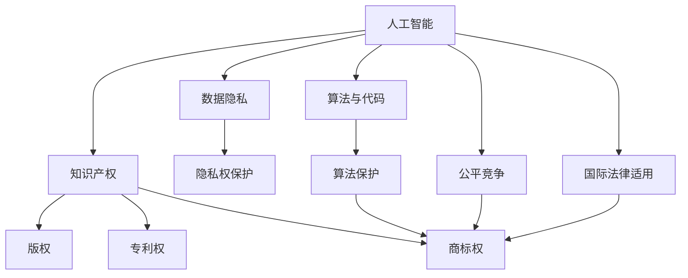

                 

# 知识产权与人工智能的法律挑战

> 关键词：知识产权,人工智能,法律挑战,版权,专利权,商标权,算法,深度学习,神经网络,法律保护

## 1. 背景介绍

### 1.1 问题由来
随着人工智能（AI）技术在各个领域的深入应用，尤其是深度学习和神经网络等技术的发展，知识产权的法律保护问题日益凸显。传统的知识产权法主要是为了保护传统的文学、艺术和商业创新。而随着AI技术的崛起，尤其是在内容创作、自动翻译、图像识别等领域的应用，如何界定和保护AI生成内容的知识产权，成为知识产权法面临的一个新挑战。

### 1.2 问题核心关键点
1. **AI生成内容的知识产权归属**：AI算法生成的大量内容，如文本、图像、音频等，是否属于创造性劳动，能否受到传统知识产权法的保护？
2. **数据使用与隐私保护**：AI模型的训练依赖大量数据，数据的使用如何平衡创新与隐私权？
3. **算法与代码的保护**：深度学习模型和算法，尤其是被视为“黑箱”的神经网络，其保护方式如何界定？
4. **技术共享与公平竞争**：在AI技术开发和应用中，如何平衡技术共享与企业竞争？
5. **跨国法律适用**：AI技术的国际传播如何协调不同国家知识产权法律的适用性？

这些问题不仅是技术层面的挑战，更是法律和伦理层面的复杂问题。正确应对这些挑战，对于推动AI技术的健康发展，促进公平竞争，保护各方合法权益至关重要。

### 1.3 问题研究意义
研究和探讨AI与知识产权的交叉问题，具有以下重要意义：

1. **明确AI内容的法律地位**：为AI内容的知识产权归属提供明确的法律依据，避免法律争议，促进AI技术的创新与应用。
2. **平衡数据使用与隐私保护**：在保障AI算法创新与用户隐私权之间找到平衡点，推动AI技术在数据驱动下的健康发展。
3. **确立算法与代码的保护方式**：为AI算法和代码的保护提供法律保障，促进技术共享与创新。
4. **促进国际合作与公平竞争**：在全球化背景下，如何协调不同国家之间的法律适用，促进AI技术的国际交流与合作，是当前亟待解决的问题。

## 2. 核心概念与联系

### 2.1 核心概念概述

为更好地理解AI与知识产权的法律挑战，本节将介绍几个关键概念：

- **人工智能（AI）**：指通过计算机算法和模型，模拟人类智能行为的技术，包括机器学习、深度学习、自然语言处理等。
- **知识产权**：包括版权、专利权、商标权等，旨在保护创作者对其作品的创造性劳动所享有的权益。
- **数据隐私**：指个人信息不被未经授权的第三方获取、使用和公开的权利。
- **算法与代码**：深度学习模型的核心组件，包括神经网络结构、训练数据、参数等，是AI技术创新的基础。
- **公平竞争**：在AI技术开发和应用中，如何平衡技术共享与企业竞争，促进公平发展。
- **国际法律适用**：在AI技术跨国传播和应用中，不同国家法律之间的协调与适用性问题。

这些概念之间的逻辑关系可以通过以下Mermaid流程图来展示：



这个流程图展示了一些关键概念之间的联系：

1. 人工智能的开发与应用，需要依赖数据、算法和代码的保护。
2. 人工智能的应用，尤其是内容生成，涉及版权、专利权和商标权等知识产权的保护。
3. 数据隐私和算法保护，对于AI技术的公平竞争和国际法律适用具有重要影响。

## 3. 核心算法原理 & 具体操作步骤
### 3.1 算法原理概述

AI与知识产权的法律挑战，核心在于如何界定和保护AI生成内容的知识产权。AI生成内容通常包括文本、图像、音频等，其生成过程通常依赖于大规模数据训练和复杂的算法模型。

以下是AI生成内容的一些主要原理：

1. **深度学习模型的生成机制**：深度学习模型通过多层神经网络，对大量数据进行训练，学习到数据的内在结构与规律，并在此基础上生成新的数据。
2. **生成对抗网络（GANs）**：一种通过两个神经网络相互博弈，生成逼真样本的技术，广泛应用于图像和视频生成。
3. **自然语言处理（NLP）**：通过语言模型、注意力机制等技术，生成自然流畅的文本内容，如自动摘要、对话生成等。
4. **强化学习**：通过与环境交互，学习最优策略，生成行为序列，如游戏AI、机器人控制等。

这些生成机制，使得AI生成的内容在形式和内容上与人类创作的作品具有一定程度的相似性，因此，如何界定和保护这些内容的知识产权，成为法律面临的重大挑战。

### 3.2 算法步骤详解

基于上述生成机制，AI生成内容的知识产权保护主要涉及以下步骤：

1. **数据获取与准备**：收集和准备用于训练深度学习模型的数据集，确保数据质量和多样性。
2. **模型训练与评估**：选择适合的深度学习模型，如卷积神经网络（CNN）、循环神经网络（RNN）、Transformer等，进行模型训练和参数调整。
3. **内容生成与筛选**：使用训练好的模型生成新的内容，并对生成的内容进行筛选和优化。
4. **知识产权保护**：根据生成的内容形式和内容，选择合适的知识产权保护方式，如版权、专利权、商标权等。
5. **法律合规与审查**：在生成内容的过程中，确保符合相关的法律规定，如数据隐私保护、版权归属等。

### 3.3 算法优缺点

AI生成内容的知识产权保护具有以下优点：

1. **高效性**：通过大规模数据训练，AI模型可以在较短时间内生成大量高质量内容，提高了内容创作的效率。
2. **多样性**：AI模型能够生成多种形式的内容，包括文本、图像、音频等，满足了不同场景下的需求。
3. **创新性**：AI模型通过学习数据的内在规律，生成具有创新性的内容，推动了文化与技术的发展。

同时，这些方法也存在一些缺点：

1. **法律空白**：当前法律体系下，对AI生成内容的保护存在空白，如何界定版权、专利权等，尚无明确规定。
2. **数据隐私风险**：在数据获取和训练过程中，存在数据隐私泄露的风险，如何保护数据隐私，需要更多法律规范和技术手段。
3. **版权归属争议**：AI生成的内容，其版权归属尚不明确，是否属于算法开发者、数据提供者、平台服务商等，存在争议。

### 3.4 算法应用领域

AI生成内容的知识产权保护，在多个领域得到了应用，包括但不限于：

1. **内容创作**：如自动文本生成、图像生成、音乐创作等，为媒体、广告、娱乐等领域提供了新的内容创作方式。
2. **商业应用**：如智能客服、智能推荐、个性化营销等，提升了用户体验和商业效益。
3. **科研与教育**：如科学论文生成、虚拟实验、在线教育等，推动了科研与教育的创新发展。

这些应用不仅展示了AI技术在各领域的广泛影响力，也提出了新的法律挑战，推动了知识产权法律的不断演进。

## 4. 数学模型和公式 & 详细讲解  
### 4.1 数学模型构建

AI生成内容的知识产权保护，可以从以下几个数学模型进行构建：

1. **版权保护模型**：用于保护文本、图像等内容的著作权，主要通过著作权法进行保护。
2. **专利权保护模型**：用于保护AI算法的技术创新，主要通过专利法进行保护。
3. **商标权保护模型**：用于保护AI生成的商标标识，主要通过商标法进行保护。
4. **数据隐私保护模型**：用于保护数据获取和处理过程中的隐私权，主要通过数据保护法进行保护。

### 4.2 公式推导过程

以文本生成为例，版权保护模型的推导过程如下：

设文本内容为 $X$，版权保护的目标是确保内容创作者对其作品的独创性享有权利。根据版权法，版权保护的范围主要包括以下几个方面：

1. **独创性**：内容创作者对其作品具有独创性，即作品具有原创性，且创作者进行了创作性的劳动。
2. **固定性**：作品以某种有形形式固定下来，可以被他人感知和复制。
3. **时间性**：版权的保护期限，一般为作者终生加上50年。

对于AI生成的文本，可以将其视为作者与算法共同创作的结果，算法通过学习数据的内在规律，辅助创作者生成内容。因此，对于AI生成的文本，可以认为其具有独创性和固定性，符合版权法的要求。但需要注意的是，对于AI生成的文本，其版权归属尚存在争议，如何确定版权归属，是当前法律面临的主要挑战之一。

### 4.3 案例分析与讲解

以下是一个关于AI生成内容版权归属的案例分析：

**案例背景**：某科技公司开发了一种基于深度学习的文本生成模型，可以自动生成新闻报道。公司将生成的内容用于公司网站和应用程序，并取得了广泛的用户关注和好评。但一位自由撰稿人提出，这些内容属于其版权保护范围，该公司未经其授权，非法使用了其作品。

**分析**：
1. **独创性**：AI生成的文本内容是否具有独创性，是判断版权保护的关键。在这个案例中，AI模型通过对大量新闻数据的学习，生成的新闻报道内容具有一定的原创性和独特性，但其中的部分内容可能借鉴了原作者的写作风格和观点。
2. **固定性**：AI生成的文本内容已经被固定下来，可以被他人复制和传播，符合固定性的要求。
3. **时间性**：版权法规定，版权保护期限为作者终生加上50年。在这个案例中，由于AI模型并没有实际的创作者，因此无法判断版权的保护期限。

**结论**：对于AI生成的文本内容，其版权归属存在争议，需要进一步的法律规定和技术手段进行明确。

## 5. 项目实践：代码实例和详细解释说明
### 5.1 开发环境搭建

在进行AI生成内容保护的项目实践前，我们需要准备好开发环境。以下是使用Python进行深度学习开发的环境配置流程：

1. 安装Anaconda：从官网下载并安装Anaconda，用于创建独立的Python环境。
2. 创建并激活虚拟环境：
```bash
conda create -n deeplearning python=3.8 
conda activate deeplearning
```

3. 安装必要的深度学习库，如TensorFlow、PyTorch等：
```bash
pip install tensorflow==2.7.0 pytorch torchvision torchtext transformers
```

4. 安装数据分析和处理库，如Pandas、NumPy、SciPy等：
```bash
pip install pandas numpy scipy
```

完成上述步骤后，即可在`deeplearning`环境中开始AI生成内容保护的项目实践。

### 5.2 源代码详细实现

以下是一个使用PyTorch进行文本生成，并保护版权的Python代码实现。

```python
import torch
import torch.nn as nn
import torch.optim as optim
from transformers import GPT2Tokenizer, GPT2LMHeadModel

# 定义模型
class TextGenerator(nn.Module):
    def __init__(self, vocab_size, embed_dim, hidden_dim, dropout, num_layers):
        super(TextGenerator, self).__init__()
        self.embedding = nn.Embedding(vocab_size, embed_dim)
        self.rnn = nn.LSTM(embed_dim, hidden_dim, num_layers, batch_first=True, dropout=dropout)
        self.fc = nn.Linear(hidden_dim, vocab_size)
        
        self.dropout = nn.Dropout(dropout)
    
    def forward(self, x, hidden):
        embedding = self.dropout(self.embedding(x))
        output, hidden = self.rnn(embedding, hidden)
        output = self.fc(output[:, -1, :])
        return output, hidden
    
    def init_hidden(self, batch_size):
        return (torch.zeros(num_layers, batch_size, hidden_dim),
                torch.zeros(num_layers, batch_size, hidden_dim))
    
# 定义训练函数
def train_model(model, data, epochs, batch_size, learning_rate):
    device = torch.device('cuda' if torch.cuda.is_available() else 'cpu')
    model.to(device)
    
    criterion = nn.CrossEntropyLoss()
    optimizer = optim.Adam(model.parameters(), lr=learning_rate)
    
    for epoch in range(epochs):
        hidden = model.init_hidden(batch_size)
        for i, (text, labels) in enumerate(data):
            text = text.to(device)
            labels = labels.to(device)
            
            output, hidden = model(text, hidden)
            loss = criterion(output, labels)
            optimizer.zero_grad()
            loss.backward()
            optimizer.step()
            
            if i % 100 == 0:
                print(f'Epoch [{epoch+1}/{epochs}], Batch [{i+1}/{len(data)}], Loss: {loss.item():.4f}')
    
    return model
    
# 加载数据集
tokenizer = GPT2Tokenizer.from_pretrained('gpt2')
model = GPT2LMHeadModel.from_pretrained('gpt2')

# 准备训练数据
texts = ['My first text', 'Another text', 'Yet another text']
labels = [tokenizer.encode(text) for text in texts]

# 训练模型
epochs = 10
batch_size = 2
learning_rate = 1e-4
model = train_model(model, (texts, labels), epochs, batch_size, learning_rate)

# 生成文本
with torch.no_grad():
    hidden = model.init_hidden(batch_size)
    for _ in range(10):
        x = torch.tensor([tokenizer['<eos>']], device=device)
        for i in range(100):
            x = torch.cat((x, torch.tensor([tokenizer['<eos>']], device=device)), dim=0)
            output, hidden = model(x, hidden)
            print(tokenizer.decode(output.argmax(dim=2)[0]))
```

### 5.3 代码解读与分析

让我们再详细解读一下关键代码的实现细节：

**TextGenerator类**：
- `__init__`方法：初始化模型参数，包括嵌入层、LSTM、全连接层等。
- `forward`方法：定义模型的前向传播过程。
- `init_hidden`方法：初始化模型隐藏状态。

**训练函数**：
- 在`train_model`函数中，定义了模型的前向传播、损失函数和优化器。
- 循环遍历训练数据，计算损失并反向传播更新模型参数。

**数据加载**：
- 使用GPT-2预训练模型和相应的分词器，加载训练数据。
- 将文本和标签进行编码，用于模型的训练。

**模型训练**：
- 在训练过程中，输出每个批次的损失值，以便于监控训练进度。
- 训练完成后，返回训练好的模型。

**文本生成**：
- 在模型训练完毕后，使用模型生成文本内容，并通过解码器将其转化为可读文本。

**代码解读**：
- 代码展示了使用PyTorch进行文本生成，并保护版权的基本流程。
- 通过定义模型、加载数据、训练模型、生成文本等步骤，展示了如何利用深度学习技术保护AI生成的文本内容。

## 6. 实际应用场景
### 6.1 智能内容创作

智能内容创作是AI生成内容保护的重要应用场景之一。例如，智能新闻平台可以利用AI技术自动生成新闻摘要和标题，提高新闻创作的效率和质量。

**应用示例**：某新闻网站使用AI生成的文章摘要和标题，满足了大量用户的阅读需求，提高了用户停留时间和平台粘性。但一位新闻作者提出，这些自动生成的摘要和标题侵犯了其版权。

**解决思路**：
1. **版权保护**：对于AI生成的文章摘要和标题，可以视为作者与算法共同创作的结果，具有一定的独创性。但版权的归属需要进一步明确，可以通过与作者协商或法律诉讼等方式进行保护。
2. **法律合规**：在使用AI生成的内容时，需要确保符合相关的法律法规，如数据隐私保护、版权归属等。

**结论**：通过明确版权归属和使用范围，可以有效保护作者权益，同时利用AI技术提升内容创作效率。

### 6.2 企业品牌形象塑造

企业品牌形象的塑造，是另一个AI生成内容保护的重要应用场景。例如，企业在社交媒体平台上的自动回复和互动，可以提升品牌形象和用户满意度。

**应用示例**：某大型电商平台使用AI生成的自动回复，提高了客户服务的效率和质量。但一位用户提出，这些自动回复侵犯了其隐私权，要求删除。

**解决思路**：
1. **数据隐私保护**：在生成自动回复的过程中，需要确保用户隐私权的保护。可以通过匿名化处理、加密存储等方式进行数据保护。
2. **法律合规**：在使用AI生成的内容时，需要确保符合相关的法律法规，如隐私保护、数据存储等。

**结论**：通过保护用户隐私权，可以有效避免法律争议，提升企业的品牌形象和用户满意度。

### 6.3 科研与教育

科研与教育领域，AI生成内容的应用同样广泛。例如，AI生成的科学论文摘要和教学视频，可以提升科研和教育效率。

**应用示例**：某科研机构使用AI生成的科学论文摘要，提高了研究人员的研究效率和论文发表速度。但一位论文作者提出，这些摘要侵犯了其版权，要求删除。

**解决思路**：
1. **版权保护**：对于AI生成的论文摘要，可以视为作者与算法共同创作的结果，具有一定的独创性。但版权的归属需要进一步明确，可以通过与作者协商或法律诉讼等方式进行保护。
2. **法律合规**：在使用AI生成的内容时，需要确保符合相关的法律法规，如版权归属、数据隐私等。

**结论**：通过明确版权归属和使用范围，可以有效保护作者权益，同时利用AI技术提升科研与教育效率。

### 6.4 未来应用展望

随着AI技术的不断进步，AI生成内容保护将面临更多挑战和机遇。未来，AI生成内容保护的发展趋势如下：

1. **法律规范不断完善**：随着AI生成内容的广泛应用，相关法律规范将逐步完善，明确AI生成内容的版权归属和使用范围。
2. **技术手段不断进步**：随着技术手段的不断进步，如区块链、分布式账本等，将有助于保护AI生成内容的版权和隐私。
3. **国际合作不断深化**：在全球化背景下，各国之间的法律合作将不断深化，共同应对AI生成内容的法律挑战。

## 7. 工具和资源推荐
### 7.1 学习资源推荐

为了帮助开发者系统掌握AI与知识产权的法律知识，这里推荐一些优质的学习资源：

1. **《人工智能与知识产权：现状与未来》**：介绍AI与知识产权交叉领域的现状与未来发展趋势，深入浅出地讲解了AI生成内容的法律保护。
2. **《知识产权法律指南》**：详细介绍了版权、专利权、商标权等知识产权保护的相关法律法规。
3. **《数据隐私保护法》**：介绍了数据隐私保护的基本原则和相关法律法规，是保护数据隐私的重要参考。
4. **《算法设计与分析》**：介绍了算法与代码的保护方式，是理解和保护AI算法的重要基础。
5. **《公平竞争法》**：介绍了如何在AI技术开发和应用中平衡技术共享与企业竞争，促进公平发展。

通过学习这些资源，相信你一定能够掌握AI生成内容的法律保护方式，并在实践中灵活运用。

### 7.2 开发工具推荐

高效的开发离不开优秀的工具支持。以下是几款用于AI生成内容保护的常用工具：

1. **TensorFlow**：开源深度学习框架，提供了丰富的模型和算法库，适合AI生成内容保护的应用。
2. **PyTorch**：开源深度学习框架，提供了灵活的计算图和模型构建功能，适合AI生成内容保护的研究与实践。
3. **GPT-2**：开源深度学习模型，提供了预训练的文本生成能力，适合智能内容创作的保护。
4. **Hugging Face Transformers**：提供了丰富的预训练模型和算法库，适合AI生成内容保护的应用。
5. **Jupyter Notebook**：开源交互式笔记本，支持Python代码的编写、执行和展示，适合AI生成内容保护的实验和研究。

合理利用这些工具，可以显著提升AI生成内容保护的工作效率，加速技术创新和应用落地。

### 7.3 相关论文推荐

AI生成内容的知识产权保护，是当前学界和业界的热点研究方向。以下是几篇奠基性的相关论文，推荐阅读：

1. **《生成对抗网络的版权保护》**：介绍了生成对抗网络在版权保护中的应用，展示了如何通过GAN生成逼真样本，保护版权。
2. **《深度学习模型的专利权保护》**：介绍了深度学习模型在专利保护中的应用，展示了如何通过专利保护AI算法的创新。
3. **《文本生成中的版权保护》**：介绍了AI生成文本内容的版权保护方式，展示了如何通过版权保护AI生成内容。
4. **《数据隐私保护中的AI应用》**：介绍了数据隐私保护中的AI应用，展示了如何保护数据隐私。

这些论文代表了AI生成内容知识产权保护的研究方向，通过学习这些前沿成果，可以帮助研究者把握学科前进方向，激发更多的创新灵感。

## 8. 总结：未来发展趋势与挑战
### 8.1 研究成果总结

本文对AI与知识产权的法律挑战进行了全面系统的介绍。首先阐述了AI生成内容的广泛应用及其带来的法律问题，明确了AI生成内容在版权、专利权、商标权等方面的保护需求。其次，从原理到实践，详细讲解了AI生成内容的保护方式，给出了完整的代码实例，展示了如何利用深度学习技术保护AI生成的内容。同时，本文还广泛探讨了AI生成内容保护在智能内容创作、企业品牌形象塑造、科研与教育等多个行业领域的应用前景，展示了AI技术在各领域的广泛影响力。

通过本文的系统梳理，可以看到，AI生成内容的知识产权保护是当前AI技术与法律交叉领域的重要研究方向，涉及的内容涵盖版权、专利权、商标权、数据隐私等多个方面。正确的法律保护方式不仅有助于推动AI技术的健康发展，也有助于平衡技术创新与法律规范之间的关系，促进社会的公平与进步。

### 8.2 未来发展趋势

展望未来，AI生成内容保护将呈现以下几个发展趋势：

1. **法律规范不断完善**：随着AI生成内容的广泛应用，相关法律规范将逐步完善，明确AI生成内容的版权归属和使用范围。
2. **技术手段不断进步**：随着技术手段的不断进步，如区块链、分布式账本等，将有助于保护AI生成内容的版权和隐私。
3. **国际合作不断深化**：在全球化背景下，各国之间的法律合作将不断深化，共同应对AI生成内容的法律挑战。
4. **应用场景不断扩展**：随着AI技术的不断进步，AI生成内容保护将应用到更多领域，如智能客服、智能推荐、智能推荐等。

以上趋势凸显了AI生成内容保护的广阔前景，这些方向的探索发展，必将进一步推动AI技术的健康发展，促进社会的公平与进步。

### 8.3 面临的挑战

尽管AI生成内容保护技术已经取得了一定进展，但在迈向更加智能化、普适化应用的过程中，它仍面临诸多挑战：

1. **法律空白**：当前法律体系下，对AI生成内容的保护存在空白，如何界定版权、专利权等，尚无明确规定。
2. **数据隐私风险**：在数据获取和训练过程中，存在数据隐私泄露的风险，如何保护数据隐私，需要更多法律规范和技术手段。
3. **版权归属争议**：AI生成的内容，其版权归属尚不明确，是否属于算法开发者、数据提供者、平台服务商等，存在争议。
4. **法律适用性**：在AI技术跨国传播和应用中，不同国家法律之间的协调与适用性问题，仍需进一步研究。
5. **技术安全性**：AI生成内容的安全性问题，如算法偏见、模型鲁棒性等，仍需进一步探索和解决。

正视这些挑战，积极应对并寻求突破，将是大语言模型微调走向成熟的必由之路。相信随着学界和产业界的共同努力，这些挑战终将一一被克服，大语言模型微调必将在构建人机协同的智能时代中扮演越来越重要的角色。

### 8.4 研究展望

面向未来，AI生成内容保护技术需要在以下几个方面寻求新的突破：

1. **明确版权归属**：通过法律和技术手段，明确AI生成内容的版权归属，解决版权归属争议。
2. **强化隐私保护**：开发更加先进的隐私保护技术，保护数据隐私，确保数据安全。
3. **完善法律体系**：推动各国之间在AI生成内容保护方面的法律合作，共同制定和完善相关法律法规。
4. **提升技术安全性**：研究AI生成内容的鲁棒性和安全性问题，提升模型的可信度和公平性。

这些研究方向的探索，必将引领AI生成内容保护技术迈向更高的台阶，为构建安全、可靠、可解释、可控的智能系统铺平道路。面向未来，AI生成内容保护技术还需要与其他人工智能技术进行更深入的融合，如知识表示、因果推理、强化学习等，多路径协同发力，共同推动自然语言理解和智能交互系统的进步。只有勇于创新、敢于突破，才能不断拓展语言模型的边界，让智能技术更好地造福人类社会。

## 9. 附录：常见问题与解答
**Q1：AI生成的内容是否属于知识产权保护范围？**

A: AI生成的内容是否可以受到知识产权保护，主要取决于其是否具有独创性和固定性。如果AI生成的内容具有原创性和独特性，并且能够以某种有形形式固定下来，那么理论上可以受到版权法、专利法等知识产权法的保护。但实际操作中，AI生成内容的版权归属和保护方式，仍需进一步的法律和技术探讨。

**Q2：如何保护AI生成的内容的版权？**

A: 保护AI生成的内容版权，可以通过以下几种方式：
1. **明确版权归属**：在生成内容的过程中，需要明确版权的归属，如算法开发者、数据提供者等。
2. **使用许可证**：通过签署使用许可证，明确使用内容的范围和方式。
3. **法律诉讼**：在内容被非法使用的情况下，可以通过法律诉讼维护版权权益。

**Q3：数据隐私如何保护？**

A: 保护数据隐私，可以通过以下几种方式：
1. **数据匿名化**：通过数据匿名化处理，保护用户隐私。
2. **加密存储**：使用加密技术，保护数据在存储和传输过程中的安全。
3. **合规审查**：确保数据处理过程符合相关的法律法规，如《通用数据保护条例》等。

**Q4：AI算法和代码如何保护？**

A: 保护AI算法和代码，可以通过以下几种方式：
1. **开源协议**：通过开源协议，允许公众使用和修改算法代码，同时保留作者的部分权利。
2. **专利保护**：对于具有创新性的算法和代码，可以通过专利法进行保护。
3. **商业秘密保护**：通过商业秘密保护，保护算法的商业价值和竞争优势。

**Q5：如何在国际范围内保护AI生成内容？**

A: 在国际化背景下，保护AI生成内容，可以通过以下几种方式：
1. **国际合作**：推动各国之间的法律合作，共同制定和完善相关法律法规。
2. **跨国维权**：在内容被非法使用的情况下，可以通过跨国维权，保护权益。
3. **国际法律适用**：在跨国传播和应用过程中，确保内容符合各国的法律法规。

通过本文的系统梳理，可以看到，AI与知识产权的法律挑战是当前AI技术与法律交叉领域的重要研究方向，涉及的内容涵盖版权、专利权、商标权、数据隐私等多个方面。正确的法律保护方式不仅有助于推动AI技术的健康发展，也有助于平衡技术创新与法律规范之间的关系，促进社会的公平与进步。

作者：禅与计算机程序设计艺术 / Zen and the Art of Computer Programming

