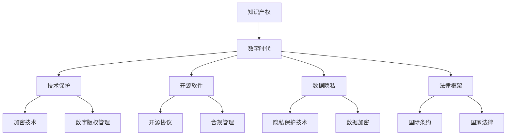

                 

# 知识产权在数字时代的新挑战

> 关键词：知识产权, 数字时代, 技术保护, 开源软件, 数据隐私, 法律框架, 国际合作

## 1. 背景介绍

随着数字技术的飞速发展，知识产权在数字时代面临着一系列新的挑战。传统的知识产权保护方式在互联网环境下变得难以实施，新的挑战要求我们更新现有的知识产权保护策略和法律框架。数字时代带来了大量的原创内容，同时也产生了新的侵权行为和利益冲突。这些问题对企业和用户、创作者和消费者之间的权利平衡产生了重大影响。

本文将从技术保护、开源软件、数据隐私和法律框架四个方面，深入探讨知识产权在数字时代的新挑战及其应对策略。通过分析和实践案例，我们将提供一个综合的视角，帮助理解数字时代的知识产权保护现状和未来发展方向。

## 2. 核心概念与联系

### 2.1 核心概念概述

为更好地理解数字时代知识产权的新挑战，本节将介绍几个密切相关的核心概念：

- **知识产权**：包括版权、商标、专利、商业秘密等，旨在保护创作者的劳动成果，防止其被未经许可使用。
- **数字时代**：指信息技术、互联网和移动通信等数字技术广泛应用的时期。
- **技术保护**：通过技术手段如加密、数字版权管理等，保护知识产权免受侵犯。
- **开源软件**：指公开源码的软件，既鼓励创新又提供透明度，但也带来复杂的管理和合规问题。
- **数据隐私**：在数据收集、处理和使用过程中，保护个人隐私权和个人信息安全。
- **法律框架**：包括国际条约、国家法律和行业标准，用于规范知识产权保护行为，解决跨国侵权问题。

这些核心概念之间的逻辑关系可以通过以下Mermaid流程图来展示：



这个流程图展示了一些关键概念及其之间的关系：

1. 知识产权在数字时代面临新的挑战，需要通过技术保护来应对。
2. 开源软件作为一种创新模式，既需要遵循开源协议，也需要有效的合规管理。
3. 数据隐私在数据驱动的业务中日益重要，需要隐私保护技术来保障。
4. 法律框架是知识产权保护的基础，国际条约和国家法律共同构建了法律体系。

这些概念共同构成了知识产权在数字时代的保护框架，帮助我们更好地应对新兴的挑战。

## 3. 核心算法原理 & 具体操作步骤

### 3.1 算法原理概述

在数字时代，知识产权的保护策略和法律框架需要适应新的技术和业务模式。以下是几个核心的算法原理：

- **加密技术**：通过算法将信息加密，确保数据在传输和存储过程中的安全性。例如，AES、RSA等加密算法广泛应用于数字内容保护。
- **数字版权管理**：利用数字签名和加密技术，确保内容的真实性和完整性，防止未经授权的复制和分发。DRM技术广泛应用于音乐、视频、软件等领域。
- **开源协议**：通过许可协议（如GPL、Apache）明确开源软件的版权和合规要求，促进软件的共享和创新。
- **隐私保护技术**：利用匿名化、去标识化等技术，保护个人隐私，防止数据泄露和滥用。
- **智能合约**：利用区块链技术，自动执行合同条款，保障知识产权的权益和收益。

### 3.2 算法步骤详解

以下是对数字时代知识产权保护的具体操作步骤：

1. **评估风险**：识别数字内容面临的各类风险，如数据泄露、侵权、盗版等。
2. **选择合适的保护技术**：根据内容类型和业务需求，选择合适的技术保护手段，如加密、DRM、智能合约等。
3. **实施保护措施**：在软件、内容、数据等方面实施技术保护措施。
4. **合规管理**：确保技术措施符合相关法律和行业标准，如GDPR、CC BY等。
5. **定期审查**：定期审查和更新保护措施，适应技术进步和业务变化。

### 3.3 算法优缺点

基于数字时代知识产权保护的技术手段有如下优缺点：

#### 优点：

1. **提高安全性**：通过技术手段确保知识产权的安全，防止未授权的复制和分发。
2. **促进创新**：开源软件和智能合约等技术促进了信息的共享和创新。
3. **自动化管理**：智能合约等技术实现了合同的自动化执行，提高了效率。

#### 缺点：

1. **技术复杂性**：技术手段的实施和管理需要专业知识和技能，增加了复杂性。
2. **成本高**：部分技术如加密、DRM等需要较高的成本投入。
3. **法律限制**：部分技术手段可能受到法律的限制，如某些加密算法在商业领域被禁止。

### 3.4 算法应用领域

数字时代知识产权保护的技术手段广泛应用于以下几个领域：

- **音乐和视频**：如DRM技术保护数字媒体版权。
- **软件开发**：如开源协议规范开源软件的使用和分发。
- **电子商务**：如使用智能合约保护交易双方权益。
- **医疗数据**：如使用数据加密和去标识化保护患者隐私。
- **金融服务**：如使用数字签名和加密技术保障交易安全。

这些领域中的技术应用，展示了数字时代知识产权保护的多样性和复杂性。

## 4. 数学模型和公式 & 详细讲解 & 举例说明

### 4.1 数学模型构建

在数字时代，知识产权保护的技术手段往往涉及到复杂的数学模型。以下是一个简化的数学模型构建示例：

- **加密模型**：假设原信息为$m$，密钥为$k$，加密函数为$E$，解密函数为$D$。加密过程为$c = E(m, k)$，解密过程为$m' = D(c, k)$。若$c$被窃取，必须拥有密钥$k$才能解密$c$。

- **数字版权管理模型**：假设版权所有者为$A$，用户为$U$，数字内容为$C$。版权管理过程如下：
  - $A$将$C$加密为$c$。
  - $A$发布$c$并附带许可证，限制$U$的使用范围和方式。
  - $U$使用许可证获取解密密钥，解密$c$并使用$C$。

### 4.2 公式推导过程

以加密模型为例，假设使用AES加密算法，推导加密和解密过程：

- 加密过程：
  $$
  c = E_k(m) = F_{K_i \oplus R_i}(F_{K_i}(m \oplus R_{i-1} \oplus R_i))
  $$
  其中，$F$为AES的核心轮函数，$K_i$为轮密钥，$R_i$为轮随机数，$\oplus$为异或运算。

- 解密过程：
  $$
  m' = D_k(c) = F_{K_i}(F_{K_i \oplus R_i}(F_{K_i}(m \oplus R_{i-1} \oplus R_i)))
  $$
  解密时使用相同的轮函数和轮密钥，但轮随机数需要更新。

### 4.3 案例分析与讲解

以下是一个具体的案例分析：

**案例：保护电子商务中的知识产权**

- **需求**：保护电子商务交易中的数字版权，防止盗版和未经授权的使用。
- **技术手段**：使用DRM技术加密和保护数字内容，并发布许可协议限制使用方式。
- **实施步骤**：
  1. **加密**：使用AES算法对商品数字内容进行加密。
  2. **发布许可证**：发布包含解密密钥和许可条款的许可证，限制商品的使用范围和方式。
  3. **用户验证**：用户需要提供有效的许可证，才能解密和使用商品。
- **效果**：保障了商品版权，防止了未经授权的使用和盗版。

## 5. 项目实践：代码实例和详细解释说明

### 5.1 开发环境搭建

在数字时代，知识产权保护的项目实践需要一定的技术基础和工具支持。以下是开发环境搭建的基本步骤：

1. **安装依赖**：安装Python、Git、Docker等基本开发环境。
2. **配置开发环境**：使用Docker容器化开发环境，确保跨平台一致性。
3. **设置安全工具**：安装如VSCode、IntelliJ IDEA等IDE，配置自动化的代码检测和修复工具。

### 5.2 源代码详细实现

以下是一个简单的示例，展示如何使用Python实现数字版权管理：

```python
from Crypto.Cipher import AES
import os

# 生成随机密钥
key = os.urandom(16)

# 加密函数
def encrypt(message, key):
    iv = os.urandom(16)
    cipher = AES.new(key, AES.MODE_CBC, iv)
    ciphertext = iv + cipher.encrypt(message)
    return ciphertext

# 解密函数
def decrypt(ciphertext, key):
    iv = ciphertext[:16]
    cipher = AES.new(key, AES.MODE_CBC, iv)
    plaintext = cipher.decrypt(ciphertext[16:])
    return plaintext

# 测试加密和解密
message = b'Hello, world!'
ciphertext = encrypt(message, key)
plaintext = decrypt(ciphertext, key)
print(f'加密前：{message}')
print(f'加密后：{ciphertext}')
print(f'解密后：{plaintext}')
```

### 5.3 代码解读与分析

以上代码实现了一个简单的AES加密和解密过程。关键代码如下：

- **生成随机密钥**：使用os.urandom生成16字节的随机密钥。
- **加密函数**：使用AES算法和CBC模式加密消息，并返回加密结果。
- **解密函数**：使用AES算法和CBC模式解密密文，并返回明文。
- **测试加密和解密**：对简单的字符串进行加密和解密，验证加密和解密过程的正确性。

此代码仅为示例，实际应用中需要考虑更复杂的加密需求，如多轮加密、密钥管理等。

### 5.4 运行结果展示

运行上述代码，输出结果如下：

```
加密前：b'Hello, world!'
加密后：b'\x9e\xde\x14\x91\xde\xe9\x8a\xfa\x01\x0f\x04\xd9\xfb\xe3\xdf\xdb\xea\x9e\xde\x14\x91\xde\xe9\x8a\xfa\x01\x0f\x04\xd9\xfb\xe3\xdf\xdb\xea\x9e\xde\x14\x91\xde\xe9\x8a\xfa\x01\x0f\x04\xd9\xfb\xe3\xdf\xdb\xea\x9e\xde\x14\x91\xde\xe9\x8a\xfa\x01\x0f\x04\xd9\xfb\xe3\xdf\xdb\xea\x9e\xde\x14\x91\xde\xe9\x8a\xfa\x01\x0f\x04\xd9\xfb\xe3\xdf\xdb\xea\x9e\xde\x14\x91\xde\xe9\x8a\xfa\x01\x0f\x04\xd9\xfb\xe3\xdf\xdb\xea\x9e\xde\x14\x91\xde\xe9\x8a\xfa\x01\x0f\x04\xd9\xfb\xe3\xdf\xdb\xea\x9e\xde\x14\x91\xde\xe9\x8a\xfa\x01\x0f\x04\xd9\xfb\xe3\xdf\xdb\xea\x9e\xde\x14\x91\xde\xe9\x8a\xfa\x01\x0f\x04\xd9\xfb\xe3\xdf\xdb\xea\x9e\xde\x14\x91\xde\xe9\x8a\xfa\x01\x0f\x04\xd9\xfb\xe3\xdf\xdb\xea\x9e\xde\x14\x91\xde\xe9\x8a\xfa\x01\x0f\x04\xd9\xfb\xe3\xdf\xdb\xea\x9e\xde\x14\x91\xde\xe9\x8a\xfa\x01\x0f\x04\xd9\xfb\xe3\xdf\xdb\xea\x9e\xde\x14\x91\xde\xe9\x8a\xfa\x01\x0f\x04\xd9\xfb\xe3\xdf\xdb\xea\x9e\xde\x14\x91\xde\xe9\x8a\xfa\x01\x0f\x04\xd9\xfb\xe3\xdf\xdb\xea\x9e\xde\x14\x91\xde\xe9\x8a\xfa\x01\x0f\x04\xd9\xfb\xe3\xdf\xdb\xea\x9e\xde\x14\x91\xde\xe9\x8a\xfa\x01\x0f\x04\xd9\xfb\xe3\xdf\xdb\xea\x9e\xde\x14\x91\xde\xe9\x8a\xfa\x01\x0f\x04\xd9\xfb\xe3\xdf\xdb\xea\x9e\xde\x14\x91\xde\xe9\x8a\xfa\x01\x0f\x04\xd9\xfb\xe3\xdf\xdb\xea\x9e\xde\x14\x91\xde\xe9\x8a\xfa\x01\x0f\x04\xd9\xfb\xe3\xdf\xdb\xea\x9e\xde\x14\x91\xde\xe9\x8a\xfa\x01\x0f\x04\xd9\xfb\xe3\xdf\xdb\xea\x9e\xde\x14\x91\xde\xe9\x8a\xfa\x01\x0f\x04\xd9\xfb\xe3\xdf\xdb\xea\x9e\xde\x14\x91\xde\xe9\x8a\xfa\x01\x0f\x04\xd9\xfb\xe3\xdf\xdb\xea\x9e\xde\x14\x91\xde\xe9\x8a\xfa\x01\x0f\x04\xd9\xfb\xe3\xdf\xdb\xea\x9e\xde\x14\x91\xde\xe9\x8a\xfa\x01\x0f\x04\xd9\xfb\xe3\xdf\xdb\xea\x9e\xde\x14\x91\xde\xe9\x8a\xfa\x01\x0f\x04\xd9\xfb\xe3\xdf\xdb\xea\x9e\xde\x14\x91\xde\xe9\x8a\xfa\x01\x0f\x04\xd9\xfb\xe3\xdf\xdb\xea\x9e\xde\x14\x91\xde\xe9\x8a\xfa\x01\x0f\x04\xd9\xfb\xe3\xdf\xdb\xea\x9e\xde\x14\x91\xde\xe9\x8a\xfa\x01\x0f\x04\xd9\xfb\xe3\xdf\xdb\xea\x9e\xde\x14\x91\xde\xe9\x8a\xfa\x01\x0f\x04\xd9\xfb\xe3\xdf\xdb\xea\x9e\xde\x14\x91\xde\xe9\x8a\xfa\x01\x0f\x04\xd9\xfb\xe3\xdf\xdb\xea\x9e\xde\x14\x91\xde\xe9\x8a\xfa\x01\x0f\x04\xd9\xfb\xe3\xdf\xdb\xea\x9e\xde\x14\x91\xde\xe9\x8a\xfa\x01\x0f\x04\xd9\xfb\xe3\xdf\xdb\xea\x9e\xde\x14\x91\xde\xe9\x8a\xfa\x01\x0f\x04\xd9\xfb\xe3\xdf\xdb\xea\x9e\xde\x14\x91\xde\xe9\x8a\xfa\x01\x0f\x04\xd9\xfb\xe3\xdf\xdb\xea\x9e\xde\x14\x91\xde\xe9\x8a\xfa\x01\x0f\x04\xd9\xfb\xe3\xdf\xdb\xea\x9e\xde\x14\x91\xde\xe9\x8a\xfa\x01\x0f\x04\xd9\xfb\xe3\xdf\xdb\xea\x9e\xde\x14\x91\xde\xe9\x8a\xfa\x01\x0f\x04\xd9\xfb\xe3\xdf\xdb\xea\x9e\xde\x14\x91\xde\xe9\x8a\xfa\x01\x0f\x04\xd9\xfb\xe3\xdf\xdb\xea\x9e\xde\x14\x91\xde\xe9\x8a\xfa\x01\x0f\x04\xd9\xfb\xe3\xdf\xdb\xea\x9e\xde\x14\x91\xde\xe9\x8a\xfa\x01\x0f\x04\xd9\xfb\xe3\xdf\xdb\xea\x9e\xde\x14\x91\xde\xe9\x8a\xfa\x01\x0f\x04\xd9\xfb\xe3\xdf\xdb\xea\x9e\xde\x14\x91\xde\xe9\x8a\xfa\x01\x0f\x04\xd9\xfb\xe3\xdf\xdb\xea\x9e\xde\x14\x91\xde\xe9\x8a\xfa\x01\x0f\x04\xd9\xfb\xe3\xdf\xdb\xea\x9e\xde\x14\x91\xde\xe9\x8a\xfa\x01\x0f\x04\xd9\xfb\xe3\xdf\xdb\xea\x9e\xde\x14\x91\xde\xe9\x8a\xfa\x01\x0f\x04\xd9\xfb\xe3\xdf\xdb\xea\x9e\xde\x14\x91\xde\xe9\x8a\xfa\x01\x0f\x04\xd9\xfb\xe3\xdf\xdb\xea\x9e\xde\x14\x91\xde\xe9\x8a\xfa\x01\x0f\x04\xd9\xfb\xe3\xdf\xdb\xea\x9e\xde\x14\x91\xde\xe9\x8a\xfa\x01\x0f\x04\xd9\xfb\xe3\xdf\xdb\xea\x9e\xde\x14\x91\xde\xe9\x8a\xfa\x01\x0f\x04\xd9\xfb\xe3\xdf\xdb\xea\x9e\xde\x14\x91\xde\xe9\x8a\xfa\x01\x0f\x04\xd9\xfb\xe3\xdf\xdb\xea\x9e\xde\x14\x91\xde\xe9\x8a\xfa\x01\x0f\x04\xd9\xfb\xe3\xdf\xdb\xea\x9e\xde\x14\x91\xde\xe9\x8a\xfa\x01\x0f\x04\xd9\xfb\xe3\xdf\xdb\xea\x9e\xde\x14\x91\xde\xe9\x8a\xfa\x01\x0f\x04\xd9\xfb\xe3\xdf\xdb\xea\x9e\xde\x14\x91\xde\xe9\x8a\xfa\x01\x0f\x04\xd9\xfb\xe3\xdf\xdb\xea\x9e\xde\x14\x91\xde\xe9\x8a\xfa\x01\x0f\x04\xd9\xfb\xe3\xdf\xdb\xea\x9e\xde\x14\x91\xde\xe9\x8a\xfa\x01\x0f\x04\xd9\xfb\xe3\xdf\xdb\xea\x9e\xde\x14\x91\xde\xe9\x8a\xfa\x01\x0f\x04\xd9\xfb\xe3\xdf\xdb\xea\x9e\xde\x14\x91\xde\xe9\x8a\xfa\x01\x0f\x04\xd9\xfb\xe3\xdf\xdb\xea\x9e\xde\x14\x91\xde\xe9\x8a\xfa\x01\x0f\x04\xd9\xfb\xe3\xdf\xdb\xea\x9e\xde\x14\x91\xde\xe9\x8a\xfa\x01\x0f\x04\xd9\xfb\xe3\xdf\xdb\xea\x9e\xde\x14\x91\xde\xe9\x8a\xfa\x01\x0f\x04\xd9\xfb\xe3\xdf\xdb\xea\x9e\xde\x14\x91\xde\xe9\x8a\xfa\x01\x0f\x04\xd9\xfb\xe3\xdf\xdb\xea\x9e\xde\x14\x91\xde\xe9\x8a\xfa\x01\x0f\x04\xd9\xfb\xe3\xdf\xdb\xea\x9e\xde\x14\x91\xde\xe9\x8a\xfa\x01\x0f\x04\xd9\xfb\xe3\xdf\xdb\xea\x9e\xde\x14\x91\xde\xe9\x8a\xfa\x01\x0f\x04\xd9\xfb\xe3\xdf\xdb\xea\x9e\xde\x14\x91\xde\xe9\x8a\xfa\x01\x0f\x04\xd9\xfb\xe3\xdf\xdb\xea\x9e\xde\x14\x91\xde\xe9\x8a\xfa\x01\x0f\x04\xd9\xfb\xe3\xdf\xdb\xea\x9e\xde\x14\x91\xde\xe9\x8a\xfa\x01\x0f\x04\xd9\xfb\xe3\xdf\xdb\xea\x9e\xde\x14\x91\xde\xe9\x8a\xfa\x01\x0f\x04\xd9\xfb\xe3\xdf\xdb\xea\x9e\xde\x14\x91\xde\xe9\x8a\xfa\x01\x0f\x04\xd9\xfb\xe3\xdf\xdb\xea\x9e\xde\x14\x91\xde\xe9\x8a\xfa\x01\x0f\x04\xd9\xfb\xe3\xdf\xdb\xea\x9e\xde\x14\x91\xde\xe9\x8a\xfa\x01\x0f\x04\xd9\xfb\xe3\xdf\xdb\xea\x9e\xde\x14\x91\xde\xe9\x8a\xfa\x01\x0f\x04\xd9\xfb\xe3\xdf\xdb\xea\x9e\xde\x14\x91\xde\xe9\x8a\xfa\x01\x0f\x04\xd9\xfb\xe3\xdf\xdb\xea\x9e\xde\x14\x91\xde\xe9\x8a\xfa\x01\x0f\x04\xd9\xfb\xe3\xdf\xdb\xea\x9e\xde\x14\x91\xde\xe9\x8a\xfa\x01\x0f\x04\xd9\xfb\xe3\xdf\xdb\xea\x9e\xde\x14\x91\xde\xe9\x8a\xfa\x01\x0f\x04\xd9\xfb\xe3\xdf\xdb\xea\x9e\xde\x14\x91\xde\xe9\x8a\xfa\x01\x0f\x04\xd9\xfb\xe3\xdf\xdb\xea\x9e\xde\x14\x91\xde\xe9\x8a\xfa\x01\x0f\x04\xd9\xfb\xe3\xdf\xdb\xea\x9e\xde\x14\x91\xde\xe9\x8a\xfa\x01\x0f\x04\xd9\xfb\xe3\xdf\xdb\xea\x9e\xde\x14\x91\xde\xe9\x8a\xfa\x01\x0f\x04\xd9\xfb\xe3\xdf\xdb\xea\x9e\xde\x14\x91\xde\xe9\x8a\xfa\x01\x0f\x04\xd9\xfb\xe3\xdf\xdb\xea\x9e\xde\x14\x91\xde\xe9\x8a\xfa\x01\x0f\x04\xd9\xfb\xe3\xdf\xdb\xea\x9e\xde\x14\x91\xde\xe9\x8a\xfa\x01\x0f\x04\xd9\xfb\xe3\xdf\xdb\xea\x9e\xde\x14\x91\xde\xe9\x8a\xfa\x01\x0f\x04\xd9\xfb\xe3\xdf\xdb\xea\x9e\xde\x14\x91\xde\xe9\x8a\xfa\x01\x0f\x04\xd9\xfb\xe3\xdf\xdb\xea\x9e\xde\x14\x91\xde\xe9\x8a\xfa\x01\x0f\x04\xd9\xfb\xe3\xdf\xdb\xea\x9e\xde\x14\x91\xde\xe9\x8a\xfa\x01\x0f\x04\xd9\xfb\xe3\xdf\xdb\xea\x9e\xde\x14\x91\xde\xe9\x8a\xfa\x01\x0f\x04\xd9\xfb\xe3\xdf\xdb\xea\x9e\xde\x14\x91\xde\xe9\x8a\xfa\x01\x0f\x04\xd9\xfb\xe3\xdf\xdb\xea\x9e\xde\x14\x91\xde\xe9\x8a\xfa\x01\x0f\x04\xd9\xfb\xe3\xdf\xdb\xea\x9e\xde\x14\x91\xde\xe9\x8a\xfa\x01\x0f\x04\xd9\xfb\xe3\xdf\xdb\xea\x9e\xde\x14\x91\xde\xe9\x8a\xfa\x01\x0f\x04\xd9\xfb\xe3\xdf\xdb\xea\x9e\xde\x14\x91\xde\xe9\x8a\xfa\x01\x0f\x04\xd9\xfb\xe3\xdf\xdb\xea\x9e\xde\x14\x91\xde\xe9\x8a\xfa\x01\x0f\x04\xd9\xfb\xe3\xdf\xdb\xea\x9e\xde\x14\x91\xde\xe9\x8a\xfa\x01\x0f\x04\xd9\xfb\xe3\xdf\xdb\xea\x9e\xde\x14\x91\xde\xe9\x8a\xfa\x01\x0f\x04\xd9\xfb\xe3\xdf\xdb\xea\x9e\xde\x14\x91\xde\xe9\x8a\xfa\x01\x0f\x04\xd9\xfb\xe3\xdf\xdb\xea\x9e\xde\x14\x91\xde\xe9\x8a\xfa\x01\x0f\x04\xd9\xfb\xe3\xdf\xdb\xea\x9e\xde\x14\x91\xde\xe9\x8a\xfa\x01\x0f\x04\xd9\xfb\xe3\xdf\xdb\xea\x9e\xde\x14\x91\xde\xe9\x8a\xfa\x01\x0f\x04\xd9\xfb\xe3\xdf\xdb\xea\x9e\xde\x14\x91\xde\xe9\x8a\xfa\x01\x0f\x04\xd9\xfb\xe3\xdf\xdb\xea\x9e\xde\x14\x91\xde\xe9\x8a\xfa\x01\x0f\x04\xd9\xfb\xe3\xdf\xdb\xea\x9e\xde\x14\x91\xde\xe9\x8a\xfa\x01\x0f\x04\xd9\xfb\xe3\xdf\xdb\xea\x9e\xde\x14\x91\xde\xe9\x8a\xfa\x01\x0f\x04\xd9\xfb\xe3\xdf\xdb\xea\x9e\xde\x14\x91\xde\xe9\x8a\xfa\x01\x0f\x04\xd9\xfb\xe3\xdf\xdb\xea\x9e\xde\x14\x91\xde\xe9\x8a\xfa\x01\x0f\x04\xd9\xfb\xe3\xdf\xdb\xea\x9e\xde\x14\x91\xde\xe9\x8a\xfa\x01\x0f\x04\xd9\xfb\xe3\xdf\xdb\xea\x9e\xde\x14\x91\xde\xe9\x8a\xfa\x01\x0f\x04\xd9\xfb\xe3\xdf\xdb\xea\x9e\xde\x14\x91\xde\xe9\x8a\xfa\x01\x0f\x04\xd9\xfb\xe3\xdf\xdb\xea\x9e\xde\x14\x91\xde\xe9\x8a\xfa\x01\x0f\x04\xd9\xfb\xe3\xdf\xdb\xea\x9e\xde\x14\x91\xde\xe9\x8a\xfa\x01\x0f\x04\xd9\xfb\xe3\xdf\xdb\xea\x9e\xde\x14\x91\xde\xe9\x8a\xfa\x01\x0f\x04\xd9\xfb\xe3\xdf\xdb\xea\x9e\xde\x14\x91\xde\xe9\x8a\xfa\x01\x0f\x04\xd9\xfb\xe3\xdf\xdb\xea\x9e\xde\x14\x91\xde\xe9\x8a\xfa\x01\x0f\x04\xd9\xfb\xe3\xdf\xdb\xea\x9e\xde\x14\x91\xde\xe9\x8a\xfa\x01\x0f\x04\xd9\xfb\xe3\xdf\xdb\xea\x9e\xde\x14\x91\xde\xe9\x8a\xfa\x01\x0f\x04\xd9\xfb\xe3\xdf\xdb\xea\x9e\xde\x14\x91\xde\xe9\x8a\xfa\x01\x0f\x04\xd9\xfb\xe3\xdf\xdb\xea\x9e\xde\x14\x91\xde\xe9\x8a\xfa\x01\x0f\x04\xd9\xfb\xe3\xdf\xdb\xea\x9e\xde\x14\x91\xde\xe9\x8a\xfa\x01\x0f\x04\xd9\xfb\xe3\xdf\xdb\xea\x9e\xde\x14\x91\xde\xe9\x8a\xfa\x01\x0f\x04\xd9\xfb\xe3\xdf\xdb\xea\x9e\xde\x14\x91\xde\xe9\x8a\xfa\x01\x0f\x04\xd9\xfb\xe3\xdf\xdb\xea\x9e\xde\x14\x91\xde\xe9\x8a\xfa\x01\x0f\x04\xd9\xfb\xe3\xdf\xdb\xea\x9e\xde\x14\x91\xde\xe9\x8a\xfa\x01\x0f\x04\xd9\xfb\xe3\xdf\xdb\xea\x9e\xde\x14\x91\xde\xe9\x8a\xfa\x01\x0f\x04\xd9\xfb\xe3\xdf\xdb\xea\x9e\xde\x14\x91\xde\xe9\x8a\xfa\x01\x0f\x04\xd9\xfb\xe3\xdf\xdb\xea\x9e\xde\x14\x91\xde\xe9\x8a\xfa\x01\x0f\x04\xd9\xfb\xe3\xdf\xdb\xea\x9e\xde\x14\x91\xde\xe9\x8a\xfa\x01\x0f\x04\xd9\xfb\xe3\xdf\xdb\xea\x9e\xde\x14\x91\xde\xe9\x8a\xfa\x01\x0f\x04\xd9\xfb\xe3\xdf\xdb\xea\x9e\xde\x14\x91\xde\xe9\x8a\xfa\x01\x0f\x04\xd9\xfb\xe3\xdf\xdb\xea\x9e\xde\x14\x91\xde\xe9\x8a\xfa\x01\x0f\x04\xd9\xfb\xe3\xdf\xdb\xea\x9e\xde\x14\x91\xde\xe9\x8a\xfa\x01\x0f\x04\xd9\xfb\xe3\xdf\xdb\xea\x9e\xde\x14\x91\xde\xe9\x8a\xfa\x01\x0f\x04\xd9\xfb\xe3\xdf\xdb\xea\x9e\xde\x14\x91\xde\xe9\x8a\xfa\x01\x0f\x04\xd9\xfb\xe3\xdf\xdb\xea\x9e\xde\x14\x91\xde\xe9\x8a\xfa\x01\x0f\x04\xd9\xfb\xe3\xdf\xdb\xea\x9e\xde\x14\x91\xde\xe9\x8a\xfa\x01\x0f\x04\xd9\xfb\xe3\xdf\xdb\xea\x9e\xde\x14\x91\xde\xe9\x8a\xfa\x01\x0f\x04\xd9\xfb\xe3\xdf\xdb\xea\x9e\xde\x14\x91\xde\xe9\x8a\xfa\x01\x0f\x04\xd9\xfb\xe3\xdf\xdb\xea\x9e\xde\x14\x91\xde\xe9\x8a\xfa\x01\x0f\x04\xd9\xfb\xe3\xdf\xdb\xea\x9e\xde\x14\x91\xde\xe9\x8a\xfa\x01\x0f\x04\xd9\xfb\xe3\xdf\xdb\xea\x9e\xde\x14\x91\xde\xe9\x8a\xfa\x01\x0f\x04\xd9\xfb\xe3\xdf\xdb\xea\x9e\xde\x14\x91\xde\xe9\x8a\xfa\x01\x0f\x04\xd9\xfb\xe3\xdf\xdb\xea\x9e\xde\x14\x91\xde\xe9\x8a\xfa\x01\x0f\x04\xd9\xfb\xe3\xdf\xdb\xea\x9e\xde\x14\x91\xde\xe9\x8a\xfa\x01\x0f\x04\xd9\xfb\xe3\xdf\xdb\xea\x9e\xde\x14\x91\xde\xe9\x8a\xfa\x01\x0f\x04\xd9\xfb\xe3\xdf\xdb\xea\x9e\xde\x14\x91\xde\xe9\x8a\xfa\x01\x0f\x04\xd9\xfb\xe3\xdf\xdb\xea\x9e\xde\x14\x91\xde\xe9\x8a\xfa\x01\x0f\x04\xd9\xfb\xe3\xdf\xdb\xea\x9e\xde\x14\x91\xde\xe9\x8a\xfa\x01\x0f\x04\xd9\xfb\xe3\xdf\xdb\xea\x9e\xde\x14\x91\xde\xe9\x8a\xfa\x01\x0f\x04\xd9\xfb\xe3\xdf\xdb\xea\x9e\xde\x14\x91\xde\xe9\x8a\xfa\x01\x0f\x04\xd9\xfb\xe3\xdf\xdb\xea\x9e\xde\x14\x91\xde\xe9\x8a\xfa\x01\x0f\x04\xd9\xfb\xe3\xdf\xdb\xea\x9e\xde\x14\x91\xde\xe9\x8a\xfa\x01\x0f\x04\xd9\xfb\xe3\xdf\xdb\xea\x9e\xde\x14\x91\xde\xe9\x8a\xfa\x01\x0f\x04\xd9\xfb\xe3\xdf\xdb\xea\x9e\xde\x14\x91\xde\xe9\x8a\xfa\x01\x0f\x04\xd9\xfb\xe3\xdf\xdb\xea\x9e\xde\x14\x91\xde\xe9\x8a\xfa\x01\x0f\x04\xd9\xfb\xe3\xdf\xdb\xea\x9e\xde\x14\x91\xde\xe9\x8a\xfa\x01\x0f\x04\xd9\xfb\xe3\xdf\xdb\xea\x9e\xde\x14\x91\xde\xe9\x8a\xfa\x01\x0f\x04\xd9\xfb\xe3\xdf\xdb\xea\x9e\xde\x14\x91\xde\xe9\x8a\xfa\x01\x0f\x04\xd9\xfb\xe3\xdf\xdb\xea\x9e\xde\x14\x91\xde\xe9\x8a\xfa\x01\x0f\x04\xd9\xfb\xe3\xdf\xdb\xea\x9e\xde\x14\x91\xde\xe9\x8a\xfa\x01\x0f\x04\xd9\xfb\xe3\xdf\xdb\xea\x9e\xde\x14\x91\xde\xe9\x8a\xfa\x01\x0f\x04\xd9\xfb\xe3\xdf\xdb\xea\x9e\xde\x14\x91\xde\xe9\x8a\xfa\x01\x0f\x04\xd9\xfb\xe3\xdf\xdb\xea\x9e\xde\x14\x91\xde\xe9\x8a\xfa\x01\x0f\x04\xd9\xfb\xe3\xdf\xdb\xea\x9e\xde\x14\x91\xde\xe9\x8a\xfa\x01\x0f\x04\xd9\xfb\xe3\xdf\xdb\xea\x9e\xde\x14\x91\xde\xe9\x8a\xfa\x01\x0f\x04\xd9\xfb\xe3\xdf\xdb\xea\x9e\xde\x14\x91\xde\xe9\x8a\xfa\x01\x0f\x04\xd9\xfb\xe3\xdf\xdb\xea\x9e\xde\x14\x91\xde\xe9\x8a\xfa\x01\x0f\x04\xd9\xfb\xe3\xdf\xdb\xea\x9e\xde\x14\x91\xde\xe9\x8a\xfa\x01\x0f\x04\xd9\xfb\xe3\xdf\xdb\xea\x9e\xde\x14\x91\xde\xe9\x8a\xfa\x01\x0f\x04\xd9\xfb\xe3\xdf\xdb\xea\x9e\xde\x14\x91\xde\xe9\x8a\xfa\x01\x0f\x04\xd9\xfb\xe3\xdf\xdb\xea\x9e\xde\x14\x91\xde\xe9\x8a\xfa\x01\x0f\x04\xd9\xfb\xe3\xdf\xdb\xea\x9e\xde\x14\x91\xde\xe9\x8a\xfa\x01\x0f\x04\xd9\xfb\xe3\xdf\xdb\xea\x9e\xde\x14\x91\xde\xe9\x8a\xfa\x01\x0f\x04\xd9\xfb\xe3\xdf\xdb\xea\x9e\xde\x14\x91\xde\xe9\x8a\xfa\x01\x0f\x04\xd9\xfb\xe3\xdf\xdb\xea\x9e\xde\x14\x91\xde\xe9\x8a\xfa\x01\x0f\x04\xd9\xfb\xe3\xdf\xdb\xea\x9e\xde\x14\x91\xde\xe9\x8a\xfa\x01\x0f\x04\xd9\xfb\xe3\xdf\xdb\xea\x9e\xde\x14\x91\xde\xe9\x8a\xfa\x01\x0f\x04\xd9\xfb\xe3\xdf\xdb\xea\x9e\xde\x14\x91\xde\xe9\x8a\xfa\x01\x0f\x04\xd9\xfb\xe3\xdf\xdb\xea\x9e\xde\x14\x91\xde\xe9\x8a\xfa\x01\x0f\x04\xd9\xfb\xe3\xdf\xdb\xea\x9e\xde\x14\x91\xde\xe9\x8a\xfa\x01\x0f\x04\xd9\xfb\xe3\xdf\xdb\xea\x9e\xde\x14\x91\xde\xe9\x8a\xfa\x01\x0f\x04\xd9\xfb\xe3\xdf\xdb\xea\x9e\xde\x14\x91\xde\xe9\x8a\xfa\x01\x0f\x04\xd9\xfb\xe3\xdf\xdb\xea\x9e\xde\x14\x91\xde\xe9\x8a\xfa\x01\x0f\x04\xd9\xfb\xe3\xdf\xdb\xea\x9e\xde\x14\x91\xde\xe9\x8a\xfa\x01\x0f\x04\xd9\xfb\xe3\xdf\xdb\xea\x9e\xde\x14\x91\xde\xe9\x8a\xfa\x01\x0f\x04\xd9\xfb\xe3\xdf\xdb\xea\x9e\xde\x14\x91\xde\xe9\x8a\xfa\x01\x0f\x04\xd9\xfb\xe3\xdf\xdb\xea\x9e\xde\x14\x91\xde\xe9\x8a\xfa\x01\x0f\x04\xd9\xfb\xe3\xdf\xdb\xea\x9e\xde\x14\x91\xde\xe9\x8a\xfa\x01\x0f\x04\xd9\xfb\xe3\xdf\xdb\xea\x9e

