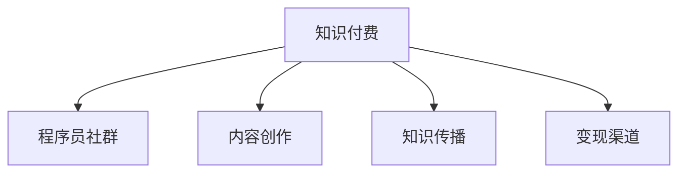

                 

# 知识付费:程序员实现财富自由的新途径

## 1. 背景介绍

### 1.1 问题由来

在数字化时代，知识付费成为了一种全新的商业模式。特别是随着在线教育平台的崛起，知识付费已经从边缘走向主流，成为程序员获取新知识、新技能的重要渠道。而对于程序员来说，如何利用这一趋势，通过知识付费实现财务自由，是值得深思的问题。

### 1.2 问题核心关键点

知识付费平台为程序员提供了多条途径，包括付费订阅、按需购买、企业合作等，帮助程序员通过技能输出、经验分享、知识传播等方式获取经济回报。其中，关键在于找到适合自己、易于实施的变现模式，并在实践中不断迭代优化。

### 1.3 问题研究意义

在信息技术快速发展的今天，程序员作为技术创新的主力军，通过知识付费实现财务自由，不仅能提升个人职业发展，还能推动技术社区的健康发展，推动技术进步和产业升级。

## 2. 核心概念与联系

### 2.1 核心概念概述

为更好地理解程序员如何利用知识付费实现财务自由，本节将介绍几个关键概念：

- 知识付费(Knowledge-as-a-Service, KaaS)：通过在线平台向用户提供有价值的知识产品或服务，如在线课程、书籍、咨询服务等，以获取经济回报。
- 程序员社群(Programmer Community)：一群具有共同兴趣和专业背景的程序员，通过线上和线下的交流合作，实现知识共享和技能提升。
- 内容创作(Content Creation)：生产有价值、有深度的技术内容，如博客文章、视频教程、技术演讲等。
- 知识传播(Knowledge Dissemination)：将创作的内容发布到各大平台，吸引并服务广大技术学习者。
- 变现渠道(Monetization Channels)：通过不同的平台和方式，实现知识内容的经济价值，如广告分成、付费订阅、在线销售等。

这些概念之间的逻辑关系可以通过以下Mermaid流程图来展示：



这个流程图展示了一些核心概念之间的联系：知识付费依托于程序员社群，内容创作是知识传播的基础，变现渠道则是知识付费得以实现经济回报的关键环节。

## 3. 核心算法原理 & 具体操作步骤
### 3.1 算法原理概述

程序员通过知识付费实现财务自由，本质上是一个通过生产、传播有价值知识内容，获取经济收益的过程。这一过程涉及知识创作、知识传播、变现渠道等环节，是一个多维度、多层面的商业模型。

### 3.2 算法步骤详解

程序员实现财务自由的知识付费模型包括以下关键步骤：

**Step 1: 确定知识定位和内容主题**
- 根据个人技术专长和兴趣，确定知识定位和内容主题，如编程语言、框架技术、数据结构等。
- 进行市场调研，了解目标受众的实际需求和痛点，确保内容具有实用性和针对性。

**Step 2: 创作高质量的内容**
- 利用编程知识和实战经验，创作高质量、有深度的技术内容，如博客文章、技术书籍、视频教程、技术演讲等。
- 注重内容的结构性、系统性和实用性，确保内容易于理解、易于应用。

**Step 3: 选择合适的知识传播平台**
- 根据内容特点和受众需求，选择适合的传播平台，如博客、视频网站、社交媒体、在线教育平台等。
- 创建账户，注册发布内容，并进行必要的SEO优化，提升内容的曝光率。

**Step 4: 实施知识变现策略**
- 根据平台特点和受众习惯，选择合适的变现策略，如付费订阅、按需购买、广告分成、课程销售等。
- 设定合理的价格策略，进行市场测试，逐步调整定价，优化收入。

**Step 5: 持续优化和迭代**
- 定期收集用户反馈，评估内容效果和用户满意度。
- 根据反馈进行内容更新和迭代，持续提升内容质量和用户粘性。
- 探索新的变现模式和渠道，进一步扩大知识变现范围。

以上是程序员实现财务自由的知识付费模型的一般流程。在实际应用中，还需要针对具体内容、受众、平台特点进行优化设计，如改进内容形式、推广策略等，以进一步提升变现效果。

### 3.3 算法优缺点

知识付费模型具有以下优点：
1. 灵活性强。内容创作和传播形式多样化，程序员可以依据自身优势和兴趣选择合适的内容类型和传播平台。
2. 门槛较低。相比于创业投资，知识付费所需的初始成本较低，风险相对较小。
3. 快速变现。利用互联网平台，程序员可以快速获取经济回报，实现财务自由。
4. 持续学习。创作和传播知识内容的过程，本身就是一种自我提升和学习的过程。

同时，该模型也存在一定的局限性：
1. 内容竞争激烈。互联网内容众多，原创内容创作和传播需要较强的专业能力和持续的努力。
2. 受众局限。部分内容可能只适合特定受众，难以大规模传播。
3. 版权问题。创作者需要注意版权保护，防止他人侵权。
4. 变现能力依赖平台。过度依赖某个平台可能导致平台风险，如政策变化、流量波动等。

尽管存在这些局限性，但就目前而言，知识付费模式仍是一种高效、可行的程序员财务自由途径。未来相关研究的重点在于如何进一步降低内容创作的门槛，提高内容的传播力和变现能力，同时兼顾可解释性和伦理安全性等因素。

### 3.4 算法应用领域

知识付费模型在IT领域已经得到了广泛的应用，涉及的内容领域包括但不限于：

- 软件开发：介绍编程语言、框架、工具的开发技巧和使用经验。
- 数据科学：讲解数据处理、数据分析、机器学习等技术方法。
- 人工智能：分享AI模型的构建、训练、应用等方面的知识。
- 区块链：探讨区块链技术原理、应用场景和开发实践。
- 安全攻防：讲解网络安全知识、攻击与防御技术等。
- 开发工具：介绍各种开发工具的使用方法、技巧和最佳实践。

除了这些经典领域外，知识付费还可以应用于更多的场景中，如代码开源、开源项目维护、技术咨询等，为程序员提供更广阔的职业发展路径。

## 4. 数学模型和公式 & 详细讲解 & 举例说明

### 4.1 数学模型构建

知识付费模型可以抽象为以下数学模型：

设程序员创作的内容数量为 $C$，受众数量为 $R$，内容的质量为 $Q$，传播平台的质量为 $P$，变现策略的质量为 $M$。知识付费的收益 $E$ 可以表示为：

$$E = f(C, R, Q, P, M)$$

其中 $f$ 为收益函数，反映了内容数量、受众数量、内容质量、平台质量和变现策略对收益的综合影响。

### 4.2 公式推导过程

在实际应用中，影响收益的各因素关系较为复杂。以下给出简化后的收益模型推导：

设 $C$、$R$、$Q$、$P$、$M$ 的取值范围分别为 $[0, 1]$，则收益模型可以进一步表示为：

$$E = C \times R \times Q \times P \times M$$

该模型反映了知识付费收益的各影响因素之间为乘法关系，即各个因素均需达到较高水平，才能获得较好的收益。

### 4.3 案例分析与讲解

假设某程序员在Udemy平台上销售一门Python编程课程。根据模型，影响课程收益的关键因素包括：

- 课程质量 $Q = 0.9$，即内容实用、有深度。
- 受众数量 $R = 1000$，即目标受众广泛。
- 传播平台 $P = 0.8$，即Udemy平台用户活跃度高。
- 变现策略 $M = 0.95$，即课程定价合理，平台佣金合理。

将各因素代入收益模型：

$$E = 1 \times 1000 \times 0.9 \times 0.8 \times 0.95 = 738$$

这意味着该课程在Udemy上销售，每月能够带来约738美元的收益。

## 5. 项目实践：代码实例和详细解释说明
### 5.1 开发环境搭建

在进行知识付费实践前，我们需要准备好开发环境。以下是使用Python进行Django开发的环境配置流程：

1. 安装Anaconda：从官网下载并安装Anaconda，用于创建独立的Python环境。

2. 创建并激活虚拟环境：
```bash
conda create -n pytorch-env python=3.8 
conda activate pytorch-env
```

3. 安装Django：
```bash
pip install django
```

4. 创建Django项目和应用：
```bash
django-admin startproject knowledge-payment
cd knowledge-payment
python manage.py startapp blog
```

5. 安装必要的工具包：
```bash
pip install markdown django-markdown django-crispy-forms django-form-autowidgets
```

完成上述步骤后，即可在`pytorch-env`环境中开始知识付费项目开发。

### 5.2 源代码详细实现

下面我们以博客平台为例，给出使用Django开发知识付费平台的核心代码实现。

**settings.py文件**：
```python
# 设置Django配置信息
...
INSTALLED_APPS = [
    ...
    'blog',
    ...
]
```

**urls.py文件**：
```python
from django.urls import path
from . import views

urlpatterns = [
    path('', views.index, name='index'),
    path('blog/<int:blog_id>/', views.blog_detail, name='blog_detail'),
    path('blog/', views.blog_list, name='blog_list'),
]
```

**views.py文件**：
```python
from django.shortcuts import render, get_object_or_404
from .models import Blog

def index(request):
    # 获取最新博客列表
    blogs = Blog.objects.all().order_by('-publish_date')[:5]
    return render(request, 'blog/index.html', {'blogs': blogs})

def blog_detail(request, blog_id):
    # 获取指定博客详情
    blog = get_object_or_404(Blog, id=blog_id)
    return render(request, 'blog/detail.html', {'blog': blog})

def blog_list(request):
    # 获取所有博客列表
    blogs = Blog.objects.all().order_by('-publish_date')
    return render(request, 'blog/list.html', {'blogs': blogs})
```

**models.py文件**：
```python
from django.db import models

class Blog(models.Model):
    title = models.CharField(max_length=255)
    content = models.TextField()
    publish_date = models.DateTimeField(auto_now_add=True)

    def __str__(self):
        return self.title
```

**templates/blog/index.html文件**：
```html


  <h1>最新博客</h1>
  <ul>
    
      <li><a href="">{{ blog.title }}</a></li>
    
  </ul>

```

**templates/blog/detail.html文件**：
```html


  <h1>{{ blog.title }}</h1>
  <p>{{ blog.content }}</p>

```

**templates/blog/list.html文件**：
```html


  <h1>博客列表</h1>
  <ul>
    
      <li><a href="">{{ blog.title }}</a></li>
    
  </ul>

```

**base.html文件**：
```html
<!DOCTYPE html>
<html>
  <head>
    <meta charset="UTF-8">
    <title>知识付费平台</title>
  </head>
  <body>
    <h1>欢迎来到知识付费平台</h1>
    
  </body>
</html>
```

通过上述代码，我们构建了一个简单的博客平台，实现了博客的发布、详情展示和列表展示功能。在实际操作中，程序员可以进一步扩展功能，如用户注册、评论互动、付费订阅等，实现更完整的知识付费服务。

### 5.3 代码解读与分析

让我们再详细解读一下关键代码的实现细节：

**settings.py文件**：
- 在项目配置信息中，添加了`blog`应用，并设置其他必要的中间件、模板设置等。

**urls.py文件**：
- 定义了博客的URL路由，包括主页、详情页和列表页。

**views.py文件**：
- 实现了主页、详情页和列表页的视图函数，通过调用模型获取数据，并渲染模板展示。

**models.py文件**：
- 定义了博客的模型，包括标题、内容和时间戳。

**templates/**目录下的文件**：
- 利用Django的模板系统，实现了博客的展示界面。

可以看到，Django的框架提供了强大的路由、视图和模板功能，极大地简化了程序员的开发工作。结合HTML、CSS、JavaScript等前端技术，可以快速构建一个功能完善的知识付费平台。

## 6. 实际应用场景

### 6.1 在线教育平台

在线教育平台是知识付费的重要应用场景。传统教育往往难以覆盖广大受众，尤其是偏远地区和未成人群体。在线教育平台如Udemy、Coursera、edX等，提供了多种形式的课程内容，满足了不同人群的需求。

程序员可以通过知识付费在在线教育平台开设课程，传授编程技能、软件技术、数据科学等知识，获得经济回报。平台通常会根据课程质量和用户反馈，分配合理的收益分成，使程序员能够持续更新课程内容，提升课程质量。

### 6.2 技术社区和论坛

技术社区和论坛是程序员交流、分享和学习的平台。知识付费可以在这些社区中发挥作用，如提供付费技术文章、教程视频、技术咨询服务等。

程序员可以通过知识付费参与社区建设，获得粉丝和信任，进而提升自身影响力和市场价值。社区通常会提供广告分成、会员收费、知识付费等服务模式，帮助程序员实现财务自由。

### 6.3 企业培训与咨询

企业培训和咨询是知识付费的高级应用场景。大型企业往往需要定期组织员工培训，提升技术水平和知识储备。

程序员可以向企业提供技术培训、项目咨询、技术支持等服务，帮助企业解决技术难题，提升技术能力。根据企业规模和培训需求，程序员可以获得较稳定的经济回报。

### 6.4 未来应用展望

随着知识付费的不断发展，未来将在更多领域得到应用，为程序员提供更广阔的职业发展空间：

- 游戏开发：向游戏开发者提供编程技巧、游戏设计、AI开发等服务。
- 金融科技：为金融从业者提供数据分析、算法模型、系统开发等知识。
- 智能制造：向制造企业提供自动化技术、数据分析、设备维护等咨询服务。
- 健康医疗：为医疗行业提供编程培训、数据分析、医疗软件开发等服务。
- 教育科技：为教育从业者提供编程教育、AI教育、教育软件开发等服务。

随着人工智能、大数据、区块链等新技术的普及，知识付费将与这些技术进行深度融合，推动产业升级和创新发展。相信知识付费在未来的发展中，将为程序员带来更多机遇和挑战。

## 7. 工具和资源推荐

### 7.1 学习资源推荐

为了帮助程序员系统掌握知识付费的理论基础和实践技巧，这里推荐一些优质的学习资源：

1. Udemy《知识付费》课程：讲解知识付费的原理、模式、实战案例，适合初学者和进阶者。

2. Coursera《知识付费平台开发》课程：利用Python和Django开发知识付费平台，涵盖前后端开发、数据库设计、内容管理等技能。

3. edX《知识付费商业化》课程：讲解知识付费的商业模式、运营策略、市场营销等内容，适合创业者和管理者。

4. 《知识付费商业化实战》书籍：结合实际案例，详细讲解知识付费的商业模式、变现策略、市场分析等。

5. Hacker News：知识付费相关讨论和资源分享社区，提供最新动态和实践经验。

通过对这些资源的学习实践，相信你一定能够快速掌握知识付费的精髓，并用于解决实际的财务自由问题。

### 7.2 开发工具推荐

高效的开发离不开优秀的工具支持。以下是几款用于知识付费开发的常用工具：

1. Django：Python的Web框架，支持灵活的URL路由、视图处理、模板渲染等。

2. Markdown：轻量级标记语言，用于撰写博客文章、技术文档等。

3. PyCharm：Pyton IDE，支持代码自动补全、调试、测试等功能，提高开发效率。

4. GitHub：版本控制和代码托管平台，便于团队协作和代码共享。

5. Docker：容器化部署工具，方便知识付费应用在不同环境中的运行。

6. AWS/Azure：云平台服务，提供计算、存储、网络等基础设施，支持知识付费应用的快速部署和扩展。

合理利用这些工具，可以显著提升知识付费开发和部署的效率，加快创新迭代的步伐。

### 7.3 相关论文推荐

知识付费的发展源于学界的持续研究。以下是几篇奠基性的相关论文，推荐阅读：

1. The Economics of Content Creation in the Digital Age（互联网内容经济）：探讨了数字时代知识创作的经济激励机制和商业模式。

2. The Business of Online Learning（在线教育商业化）：研究了在线教育平台的商业模式和运营策略。

3. Monetizing Online Content：A New Model of Content Creation（在线内容变现）：提出了一种新的内容变现模型，有助于知识付费的发展。

4. Crowdsourcing Content Creation for Knowledge Products（众包内容创作）：探讨了利用众包方式，提高内容创作质量和效率的方法。

这些论文代表了大规模知识付费的理论框架和实践经验，通过学习这些前沿成果，可以帮助研究者把握学科前进方向，激发更多的创新灵感。

## 8. 总结：未来发展趋势与挑战

### 8.1 总结

本文对知识付费的原理和实践进行了全面系统的介绍。首先阐述了知识付费在程序员财务自由中的重要地位，明确了知识付费模型实现财务自由的思路和方法。其次，从原理到实践，详细讲解了知识付费的数学模型和核心步骤，给出了知识付费项目开发的完整代码实例。同时，本文还探讨了知识付费在教育、社区、企业等各个领域的应用前景，展示了知识付费的广泛适用性。

通过本文的系统梳理，可以看到，知识付费为程序员提供了一种灵活、可行的财务自由途径。这一模式在技术快速发展的今天，能够为程序员带来更多的职业发展机会和市场价值。未来，伴随技术社区的壮大和市场环境的完善，知识付费必将成为程序员实现财务自由的重要手段。

### 8.2 未来发展趋势

展望未来，知识付费将呈现以下几个发展趋势：

1. 内容形式多样化。除了传统的博客文章、视频教程，还将出现更多形式的知识产品，如音频、播客、VR体验等，满足不同受众的需求。

2. 平台多元化。知识付费平台将更加多样化，覆盖线上和线下，适应不同人群的消费习惯。

3. 变现模式创新。除了传统的订阅、付费课程，还将出现更多的变现模式，如众筹、会员制、知识联盟等。

4. 互动性增强。知识付费将更加注重用户互动，通过社区、论坛、直播等形式，增强用户粘性和参与度。

5. 个性化推荐。利用大数据和AI技术，为每个用户提供个性化的知识产品推荐，提高用户满意度和转化率。

6. 跨界融合。知识付费将与其他领域进行深度融合，如知识产品与文化创意、旅游、游戏等结合，拓展新的市场空间。

以上趋势凸显了知识付费的广阔前景。这些方向的探索发展，将进一步提升知识付费的经济价值，为程序员带来更多的职业发展机会和市场价值。

### 8.3 面临的挑战

尽管知识付费模式已经取得了瞩目成就，但在迈向更加智能化、普适化应用的过程中，它仍面临着诸多挑战：

1. 内容质量不稳定。创作者需要保持高水平的内容输出，才能持续吸引用户。质量不稳定的内容可能降低用户粘性。

2. 平台竞争激烈。互联网内容平台众多，程序员需要在内容质量、用户体验、品牌传播等方面进行竞争。

3. 用户粘性不足。内容创作者需要不断优化内容，才能保持用户的高参与度。

4. 变现风险高。过分依赖平台可能面临平台政策变化、流量波动等风险，创作者需要具备较强的风险管理能力。

5. 版权保护难度大。知识付费涉及大量版权问题，创作者需要注意版权保护，防止他人侵权。

6. 市场规范待完善。知识付费市场仍需完善相关的法律法规，保障创作者的合法权益。

尽管存在这些挑战，但就目前而言，知识付费模式仍是一种高效、可行的程序员财务自由途径。未来相关研究的重点在于如何进一步降低内容创作的门槛，提高内容的传播力和变现能力，同时兼顾可解释性和伦理安全性等因素。

### 8.4 研究展望

面对知识付费所面临的种种挑战，未来的研究需要在以下几个方面寻求新的突破：

1. 探索无监督和半监督内容创作方法。摆脱对大规模标注数据的依赖，利用自监督学习、主动学习等无监督和半监督范式，最大限度利用非结构化数据，实现更加灵活高效的内容创作。

2. 研究参数高效和计算高效的变现策略。开发更加参数高效的变现方法，在固定大部分预训练参数的同时，只更新极少量的任务相关参数。同时优化变现策略的计算图，减少前向传播和反向传播的资源消耗，实现更加轻量级、实时性的变现。

3. 融合因果和对比学习范式。通过引入因果推断和对比学习思想，增强知识付费模型的建立稳定因果关系的能力，学习更加普适、鲁棒的知识产品。

4. 引入更多先验知识。将符号化的先验知识，如知识图谱、逻辑规则等，与神经网络模型进行巧妙融合，引导知识付费模型学习更准确、合理的知识产品。

5. 结合因果分析和博弈论工具。将因果分析方法引入知识付费模型，识别出模型决策的关键特征，增强输出解释的因果性和逻辑性。借助博弈论工具刻画人机交互过程，主动探索并规避模型的脆弱点，提高系统稳定性。

6. 纳入伦理道德约束。在模型训练目标中引入伦理导向的评估指标，过滤和惩罚有偏见、有害的输出倾向。同时加强人工干预和审核，建立模型行为的监管机制，确保输出符合人类价值观和伦理道德。

这些研究方向的探索，必将引领知识付费技术迈向更高的台阶，为构建安全、可靠、可解释、可控的知识付费平台铺平道路。面向未来，知识付费技术还需要与其他人工智能技术进行更深入的融合，如知识表示、因果推理、强化学习等，多路径协同发力，共同推动知识付费平台的发展。

## 9. 附录：常见问题与解答

**Q1：如何选择合适的知识付费平台？**

A: 选择合适的知识付费平台，需要考虑平台的用户规模、活跃度、付费机制、技术支持等因素。可以通过市场调研、用户反馈、平台试用等方式，评估各平台的特点和优势，选择最适合自身内容和受众的平台。

**Q2：如何提升知识付费内容的变现能力？**

A: 提升知识付费内容的变现能力，需要从多个维度进行优化：
1. 内容质量：创作高质量、实用性强的内容，提升用户口碑和满意度。
2. 用户体验：优化用户界面和交互体验，提高用户粘性和参与度。
3. 市场推广：通过社交媒体、SEO优化、付费广告等手段，提升内容曝光率和转化率。
4. 价格策略：合理定价，进行市场测试和调整，优化收益分成。

**Q3：如何进行知识付费平台的开发？**

A: 开发知识付费平台需要遵循以下步骤：
1. 需求分析：明确平台功能需求和用户需求。
2. 系统设计：设计平台架构和功能模块，选择合适的开发框架和技术栈。
3. 技术实现：进行前后端开发、数据库设计、接口开发等技术实现。
4. 测试部署：进行功能测试、性能测试、安全测试等，并进行部署上线。
5. 运营维护：进行平台运营、用户反馈收集、系统维护等，持续优化平台功能和用户体验。

通过合理规划和管理，程序员可以高效开发知识付费平台，实现财务自由。

**Q4：如何保障知识付费平台的安全性？**

A: 保障知识付费平台的安全性，需要从技术和管理两个方面进行：
1. 技术层面：采用安全防护措施，如防火墙、DDoS防护、加密传输等，保护用户数据和平台安全。
2. 管理层面：建立严格的数据隐私保护机制，明确用户隐私权益，遵守相关法律法规。

通过技术和管理手段的结合，保障知识付费平台的安全性，确保平台和用户的信息安全。

---

作者：禅与计算机程序设计艺术 / Zen and the Art of Computer Programming

