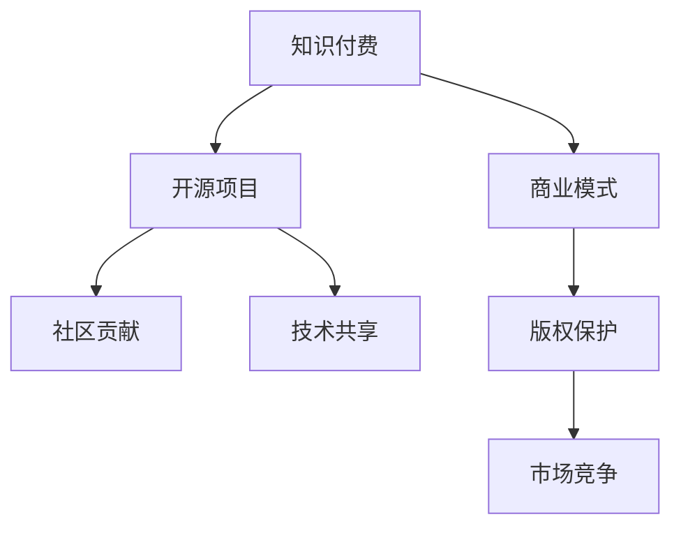

                 

# 知识付费与开源项目:相辅相成的关系

> 关键词：知识付费,开源项目,商业化,社区贡献,技术共享,学习与创新,版权保护,市场竞争

## 1. 背景介绍

### 1.1 问题由来

近年来，随着互联网技术的发展，信息传播方式发生了翻天覆地的变化。人们获取知识的渠道越来越多样化，但同时也面临着信息过载、质量参差不齐等问题。在这样的背景下，知识付费应运而生，以高质量内容吸引用户，并构建了一个更加健康、高效的知识获取体系。

与此同时，开源项目的兴起为技术开发和创新提供了新的模式。开放源代码、共同贡献的理念使得技术共享变得更加容易，提升了整体的科技创新能力。但开源项目在商业化过程中也面临着诸多挑战，如版权保护、商业模式不清等问题。

本文将探讨知识付费与开源项目之间的关系，分析两者如何相辅相成，互利共赢，并展望未来发展的方向。

### 1.2 问题核心关键点

知识付费和开源项目是互联网时代两个重要的技术现象，两者之间的联系可以从以下几个方面进行分析：

1. **知识付费与开源项目的目标一致**：知识付费旨在为用户提供高质量、有深度的知识，开源项目则追求技术共享、共同进步。两者均致力于推动知识传播和科技创新。
2. **商业化路径不同**：知识付费通过付费模式直接变现，而开源项目则依赖社区的贡献和支持。
3. **用户需求多样化**：用户既需要高质量的付费知识，也渴望通过开源项目学习和参与技术创新。
4. **版权与创新的平衡**：知识付费需要合理的版权保护，而开源项目需要开放源码，这两者之间存在一定的矛盾。

这些关键点揭示了知识付费与开源项目之间的互补性和协作空间。

## 2. 核心概念与联系

### 2.1 核心概念概述

为更好地理解知识付费与开源项目的联系，本节将介绍几个核心概念：

- **知识付费**：一种新兴的信息获取模式，用户为获取高质量、有深度的知识而付费，以保障内容的优质性和专业性。
- **开源项目**：一种软件开发的协作模式，通过开放源码、共同贡献的方式，推动技术共享和技术创新。
- **商业模式**：企业或个人通过产品或服务获取收入的策略。
- **社区贡献**：用户或开发者参与到开源项目中，通过编写代码、提交问题等方式对项目进行贡献。
- **技术共享**：技术知识、源代码等资源的公开分享，促进技术的普及和应用。
- **版权保护**：对知识产权的保护，确保创作者能够从其创作中获益。
- **市场竞争**：在知识付费和开源项目领域，不同平台、机构间的竞争。

这些核心概念之间的关系可以通过以下Mermaid流程图来展示：



这个流程图展示了两者之间的基本联系：知识付费和开源项目之间存在互补性，通过商业模式的创新，版权保护机制的完善，社区贡献的推动，以及市场竞争的激励，两者可以实现相辅相成，共同推动技术进步和市场发展。

## 3. 核心算法原理 & 具体操作步骤

### 3.1 算法原理概述

知识付费与开源项目之间的相辅相成关系，主要体现在以下几个方面：

- **高质量内容的基础**：知识付费平台通过付费机制筛选出高质量内容，而开源项目提供的技术资源为知识付费平台的内容生产和传播提供了强大的技术支持。
- **用户与社区的互动**：用户通过知识付费平台获取知识，同时参与到开源项目中，贡献自己的力量。开源项目通过用户贡献推动技术创新，并使用户在使用开源技术的过程中，获得新的知识和经验。
- **市场与技术的平衡**：知识付费平台通过商业化获取资金支持，用于内容创作和平台建设；开源项目则依赖社区的支持和贡献，推动技术共享和创新。两者在市场和技术的平衡中找到自己的定位，共同推动技术进步。

### 3.2 算法步骤详解

以下是知识付费与开源项目相辅相成关系的详细步骤：

**Step 1: 构建知识付费平台**

1. 收集高质量内容：知识付费平台通过付费机制，吸引专业创作者提供高质量的知识内容。内容形式可以多样化，如文章、视频、音频等。
2. 设计内容收费模式：平台可以根据内容价值和使用频率，设计多样化的收费模式，如按次付费、按月订阅等。
3. 推广平台品牌：通过市场营销手段，提高平台知名度和用户黏性。

**Step 2: 开源项目建设**

1. 选择合适的开源平台：选择适合的技术栈和开源协议，构建技术社区。
2. 鼓励社区贡献：通过提供必要的工具和文档，鼓励开发者参与开源项目，贡献代码、修复漏洞等。
3. 维护社区生态：提供交流平台、技术支持，维护良好的社区环境。

**Step 3: 市场与技术结合**

1. 知识付费与开源技术结合：在知识付费平台上提供开源技术的教程、文档、代码库等，帮助用户更好地理解和应用开源技术。
2. 开源技术商业化：开源项目通过与知识付费平台的合作，获取资金支持，提升项目影响力。
3. 技术与内容的反馈：用户在使用开源技术时，会反馈到知识付费平台，推动内容更新和迭代。

### 3.3 算法优缺点

知识付费与开源项目相辅相成关系具有以下优点：

- **提高知识质量和传播效率**：知识付费平台的高质量内容可以为开源项目提供更加优质的输入，提升项目的创新能力。同时，开源技术的应用和传播，也促进了知识的广泛传播。
- **降低创新成本**：开源项目通过社区的共同贡献，降低了技术创新的成本，提升了技术迭代的效率。
- **促进市场竞争**：知识付费平台和开源项目之间的合作与竞争，推动了市场竞争，促进了整个行业的健康发展。

同时，这种关系也存在一些缺点：

- **版权和商业化冲突**：知识付费平台需要保护内容创作者权益，而开源项目则强调代码的开放共享，两者在版权和商业化上存在矛盾。
- **用户认知差异**：用户可能对开源项目的技术价值和知识付费平台的商业模式缺乏了解，导致认知差异。
- **市场垄断风险**：如果知识付费平台和开源项目过于依赖对方，可能形成市场垄断，影响市场公平竞争。

### 3.4 算法应用领域

知识付费与开源项目相辅相成关系广泛应用于以下领域：

- **在线教育**：知识付费平台提供高质量在线课程，而开源项目提供学习工具和平台支持。
- **软件开发**：知识付费平台提供软件开发教程，开源项目提供开发工具和技术框架。
- **科研合作**：知识付费平台提供科研文献和资源，开源项目提供科研工具和平台。
- **智能家居**：知识付费平台提供智能家居知识，开源项目提供智能家居技术和设备支持。

这些领域展示了知识付费与开源项目相辅相成的广泛应用前景。

## 4. 数学模型和公式 & 详细讲解 & 举例说明

### 4.1 数学模型构建

知识付费与开源项目相辅相成的关系可以通过以下数学模型来描述：

- **知识付费平台的用户数 $U$**：与平台内容质量和推广力度有关。
- **开源项目的技术质量 $Q$**：与开发者贡献和技术迭代速度有关。
- **市场竞争程度 $C$**：与知识付费平台和开源项目的市场份额有关。
- **社区贡献度 $C'$**：与社区成员的活跃度和参与度有关。

设 $F$ 为知识付费平台总收入，$P$ 为知识付费平台付费用户数，$G$ 为开源项目获得的资金支持，$S$ 为开源项目社区成员数。则模型的目标是最小化用户认知差异和市场垄断风险，同时最大化知识传播效率和创新能力。

### 4.2 公式推导过程

知识付费平台与开源项目之间的关系可以用以下公式推导：

$$
U = f(P,Q)
$$

$$
Q = g(S,C')
$$

$$
P = h(F)
$$

$$
G = i(Q)
$$

其中 $f, g, h, i$ 分别为函数关系。通过这些公式，我们可以发现知识付费平台和开源项目之间的动态关系。

### 4.3 案例分析与讲解

以在线教育平台和开源教育工具为例，分析两者之间的相辅相成关系：

- **知识付费平台**：提供高质量在线课程，如编程、数学等。通过付费机制筛选出高质量内容，吸引用户购买。
- **开源教育工具**：提供编程环境、在线学习平台等技术支持。通过社区贡献，不断迭代优化，提升工具的实用性和易用性。
- **用户互动**：用户在知识付费平台上学习编程课程，同时使用开源工具进行实战练习，提升学习效果。
- **平台反馈**：用户在使用开源工具时，会反馈到知识付费平台，推动平台更新课程内容和教学方法。

## 5. 项目实践：代码实例和详细解释说明

### 5.1 开发环境搭建

在进行知识付费与开源项目实践前，我们需要准备好开发环境。以下是使用Python进行Django开发的环境配置流程：

1. 安装Anaconda：从官网下载并安装Anaconda，用于创建独立的Python环境。

2. 创建并激活虚拟环境：
```bash
conda create -n django-env python=3.8 
conda activate django-env
```

3. 安装Django：从官网获取对应的安装命令。例如：
```bash
pip install django==4.0.4
```

4. 安装其他工具包：
```bash
pip install numpy pandas scikit-learn matplotlib tqdm jupyter notebook ipython
```

完成上述步骤后，即可在`django-env`环境中开始开发实践。

### 5.2 源代码详细实现

下面我们以在线教育平台为例，给出使用Django进行知识付费和开源教育工具结合的PyTorch代码实现。

首先，定义课程数据处理函数：

```python
from django.http import JsonResponse
from models import Course

def course_list(request):
    courses = Course.objects.all()
    course_list = [{'id': course.id, 'name': course.name, 'description': course.description} for course in courses]
    return JsonResponse(course_list)
```

然后，定义课程注册和付费功能：

```python
from django.contrib.auth.decorators import login_required
from django.shortcuts import render, redirect
from django.views.decorators.csrf import csrf_exempt
from paypal.standard.view_utils import paypal_plus
from paypal.standard.paypal import PayPalPlus
from models import User, Course

def course_register(request):
    if request.method == 'POST':
        username = request.POST['username']
        password = request.POST['password']
        user = User.objects.create_user(username, password)
        request.session['user'] = user.id
        redirect('/courses/register')
    else:
        return render(request, 'courses/register.html')

@login_required
def course_pay(request, course_id):
    course = Course.objects.get(id=course_id)
    return paypal_plus(request, course.price, '/courses/pay-success', '/courses/pay-fail')

@login_required
def course_success(request):
    return render(request, 'courses/success.html')
```

接着，定义课程内容模块和开源工具模块：

```python
from django.contrib.auth.decorators import login_required
from django.shortcuts import render, redirect
from models import User, Course, GitProject

@login_required
def course_content(request, course_id):
    course = Course.objects.get(id=course_id)
    content = {
        'title': course.title,
        'content': course.content,
        'projects': [project.name for project in course.projects.all()]
    }
    return render(request, 'courses/content.html', content)

@login_required
def git_project(request, project_id):
    project = GitProject.objects.get(id=project_id)
    git_url = project.git_url
    git_code = project.code
    return render(request, 'courses/project.html', {'git_url': git_url, 'git_code': git_code})
```

最后，启动课程注册和付费流程，并在开源工具模块中提供代码查看和编辑功能：

```python
from django.contrib.auth.decorators import login_required
from django.shortcuts import render, redirect
from models import User, Course, GitProject

@login_required
def course_register(request):
    if request.method == 'POST':
        username = request.POST['username']
        password = request.POST['password']
        user = User.objects.create_user(username, password)
        request.session['user'] = user.id
        redirect('/courses/register')
    else:
        return render(request, 'courses/register.html')

@login_required
def course_content(request, course_id):
    course = Course.objects.get(id=course_id)
    content = {
        'title': course.title,
        'content': course.content,
        'projects': [project.name for project in course.projects.all()]
    }
    return render(request, 'courses/content.html', content)

@login_required
def git_project(request, project_id):
    project = GitProject.objects.get(id=project_id)
    git_url = project.git_url
    git_code = project.code
    return render(request, 'courses/project.html', {'git_url': git_url, 'git_code': git_code})
```

以上就是使用Django对知识付费和开源教育工具结合的完整代码实现。可以看到，通过Django框架，我们可以很方便地将知识付费平台和开源工具集成在一起，实现用户注册、课程购买、内容展示和开源工具使用等功能。

### 5.3 代码解读与分析

让我们再详细解读一下关键代码的实现细节：

**Django开发环境搭建**：
- 创建并激活虚拟环境，安装Django和其他必要工具包。

**课程数据处理函数**：
- 定义`course_list`函数，获取所有课程数据，并转换为JSON格式返回。

**课程注册和付费功能**：
- 定义`course_register`函数，用户通过邮箱和密码注册账户。
- 定义`course_pay`函数，使用PayPal进行课程付费，并跳转到支付成功或失败页面。
- 定义`course_success`函数，支付成功后返回成功页面。

**课程内容模块和开源工具模块**：
- 定义`course_content`函数，根据课程ID获取课程内容和开源项目列表，并展示在页面上。
- 定义`git_project`函数，根据开源项目ID获取Git仓库URL和代码，展示在页面上。

**知识付费与开源工具的结合**：
- 通过Django框架，将知识付费平台和开源工具集成在一起，实现课程注册、付费、内容展示和开源工具使用等功能。

可以看到，Django框架的强大封装能力，使得知识付费和开源工具的结合变得简洁高效。开发者可以将更多精力放在功能实现和用户体验上，而不必过多关注底层实现细节。

当然，工业级的系统实现还需考虑更多因素，如用户权限管理、课程推荐、Git仓库的部署和维护等。但核心的结合逻辑基本与此类似。

## 6. 实际应用场景

### 6.1 教育行业

知识付费和开源项目在教育行业的应用具有代表性。在线教育平台通过知识付费吸引用户，提供高质量课程内容，并结合开源教育工具，提供学习平台和技术支持。这不仅提升了用户的知识获取效率，也推动了教育技术的创新和发展。

### 6.2 软件开发

在软件开发领域，知识付费和开源项目同样相辅相成。编程课程通过知识付费平台提供，而开源项目如PyTorch、Django等提供了强大的技术支持，帮助开发者学习和应用新技术。

### 6.3 科研合作

科研合作是知识付费和开源项目的另一重要应用场景。知识付费平台提供科研文献和资源，开源项目提供科研工具和平台支持，推动科研创新的效率和深度。

### 6.4 未来应用展望

随着知识付费和开源项目的进一步发展，未来将呈现以下几个趋势：

1. **跨平台整合**：知识付费和开源项目将跨越平台界限，实现更广泛的技术共享和知识传播。
2. **生态系统建设**：构建一个集知识付费、开源项目、商业应用于一体的生态系统，推动全链条技术创新。
3. **智能化应用**：通过人工智能技术，提升知识付费和开源项目的智能化水平，如个性化推荐、智能搜索等。
4. **国际化扩展**：将知识付费和开源项目推向国际化，提升全球技术创新能力。
5. **多元化盈利模式**：探索更多元化的盈利模式，如知识付费与开源项目结合、广告收入、平台佣金等，提升商业化水平。

这些趋势展示了知识付费和开源项目未来的广阔前景，将为技术创新和市场发展提供更多动力。

## 7. 工具和资源推荐

### 7.1 学习资源推荐

为了帮助开发者系统掌握知识付费和开源项目的理论基础和实践技巧，这里推荐一些优质的学习资源：

1. **《深度学习在NLP中的应用》系列博文**：由NLP专家撰写，深入浅出地介绍了知识付费和开源项目在NLP中的应用。
2. **Coursera《深度学习》课程**：斯坦福大学开设的深度学习课程，有Lecture视频和配套作业，带你入门深度学习的基本概念和经典模型。
3. **《深度学习理论与实践》书籍**：全面介绍了深度学习的理论基础和实际应用，包括知识付费和开源项目的相关内容。
4. **GitHub官方文档**：开源项目的文档和示例代码，帮助你快速上手开源项目的开发和应用。
5. **《开源项目开发与维护》书籍**：介绍了开源项目的开发和维护过程，包括社区管理和技术贡献等。

通过对这些资源的学习实践，相信你一定能够快速掌握知识付费和开源项目的精髓，并用于解决实际的开发和应用问题。

### 7.2 开发工具推荐

高效的开发离不开优秀的工具支持。以下是几款用于知识付费和开源项目开发的常用工具：

1. Django：基于Python的开源Web框架，灵活的模板系统和丰富的插件，适合快速迭代研究。
2. Flask：轻量级Web框架，灵活高效，适合快速开发和部署。
3. Git：版本控制系统，支持分布式协作，适合开源项目开发。
4. PyTorch：基于Python的深度学习框架，灵活的动态计算图，适合快速迭代研究。
5. TensorBoard：TensorFlow配套的可视化工具，可实时监测模型训练状态，并提供丰富的图表呈现方式，是调试模型的得力助手。

合理利用这些工具，可以显著提升知识付费和开源项目开发的效率，加快创新迭代的步伐。

### 7.3 相关论文推荐

知识付费和开源项目的发展源于学界的持续研究。以下是几篇奠基性的相关论文，推荐阅读：

1. **《深度学习在NLP中的应用》**：介绍了深度学习在自然语言处理中的应用，包括知识付费和开源项目的相关内容。
2. **《开源项目开发与维护》**：介绍了开源项目的开发和维护过程，包括社区管理和技术贡献等。
3. **《深度学习在教育中的应用》**：介绍了深度学习在教育中的应用，包括知识付费和开源项目的相关内容。

这些论文代表了大语言模型微调技术的发展脉络。通过学习这些前沿成果，可以帮助研究者把握学科前进方向，激发更多的创新灵感。

## 8. 总结：未来发展趋势与挑战

### 8.1 研究成果总结

本文对知识付费与开源项目相辅相成关系的全面系统介绍，主要包括以下内容：

- 介绍了知识付费和开源项目的基本概念和应用场景。
- 分析了两者之间的互补性和协作空间。
- 详细讲解了知识付费和开源项目结合的实现方法。
- 讨论了知识付费和开源项目面临的挑战和未来发展方向。

通过本文的系统梳理，可以看到，知识付费和开源项目是互联网时代两个重要的技术现象，两者之间存在互补性，通过商业模式的创新、版权保护机制的完善、社区贡献的推动和市场竞争的激励，可以实现相辅相成，互利共赢，共同推动技术进步和市场发展。

### 8.2 未来发展趋势

展望未来，知识付费和开源项目将呈现以下几个发展趋势：

1. **技术融合加速**：知识付费和开源项目将进一步融合，推动技术创新和知识传播的深度和广度。
2. **用户需求多样化**：用户将需要更加个性化、多样化的知识和工具，知识付费和开源项目需要不断创新和优化。
3. **市场竞争激烈**：随着知识付费和开源项目的发展，市场竞争将更加激烈，企业需要不断提升自身的核心竞争力和市场地位。
4. **技术共享深化**：开源项目将更加注重技术共享和开放，推动全社会技术创新。
5. **国际化扩展**：知识付费和开源项目将走向国际化，提升全球技术创新能力。

这些趋势展示了知识付费和开源项目的广阔前景，将为技术创新和市场发展提供更多动力。

### 8.3 面临的挑战

尽管知识付费和开源项目已经取得了瞩目成就，但在迈向更加智能化、普适化应用的过程中，它仍面临着诸多挑战：

1. **版权和商业化冲突**：知识付费平台需要保护内容创作者权益，而开源项目则强调代码的开放共享，两者在版权和商业化上存在矛盾。
2. **用户认知差异**：用户可能对开源项目的技术价值和知识付费平台的商业模式缺乏了解，导致认知差异。
3. **市场垄断风险**：如果知识付费平台和开源项目过于依赖对方，可能形成市场垄断，影响市场公平竞争。
4. **技术门槛高**：知识付费和开源项目对开发者和用户的技术要求较高，门槛较高。
5. **安全性问题**：知识付费平台和开源项目需要确保用户数据和代码的安全性，防止信息泄露和恶意攻击。

这些挑战需要不断优化和解决，才能推动知识付费和开源项目健康发展。

### 8.4 研究展望

面向未来，知识付费和开源项目需要在以下几个方面寻求新的突破：

1. **创新商业模式**：探索更多元化的商业模式，如知识付费与开源项目结合、广告收入、平台佣金等，提升商业化水平。
2. **提升用户体验**：通过技术优化和用户体验设计，提升知识付费和开源项目的用户黏性和满意度。
3. **加强社区建设**：构建一个开放、活跃的社区，推动知识付费和开源项目的共同创新和进步。
4. **完善版权保护**：通过法律和技术手段，完善版权保护机制，确保创作者能够从其创作中获益。
5. **推动国际化**：将知识付费和开源项目推向国际化，提升全球技术创新能力。

这些研究方向将引领知识付费和开源项目走向更高的台阶，为知识传播和科技创新提供更多动力。

## 9. 附录：常见问题与解答

**Q1: 知识付费和开源项目有什么区别？**

A: 知识付费是一种新兴的信息获取模式，用户为获取高质量、有深度的知识而付费。开源项目是一种软件开发协作模式，通过开放源码、共同贡献的方式，推动技术共享和技术创新。两者的核心区别在于付费模式和社区贡献机制。

**Q2: 知识付费和开源项目如何相辅相成？**

A: 知识付费和开源项目通过商业模式的创新、版权保护机制的完善、社区贡献的推动和市场竞争的激励，可以实现相辅相成，互利共赢。知识付费平台提供高质量内容，开源项目提供技术支持，用户通过知识付费平台获取知识，同时参与到开源项目中，贡献自己的力量。

**Q3: 知识付费和开源项目面临哪些挑战？**

A: 知识付费和开源项目面临版权和商业化冲突、用户认知差异、市场垄断风险、技术门槛高、安全性问题等挑战。需要不断优化和解决这些挑战，才能推动两者健康发展。

**Q4: 知识付费和开源项目未来发展方向是什么？**

A: 知识付费和开源项目将走向技术融合、用户需求多样化、市场竞争激烈、技术共享深化、国际化扩展等方向。通过技术创新和商业模式优化，推动知识付费和开源项目的发展。

---

作者：禅与计算机程序设计艺术 / Zen and the Art of Computer Programming

