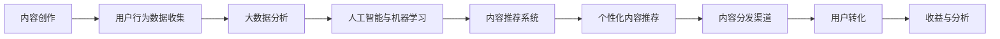

                 

# 知识付费创业中的内容营销自动化

## 1. 背景介绍

随着互联网和数字技术的发展，知识付费成为越来越多人获取知识、技能和信息的首选方式。据统计，中国知识付费市场规模已经超过300亿人民币，呈现出迅猛增长的态势。在这种背景下，知识付费创业者需要不断优化内容质量，同时通过有效的内容营销策略，扩大用户群体，提高用户转化率，最终实现商业变现。

内容营销自动化是大数据、人工智能与数字营销结合的产物，通过对用户行为数据的深度分析，实现内容的精准推送、个性推荐和自动化管理，提升内容营销的效率和效果。本文将从数据驱动的内容营销自动化的核心概念、技术原理、操作步骤、模型构建和实际应用等方面进行详细阐述，希望能为知识付费创业提供有益的参考和借鉴。

## 2. 核心概念与联系

### 2.1 核心概念概述

要理解内容营销自动化，首先需要理解以下几个核心概念：

- **内容营销**：利用内容吸引用户，进行品牌推广和用户转化的一种营销方式。
- **大数据分析**：通过分析大量用户数据，挖掘用户的兴趣和行为规律，为内容推荐和营销策略提供数据支持。
- **人工智能与机器学习**：利用算法和模型对大数据进行深度挖掘和分析，自动生成和推荐个性化内容，优化营销效果。
- **内容推荐系统**：基于用户行为和内容特征，自动匹配并推荐相关内容的技术系统。

这些概念之间存在紧密联系，共同构成了内容营销自动化的基础。大数据分析和人工智能技术为内容推荐系统提供支撑，而内容推荐系统则优化了内容营销的效率和效果，使知识付费创业者在内容营销中更具竞争力。

### 2.2 核心概念原理和架构的 Mermaid 流程图



这个流程图展示了内容营销自动化的核心流程：首先通过内容创作产生优质内容，然后收集用户行为数据，接着利用大数据分析和人工智能技术挖掘用户兴趣和行为规律，构建内容推荐系统，实现个性化内容推荐，最终通过分发渠道触达用户，促进用户转化和收益。

## 3. 核心算法原理 & 具体操作步骤

### 3.1 算法原理概述

内容营销自动化的核心算法原理主要基于协同过滤和深度学习。协同过滤算法通过对用户行为和内容特征的相似度计算，推荐用户可能感兴趣的内容；深度学习模型则通过分析用户行为数据，自动挖掘和生成高质量的个性化推荐。

协同过滤算法主要包括基于用户的协同过滤和基于内容的协同过滤。基于用户的协同过滤通过计算用户之间行为模式的相似度，找到与目标用户相似的其他用户，并推荐他们喜欢的内容；基于内容的协同过滤则根据内容之间的相似度，推荐相似的内容给用户。

深度学习模型包括神经网络、循环神经网络（RNN）、长短期记忆网络（LSTM）等，这些模型通过多层次的数据分析，提取用户行为特征和内容特征，实现更准确和高效的个性化推荐。

### 3.2 算法步骤详解

内容营销自动化的具体操作步骤如下：

1. **用户行为数据收集**：利用网站、应用等渠道收集用户行为数据，包括浏览历史、购买记录、评分反馈等。

2. **大数据分析**：对用户行为数据进行清洗和预处理，使用统计分析、聚类分析等方法，挖掘用户的兴趣和行为规律。

3. **内容特征提取**：对内容进行特征提取，包括关键词、标签、分类等，以便与用户行为数据进行匹配。

4. **构建推荐模型**：选择合适的算法和模型，如协同过滤算法、深度学习模型等，对用户和内容特征进行分析，生成推荐结果。

5. **个性化内容推荐**：根据用户特征和内容特征，生成个性化推荐内容，并推送到用户终端。

6. **效果评估与优化**：对推荐效果进行评估，根据用户反馈和行为数据，优化推荐模型和策略。

### 3.3 算法优缺点

内容营销自动化算法具有以下优点：

- **个性化推荐**：通过分析用户行为数据和内容特征，实现个性化推荐，提高用户满意度和转化率。
- **高效性**：自动化处理大量数据和推荐任务，减轻人工负担，提升推荐效率。
- **可扩展性**：算法模型和推荐系统可以轻松扩展到不同的业务场景和应用，适应多样化的需求。

同时，这些算法也存在一些缺点：

- **数据质量依赖**：算法的推荐效果高度依赖于数据的质量和完整性，数据偏差可能影响推荐结果。
- **冷启动问题**：对于新用户或新内容，由于缺乏足够的行为数据和特征信息，可能导致推荐效果不佳。
- **隐私问题**：收集和分析用户行为数据可能涉及隐私问题，需注意数据保护和隐私合规。

### 3.4 算法应用领域

内容营销自动化技术不仅适用于知识付费创业，还可以广泛应用于电商、新闻、娱乐等领域，通过个性化推荐提升用户体验和营销效果。

- **电商领域**：根据用户浏览和购买历史，推荐相关商品和优惠活动，提升销售转化率。
- **新闻媒体**：根据用户阅读历史和兴趣，推荐相关新闻和专题，提高用户粘性和传播效果。
- **娱乐行业**：根据用户观影、听歌历史，推荐相关影视剧、音乐等，提升用户体验和留存率。

## 4. 数学模型和公式 & 详细讲解 & 举例说明

### 4.1 数学模型构建

内容营销自动化的数学模型主要基于用户行为数据和内容特征，使用协同过滤算法和深度学习模型进行推荐。

协同过滤算法包括基于用户的协同过滤和基于内容的协同过滤，其数学模型如下：

- 基于用户的协同过滤：
$$ U_i = U_j + W^T \cdot V_j $$
其中，$U_i$ 和 $U_j$ 分别表示用户 $i$ 和用户 $j$ 的用户行为评分向量，$V_j$ 表示用户 $j$ 的兴趣向量，$W$ 是用户行为评分和兴趣向量的权重矩阵。

- 基于内容的协同过滤：
$$ C_i = C_j + W^T \cdot V_j $$
其中，$C_i$ 和 $C_j$ 分别表示内容 $i$ 和内容 $j$ 的内容特征向量，$V_j$ 表示内容 $j$ 的内容特征向量。

深度学习模型使用神经网络、RNN、LSTM 等，通过对用户行为数据和内容特征进行多层次的深度分析，生成推荐结果。

### 4.2 公式推导过程

以深度学习模型中的循环神经网络（RNN）为例，其推导过程如下：

设 $x_t$ 表示时刻 $t$ 的用户行为数据，$h_t$ 表示时刻 $t$ 的隐藏状态，$W$ 和 $b$ 分别表示权重矩阵和偏置向量，$\sigma$ 表示激活函数。

$$ h_t = \sigma(Wx_t + b) $$
$$ \hat{y}_t = \sigma(h_t) $$

其中，$\hat{y}_t$ 表示时刻 $t$ 的预测输出。通过不断迭代，可以计算出用户在未来时刻的预测行为，从而实现个性化推荐。

### 4.3 案例分析与讲解

假设一个在线教育平台，收集了用户浏览课程、购买课程、评分课程的数据，构建了用户行为数据集和课程内容特征集。使用协同过滤算法和深度学习模型进行个性化推荐：

1. 基于用户行为数据的协同过滤：计算每个用户与其他用户的行为评分相似度，找到与目标用户相似的其他用户，推荐他们喜欢的课程。

2. 基于课程内容特征的协同过滤：计算每门课程与其他课程的特征相似度，推荐相似课程给用户。

3. 深度学习模型：利用用户行为数据和课程内容特征，构建 RNN 模型，生成个性化推荐结果。

## 5. 项目实践：代码实例和详细解释说明

### 5.1 开发环境搭建

1. **Python环境搭建**：安装 Python 3.8 及以上版本，使用虚拟环境（如 virtualenv）进行隔离。
2. **机器学习库安装**：安装 scikit-learn、TensorFlow、Keras 等机器学习库，以便进行模型构建和训练。
3. **数据预处理库安装**：安装 Pandas、NumPy 等数据预处理库，用于数据清洗和特征提取。

### 5.2 源代码详细实现

以下是一个使用 TensorFlow 构建基于协同过滤的推荐系统的示例代码：

```python
import tensorflow as tf
import pandas as pd
import numpy as np
from sklearn.model_selection import train_test_split

# 加载数据
data = pd.read_csv('user_behavior.csv')
user_data = data[['user_id', 'item_id', 'rating']]
item_data = data[['item_id', 'item_category']]

# 数据预处理
user_data = user_data.drop_duplicates().reset_index(drop=True)
item_data = item_data.drop_duplicates().reset_index(drop=True)

# 数据拆分
train_data, test_data = train_test_split(user_data, test_size=0.2, random_state=42)

# 构建用户-物品评分矩阵
user_item_matrix = pd.pivot_table(user_data, index='user_id', columns='item_id', values='rating').fillna(0)

# 构建物品-物品评分矩阵
item_item_matrix = pd.pivot_table(item_data, index='item_id', columns='item_category', values='rating').fillna(0)

# 构建用户-物品评分矩阵
user_item_matrix = pd.concat([user_item_matrix, item_item_matrix], axis=1)

# 填充缺失值
user_item_matrix.fillna(0, inplace=True)

# 构建协同过滤模型
def collaborative_filtering(user_item_matrix):
    user_factor = tf.keras.layers.Dense(10, activation='relu')
    item_factor = tf.keras.layers.Dense(10, activation='relu')
    user_item_matrix = user_item_matrix.to_dense()

    user_vector = user_factor(user_item_matrix)
    item_vector = item_factor(user_item_matrix)
    user_item_vector = tf.multiply(user_vector, item_vector)
    return user_item_vector

# 训练模型
user_item_matrix_train = user_item_matrix.iloc[train_data.index]
user_item_matrix_test = user_item_matrix.iloc[test_data.index]

user_item_vector = collaborative_filtering(user_item_matrix_train)
predictions = user_item_vector @ user_item_vector_test

# 计算误差
mse = tf.keras.losses.mean_squared_error(predictions, test_data['rating'].values)
print(f"Mean Squared Error: {mse.numpy()}")

# 优化模型
model = tf.keras.Sequential([
    tf.keras.layers.Dense(10, activation='relu', input_shape=(user_item_matrix_train.shape[1],)),
    tf.keras.layers.Dense(1)
])

model.compile(optimizer='adam', loss='mse')
model.fit(user_item_matrix_train, test_data['rating'].values, epochs=10, validation_data=(user_item_matrix_test, test_data['rating'].values))

# 生成推荐结果
user_item_matrix_test = user_item_matrix_test.fillna(0)
predictions = model.predict(user_item_matrix_test)
print(predictions)
```

### 5.3 代码解读与分析

上述代码首先加载用户行为数据和物品特征数据，并进行数据预处理和拆分。然后使用协同过滤算法构建用户-物品评分矩阵和物品-物品评分矩阵，并对矩阵进行填充和拼接。最后构建深度学习模型，并进行训练和预测，输出推荐结果。

## 6. 实际应用场景

### 6.1 知识付费平台内容推荐

知识付费平台通过收集用户学习行为数据，构建个性化推荐系统，为用户推荐相关课程和书籍。这不仅提升了用户学习体验，还增加了平台的粘性和留存率。

### 6.2 电商网站商品推荐

电商网站利用用户浏览和购买数据，构建推荐系统，为用户推荐相关商品和优惠活动。这不仅提高了用户的购买转化率，还增加了平台的销售额和利润。

### 6.3 新闻媒体内容推荐

新闻媒体利用用户阅读数据，构建个性化推荐系统，为用户推荐相关新闻和专题。这不仅提高了用户粘性和留存率，还增加了媒体的点击率和传播效果。

### 6.4 未来应用展望

内容营销自动化的未来应用前景广阔，将在更多的场景中得到应用，如智能家居、健康管理、金融理财等。通过深度学习和大数据分析技术，为各类应用提供个性化的内容推荐，提升用户体验和应用效果。

## 7. 工具和资源推荐

### 7.1 学习资源推荐

1. **《Python深度学习》**：用深入浅出的方式介绍了深度学习的基本概念和核心算法。
2. **《推荐系统实战》**：介绍了推荐系统的基本原理和实现方法，并提供了丰富的代码示例。
3. **Coursera 推荐系统课程**：由斯坦福大学教授主讲，系统介绍了推荐系统的理论和应用。
4. **Kaggle 数据科学竞赛**：通过参加竞赛，可以积累实际项目经验，提升数据分析和建模能力。

### 7.2 开发工具推荐

1. **TensorFlow**：由谷歌开发的深度学习框架，提供了丰富的API和模型库。
2. **PyTorch**：由Facebook开发的深度学习框架，灵活性强，易于调试和优化。
3. **Keras**：基于TensorFlow和Theano的高级深度学习库，易于上手。
4. **Jupyter Notebook**：开源的交互式编程环境，方便进行数据处理和模型调试。

### 7.3 相关论文推荐

1. **《深度学习推荐系统》**：介绍了深度学习在推荐系统中的应用，涵盖了协同过滤、序列模型、对抗生成网络等。
2. **《利用协同过滤进行推荐》**：详细介绍了协同过滤算法的原理和实现方法。
3. **《内容推荐系统的研究综述》**：综述了内容推荐系统的最新研究成果，包括协同过滤、深度学习等。

## 8. 总结：未来发展趋势与挑战

### 8.1 研究成果总结

内容营销自动化通过深度学习和大数据分析技术，实现了个性化推荐，提升了用户体验和营销效果。未来将在大规模数据集、跨平台应用、动态调整等方面继续发展，为知识付费创业提供更强大的支持。

### 8.2 未来发展趋势

1. **多模态数据融合**：未来推荐系统将融合多种数据源，如社交网络、传感器数据等，提升推荐效果。
2. **跨平台协同推荐**：实现不同平台之间的推荐系统协同，提升用户粘性和留存率。
3. **动态推荐**：根据用户行为实时调整推荐策略，提升推荐精度和时效性。

### 8.3 面临的挑战

1. **数据隐私问题**：用户行为数据涉及隐私问题，如何保护用户隐私是重要挑战。
2. **推荐算法偏见**：推荐算法可能存在偏见，如何消除偏见，提升推荐公平性是重要课题。
3. **算法效率**：高维数据和高频数据可能对算法效率造成影响，如何提升算法效率是重要研究方向。

### 8.4 研究展望

未来内容营销自动化将继续优化算法和模型，融合更多数据源，提升推荐效果和用户满意度。同时，通过算法公平性研究和模型高效化研究，保障推荐系统在各种场景下的稳定性和鲁棒性。

## 9. 附录：常见问题与解答

**Q1: 内容营销自动化技术如何保证推荐结果的准确性？**

A: 内容营销自动化通过深度学习和大数据分析技术，利用协同过滤算法和深度学习模型对用户行为数据和内容特征进行分析和匹配，生成推荐结果。为了保证推荐结果的准确性，可以采用以下方法：
1. 数据预处理：对数据进行清洗和预处理，去除噪声和异常值，保证数据质量。
2. 模型优化：选择适合业务的推荐算法和模型，并进行优化和调参，提升模型精度。
3. 用户反馈机制：收集用户对推荐结果的反馈，不断优化推荐模型和策略。

**Q2: 内容营销自动化技术在推荐时如何避免冷启动问题？**

A: 内容营销自动化技术在推荐时可以通过以下方法避免冷启动问题：
1. 初始化推荐：为冷启动用户或内容，提供初始推荐列表，增加用户和内容的曝光机会。
2. 多维度特征提取：通过多维度特征提取，利用用户行为数据、内容特征、时间特征等，提升推荐效果。
3. 推荐算法组合：组合使用多种推荐算法，如协同过滤、深度学习、知识图谱等，提升推荐效果和鲁棒性。

**Q3: 内容营销自动化技术在应用中需要注意哪些伦理和隐私问题？**

A: 内容营销自动化技术在应用中需要注意以下伦理和隐私问题：
1. 用户隐私保护：确保用户数据的安全和隐私，避免数据泄露和滥用。
2. 算法公平性：避免推荐算法存在偏见，保证推荐公平性。
3. 用户选择权：尊重用户的推荐选择权，允许用户自主选择和屏蔽推荐内容。

**Q4: 内容营销自动化技术如何保证推荐的实时性？**

A: 内容营销自动化技术可以通过以下方法保证推荐的实时性：
1. 分布式计算：利用分布式计算技术，实现高效的推荐计算和存储。
2. 缓存机制：使用缓存技术，减少重复计算，提升推荐速度。
3. 动态调整：根据用户行为实时调整推荐策略，提高推荐效率和精度。

---

作者：禅与计算机程序设计艺术 / Zen and the Art of Computer Programming

