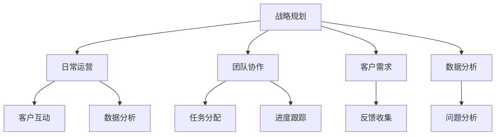

                 

## 1. 背景介绍

随着知识付费的兴起，越来越多的人通过在线课程、订阅服务等方式获取知识，这是一个快速增长且充满机遇的领域。然而，知识付费创业不仅仅是课程内容的生产，更需要精细的时间管理来确保高效运营、持续增长和长期发展。本文将系统介绍知识付费创业中时间管理的技巧，涵盖战略规划、日常运营、团队协作等多个层面，为创业者提供实用的指导。

## 2. 核心概念与联系

### 2.1 核心概念概述

在知识付费创业中，时间管理是一项至关重要的技能。它不仅涉及个人效率的提升，更关乎整体业务的运营和可持续性。以下是几个核心概念：

- **战略规划**：在长期发展中，制定明确的时间表和目标，确保资源和努力朝向正确方向。
- **日常运营**：通过日复一日的时间安排，保持业务的连续性和稳定性。
- **团队协作**：管理团队成员的时间，确保任务有序推进，提高整体效率。
- **客户需求**：理解并响应客户需求，根据反馈调整时间管理策略。
- **数据分析**：通过数据监控，发现问题并及时调整，优化时间管理。

这些概念相互联系，共同构成知识付费创业中时间管理的框架。

### 2.2 核心概念原理和架构的 Mermaid 流程图



这个流程图展示了时间管理在知识付费创业中的不同层面的应用，以及它们之间的相互作用。战略规划指导日常运营，团队协作和客户需求确保运营的灵活性和适应性，数据分析则提供持续改进的基础。

## 3. 核心算法原理 & 具体操作步骤

### 3.1 算法原理概述

知识付费创业中的时间管理主要遵循以下算法原理：

1. **目标设定与分解**：将长期目标分解为具体、可操作的任务和里程碑，制定详细的计划。
2. **优先级排序**：根据任务的紧急性和重要性进行排序，优先处理关键任务。
3. **时间块管理**：将工作时间划分为固定的时间块，每个时间块专注于特定任务。
4. **回顾与调整**：定期回顾时间管理的效果，根据实际情况进行调整。

### 3.2 算法步骤详解

#### 3.2.1 目标设定与分解

1. **长期目标设定**：明确知识付费创业的长期愿景，如市场份额、用户增长等。
2. **短期目标设定**：根据长期目标设定短期目标，如月度或季度目标。
3. **任务分解**：将短期目标分解为具体任务，分配到每个时间段。

#### 3.2.2 优先级排序

1. **紧急性评估**：评估每个任务的截止日期，区分紧急与非紧急。
2. **重要性评估**：评估任务对长期目标的贡献，区分重要与次要。
3. **优先级矩阵**：构建优先级矩阵，确定每个任务的优先级顺序。

#### 3.2.3 时间块管理

1. **时间块划分**：将一天划分为若干个时间块，每个时间块专注于特定任务。
2. **固定时间段**：每个时间块内不中断，专注于任务完成。
3. **任务切换**：任务间切换需短暂过渡，避免注意力分散。

#### 3.2.4 回顾与调整

1. **每日回顾**：每天结束时，回顾当天的工作成果和未完成的任务。
2. **每周回顾**：每周进行更全面的回顾，评估进度和效果。
3. **调整策略**：根据回顾结果，调整目标设定和任务分配。

### 3.3 算法优缺点

**优点**：
1. **提高效率**：通过明确的目标和优先级排序，确保资源和努力投入到最关键的任务上。
2. **增强灵活性**：时间块管理提供灵活性，允许在必要时调整任务优先级。
3. **促进持续改进**：通过定期回顾与调整，持续优化时间管理策略。

**缺点**：
1. **复杂性**：初期可能需要较长时间来适应和调整策略。
2. **变化适应**：面对突发情况，可能需要快速调整，影响原有计划。
3. **依赖于执行**：执行力和纪律性是成功关键，但对某些人来说，这可能是一个挑战。

### 3.4 算法应用领域

时间管理技巧在知识付费创业的多个领域都有广泛应用：

- **内容制作**：确保内容生产和更新计划有序进行。
- **市场营销**：安排各类营销活动和推广计划。
- **客户服务**：管理客户咨询和支持的时间安排。
- **团队管理**：协调团队成员的工作时间，优化整体效率。

## 4. 数学模型和公式 & 详细讲解 & 举例说明

### 4.1 数学模型构建

设知识付费创业的长期目标为 $G$，短期目标为 $T$，任务集合为 $T_j$（其中 $j$ 为任务编号）。定义函数 $f(t)$ 为在时间 $t$ 内完成的任务数量，则时间管理模型可以表示为：

$$
G = \sum_{t=1}^{T} f(t)
$$

其中 $T$ 为总时间，$f(t)$ 为时间 $t$ 内完成任务的数量。

### 4.2 公式推导过程

1. **目标分解**：
   - 将长期目标 $G$ 分解为 $M$ 个短期目标，每个短期目标 $T_k$ 分解为 $N_k$ 个任务 $T_{k,j}$，则有：
   $$
   G = \sum_{k=1}^{M} T_k
   $$
   $$
   T_k = \sum_{j=1}^{N_k} T_{k,j}
   $$

2. **优先级排序**：
   - 定义优先级函数 $P_j$，表示任务 $T_{k,j}$ 的优先级，则有：
   $$
   P_j = w_1 \times \text{紧急性} + w_2 \times \text{重要性}
   $$
   其中 $w_1$ 和 $w_2$ 为紧急性和重要性的权重。

3. **时间块管理**：
   - 将每天划分为 $N$ 个时间块，每个时间块长度为 $t_i$，则有：
   $$
   \sum_{i=1}^{N} t_i = T
   $$
   - 在每个时间块内，任务 $T_{k,j}$ 的实际完成时间 $c_i$ 与计划时间 $p_i$ 之差为 $d_i$，则有：
   $$
   d_i = p_i - c_i
   $$

### 4.3 案例分析与讲解

假设某知识付费平台计划在接下来的三个月内推出一个新产品，长期目标为在三个月内累计获取10000名订阅用户。短期目标为第一个月内完成市场推广和内容准备，第二个月内完成产品开发和测试，第三个月内完成用户引入和反馈收集。

1. **目标分解**：
   - 第一个月：市场推广（任务1）、内容准备（任务2）
   - 第二个月：产品开发（任务3）、测试（任务4）
   - 第三个月：用户引入（任务5）、反馈收集（任务6）

2. **优先级排序**：
   - 任务1和任务2优先级最高，因为市场推广和内容准备是产品推出的基础。任务3和任务4次之，产品开发和测试需要时间投入。任务5和任务6相对较后，但在产品成功推出后应优先处理。

3. **时间块管理**：
   - 将每天划分为上午、下午和晚上三个时间块，每个时间块专注于特定任务。例如，上午时间块专注于市场推广，下午时间块专注于产品开发，晚上时间块进行内容准备。

## 5. 项目实践：代码实例和详细解释说明

### 5.1 开发环境搭建

1. **Python环境**：
   - 安装Python 3.9及以上版本。
   - 安装必要的库，如 `pandas`、`numpy`、`matplotlib` 等。

2. **项目管理工具**：
   - 使用 `Git` 进行版本控制，确保代码的追踪和回溯。
   - 使用 `Jupyter Notebook` 进行代码编写和实验。

### 5.2 源代码详细实现

以下是一个简单的 Python 代码示例，展示如何使用 `pandas` 进行任务管理：

```python
import pandas as pd

# 定义任务和优先级
tasks = ['市场推广', '内容准备', '产品开发', '测试', '用户引入', '反馈收集']
priorities = [1, 1, 1, 2, 3, 3]

# 定义任务完成时间
start_times = ['2023-01-01', '2023-01-02', '2023-02-01', '2023-02-02', '2023-03-01', '2023-03-02']

# 创建 DataFrame
df = pd.DataFrame({'任务': tasks, '优先级': priorities, '开始时间': start_times})

# 按照优先级排序
df = df.sort_values(by='优先级')

# 输出结果
print(df)
```

### 5.3 代码解读与分析

- **任务定义**：任务列表 `tasks` 和优先级列表 `priorities` 用于描述需要完成的任务及其重要性。
- **时间定义**：`start_times` 列表定义了各个任务的起始时间。
- **DataFrame创建**：使用 `pandas` 创建 DataFrame，包含任务、优先级和开始时间。
- **优先级排序**：通过 `sort_values` 方法，按照优先级对任务进行排序。
- **结果输出**：最后打印排序后的 DataFrame，显示任务的优先级和开始时间。

### 5.4 运行结果展示

运行上述代码，输出结果如下：

```
         任务  优先级  开始时间
0  市场推广          1    2023-01-01
1  内容准备          1    2023-01-02
2  产品开发          1    2023-02-01
3        测试          2    2023-02-02
4  用户引入          3    2023-03-01
5  反馈收集          3    2023-03-02
```

这表明市场推广和内容准备是优先级最高的任务，应首先完成。

## 6. 实际应用场景

### 6.1 智能客服系统

智能客服系统需要实时响应客户咨询，时间管理尤为重要。通过细粒度的任务规划和优先级排序，确保客户咨询及时处理。同时，利用数据分析，优化客服人员的工作安排，提升客户满意度。

### 6.2 金融舆情监测

金融舆情监测需要快速响应用户反馈，时间管理必须精确到分钟级别。利用任务分解和时间块管理，确保舆情监测任务的连续性和稳定性。

### 6.3 个性化推荐系统

个性化推荐系统需要实时处理用户行为数据，时间管理直接影响推荐效果的实时性和准确性。通过任务优先级排序和时间块管理，优化推荐算法，提升用户体验。

### 6.4 未来应用展望

未来，随着技术的进步，时间管理工具将更加智能和自动化，例如：

1. **自动化调度**：利用 AI 技术，自动安排任务时间和优先级。
2. **动态调整**：根据实时数据，动态调整任务计划。
3. **跨部门协作**：集成不同部门的时间管理工具，实现协同工作。
4. **智能化提示**：通过智能提醒，避免遗漏关键任务。

## 7. 工具和资源推荐

### 7.1 学习资源推荐

1. **时间管理课程**：如 Coursera 的《时间管理与生产力提升》课程。
2. **项目管理书籍**：如《Project Management for Dummies》。
3. **工具指南**：如《Getting Things Done: The Art of Stress-Free Productivity》。

### 7.2 开发工具推荐

1. **项目管理工具**：如 Trello、Asana。
2. **时间跟踪工具**：如 Toggl、RescueTime。
3. **数据分析工具**：如 Tableau、Power BI。

### 7.3 相关论文推荐

1. **时间管理理论**：如 Eric Allen Dean 的《The Mastery of Time》。
2. **项目管理实践**：如 Douglas Murray McGregor 的《A Guide to the Project Management Body of Knowledge (PMBOK)》。

## 8. 总结：未来发展趋势与挑战

### 8.1 总结

本文系统介绍了知识付费创业中的时间管理技巧，涵盖目标设定、优先级排序、时间块管理等多个方面。通过理论结合实践，提供了实用的指导。未来，随着技术的发展，时间管理将更加智能化和自动化，进一步提升知识付费创业的效率和效果。

### 8.2 未来发展趋势

1. **自动化**：时间管理工具将更加智能，自动安排任务和优先级。
2. **数据驱动**：利用大数据和 AI 技术，进行实时监控和调整。
3. **跨平台协作**：集成多种时间管理工具，实现跨部门协同工作。
4. **智能化提示**：通过智能提醒，避免遗漏关键任务。

### 8.3 面临的挑战

1. **技术复杂性**：自动化和智能化工具的实现需要先进的技术支持。
2. **数据隐私**：时间管理涉及大量个人和组织数据，需要严格保护隐私。
3. **跨文化差异**：不同文化背景下，时间管理的实践和工具使用存在差异。

### 8.4 研究展望

未来的研究可以从以下几个方向展开：

1. **智能化调度算法**：开发更加智能的任务调度算法，提高资源利用率。
2. **多维度数据分析**：结合业务指标、用户行为等多维度数据，进行更全面的时间管理。
3. **跨文化适配**：研究不同文化背景下时间管理的差异和适用性，开发跨文化适应的管理工具。

## 9. 附录：常见问题与解答

**Q1: 如何应对突发情况？**

A: 突发情况需要快速响应和调整，可以建立应急预案和备用计划。

**Q2: 如何平衡工作与生活？**

A: 设定明确的工作时间和休息时间，利用时间块管理，避免工作侵占个人生活。

**Q3: 如何管理远程团队？**

A: 使用协作工具，如 Zoom、Slack，进行实时沟通和任务分配。

**Q4: 如何持续改进时间管理方法？**

A: 定期回顾时间管理效果，根据实际情况进行调整和优化。

**Q5: 如何选择时间管理工具？**

A: 根据个人和团队需求，选择合适的工具。一般优先考虑易用性和集成性。

---

作者：禅与计算机程序设计艺术 / Zen and the Art of Computer Programming

