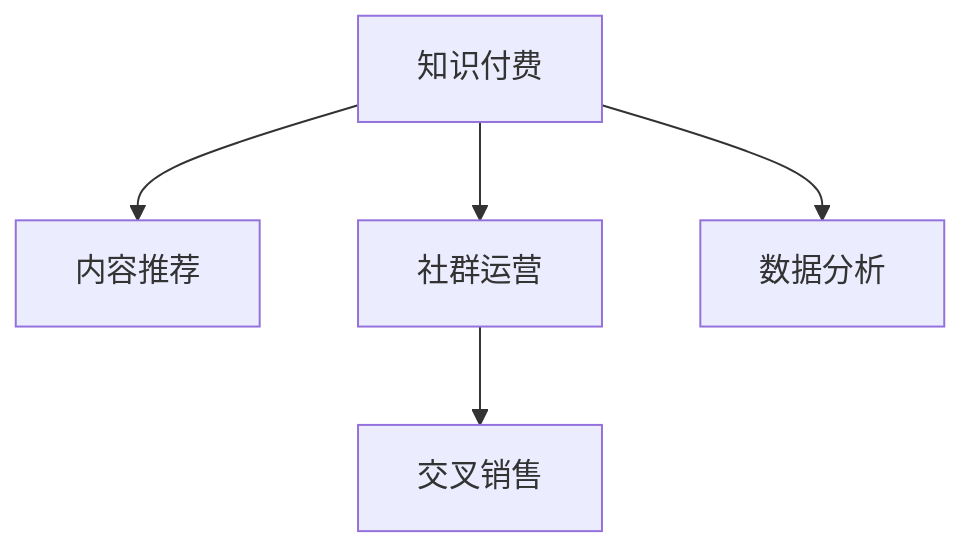

                 

# 知识付费创业中的用户忠诚度培养

> 关键词：知识付费, 用户忠诚度, 内容推荐, 社群运营, 数据分析

## 1. 背景介绍

随着互联网的普及和知识经济的发展，知识付费逐渐成为一种新兴的经济模式。用户愿意为优质内容支付费用，希望获得更加系统、专业、高效的知识服务。然而，知识付费领域竞争激烈，用户忠诚度较低，如何有效培养和维护用户忠诚度，成为各个知识付费平台亟待解决的重要问题。

## 2. 核心概念与联系

### 2.1 核心概念概述

本节将介绍几个与知识付费用户忠诚度培养相关的核心概念及其相互联系：

- **知识付费**：用户为获取知识而支付费用的商业模式，包括订阅制、按需付费、免费增值等多种形式。知识付费平台如得到、知乎live、喜马拉雅等。

- **用户忠诚度**：用户对某一产品或服务的持续满意度和依赖度。用户忠诚度高，意味着用户粘性大，续订率和复购率高。

- **内容推荐**：基于用户历史行为和偏好，推荐相关内容的系统。优秀的内容推荐可以大幅提升用户体验和满意度。

- **社群运营**：知识付费平台通过构建社群，增强用户之间的互动和黏性，形成以内容为核心，以社群为载体的用户生态。

- **数据分析**：通过收集、整理和分析用户数据，发现用户行为和需求，指导产品优化和市场策略调整。数据分析是用户忠诚度培养的重要工具。

- **交叉销售**：通过附加产品或服务，向已有用户推荐和销售新的产品，增加平台收入和用户粘性。

以上概念通过以下Mermaid流程图展示它们之间的联系：



这个流程图展示出知识付费平台通过内容推荐、社群运营和数据分析等多维手段，不断提升用户满意度和忠诚度，并通过交叉销售获取更多收益。

## 3. 核心算法原理 & 具体操作步骤
### 3.1 算法原理概述

知识付费平台用户忠诚度培养的核心算法原理在于对用户行为数据的深度分析和智能推荐。具体而言，平台通过收集用户的浏览记录、购买记录、互动行为等数据，利用机器学习算法进行用户画像建模，进而对用户进行个性化推荐和精准营销，提升用户体验和满意度。

### 3.2 算法步骤详解

以用户行为数据分析和内容推荐为例，算法主要包括以下步骤：

1. **数据采集与处理**：收集用户行为数据，如访问时长、购买记录、评论反馈等，并进行清洗、去重、标准化等预处理。

2. **特征工程**：提取与用户行为相关的特征，如浏览次数、购买频率、平均评分等，作为后续建模的基础。

3. **模型训练**：选择合适机器学习算法，如协同过滤、深度学习等，训练预测模型。模型输入为特征，输出为用户行为预测结果。

4. **个性化推荐**：根据用户画像和历史行为，生成个性化推荐内容列表，实时推送给用户。

5. **效果评估与迭代**：通过A/B测试等方法，评估推荐效果，根据反馈调整模型参数，优化推荐算法。

### 3.3 算法优缺点

用户行为数据分析和内容推荐的优点在于：

- 提升用户体验。个性化推荐满足用户多样化需求，提升平台满意度。
- 增加用户粘性。频繁的内容推荐可增加用户使用频率，提升用户忠诚度。
- 提高运营效率。基于数据驱动的运营决策，可优化产品和服务，提升运营效率。

缺点包括：

- 数据隐私问题。用户行为数据涉及隐私，平台需严格遵守数据保护法规。
- 算法复杂性。推荐算法技术门槛高，模型调优难度大。
- 推荐多样性问题。算法过度关注热门内容，导致推荐内容单一，用户可能厌倦。

### 3.4 算法应用领域

用户行为数据分析和内容推荐在知识付费平台中有着广泛的应用，具体包括：

- 个性化内容推荐：推荐相关课程、文章、音频等，提高用户粘性。
- 用户流失预警：通过分析用户行为，识别可能流失的用户，进行挽留策略。
- 新用户转化：推荐热门课程和专家讲座，吸引新用户注册付费。
- 内容优化：基于用户反馈和点击数据，优化课程内容和学习路径。
- 交叉销售推荐：根据用户购买历史，推荐相关付费产品，提升复购率。

## 4. 数学模型和公式 & 详细讲解  
### 4.1 数学模型构建

假设用户的行为数据表示为 $D=\{(x_i,y_i)\}_{i=1}^N$，其中 $x_i$ 为用户行为特征， $y_i$ 为用户行为标签（如点击、购买等）。构建如下预测模型：

$$
\hat{y}_i = f(x_i; \theta)
$$

其中 $f(\cdot)$ 为预测函数， $\theta$ 为模型参数。常用的预测函数包括线性回归、逻辑回归、深度神经网络等。

### 4.2 公式推导过程

以线性回归为例，模型参数 $\theta$ 的求解目标是：

$$
\min_{\theta} \sum_{i=1}^N (y_i - \hat{y}_i)^2
$$

通过最小二乘法求解，得到参数 $\theta$：

$$
\theta = (X^TX)^{-1}X^Ty
$$

其中 $X$ 为特征矩阵， $y$ 为用户行为标签向量。

在实际应用中，需要根据具体场景选择合适的预测函数，如用户流失预测使用逻辑回归，内容推荐使用深度学习模型等。

### 4.3 案例分析与讲解

假设某知识付费平台希望提升新用户注册转化率，可以采用如下算法步骤：

1. 收集新用户行为数据，包括注册时间、首次登录时间、首次购买时间等。
2. 提取特征，如注册年龄、首次访问时长、首次购买金额等。
3. 训练预测模型，如线性回归、随机森林等，预测新用户是否会购买课程。
4. 根据预测结果，对新用户进行个性化推荐和营销。

## 5. 项目实践：代码实例和详细解释说明
### 5.1 开发环境搭建

本节以Python和TensorFlow为例，介绍知识付费平台用户行为数据分析和内容推荐的开发环境搭建。

1. 安装TensorFlow和Python库：

```bash
pip install tensorflow
pip install pandas numpy scikit-learn
```

2. 准备数据集：收集用户行为数据，如访问记录、购买记录等，并将其保存为CSV文件。

### 5.2 源代码详细实现

假设我们有一张包含用户行为数据的数据集，可以使用如下代码实现预测模型：

```python
import tensorflow as tf
import pandas as pd

# 加载数据集
data = pd.read_csv('user_behavior_data.csv')

# 特征工程
features = data[['age', 'visit_time', 'purchase_amount']]
labels = data['purchase']
X = features.values
y = labels.values

# 定义模型
model = tf.keras.Sequential([
    tf.keras.layers.Dense(32, activation='relu'),
    tf.keras.layers.Dense(1)
])

# 编译模型
model.compile(optimizer='adam', loss='mse', metrics=['accuracy'])

# 训练模型
model.fit(X, y, epochs=10, batch_size=32)

# 预测新用户行为
new_user_data = pd.read_csv('new_user_data.csv')
new_X = new_user_data.values
predictions = model.predict(new_X)

# 分析预测结果
if predictions[0][0] > 0.5:
    print('新用户可能购买课程，进行个性化推荐')
else:
    print('新用户可能不购买课程，避免营销打扰')
```

### 5.3 代码解读与分析

以上代码实现了用户行为预测模型的基本流程：

1. 数据准备：加载数据集，并进行特征工程。
2. 模型定义：定义多层神经网络模型。
3. 模型编译：设置优化器、损失函数和评价指标。
4. 模型训练：使用训练集数据进行模型训练。
5. 预测新用户行为：对新用户数据进行预测，判断其是否可能购买课程。

## 6. 实际应用场景
### 6.1 用户行为预测

知识付费平台可以利用用户行为预测模型，对新用户和潜在流失用户进行精准营销。例如，对于新用户，平台可以根据预测结果，进行个性化课程推荐，提升注册转化率。对于潜在流失用户，平台可以及时推送挽回策略，减少用户流失。

### 6.2 内容推荐优化

通过用户行为数据分析，平台可以发现热门课程和相关内容，并根据用户画像进行个性化推荐。例如，对于喜欢金融课程的用户，平台可以推荐更多金融类课程、文章和专家讲座，提升用户满意度和粘性。

### 6.3 交叉销售策略

基于用户历史购买数据，平台可以推荐相关付费产品或服务，增加用户复购率。例如，对于购买过编程课程的用户，平台可以推荐编程书籍、相关工具、在线课程等，满足用户多样化的学习需求。

### 6.4 未来应用展望

未来，知识付费平台的用户忠诚度培养将更加注重智能化和个性化。随着AI和大数据分析技术的发展，平台可以通过更多维度、更精准的方式分析用户行为，提升推荐效果和用户满意度。

例如，平台可以利用自然语言处理技术，分析用户评论和反馈，挖掘用户真实需求和偏好。利用计算机视觉技术，分析用户观看视频的行为和反馈，提供更加多样化和个性化的内容推荐。

## 7. 工具和资源推荐
### 7.1 学习资源推荐

1. 《Python数据分析与可视化》书籍：系统介绍Python在数据分析和可视化方面的应用，适合基础知识薄弱的学习者。
2. TensorFlow官方文档：提供详细的TensorFlow使用教程和API文档，帮助用户快速上手。
3. Kaggle竞赛平台：提供丰富的数据集和机器学习竞赛，适合实际项目实践和算法调优。
4. 知识付费平台运营指南：提供知识付费平台的运营技巧和案例分析，适合创业者和运营人员。

### 7.2 开发工具推荐

1. Jupyter Notebook：免费的交互式编程环境，支持Python、R等多种编程语言。
2. TensorBoard：可视化工具，可实时监测模型训练状态，帮助调试和优化模型。
3. Tableau：数据可视化工具，支持多种数据源和复杂数据可视化需求。
4. GitHub：代码托管平台，方便团队协作和版本控制。

### 7.3 相关论文推荐

1. J. Heckman, D. E. McFadden. The Classic Selection Model for the Evaluation of Training Programs. Journal of Political Economy, 1984.
2. G. Forman. Modeling User Sequential Actions with Bayesian Networks and Time Series Methods. Journal of Marketing Research, 2007.
3. Y. Bengio, Y. LeCun. Representation Learning: A Review and New Perspectives. IEEE Transactions on Pattern Analysis and Machine Intelligence, 2015.
4. Y. Guo, Y. He, S. Zheng. Deep Learning Approaches for Recommendation Systems: A Survey. ACM Computing Surveys, 2021.

## 8. 总结：未来发展趋势与挑战
### 8.1 研究成果总结

本文通过系统介绍知识付费平台用户忠诚度培养的核心概念和算法原理，详细讲解了用户行为数据分析和内容推荐的具体操作步骤，并给出了代码实现和实际应用案例。

用户行为数据分析和内容推荐在知识付费平台中起着至关重要的作用，可以有效提升用户满意度和忠诚度，增加平台收入和用户粘性。本文还探讨了未来的发展趋势和面临的挑战，指出随着AI和大数据分析技术的发展，平台将进一步提升推荐效果和用户满意度。

### 8.2 未来发展趋势

未来，知识付费平台的用户忠诚度培养将更加注重智能化和个性化。平台可以通过更多维度、更精准的方式分析用户行为，提升推荐效果和用户满意度。具体发展趋势包括：

1. 用户行为多模态分析：利用文本、图像、语音等多种模态数据，进行更全面的用户画像建模。
2. 推荐模型优化：采用深度学习等先进算法，提升推荐模型的精度和鲁棒性。
3. 数据隐私保护：通过差分隐私等技术，保障用户数据隐私和安全。
4. 用户交互优化：利用自然语言处理和计算机视觉技术，提升用户与平台的交互体验。

### 8.3 面临的挑战

尽管用户行为数据分析和内容推荐在知识付费平台中有着重要应用，但在实际部署和优化过程中，仍面临以下挑战：

1. 数据获取难度大：用户行为数据涉及隐私，平台需严格遵守数据保护法规，获取数据难度较大。
2. 算法复杂度高：推荐算法技术门槛高，模型调优难度大。
3. 推荐内容多样性问题：算法过度关注热门内容，导致推荐内容单一，用户可能厌倦。
4. 数据质量和完整性问题：用户行为数据缺失、噪声大，影响模型训练和推荐效果。
5. 用户隐私保护问题：平台需严格保护用户隐私，避免数据泄露和滥用。

### 8.4 研究展望

未来的研究重点在于：

1. 多模态用户行为分析：融合文本、图像、语音等多种数据源，构建更全面的用户画像。
2. 个性化推荐模型优化：采用深度学习等先进算法，提升推荐模型的精度和鲁棒性。
3. 推荐算法多样性：开发多种推荐算法，满足不同用户需求，提高推荐效果和多样性。
4. 数据隐私保护技术：探索差分隐私等技术，保护用户隐私，增强平台信任度。
5. 推荐内容多样性：引入更多特征和算法，避免推荐内容单一，提高用户满意度。

以上研究方向的探索，必将引领知识付费平台用户忠诚度培养进入新的高度，为平台持续发展提供有力支撑。

## 9. 附录：常见问题与解答

**Q1：如何进行用户行为数据分析？**

A: 用户行为数据分析主要分为数据采集、数据清洗、特征工程、模型训练和效果评估等步骤。平台可以通过日志、API接口等手段采集用户行为数据，利用Pandas、NumPy等工具进行数据清洗和处理，选择合适的机器学习算法进行模型训练，并通过A/B测试等方法评估模型效果。

**Q2：如何提升推荐模型精度？**

A: 提升推荐模型精度主要从数据质量、算法优化和模型调参等方面入手。平台需确保用户行为数据的完整性和准确性，选择合适的算法模型，并进行参数调优和特征工程。同时，利用数据增强、对抗训练等技术，提升模型的鲁棒性和泛化能力。

**Q3：如何进行用户行为预测？**

A: 用户行为预测主要分为数据准备、特征提取、模型训练和预测输出等步骤。平台需收集用户行为数据，提取与预测目标相关的特征，选择合适的机器学习算法进行模型训练，并使用训练好的模型进行用户行为预测。预测结果可应用到个性化推荐、用户流失预警等场景中。

**Q4：如何构建多模态用户画像？**

A: 构建多模态用户画像主要通过融合不同类型的数据源，进行全面分析。平台可以利用文本分析、图像识别、语音识别等技术，提取用户的多维度特征，如兴趣偏好、行为习惯、社会属性等，从而构建更全面、更准确的用户画像。

**Q5：如何保护用户隐私？**

A: 保护用户隐私主要通过数据脱敏、差分隐私等技术手段。平台需对用户数据进行匿名化和脱敏处理，确保数据无法追溯到具体用户。同时，采用差分隐私等技术，保护用户隐私，避免数据泄露和滥用。

---

作者：禅与计算机程序设计艺术 / Zen and the Art of Computer Programming

