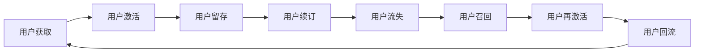

                 

# 知识付费创业中的用户成长体系设计

> 关键词：知识付费,用户成长体系,用户行为分析,数据驱动,价值最大化

## 1. 背景介绍

### 1.1 问题由来

近年来，随着互联网技术的不断发展和智能手机的普及，人们获取知识的渠道日益丰富。在线教育、视频直播、付费内容等知识付费平台如雨后春笋般涌现，成为了用户学习新知识的重要来源。然而，尽管知识付费市场蓬勃发展，许多平台的用户留存率却并不高。许多用户在订阅一段时间后便逐渐流失，导致平台难以实现盈利。

### 1.2 问题核心关键点

- **用户流失**：知识付费平台的用户流失率普遍偏高，用户订阅一段时间后往往不再续费，导致平台难以实现长期盈利。
- **用户粘性低**：许多用户订阅平台后并没有形成固定的学习习惯，导致付费投资难以转化为长期价值。
- **内容同质化**：市场上知识付费平台的内容趋于同质化，用户难以找到对自己有价值的独特内容。
- **付费体验不佳**：平台在支付流程、内容获取等方面用户体验不佳，导致用户流失。

解决这些问题需要构建一个用户成长体系，通过系统化的方法设计用户体验，提升用户粘性，实现价值最大化。本文将介绍如何设计知识付费平台的用户成长体系，通过数据驱动的方法分析用户行为，设计激励机制，优化用户体验，提升用户留存率，实现长期盈利。

## 2. 核心概念与联系

### 2.1 核心概念概述

在介绍用户成长体系的设计之前，我们先简要介绍几个核心概念：

- **用户生命周期**：用户生命周期是指用户在平台上的使用过程，包括获取、激活、留存、续订、流失等阶段。了解用户生命周期的各个阶段特征，可以更科学地设计用户成长策略。
- **用户行为分析**：用户行为分析是指通过数据分析和机器学习技术，发现用户使用平台的行为规律，预测用户需求，提升用户体验。
- **数据驱动**：数据驱动是指在平台运营和产品设计的各个环节中，通过数据来指导决策，提升平台运营效率和用户满意度。
- **价值最大化**：价值最大化是指通过科学的用户成长体系设计，实现用户留存率提升、收入增长、市场扩展等目标。

这些核心概念之间有着紧密的联系，共同构成了一个有效的用户成长体系。通过数据驱动的用户行为分析，可以设计出科学的用户成长策略，提升用户留存率，最终实现平台的价值最大化。

### 2.2 核心概念原理和架构的 Mermaid 流程图



这个流程图展示了用户生命周期的主要阶段。平台通过科学的用户成长策略，可以在各个阶段实现用户留存，最终实现平台的长期盈利。

## 3. 核心算法原理 & 具体操作步骤

### 3.1 算法原理概述

用户成长体系的设计依赖于对用户行为和需求的深入理解。核心算法原理包括以下几个方面：

- **用户行为分析**：通过数据分析技术，如用户行为追踪、事件日志分析等，发现用户使用平台的规律和痛点。
- **机器学习**：利用机器学习算法，如分类、回归、聚类等，对用户行为数据进行建模，预测用户需求和行为趋势。
- **个性化推荐**：基于用户行为和需求，设计个性化推荐算法，提升用户体验和留存率。
- **激励机制设计**：通过设计合理的激励机制，如积分、优惠券、等级等，吸引用户长期使用平台。

### 3.2 算法步骤详解

用户成长体系的设计主要包括以下几个步骤：

**Step 1: 数据采集与预处理**

- 收集用户行为数据，如访问时长、点击次数、订阅周期等。
- 清洗和预处理数据，去除异常值和噪音，标准化数据格式。
- 将数据按用户维度进行分组，便于后续分析和建模。

**Step 2: 用户行为分析**

- 利用数据分析工具，如Tableau、Power BI等，对用户行为数据进行可视化分析，发现用户使用平台的规律和痛点。
- 使用机器学习算法，如K-Means聚类、PCA降维等，对用户行为数据进行建模，发现用户不同阶段的特征。
- 通过A/B测试等方法，验证不同策略对用户行为的影响，选择最优策略。

**Step 3: 个性化推荐设计**

- 利用协同过滤、基于内容的推荐算法等，对用户行为数据进行建模，发现相似用户的行为模式。
- 设计推荐引擎，将相似用户的推荐结果推送给目标用户，提升用户体验和留存率。
- 引入负向推荐，推荐用户不感兴趣的内容，避免用户流失。

**Step 4: 激励机制设计**

- 设计积分、优惠券、等级等激励机制，吸引用户长期使用平台。
- 对用户激励数据进行建模，使用机器学习算法，预测用户的续订概率和流失风险。
- 根据预测结果，对高风险用户进行主动召回，提升用户留存率。

**Step 5: 系统集成与迭代**

- 将用户成长策略集成到平台后台系统中，实现自动推荐和激励。
- 通过A/B测试等方法，验证用户成长策略的效果，不断优化策略。
- 定期更新数据模型和算法，适应用户行为的变化。

### 3.3 算法优缺点

用户成长体系的设计具有以下优点：

- **提升用户体验**：通过个性化推荐和激励机制，提升用户的使用体验和满意度。
- **优化运营成本**：通过数据分析和机器学习，实现精准的用户管理，优化运营成本。
- **提升用户留存率**：通过系统化的用户成长策略，提升用户留存率和续订率。

同时，该方法也存在以下局限性：

- **数据质量要求高**：数据质量会直接影响用户成长策略的效果，因此需要保证数据的准确性和完整性。
- **模型复杂度较高**：用户成长体系的设计涉及多个子模块，模型的复杂度较高，需要较强的技术实力。
- **策略更新频率低**：用户行为的变化较快，需要定期更新用户成长策略，否则可能出现偏差。

尽管存在这些局限性，但用户成长体系仍是知识付费平台不可或缺的组成部分，可以显著提升平台的盈利能力。

### 3.4 算法应用领域

用户成长体系的设计在多个领域都有广泛应用，包括但不限于以下几类：

- **在线教育**：通过个性化推荐和激励机制，提升学生学习效果和留存率，实现平台盈利。
- **视频直播**：通过用户行为分析，设计科学的用户成长策略，提升用户粘性和平台收入。
- **付费内容**：通过数据分析和机器学习，发现用户行为规律，设计合理的激励机制，提升用户订阅率和平台收入。
- **文化传媒**：通过用户行为分析，优化内容推荐策略，提升用户粘性，吸引更多付费用户。

## 4. 数学模型和公式 & 详细讲解 & 举例说明

### 4.1 数学模型构建

本节将通过数学语言对用户成长体系的设计进行严格的刻画。

假设用户生命周期分为四个阶段：获取（A）、激活（B）、留存（C）、流失（E）。我们定义用户在该阶段的时间为 $T_A$、$T_B$、$T_C$、$T_E$，用户在该阶段的总访问次数为 $C_A$、$C_B$、$C_C$、$C_E$，用户在该阶段的总访问时长为 $T_A'$、$T_B'$、$T_C'$、$T_E'$，用户在该阶段的总交易金额为 $M_A$、$M_B$、$M_C$、$M_E$。

我们需要设计一个优化模型，使平台的总收益最大化。定义平台总收益 $R$ 为：

$$
R = \sum_{i=A}^E M_i
$$

### 4.2 公式推导过程

为了最大化平台收益，我们需要对每个阶段进行建模。以激活阶段为例，可以定义用户激活的数学模型如下：

设用户激活的概率为 $p_B$，激活需要的访问次数为 $k_B$，激活需要的访问时长为 $t_B$，激活需要的交易金额为 $m_B$。则用户在该阶段的激活次数和收益可以表示为：

$$
C_B = p_B \cdot \min\left\{ k_B, \frac{T_A'}{t_B} \right\}
$$

$$
M_B = C_B \cdot m_B
$$

整个平台的激活收益可以表示为：

$$
R_B = \sum_{i=1}^{N_B} p_B \cdot \min\left\{ k_B, \frac{T_A'_i}{t_B} \right\} \cdot m_B
$$

其中 $N_B$ 表示用户在该阶段的总数。

### 4.3 案例分析与讲解

我们可以利用上述模型对知识付费平台的激活阶段进行分析。以某知识付费平台为例，假设激活概率为 $p_B=0.1$，激活需要的访问次数为 $k_B=5$，激活需要的访问时长为 $t_B=300$ 分钟，激活需要的交易金额为 $m_B=50$ 元。

假设某用户在获取阶段停留了 $T_A'=360$ 分钟，进行了 $C_A=10$ 次访问，并花费了 $M_A=100$ 元。该用户在激活阶段需要访问 $k_B=5$ 次，每次访问需要 $t_B=300$ 分钟，每次访问花费 $m_B=50$ 元。

根据上述模型，我们可以计算该用户在该阶段的激活次数和收益：

$$
C_B = 0.1 \cdot \min\left\{ 5, \frac{360}{300} \right\} = 0.1 \cdot 5 = 0.5
$$

$$
M_B = 0.5 \cdot 50 = 25
$$

$$
R_B = 0.5 \cdot 25 = 12.5
$$

这意味着该用户在激活阶段产生了 $12.5$ 元的收益。同理，我们可以对平台的获取、留存、流失等阶段进行建模，并计算总收益。

## 5. 项目实践：代码实例和详细解释说明

### 5.1 开发环境搭建

在进行用户成长体系的设计和实现时，我们需要搭建一个数据驱动的开发环境。以下是搭建开发环境的步骤：

1. **数据采集与存储**

   - 选择合适的数据采集工具，如Google Analytics、Mixpanel等，收集用户行为数据。
   - 使用数据库技术，如MySQL、PostgreSQL等，存储和管理用户行为数据。

2. **数据分析工具**

   - 安装数据分析工具，如Tableau、Power BI等，进行数据可视化和分析。
   - 安装机器学习工具，如Scikit-learn、TensorFlow等，进行模型训练和预测。

3. **系统集成与部署**

   - 选择合适的开发语言，如Python、Java等，实现用户成长策略的代码。
   - 使用服务器架构，如Docker、Kubernetes等，部署和扩展系统。

### 5.2 源代码详细实现

以下是一个基于Python的用户成长体系实现示例：

```python
from sklearn.cluster import KMeans
from sklearn.decomposition import PCA
from sklearn.ensemble import RandomForestClassifier
from sklearn.metrics import accuracy_score

# 加载用户行为数据
def load_user_data(path):
    user_data = pd.read_csv(path)
    return user_data

# 数据预处理
def preprocess_user_data(user_data):
    user_data = user_data.dropna()
    user_data = user_data.drop_duplicates()
    user_data = user_data.reset_index(drop=True)
    return user_data

# 用户行为分析
def analyze_user_behavior(user_data):
    # 数据清洗
    user_data = preprocess_user_data(user_data)

    # 数据可视化
    user_data.plot(kind='scatter', x='user_id', y='transaction_amount')
    plt.show()

    # 数据建模
    user_data = user_data.drop(['user_id'], axis=1)
    X = user_data.values
    Y = user_data['transaction_amount']

    # 聚类分析
    kmeans = KMeans(n_clusters=3)
    X_c = kmeans.fit_predict(X)
    X_c = np.reshape(X_c, (X_c.size, 1))
    X = np.hstack((X, X_c))

    # PCA降维
    pca = PCA(n_components=2)
    X_pca = pca.fit_transform(X)

    # 随机森林分类
    X_train, X_test, y_train, y_test = train_test_split(X_pca, Y, test_size=0.3, random_state=42)
    rf = RandomForestClassifier(n_estimators=100, random_state=42)
    rf.fit(X_train, y_train)
    y_pred = rf.predict(X_test)

    # 评估模型
    print('Accuracy:', accuracy_score(y_test, y_pred))

# 调用用户行为分析函数
user_data = load_user_data('user_behavior_data.csv')
analyze_user_behavior(user_data)
```

### 5.3 代码解读与分析

上述代码实现了对用户行为数据的加载、预处理、分析和建模。下面对关键代码进行详细解读：

**用户数据加载与预处理**

- `load_user_data`函数：用于加载用户行为数据，假设数据以CSV格式存储在`user_behavior_data.csv`文件中。
- `preprocess_user_data`函数：用于清洗和预处理数据，去除异常值和噪音，标准化数据格式。

**用户行为分析**

- `analyze_user_behavior`函数：首先对用户数据进行可视化分析，然后使用聚类分析和随机森林分类等机器学习算法对用户行为数据进行建模。
- `KMeans`算法：用于聚类分析，将用户分为不同的群体。
- `PCA`算法：用于降维处理，将高维数据压缩到二维或三维空间。
- `RandomForestClassifier`算法：用于分类建模，预测用户的交易金额。

**模型评估**

- `accuracy_score`函数：用于评估随机森林分类器的准确率。

## 6. 实际应用场景

### 6.1 智能推荐系统

智能推荐系统是用户成长体系的重要组成部分。通过用户行为分析，可以设计个性化的推荐算法，提升用户使用体验和留存率。

**推荐算法设计**

- **协同过滤推荐**：基于用户行为和物品相似性，为用户推荐相似的物品。
- **基于内容的推荐**：基于用户和物品的特征，为用户推荐相关物品。
- **深度学习推荐**：使用深度神经网络对用户行为数据进行建模，推荐用户可能感兴趣的物品。

**推荐算法实现**

- 使用Python编写推荐算法代码，使用Scikit-learn等机器学习工具进行建模。
- 将推荐算法集成到平台后台系统中，实现实时推荐。

### 6.2 用户激励机制设计

用户激励机制是用户成长体系的重要组成部分，可以吸引用户长期使用平台。

**激励机制设计**

- **积分系统**：根据用户的行为和消费，给予用户积分奖励，积分可以兑换优惠券、免费课程等。
- **优惠券设计**：根据用户的行为和消费，给予用户优惠券奖励，优惠券可以用于购买付费课程。
- **等级制度**：根据用户的消费和行为，赋予用户不同的等级，高等级用户可以享受特权服务。

**激励机制实现**

- 使用Python编写激励机制代码，使用MySQL等数据库技术存储用户积分和优惠券信息。
- 将激励机制集成到平台后台系统中，实现积分和优惠券的自动发放和消费。

### 6.3 用户流失分析与召回

用户流失分析与召回是用户成长体系的重要组成部分，可以提升用户留存率，实现平台盈利。

**用户流失分析**

- **流失原因分析**：使用数据分析工具，如Tableau、Power BI等，对用户流失数据进行可视化分析，发现用户流失的原因。
- **流失模型建模**：使用机器学习算法，如随机森林、逻辑回归等，对用户流失数据进行建模，预测用户流失概率。

**用户流失召回**

- **高风险用户识别**：根据流失模型，识别高风险用户，即可能流失的用户。
- **主动召回策略**：针对高风险用户，设计主动召回策略，如邮件提醒、短信提醒、推送通知等。
- **召回效果评估**：使用A/B测试等方法，评估召回策略的效果，优化召回策略。

## 7. 工具和资源推荐

### 7.1 学习资源推荐

为了帮助开发者系统掌握用户成长体系的理论基础和实践技巧，这里推荐一些优质的学习资源：

1. **《数据驱动的产品设计》**：这是一本系统介绍数据驱动方法的书，详细介绍了如何通过数据分析和机器学习优化产品设计。
2. **《推荐系统实践》**：这是一本系统介绍推荐系统设计和方法的书，适合开发者学习和实践推荐算法。
3. **《机器学习实战》**：这是一本通俗易懂的机器学习入门书，适合初学者学习机器学习算法。
4. **Coursera和edX**：这些在线学习平台提供了大量的数据科学和机器学习课程，适合开发者系统学习。
5. **Kaggle**：这是一个数据科学竞赛平台，开发者可以通过参加竞赛学习和提升数据建模能力。

### 7.2 开发工具推荐

高效的开发离不开优秀的工具支持。以下是几款用于用户成长体系开发的常用工具：

1. **Python**：Python是数据科学和机器学习领域的标准语言，提供了丰富的机器学习库和数据处理工具。
2. **Scikit-learn**：一个基于Python的机器学习库，提供了多种常见的机器学习算法和工具。
3. **Tableau**：一个数据可视化工具，适合数据分析和可视化。
4. **Power BI**：一个数据可视化工具，适合数据分析和可视化。
5. **MySQL**：一个关系型数据库，适合存储和管理用户行为数据。
6. **Docker和Kubernetes**：容器化和云原生架构技术，适合部署和扩展用户成长体系系统。

### 7.3 相关论文推荐

用户成长体系的设计源于学界的持续研究。以下是几篇奠基性的相关论文，推荐阅读：

1. **《推荐系统的发展趋势》**：介绍了推荐系统的发展历程和前沿技术。
2. **《数据驱动的产品设计》**：详细介绍了数据驱动方法在产品设计中的应用。
3. **《机器学习在用户行为分析中的应用》**：介绍了机器学习在用户行为分析中的应用方法和效果。

这些论文代表了大用户成长体系的设计发展脉络，可以帮助研究者把握学科前进方向，激发更多的创新灵感。

## 8. 总结：未来发展趋势与挑战

### 8.1 总结

本文对用户成长体系的设计进行了全面系统的介绍。首先阐述了用户流失率高的背景问题，明确了用户成长体系在提升用户粘性、实现价值最大化方面的独特价值。其次，从原理到实践，详细讲解了用户行为分析、个性化推荐、激励机制设计等核心算法原理和具体操作步骤。通过实际案例和代码实现，展示了用户成长体系的搭建过程。

通过本文的系统梳理，可以看到，用户成长体系的设计是知识付费平台不可或缺的组成部分，通过数据驱动的方法设计用户体验，提升用户留存率，最终实现平台的长期盈利。用户成长体系的设计需要从用户行为和需求出发，不断优化和迭代策略，才能在激烈的市场竞争中保持优势。

### 8.2 未来发展趋势

展望未来，用户成长体系的设计将呈现以下几个发展趋势：

1. **数据驱动设计**：通过数据分析和机器学习，科学设计用户成长策略，提升用户留存率和续订率。
2. **个性化推荐优化**：引入深度学习等前沿技术，优化推荐算法，提升用户体验和留存率。
3. **激励机制多样化**：设计多样化的激励机制，如积分、优惠券、等级等，提升用户粘性。
4. **用户流失预警**：通过数据分析和机器学习，及时预警用户流失风险，进行主动召回，提升用户留存率。
5. **跨平台协同**：实现跨平台的用户成长体系设计，提升用户多平台的使用体验。

以上趋势凸显了用户成长体系设计在知识付费平台中的重要性和广阔前景。这些方向的探索发展，必将进一步提升平台的运营效率和用户体验，推动知识付费市场的发展。

### 8.3 面临的挑战

尽管用户成长体系设计在知识付费平台中取得了显著效果，但在迈向更加智能化、普适化应用的过程中，它仍面临诸多挑战：

1. **数据质量问题**：数据质量会直接影响用户成长策略的效果，如何保证数据准确性和完整性，仍需持续改进。
2. **算法复杂度**：用户成长体系的设计涉及多个子模块，算法的复杂度较高，需要较强的技术实力。
3. **用户行为变化快**：用户行为的变化较快，需要定期更新用户成长策略，否则可能出现偏差。
4. **跨平台协同难度大**：实现跨平台的用户成长体系设计，需要解决多平台数据整合和数据同步的问题。

尽管存在这些挑战，但用户成长体系设计仍是知识付费平台不可或缺的组成部分，可以显著提升平台的盈利能力。只有不断优化和迭代策略，才能在激烈的市场竞争中保持优势。

### 8.4 研究展望

面向未来，用户成长体系设计需要从以下几个方面进行新的探索：

1. **多模态数据融合**：将用户的多模态数据（如文本、语音、图像等）融合到用户行为分析中，提升用户理解深度。
2. **强化学习应用**：引入强化学习等前沿技术，优化用户行为推荐策略，提升用户体验和留存率。
3. **跨平台协同优化**：实现跨平台的用户成长体系设计，提升用户多平台的使用体验。
4. **模型持续优化**：使用在线学习等方法，不断优化用户成长策略，适应用户行为变化。

这些研究方向的探索，必将引领用户成长体系设计走向更高的台阶，为知识付费平台带来新的突破。只有勇于创新、敢于突破，才能不断拓展用户成长体系设计的边界，推动知识付费市场的发展。

## 9. 附录：常见问题与解答

**Q1：如何保证用户行为数据的质量？**

A: 保证用户行为数据的质量，需要从数据采集、存储、处理等多个环节进行优化。具体措施包括：
1. 选择合适的数据采集工具，避免数据采集过程中的噪音和异常值。
2. 使用数据清洗工具，去除重复数据和异常值，保证数据的一致性和准确性。
3. 定期进行数据质量评估，及时发现和修正数据错误。

**Q2：用户激励机制有哪些类型？**

A: 用户激励机制可以包括多种类型，如积分、优惠券、等级等。具体的激励机制设计需要根据平台特点和用户需求进行优化。以下是几种常见的激励机制类型：
1. 积分系统：根据用户的行为和消费，给予用户积分奖励，积分可以兑换优惠券、免费课程等。
2. 优惠券设计：根据用户的行为和消费，给予用户优惠券奖励，优惠券可以用于购买付费课程。
3. 等级制度：根据用户的消费和行为，赋予用户不同的等级，高等级用户可以享受特权服务。
4. 活动奖励：设计各种活动奖励，如充值满额返现、积分竞赛等，提升用户参与度。

**Q3：如何进行用户流失预警和召回？**

A: 用户流失预警和召回需要从数据采集和分析两个方面进行优化：
1. 数据采集：使用数据分析工具，如Tableau、Power BI等，对用户流失数据进行可视化分析，发现用户流失的原因。
2. 数据建模：使用机器学习算法，如随机森林、逻辑回归等，对用户流失数据进行建模，预测用户流失概率。
3. 预警策略：根据流失模型，识别高风险用户，即可能流失的用户。
4. 召回策略：针对高风险用户，设计主动召回策略，如邮件提醒、短信提醒、推送通知等。
5. 效果评估：使用A/B测试等方法，评估召回策略的效果，优化召回策略。

**Q4：用户行为分析有哪些方法？**

A: 用户行为分析可以包括多种方法，如用户行为追踪、事件日志分析、数据可视化等。以下是几种常见的用户行为分析方法：
1. 用户行为追踪：使用数据分析工具，如Google Analytics、Mixpanel等，追踪用户行为，收集用户行为数据。
2. 事件日志分析：使用数据分析工具，如Tableau、Power BI等，对事件日志进行分析，发现用户行为规律。
3. 数据可视化：使用数据分析工具，如Tableau、Power BI等，对用户行为数据进行可视化，发现用户行为趋势。
4. 机器学习：使用机器学习算法，如K-Means聚类、PCA降维等，对用户行为数据进行建模，发现用户不同阶段的特征。

通过这些方法，可以科学地设计用户成长策略，提升用户留存率和续订率，实现平台的长期盈利。

---

作者：禅与计算机程序设计艺术 / Zen and the Art of Computer Programming

