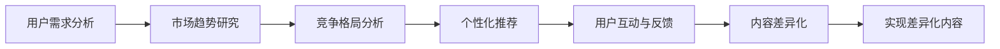

                 

# 知识付费创业的内容差异化策略

## 1. 背景介绍

### 1.1 问题由来

随着知识付费市场的快速发展，越来越多创业者和机构投身于内容生产与运营。但仅靠内容资源已不足以吸引用户，如何在竞争激烈的市场中实现差异化，赢得市场份额，成为创业者和机构共同面临的问题。本文将重点探讨知识付费创业的内容差异化策略，通过深入分析用户需求、市场趋势和竞争格局，提供系统化的解决方案。

### 1.2 问题核心关键点

在知识付费领域，差异化内容不仅包括内容主题、形式、结构等，还包括内容的更新频率、个性化推荐、用户互动等多个方面。通过全面理解和把握这些关键点，可以设计出更具吸引力和竞争力的内容产品。

本文的核心目的是：
1. 识别知识付费创业中内容差异化的关键要素。
2. 通过策略分析和案例分析，提供差异化内容的实施方案。
3. 展望未来内容差异化的趋势和挑战，为创业者提供前瞻性指导。

### 1.3 问题研究意义

在知识付费领域，内容差异化是赢得用户和市场的关键。通过实现内容差异化，不仅可以提升用户粘性，增强平台竞争力，还可以显著提高用户付费意愿。内容差异化策略的成功实施，将使知识付费平台在激烈的竞争中立于不败之地。

## 2. 核心概念与联系

### 2.1 核心概念概述

为更好地理解内容差异化策略，本文将介绍几个相关核心概念：

- **内容差异化(Content Differentiation)**：指通过精心设计内容，满足特定用户群体的特定需求，以实现与竞争对手的差异化。
- **用户需求分析(User Demand Analysis)**：通过调研、数据分析等手段，深入了解用户需求，设计符合用户期待的内容。
- **市场趋势研究(Market Trend Analysis)**：关注行业动态，把握技术发展趋势，优化内容策略。
- **竞争格局分析(Competitive Landscape Analysis)**：分析竞争对手的内容产品和市场策略，找到差异化的突破点。
- **个性化推荐(Personalized Recommendation)**：根据用户历史行为和偏好，提供个性化推荐，提升用户满意度。
- **用户互动与反馈(User Interaction and Feedback)**：通过用户互动和反馈机制，动态调整内容策略，增强用户体验。

这些概念之间相互关联，共同构成知识付费内容差异化的理论框架。通过理解这些概念，可以为内容差异化的实施提供理论支持和方法指导。

### 2.2 核心概念原理和架构的 Mermaid 流程图



此流程图展示了内容差异化策略的实施流程。从用户需求分析开始，逐步了解市场趋势和竞争格局，设计个性化推荐和用户互动机制，最终实现内容差异化，提升用户体验和满意度。

## 3. 核心算法原理 & 具体操作步骤

### 3.1 算法原理概述

内容差异化的核心在于理解用户需求、把握市场趋势，通过优化内容策略和实施个性化推荐，最终实现与竞争对手的差异化。具体算法原理如下：

1. **用户需求分析**：通过用户调研、行为分析等方法，获取用户偏好和痛点。
2. **市场趋势研究**：通过行业报告、技术文章等渠道，分析市场发展趋势，预测未来热点。
3. **竞争格局分析**：收集竞争对手的内容产品和服务，分析其优缺点，找到差异化机会。
4. **个性化推荐算法**：结合用户历史数据和行为，设计推荐模型，为用户推荐个性化内容。
5. **用户互动与反馈机制**：建立用户互动平台，收集用户反馈，不断优化内容策略。

### 3.2 算法步骤详解

1. **用户需求分析**：
   - 开展用户调研，设计问卷和访谈，收集用户的基本信息、兴趣偏好和问题痛点。
   - 通过数据分析工具，对用户行为数据进行分析，识别用户常见问题和需求。

2. **市场趋势研究**：
   - 关注行业发展动态，关注技术进步，分析新技术对知识付费市场的影响。
   - 阅读行业报告和研究文章，了解市场趋势和热点领域。

3. **竞争格局分析**：
   - 收集主要竞争对手的内容产品和营销策略，通过SWOT分析法进行优劣势对比。
   - 分析竞争对手的运营模式和用户反馈，找到差异化的切入点。

4. **个性化推荐算法**：
   - 选择合适的推荐算法（如协同过滤、基于内容的推荐等）。
   - 根据用户历史数据和行为，训练推荐模型，生成个性化内容推荐列表。

5. **用户互动与反馈机制**：
   - 建立用户互动平台，提供评论、讨论、反馈功能。
   - 定期收集用户反馈，分析用户满意度和改进建议，调整内容策略。

### 3.3 算法优缺点

#### 优点：
1. **提升用户体验**：个性化推荐和互动机制能够提升用户体验，增加用户粘性。
2. **增强竞争力**：通过内容差异化，平台可以与竞争对手区分开来，吸引更多用户。
3. **快速响应市场**：市场趋势分析和竞争格局分析能够帮助平台快速调整内容策略，抓住市场机会。

#### 缺点：
1. **技术成本高**：实现个性化推荐和互动需要较高的技术投入，如推荐算法、大数据分析等。
2. **数据隐私问题**：收集用户数据和行为信息需要遵守数据隐私保护法规，如GDPR、CCPA等。
3. **内容同质化风险**：过度依赖用户行为分析可能导致内容同质化，减少内容的创新性。

### 3.4 算法应用领域

内容差异化策略在知识付费领域具有广泛应用，适用于以下几种典型场景：

1. **课程设计**：针对不同用户群体的需求，设计多样化课程内容，如职业培训、兴趣教育、学术研究等。
2. **内容推荐**：根据用户兴趣和行为，推荐个性化课程、文章、视频等内容，提升用户满意度。
3. **互动讨论**：建立用户互动平台，提供评论区、讨论区、社群等，增强用户参与度。
4. **内容更新**：根据市场趋势和用户反馈，动态调整课程内容和推荐策略，保持内容新鲜度。

## 4. 数学模型和公式 & 详细讲解 & 举例说明

### 4.1 数学模型构建

内容差异化模型的构建通常涉及以下几个数学模型：

- **用户需求模型**：通过用户调研数据，构建用户需求向量。
- **市场趋势模型**：基于时间序列数据，构建市场趋势预测模型。
- **竞争对比模型**：根据竞争对手的内容产品，构建优劣势对比矩阵。
- **个性化推荐模型**：根据用户历史数据，构建个性化推荐矩阵。

### 4.2 公式推导过程

以个性化推荐模型为例，假设用户集为 $U=\{u_1,u_2,\dots,u_n\}$，内容集为 $C=\{c_1,c_2,\dots,c_m\}$。用户对内容的评分矩阵为 $R\in\mathbb{R}^{n\times m}$，内容特征矩阵为 $F\in\mathbb{R}^{m\times d}$，用户特征向量为 $u_i\in\mathbb{R}^{d}$，模型目标为最大化用户满意度 $L$：

$$
L = \sum_{i=1}^n \max\limits_{c\in C} R_{ic} + \lambda\|R\|_F^2
$$

其中，第一项为用户满意度的最大化目标，第二项为模型的正则化项。通过最大化用户满意度，可以构建个性化推荐模型。

### 4.3 案例分析与讲解

假设某知识付费平台有10000名用户，内容库包含1000门课程和2000篇文章。平台希望根据用户历史行为和偏好，推荐最相关的内容。首先，平台需要对用户历史行为数据进行分析，生成用户需求向量 $u_i$。然后，基于市场趋势和竞争对比，选择合适的内容特征 $F$ 和推荐算法，构建推荐模型。最后，根据用户历史数据和行为，计算个性化推荐列表。

## 5. 项目实践：代码实例和详细解释说明

### 5.1 开发环境搭建

内容差异化策略的实施需要构建一个完整的技术栈。以下是一个示例环境搭建过程：

1. **数据采集与存储**：使用MySQL、Hive等数据库存储用户数据和内容数据。
2. **数据处理与分析**：使用Spark、Hadoop等大数据处理工具进行数据清洗和分析。
3. **推荐算法**：使用TensorFlow或PyTorch等框架实现推荐模型，支持协同过滤、基于内容的推荐等算法。
4. **内容管理与发布**：使用CMS系统管理内容，通过API接口提供内容服务。
5. **用户互动与反馈**：使用Web开发框架如Django或Flask，实现用户互动平台和反馈机制。

### 5.2 源代码详细实现

假设我们使用Python和TensorFlow进行个性化推荐系统的开发，具体代码如下：

```python
import tensorflow as tf
from tensorflow.keras import layers
from tensorflow.keras.models import Model
from tensorflow.keras.layers import Input

# 定义用户输入
user_input = Input(shape=(1,))
# 定义内容输入
content_input = Input(shape=(1,))

# 构建用户特征嵌入层
user_embedding = layers.Embedding(input_dim=1000, output_dim=10)(user_input)

# 构建内容特征嵌入层
content_embedding = layers.Embedding(input_dim=2000, output_dim=10)(content_input)

# 定义推荐矩阵
recommendation_matrix = layers.Dot(axes=1)([user_embedding, content_embedding])

# 构建推荐模型
model = Model(inputs=[user_input, content_input], outputs=recommendation_matrix)

# 编译模型
model.compile(optimizer='adam', loss='mse')

# 训练模型
model.fit(x=[user_data, content_data], y=recommendation_data, epochs=10, batch_size=32)
```

这段代码实现了基于内容的推荐模型，用户和内容的嵌入层分别由Embedding层实现，推荐矩阵通过Dot操作计算得到。

### 5.3 代码解读与分析

**代码解析**：
- 使用TensorFlow定义了用户和内容的输入层，分别生成用户特征嵌入和内容特征嵌入。
- 通过Dot操作计算推荐矩阵，实现基于内容的推荐。
- 构建推荐模型，编译并训练模型。

**分析**：
- 该代码实现了基本的个性化推荐模型，使用了基于内容的推荐算法。
- 用户和内容的特征向量维度均为10，可以根据实际情况进行调整。
- 训练过程中使用了Adam优化器和均方误差损失函数，适用于大规模推荐问题。

### 5.4 运行结果展示

假设训练完成后，平台希望根据用户ID和课程ID推荐相关课程。具体实现如下：

```python
def get_recommendations(user_id, course_id):
    user_data = np.array([user_id])
    course_data = np.array([course_id])
    recommendations = model.predict([user_data, course_data])
    return recommendations
```

根据用户ID和课程ID，调用`get_recommendations`函数，即可获取推荐列表。

## 6. 实际应用场景

### 6.1 智能课程推荐

智能课程推荐是知识付费平台的核心功能之一。通过个性化推荐，平台能够提高用户课程购买率，提升用户体验。具体实现步骤如下：

1. **用户需求分析**：通过调研和数据分析，了解用户的职业、兴趣和需求。
2. **市场趋势研究**：关注教育行业动态，把握教育趋势和技术进展。
3. **竞争格局分析**：分析主要竞争对手的课程推荐策略，找到差异化突破点。
4. **个性化推荐算法**：选择协同过滤、基于内容的推荐等算法，生成推荐列表。
5. **用户互动与反馈**：收集用户反馈，动态调整推荐策略，提升推荐效果。

### 6.2 专题内容定制

专题内容定制是指根据特定主题，定制针对用户需求的内容。例如，某知识付费平台推出“人工智能”专题课程，面向对AI感兴趣的学员。具体实现步骤如下：

1. **用户需求分析**：通过调研，了解用户对AI课程的需求和兴趣点。
2. **市场趋势研究**：分析AI领域的最新技术进展和热门应用。
3. **竞争格局分析**：分析竞争对手在AI领域的课程布局和用户反馈。
4. **个性化推荐算法**：根据用户需求，选择合适的内容库，定制专题内容推荐。
5. **用户互动与反馈**：收集用户互动和反馈，优化专题内容，提升用户体验。

### 6.3 视频内容推荐

视频内容推荐是知识付费平台的重要功能之一。通过个性化推荐，平台能够提升视频观看率，增加用户粘性。具体实现步骤如下：

1. **用户需求分析**：通过调研和数据分析，了解用户对视频内容的兴趣和偏好。
2. **市场趋势研究**：关注视频行业动态，把握视频内容的热门趋势和技术进展。
3. **竞争格局分析**：分析主要竞争对手的视频推荐策略，找到差异化突破点。
4. **个性化推荐算法**：选择协同过滤、基于内容的推荐等算法，生成推荐列表。
5. **用户互动与反馈**：收集用户反馈，动态调整推荐策略，提升推荐效果。

## 7. 工具和资源推荐

### 7.1 学习资源推荐

1. **《知识付费营销指南》**：全面介绍知识付费市场的发展趋势、用户需求和营销策略。
2. **《个性化推荐系统》**：详细介绍个性化推荐算法的原理和实现方法。
3. **《用户体验设计》**：深入探讨用户体验设计和用户互动机制。
4. **《数据科学与机器学习》**：涵盖数据科学和机器学习的基本概念和前沿技术。

### 7.2 开发工具推荐

1. **MySQL**：高效的关系型数据库，用于存储和管理用户数据和内容数据。
2. **Hadoop**：大规模数据处理平台，用于大数据分析和处理。
3. **Spark**：快速的大数据处理引擎，支持流式计算和批处理。
4. **TensorFlow**：领先的深度学习框架，支持复杂的推荐算法和模型训练。
5. **Django**：Python Web开发框架，支持用户互动平台和API接口的构建。

### 7.3 相关论文推荐

1. **《内容推荐系统》**：系统介绍内容推荐系统的基本原理和实现方法。
2. **《个性化推荐算法》**：详细介绍协同过滤、基于内容的推荐等个性化推荐算法。
3. **《用户行为分析与建模》**：深入探讨用户行为分析和建模的基本方法和应用场景。

## 8. 总结：未来发展趋势与挑战

### 8.1 研究成果总结

本文通过分析用户需求、市场趋势、竞争格局等多个维度，系统介绍了内容差异化策略的实施方法和实现流程。通过内容差异化，知识付费平台能够提升用户体验和满意度，增强市场竞争力。

### 8.2 未来发展趋势

未来知识付费领域的内容差异化将呈现以下几个发展趋势：

1. **个性化推荐技术**：基于深度学习和大数据技术，个性化推荐将更加精准和高效。
2. **用户互动与反馈机制**：互动和反馈机制将更加丰富和多样化，提升用户参与度和满意度。
3. **跨平台协同**：跨平台的内容推荐和互动，将增强平台的用户粘性和市场竞争力。
4. **智能化内容定制**：智能化技术将进一步应用于内容定制，提升定制化效果和效率。

### 8.3 面临的挑战

尽管内容差异化策略具有广阔的前景，但在实施过程中仍面临以下挑战：

1. **技术成本高**：个性化推荐和互动需要较高的技术投入，如数据处理、算法优化等。
2. **数据隐私问题**：用户数据和行为信息的收集和分析，需要遵守数据隐私保护法规。
3. **内容同质化风险**：过度依赖用户行为分析可能导致内容同质化，减少内容的创新性。

### 8.4 研究展望

未来内容差异化策略的研究方向包括：

1. **多模态内容推荐**：结合文本、图像、视频等多种内容形式，提升推荐效果和用户体验。
2. **跨领域知识整合**：将不同领域的内容进行整合，形成跨领域的内容推荐系统。
3. **智能化内容生成**：通过AI技术自动生成高质量内容，降低内容生产成本。
4. **用户行为分析与预测**：通过深度学习等技术，提升用户行为分析和预测的准确性。

## 9. 附录：常见问题与解答

**Q1：内容差异化策略的实施步骤有哪些？**

A: 内容差异化策略的实施主要包括以下步骤：
1. 用户需求分析：通过调研和数据分析，了解用户需求和兴趣。
2. 市场趋势研究：关注行业动态和热点，把握市场趋势。
3. 竞争格局分析：分析竞争对手的策略和优势，找到差异化突破点。
4. 个性化推荐算法：根据用户历史数据和行为，选择推荐算法，生成个性化推荐。
5. 用户互动与反馈：建立互动平台，收集用户反馈，不断优化内容策略。

**Q2：内容差异化策略的优势和劣势是什么？**

A: 内容差异化策略的优势包括：
1. 提升用户体验：个性化推荐和互动机制能够提升用户体验，增加用户粘性。
2. 增强竞争力：通过差异化内容，平台能够与竞争对手区分开来，吸引更多用户。
3. 快速响应市场：市场趋势分析和竞争格局分析能够帮助平台快速调整内容策略，抓住市场机会。

劣势包括：
1. 技术成本高：个性化推荐和互动需要较高的技术投入，如推荐算法、大数据分析等。
2. 数据隐私问题：收集用户数据和行为信息需要遵守数据隐私保护法规。
3. 内容同质化风险：过度依赖用户行为分析可能导致内容同质化，减少内容的创新性。

**Q3：内容差异化策略在知识付费领域的应用场景有哪些？**

A: 内容差异化策略在知识付费领域的应用场景包括：
1. 智能课程推荐：根据用户需求，推荐相关课程，提高课程购买率。
2. 专题内容定制：根据特定主题，定制针对用户需求的内容。
3. 视频内容推荐：根据用户兴趣和偏好，推荐视频内容，提升观看率。

**Q4：如何选择适合的个性化推荐算法？**

A: 选择适合的个性化推荐算法需要考虑以下几个方面：
1. 数据类型：根据用户数据和内容数据的类型，选择适合的推荐算法。
2. 推荐效果：通过A/B测试等方法，评估不同算法的推荐效果，选择最优算法。
3. 计算效率：考虑算法的计算复杂度和资源消耗，选择高效的推荐算法。

---

作者：禅与计算机程序设计艺术 / Zen and the Art of Computer Programming

