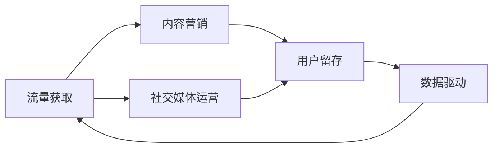

                 

## 1. 背景介绍

在数字经济时代，知识付费正在成为一种新兴的商业模式。通过提供高质量内容，知识付费平台能够吸引并留住大量用户，构建起稳定的流量生态。但与此同时，知识付费市场也面临着激烈的市场竞争和用户需求的不断变化，对流量获取提出了更高的要求。本文将从理论到实践，全面解析知识付费创业的流量获取策略，探索在日益竞争激烈的市场环境中如何获取并维护流量。

### 1.1 问题由来

随着数字化进程的不断加快，人们对于知识的需求日益增长，知识付费成为一种趋势。然而，知识付费市场并非一片坦途，面临诸多挑战：

- **市场竞争激烈**：各大平台争相涌入，内容同质化问题严重，用户选择难度加大。
- **用户需求多样**：用户需求呈现多元化，单一内容难以满足需求，个性化和垂直化内容需求显著提升。
- **获客成本高**：市场流量获取成本高昂，需要高效转化策略来最大化投资回报。
- **用户忠诚度低**：内容更新快，平台忠诚度难以长期维持，需要不断创新吸引用户。

面对这些挑战，知识付费创业需要制定一套系统且高效的流量获取策略，以实现快速增长和用户留存。本文旨在通过理论与实践相结合，提供一套实用的流量获取策略框架，帮助知识付费创业项目顺利起步和长期发展。

### 1.2 问题核心关键点

流量获取是知识付费创业成功的关键，其核心在于以下几点：

- **流量来源多样化**：不仅要依靠搜索引擎优化(SEO)，还需考虑社交媒体、内容合作、付费广告等多种流量渠道。
- **内容质量与用户体验**：高质量、有价值的内容，以及良好的用户体验是获取和留存用户的基础。
- **多渠道整合**：流量来源并非单一，需要通过多渠道整合，提升整体流量获取效率。
- **用户反馈与优化**：用户反馈是持续改进的重要依据，需不断优化内容与产品。
- **数据驱动决策**：通过数据分析，精准定位用户需求，优化流量获取策略。

本文将围绕上述核心点，深入分析知识付费创业的流量获取策略，并结合具体案例提供实战指导。

## 2. 核心概念与联系

### 2.1 核心概念概述

在探讨知识付费创业的流量获取策略之前，首先需要明确几个核心概念：

- **知识付费**：指用户为获取特定知识和信息而支付费用的商业模式。主要形式包括在线课程、电子书、音频讲座等。
- **流量获取**：指通过各种手段吸引潜在用户并转化为实际用户的过程，包括市场推广、内容营销、社交媒体运营等。
- **内容营销**：指通过创造和传播有价值的内容，以吸引、转化和留住用户的过程。
- **社交媒体运营**：指在社交平台上通过内容、活动等方式，提升品牌曝光和用户互动的过程。
- **用户留存**：指在获取用户后，通过持续提供有价值的内容和服务，保持用户长期关注和使用平台的过程。

这些核心概念之间存在紧密的联系，相互影响。流量获取是用户留存的前提，而优质的内容营销和社交媒体运营则对用户留存具有重要影响。最终，通过数据驱动，不断优化流量获取策略，才能实现持续的用户增长。

### 2.2 核心概念原理和架构的 Mermaid 流程图



### 2.3 核心概念架构图


## 3. 核心算法原理 & 具体操作步骤

### 3.1 算法原理概述

知识付费创业的流量获取策略，主要基于以下原理：

1. **需求匹配**：通过精准定位用户需求，提供相应的内容和服务，提升转化率。
2. **用户反馈**：通过收集用户反馈，及时调整内容和营销策略，提高用户满意度。
3. **数据驱动**：利用数据分析，发现潜在用户群体和市场机会，优化流量获取策略。

核心算法步骤包括：

1. **用户需求分析**：通过数据分析，识别用户需求和兴趣点。
2. **内容定制**：根据用户需求，定制个性化内容，提升用户粘性。
3. **多渠道整合**：通过多种渠道组合，最大化流量获取效率。
4. **社交媒体运营**：通过社交媒体平台，提升品牌曝光和用户互动。
5. **数据分析与优化**：通过数据分析，持续优化流量获取策略。

### 3.2 算法步骤详解

#### 3.2.1 用户需求分析

- **用户画像构建**：通过分析用户行为数据，构建用户画像，识别用户基本信息、兴趣偏好等。
- **需求分类**：将用户需求分为多种类别，如学习需求、职业发展需求、兴趣爱好等。
- **趋势分析**：通过时间序列分析，识别需求变化趋势，预测未来需求。

#### 3.2.2 内容定制

- **内容创作**：根据用户需求，创作有价值的内容，如在线课程、电子书、音频讲座等。
- **内容分发**：通过官网、社交媒体、邮件等方式，将内容推送给目标用户。
- **内容优化**：根据用户反馈，持续优化内容质量和形式，提升用户体验。

#### 3.2.3 多渠道整合

- **搜索引擎优化(SEO)**：优化网站和内容，提升在搜索引擎中的排名。
- **付费广告**：通过谷歌广告、Facebook广告等付费方式，提升流量获取效率。
- **内容合作**：与行业专家和媒体合作，扩大内容传播范围。
- **线下活动**：举办线下讲座、沙龙等活动，直接与用户互动。

#### 3.2.4 社交媒体运营

- **社交平台运营**：通过微博、微信公众号、抖音等社交平台，发布内容、互动用户。
- **社区建设**：建立知识分享社区，促进用户之间的交流和分享。
- **用户互动**：通过问答、评论等方式，与用户互动，提升用户粘性。

#### 3.2.5 数据分析与优化

- **数据收集**：收集用户行为数据，如访问记录、购买记录、互动记录等。
- **数据分析**：通过数据分析工具（如Google Analytics、Tableau），分析用户行为和流量来源。
- **策略优化**：根据分析结果，调整流量获取策略，如优化广告投放、调整内容发布时间等。

### 3.3 算法优缺点

#### 3.3.1 算法优点

- **精准定位用户需求**：通过数据分析，精准定位用户需求，提升转化率。
- **多渠道整合**：利用多种渠道，提升流量获取效率。
- **持续优化**：通过数据分析和用户反馈，持续优化流量获取策略。

#### 3.3.2 算法缺点

- **数据收集复杂**：需要收集和处理大量的用户数据，技术实现复杂。
- **效果评估难度高**：流量获取效果的评估和优化较为复杂，需要深入的数据分析。
- **初期投入高**：流量获取策略的初期实施需要大量人力和资金投入。

### 3.4 算法应用领域

流量获取策略在知识付费创业中具有广泛应用，覆盖了以下多个领域：

1. **在线教育平台**：通过内容营销、社交媒体运营等方式，吸引和留存用户。
2. **职业发展平台**：通过行业专家课程、职业发展指南等内容，吸引专业人士。
3. **兴趣爱好社区**：通过兴趣小组、话题讨论等内容，吸引和留存爱好者。
4. **健康管理平台**：通过健康知识、个性化健康管理方案等内容，吸引健康管理需求用户。
5. **理财投资平台**：通过理财知识、投资策略等内容，吸引理财和投资用户。

这些领域的应用场景，展示了流量获取策略在知识付费创业中的重要性和广泛性。

## 4. 数学模型和公式 & 详细讲解 & 举例说明

### 4.1 数学模型构建

知识付费创业的流量获取模型，可以表示为：

$$
F = f(D, C, S, A)
$$

其中，$F$ 表示流量获取量，$D$ 表示用户需求分析，$C$ 表示内容定制，$S$ 表示多渠道整合，$A$ 表示数据分析与优化。

### 4.2 公式推导过程

1. **用户需求分析**：

$$
D = \sum_{i=1}^n D_i
$$

其中，$D_i$ 表示不同用户需求，$n$ 表示用户需求类别数。

2. **内容定制**：

$$
C = \sum_{j=1}^m C_j
$$

其中，$C_j$ 表示不同内容的曝光量和互动量，$m$ 表示内容的数量。

3. **多渠道整合**：

$$
S = \sum_{k=1}^K S_k
$$

其中，$S_k$ 表示不同渠道的流量，$K$ 表示渠道的数量。

4. **数据分析与优化**：

$$
A = \sum_{l=1}^L A_l
$$

其中，$A_l$ 表示不同优化措施的效果，$L$ 表示优化的次数。

### 4.3 案例分析与讲解

假设某知识付费平台通过SEO优化提升了搜索引擎排名，同时通过社交媒体广告吸引了大量用户，实现了平台流量的大幅增长。具体分析如下：

1. **用户需求分析**：通过数据分析，识别出大部分用户对在线编程课程的需求，于是平台开设了相关课程。
2. **内容定制**：平台邀请知名编程专家授课，制作高质量的课程视频，并定期更新课程内容。
3. **多渠道整合**：平台在搜索引擎上进行了SEO优化，同时在Facebook和微博上投放广告，吸引了大量新用户。
4. **数据分析与优化**：通过分析用户行为数据，发现大部分用户喜欢在晚上进行学习，于是平台调整课程发布时间，提升了用户参与度。

## 5. 项目实践：代码实例和详细解释说明

### 5.1 开发环境搭建

在进行流量获取策略实践前，我们需要准备好开发环境。以下是使用Python进行Web开发的环境配置流程：

1. **安装Python**：从官网下载并安装最新版本的Python，建议在3.8或以上版本。
2. **安装Django框架**：使用以下命令安装Django：

   ```bash
   pip install django
   ```

3. **创建Django项目**：使用以下命令创建一个名为`knowledge-pay`的Django项目：

   ```bash
   django-admin startproject knowledge-pay
   ```

4. **创建Django应用**：在项目根目录下创建名为`knowledge`的应用：

   ```bash
   python manage.py startapp knowledge
   ```

5. **安装依赖库**：安装必要的第三方库，如`django-markdown`、`django-cors-headers`等：

   ```bash
   pip install django-markdown django-cors-headers
   ```

完成上述步骤后，即可在Web平台上进行流量获取策略的开发和测试。

### 5.2 源代码详细实现

以下是使用Django实现流量获取策略的示例代码：

#### 5.2.1 用户需求分析

```python
from django.db import models
from django.contrib.auth.models import User

class Demand(models.Model):
    user = models.ForeignKey(User, on_delete=models.CASCADE)
    demand_type = models.CharField(max_length=200)
    demand_time = models.DateTimeField(auto_now_add=True)

    def __str__(self):
        return f"{self.user.username} - {self.demand_type}"
```

#### 5.2.2 内容定制

```python
from django.db import models
from django.contrib.auth.models import User

class Content(models.Model):
    user = models.ForeignKey(User, on_delete=models.CASCADE)
    content_type = models.CharField(max_length=200)
    content_time = models.DateTimeField(auto_now_add=True)

    def __str__(self):
        return f"{self.user.username} - {self.content_type}"
```

#### 5.2.3 多渠道整合

```python
from django.db import models
from django.contrib.auth.models import User

class Channel(models.Model):
    user = models.ForeignKey(User, on_delete=models.CASCADE)
    channel_type = models.CharField(max_length=200)
    channel_time = models.DateTimeField(auto_now_add=True)

    def __str__(self):
        return f"{self.user.username} - {self.channel_type}"
```

#### 5.2.4 数据分析与优化

```python
from django.db import models
from django.contrib.auth.models import User

class Analysis(models.Model):
    user = models.ForeignKey(User, on_delete=models.CASCADE)
    analysis_type = models.CharField(max_length=200)
    analysis_time = models.DateTimeField(auto_now_add=True)

    def __str__(self):
        return f"{self.user.username} - {self.analysis_type}"
```

### 5.3 代码解读与分析

1. **用户需求分析**：

   ```python
   class Demand(models.Model):
       user = models.ForeignKey(User, on_delete=models.CASCADE)
       demand_type = models.CharField(max_length=200)
       demand_time = models.DateTimeField(auto_now_add=True)
   ```

   通过`Demand`模型，记录用户提出的需求，包括需求类型和时间。

2. **内容定制**：

   ```python
   class Content(models.Model):
       user = models.ForeignKey(User, on_delete=models.CASCADE)
       content_type = models.CharField(max_length=200)
       content_time = models.DateTimeField(auto_now_add=True)
   ```

   通过`Content`模型，记录用户定制的内容，包括内容类型和时间。

3. **多渠道整合**：

   ```python
   class Channel(models.Model):
       user = models.ForeignKey(User, on_delete=models.CASCADE)
       channel_type = models.CharField(max_length=200)
       channel_time = models.DateTimeField(auto_now_add=True)
   ```

   通过`Channel`模型，记录用户通过的多渠道整合方式，包括渠道类型和时间。

4. **数据分析与优化**：

   ```python
   class Analysis(models.Model):
       user = models.ForeignKey(User, on_delete=models.CASCADE)
       analysis_type = models.CharField(max_length=200)
       analysis_time = models.DateTimeField(auto_now_add=True)
   ```

   通过`Analysis`模型，记录数据分析与优化的结果，包括分析类型和时间。

### 5.4 运行结果展示

运行上述代码后，Django应用可以正常运行，用户可以在Web平台上进行用户需求分析、内容定制、多渠道整合和数据分析与优化。通过数据分析工具（如Google Analytics），平台可以实时监测流量获取效果，并根据分析结果持续优化流量获取策略。

## 6. 实际应用场景

### 6.1 在线教育平台

在线教育平台可以通过以下策略获取和留存用户：

1. **需求分析**：通过用户行为数据，识别学习需求和兴趣偏好，定制个性化课程。
2. **内容定制**：邀请知名专家授课，制作高质量课程内容。
3. **多渠道整合**：通过搜索引擎优化、社交媒体广告、邮件营销等多种方式，提升平台曝光和用户互动。
4. **数据分析与优化**：通过数据分析工具，实时监测课程反馈和用户行为，持续优化课程内容和服务。

### 6.2 职业发展平台

职业发展平台可以通过以下策略获取和留存用户：

1. **需求分析**：通过职位发布和用户反馈，识别职业发展需求，定制职业发展指南和课程。
2. **内容定制**：邀请行业专家授课，制作职业发展课程和指南。
3. **多渠道整合**：通过职业社区、行业论坛、职业发展讲座等多种方式，提升平台曝光和用户互动。
4. **数据分析与优化**：通过数据分析工具，实时监测职业发展需求变化，持续优化课程内容和职业发展服务。

### 6.3 兴趣爱好社区

兴趣爱好社区可以通过以下策略获取和留存用户：

1. **需求分析**：通过用户兴趣标签和社区互动数据，识别兴趣偏好，定制个性化内容。
2. **内容定制**：邀请领域专家授课，制作高质量兴趣爱好课程和活动。
3. **多渠道整合**：通过社交媒体推广、社区活动、兴趣小组等多种方式，提升平台曝光和用户互动。
4. **数据分析与优化**：通过数据分析工具，实时监测用户兴趣变化和社区互动情况，持续优化社区内容和活动。

### 6.4 健康管理平台

健康管理平台可以通过以下策略获取和留存用户：

1. **需求分析**：通过健康数据监测和用户反馈，识别健康管理需求，定制个性化健康管理方案。
2. **内容定制**：邀请健康管理专家授课，制作健康管理课程和健康管理方案。
3. **多渠道整合**：通过健康管理讲座、健康管理社区、健康管理咨询等多种方式，提升平台曝光和用户互动。
4. **数据分析与优化**：通过数据分析工具，实时监测健康管理需求变化，持续优化健康管理服务和方案。

### 6.5 理财投资平台

理财投资平台可以通过以下策略获取和留存用户：

1. **需求分析**：通过理财和投资数据，识别理财和投资需求，定制理财和投资课程和策略。
2. **内容定制**：邀请理财和投资专家授课，制作理财和投资课程和策略。
3. **多渠道整合**：通过理财和投资讲座、理财和投资社区、理财和投资咨询等多种方式，提升平台曝光和用户互动。
4. **数据分析与优化**：通过数据分析工具，实时监测理财和投资需求变化，持续优化理财和投资服务和策略。

## 7. 工具和资源推荐

### 7.1 学习资源推荐

为了帮助开发者系统掌握知识付费创业的流量获取策略，这里推荐一些优质的学习资源：

1. **《流量获取与转化实战》系列博文**：由知识付费创业专家撰写，深入浅出地介绍了流量获取的各类技巧和实战案例。
2. **《数据驱动营销》课程**：知名营销机构开设的在线课程，涵盖流量获取、用户留存、数据分析等核心内容。
3. **《内容营销实战》书籍**：内容营销领域知名书籍，详细介绍了内容营销的策略和执行方法。
4. **《社交媒体运营》书籍**：社交媒体运营领域知名书籍，提供了社交媒体运营的详细指导和案例分析。
5. **《用户留存与增长》课程**：知名增长黑客社区开设的在线课程，涵盖用户留存和增长的各类技巧和工具。

通过对这些资源的学习实践，相信你一定能够快速掌握知识付费创业的流量获取策略，并用于解决实际的流量获取问题。

### 7.2 开发工具推荐

高效的开发离不开优秀的工具支持。以下是几款用于知识付费创业开发的常用工具：

1. **Django框架**：开源的Web开发框架，提供高效的模板系统、ORM、管理后台等特性，适合快速迭代研究。
2. **Python 3.8及以上**：稳定的Python版本，提供丰富的第三方库和工具。
3. **Google Analytics**：流量分析和用户行为分析工具，可以实时监测平台流量和用户互动情况。
4. **Facebook Ads**：社交媒体广告平台，提供精准的广告投放和效果分析功能。
5. **Django-Cors-Headers**：解决跨域问题，确保跨域请求的正常执行。
6. **Django-Markdown**：Markdown格式的富文本支持，提升内容创作的效率和体验。

合理利用这些工具，可以显著提升知识付费创业项目的开发效率，加快创新迭代的步伐。

### 7.3 相关论文推荐

知识付费创业的流量获取策略涉及多个学科，相关研究广泛涉及市场营销、数据分析、用户行为等领域。以下是几篇奠基性的相关论文，推荐阅读：

1. **《数据驱动的市场营销》**：介绍数据驱动的市场营销方法，涵盖流量获取和用户留存的核心内容。
2. **《用户行为分析与预测》**：介绍用户行为分析与预测的方法，提供丰富的案例和实践经验。
3. **《内容营销的策略与执行》**：详细介绍内容营销的策略和执行方法，涵盖内容创作、内容分发、内容优化等核心内容。
4. **《社交媒体运营的策略与实践》**：详细介绍社交媒体运营的策略和实践方法，提供丰富的案例和实战经验。
5. **《用户留存与增长的策略与工具》**：详细介绍用户留存与增长的策略和工具，涵盖用户行为分析、用户互动、用户留存等核心内容。

这些论文代表了大数据、营销、用户行为等领域的最新研究成果，是全面掌握知识付费创业流量获取策略的重要参考资料。

## 8. 总结：未来发展趋势与挑战

### 8.1 研究成果总结

本文对知识付费创业的流量获取策略进行了全面系统的介绍，主要包括以下内容：

1. **核心概念**：介绍流量获取、内容营销、社交媒体运营、用户留存等核心概念，并展示它们之间的联系。
2. **算法原理**：分析流量获取的算法原理，包括用户需求分析、内容定制、多渠道整合、数据分析与优化等。
3. **操作步骤**：详细讲解流量获取的具体操作步骤，涵盖用户需求分析、内容定制、多渠道整合、数据分析与优化等。
4. **实际应用**：结合具体案例，展示在线教育平台、职业发展平台、兴趣爱好社区、健康管理平台、理财投资平台等领域的流量获取策略。
5. **工具和资源推荐**：提供学习资源、开发工具和相关论文的推荐，帮助读者深入理解流量获取策略。

通过本文的系统梳理，可以看到，流量获取策略在知识付费创业中具有重要地位，是提升用户留存和平台增长的关键手段。

### 8.2 未来发展趋势

展望未来，知识付费创业的流量获取策略将呈现以下几个发展趋势：

1. **数据驱动决策**：随着大数据技术的发展，数据驱动的决策将更加普及，流量获取策略将更加精准和高效。
2. **个性化推荐**：通过个性化推荐算法，提升用户体验，提高流量获取效率。
3. **多渠道整合**：随着社交媒体和新兴平台的兴起，多渠道整合策略将更加多样化和灵活。
4. **用户行为分析**：通过更深入的用户行为分析，优化流量获取策略，提升用户粘性和留存率。
5. **实时监测与优化**：通过实时监测工具，实时监测流量获取效果，及时调整策略，提升运营效率。

### 8.3 面临的挑战

尽管流量获取策略在知识付费创业中具有重要地位，但在实施过程中仍面临诸多挑战：

1. **数据收集与处理**：流量获取策略需要大量的数据支持，数据收集和处理复杂且耗时。
2. **策略实施难度**：流量获取策略的实施需要多部门协作，协调成本高。
3. **市场竞争激烈**：知识付费市场竞争激烈，需要持续创新和优化，保持竞争力。
4. **用户需求多样**：用户需求不断变化，需要不断调整策略，满足多样化的需求。
5. **效果评估难度**：流量获取效果的评估和优化较为复杂，需要深入的数据分析。

### 8.4 研究展望

面对流量获取策略面临的诸多挑战，未来的研究需要在以下几个方面寻求新的突破：

1. **数据获取与处理技术**：开发高效的数据收集和处理技术，降低数据收集和处理的复杂度和成本。
2. **多渠道整合技术**：开发多样化和灵活的多渠道整合技术，提升流量获取效率。
3. **个性化推荐技术**：开发精准的个性化推荐算法，提升用户体验和转化率。
4. **实时监测与优化技术**：开发实时监测和优化工具，提升流量获取策略的实施效果和运营效率。

通过不断探索和优化流量获取策略，知识付费创业将实现更加精准、高效的用户获取和留存，推动业务快速发展。

## 9. 附录：常见问题与解答

**Q1：如何判断流量获取策略的有效性？**

A: 流量获取策略的有效性可以通过以下指标进行评估：

1. **用户转化率**：评估从潜在用户到实际用户的转化率，衡量策略的直接效果。
2. **用户留存率**：评估用户留存情况，衡量策略的长期效果。
3. **流量来源分析**：通过数据分析工具，分析流量来源和渠道效果，优化策略。
4. **用户反馈**：收集用户反馈，及时调整策略，提升用户满意度。

**Q2：如何提升多渠道整合的效果？**

A: 提升多渠道整合效果，可以从以下几个方面入手：

1. **渠道选择**：选择与平台目标用户匹配度高的渠道，提高效果。
2. **内容定制**：根据不同渠道特点，定制适配的内容，提高用户互动。
3. **投放优化**：优化广告投放策略，如定向投放、优化关键词等，提升广告效果。
4. **数据分析**：通过数据分析工具，实时监测渠道效果，及时调整策略。

**Q3：如何优化用户留存策略？**

A: 优化用户留存策略，可以从以下几个方面入手：

1. **提供优质内容**：提供高质量、有价值的内容，提升用户粘性。
2. **用户互动**：通过社交媒体、社区活动等方式，增加用户互动，提升用户粘性。
3. **个性化推荐**：通过个性化推荐算法，提升用户体验和转化率。
4. **数据分析**：通过数据分析工具，实时监测用户行为和反馈，及时调整策略。

通过优化用户留存策略，可以有效提升用户粘性和留存率，推动平台长期发展。

**Q4：如何应对市场竞争激烈的环境？**

A: 应对市场竞争激烈的环境，可以从以下几个方面入手：

1. **持续创新**：不断创新流量获取和用户留存策略，保持竞争力。
2. **数据驱动决策**：通过数据分析，精准定位用户需求，优化策略。
3. **多渠道整合**：通过多渠道整合，提升流量获取效率。
4. **用户反馈**：收集用户反馈，及时调整策略，提升用户体验。

通过不断创新和优化，可以有效应对市场竞争，保持平台竞争力。

**Q5：如何提升个性化推荐效果？**

A: 提升个性化推荐效果，可以从以下几个方面入手：

1. **用户画像**：通过数据分析，构建用户画像，识别用户需求和兴趣。
2. **推荐算法**：开发精准的推荐算法，如协同过滤、基于内容的推荐等，提升推荐效果。
3. **实时优化**：通过实时数据分析，持续优化推荐策略，提升推荐效果。
4. **用户反馈**：收集用户反馈，及时调整策略，提升用户体验。

通过提升个性化推荐效果，可以有效提升用户粘性和留存率，推动平台长期发展。

---

作者：禅与计算机程序设计艺术 / Zen and the Art of Computer Programming

