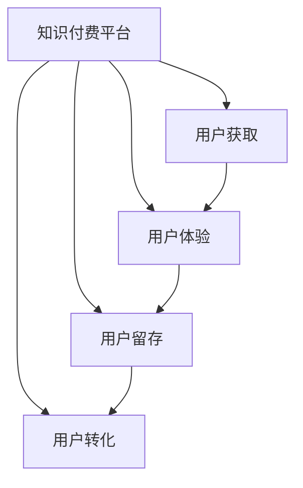

                 

# 知识付费创业的用户运营策略

## 1. 背景介绍

### 1.1 问题由来

随着信息爆炸时代的到来，知识的获取渠道日益丰富，学习形式更加多元。面对海量的知识资源，用户如何筛选、获取并有效利用知识，成为了一个重要的议题。知识付费作为互联网时代的新兴模式，通过付费订阅、单次付费等方式，提供专业的知识服务和教育资源，帮助用户高效学习和提升职业技能。

然而，知识付费市场竞争激烈，用户选择和留存问题日益突出。如何制定有效的用户运营策略，提升用户体验和满意度，增强用户黏性，实现持续增长的经营目标，成为了知识付费创业者面临的重要挑战。

### 1.2 问题核心关键点

知识付费创业的用户运营策略，旨在通过优化用户获取、使用、反馈的流程，实现用户增长、留存和转化的目标。其中关键点包括：

- **用户获取**：通过各种渠道吸引潜在用户，实现快速用户增长。
- **用户体验**：提升平台功能、内容和服务的质量，提升用户满意度和忠诚度。
- **用户留存**：通过定期推送优质内容、用户互动等方式，增强用户黏性，减少流失。
- **用户转化**：通过精准营销、优惠活动等策略，引导用户进行付费订阅或单次付费。

### 1.3 问题研究意义

制定有效的用户运营策略，对于知识付费创业的长期成功至关重要：

- **降低获客成本**。通过精准的用户定位和营销策略，减少无效的推广投入，提高用户转化率。
- **提升用户满意度**。优化用户界面和交互体验，提供高质量的课程和内容，增强用户的满意度和忠诚度。
- **增加用户粘性**。通过定期推送有价值的内容和互动活动，持续吸引用户注意力，增加用户活跃度和留存率。
- **促进用户转化**。通过个性化推荐和精准营销，引导用户进行付费订阅，实现更高的用户价值。

## 2. 核心概念与联系

### 2.1 核心概念概述

为了更好地理解知识付费创业的用户运营策略，本节将介绍几个密切相关的核心概念：

- **知识付费平台**：通过互联网提供付费知识服务的平台，如Coursera、Udemy等。
- **用户获取**：指通过各种渠道吸引新用户的过程，包括推广活动、搜索引擎优化(SEO)、社交媒体营销等。
- **用户体验**：指用户在使用知识付费平台时的感知和满意度，包括界面设计、内容质量、互动性等。
- **用户留存**：指用户在使用后持续返回平台，并继续使用平台的服务和内容的能力。
- **用户转化**：指将新用户转化为付费用户的过程，包括推广活动、折扣优惠、免费试用等。

这些核心概念之间的逻辑关系可以通过以下Mermaid流程图来展示：



这个流程图展示出知识付费平台的用户运营策略的逻辑关系：

1. 用户通过各种渠道进入平台。
2. 用户在平台上的使用体验直接影响他们的满意度和忠诚度。
3. 平台通过用户留存策略，吸引用户持续使用平台。
4. 用户通过特定的营销手段，转变为付费用户。

## 3. 核心算法原理 & 具体操作步骤

### 3.1 算法原理概述

知识付费创业的用户运营策略，基于用户行为数据分析和机器学习模型，实现用户获取、留存和转化的优化。其核心思想是：通过分析用户行为数据，建立用户画像，预测用户行为，并制定相应的运营策略，以提升用户运营效果。

具体而言，用户运营策略包括：

- **用户获取**：通过数据分析，确定高潜用户群体，制定定向推广策略，吸引用户注册和试用。
- **用户体验**：通过A/B测试、用户反馈分析等手段，不断优化平台功能和服务，提升用户满意度。
- **用户留存**：通过定期推送内容、互动活动等方式，增强用户黏性，减少用户流失。
- **用户转化**：通过个性化推荐和精准营销，引导用户进行付费订阅或单次付费。

### 3.2 算法步骤详解

基于用户行为数据分析和机器学习模型的用户运营策略，具体步骤如下：

**Step 1: 用户行为数据收集**
- 收集用户在平台上的行为数据，如浏览时长、观看课程数、付费记录等。
- 通过用户调查问卷、满意度评分等方式，获取用户反馈信息。

**Step 2: 用户画像构建**
- 使用数据挖掘技术，对用户行为数据进行聚类和分析，构建用户画像。
- 根据用户画像，识别出高潜用户群体和流失用户群体。

**Step 3: 用户行为预测**
- 使用机器学习算法，如随机森林、神经网络等，建立用户行为预测模型。
- 预测用户未来的行为，包括是否会流失、是否会进行付费等。

**Step 4: 策略制定与实施**
- 根据用户画像和行为预测结果，制定相应的用户运营策略。
- 实施策略，如定向推广、个性化推荐、用户互动等。
- 持续监控策略效果，调整优化策略。

**Step 5: 效果评估与反馈**
- 定期评估用户运营策略的效果，如用户增长率、留存率、转化率等。
- 根据评估结果，优化策略，形成闭环反馈机制。

### 3.3 算法优缺点

知识付费创业的用户运营策略，具有以下优点：

1. **数据驱动**：通过数据分析和机器学习模型，实现用户行为的精准预测和优化，减少主观决策的误差。
2. **个性化推荐**：基于用户画像和行为数据，实现个性化推荐，提升用户体验和满意度。
3. **高效推广**：通过数据分析确定高潜用户群体，制定定向推广策略，提高用户获取效率。
4. **提升留存**：通过定期推送内容和互动活动，增强用户黏性，减少流失。

同时，该策略也存在一定的局限性：

1. **数据隐私问题**：用户行为数据的收集和分析可能涉及到用户隐私，需要严格遵守相关法律法规。
2. **数据质量依赖**：用户运营策略的效果很大程度上依赖于数据的质量和准确性，数据收集和处理过程中可能存在误差。
3. **模型复杂性**：机器学习模型需要大量的数据和计算资源，模型设计和训练过程较为复杂。
4. **用户需求变化快**：用户需求和行为模式不断变化，需要及时更新模型和策略，保持策略的有效性。

尽管存在这些局限性，但就目前而言，基于用户行为数据分析和机器学习模型的用户运营策略，仍然是最为主流和有效的用户运营方法。未来相关研究的重点在于如何进一步提升数据质量和模型精度，同时兼顾用户隐私和数据安全等因素。

### 3.4 算法应用领域

基于用户行为数据分析和机器学习模型的用户运营策略，广泛应用于各类知识付费平台，如Coursera、Udemy、网易云课堂等。同时，也被应用于教育机构、企业培训等领域，帮助优化用户获取、留存和转化过程。

## 4. 数学模型和公式 & 详细讲解 & 举例说明

### 4.1 数学模型构建

本节将使用数学语言对用户运营策略的数学模型进行更加严格的刻画。

假设知识付费平台的用户总数为 $N$，用户行为数据集为 $D=\{(x_i,y_i)\}_{i=1}^N$，其中 $x_i$ 为用户行为数据，$y_i$ 为对应的标签（如流失概率、付费概率等）。

定义用户行为预测模型为 $f(x_i;\theta)$，其中 $\theta$ 为模型参数。模型的训练目标是最小化经验风险，即找到最优参数：

$$
\theta^* = \mathop{\arg\min}_{\theta} \mathcal{L}(\theta) = \frac{1}{N} \sum_{i=1}^N \ell(f(x_i;\theta),y_i)
$$

其中 $\ell$ 为损失函数，常用的有均方误差损失、对数损失等。

### 4.2 公式推导过程

以均方误差损失为例，其具体公式为：

$$
\mathcal{L}(\theta) = \frac{1}{N} \sum_{i=1}^N (y_i - f(x_i;\theta))^2
$$

对上述目标函数求导，得到模型参数 $\theta$ 的梯度：

$$
\frac{\partial \mathcal{L}(\theta)}{\partial \theta} = -\frac{2}{N} \sum_{i=1}^N (y_i - f(x_i;\theta)) \frac{\partial f(x_i;\theta)}{\partial \theta}
$$

在实际应用中，通常使用随机梯度下降等优化算法，通过迭代更新参数 $\theta$，最小化损失函数 $\mathcal{L}(\theta)$。

### 4.3 案例分析与讲解

以Coursera平台的用户流失预测为例，其用户行为数据包括用户注册时间、观看课程数、完成课程数等。使用上述公式，通过构建随机森林模型，实现用户流失概率的预测，具体步骤如下：

1. **数据收集与预处理**：收集用户行为数据，并进行特征工程处理，如时间特征编码、课程评分归一化等。
2. **模型构建与训练**：构建随机森林模型，使用交叉验证进行参数调优，训练模型。
3. **效果评估与优化**：在测试集上评估模型效果，如准确率、召回率、F1值等，并根据评估结果优化模型。
4. **策略实施与监控**：根据模型预测结果，制定定向推广、个性化推荐等策略，并实时监控策略效果，进行优化调整。

## 5. 项目实践：代码实例和详细解释说明

### 5.1 开发环境搭建

在进行用户运营策略实践前，我们需要准备好开发环境。以下是使用Python进行PyTorch开发的环境配置流程：

1. 安装Anaconda：从官网下载并安装Anaconda，用于创建独立的Python环境。

2. 创建并激活虚拟环境：
```bash
conda create -n user_op_strategy python=3.8 
conda activate user_op_strategy
```

3. 安装PyTorch：根据CUDA版本，从官网获取对应的安装命令。例如：
```bash
conda install pytorch torchvision torchaudio cudatoolkit=11.1 -c pytorch -c conda-forge
```

4. 安装TensorFlow：由Google主导开发的开源深度学习框架，生产部署方便，适合大规模工程应用。同样有丰富的预训练语言模型资源。

5. 安装Pandas、NumPy、Matplotlib、Scikit-Learn、TQDM、Jupyter Notebook、IPython等工具包：
```bash
pip install numpy pandas scikit-learn matplotlib tqdm jupyter notebook ipython
```

完成上述步骤后，即可在`user_op_strategy`环境中开始用户运营策略的开发。

### 5.2 源代码详细实现

以下是使用PyTorch进行用户流失预测的Python代码实现：

```python
import pandas as pd
import numpy as np
import torch
import torch.nn as nn
import torch.optim as optim
from sklearn.model_selection import train_test_split
from sklearn.ensemble import RandomForestClassifier
from sklearn.metrics import accuracy_score

# 加载数据
data = pd.read_csv('user_data.csv')
X = data[['watch_hours', 'courses_completed']]
y = data['churn']

# 数据划分
X_train, X_test, y_train, y_test = train_test_split(X, y, test_size=0.2, random_state=42)

# 模型构建
class UserChurnModel(nn.Module):
    def __init__(self):
        super(UserChurnModel, self).__init__()
        self.fc1 = nn.Linear(X.shape[1], 64)
        self.fc2 = nn.Linear(64, 1)

    def forward(self, x):
        x = self.fc1(x)
        x = torch.sigmoid(self.fc2(x))
        return x

# 模型训练
model = UserChurnModel()
criterion = nn.BCELoss()
optimizer = optim.Adam(model.parameters(), lr=0.001)
epochs = 10

for epoch in range(epochs):
    optimizer.zero_grad()
    outputs = model(X_train)
    loss = criterion(outputs, torch.tensor(y_train.values))
    loss.backward()
    optimizer.step()

# 模型评估
model.eval()
outputs = model(X_test)
predictions = (outputs > 0.5).float()
accuracy = accuracy_score(y_test, predictions)
print(f'Accuracy: {accuracy:.2f}')
```

### 5.3 代码解读与分析

让我们再详细解读一下关键代码的实现细节：

**数据加载与预处理**：
- `pd.read_csv`函数：从CSV文件中加载用户行为数据，并自动解析成DataFrame结构。
- `train_test_split`函数：将数据集划分为训练集和测试集，保持数据集的平衡。

**模型构建**：
- `UserChurnModel`类：定义用户流失预测模型，包括两个全连接层。
- `nn.Linear`类：定义全连接层，其中输出层使用Sigmoid函数进行二分类。
- `nn.BCELoss`类：定义二分类交叉熵损失函数。
- `nn.Adam`类：定义Adam优化器，用于更新模型参数。

**模型训练**：
- `for`循环：进行模型训练，每个epoch中更新模型参数。
- `optimizer.zero_grad()`：清空优化器的梯度。
- `model(X_train)`：将训练集输入模型，计算预测输出。
- `loss = criterion(outputs, y_train)`：计算预测输出与真实标签的损失。
- `loss.backward()`：反向传播计算梯度。
- `optimizer.step()`：更新模型参数。

**模型评估**：
- `model.eval()`：将模型设置为评估模式。
- `outputs = model(X_test)`：将测试集输入模型，计算预测输出。
- `predictions = (outputs > 0.5).float()`：将预测输出转换为0和1的标签。
- `accuracy_score(y_test, predictions)`：计算预测准确率。

**结果输出**：
- 打印出模型的评估准确率。

可以看到，上述代码实现了从数据加载、模型训练到模型评估的完整流程，可以帮助读者理解用户运营策略的实现细节。

## 6. 实际应用场景

### 6.1 智能推荐系统

基于用户行为数据分析和机器学习模型的用户运营策略，可以应用于智能推荐系统的构建。传统的推荐系统往往依赖于用户的显式反馈数据，而智能推荐系统可以通过分析用户行为数据，实现更加精准、个性化的推荐。

在具体实践中，可以收集用户在平台上的浏览、观看、收藏等行为数据，通过建立用户画像，预测用户可能感兴趣的内容，实现智能推荐。同时，通过定期推送新内容、互动活动等方式，增强用户黏性，提高用户留存率。

### 6.2 用户分群营销

在知识付费平台中，不同用户群体的需求和行为模式存在差异。基于用户行为数据分析，可以划分出不同的用户群体，如高潜用户、活跃用户、流失用户等，从而进行有针对性的营销策略。

对于高潜用户，可以设计定向推广活动，提供优惠折扣和个性化推荐，吸引其注册和试用。对于活跃用户，可以定期推送优质内容和互动活动，增强其满意度和忠诚度。对于流失用户，可以发送流失预警和召回邮件，挽回流失用户。

### 6.3 用户行为分析与优化

知识付费平台需要不断优化用户体验和满意度，提升用户留存率。基于用户行为数据分析，可以识别出影响用户满意度的关键因素，并进行优化改进。例如，通过分析用户流失数据，找出导致用户流失的主要原因，如课程质量问题、操作复杂性等，并进行针对性的改进。同时，通过定期收集用户反馈，不断优化平台功能和内容，提升用户体验。

## 7. 工具和资源推荐

### 7.1 学习资源推荐

为了帮助开发者系统掌握知识付费创业的用户运营策略，这里推荐一些优质的学习资源：

1. 《知识付费产品设计与运营》系列博文：由行业专家撰写，全面介绍了知识付费产品的设计与运营方法。

2. Coursera《数据科学与机器学习》课程：斯坦福大学开设的机器学习课程，提供丰富的课程资源和实战案例。

3. 《Python数据科学手册》书籍：介绍Python在数据科学和机器学习中的应用，涵盖数据分析、模型构建、优化等核心内容。

4. Kaggle数据科学竞赛：提供大量真实世界的数据集和竞赛任务，帮助学习者提升数据处理和模型构建能力。

5. Weights & Biases：模型训练的实验跟踪工具，可以记录和可视化模型训练过程中的各项指标，方便对比和调优。

通过对这些资源的学习实践，相信你一定能够快速掌握知识付费创业的用户运营策略，并用于解决实际的运营问题。

### 7.2 开发工具推荐

高效的开发离不开优秀的工具支持。以下是几款用于用户运营策略开发的常用工具：

1. PyTorch：基于Python的开源深度学习框架，灵活动态的计算图，适合快速迭代研究。

2. TensorFlow：由Google主导开发的开源深度学习框架，生产部署方便，适合大规模工程应用。

3. Pandas：Python数据分析库，提供高效的数据处理和分析功能。

4. NumPy：Python科学计算库，提供高效的数值计算和数组操作。

5. Matplotlib：Python数据可视化库，提供丰富的图表呈现方式。

6. Scikit-Learn：Python机器学习库，提供各种机器学习算法和工具。

7. Jupyter Notebook：交互式编程环境，支持多语言编程和数据可视化。

8. IPython：交互式Python解释器，提供便捷的命令行操作和自动补全功能。

合理利用这些工具，可以显著提升用户运营策略的开发效率，加快创新迭代的步伐。

### 7.3 相关论文推荐

知识付费创业的用户运营策略的研究源于学界的持续研究。以下是几篇奠基性的相关论文，推荐阅读：

1. "Churn Prediction in E-Commerce: A Case Study of XYZ Company"：探讨了电商领域用户流失预测的方法，提供了丰富的实践案例。

2. "User Engagement Prediction in Mobile Applications"：研究了移动应用用户行为预测的方法，提供了详细的数据处理和模型构建流程。

3. "Customer Lifetime Value Prediction in Retail Industry"：探讨了零售领域客户生命周期价值预测的方法，提供了多种模型的比较和评估。

4. "Personalized Recommendation Systems in Online Education"：研究了在线教育领域个性化推荐的方法，提供了实际应用案例。

这些论文代表了大数据和机器学习在用户运营策略中的广泛应用。通过学习这些前沿成果，可以帮助研究者把握学科前进方向，激发更多的创新灵感。

## 8. 总结：未来发展趋势与挑战

### 8.1 总结

本文对知识付费创业的用户运营策略进行了全面系统的介绍。首先阐述了知识付费创业的用户运营策略的研究背景和意义，明确了策略在用户获取、留存和转化中的关键作用。其次，从原理到实践，详细讲解了用户运营策略的数学原理和关键步骤，给出了用户运营策略开发的完整代码实例。同时，本文还广泛探讨了用户运营策略在智能推荐、用户分群营销等多个领域的应用前景，展示了策略的巨大潜力。此外，本文精选了用户运营策略的学习资源，力求为读者提供全方位的技术指引。

通过本文的系统梳理，可以看到，基于用户行为数据分析和机器学习模型的用户运营策略，正在成为知识付费创业的重要范式，极大地提升了用户体验和满意度，增强了用户黏性，促进了用户增长和留存。未来，伴随数据科学的不断演进和机器学习算法的进步，知识付费平台的用户运营策略必将更加精准和高效，为知识付费创业带来更大的价值。

### 8.2 未来发展趋势

展望未来，知识付费创业的用户运营策略将呈现以下几个发展趋势：

1. **数据智能分析**：随着数据处理技术的进步，用户行为数据的采集和分析将更加全面和深入，能够更精准地预测用户行为和需求。
2. **个性化推荐系统**：通过深入分析用户行为数据，实现更加个性化和定制化的推荐，提升用户体验和满意度。
3. **多模态数据融合**：结合文本、图像、视频等多模态数据，实现跨模态的用户行为分析和推荐。
4. **实时运营管理**：通过实时数据分析和运营决策，实现动态调整和优化，提高用户运营效率。
5. **隐私保护与合规**：随着用户隐私保护意识的增强，未来的用户运营策略需要更加注重用户隐私保护和合规性，保障用户数据安全。

以上趋势凸显了用户运营策略的广阔前景。这些方向的探索发展，必将进一步提升知识付费平台的用户运营效果，为知识付费创业带来更大的成功可能。

### 8.3 面临的挑战

尽管知识付费创业的用户运营策略已经取得了一定的成效，但在迈向更加智能化、普适化应用的过程中，仍面临诸多挑战：

1. **数据质量问题**：用户行为数据的质量和准确性直接影响策略效果，如何提高数据采集和处理的自动化水平，减少人为误差，是一个重要的研究方向。
2. **模型复杂性**：机器学习模型需要大量的数据和计算资源，模型设计和训练过程较为复杂，如何简化模型结构和优化算法，提高计算效率，是一个需要持续改进的问题。
3. **隐私保护**：用户行为数据的收集和分析可能涉及到用户隐私，如何保障用户数据的安全和隐私，是一个重要的伦理和法律问题。
4. **用户需求变化快**：用户需求和行为模式不断变化，需要及时更新模型和策略，保持策略的有效性。

尽管存在这些挑战，但通过持续的研究和创新，知识付费创业的用户运营策略仍有望取得更大的突破，实现更高效、更精准的用户运营效果。

### 8.4 研究展望

面向未来，知识付费创业的用户运营策略需要在以下几个方面寻求新的突破：

1. **数据智能采集**：通过自动化的数据采集和处理，提高数据质量，减少人为误差。
2. **模型简化与优化**：简化模型结构和优化算法，提高计算效率，实现实时运营管理。
3. **跨模态数据融合**：结合多模态数据，实现更全面、更深入的用户行为分析和推荐。
4. **隐私保护与合规**：在保障用户隐私的同时，符合相关法律法规，保障用户数据安全。
5. **动态调整与优化**：通过实时数据分析和运营决策，实现动态调整和优化，提高用户运营效率。

这些研究方向的探索，必将引领知识付费创业的用户运营策略迈向更高的台阶，为知识付费创业带来更大的成功可能。相信随着技术的不断进步和应用的不断深化，用户运营策略必将引领知识付费平台迈向更加智能、普适的新阶段，为知识付费创业带来更大的价值。

## 9. 附录：常见问题与解答

**Q1: 用户运营策略是否适用于所有知识付费平台？**

A: 用户运营策略在大多数知识付费平台上都可以应用，但需要根据平台的特色和用户需求进行优化。例如，在线教育平台和职业技能培训平台的用户行为和需求存在差异，需要针对性地设计策略。

**Q2: 用户运营策略的实施需要哪些资源？**

A: 用户运营策略的实施需要大量的数据和计算资源。平台需要构建完善的数据采集和分析系统，以及强大的机器学习平台，才能实现精准的用户运营。同时，需要投入人力和资金，进行模型训练和优化。

**Q3: 用户运营策略的效果如何评估？**

A: 用户运营策略的效果可以从多个维度进行评估，如用户增长率、留存率、转化率等。可以通过A/B测试、用户调查问卷等方式，获取用户反馈，进行效果评估。同时，定期进行策略优化和调整，确保策略的有效性。

**Q4: 用户运营策略的优化有哪些方法？**

A: 用户运营策略的优化可以从多个方面进行，如数据采集优化、模型优化、策略优化等。可以通过实时数据分析和用户反馈，进行动态调整和优化，提高策略的有效性。同时，需要持续学习和跟进最新的研究进展，保持策略的前沿性。

---

作者：禅与计算机程序设计艺术 / Zen and the Art of Computer Programming

