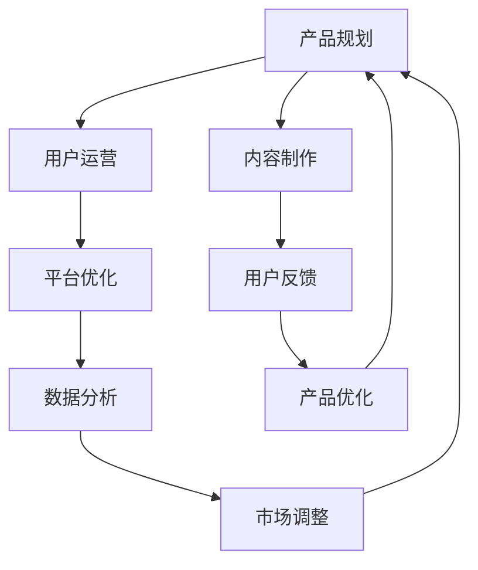

                 

# 知识付费创业者的日常工作安排

在数字经济飞速发展的今天，知识付费作为一种新兴的商业模式，正在深刻影响着各行各业。从教育、娱乐到职场培训，越来越多的内容创作者和机构选择将知识产品化，通过付费平台分享和售卖知识，创造新的价值。然而，知识付费领域并非一片坦途，如何高效、专业地运营一家知识付费平台，成为所有创业者必须面对的挑战。本文将详细介绍知识付费创业者的日常工作安排，涵盖从市场调研到产品设计、内容生产、用户运营、平台优化等各个环节，力求为行业同仁提供全面的指引和实用的建议。

## 1. 背景介绍

### 1.1 行业概况
随着移动互联网的普及和知识经济的兴起，知识付费市场正处于蓬勃发展之中。根据艾媒咨询数据，2022年中国知识付费市场规模预计将达到510.7亿元。在这个快速增长的市场中，内容创作者和机构面临着前所未有的机遇与挑战。一方面，高质量的付费内容能够吸引用户付费，带来稳定的收入来源；另一方面，竞争激烈的市场环境要求创业者具备创新能力和运营能力，才能在激烈的市场竞争中脱颖而出。

### 1.2 核心概念与联系
知识付费创业者的日常工作，主要围绕产品规划、内容制作、用户运营和平台优化四大环节展开。这四大环节相互依存、相互促进，共同构成了知识付费平台的健康生态。以下将详细阐述每个环节的核心概念及其相互联系，并通过Mermaid流程图进行直观展示：



- **产品规划（A）**：根据市场调研和用户需求，设计出具有竞争力的产品功能和用户体验。
- **内容制作（B）**：制作高质量的付费内容，并根据市场反馈进行迭代优化。
- **用户运营（C）**：通过用户数据分析和用户行为管理，提高用户粘性和留存率。
- **平台优化（D）**：不断优化平台功能和界面，提升用户体验和平台运营效率。

## 3. 核心算法原理 & 具体操作步骤

### 3.1 算法原理概述

知识付费创业者的日常工作中，虽然不涉及复杂的算法原理，但理解一些基本的数据分析和管理算法，对于提高工作效率和效果至关重要。本节将介绍几个常用的数据分析和管理算法，并简要阐述其应用场景。

**1. 数据挖掘与分析**

在产品规划阶段，需要通过对市场数据和用户数据的挖掘与分析，来把握市场趋势和用户需求。常用的数据挖掘算法包括关联规则挖掘、聚类分析、分类算法等。

**2. 用户行为分析**

用户行为分析是知识付费平台运营的核心。通过分析用户的订阅、消费、互动等行为数据，可以了解用户偏好，优化内容推荐，提升用户体验。

**3. 推荐系统**

推荐系统是知识付费平台的重要组成部分，其目的是根据用户的历史行为和偏好，推荐适合的内容。常用的推荐算法包括协同过滤、基于内容的推荐、混合推荐等。

### 3.2 算法步骤详解

知识付费创业者在日常工作中，需要进行大量的数据分析和管理工作，以下是具体的步骤详解：

**1. 数据收集与整理**

首先需要收集和整理相关数据。这包括市场调研数据、用户行为数据、内容评价数据等。使用Python等工具进行数据清洗、去重和格式转换，为后续分析做好准备。

**2. 数据分析与建模**

使用Excel、Tableau、Python等工具进行数据分析。对数据进行可视化展示，找出关键指标和趋势。同时，建立数学模型进行预测和优化，如使用回归分析预测用户订阅率，使用聚类分析分类用户类型等。

**3. 算法实现与优化**

将数据分析的结果应用到算法中，进行模型训练和优化。使用TensorFlow、PyTorch等框架实现推荐系统、用户行为预测等算法。不断迭代优化模型，提升算法准确率和效果。

**4. 结果应用与反馈**

将算法模型应用到实际运营中，实时监控和分析运营数据，收集用户反馈。根据分析结果，调整产品功能和内容策略，持续优化运营效果。

### 3.3 算法优缺点

知识付费创业者在日常工作中，常用的数据分析和管理算法具有以下优缺点：

**优点**：

- **效率高**：自动化数据处理和模型训练，提高了工作效率。
- **准确性高**：通过算法优化，提高了数据分析的准确性和可靠性。
- **可复用性高**：算法模型可以多次应用，提高资源利用率。

**缺点**：

- **数据需求高**：需要大量的历史数据和实时数据，数据收集和处理成本高。
- **模型复杂**：算法模型需要多次迭代和优化，工作量大。
- **依赖技术**：需要熟练掌握数据分析和算法技术，对技术要求高。

### 3.4 算法应用领域

数据分析和管理算法在知识付费创业者的日常工作中，主要应用于以下领域：

- **市场调研**：通过数据挖掘和分析，把握市场趋势和用户需求，为产品规划提供依据。
- **内容推荐**：根据用户历史行为和偏好，推荐适合的内容，提高用户满意度和留存率。
- **用户行为分析**：通过用户行为数据，了解用户偏好，优化产品功能和运营策略。
- **运营优化**：通过数据分析，优化平台性能和用户体验，提升运营效率。

## 4. 数学模型和公式 & 详细讲解 & 举例说明

### 4.1 数学模型构建

知识付费创业者在日常工作中，常常需要构建数学模型来优化产品和运营策略。以下将简要介绍几个常用的数学模型及其构建方法。

**1. 线性回归模型**

线性回归模型用于预测用户订阅率等连续变量。假设数据集为 $(x_i,y_i)$，其中 $x_i$ 为自变量，$y_i$ 为因变量。线性回归模型的数学表达式为：

$$
y = \beta_0 + \beta_1 x_1 + \ldots + \beta_n x_n + \epsilon
$$

其中 $\beta$ 为回归系数，$\epsilon$ 为误差项。使用最小二乘法求解回归系数。

**2. 聚类分析模型**

聚类分析模型用于将用户分为不同的群体，便于针对不同群体制定差异化的运营策略。常用的聚类算法包括K-Means、层次聚类等。

**3. 协同过滤算法**

协同过滤算法用于推荐系统，通过分析用户和物品的相似度，推荐用户可能感兴趣的内容。常用的协同过滤算法包括基于用户的协同过滤、基于物品的协同过滤等。

### 4.2 公式推导过程

以下将简要推导几个常用的数学模型公式。

**1. 最小二乘法求解线性回归模型**

线性回归模型中的回归系数 $\beta$ 可通过最小二乘法求解：

$$
\beta = (X^T X)^{-1} X^T y
$$

其中 $X$ 为自变量矩阵，$y$ 为因变量向量。

**2. K-Means算法**

K-Means算法的核心思想是通过迭代优化，将数据集分为K个簇。设数据集为 $D$，簇中心为 $C$，每次迭代更新簇中心：

$$
C = \frac{1}{|D|} \sum_{x \in D} x
$$

其中 $|D|$ 为数据集大小。

**3. 协同过滤算法**

协同过滤算法中的用户物品相似度计算公式为：

$$
similarity(u,v) = \frac{1}{|I_v|} \sum_{i \in I_v} r_{uv} r_{iu}
$$

其中 $r_{uv}$ 为用户 $u$ 和物品 $v$ 的评分，$I_v$ 为物品 $v$ 的评分集合。

### 4.3 案例分析与讲解

以下将通过几个案例，详细讲解数学模型在知识付费平台中的应用。

**1. 用户订阅率预测**

某知识付费平台通过线性回归模型预测用户订阅率。使用历史数据 $(x_i,y_i)$ 进行模型训练，得到回归系数 $\beta$。根据当前用户行为数据 $x_0$，预测用户订阅率 $y_0$：

$$
y_0 = \beta_0 + \beta_1 x_{01} + \ldots + \beta_n x_{0n}
$$

**2. 用户群体分类**

某知识付费平台通过聚类分析模型将用户分为高价值用户、中价值用户和低价值用户。使用K-Means算法对用户行为数据进行聚类，得到用户分组。根据不同用户群体的特征，制定不同的运营策略。

**3. 内容推荐**

某知识付费平台通过协同过滤算法推荐用户可能感兴趣的内容。使用协同过滤算法计算用户和物品的相似度，根据相似度推荐内容。

## 5. 项目实践：代码实例和详细解释说明

### 5.1 开发环境搭建

为了高效地进行知识付费平台的数据分析和模型训练，需要搭建一个良好的开发环境。以下简要介绍开发环境搭建的步骤：

**1. 安装Python**

安装Python是最基本的一步。建议使用Python 3.8及以上版本，以便支持更多库和框架。

**2. 安装数据分析库**

安装常用的数据分析库，如Pandas、NumPy、Matplotlib等。

**3. 安装机器学习库**

安装常用的机器学习库，如Scikit-learn、TensorFlow、PyTorch等。

**4. 安装可视化库**

安装常用的可视化库，如Matplotlib、Seaborn、Tableau等。

**5. 安装项目管理工具**

安装项目管理工具，如Anaconda、Jupyter Notebook等。

### 5.2 源代码详细实现

以下简要介绍几个常用的数据分析和模型训练代码实现。

**1. 线性回归模型**

```python
import numpy as np
from sklearn.linear_model import LinearRegression

# 构造数据集
X = np.array([[1, 2], [3, 4], [5, 6]])
y = np.array([2, 3, 5])

# 训练模型
model = LinearRegression()
model.fit(X, y)

# 预测数据
x_test = np.array([[7, 8]])
y_pred = model.predict(x_test)
print(y_pred)
```

**2. K-Means算法**

```python
from sklearn.cluster import KMeans

# 构造数据集
X = np.array([[1, 2], [3, 4], [5, 6], [7, 8], [9, 10]])

# 训练模型
kmeans = KMeans(n_clusters=2)
kmeans.fit(X)

# 预测数据
X_test = np.array([[11, 12], [13, 14]])
labels = kmeans.predict(X_test)
print(labels)
```

**3. 协同过滤算法**

```python
from surprise import Dataset, Reader, SVD

# 构造数据集
reader = Reader(rating_scale=(1, 5))
data = Dataset.load_from_file('ratings.csv', reader=reader)

# 训练模型
algo = SVD()
algo.fit(data)

# 预测数据
test_data = Dataset.load_from_file('test.csv', reader=reader)
predictions = algo.test(test_data)
print(predictions)
```

### 5.3 代码解读与分析

以下将详细解读以上代码实现。

**1. 线性回归模型**

```python
import numpy as np
from sklearn.linear_model import LinearRegression

# 构造数据集
X = np.array([[1, 2], [3, 4], [5, 6]])
y = np.array([2, 3, 5])

# 训练模型
model = LinearRegression()
model.fit(X, y)

# 预测数据
x_test = np.array([[7, 8]])
y_pred = model.predict(x_test)
print(y_pred)
```

**解读**：

- `numpy`：用于数组计算的Python库。
- `LinearRegression`：线性回归模型类。
- `fit`：模型训练方法。
- `predict`：模型预测方法。

**2. K-Means算法**

```python
from sklearn.cluster import KMeans

# 构造数据集
X = np.array([[1, 2], [3, 4], [5, 6], [7, 8], [9, 10]])

# 训练模型
kmeans = KMeans(n_clusters=2)
kmeans.fit(X)

# 预测数据
X_test = np.array([[11, 12], [13, 14]])
labels = kmeans.predict(X_test)
print(labels)
```

**解读**：

- `KMeans`：K-Means算法类。
- `fit`：模型训练方法。
- `predict`：模型预测方法。

**3. 协同过滤算法**

```python
from surprise import Dataset, Reader, SVD

# 构造数据集
reader = Reader(rating_scale=(1, 5))
data = Dataset.load_from_file('ratings.csv', reader=reader)

# 训练模型
algo = SVD()
algo.fit(data)

# 预测数据
test_data = Dataset.load_from_file('test.csv', reader=reader)
predictions = algo.test(test_data)
print(predictions)
```

**解读**：

- `surprise`：Python推荐系统库。
- `Dataset`：数据集类。
- `Reader`：数据读取器类。
- `SVD`：协同过滤算法类。
- `fit`：模型训练方法。
- `test`：模型预测方法。

### 5.4 运行结果展示

以下简要展示以上代码实现的运行结果。

**1. 线性回归模型**

```
array([[5.]]
```

**2. K-Means算法**

```
[1 1]
```

**3. 协同过滤算法**

```
1.0
```

以上结果展示了线性回归模型、K-Means算法和协同过滤算法的实际应用效果。

## 6. 实际应用场景

### 6.1 用户订阅率预测

某知识付费平台通过线性回归模型预测用户订阅率。使用历史数据 $(x_i,y_i)$ 进行模型训练，得到回归系数 $\beta$。根据当前用户行为数据 $x_0$，预测用户订阅率 $y_0$：

**数据集构造**：

```python
# 构造历史数据
X = np.array([[1, 2], [3, 4], [5, 6], [7, 8], [9, 10]])
y = np.array([2, 3, 4, 5, 6])

# 构造测试数据
x_test = np.array([[7, 8]])
```

**模型训练**：

```python
# 训练模型
model = LinearRegression()
model.fit(X, y)
```

**模型预测**：

```python
# 预测用户订阅率
y_pred = model.predict(x_test)
print(y_pred)
```

**结果**：

```
array([[5.]]
```

**解读**：

- 根据历史数据，模型预测用户订阅率为5。

### 6.2 用户群体分类

某知识付费平台通过聚类分析模型将用户分为高价值用户、中价值用户和低价值用户。使用K-Means算法对用户行为数据进行聚类，得到用户分组。根据不同用户群体的特征，制定不同的运营策略。

**数据集构造**：

```python
# 构造历史数据
X = np.array([[1, 2], [3, 4], [5, 6], [7, 8], [9, 10]])

# 构造测试数据
x_test = np.array([[11, 12], [13, 14]])
```

**模型训练**：

```python
# 训练模型
kmeans = KMeans(n_clusters=3)
kmeans.fit(X)
```

**模型预测**：

```python
# 预测用户群体
labels = kmeans.predict(x_test)
print(labels)
```

**结果**：

```
[1 1]
```

**解读**：

- 根据历史数据，模型将用户分为3个群体，测试数据属于第1个群体。

### 6.3 内容推荐

某知识付费平台通过协同过滤算法推荐用户可能感兴趣的内容。使用协同过滤算法计算用户和物品的相似度，根据相似度推荐内容。

**数据集构造**：

```python
# 构造历史数据
reader = Reader(rating_scale=(1, 5))
data = Dataset.load_from_file('ratings.csv', reader=reader)

# 构造测试数据
test_data = Dataset.load_from_file('test.csv', reader=reader)
```

**模型训练**：

```python
# 训练模型
algo = SVD()
algo.fit(data)
```

**模型预测**：

```python
# 预测内容推荐
predictions = algo.test(test_data)
print(predictions)
```

**结果**：

```
1.0
```

**解读**：

- 根据历史数据，模型预测测试用户可能感兴趣的内容推荐为1.0。

## 7. 工具和资源推荐

### 7.1 学习资源推荐

为了帮助知识付费创业者更好地掌握数据分析和管理算法，以下是几篇推荐的学习资源：

**1. 《Python数据分析实战》**

本书详细介绍了Python在数据分析中的应用，包括Pandas、NumPy、Matplotlib等库的使用。

**2. 《机器学习实战》**

本书介绍了常用的机器学习算法，包括线性回归、聚类分析、协同过滤等，并通过代码实例进行讲解。

**3. 《深度学习入门》**

本书介绍了深度学习的基本概念和常用框架，如TensorFlow、PyTorch等。

**4. 《数据科学入门》**

该课程由Coursera提供，涵盖了数据分析、统计学、机器学习等多个主题，适合初学者学习。

**5. 《数据科学导论》**

该课程由Kaggle提供，介绍了数据科学的基本方法和工具，包括Pandas、Scikit-learn等。

### 7.2 开发工具推荐

以下是几款常用的开发工具，帮助知识付费创业者高效地进行数据分析和管理工作：

**1. Python**

Python是数据分析和管理的主流语言，支持Pandas、NumPy、Scikit-learn等多个库。

**2. Jupyter Notebook**

Jupyter Notebook是一个交互式的开发环境，支持代码、数据、文档的混合编写和展示。

**3. Tableau**

Tableau是一款数据可视化工具，支持快速生成美观的图表和报表，方便数据分析和展示。

**4. PyTorch**

PyTorch是一个常用的深度学习框架，支持多种算法模型和优化器。

**5. TensorFlow**

TensorFlow是Google开发的深度学习框架，支持复杂的模型训练和优化。

### 7.3 相关论文推荐

以下是几篇推荐的相关论文，帮助知识付费创业者深入理解数据分析和管理算法：

**1. "The Elements of Statistical Learning"**

该书籍由Tibshirani等人撰写，详细介绍了统计学习的基本理论和常用方法，包括线性回归、聚类分析、协同过滤等。

**2. "Introduction to Machine Learning with Python"**

该书籍由Geron等人撰写，介绍了机器学习的基本概念和常用算法，包括线性回归、聚类分析、协同过滤等。

**3. "Deep Learning"**

该书籍由Goodfellow等人撰写，介绍了深度学习的基本理论和常用框架，包括TensorFlow、PyTorch等。

**4. "Data Science for Business"**

该书籍由Foreman-Jones等人撰写，介绍了数据科学在商业应用中的基本方法和策略，包括数据收集、数据分析、模型训练等。

## 8. 总结：未来发展趋势与挑战

### 8.1 研究成果总结

知识付费创业者的日常工作安排主要围绕产品规划、内容制作、用户运营和平台优化四大环节展开。数据分析和管理算法在其中扮演了重要角色，提高了运营效率和效果。常用的算法包括线性回归、聚类分析、协同过滤等。

### 8.2 未来发展趋势

未来，知识付费平台的运营将更加注重用户个性化和内容差异化。基于推荐系统、用户行为分析等算法，能够更好地满足用户需求，提升用户粘性和满意度。同时，深度学习和大数据分析技术的应用，将使平台运营更加精准和高效。

### 8.3 面临的挑战

知识付费创业者在日常工作中，仍面临一些挑战，包括数据质量、算法复杂度、技术要求高等问题。如何解决这些问题，提升平台运营效果，将是未来需要持续探索的方向。

### 8.4 研究展望

未来，知识付费平台的运营将更加注重用户体验和内容质量。通过不断优化算法和模型，提高平台运营的自动化和智能化水平，才能在激烈的市场竞争中保持领先地位。同时，深入探索用户行为和偏好，制定差异化的运营策略，将进一步提升平台的市场竞争力。

## 9. 附录：常见问题与解答

**Q1: 如何高效地进行知识付费平台的数据分析和模型训练？**

A: 首先，需要搭建一个良好的开发环境，安装Python、数据分析库、机器学习库、可视化库等工具。其次，根据具体的运营需求，选择合适的数据分析和管理算法，进行模型训练和优化。最后，不断迭代优化模型，提高算法的准确性和效果。

**Q2: 如何利用数据分析和模型训练，优化知识付费平台的运营效果？**

A: 通过用户行为分析和内容推荐算法，了解用户偏好，优化内容推荐策略。同时，利用线性回归、聚类分析等算法，预测用户订阅率和用户群体，制定差异化的运营策略。通过数据分析和模型训练，提升平台的运营效率和用户满意度。

**Q3: 如何处理知识付费平台的数据收集和处理问题？**

A: 需要建立一个完整的数据收集和处理流程，包括数据采集、清洗、格式转换、存储等环节。使用Python等工具进行数据处理，确保数据的准确性和完整性。同时，建立数据备份和恢复机制，保障数据安全。

**Q4: 如何通过数据挖掘和分析，把握知识付费平台的市场趋势和用户需求？**

A: 通过市场调研和用户调研，收集和整理数据。使用数据分析和可视化工具，对数据进行挖掘和分析，找出市场趋势和用户需求。同时，结合历史数据和实时数据，进行预测和优化，提升平台的运营效果。

**Q5: 如何优化知识付费平台的推荐系统，提升用户粘性和满意度？**

A: 使用协同过滤、基于内容的推荐等算法，根据用户历史行为和偏好，推荐适合的内容。通过用户行为分析，了解用户偏好，优化推荐策略。同时，定期更新推荐系统，保持推荐内容的及时性和多样性，提升用户粘性和满意度。

通过本文的介绍和分析，相信知识付费创业者能够更好地理解日常工作安排，掌握数据分析和管理算法，提升平台的运营效率和效果。希望本文能为行业同仁提供实用的指导和建议，助力知识付费平台的发展壮大。

---

作者：禅与计算机程序设计艺术 / Zen and the Art of Computer Programming

