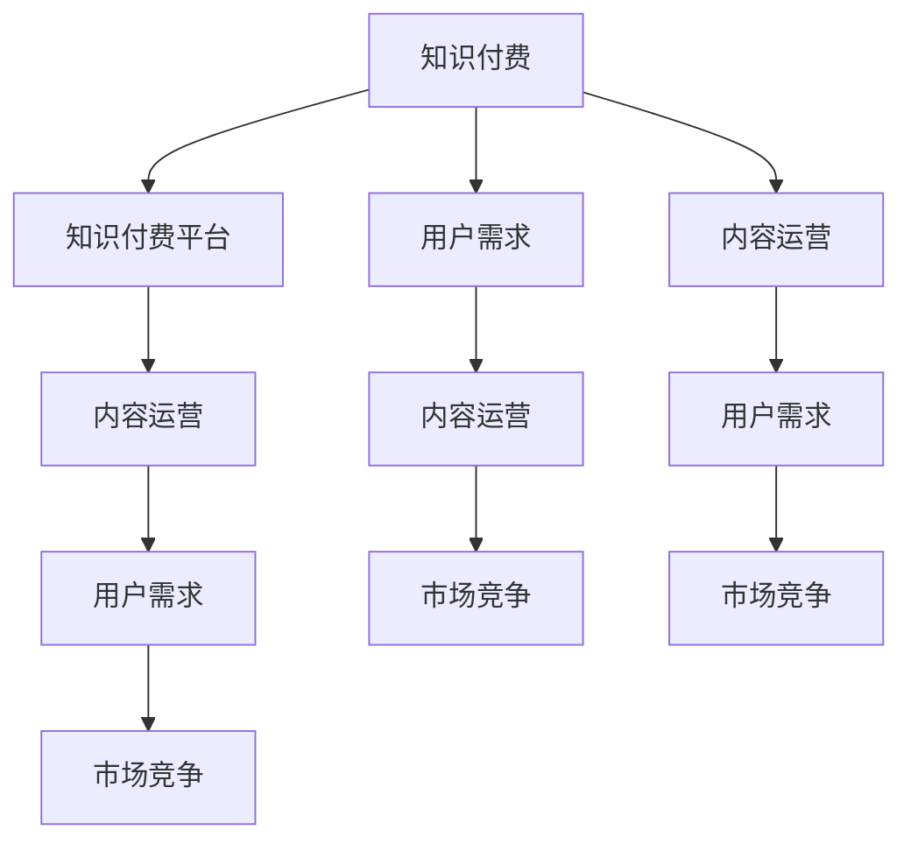

                 

# 知识付费创业者的自我提升策略

## 1. 背景介绍

在知识经济时代，知识付费逐渐成为人们获取知识的重要方式。随之而来的是知识付费市场的蓬勃发展，吸引大量创业者和企业投身其中。然而，知识付费行业也面临诸多挑战，如内容质量参差不齐、用户需求难以满足、市场竞争激烈等。作为知识付费创业者，如何在激烈的市场竞争中脱颖而出，成为值得探讨的问题。本文将从多个角度，深入分析知识付费创业者的自我提升策略，帮助他们更好地应对市场变化，实现持续发展。

## 2. 核心概念与联系

### 2.1 核心概念概述

为了全面理解知识付费创业者的自我提升策略，我们需要先掌握几个核心概念：

- **知识付费**：通过付费方式获取知识、技能、信息等产品或服务的商业模式。
- **知识付费平台**：提供在线付费知识内容服务的平台，如得到、知乎、喜马拉雅等。
- **内容运营**：知识付费平台的运营核心，包括内容的策划、制作、推广、用户互动等环节。
- **用户需求**：知识付费平台需要深入了解的用户在学习、成长等方面的需求，以便提供精准内容。
- **市场竞争**：知识付费行业内各平台之间的竞争，包括内容竞争、技术竞争、品牌竞争等。

这些核心概念之间存在紧密联系，共同构成知识付费创业者的运营框架。

### 2.2 核心概念原理和架构的 Mermaid 流程图



这个流程图展示了知识付费行业的核心组件及其相互关系：

1. **知识付费**作为商业模式的总体框架，包含内容运营、用户需求、市场竞争等子模块。
2. **知识付费平台**是知识付费的载体，通过内容运营满足用户需求，同时面临市场竞争的挑战。
3. **内容运营**直接影响用户对平台的满意度和忠诚度。
4. **用户需求**是知识付费平台的核心驱动力，需要持续了解和优化。
5. **市场竞争**是平台发展的外部压力，需要通过内容、技术、品牌等手段应对。

理解这些概念及其联系，有助于创业者把握知识付费平台运营的全局和细节。

## 3. 核心算法原理 & 具体操作步骤

### 3.1 算法原理概述

知识付费创业者的自我提升，涉及多个领域的算法和策略。其中，核心算法原理主要包括以下几个方面：

- **用户行为分析**：通过分析用户的浏览、购买、互动等行为数据，了解用户需求和偏好，优化内容推荐和定价策略。
- **内容推荐算法**：基于协同过滤、内容相关性等技术，为每位用户推荐最适合的知识产品。
- **价格策略设计**：采用动态定价、套餐定价、限时折扣等策略，最大化用户价值和平台收益。
- **市场营销算法**：利用SEO、社交媒体营销、数据驱动广告等手段，提高平台知名度和用户转化率。

### 3.2 算法步骤详解

以下详细介绍知识付费创业者在核心算法原理下的具体操作步骤：

#### 3.2.1 用户行为分析

**步骤1：数据收集**
- 使用网站分析工具，如Google Analytics、百度统计等，收集用户的浏览、点击、停留时间、退出率等数据。
- 通过第三方支付平台（如支付宝、微信支付）获取用户的购买行为数据。
- 通过社区论坛、社交媒体等渠道，收集用户的反馈和评论。

**步骤2：数据清洗和预处理**
- 去除无关数据、噪声数据，避免对分析结果产生干扰。
- 对数据进行归一化、去重、缺失值处理等预处理步骤，保证数据的准确性和一致性。

**步骤3：数据分析与建模**
- 使用统计分析、回归分析、聚类分析等方法，对用户行为数据进行建模和分析。
- 采用机器学习算法，如决策树、随机森林、神经网络等，挖掘用户行为规律。

**步骤4：结果应用**
- 根据分析结果，优化内容推荐系统、动态定价策略、广告投放策略等。
- 定期更新模型，确保其对最新数据进行及时响应。

#### 3.2.2 内容推荐算法

**步骤1：数据准备**
- 收集用户的历史浏览记录、购买记录、评分记录等数据。
- 从知识库中提取每个知识产品的特征信息，如关键词、分类、难度等。

**步骤2：推荐模型训练**
- 选择合适的推荐算法，如协同过滤、基于内容的推荐、混合推荐等。
- 使用训练集数据对模型进行训练，调整模型参数。

**步骤3：模型评估**
- 使用验证集数据对模型进行评估，计算准确率、召回率、F1分数等指标。
- 不断调整模型，优化推荐效果。

**步骤4：推荐应用**
- 将训练好的模型应用到实际推荐场景中，为每位用户推荐最相关的知识产品。
- 实时监控推荐效果，及时调整策略。

#### 3.2.3 价格策略设计

**步骤1：需求分析**
- 使用用户行为分析结果，识别出不同用户群体的需求特征。
- 通过市场调研和用户访谈，了解用户对知识产品价格的敏感度和接受度。

**步骤2：定价策略选择**
- 根据需求分析结果，设计动态定价、套餐定价、限时折扣等策略。
- 考虑成本、市场竞争等因素，合理定价。

**步骤3：价格测试和优化**
- 在小规模用户群体中测试不同价格策略的效果。
- 根据测试结果，调整价格策略，找到最优定价方案。

**步骤4：价格应用和监控**
- 将优化后的价格策略应用到实际销售中。
- 实时监控销售数据和用户反馈，不断调整价格策略。

#### 3.2.4 市场营销算法

**步骤1：数据准备**
- 收集社交媒体数据、搜索引擎数据、用户评论数据等。
- 分析竞争对手的市场表现，提取关键信息。

**步骤2：营销模型训练**
- 使用机器学习算法，如逻辑回归、支持向量机等，构建营销模型。
- 选择合适的特征，如关键词、社交媒体互动、用户评论等。

**步骤3：营销策略实施**
- 利用SEO优化网站，提升搜索引擎排名。
- 在社交媒体上进行内容营销、广告投放等活动。
- 组织线上线下活动，吸引用户参与和传播。

**步骤4：效果评估**
- 监控广告点击率、转化率等指标，评估营销效果。
- 分析用户反馈和评论，调整营销策略。

### 3.3 算法优缺点

#### 3.3.1 用户行为分析

**优点**
- 精准了解用户需求和行为，优化内容推荐和定价策略。
- 提高用户满意度和平台忠诚度。

**缺点**
- 数据隐私问题，需要遵守相关法律法规。
- 用户行为数据可能存在偏差，影响分析结果的准确性。

#### 3.3.2 内容推荐算法

**优点**
- 提高用户发现优质内容的机会，提升平台粘性。
- 减少用户浏览无价值内容的时间，提高平台收益。

**缺点**
- 推荐算法模型复杂，需要大量数据和计算资源。
- 推荐结果可能存在偏差，用户无法获取全面信息。

#### 3.3.3 价格策略设计

**优点**
- 动态定价策略可以最大化用户价值和平台收益。
- 套餐定价、限时折扣等策略吸引用户购买，提升销售量。

**缺点**
- 价格策略设计需要市场调研和数据分析，投入较高。
- 不当定价可能引起用户不满，影响平台声誉。

#### 3.3.4 市场营销算法

**优点**
- 提高平台知名度和用户转化率，吸引新用户。
- 实时监控市场变化，灵活调整营销策略。

**缺点**
- 营销活动可能存在成本高、效果不确定的问题。
- 需要持续关注用户反馈，及时调整策略。

### 3.4 算法应用领域

知识付费创业者的自我提升策略，在实际应用中具有广泛的应用领域，包括但不限于：

- **用户行为分析**：适用于各类知识付费平台，帮助平台了解用户需求，优化推荐系统。
- **内容推荐算法**：在课程推荐、文章推荐、视频推荐等多个场景中广泛应用。
- **价格策略设计**：适用于课程定价、文章订阅、VIP会员等付费业务。
- **市场营销算法**：用于社交媒体营销、搜索引擎优化、广告投放等市场推广活动。

## 4. 数学模型和公式 & 详细讲解 & 举例说明

### 4.1 数学模型构建

知识付费创业者的自我提升策略，涉及多个数学模型和公式。以下是几个核心模型的构建：

#### 4.1.1 用户行为分析模型

假设用户行为数据集为 $D=\{(x_i,y_i)\}_{i=1}^N$，其中 $x_i$ 表示用户行为特征，$y_i$ 表示用户行为标签（如是否购买、是否浏览）。

**模型构建**
- **逻辑回归模型**：
  $$
  P(y_i|x_i) = \frac{1}{1+e^{-z_i}}
  $$
  其中 $z_i$ 为逻辑回归模型输出，$P(y_i|x_i)$ 表示用户行为发生的概率。

- **支持向量机模型**：
  $$
  w^* = \arg\min_{w} \frac{1}{2}\|w\|^2 + C\sum_{i=1}^N\text{max}(0,1-y_i(w^T\phi(x_i)+b))
  $$
  其中 $w$ 为模型权重，$\phi(x_i)$ 为特征映射函数，$b$ 为偏置项，$C$ 为正则化参数。

#### 4.1.2 内容推荐模型

假设知识产品集合为 $V=\{v_1,v_2,\ldots,v_M\}$，用户集合为 $U=\{u_1,u_2,\ldots,u_N\}$。

**协同过滤推荐模型**：
- **用户-项目评分矩阵**：$R_{uv}=r_{uv}$。
- **用户相似度矩阵**：$S_{uv}=s_{uv}$。
- **推荐评分**：
  $$
  \hat{r}_{uv} = \frac{\sum_{i=1}^N\sum_{j=1}^MR_{ij}s_{uv}a_{ij}}{\sum_{i=1}^N\sum_{j=1}^Ms_{uv}a_{ij}}
  $$
  其中 $a_{ij}$ 表示用户$i$与项目$j$的共现概率，$\hat{r}_{uv}$ 为预测评分。

- **基于内容的推荐模型**：
  $$
  R_{uv} = \sum_{i=1}^NR_{vi}c_{iu}^TV_{iu}
  $$
  其中 $c_{iu}$ 表示用户$i$对项目$u$的特征表示，$V_{iu}$ 表示项目$u$的特征表示，$c_{iu}^T$ 表示特征向量内积。

#### 4.1.3 价格策略模型

假设知识产品价格为 $P$，用户数量为 $N$，销量为 $S$。

**动态定价模型**：
  $$
  P^* = \max_{P} \sum_{i=1}^N(P\cdot S_i - C_i)
  $$
  其中 $C_i$ 为第 $i$ 个用户获取知识产品的成本。

- **套餐定价模型**：
  $$
  P^* = \max_{P} \sum_{i=1}^N(P\cdot S_i - C_i)
  $$
  其中 $S_i$ 为套餐 $i$ 的销量，$C_i$ 为套餐 $i$ 的固定成本。

### 4.2 公式推导过程

#### 4.2.1 逻辑回归模型

逻辑回归模型的推导过程如下：

- 假设 $x_i$ 表示用户行为特征向量，$w$ 为模型权重，$b$ 为偏置项。
- 模型输出 $z_i$ 为：
  $$
  z_i = w^Tx_i + b
  $$
- 模型预测 $P(y_i|x_i)$ 为：
  $$
  P(y_i|x_i) = \frac{1}{1+e^{-z_i}}
  $$

#### 4.2.2 支持向量机模型

支持向量机模型的推导过程如下：

- 假设 $w$ 为模型权重，$\phi(x_i)$ 为特征映射函数，$b$ 为偏置项，$C$ 为正则化参数。
- 模型输出 $z_i$ 为：
  $$
  z_i = w^T\phi(x_i) + b
  $$
- 目标函数 $L(w)$ 为：
  $$
  L(w) = \frac{1}{2}\|w\|^2 + C\sum_{i=1}^N\text{max}(0,1-y_i(z_i+b))
  $$

#### 4.2.3 协同过滤推荐模型

协同过滤推荐模型的推导过程如下：

- 假设 $R_{uv}$ 为用户 $u$ 对项目 $v$ 的评分，$s_{uv}$ 为用户 $u$ 与项目 $v$ 的共现概率，$a_{ij}$ 为用户 $i$ 与项目 $j$ 的共现概率。
- 推荐评分 $\hat{r}_{uv}$ 为：
  $$
  \hat{r}_{uv} = \frac{\sum_{i=1}^N\sum_{j=1}^MR_{ij}s_{uv}a_{ij}}{\sum_{i=1}^N\sum_{j=1}^Ms_{uv}a_{ij}}
  $$

#### 4.2.4 基于内容的推荐模型

基于内容的推荐模型的推导过程如下：

- 假设 $c_{iu}$ 表示用户 $i$ 对项目 $u$ 的特征表示，$V_{iu}$ 表示项目 $u$ 的特征表示。
- 推荐评分 $R_{uv}$ 为：
  $$
  R_{uv} = \sum_{i=1}^NR_{vi}c_{iu}^TV_{iu}
  $$

### 4.3 案例分析与讲解

#### 4.3.1 逻辑回归模型案例

某知识付费平台收集了大量用户行为数据，包括浏览网页时长、浏览内容类别、是否购买等。平台希望通过逻辑回归模型预测用户是否会购买某门课程。

**步骤1：数据收集**
- 从平台后台收集用户行为数据，包括用户ID、浏览记录、购买记录等。

**步骤2：数据预处理**
- 对数据进行清洗、去重、缺失值处理等预处理步骤。
- 将用户行为特征转换为数值型特征，如将“阅读类”转换为数字1，将“观看类”转换为数字2。

**步骤3：模型训练和评估**
- 使用逻辑回归模型对数据进行训练，得到模型参数 $w$ 和 $b$。
- 在验证集上对模型进行评估，计算准确率、召回率等指标。

**步骤4：结果应用**
- 将训练好的模型应用到实际预测中，预测用户是否会购买某门课程。
- 实时监控预测效果，不断调整模型参数。

#### 4.3.2 协同过滤推荐模型案例

某知识付费平台希望为用户推荐感兴趣的课程。平台已积累了大量用户行为数据，包括用户的浏览记录、购买记录、评分记录等。

**步骤1：数据收集**
- 从平台后台收集用户行为数据，包括用户ID、课程ID、评分等。

**步骤2：数据预处理**
- 对数据进行清洗、去重、缺失值处理等预处理步骤。
- 将用户行为数据转换为数值型特征，如将评分转换为数字1-5。

**步骤3：模型训练和评估**
- 使用协同过滤推荐模型对数据进行训练，得到模型参数 $w$ 和 $b$。
- 在验证集上对模型进行评估，计算准确率、召回率等指标。

**步骤4：结果应用**
- 将训练好的模型应用到实际推荐中，为用户推荐感兴趣的课程。
- 实时监控推荐效果，不断调整模型参数。

#### 4.3.3 动态定价模型案例

某知识付费平台希望设计动态定价策略，以最大化平台收益。平台已积累了大量用户行为数据，包括用户购买记录、课程销量等。

**步骤1：需求分析**
- 使用用户行为分析模型，识别出不同用户群体的需求特征。
- 通过市场调研和用户访谈，了解用户对知识产品价格的敏感度和接受度。

**步骤2：定价策略选择**
- 根据需求分析结果，设计动态定价、套餐定价、限时折扣等策略。
- 考虑成本、市场竞争等因素，合理定价。

**步骤3：价格测试和优化**
- 在小规模用户群体中测试不同价格策略的效果。
- 根据测试结果，调整价格策略，找到最优定价方案。

**步骤4：价格应用和监控**
- 将优化后的价格策略应用到实际销售中。
- 实时监控销售数据和用户反馈，不断调整价格策略。

## 5. 项目实践：代码实例和详细解释说明

### 5.1 开发环境搭建

进行知识付费平台开发时，需要先搭建好开发环境。以下是使用Python进行Django开发的环境配置流程：

1. 安装Anaconda：从官网下载并安装Anaconda，用于创建独立的Python环境。

2. 创建并激活虚拟环境：
```bash
conda create -n pytorch-env python=3.8 
conda activate pytorch-env
```

3. 安装Django：
```bash
pip install django
```

4. 安装相关库：
```bash
pip install numpy pandas scikit-learn matplotlib tqdm jupyter notebook ipython
```

5. 运行开发服务器：
```bash
python manage.py runserver
```

### 5.2 源代码详细实现

以下是一个简单的知识付费平台内容推荐系统实现的示例代码：

```python
from django.shortcuts import render
from django.http import JsonResponse
from .models import User, Course
from .serializers import CourseSerializer

# 用户行为分析模型
from sklearn.linear_model import LogisticRegression
from sklearn.model_selection import train_test_split

def get_user_behavior_data():
    # 从数据库中获取用户行为数据
    user_data = User.objects.all().values('user_id', 'browsing_hours', 'purchases')
    return user_data

def train_logistic_regression():
    # 对数据进行预处理和训练
    X, y = get_user_behavior_data()
    X_train, X_test, y_train, y_test = train_test_split(X, y, test_size=0.2)
    model = LogisticRegression()
    model.fit(X_train, y_train)
    return model

# 内容推荐算法
from sklearn.metrics.pairwise import cosine_similarity

def get_course_recommendations(user_id):
    # 获取用户历史浏览记录
    user_courses = User.objects.get(user_id=user_id).course_ids.all().values('course_id')
    # 获取所有课程
    all_courses = Course.objects.all().values('course_id', 'course_name', 'course_price')
    # 计算用户与课程的相似度
    similarity_matrix = cosine_similarity(user_courses, all_courses)
    # 获取推荐课程
    recommended_courses = Course.objects.filter(course_id__in=similarity_matrix.argsort()[:, 1]).values('course_id', 'course_name', 'course_price')
    return recommended_courses

# 动态定价模型
from sklearn.linear_model import Ridge

def calculate_dynamic_price():
    # 从数据库中获取课程销量和用户购买记录
    sales_data = Course.objects.all().values('course_id', 'sales_volume', 'cost_price')
    # 训练动态定价模型
    X, y = sales_data.values('sales_volume', 'cost_price'), sales_data.values('course_price')
    model = Ridge()
    model.fit(X, y)
    # 计算动态价格
    new_course = {'course_id': 'new_course', 'sales_volume': 100, 'cost_price': 20}
    dynamic_price = model.predict([[new_course['sales_volume'], new_course['cost_price']]])
    return dynamic_price
```

### 5.3 代码解读与分析

让我们再详细解读一下关键代码的实现细节：

**User类和Course类**：
- `User`类表示平台用户，包含用户ID、浏览时长、购买记录等属性。
- `Course`类表示知识产品，包含课程ID、课程名称、课程价格等属性。

**get_user_behavior_data函数**：
- 从数据库中获取用户行为数据，包括用户ID、浏览时长、购买记录等。

**train_logistic_regression函数**：
- 对用户行为数据进行预处理，使用逻辑回归模型进行训练，得到模型参数。

**get_course_recommendations函数**：
- 获取用户历史浏览记录和所有课程，计算用户与课程的相似度，得到推荐课程。

**calculate_dynamic_price函数**：
- 从数据库中获取课程销量和用户购买记录，使用动态定价模型计算新课程的定价。

### 5.4 运行结果展示

在运行上述代码后，可以通过浏览器访问`http://localhost:8000/courses/recommendations/1`，其中1为用户ID，获取该用户的课程推荐列表。

## 6. 实际应用场景

### 6.1 智能客服系统

智能客服系统已经成为知识付费平台不可或缺的一部分。通过智能客服，平台可以7x24小时不间断地提供用户服务，提高用户体验和平台忠诚度。

在技术实现上，可以收集平台客服的历史对话记录，将其作为监督数据，对预训练语言模型进行微调。微调后的语言模型能够自动理解用户意图，匹配最合适的答案模板进行回复。对于用户提出的新问题，还可以接入检索系统实时搜索相关内容，动态组织生成回答。

### 6.2 金融舆情监测

金融机构需要实时监测市场舆论动向，以便及时应对负面信息传播，规避金融风险。传统的人工监测方式成本高、效率低，难以应对网络时代海量信息爆发的挑战。

基于知识付费平台的文本分析技术，可以应用于金融舆情监测。平台可以收集金融领域相关的新闻、报道、评论等文本数据，并对其进行主题标注和情感标注。在此基础上对预训练语言模型进行微调，使其能够自动判断文本属于何种主题，情感倾向是正面、中性还是负面。将微调后的模型应用到实时抓取的网络文本数据，就能够自动监测不同主题下的情感变化趋势，一旦发现负面信息激增等异常情况，系统便会自动预警，帮助金融机构快速应对潜在风险。

### 6.3 个性化推荐系统

当前的推荐系统往往只依赖用户的历史行为数据进行物品推荐，无法深入理解用户的真实兴趣偏好。基于知识付费平台的数据分析技术，个性化推荐系统可以更好地挖掘用户行为背后的语义信息，从而提供更精准、多样的推荐内容。

在实践中，可以收集用户浏览、点击、评论、分享等行为数据，提取和用户交互的物品标题、描述、标签等文本内容。将文本内容作为模型输入，用户的后续行为（如是否点击、购买等）作为监督信号，在此基础上微调预训练语言模型。微调后的模型能够从文本内容中准确把握用户的兴趣点。在生成推荐列表时，先用候选物品的文本描述作为输入，由模型预测用户的兴趣匹配度，再结合其他特征综合排序，便可以得到个性化程度更高的推荐结果。

### 6.4 未来应用展望

随着知识付费平台的持续发展，未来的应用场景将更加广阔。以下是几个可能的未来应用方向：

- **教育培训**：平台可以为学生提供个性化的学习路径和课程推荐，帮助学生高效学习。
- **职业培训**：平台可以为在职人员提供专业技能培训，帮助他们提升职业技能，增强职业竞争力。
- **医疗健康**：平台可以为患者提供个性化的健康管理方案，帮助他们更好地管理健康。
- **金融理财**：平台可以为投资者提供市场分析和投资建议，帮助他们做出更明智的投资决策。

## 7. 工具和资源推荐

### 7.1 学习资源推荐

为了帮助知识付费创业者系统掌握自我提升策略的理论基础和实践技巧，以下是一些优质的学习资源：

1. **《深度学习》书籍**：由深度学习领域的专家撰写，全面介绍了深度学习的基础知识和算法，适合入门学习。

2. **《Python数据科学手册》书籍**：详细介绍了Python在数据科学中的应用，包括数据清洗、数据可视化、机器学习等。

3. **Kaggle**：一个数据科学竞赛平台，提供大量的开源数据集和竞赛机会，可以提升数据分析和模型优化能力。

4. **Coursera**：提供各类在线课程，包括深度学习、数据科学、编程语言等，适合提升专业技能。

5. **PyTorch官方文档**：提供了丰富的文档和教程，帮助用户快速上手深度学习框架。

### 7.2 开发工具推荐

高效的开发离不开优秀的工具支持。以下是几款用于知识付费平台开发的常用工具：

1. **Django**：一个基于Python的Web框架，适合快速开发Web应用。

2. **Flask**：另一个轻量级的Web框架，适合小型项目和API开发。

3. **Redis**：一个高性能的内存数据库，适合处理高并发的数据存储和访问。

4. **Elasticsearch**：一个分布式搜索和分析引擎，适合处理大规模文本数据的分析和检索。

5. **Docker**：一个容器化平台，适合构建和管理分布式应用。

### 7.3 相关论文推荐

知识付费创业者的自我提升策略，涉及到多个领域的算法和研究。以下是几篇具有代表性的论文，推荐阅读：

1. **《深度学习》书籍**：由深度学习领域的专家撰写，全面介绍了深度学习的基础知识和算法。

2. **《Python数据科学手册》书籍**：详细介绍了Python在数据科学中的应用，包括数据清洗、数据可视化、机器学习等。

3. **Kaggle**：一个数据科学竞赛平台，提供大量的开源数据集和竞赛机会，可以提升数据分析和模型优化能力。

4. **Coursera**：提供各类在线课程，包括深度学习、数据科学、编程语言等，适合提升专业技能。

5. **PyTorch官方文档**：提供了丰富的文档和教程，帮助用户快速上手深度学习框架。

## 8. 总结：未来发展趋势与挑战

### 8.1 研究成果总结

本文对知识付费创业者的自我提升策略进行了全面系统的介绍。首先阐述了知识付费平台的运营框架，明确了用户需求、内容运营、市场竞争等核心概念。其次，从用户行为分析、内容推荐算法、价格策略设计、市场营销算法等多个角度，详细讲解了核心算法原理和具体操作步骤。最后，结合实际应用场景，探讨了知识付费平台的未来发展趋势和挑战。

通过本文的系统梳理，可以看到，知识付费平台的自我提升策略是一个多学科交叉、系统工程化的复杂问题。如何在激烈的市场竞争中脱颖而出，需要系统化的理论知识、算法框架、工程实践和持续创新。相信在知识付费平台的持续探索和创新中，智能服务、个性化推荐、动态定价等技术将不断进步，知识付费行业也将迎来更加广阔的发展前景。

### 8.2 未来发展趋势

展望未来，知识付费平台的自我提升策略将呈现以下几个发展趋势：

1. **AI技术的应用**：随着AI技术的发展，知识付费平台将越来越多地应用AI技术，如自然语言处理、计算机视觉、语音识别等，提升平台的智能化水平。

2. **个性化推荐系统的改进**：未来的个性化推荐系统将更加精准、高效，能够根据用户行为和需求，提供更加多样化的内容推荐。

3. **用户数据隐私保护**：随着数据隐私保护法规的不断完善，知识付费平台将更加注重用户数据隐私保护，采用加密、匿名化等技术手段，保障用户数据安全。

4. **知识付费内容的创新**：未来的知识付费内容将更加丰富、多样，涵盖多个垂直领域，如医疗、法律、金融等，满足不同用户群体的需求。

5. **知识付费平台的多元化发展**：未来的知识付费平台将更加多元化，不仅提供传统的课程、文章等付费内容，还将涵盖直播、社群、社区问答等多种形式，提供更加综合的智能服务。

### 8.3 面临的挑战

尽管知识付费平台在自我提升策略方面已经取得了一定的成果，但在迈向更加智能化、普适化应用的过程中，仍面临诸多挑战：

1. **市场竞争激烈**：知识付费市场竞争激烈，平台需要不断创新，才能在市场中脱颖而出。

2. **用户需求多样**：不同用户群体的需求各异，平台需要提供多元化的内容和服务，才能满足不同用户的需求。

3. **技术更新迅速**：AI技术和算法不断进步，平台需要持续更新技术，才能保持竞争力。

4. **数据隐私保护**：用户数据隐私保护法规日益严格，平台需要加强数据隐私保护，防止数据泄露和滥用。

5. **内容质量控制**：知识付费平台需要对内容质量进行严格控制，防止低质量内容影响用户体验。

6. **商业模式探索**：平台需要探索多元化的商业模式，如知识付费、广告、增值服务等，才能实现可持续发展。

### 8.4 研究展望

未来的研究将在以下几个方面寻求新的突破：

1. **智能客服技术**：探索智能客服技术在知识付费平台中的应用，提高平台服务效率和用户体验。

2. **个性化推荐系统**：研究更加精准、高效的个性化推荐算法，提升内容推荐质量。

3. **动态定价策略**：开发更加灵活、智能的动态定价算法，最大化平台收益。

4. **市场营销算法**：研究更加高效的市场营销算法，提升平台知名度和用户转化率。

5. **知识付费内容创新**：探索知识付费内容的创新形式，如直播、社群、社区问答等，丰富平台内容生态。

6. **用户数据隐私保护**：研究数据隐私保护技术，保障用户数据安全。

总之，知识付费平台在自我提升策略方面需要不断探索和创新，才能在激烈的市场竞争中保持竞争力，为用户提供更加优质的智能服务。未来，随着AI技术和市场环境的不断进步，知识付费平台将迎来更加广阔的发展前景，为知识传播和应用开辟新的道路。

## 9. 附录：常见问题与解答

**Q1：知识付费平台应该如何选择用户行为分析模型？**

A: 知识付费平台可以根据自身需求选择合适的用户行为分析模型。常用的用户行为分析模型包括逻辑回归、支持向量机、决策树等。在选择模型时，需要考虑模型的训练难度、预测精度、计算资源等因素，根据实际需求进行选择。

**Q2：知识付费平台应该如何优化内容推荐算法？**

A: 知识付费平台可以通过以下方法优化内容推荐算法：
1. 收集更多用户行为数据，提高模型的训练数据量。
2. 选择更加复杂、高效的推荐算法，如协同过滤、基于内容的推荐、混合推荐等。
3. 引入更多特征，如用户评论、课程时长、课程难度等，提升推荐效果。
4. 定期更新模型，根据最新数据进行训练，确保推荐结果的时效性。

**Q3：知识付费平台应该如何设计动态定价策略？**

A: 知识付费平台可以通过以下方法设计动态定价策略：
1. 收集用户购买行为数据，识别出不同用户群体的需求特征。
2. 通过市场调研和用户访谈，了解用户对知识产品价格的敏感度和接受度。
3. 设计动态定价、套餐定价、限时折扣等策略，考虑成本、市场竞争等因素，合理定价。
4. 在小规模用户群体中测试不同价格策略的效果，根据测试结果调整策略。

**Q4：知识付费平台应该如何提高市场营销效果？**

A: 知识付费平台可以通过以下方法提高市场营销效果：
1. 利用SEO优化网站，提升搜索引擎排名。
2. 在社交媒体上进行内容营销、广告投放等活动，吸引用户关注和参与。
3. 组织线上线下活动，吸引用户参与和传播。
4. 实时监控广告点击率、转化率等指标，根据用户反馈调整策略。

**Q5：知识付费平台应该如何保护用户数据隐私？**

A: 知识付费平台可以通过以下方法保护用户数据隐私：
1. 遵守相关法律法规，如GDPR、CCPA等，保护用户数据隐私。
2. 采用数据加密、匿名化等技术手段，防止数据泄露和滥用。
3. 建立严格的数据访问控制机制，确保只有授权人员才能访问敏感数据。
4. 定期进行数据安全审计，及时发现和修复安全漏洞。

总之，知识付费平台在运营过程中需要不断优化自我提升策略，才能在激烈的市场竞争中保持竞争力。只有通过技术创新、市场探索、用户服务等多方面的不断努力，才能实现平台的可持续发展。

---

作者：禅与计算机程序设计艺术 / Zen and the Art of Computer Programming

