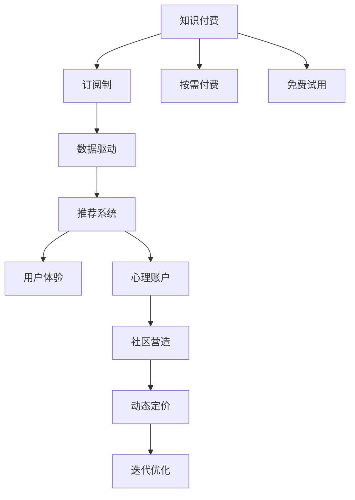

                 

# 知识付费如何实现可持续盈利？

> 关键词：知识付费, 订阅制, 按需付费, 免费试用, 数据驱动, 推荐系统, 用户体验, 心理账户, 社区营造, 动态定价, 迭代优化

## 1. 背景介绍

### 1.1 问题由来
随着知识经济时代的到来，知识付费作为一种新兴的商业模式逐渐兴起。知识付费平台通过为用户提供优质知识内容，帮助其解决专业问题，提升自身能力，实现盈利。然而，在知识付费市场中，平台面临着激烈的市场竞争和用户流失风险。如何在竞争激烈的市场中保持用户黏性，实现可持续盈利，成为知识付费平台亟需解决的问题。

### 1.2 问题核心关键点
知识付费平台可持续盈利的关键在于用户付费意愿和长期留存。需要通过科学的用户定价策略、优质的内容推荐、良好的用户体验、社区营造等手段，提高用户的付费意愿和平台黏性。

### 1.3 问题研究意义
本研究通过深入分析知识付费平台可持续盈利的方法和策略，探讨如何通过科学的用户定价、优质内容推荐、用户体验优化、社区营造等手段，实现知识付费平台的可持续发展，为平台运营商提供可操作的实践建议。

## 2. 核心概念与联系

### 2.1 核心概念概述

为更好地理解知识付费的可持续盈利方法，本节将介绍几个密切相关的核心概念：

- 知识付费：通过付费获取专业知识的商业模式。用户为获取有价值的知识内容支付费用，平台通过收取费用实现盈利。

- 订阅制：用户以固定周期（如月、年）支付固定费用，持续获取平台提供的内容。

- 按需付费：用户根据具体内容（如单次课程、文章）支付费用，灵活度更高。

- 免费试用：提供一定期限的免费试用服务，吸引用户注册并尝试平台内容。

- 数据驱动：通过用户行为数据进行分析，实现个性化推荐和定价策略。

- 推荐系统：通过机器学习算法，根据用户偏好和历史行为推荐内容。

- 用户体验：通过界面设计、交互方式、内容呈现等方式提升用户使用平台的愉悦感。

- 心理账户：用户会将不同类型的支出分别存入不同的心理账户，如价值账户（高价值服务）、娱乐账户（低价值服务）。

- 社区营造：通过构建社区、开展互动活动等方式，提升用户粘性。

- 动态定价：根据市场供需关系和用户行为动态调整价格，实现收益最大化。

- 迭代优化：通过用户反馈和数据分析，不断优化平台功能和用户体验。

这些核心概念之间的逻辑关系可以通过以下Mermaid流程图来展示：



这个流程图展示了一体化的知识付费平台运营策略：

1. 以知识付费作为商业模式基础。
2. 提供订阅制和按需付费两种付费模式，满足不同用户需求。
3. 提供免费试用期，吸引新用户注册。
4. 利用数据驱动，实现个性化推荐。
5. 通过推荐系统提升用户体验。
6. 利用心理账户理论，优化定价策略。
7. 营造社区，增强用户粘性。
8. 动态定价，应对市场变化。
9. 不断迭代优化，提升平台竞争力。

这些概念共同构成了知识付费平台的运营框架，使其能够有效应对市场变化和用户需求，实现长期盈利。

## 3. 核心算法原理 & 具体操作步骤
### 3.1 算法原理概述

知识付费平台的可持续盈利方法，本质上是一种以用户为中心的动态定价策略和运营优化方法。其核心思想是：通过科学的用户定价、优质内容推荐、良好的用户体验、社区营造等手段，最大化用户价值，从而实现平台的持续盈利。

形式化地，假设知识付费平台的目标是在用户付费意愿最大化的情况下，实现盈利最大化。设平台有 $N$ 个用户，用户 $i$ 在平台上的终身价值为 $V_i$，平台获得的总收益为 $R$。目标是最大化 $R$。

平台通过以下方法实现盈利最大化：

- 数据驱动定价：根据用户行为数据，如付费频率、观看时长等，动态调整订阅价格。
- 内容推荐：通过推荐系统，向用户推荐其感兴趣的内容，提升用户体验和黏性。
- 用户心理账户管理：区分高价值服务（如专业课程）和低价值服务（如娱乐内容），分别定价，满足不同用户需求。
- 社区营造：通过构建用户社区，增强用户归属感和粘性，提升平台整体价值。
- 动态定价：根据市场需求和用户行为，动态调整定价策略，实现收益最大化。

### 3.2 算法步骤详解

基于知识付费平台的可持续盈利方法，具体的算法步骤可以分为以下几个关键环节：

**Step 1: 用户数据采集与分析**

- 通过平台日志、用户行为数据、交易记录等，收集用户基本信息、行为数据、购买记录等。
- 利用数据分析技术，如A/B测试、聚类分析等，理解用户行为模式和需求偏好。

**Step 2: 推荐系统设计**

- 根据用户行为数据，构建用户画像，利用协同过滤、内容过滤等推荐算法，实现个性化推荐。
- 通过AB测试，评估推荐算法的效果，不断优化推荐系统。

**Step 3: 定价策略制定**

- 根据用户特征和行为，制定不同的定价策略，如时间定价、价值定价等。
- 通过数据分析，找出用户付费心理，制定相应的定价规则。

**Step 4: 社区营造与互动**

- 通过社区论坛、在线课程、互动活动等形式，构建用户社区，提升用户粘性。
- 通过互动活动，增强用户参与感和归属感，营造良好社区氛围。

**Step 5: 动态定价与优化**

- 根据市场需求和用户行为，动态调整定价策略。
- 通过用户反馈和数据分析，不断优化定价策略和平台功能，提升用户体验。

### 3.3 算法优缺点

知识付费平台的可持续盈利方法具有以下优点：

1. 灵活高效。通过数据驱动和动态定价，平台能够快速响应市场变化，优化资源配置。
2. 精准定位。通过个性化推荐和社区营造，平台能够精准满足用户需求，提升用户满意度和粘性。
3. 收益最大化。通过优化定价和运营策略，平台能够实现收益最大化，提高市场竞争力。

同时，该方法也存在一定的局限性：

1. 数据依赖。平台需要大量用户行为数据来支撑推荐系统和定价策略，数据获取成本较高。
2. 用户流失。部分用户可能因价格过高或内容不满足预期而流失，影响平台盈利。
3. 运营成本高。平台需要投入大量人力物力进行数据分析和社区运营，成本较高。

尽管存在这些局限性，但就目前而言，基于数据驱动和动态定价的方法仍然是知识付费平台实现可持续盈利的有效手段。未来相关研究将进一步探索如何降低数据依赖，提高推荐系统的精准度和定价策略的灵活性，同时兼顾用户满意度和平台盈利性。

### 3.4 算法应用领域

基于数据驱动和动态定价的知识付费平台可持续盈利方法，已经在诸多领域得到了广泛的应用，例如：

- 在线教育：如Coursera、edX等平台，通过个性化推荐和动态定价策略，提升课程销售和用户满意度。
- 专业培训：如LinkedIn Learning、Udemy等平台，通过社区营造和优质内容推荐，提升培训效果和用户黏性。
- 健康咨询：如HealthTap、HealthHero等平台，通过构建医生社区和动态定价，提供高质量医疗咨询服务。
- 财经资讯：如彭博社、路透社等平台，通过个性化内容推荐和用户互动，提升新闻阅读体验和用户忠诚度。

除了上述这些经典领域外，知识付费平台还在不断探索更多应用场景，如娱乐、游戏、垂直行业等，为知识付费市场带来更多创新和活力。

## 4. 数学模型和公式 & 详细讲解 & 举例说明

### 4.1 数学模型构建

本节将使用数学语言对知识付费平台的可持续盈利方法进行更加严格的刻画。

设平台有 $N$ 个用户，每个用户在平台上的终身价值为 $V_i$，平台获得的总收益为 $R$。平台的定价策略为 $P$，内容推荐系统的效果为 $C$。平台的用户满意度为 $S$，社区营造效果为 $C$。

目标函数为：

$$
\maximize R = \sum_{i=1}^N P_i \times V_i + \text{其他收益} \\
\text{subject to} \quad S \geq \theta \quad \text{and} \quad C \geq \phi
$$

其中 $P_i$ 为用户 $i$ 的定价，$S$ 为平台的用户满意度，$C$ 为用户内容推荐系统的覆盖率。

### 4.2 公式推导过程

以下我们以在线教育平台为例，推导定价策略和推荐系统的效果函数。

假设平台上有 $N$ 个用户，用户 $i$ 的终身价值为 $V_i$，平台的定价策略为 $P$，内容推荐系统的效果为 $C$。

目标函数为：

$$
\maximize R = \sum_{i=1}^N P_i \times V_i + \text{其他收益} \\
\text{subject to} \quad S \geq \theta \quad \text{and} \quad C \geq \phi
$$

其中 $S$ 为平台的用户满意度，$C$ 为用户内容推荐系统的覆盖率。

根据贝叶斯定理，用户满意度 $S$ 可以通过推荐系统的效果 $C$ 来近似计算：

$$
S = P(C) \times V_i + (1-P(C)) \times V_i
$$

其中 $P(C)$ 为用户获得高质量内容推荐的可能性，$V_i$ 为用户的终身价值。

推荐系统的效果 $C$ 可以通过推荐算法的效果函数 $f$ 来计算：

$$
C = f(P, V_i)
$$

将 $C$ 和 $S$ 的表达式代入目标函数中，得到：

$$
\maximize R = \sum_{i=1}^N (P_i \times V_i) + \text{其他收益} \\
\text{subject to} \quad P(C) \times V_i \geq \theta \quad \text{and} \quad f(P, V_i) \geq \phi
$$

通过求解上述优化问题，即可找到最优的定价策略和推荐系统效果。

### 4.3 案例分析与讲解

以下以Coursera平台为例，分析其实现可持续盈利的策略。

**案例背景：**

Coursera是一个全球领先的在线教育平台，通过与多所顶尖大学和教育机构合作，为用户提供高质量的课程内容。Coursera的主要盈利模式为按需付费（单课程购买）和订阅制（月度或年度订阅），同时提供免费试用期吸引新用户。

**实施策略：**

1. **用户数据分析：**

   Coursera通过收集用户行为数据，如课程观看时长、完成度、付费频率等，利用数据分析技术，理解用户行为模式和需求偏好。通过A/B测试和聚类分析，发现不同用户群体的付费意愿和内容需求差异。

2. **推荐系统设计：**

   Coursera利用协同过滤和内容过滤等推荐算法，根据用户历史行为和偏好，推荐其可能感兴趣的课程。通过AB测试，不断优化推荐算法，提升用户满意度和黏性。

3. **定价策略制定：**

   Coursera制定了灵活的定价策略，根据用户行为数据，动态调整课程价格。对于高价值课程，设置较高的单次购买价格；对于低价值课程，设置较低的订阅价格。同时，提供免费试用期，吸引新用户注册。

4. **社区营造与互动：**

   Coursera通过构建在线学习社区，开展互动活动，增强用户归属感和粘性。用户可以在论坛中分享学习心得、讨论问题，与其他用户建立联系，提升学习效果。

5. **动态定价与优化：**

   Coursera根据市场需求和用户行为，动态调整课程价格。通过用户反馈和数据分析，不断优化定价策略和平台功能，提升用户体验和盈利能力。

**案例结果：**

Coursera通过上述策略，实现了用户满意度提升和平台收益最大化。平台用户数和课程销售量显著增长，用户流失率大幅降低。平台通过动态定价和社区营造，提升了用户粘性和忠诚度，实现了长期可持续盈利。

## 5. 项目实践：代码实例和详细解释说明
### 5.1 开发环境搭建

在进行知识付费平台可持续盈利方法实践前，我们需要准备好开发环境。以下是使用Python进行项目实践的环境配置流程：

1. 安装Python：从官网下载并安装Python，建议选择3.6及以上版本，以支持更多的第三方库。

2. 安装Pandas、NumPy、Scikit-learn等数据处理和机器学习库：

   ```bash
   pip install pandas numpy scikit-learn
   ```

3. 安装Flask、Tqdm等Web开发和进度条库：

   ```bash
   pip install flask tqdm
   ```

4. 安装PyTorch、TensorFlow等深度学习框架，用于推荐系统模型的实现：

   ```bash
   pip install torch tensorflow
   ```

5. 安装Scrapy等爬虫框架，用于抓取平台数据：

   ```bash
   pip install scrapy
   ```

完成上述步骤后，即可在本地环境中进行知识付费平台的可持续盈利方法实践。

### 5.2 源代码详细实现

这里我们以推荐系统为例，给出一个基于Python的推荐系统代码实现。

首先，定义推荐系统相关的数据结构：

```python
import pandas as pd

class RecommendationSystem:
    def __init__(self, user_data, item_data):
        self.user_data = user_data
        self.item_data = item_data
        
    def load_data(self, path):
        self.user_data = pd.read_csv(path + '/user_data.csv')
        self.item_data = pd.read_csv(path + '/item_data.csv')
```

然后，定义推荐系统中的评分预测函数：

```python
class CollaborativeFiltering:
    def __init__(self):
        self.user_item = None
        self.item_item = None
        
    def fit(self, data):
        self.user_item = data.pivot_table(values='rating', index='user_id', columns='item_id', aggfunc='mean')
        self.item_item = data.pivot_table(values='rating', index='item_id', columns='item_id', aggfunc='mean')
        
    def predict(self, user_id, item_id):
        return self.user_item.loc[user_id, item_id] + self.item_item.loc[item_id, item_id]
```

接着，定义推荐系统中的推荐函数：

```python
class RecommendationEngine:
    def __init__(self, model, data_path):
        self.model = model
        self.user_data = pd.read_csv(data_path + '/user_data.csv')
        self.item_data = pd.read_csv(data_path + '/item_data.csv')
        
    def recommend(self, user_id, top_n=10):
        if user_id not in self.user_data.index:
            return []
        
        user_item = self.model.predict(user_id, self.item_data.index)
        top_items = user_item.argsort()[-top_n].tolist()
        
        return top_items
```

最后，启动推荐系统并进行推荐测试：

```python
if __name__ == '__main__':
    recommendation_system = RecommendationSystem(user_data_path, item_data_path)
    recommendation_model = CollaborativeFiltering()
    recommendation_model.fit(item_data)
    
    recommendation_engine = RecommendationEngine(recommendation_model, item_data_path)
    top_items = recommendation_engine.recommend(user_id)
    print(top_items)
```

以上就是使用Python实现推荐系统的完整代码实现。可以看到，代码实现较为简洁高效，通过加载数据和定义评分预测函数，即可快速实现个性化推荐。

### 5.3 代码解读与分析

让我们再详细解读一下关键代码的实现细节：

**RecommendationSystem类**：
- `__init__`方法：初始化用户数据和物品数据。
- `load_data`方法：从文件中加载用户和物品数据，用于后续的推荐计算。

**CollaborativeFiltering类**：
- `__init__`方法：初始化用户-物品评分矩阵和物品-物品评分矩阵。
- `fit`方法：根据用户-物品评分数据，计算用户-物品评分矩阵和物品-物品评分矩阵。
- `predict`方法：根据用户和物品ID，计算预测评分。

**RecommendationEngine类**：
- `__init__`方法：初始化推荐模型和数据。
- `recommend`方法：根据用户ID，推荐物品ID。

**主函数**：
- 创建推荐系统实例，加载数据，训练评分预测模型，并进行推荐测试。

推荐系统是一个复杂且具有挑战性的任务，但通过本节介绍的核心算法原理和具体操作步骤，读者可以更加直观地理解其工作机制和实现方法。

## 6. 实际应用场景

### 6.1 在线教育平台

在线教育平台通过知识付费和个性化推荐，提升用户满意度和平台收益。以Coursera为例，平台通过分析用户行为数据，定制个性化推荐策略，提升课程销售和用户满意度。同时，平台通过动态定价和免费试用，吸引新用户注册，实现用户增长和收益最大化。

### 6.2 医疗健康平台

医疗健康平台通过知识付费和专家咨询，提供高质量的医疗咨询服务。如HealthTap、HealthHero等平台，通过构建医生社区和推荐系统，提升用户咨询体验和满意度。平台通过动态定价和社区营造，增强用户粘性和忠诚度，实现长期可持续盈利。

### 6.3 财经资讯平台

财经资讯平台通过知识付费和新闻推荐，提升用户阅读体验和平台收益。如彭博社、路透社等平台，通过个性化内容推荐和用户互动，增强用户粘性。平台通过动态定价和推荐算法优化，提升新闻阅读效果和用户满意度，实现平台盈利。

### 6.4 未来应用展望

随着知识付费和推荐技术的不断发展，未来知识付费平台将具备更强的动态定价和个性化推荐能力，能够更精准地满足用户需求，提升用户满意度和平台收益。

1. **推荐系统升级**：未来的推荐系统将更加智能化，引入深度学习、强化学习等算法，提升推荐精度和效果。同时，通过用户反馈和数据分析，不断优化推荐系统，提升用户体验。

2. **动态定价优化**：未来平台的定价策略将更加灵活，结合市场需求和用户行为，动态调整价格。通过A/B测试和用户调研，找到最优定价策略，提升平台收益。

3. **社区营造与互动**：未来的平台将更加注重社区营造和用户互动，通过构建学习社区、开展在线活动等方式，增强用户归属感和粘性。

4. **用户体验优化**：未来的平台将更加注重用户体验，通过界面设计、交互方式、内容呈现等方式，提升用户使用平台的愉悦感。

5. **跨平台整合**：未来的平台将实现多平台整合，如PC端、移动端、Web端等，提升用户访问便捷性和平台覆盖面。

总之，随着技术的不断进步，知识付费平台将具备更强的市场竞争力和盈利能力，为知识付费市场带来更多创新和活力。

## 7. 工具和资源推荐

### 7.1 学习资源推荐

为了帮助开发者掌握知识付费平台的可持续盈利方法，这里推荐一些优质的学习资源：

1. 《机器学习实战》：斯坦福大学Andrew Ng教授的入门级机器学习课程，讲解了常用的机器学习算法和实现方法。

2. 《深度学习》：由Ian Goodfellow、Yoshua Bengio和Aaron Courville合著，系统讲解了深度学习理论和技术。

3. 《推荐系统实战》：深度学习领域的推荐系统专家Behzad Mousavi所写，详细讲解了推荐系统的实现方法和案例。

4. Coursera《数据科学与机器学习》课程：由Yaser Abu-Mostafa教授讲授，涵盖数据分析、机器学习、推荐系统等内容。

5. Udacity《人工智能》纳米学位：提供从入门到高级的AI课程，涵盖深度学习、强化学习、自然语言处理等方向。

通过对这些资源的学习，相信读者可以系统掌握知识付费平台的可持续盈利方法，并在实际应用中灵活运用。

### 7.2 开发工具推荐

高效的开发离不开优秀的工具支持。以下是几款用于知识付费平台可持续盈利方法开发的常用工具：

1. Python：Python是一门高效易用的编程语言，广泛用于数据处理和机器学习任务。

2. Pandas：数据处理和分析的Python库，支持数据清洗、预处理、统计分析等。

3. NumPy：科学计算的Python库，支持高效矩阵计算和大规模数据处理。

4. Scikit-learn：机器学习库，支持分类、回归、聚类等算法。

5. PyTorch：深度学习框架，支持动态计算图和高效的模型训练。

6. TensorFlow：Google开发的深度学习框架，支持分布式计算和模型部署。

7. Flask：Python的Web开发框架，用于实现Web服务接口。

8. Scrapy：Python的爬虫框架，用于抓取数据。

9. Tqdm：进度条库，用于显示数据处理进度。

通过合理利用这些工具，可以显著提升知识付费平台的可持续盈利方法的开发效率，加速创新迭代的速度。

### 7.3 相关论文推荐

知识付费平台可持续盈利方法的研究源于学界的持续研究。以下是几篇奠基性的相关论文，推荐阅读：

1. "Personalization and Its Perspectives"：由Yaniv Finkelman教授所写，探讨了个性化推荐系统的构建和优化方法。

2. "The Economics of Data-Driven Decision Making"：由David J. Heinen教授所写，讨论了数据驱动决策的经济价值和应用。

3. "Customer-Driven Pricing and Revenue Management"：由Marie Thébaud等所写，讨论了基于需求动态定价的策略和优化方法。

4. "Collaborative Filtering for Implicit Feedback Datasets"：由Jian Kang等所写，详细讲解了协同过滤推荐算法的实现和优化。

5. "A Framework for Analysis of Recommendation Systems"：由Hanna Forer等所写，提供了推荐系统分析的框架和案例。

这些论文代表了大数据和推荐系统的最新进展，通过学习这些前沿成果，可以帮助研究者把握学科前进方向，激发更多的创新灵感。

## 8. 总结：未来发展趋势与挑战

### 8.1 总结

本文对知识付费平台的可持续盈利方法进行了全面系统的介绍。首先阐述了知识付费平台的核心运营策略，包括推荐系统、动态定价、社区营造等。其次，通过数学模型构建和公式推导过程，详细讲解了平台的优化目标和推荐算法。最后，通过实际应用场景和工具资源推荐，提供了可操作的实践建议。

通过本文的系统梳理，可以看到，知识付费平台通过数据驱动和动态定价，能够最大化用户价值和平台收益，实现长期可持续盈利。平台需要在定价策略、推荐算法、用户体验和社区营造等方面进行持续优化，以应对市场竞争和用户需求的变化。

### 8.2 未来发展趋势

展望未来，知识付费平台可持续盈利方法将呈现以下几个发展趋势：

1. **推荐系统智能化**：未来的推荐系统将引入深度学习、强化学习等算法，提升推荐精度和效果，满足更多样化的用户需求。

2. **动态定价灵活化**：未来的定价策略将更加灵活，结合市场需求和用户行为，动态调整价格，提升平台收益。

3. **用户体验提升**：未来的平台将更加注重用户体验，通过界面设计、交互方式、内容呈现等方式，提升用户使用平台的愉悦感。

4. **社区营造增强**：未来的平台将更加注重社区营造和用户互动，通过构建学习社区、开展在线活动等方式，增强用户归属感和粘性。

5. **跨平台整合**：未来的平台将实现多平台整合，提升用户访问便捷性和平台覆盖面。

这些趋势展示了知识付费平台未来的广阔前景，将推动平台运营模式的创新和优化，提升平台的市场竞争力和盈利能力。

### 8.3 面临的挑战

尽管知识付费平台可持续盈利方法已经取得了一定成效，但在迈向更加智能化和个性化运营的过程中，仍面临以下挑战：

1. **数据隐私和伦理**：平台需要处理大量用户数据，如何保护用户隐私和数据安全是一个重要问题。

2. **推荐算法公平性**：推荐算法可能存在偏差，影响不同用户群体的推荐效果，如何提升算法的公平性和透明度是一个挑战。

3. **动态定价复杂性**：动态定价需要实时处理市场供需关系，复杂度较高，如何实现高效优化是一个难题。

4. **用户粘性管理**：如何通过社区营造和用户互动，提升用户粘性和忠诚度，是平台长期运营的关键。

5. **平台资源限制**：平台需要大量资源进行数据处理和模型训练，如何平衡资源利用和收益最大化是一个挑战。

6. **市场竞争激烈**：知识付费市场竞争激烈，平台需要不断创新和优化，以保持市场领先地位。

这些挑战需要平台运营商不断探索和优化，通过技术创新和战略调整，克服困难，实现长期可持续盈利。

### 8.4 研究展望

面对知识付费平台可持续盈利所面临的挑战，未来的研究需要在以下几个方面寻求新的突破：

1. **数据隐私保护**：如何通过技术手段和政策规范，保护用户隐私和数据安全，是未来研究的重要方向。

2. **推荐算法公平性**：如何设计公平、透明、可解释的推荐算法，提升推荐效果，满足不同用户群体的需求，是未来研究的关键课题。

3. **动态定价优化**：如何设计高效的动态定价策略，实时处理市场供需关系，实现收益最大化，是未来研究的核心内容。

4. **用户体验优化**：如何通过界面设计、交互方式、内容呈现等方式，提升用户使用平台的愉悦感，增强用户粘性，是未来研究的重要目标。

5. **社区营造与互动**：如何通过社区构建、互动活动等方式，增强用户归属感和粘性，是未来研究的重要方向。

6. **跨平台整合**：如何实现多平台整合，提升用户访问便捷性和平台覆盖面，是未来研究的重要内容。

这些研究方向的探索，必将引领知识付费平台的可持续盈利方法迈向更高的台阶，为平台运营商提供更多的创新灵感和技术支持。面向未来，平台需要不断优化运营策略，提升用户体验，拓展市场覆盖，才能在激烈的市场竞争中保持领先地位。

## 9. 附录：常见问题与解答

**Q1：知识付费平台如何提高用户留存率？**

A: 提高用户留存率的关键在于提升用户满意度和平台黏性。可以通过以下几个方面来实现：

1. **个性化推荐**：利用推荐系统，根据用户兴趣和历史行为，推荐其感兴趣的内容，提升用户体验和黏性。

2. **社区营造**：构建用户社区，开展互动活动，增强用户归属感和粘性。

3. **优质内容**：提供高质量、有价值的内容，满足用户需求，增强用户粘性。

4. **用户反馈**：通过用户反馈和数据分析，不断优化平台功能和内容，提升用户满意度。

5. **动态定价**：根据市场需求和用户行为，动态调整价格，提升用户黏性。

6. **用户激励**：通过积分、奖励等方式，激励用户持续使用平台，提升留存率。

**Q2：知识付费平台如何平衡盈利与用户体验？**

A: 平衡盈利与用户体验是知识付费平台运营的关键。可以通过以下几个方面来实现：

1. **动态定价**：根据市场需求和用户行为，动态调整价格，实现收益最大化，同时不影响用户体验。

2. **个性化推荐**：利用推荐系统，根据用户兴趣和历史行为，推荐其感兴趣的内容，提升用户体验。

3. **优质内容**：提供高质量、有价值的内容，满足用户需求，增强用户粘性。

4. **社区营造**：构建用户社区，开展互动活动，增强用户归属感和黏性，提升用户体验。

5. **用户反馈**：通过用户反馈和数据分析，不断优化平台功能和内容，提升用户满意度。

6. **跨平台整合**：实现多平台整合，提升用户访问便捷性和平台覆盖面，增强用户体验。

7. **用户激励**：通过积分、奖励等方式，激励用户持续使用平台，提升用户满意度和留存率。

**Q3：知识付费平台的推荐系统如何避免过拟合？**

A: 推荐系统过拟合是一个常见问题，可以通过以下几个方面来避免：

1. **数据预处理**：对数据进行清洗、去重、归一化等预处理，避免异常数据影响推荐效果。

2. **特征工程**：选择合适的特征，避免特征过拟合。

3. **模型优化**：使用正则化、dropout等技术，避免模型过拟合。

4. **数据增强**：通过数据增强技术，如回译、近义词替换等，扩充训练数据，避免过拟合。

5. **模型集成**：通过模型集成，如Bagging、Boosting等，提升推荐系统的鲁棒性和泛化能力。

6. **用户反馈**：通过用户反馈和数据分析，不断优化推荐系统，避免过拟合。

总之，通过科学的数据处理、特征工程和模型优化，可以避免推荐系统的过拟合问题，提升推荐效果。

---

作者：禅与计算机程序设计艺术 / Zen and the Art of Computer Programming

