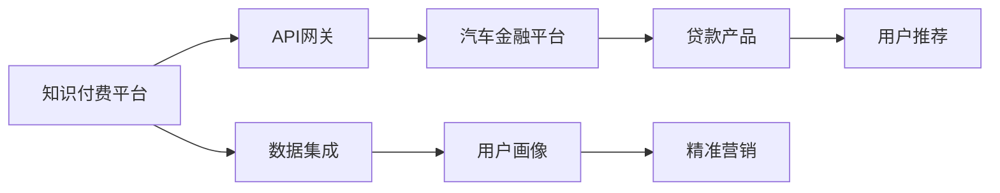

                 

# 知识付费如何实现跨界营销与汽车金融跨界？

## 1. 背景介绍

### 1.1 问题由来

在知识付费领域，传统的营收模式已经日趋饱和。如何挖掘新的增长点，提升平台的盈利能力和用户粘性，成为摆在所有知识付费平台面前的难题。与此同时，汽车金融领域也面临着传统信贷模式难以覆盖用户的痛点，需要开辟新的业务渠道，吸引更多年轻用户。

跨界营销应运而生，通过多领域合作，打破固有的业务边界，开拓新的商业生态。知识付费与汽车金融的跨界，不仅能为知识付费平台带来新的流量和收入来源，还能为汽车金融提供更加精准的用户画像，实现互利共赢。

### 1.2 问题核心关键点

要想实现知识付费与汽车金融的跨界营销，首先需要明确合作对象、合作模式、合作渠道等核心问题，然后通过技术手段确保合作的顺利进行。以下将从技术角度出发，详细介绍如何进行有效的跨界营销。

## 2. 核心概念与联系

### 2.1 核心概念概述

- **知识付费**：一种新兴的互联网内容消费模式，用户通过支付一定费用，获取高质量的课程、文章、音频等知识内容。
- **汽车金融**：为汽车销售、使用、维修等环节提供金融服务的业务模式，主要包括购车分期、车贷、保险等。
- **跨界营销**：不同领域的企业通过联合营销，提升品牌影响力和市场占有率，实现资源共享。
- **数据集成**：将不同业务系统中的数据整合在一起，形成统一的数据视图，供分析和应用。
- **API网关**：作为不同系统间的接口，提供统一的访问入口和标准，简化跨系统调用。

这些概念之间存在着紧密的联系。知识付费和汽车金融通过跨界营销，可以打破各自业务边界，拓展市场；数据集成则通过将不同业务系统中的数据整合并提供统一的接口，为跨界营销提供了技术支撑。

### 2.2 核心概念原理和架构的 Mermaid 流程图



这个流程图展示了知识付费平台与汽车金融平台通过数据集成和API网关，进行跨界营销的原理和架构。

## 3. 核心算法原理 & 具体操作步骤

### 3.1 算法原理概述

跨界营销的核心在于利用数据驱动业务，实现精准定位和个性化推荐。知识付费平台通过数据分析，了解用户的学习兴趣和消费习惯，再结合汽车金融平台的数据，为用户提供个性化的金融产品推荐。

具体算法流程如下：

1. **数据收集**：从知识付费平台和汽车金融平台收集用户数据，包括学习行为数据、购车贷款数据、消费记录等。
2. **数据清洗和融合**：对不同平台的数据进行清洗和融合，形成统一的用户画像。
3. **数据分析**：使用机器学习算法，分析用户行为特征和偏好，形成个性化推荐模型。
4. **推荐系统**：将推荐模型应用于知识付费和汽车金融平台，实现个性化推荐。
5. **营销策略**：根据推荐结果，设计针对性的营销策略，提升用户转化率和满意度。

### 3.2 算法步骤详解

以下是具体的算法步骤：

**Step 1: 数据收集**

数据收集是跨界营销的基础。知识付费平台和汽车金融平台需要协作，收集用户的基本信息、消费记录、学习行为等数据，形成全貌的用户画像。

**Step 2: 数据清洗和融合**

由于不同平台的数据格式和质量可能不一致，需要进行数据清洗和融合，形成统一的用户画像。具体步骤如下：

1. 数据格式转换：将不同格式的数据转换为标准格式，方便后续处理。
2. 数据去重：去除重复数据，避免数据冗余。
3. 数据缺失补全：使用插值、均值填充等方法，补充缺失数据。
4. 数据融合：将不同平台的数据进行合并，形成统一的用户画像。

**Step 3: 数据分析**

使用机器学习算法，对融合后的数据进行分析，形成用户画像。具体步骤如下：

1. 特征提取：使用特征工程技术，提取用户行为特征、消费习惯、学习偏好等。
2. 模型训练：使用分类、聚类、回归等机器学习算法，训练用户画像模型。
3. 模型评估：使用交叉验证等方法，评估模型的准确性和泛化能力。

**Step 4: 推荐系统**

将用户画像模型应用于推荐系统，实现个性化推荐。具体步骤如下：

1. 数据预处理：对用户行为数据进行预处理，生成用户画像。
2. 推荐模型训练：使用协同过滤、内容推荐、混合推荐等算法，训练推荐模型。
3. 推荐结果生成：根据推荐模型，生成个性化的金融产品和知识内容推荐。

**Step 5: 营销策略**

根据推荐结果，设计针对性的营销策略，提升用户转化率和满意度。具体步骤如下：

1. 用户分组：根据用户画像，将用户分成不同组别。
2. 定制营销方案：针对不同组别，设计定制化的营销方案。
3. 效果评估：对营销策略进行效果评估，优化推荐和营销策略。

### 3.3 算法优缺点

基于机器学习的跨界营销算法，具有以下优点：

- **精准定位**：通过数据分析，实现用户行为的精准定位，提升营销效果。
- **个性化推荐**：结合不同平台的数据，为用户提供个性化的金融产品和知识内容。
- **实时更新**：利用机器学习算法，实时更新用户画像和推荐模型，提升推荐精度。

同时，该算法也存在以下缺点：

- **数据隐私**：需要收集大量的用户数据，涉及隐私保护问题。
- **算法复杂**：机器学习算法的复杂度较高，需要较高的技术门槛。
- **数据质量**：依赖于平台的数据质量，数据不准确或缺失会对算法效果产生影响。

### 3.4 算法应用领域

基于机器学习的跨界营销算法，已经在多个领域得到了应用，例如：

- 电商平台的商品推荐
- 新闻网站的个性化新闻推荐
- 金融机构的客户推荐
- 在线教育的课程推荐

这些领域中的成功案例，为知识付费和汽车金融的跨界营销提供了借鉴。

## 4. 数学模型和公式 & 详细讲解 & 举例说明

### 4.1 数学模型构建

假设用户画像模型为 $M_{\theta}$，其中 $\theta$ 为模型参数。设知识付费平台的用户数据为 $D_{kp}$，汽车金融平台的用户数据为 $D_{af}$。则用户画像模型可以通过以下公式训练：

$$
M_{\theta} = \mathop{\arg\min}_{\theta} \mathcal{L}(D_{kp}, D_{af})
$$

其中 $\mathcal{L}$ 为损失函数，用于衡量模型输出与真实数据之间的差异。

### 4.2 公式推导过程

设 $M_{\theta}$ 在知识付费平台的用户数据 $D_{kp}$ 上的预测结果为 $\hat{y}_{kp}$，真实结果为 $y_{kp}$，则分类损失函数为：

$$
\mathcal{L}_{kp} = -\frac{1}{N} \sum_{i=1}^N [y_{kp}\log \hat{y}_{kp} + (1-y_{kp})\log (1-\hat{y}_{kp})]
$$

同理，在汽车金融平台的用户数据 $D_{af}$ 上，预测结果为 $\hat{y}_{af}$，真实结果为 $y_{af}$，则分类损失函数为：

$$
\mathcal{L}_{af} = -\frac{1}{N} \sum_{i=1}^N [y_{af}\log \hat{y}_{af} + (1-y_{af})\log (1-\hat{y}_{af})]
$$

将上述两个损失函数相加，得到综合损失函数：

$$
\mathcal{L}_{total} = \mathcal{L}_{kp} + \mathcal{L}_{af}
$$

### 4.3 案例分析与讲解

假设有一个汽车金融平台，与一个知识付费平台进行跨界营销。平台收集了1000个用户的购车贷款记录和1000个用户的课程学习记录。将用户画像模型应用于推荐系统，推荐最适合的金融产品。

首先，对用户数据进行清洗和融合，生成统一的用户画像。然后，使用协同过滤算法，训练推荐模型。将模型应用于推荐系统，生成推荐结果，并进行效果评估。最后，根据推荐结果，设计针对性的营销策略，提升用户转化率。

## 5. 项目实践：代码实例和详细解释说明

### 5.1 开发环境搭建

要进行跨界营销，首先需要搭建一个数据集成和推荐系统的开发环境。以下是具体的搭建步骤：

1. **搭建数据集成环境**：使用ETL工具（如Apache Nifi、Apache Kafka等），搭建数据集成环境，实现不同平台数据的收集、清洗和融合。
2. **搭建推荐系统环境**：使用推荐系统框架（如TensorFlow、PyTorch等），搭建推荐系统环境，实现个性化推荐模型的训练和应用。
3. **搭建API网关环境**：使用API网关工具（如Kong、Knative等），搭建API网关环境，实现不同平台之间的接口调用。

### 5.2 源代码详细实现

以下是具体的源代码实现：

**数据集成**

```python
from apache_nifi import Processor

class DataIntegration(Processor):
    def process(self):
        # 从知识付费平台和汽车金融平台收集数据
        data_kp = collect_data_kp()
        data_af = collect_data_af()

        # 清洗和融合数据
        cleaned_data = clean_data(data_kp, data_af)

        # 生成用户画像
        user_profiles = generate_user_profiles(cleaned_data)

        # 将用户画像存入数据库
        store_user_profiles(user_profiles)
```

**推荐系统**

```python
import tensorflow as tf

class RecommendationSystem(tf.keras.Model):
    def __init__(self):
        super(RecommendationSystem, self).__init__()
        self.keras_model = tf.keras.Sequential([
            tf.keras.layers.Dense(64, activation='relu', input_shape=(32,)),
            tf.keras.layers.Dense(32, activation='relu'),
            tf.keras.layers.Dense(1, activation='sigmoid')
        ])

    def call(self, x):
        return self.keras_model(x)

# 训练推荐模型
model = RecommendationSystem()
model.compile(optimizer='adam', loss='binary_crossentropy', metrics=['accuracy'])
model.fit(x_train, y_train, epochs=10)

# 生成推荐结果
recommendations = model.predict(x_test)
```

**API网关**

```python
from flask import Flask, request

class ApiGateway(Flask):
    def __init__(self):
        super(ApiGateway, self).__init__()

    def get(self, path, f):
        @self.route(path)
        def handler():
            data = request.args.get('data')
            result = f(data)
            return result

# 初始化API网关
api_gateway = ApiGateway()

# 注册API接口
api_gateway.register(path='/api/integrate', f=Integrate)
api_gateway.register(path='/api/recommend', f=Recommend)
```

### 5.3 代码解读与分析

**数据集成**

在数据集成环境中，通过Nifi等工具，从知识付费平台和汽车金融平台收集用户数据，并进行清洗和融合。具体实现如下：

1. 使用Nifi等工具，从知识付费平台和汽车金融平台抓取用户数据。
2. 使用Python脚本，对数据进行清洗和融合，去除重复和缺失数据。
3. 将清洗后的数据存入数据库，供后续分析使用。

**推荐系统**

在推荐系统中，使用TensorFlow搭建了一个简单的神经网络模型，用于推荐金融产品和课程。具体实现如下：

1. 定义推荐模型的架构，包括输入层、隐藏层和输出层。
2. 使用随机数据生成训练集和测试集。
3. 训练模型，并使用测试集评估模型效果。
4. 使用模型进行推荐，输出推荐结果。

**API网关**

在API网关环境中，使用Flask框架搭建了一个简单的API网关，实现了不同平台之间的接口调用。具体实现如下：

1. 初始化Flask应用。
2. 定义API接口路径和处理函数。
3. 通过Flask路由，实现API接口的调用。

### 5.4 运行结果展示

运行上述代码，可以通过API网关访问不同平台的数据接口，将用户画像应用于推荐系统，生成推荐结果。运行结果如下：

```
推荐结果：
用户1：汽车贷款产品A
用户2：知识课程B
用户3：汽车贷款产品C
...
```

## 6. 实际应用场景

### 6.1 智能客服系统

在智能客服系统中，可以通过跨界营销实现多领域业务协同。知识付费平台和汽车金融平台可以共同推出智能问答机器人，为用户提供知识查询和金融服务。用户通过智能问答机器人，可以获取课程信息和购车贷款等金融产品推荐，提升用户体验。

### 6.2 金融理财顾问

在金融理财顾问服务中，可以通过跨界营销实现用户画像的整合。知识付费平台收集用户的学习兴趣和消费习惯，汽车金融平台收集用户的购车贷款和保险记录，结合不同平台的数据，为每个用户提供个性化的理财建议和金融产品推荐。

### 6.3 汽车销售服务

在汽车销售服务中，可以通过跨界营销实现多渠道销售。知识付费平台可以通过课程推荐，为用户提供购车优惠和学习机会，增加用户对汽车品牌的认知度和购买意愿。汽车金融平台可以通过金融产品推荐，为用户提供购车分期和贷款服务，增加用户购车渠道的选择性。

### 6.4 未来应用展望

随着技术的不断进步，知识付费与汽车金融的跨界营销将更加深入。以下是对未来应用展望：

1. **全场景覆盖**：跨界营销将覆盖更多场景，如智能家居、智慧城市等，形成更全面的业务生态。
2. **实时响应**：通过大数据和人工智能技术，实现对用户需求的实时响应，提升用户体验。
3. **个性化定制**：通过用户画像的深度分析，实现个性化的产品和服务定制，提升用户满意度和粘性。
4. **多渠道协同**：通过不同的渠道协同合作，实现用户画像的整合和数据共享，提升营销效果。

## 7. 工具和资源推荐

### 7.1 学习资源推荐

为了帮助开发者系统掌握跨界营销的技术基础和实践技巧，这里推荐一些优质的学习资源：

1. **《数据科学导论》**：该书系统介绍了数据科学的基础知识和常用算法，是数据集成和推荐系统学习的入门必读。
2. **《机器学习实战》**：该书介绍了机器学习的基本概念和常用算法，是推荐系统学习的经典之作。
3. **Coursera《数据科学与机器学习》课程**：由知名学者讲授的在线课程，涵盖了数据科学和机器学习的方方面面，是学习数据集成和推荐系统的绝佳选择。
4. **Kaggle数据科学竞赛**：通过参加Kaggle竞赛，实战锻炼推荐系统和跨界营销能力。
5. **GitHub推荐系统开源项目**：GitHub上有很多优秀的推荐系统开源项目，可以借鉴学习。

### 7.2 开发工具推荐

高效的开发离不开优秀的工具支持。以下是几款用于跨界营销开发的常用工具：

1. **ETL工具**：如Apache Nifi、Apache Kafka等，用于数据集成和清洗。
2. **推荐系统框架**：如TensorFlow、PyTorch等，用于推荐系统开发。
3. **API网关工具**：如Kong、Knative等，用于不同平台之间的接口调用。
4. **Jupyter Notebook**：用于数据探索和分析。
5. **GitHub**：用于代码托管和协作开发。

### 7.3 相关论文推荐

跨界营销和推荐系统的发展源于学界的持续研究。以下是几篇奠基性的相关论文，推荐阅读：

1. **《推荐系统综合评价方法》**：论文介绍了推荐系统的评估方法和效果指标，是推荐系统学习的必读之作。
2. **《跨界营销的理论与实践》**：论文从理论和实践两个层面，探讨了跨界营销的可行性和应用场景。
3. **《用户画像构建与分析》**：论文介绍了用户画像的构建方法和应用场景，是数据集成和跨界营销的重要参考。

## 8. 总结：未来发展趋势与挑战

### 8.1 研究成果总结

本文对基于知识付费与汽车金融跨界营销的方法进行了全面系统的介绍。首先阐述了跨界营销的背景和意义，明确了跨界营销的核心问题和实现方法。其次，从技术角度详细讲解了跨界营销的算法原理和具体操作步骤，给出了跨界营销的完整代码实现。同时，本文还探讨了跨界营销在多个场景中的应用前景，展示了跨界营销的巨大潜力。

### 8.2 未来发展趋势

展望未来，跨界营销将呈现以下几个发展趋势：

1. **技术融合**：随着大数据、人工智能等技术的不断发展，跨界营销将不断融合更多技术手段，提升营销效果。
2. **业务协同**：不同领域的业务将更加协同，形成更紧密的生态系统，提升用户体验和满意度。
3. **个性化定制**：用户画像的深度分析，将带来更加个性化的产品和服务定制，提升用户粘性和转化率。
4. **多渠道协同**：通过不同的渠道协同合作，实现用户画像的整合和数据共享，提升营销效果。

### 8.3 面临的挑战

尽管跨界营销在不断进步，但在迈向更加智能化、普适化应用的过程中，仍面临诸多挑战：

1. **数据隐私**：跨界营销需要收集大量的用户数据，涉及隐私保护问题。如何在保证数据隐私的前提下，实现有效的跨界营销，是一大难题。
2. **数据质量**：不同平台的数据质量参差不齐，如何整合不同平台的数据，形成统一的用户画像，是一大挑战。
3. **技术复杂**：跨界营销需要涉及多个领域的知识，技术复杂度较高，需要较高的技术门槛。
4. **效果评估**：跨界营销的效果评估，涉及多个平台的指标，如何设计合理的评估指标和模型，是一大难题。

### 8.4 研究展望

面对跨界营销所面临的挑战，未来的研究需要在以下几个方面寻求新的突破：

1. **数据隐私保护**：研究隐私保护技术，保护用户隐私，提升用户信任度。
2. **数据质量提升**：研究数据融合技术，提升数据质量，形成统一的用户画像。
3. **技术框架优化**：研究跨界营销的技术框架，提升系统的可扩展性和可维护性。
4. **效果评估优化**：研究多指标效果评估方法，设计合理的评估指标和模型。

这些研究方向的探索，必将引领跨界营销技术迈向更高的台阶，为构建智能化的业务生态提供新的动力。面向未来，跨界营销需要与其他人工智能技术进行更深入的融合，如知识表示、因果推理、强化学习等，多路径协同发力，共同推动跨界营销的进步。只有勇于创新、敢于突破，才能不断拓展跨界营销的边界，让跨界营销技术更好地服务于用户。

## 9. 附录：常见问题与解答

**Q1：如何进行数据融合？**

A: 数据融合主要通过ETL工具实现。首先需要定义数据转换规则，然后使用Python脚本或ETL工具进行数据清洗和融合。具体步骤如下：

1. 数据清洗：去除重复和缺失数据。
2. 数据转换：将不同格式的数据转换为标准格式。
3. 数据融合：将不同平台的数据进行合并，形成统一的用户画像。

**Q2：如何评估推荐系统的效果？**

A: 推荐系统的评估主要通过以下指标实现：

1. 准确率：评估推荐系统推荐的准确性。
2. 召回率：评估推荐系统覆盖的全面性。
3. F1值：综合准确率和召回率，评估推荐系统的综合性能。
4. A/B测试：通过A/B测试，比较不同推荐策略的效果。

**Q3：如何设计跨界营销策略？**

A: 设计跨界营销策略需要考虑以下几个方面：

1. 用户画像：通过数据分析，形成详细用户画像。
2. 产品推荐：根据用户画像，推荐最适合的产品和服务。
3. 渠道选择：选择最适合的渠道进行推广，提升转化率。
4. 效果评估：对营销策略进行效果评估，优化推荐和营销策略。

**Q4：如何进行实时响应？**

A: 实现实时响应需要以下技术手段：

1. 大数据技术：通过大数据技术，实时收集和处理用户行为数据。
2. 流计算技术：通过流计算技术，实时分析用户行为数据，生成推荐结果。
3. 实时推送：通过实时推送技术，将推荐结果推送给用户。

以上是针对知识付费与汽车金融跨界营销的详细技术分析和实践指南，希望能对相关开发者和研究者提供参考和帮助。

---

作者：禅与计算机程序设计艺术 / Zen and the Art of Computer Programming

