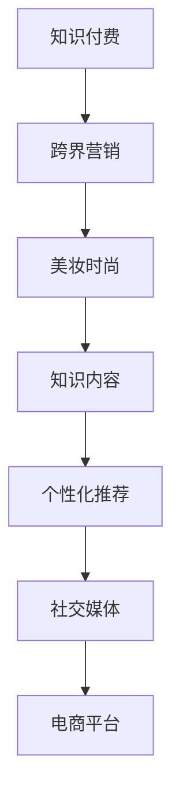

                 

# 知识付费如何实现跨界营销与美妆时尚跨界？

## 1. 背景介绍

### 1.1 知识付费的兴起

随着互联网的迅速发展和普及，人们获取知识的渠道日益多样化。然而，传统的知识获取方式，如阅读书籍、观看视频等，往往存在内容质量参差不齐、学习效率低等问题。知识付费作为一种新兴的商业模式，通过订阅、按需付费等方式，为消费者提供高质量、系统化的知识内容，满足了用户对知识和技能提升的强烈需求。

### 1.2 美妆时尚的崛起

美妆时尚作为快时尚领域的重要分支，近年来的市场增长迅速。消费者对个性化、高品质、快速迭代的美妆产品和时尚资讯的需求不断增加，驱动着美妆时尚行业的快速发展。

## 2. 核心概念与联系

### 2.1 核心概念概述

- **知识付费**：基于订阅或按需付费模式，为消费者提供深度、系统和个性化的知识内容，提升个人素质和技能。
- **跨界营销**：将不同领域的资源和渠道进行融合，通过创新的方式提升品牌影响力和市场份额。
- **美妆时尚跨界**：将知识付费和美妆时尚相结合，为消费者提供美妆时尚领域的深度学习资源和个性化的购物建议。

### 2.2 核心概念原理和架构的 Mermaid 流程图



这个流程图展示了知识付费、跨界营销、美妆时尚之间的关系和互动路径：

1. 知识付费平台作为核心内容提供方，提供多样化的知识内容。
2. 跨界营销作为链接器，将知识付费内容与美妆时尚行业相融合。
3. 美妆时尚产品和服务通过知识内容进行个性化推荐，提高用户粘性和满意度。
4. 社交媒体和电商平台作为传播渠道，将知识内容与美妆时尚产品无缝对接。

## 3. 核心算法原理 & 具体操作步骤

### 3.1 算法原理概述

基于知识付费和美妆时尚的跨界营销，本质上是一个多领域融合的个性化推荐系统。其核心思想是：利用知识付费平台积累的用户数据，结合美妆时尚领域的知识图谱，通过协同过滤、深度学习等技术，为消费者提供个性化的美妆时尚产品推荐和知识内容推送，从而实现品牌影响力的提升和市场份额的增加。

### 3.2 算法步骤详解

**Step 1: 数据准备**

- 收集知识付费平台上的用户行为数据，包括阅读、观看、订阅等行为记录。
- 收集美妆时尚领域的产品和内容信息，如商品描述、用户评价、社交媒体互动等。
- 对数据进行清洗和预处理，确保数据质量和一致性。

**Step 2: 特征提取**

- 从知识付费数据中提取用户兴趣特征，如浏览时长、订阅内容类型等。
- 从美妆时尚数据中提取商品属性特征，如成分、肤质、价格等。
- 使用TF-IDF、Word2Vec等方法对数据进行编码，转换为模型可处理的数值形式。

**Step 3: 构建推荐模型**

- 使用协同过滤算法（如基于用户或基于物品的协同过滤），构建初步推荐模型。
- 结合深度学习模型（如CNN、RNN、GAN等），对推荐结果进行优化和改进。
- 引入跨领域知识图谱，进一步提升推荐模型的泛化能力和精准度。

**Step 4: 模型训练与优化**

- 使用交叉验证和网格搜索等技术，优化模型参数和超参数。
- 对推荐模型进行训练和迭代，使用评分卡、AUC、MSE等指标评估模型性能。
- 根据模型评估结果，进行模型调整和优化。

**Step 5: 实时推荐与反馈**

- 将训练好的推荐模型部署到生产环境，实时进行推荐。
- 对推荐结果进行实时监控和分析，根据用户反馈不断优化推荐策略。
- 结合社交媒体和电商平台的数据，进一步提升推荐准确性和用户满意度。

### 3.3 算法优缺点

**优点**：

- 跨界营销方式新颖，能够提升品牌知名度和市场份额。
- 个性化推荐系统精准，能够满足用户个性化需求。
- 数据来源广泛，能够覆盖更多用户群体。

**缺点**：

- 数据隐私和安全问题突出，需要确保数据处理和存储的合规性。
- 推荐模型复杂，对计算资源和技术能力要求较高。
- 推荐结果易受到数据质量和模型参数的影响。

### 3.4 算法应用领域

基于知识付费和美妆时尚的跨界营销，已经广泛应用于多个领域，如：

- 知识付费平台，提供美妆时尚领域的深度学习资源和购物建议。
- 美妆时尚电商，通过个性化推荐提升用户粘性和销售额。
- 社交媒体平台，将知识付费内容与美妆时尚产品无缝对接。

## 4. 数学模型和公式 & 详细讲解 & 举例说明

### 4.1 数学模型构建

本节将使用数学语言对跨界营销的推荐系统进行更加严格的刻画。

设知识付费平台用户集为 $U$，美妆时尚商品集为 $I$，用户与商品之间的交互矩阵为 $R \in \mathbb{R}^{m \times n}$，其中 $m$ 为用户数，$n$ 为商品数。设用户 $u$ 对商品 $i$ 的评分向量为 $r_{u,i} \in \mathbb{R}^d$，其中 $d$ 为特征维度。则推荐系统的目标是最小化预测评分与真实评分之间的差异，即：

$$
\min_{\theta} \frac{1}{N} \sum_{(u,i) \in U \times I} \ell(\hat{r}_{u,i}, r_{u,i})
$$

其中 $\ell$ 为损失函数，$\hat{r}_{u,i}$ 为模型预测评分。

### 4.2 公式推导过程

以基于用户的协同过滤算法为例，推导推荐模型的基本公式。

设用户 $u$ 对商品 $i$ 的真实评分和预测评分分别为 $r_{u,i}$ 和 $\hat{r}_{u,i}$。基于用户的协同过滤算法中，用户 $u$ 对商品 $i$ 的预测评分由其他用户对商品 $i$ 的评分加权平均得到，即：

$$
\hat{r}_{u,i} = \sum_{j \in U} \alpha_{u,j} \cdot r_{j,i}
$$

其中 $\alpha_{u,j} \in \mathbb{R}^n$ 为用户 $u$ 对用户 $j$ 的相似度向量。用户 $j$ 与用户 $u$ 的相似度 $s_{u,j}$ 定义为：

$$
s_{u,j} = \frac{\sum_{k=1}^d r_{j,k} r_{u,k}}{\sqrt{\sum_{k=1}^d r_{j,k}^2} \sqrt{\sum_{k=1}^d r_{u,k}^2}}
$$

将相似度矩阵 $S \in \mathbb{R}^{m \times n}$ 代入公式，得到：

$$
\hat{r}_{u,i} = \sum_{j=1}^m \frac{\sum_{k=1}^d r_{j,k} r_{u,k}}{\sqrt{\sum_{k=1}^d r_{j,k}^2} \sqrt{\sum_{k=1}^d r_{u,k}^2}} \cdot r_{j,i}
$$

上式即为基于用户的协同过滤算法的推荐公式。通过最大化相似度矩阵 $S$ 中的非零元素，可以得到用户 $u$ 对商品 $i$ 的推荐评分。

### 4.3 案例分析与讲解

以某知识付费平台和美妆时尚电商的合作为例，分析推荐系统的工作流程：

1. **数据收集与处理**：从知识付费平台和美妆时尚电商分别收集用户行为数据和商品信息，进行清洗和预处理。
2. **特征提取**：使用TF-IDF算法对用户行为数据进行编码，使用Word2Vec算法对商品描述进行向量表示。
3. **模型训练**：使用协同过滤算法和深度学习模型进行联合训练，优化模型参数和超参数。
4. **实时推荐**：将训练好的模型部署到推荐系统中，实时进行个性化推荐。
5. **反馈与优化**：根据用户反馈和互动数据，不断优化推荐算法和模型参数，提升推荐效果。

## 5. 项目实践：代码实例和详细解释说明

### 5.1 开发环境搭建

在进行跨界营销推荐系统开发前，需要准备好开发环境。以下是使用Python进行Scikit-learn开发的环境配置流程：

1. 安装Anaconda：从官网下载并安装Anaconda，用于创建独立的Python环境。

2. 创建并激活虚拟环境：
```bash
conda create -n cross-media python=3.8 
conda activate cross-media
```

3. 安装Scikit-learn：
```bash
pip install scikit-learn
```

4. 安装其他工具包：
```bash
pip install pandas numpy joblib sklearn-lda
```

完成上述步骤后，即可在`cross-media`环境中开始推荐系统开发。

### 5.2 源代码详细实现

以下是使用Scikit-learn进行基于用户的协同过滤推荐算法的Python代码实现：

```python
from sklearn.metrics.pairwise import cosine_similarity
from sklearn.feature_extraction.text import TfidfVectorizer
from sklearn.decomposition import TruncatedSVD

# 用户行为数据
users = ['Alice', 'Bob', 'Charlie']
ratings = {'Alice': {'Lipstick': 4, 'Blush': 3, 'Foundation': 5}, 'Bob': {'Lipstick': 3, 'Blush': 5, 'Foundation': 4}, 'Charlie': {'Lipstick': 5, 'Blush': 4, 'Foundation': 3}}

# 商品信息
products = {'Lipstick': {'Color': 'red', 'Brand': 'Lancome'}, 'Blush': {'Color': 'pink', 'Brand': 'NARS'}, 'Foundation': {'Color': 'natural', 'Brand': 'MAC'}}

# 特征提取
tfidf = TfidfVectorizer()
X = tfidf.fit_transform(list(users) + list(products))

# 相似度矩阵
S = cosine_similarity(X)

# 协同过滤算法
svd = TruncatedSVD(n_components=2)
X_reduced = svd.fit_transform(S)

# 推荐商品
def recommend(user, top_n=3):
    user_index = users.index(user)
    product_indices = X_reduced[user_index].argsort()[:-top_n]
    products = [products[p] for p in product_indices]
    return products

# 测试推荐结果
print(recommend('Alice'))
```

上述代码展示了基于用户相似度的协同过滤算法的实现过程。通过使用TF-IDF算法和Cosine相似度计算，可以构建用户-商品相似度矩阵，并使用SVD算法对相似度矩阵进行降维处理，得到用户-商品评分矩阵。根据评分矩阵，可以推荐用户可能感兴趣的商品。

### 5.3 代码解读与分析

让我们再详细解读一下关键代码的实现细节：

**TF-IDF算法**：
- `TfidfVectorizer` 类用于将文本数据转换为TF-IDF特征矩阵。在代码中，我们首先将用户和商品名称转换为文本形式，然后通过TF-IDF算法计算文本向量，得到用户行为数据的数值特征。

**相似度矩阵**：
- 使用 `cosine_similarity` 函数计算用户行为数据矩阵和商品信息矩阵的余弦相似度，得到用户-商品相似度矩阵 `S`。相似度矩阵中的每个元素表示用户对商品的态度或兴趣程度。

**协同过滤算法**：
- 使用 `TruncatedSVD` 类对相似度矩阵进行降维处理，得到用户-商品评分矩阵 `X_reduced`。降维后的评分矩阵可以用于推荐计算。

**推荐函数**：
- `recommend` 函数根据用户行为数据和评分矩阵，推荐用户可能感兴趣的商品。通过计算用户-商品相似度矩阵的行向量和产品向量，得到推荐结果。

**测试推荐结果**：
- 在代码最后，我们调用 `recommend` 函数，传入用户名称，得到推荐商品列表，并输出结果。

## 6. 实际应用场景

### 6.1 智能客服

基于知识付费和美妆时尚的跨界营销，智能客服系统可以提供更加个性化和针对性的服务。智能客服系统通过分析用户的浏览记录和购买行为，结合美妆时尚领域的知识图谱，推荐个性化的美妆商品和时尚资讯。例如，用户查询某品牌口红时，智能客服可以推荐相关品牌的其他产品，并提供口红的色号推荐、成分信息等知识内容。

### 6.2 品牌推广

跨界营销可以将知识付费与美妆时尚相结合，通过推荐系统为品牌推广提供精准的用户画像和市场分析。例如，美妆品牌可以联合知识付费平台，推荐用户关注与品牌相关的课程，提高品牌知名度和用户忠诚度。

### 6.3 内容创作

基于知识付费和美妆时尚的跨界营销，内容创作者可以整合美妆时尚领域的知识资源，创作更多符合用户兴趣和需求的内容。例如，美妆博主可以与知识付费平台合作，推荐相关课程，并与读者进行互动，提升自身影响力。

## 7. 工具和资源推荐

### 7.1 学习资源推荐

为了帮助开发者系统掌握跨界营销和美妆时尚跨界技术，这里推荐一些优质的学习资源：

1. 《推荐系统实战》系列博文：由知名推荐系统专家撰写，深入浅出地介绍了推荐系统的工作原理和实现方法。

2. 《推荐系统算法与应用》课程：腾讯课堂开设的推荐系统课程，涵盖协同过滤、深度学习、知识图谱等多个方面。

3. 《深度学习与推荐系统》书籍：清华大学出版社出版的推荐系统经典书籍，系统介绍了推荐系统的理论基础和实践技巧。

4. 推荐系统开源项目：如TensorFlow、PyTorch等框架提供的推荐系统样例，可以用于学习和研究推荐系统技术。

5. Kaggle推荐系统竞赛：通过参与Kaggle推荐系统竞赛，可以学习到最新的推荐系统技术和实践经验。

通过对这些资源的学习实践，相信你一定能够快速掌握跨界营销和美妆时尚跨界技术的精髓，并用于解决实际的推荐问题。

### 7.2 开发工具推荐

高效的开发离不开优秀的工具支持。以下是几款用于跨界营销和美妆时尚跨界推荐的常用工具：

1. Scikit-learn：基于Python的机器学习库，提供了协同过滤、深度学习等多种推荐算法，易于使用。

2. TensorFlow：由Google主导开发的深度学习框架，支持大规模分布式计算，适合复杂推荐模型的开发。

3. PyTorch：基于Python的深度学习框架，支持动态计算图，适合快速迭代研究。

4. Apache Spark：大数据处理框架，可以处理大规模推荐系统的数据处理和训练任务。

5. Jupyter Notebook：交互式开发环境，支持Python和其他语言的多维度开发。

6. Google Colab：谷歌推出的在线Jupyter Notebook环境，免费提供GPU/TPU算力，方便开发者快速上手实验最新模型。

合理利用这些工具，可以显著提升跨界营销和美妆时尚跨界推荐的开发效率，加快创新迭代的步伐。

### 7.3 相关论文推荐

跨界营销和美妆时尚跨界技术的发展源于学界的持续研究。以下是几篇奠基性的相关论文，推荐阅读：

1. 《推荐系统》：由 Recommender Systems专家编写的经典书籍，系统介绍了推荐系统的理论基础和实际应用。

2. 《协同过滤推荐系统》：介绍协同过滤推荐算法及其优化方法，适用于小规模推荐系统。

3. 《深度学习在推荐系统中的应用》：介绍深度学习算法在推荐系统中的应用，如CNN、RNN、GAN等。

4. 《基于知识图谱的推荐系统》：介绍知识图谱在推荐系统中的应用，如链接预测、节点嵌入等技术。

这些论文代表了大数据推荐系统的发展脉络。通过学习这些前沿成果，可以帮助研究者把握学科前进方向，激发更多的创新灵感。

## 8. 总结：未来发展趋势与挑战

### 8.1 总结

本文对基于知识付费和美妆时尚的跨界营销技术进行了全面系统的介绍。首先阐述了知识付费和美妆时尚的兴起背景，明确了跨界营销在拓展市场和提升品牌价值方面的独特优势。其次，从原理到实践，详细讲解了跨界营销的数学模型和算法步骤，给出了跨界营销推荐系统的完整代码实例。同时，本文还广泛探讨了跨界营销在智能客服、品牌推广、内容创作等多个行业领域的应用前景，展示了跨界营销范式的巨大潜力。

通过本文的系统梳理，可以看到，基于知识付费和美妆时尚的跨界营销技术，已经实现了深度学习和推荐系统的有机结合，为NLP技术在跨领域应用中提供了全新的思路。未来，伴随预训练语言模型和微调方法的不断进步，相信跨界营销技术也将不断拓展其应用范围，为各行各业带来创新性的变革。

### 8.2 未来发展趋势

展望未来，跨界营销和美妆时尚跨界技术将呈现以下几个发展趋势：

1. 推荐系统智能化程度提升。随着深度学习算法的不断优化，推荐系统的智能化程度将进一步提高，能够更好地理解用户需求和行为，提供更加精准的推荐结果。

2. 推荐系统多样性增强。推荐系统将从单一的协同过滤和深度学习算法，拓展到更多样化的推荐方法，如基于规则的推荐、基于图神经网络的推荐等。

3. 推荐系统跨领域融合。跨界营销将成为更多行业的通用技术，推荐系统将与更多领域进行融合，如医疗、教育、金融等，提供跨领域的个性化推荐服务。

4. 推荐系统实时性提升。推荐系统将实现实时推荐，能够快速响应用户行为变化，提升用户体验和满意度。

5. 推荐系统安全性保障。推荐系统将引入更多安全保障机制，防止数据泄露和模型滥用，确保用户隐私和数据安全。

6. 推荐系统可解释性增强。推荐系统将提供更多的可解释性分析，帮助用户理解推荐结果的生成机制，提升用户信任度和满意度。

以上趋势凸显了跨界营销技术的广阔前景。这些方向的探索发展，必将进一步提升跨界营销系统的性能和应用范围，为各行各业带来更多的创新和机遇。

### 8.3 面临的挑战

尽管跨界营销和美妆时尚跨界技术已经取得了瞩目成就，但在迈向更加智能化、普适化应用的过程中，它仍面临着诸多挑战：

1. 数据隐私和安全问题。跨界营销涉及多领域数据的融合，数据隐私和安全问题尤为突出。如何保护用户数据隐私，确保数据处理和存储的合规性，是跨界营销技术发展的重要瓶颈。

2. 推荐模型复杂性增加。随着推荐系统的智能化程度提升，模型结构和训练复杂度也将不断增加，对计算资源和技术能力提出更高的要求。

3. 推荐结果多样性不足。推荐系统单一的协同过滤和深度学习算法，容易导致推荐结果的多样性不足，难以满足用户的多样化需求。

4. 推荐系统实时性有待提升。推荐系统实现实时推荐需要克服技术挑战，如数据存储、计算加速等，需要进一步优化和改进。

5. 推荐系统可解释性不足。推荐系统缺乏可解释性分析，用户难以理解推荐结果的生成机制，难以获得信任和认可。

6. 推荐系统跨领域融合难度大。跨界营销涉及多个领域的深度融合，需要突破技术和认知的限制，才能实现真正意义上的跨界应用。

正视跨界营销和美妆时尚跨界技术面临的这些挑战，积极应对并寻求突破，将是大数据推荐系统走向成熟的必由之路。相信随着学界和产业界的共同努力，这些挑战终将一一被克服，跨界营销技术必将在构建人机协同的智能时代中扮演越来越重要的角色。

### 8.4 研究展望

面向未来，跨界营销和美妆时尚跨界技术的研究需要在以下几个方面寻求新的突破：

1. 探索无监督和半监督推荐方法。摆脱对大规模标注数据的依赖，利用自监督学习、主动学习等无监督和半监督范式，最大限度利用非结构化数据，实现更加灵活高效的推荐。

2. 研究参数高效和计算高效的推荐范式。开发更加参数高效的推荐方法，在固定大部分推荐参数的同时，只更新极少量的任务相关参数。同时优化推荐模型的计算图，减少前向传播和反向传播的资源消耗，实现更加轻量级、实时性的部署。

3. 融合因果和对比学习范式。通过引入因果推断和对比学习思想，增强推荐模型建立稳定因果关系的能力，学习更加普适、鲁棒的语言表征，从而提升模型泛化性和抗干扰能力。

4. 引入更多先验知识。将符号化的先验知识，如知识图谱、逻辑规则等，与神经网络模型进行巧妙融合，引导推荐过程学习更准确、合理的知识图谱。同时加强不同模态数据的整合，实现视觉、语音等多模态信息与文本信息的协同建模。

5. 结合因果分析和博弈论工具。将因果分析方法引入推荐模型，识别出推荐决策的关键特征，增强输出解释的因果性和逻辑性。借助博弈论工具刻画人机交互过程，主动探索并规避推荐系统的脆弱点，提高系统稳定性。

6. 纳入伦理道德约束。在推荐模型训练目标中引入伦理导向的评估指标，过滤和惩罚有偏见、有害的输出倾向。同时加强人工干预和审核，建立推荐行为的监管机制，确保推荐结果符合人类价值观和伦理道德。

这些研究方向的探索，必将引领跨界营销和美妆时尚跨界技术迈向更高的台阶，为构建安全、可靠、可解释、可控的智能系统铺平道路。面向未来，跨界营销技术还需要与其他人工智能技术进行更深入的融合，如知识表示、因果推理、强化学习等，多路径协同发力，共同推动自然语言理解和智能交互系统的进步。只有勇于创新、敢于突破，才能不断拓展推荐系统的边界，让智能技术更好地造福人类社会。

## 9. 附录：常见问题与解答

**Q1: 如何平衡推荐系统的个性化和多样性？**

A: 推荐系统需要同时考虑个性化和多样性。个性化推荐可以提升用户体验和满意度，但容易导致推荐结果的过拟合。多样性推荐可以避免用户陷入信息茧房，但难以满足用户的个性化需求。可以通过调整推荐算法参数，如设置多样性惩罚系数、引入噪声等方法，平衡个性化和多样性的关系。

**Q2: 推荐系统如何处理数据偏差问题？**

A: 数据偏差是推荐系统面临的主要问题之一。可以通过数据清洗、特征处理、异常检测等方法，减少数据偏差的影响。同时，引入多目标优化方法，将个性化和多样性目标结合起来，提高推荐系统的公平性和鲁棒性。

**Q3: 推荐系统如何提高实时性？**

A: 推荐系统实时性是用户满意度的重要指标。可以通过优化数据存储和处理、使用分布式计算、提高模型训练和推理效率等方法，提高推荐系统的实时性。同时，引入在线学习算法，可以动态调整模型参数，实时更新推荐结果。

**Q4: 推荐系统如何保障数据隐私和安全？**

A: 数据隐私和安全是跨界营销中必须关注的问题。可以通过数据匿名化、加密处理、访问控制等方法，保障数据隐私和安全。同时，引入联邦学习、差分隐私等技术，可以在保护用户隐私的前提下，进行数据共享和合作。

**Q5: 推荐系统如何提高可解释性？**

A: 推荐系统可解释性是提升用户信任度和满意度的重要因素。可以通过可视化推荐过程、提供推荐理由等方法，提高推荐系统的可解释性。同时，引入因果推断方法，可以深入分析推荐结果的生成机制，提供更有意义的解释。

---

作者：禅与计算机程序设计艺术 / Zen and the Art of Computer Programming

