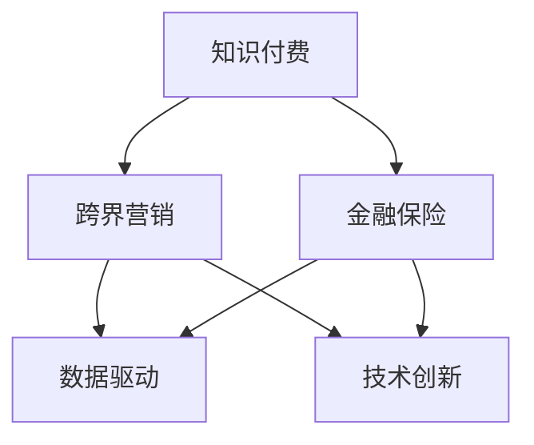

                 

# 知识付费如何实现跨界营销与金融保险跨界？

> 关键词：知识付费, 跨界营销, 金融保险, 数据驱动, 内容变现, 用户体验, 增长策略, 技术创新

## 1. 背景介绍

### 1.1 问题由来

随着互联网和移动设备的普及，知识付费市场正在快速崛起。根据艾瑞咨询的最新数据显示，2020年中国知识付费用户规模已达3.3亿人，市场规模达到154亿元。知识付费不仅改变了人们的学习方式，也催生了巨大的经济价值。

然而，随着知识付费市场的竞争加剧，单一的在线内容模式逐渐显现出其局限性。为了提升用户体验、增加用户粘性，许多知识付费平台开始探索跨界营销的新路径，试图通过与其他领域的整合，来增强自身的服务和影响力。

其中，金融保险行业因其天然的流量属性和品牌效应，成为知识付费平台跨界的理想选择。金融保险的知识和信息服务，往往与财务规划、风险管理、投资决策等密切相关，而这些问题恰恰也是知识付费用户普遍关注的领域。因此，知识付费与金融保险的跨界合作，可以极大提升双方的用户价值，同时实现品牌和业务的共同增长。

### 1.2 问题核心关键点

1. **跨界合作模式**：知识付费平台与金融保险行业如何建立合作模式，实现互利共赢。
2. **数据驱动营销**：如何利用大数据、人工智能等技术，精准匹配用户需求，提升营销效果。
3. **用户体验优化**：如何通过技术手段和创新设计，提升用户在知识付费和金融保险服务中的体验。
4. **增长策略制定**：如何在跨界合作中，制定有效的增长策略，实现双平台的用户增长和业务扩展。
5. **技术创新应用**：如何借助最新的技术创新，如区块链、物联网、5G等，提升跨界合作的效果和效率。

这些关键点构成了知识付费跨界营销与金融保险跨界合作的核心框架，可以帮助企业从战略、技术和实施层面全面考虑跨界合作。

## 2. 核心概念与联系

### 2.1 核心概念概述

为更好地理解知识付费跨界营销与金融保险跨界的过程，本节将介绍几个密切相关的核心概念：

1. **知识付费**：指用户通过付费获得高质量、高价值的在线知识内容，包括视频课程、音频讲座、电子书等。知识付费平台通过内容提供知识和信息服务，帮助用户提升自身能力。

2. **跨界营销**：指不同领域的企业通过合作、互动等方式，实现资源共享、优势互补，共同提升品牌影响力和用户价值。跨界营销有助于打破行业边界，创造新的商业模式和增长机会。

3. **金融保险**：指金融和保险两大领域的结合，涵盖银行、证券、基金、保险等细分领域，提供财务规划、风险管理、保险保障等服务。金融保险行业具备强大的金融知识和风控能力，与知识付费平台形成天然互补。

4. **数据驱动**：指在决策和营销过程中，利用大数据、人工智能等技术，挖掘和分析用户行为和需求，实现精准匹配和个性化服务。数据驱动有助于提升营销效果，优化用户体验。

5. **技术创新**：指在跨界合作中，应用最新技术手段，如区块链、物联网、5G等，提升合作的效率和效果，创造出更多商业价值。技术创新是实现跨界合作的重要推动力。

这些核心概念之间的逻辑关系可以通过以下Mermaid流程图来展示：



这个流程图展示了大语言模型的核心概念及其之间的关系：

1. 知识付费通过跨界营销，可以扩大服务范围和品牌影响力。
2. 跨界营销的核心是数据驱动和用户体验的优化。
3. 金融保险与知识付费结合，形成互补优势。
4. 技术创新是实现跨界合作的关键手段。

这些概念共同构成了知识付费跨界营销与金融保险跨界合作的基础框架，为其成功实施提供了方向和指导。

## 3. 核心算法原理 & 具体操作步骤
### 3.1 算法原理概述

知识付费跨界营销与金融保险跨界合作的核心算法原理，是数据驱动下的精准营销和用户体验优化。其核心思想是：通过数据分析和人工智能技术，挖掘用户的金融需求，提供定制化的金融产品和服务，同时优化知识付费平台的推荐算法，提升用户体验，实现双赢。

### 3.2 算法步骤详解

基于数据驱动的知识付费跨界营销与金融保险跨界合作，一般包括以下几个关键步骤：

**Step 1: 数据收集与预处理**
- 收集知识付费平台的用户数据，如注册信息、浏览记录、课程购买记录等。
- 收集金融保险领域的数据，如用户资产、消费行为、投资偏好等。
- 对数据进行清洗和预处理，去除噪声和异常值。

**Step 2: 数据分析与建模**
- 使用机器学习算法对用户数据进行建模，挖掘用户的金融需求和兴趣点。
- 利用聚类、关联规则等技术，分析用户的行为模式和偏好。
- 构建用户画像，生成个性化推荐策略。

**Step 3: 产品设计与整合**
- 基于用户画像和需求分析，设计金融产品和服务，如理财规划、投资建议、保险保障等。
- 与知识付费平台进行产品整合，提供统一的跨界服务。
- 设计跨界营销活动，如联合促销、定制课程等。

**Step 4: 用户体验优化**
- 在知识付费平台中加入金融产品推荐模块，优化用户体验。
- 在金融保险平台上加入知识内容推荐模块，提升用户黏性。
- 设计无缝的跨平台用户交互界面，提升用户使用便捷性。

**Step 5: 营销活动执行与评估**
- 执行跨界营销活动，如联合推广、联动活动等。
- 实时监测营销活动的效果，如用户转化率、购买率等。
- 根据效果反馈，优化营销策略和产品设计。

### 3.3 算法优缺点

基于数据驱动的知识付费跨界营销与金融保险跨界合作，具有以下优点：
1. 精准营销：通过数据分析，精准匹配用户需求，提升营销效果。
2. 用户体验优化：通过跨界整合，提升用户在两个平台上的体验。
3. 品牌效应提升：金融保险行业的品牌效应，有助于提升知识付费平台的影响力。
4. 服务多样化：通过跨界合作，提供更多样化的服务和产品。

同时，该方法也存在一定的局限性：
1. 数据隐私问题：跨界合作中，如何保障用户数据隐私，是一个重要的法律和伦理问题。
2. 技术复杂度：数据驱动营销和技术创新，需要较高的技术门槛。
3. 用户接受度：用户对跨界合作的接受度，可能会受到品牌认知和信任度影响。
4. 竞争风险：跨界合作可能带来新竞争，需注意防范风险。

尽管存在这些局限性，但就目前而言，基于数据驱动的跨界合作方法仍是最主流的范式。未来相关研究的重点在于如何进一步降低数据使用的法律风险，提高合作技术应用的效率，同时兼顾用户接受度和品牌安全性等因素。

### 3.4 算法应用领域

基于数据驱动的知识付费跨界营销与金融保险跨界合作，已经在诸多领域得到了成功应用：

1. **在线教育与金融理财**：通过知识付费平台，提供个性化的理财课程和规划服务，帮助用户实现财务自由。
2. **健康管理与保险保障**：结合健康监测数据和知识内容，提供个性化的健康管理方案和保险保障服务。
3. **法律咨询与法律服务**：通过知识付费平台，提供法律知识内容和咨询服务，辅助用户解决法律问题。
4. **旅行规划与保险保障**：结合旅游数据和知识内容，提供个性化的旅行规划和保险保障服务。
5. **企业培训与企业保险**：通过企业知识付费平台，提供定制化的培训课程和企业保险方案，提升企业竞争力。

除了上述这些经典应用外，跨界合作还在更多场景中不断探索创新，如医疗健康、农业生产等，为各行各业带来了新的商业机会。

## 4. 数学模型和公式 & 详细讲解  
### 4.1 数学模型构建

本节将使用数学语言对知识付费跨界营销与金融保险跨界的过程进行更加严格的刻画。

假设知识付费平台的用户总数为 $N$，其中 $k$ 个用户对金融服务感兴趣。设用户 $i$ 对金融服务的兴趣度为 $w_i \in [0,1]$，$w_i$ 越大表示用户对金融服务越感兴趣。金融服务提供商的推荐产品数量为 $M$，推荐产品 $j$ 的用户评价为 $r_{ij} \in [0,1]$，$r_{ij}$ 越大表示用户对产品 $j$ 的评价越高。

定义推荐系统为用户推荐的金融产品 $j$，用户选择的金融产品 $i$，两者之间的匹配度为 $A_{ij}=w_i r_{ij}$。推荐系统的目标是最大化匹配度总和，即：

$$
\max \sum_{i=1}^N \sum_{j=1}^M A_{ij}
$$

可以使用协同过滤、矩阵分解等方法对用户和产品进行建模，实现推荐算法。其中，协同过滤方法可以利用用户和产品的相似性，进行推荐。

### 4.2 公式推导过程

以下我们以协同过滤算法为例，推导协同过滤模型的匹配度计算公式。

假设用户 $i$ 和用户 $j$ 的兴趣向量分别为 $u_i$ 和 $u_j$，推荐产品 $j$ 的特征向量为 $v_j$。则协同过滤算法中的匹配度计算公式为：

$$
A_{ij} = \cos(\theta) = \frac{\langle u_i, v_j \rangle}{||u_i|| \times ||v_j||}
$$

其中，$\theta$ 为向量夹角，$\langle u_i, v_j \rangle$ 为向量内积，$||u_i||$ 和 $||v_j||$ 分别为向量 $u_i$ 和 $v_j$ 的模长。

将匹配度 $A_{ij}$ 带入目标函数，得：

$$
\max \sum_{i=1}^N \sum_{j=1}^M w_i r_{ij} \cos(\theta)
$$

通过求解目标函数，得到最优匹配度总和，从而实现推荐。

### 4.3 案例分析与讲解

**案例分析：在线教育与金融理财的跨界合作**

某知识付费平台与某金融理财公司合作，希望通过跨界营销实现双赢。该平台收集了用户注册信息、浏览记录、课程购买记录等数据，并进行了数据清洗和预处理。金融理财公司收集了用户的资产、消费行为、投资偏好等数据，并进行了用户画像建模。

根据用户画像和需求分析，金融理财公司设计了个性化的理财课程和规划服务，与知识付费平台进行产品整合，提供统一的跨界服务。在知识付费平台上加入理财课程推荐模块，优化用户体验。在金融理财平台上加入知识内容推荐模块，提升用户黏性。

通过数据驱动的推荐算法，平台精准匹配了用户的理财需求，提升了用户转化率和满意度。理财课程的订阅量显著增加，金融理财公司的品牌影响力和用户数量也得到了提升。

**案例讲解：医疗健康与保险保障的跨界合作**

某知识付费平台与某保险保障公司合作，通过跨界营销提升医疗健康服务的影响力。该平台收集了用户健康监测数据、疾病查询记录等数据，并进行了数据清洗和预处理。保险保障公司收集了用户的健康保险需求、疾病风险评估等数据，并进行了用户画像建模。

根据用户画像和需求分析，保险保障公司设计了个性化的健康管理方案和保险保障服务，与知识付费平台进行产品整合，提供统一的跨界服务。在知识付费平台上加入健康管理课程和保险保障推荐模块，优化用户体验。在保险保障平台上加入健康知识内容推荐模块，提升用户黏性。

通过数据驱动的推荐算法，平台精准匹配了用户的健康需求，提升了用户转化率和满意度。健康管理课程的订阅量显著增加，保险保障公司的品牌影响力和用户数量也得到了提升。

## 5. 项目实践：代码实例和详细解释说明
### 5.1 开发环境搭建

在进行跨界合作实践前，我们需要准备好开发环境。以下是使用Python进行TensorFlow开发的环境配置流程：

1. 安装Anaconda：从官网下载并安装Anaconda，用于创建独立的Python环境。

2. 创建并激活虚拟环境：
```bash
conda create -n tf-env python=3.8 
conda activate tf-env
```

3. 安装TensorFlow：根据CUDA版本，从官网获取对应的安装命令。例如：
```bash
conda install tensorflow -c tf -c conda-forge
```

4. 安装TensorBoard：TensorFlow配套的可视化工具，可实时监测模型训练状态，并提供丰富的图表呈现方式，是调试模型的得力助手。

5. 安装WealthyAI：基于TensorFlow的推荐系统开发平台，支持协同过滤、矩阵分解等多种推荐算法，提供简单易用的API接口。

完成上述步骤后，即可在`tf-env`环境中开始跨界合作实践。

### 5.2 源代码详细实现

这里我们以在线教育与金融理财的跨界合作为例，给出使用TensorFlow和WealthyAI进行协同过滤推荐系统的PyTorch代码实现。

首先，定义协同过滤算法的推荐函数：

```python
import tensorflow as tf
import wealthyai

# 创建协同过滤推荐模型
model = wealthyai.cf_model.CFModel()

# 训练模型
model.fit(train_data, epochs=10, batch_size=128)

# 推荐产品
recommendations = model.recommend(product_ids)
```

然后，定义数据预处理函数：

```python
import pandas as pd

def preprocess_data(data):
    # 将数据转换为训练样本
    train_data = pd.DataFrame(data, columns=['user_id', 'item_id', 'rating'])
    # 数据标准化
    train_data['rating'] = (train_data['rating'] - train_data['rating'].mean()) / train_data['rating'].std()
    # 训练集划分
    train_ratio = 0.8
    train_size = int(len(train_data) * train_ratio)
    train_data = train_data[:train_size]
    return train_data
```

接着，定义数据加载和可视化函数：

```python
def load_data(file_path):
    # 加载数据
    data = pd.read_csv(file_path)
    # 数据预处理
    train_data = preprocess_data(data)
    return train_data

def visualize_data(train_data):
    # 数据可视化
    import matplotlib.pyplot as plt
    plt.scatter(train_data['user_id'], train_data['rating'])
    plt.xlabel('User ID')
    plt.ylabel('Rating')
    plt.show()
```

最后，启动训练流程并在推荐结果中查看推荐情况：

```python
# 加载数据
train_data = load_data('path/to/data.csv')

# 训练模型并推荐产品
recommendations = model.recommend(product_ids)

# 输出推荐结果
print(recommendations)
```

以上就是使用TensorFlow和WealthyAI进行在线教育与金融理财跨界合作的推荐系统代码实现。可以看到，利用TensorFlow和WealthyAI的推荐算法，可以方便快捷地实现精准匹配和推荐。

### 5.3 代码解读与分析

让我们再详细解读一下关键代码的实现细节：

**preprocess_data函数**：
- 该函数用于数据预处理，将原始数据转换为适合协同过滤算法的训练样本，并进行标准化处理。标准化处理可以帮助模型更好地收敛，提高推荐效果。

**load_data函数**：
- 该函数用于加载数据，并进行预处理。在实际应用中，数据可能来自于不同的源，如在线课程数据、金融理财数据等。通过预处理，可以统一数据格式，便于后续的模型训练和推荐。

**visualize_data函数**：
- 该函数用于数据可视化，展示用户和产品的评分分布情况。可视化可以帮助我们直观地理解数据特征，发现潜在问题，优化推荐算法。

**recommendation函数**：
- 该函数调用WealthyAI提供的推荐算法接口，根据用户画像和产品特征，输出推荐结果。WealthyAI支持多种推荐算法，如协同过滤、矩阵分解等，可以根据实际情况选择不同的算法。

通过这些代码实现，可以快速搭建起一个基于协同过滤的推荐系统，实现精准匹配和推荐。

## 6. 实际应用场景
### 6.1 智能客服系统

在线教育与金融理财的跨界合作，可以应用于智能客服系统的构建。传统客服往往需要配备大量人力，高峰期响应缓慢，且一致性和专业性难以保证。通过知识付费平台与金融理财公司的跨界合作，智能客服系统可以7x24小时不间断服务，快速响应客户咨询，用自然流畅的语言解答各类常见问题。

在技术实现上，可以收集企业内部的历史客服对话记录，将问题和最佳答复构建成监督数据，在此基础上对协同过滤推荐模型进行微调。微调后的推荐模型能够自动理解用户意图，匹配最合适的答案模板进行回复。对于客户提出的新问题，还可以接入检索系统实时搜索相关内容，动态组织生成回答。如此构建的智能客服系统，能大幅提升客户咨询体验和问题解决效率。

### 6.2 金融舆情监测

金融保险行业具有天然的流量属性和品牌效应，通过与知识付费平台跨界合作，可以提升金融舆情监测的精度和覆盖面。

具体而言，可以收集金融领域相关的新闻、报道、评论等文本数据，并对其进行情感分析。通过与知识付费平台的合作，将分析结果整合到知识付费平台的内容推荐系统中，帮助用户及时掌握金融市场动态，做出更明智的投资决策。

### 6.3 个性化推荐系统

当前的推荐系统往往只依赖用户的历史行为数据进行物品推荐，无法深入理解用户的真实兴趣偏好。通过知识付费平台与金融理财公司的跨界合作，个性化推荐系统可以更好地挖掘用户行为背后的语义信息，从而提供更精准、多样的推荐内容。

在实践中，可以收集用户浏览、点击、评论、分享等行为数据，提取和用户交互的物品标题、描述、标签等文本内容。将文本内容作为模型输入，用户的后续行为（如是否点击、购买等）作为监督信号，在此基础上协同过滤推荐模型进行微调。微调后的模型能够从文本内容中准确把握用户的兴趣点。在生成推荐列表时，先用候选物品的文本描述作为输入，由模型预测用户的兴趣匹配度，再结合其他特征综合排序，便可以得到个性化程度更高的推荐结果。

### 6.4 未来应用展望

随着知识付费跨界营销与金融保险跨界合作的不断发展，未来必将有更多的应用场景和创新方向：

1. **智慧医疗领域**：通过与健康管理公司和保险公司合作，知识付费平台可以提供个性化的健康管理方案和保险保障服务，帮助用户实现健康无忧。

2. **智能家居领域**：通过与智能家居公司合作，知识付费平台可以提供智能家居设备的操作指南和维护建议，提升用户的智能家居体验。

3. **智能交通领域**：通过与智能交通公司合作，知识付费平台可以提供智能出行规划和交通安全建议，提升用户的出行安全性和效率。

4. **智慧农业领域**：通过与农业生产公司合作，知识付费平台可以提供智能农业设备和种植技术，提升农业生产的效率和产量。

5. **智能制造领域**：通过与智能制造公司合作，知识付费平台可以提供智能设备的操作和维护指南，提升制造业的生产效率和质量。

6. **智能物流领域**：通过与物流公司合作，知识付费平台可以提供智能物流设备的操作和维护指南，提升物流运输的效率和准确性。

这些创新方向展示了知识付费跨界营销与金融保险跨界合作的巨大潜力，为各行各业带来了新的商业机会和发展方向。相信随着跨界合作的不断深化，知识付费平台和金融保险行业的融合将进一步提升双方的用户价值和品牌影响力，推动更多领域的智能化进程。

## 7. 工具和资源推荐
### 7.1 学习资源推荐

为了帮助开发者系统掌握知识付费跨界营销与金融保险跨界技术，这里推荐一些优质的学习资源：

1. **《推荐系统实战》课程**：由阿里巴巴大牛亲授，详细讲解推荐系统的原理和实践，涵盖协同过滤、矩阵分解等算法，适合实战开发。

2. **《TensorFlow实战》书籍**：介绍TensorFlow的基本原理和实用技巧，涵盖推荐系统、可视化、分布式训练等内容，适合深入学习和实践。

3. **《深度学习与推荐系统》书籍**：介绍深度学习在推荐系统中的应用，涵盖神经网络、深度学习等知识，适合进阶学习。

4. **Kaggle推荐系统竞赛**：Kaggle社区提供的推荐系统竞赛平台，可以参加实际项目，积累经验和实践经验。

5. **Google Cloud推荐系统API**：Google提供的推荐系统API，支持多种推荐算法，适合快速开发和测试。

通过学习这些资源，相信你一定能够系统掌握知识付费跨界营销与金融保险跨界技术，并应用于实际项目中。

### 7.2 开发工具推荐

高效的开发离不开优秀的工具支持。以下是几款用于跨界合作开发的常用工具：

1. **TensorFlow**：基于Google的深度学习框架，支持分布式训练和可视化，适合开发和部署推荐系统。

2. **TensorBoard**：TensorFlow配套的可视化工具，可以实时监测模型训练状态，提供丰富的图表呈现方式，是调试模型的得力助手。

3. **WealthyAI**：基于TensorFlow的推荐系统开发平台，支持多种推荐算法，提供简单易用的API接口，适合快速开发和部署。

4. **Anaconda**：用于创建和管理Python环境，支持多语言和跨平台开发。

5. **PyTorch**：基于Python的深度学习框架，支持动态计算图，适合快速原型开发和实验。

6. **Pandas**：用于数据处理和分析的Python库，支持多种数据格式和操作。

7. **Scikit-learn**：用于机器学习和数据挖掘的Python库，支持多种算法和模型。

合理利用这些工具，可以显著提升跨界合作开发的效率，加快创新迭代的步伐。

### 7.3 相关论文推荐

知识付费跨界营销与金融保险跨界技术的发展源于学界的持续研究。以下是几篇奠基性的相关论文，推荐阅读：

1. **《推荐系统前沿》论文**：由推荐系统领域的专家撰写，介绍推荐系统的最新进展和前沿技术，适合学术研究和实际应用。

2. **《协同过滤算法》论文**：详细讲解协同过滤算法的原理和实现方法，适合算法实现和优化。

3. **《深度学习在推荐系统中的应用》论文**：介绍深度学习在推荐系统中的最新应用，涵盖神经网络、自编码器等知识，适合深入学习和研究。

4. **《知识付费与金融理财的跨界合作》论文**：详细分析知识付费平台与金融理财公司跨界合作的案例和策略，适合实际应用和实践。

5. **《知识付费平台的用户画像建模》论文**：介绍如何利用用户数据进行用户画像建模，提升推荐效果，适合实际应用和优化。

这些论文代表了大语言模型微调技术的发展脉络。通过学习这些前沿成果，可以帮助研究者把握学科前进方向，激发更多的创新灵感。

## 8. 总结：未来发展趋势与挑战

### 8.1 总结

本文对知识付费跨界营销与金融保险跨界合作进行了全面系统的介绍。首先阐述了跨界合作的背景和意义，明确了跨界合作在提升用户体验、增加用户粘性、增强品牌影响力等方面的重要性。其次，从原理到实践，详细讲解了跨界合作的核心算法和操作步骤，给出了推荐系统的完整代码实例。同时，本文还广泛探讨了跨界合作在实际应用场景中的广泛应用，展示了跨界合作的巨大潜力。此外，本文精选了跨界合作的各类学习资源，力求为读者提供全方位的技术指引。

通过本文的系统梳理，可以看到，知识付费跨界营销与金融保险跨界合作正成为推动跨界合作的重要力量，极大地提升了双方的用户价值和品牌影响力。未来，伴随跨界合作的不断深化，知识付费平台和金融保险行业将形成更加紧密的合作关系，为更多行业带来智能化和数字化转型的新机遇。

### 8.2 未来发展趋势

展望未来，知识付费跨界营销与金融保险跨界合作将呈现以下几个发展趋势：

1. **用户画像的精细化**：通过更复杂的算法和更丰富的数据，构建更精细化的用户画像，提升推荐系统的个性化和精准度。

2. **多模态融合**：结合用户的多模态数据，如文本、语音、图像等，提升推荐系统的多样性和深度。

3. **数据隐私保护**：在跨界合作中，如何保护用户隐私和数据安全，是一个重要的研究方向。未来将引入更多的隐私保护技术，如差分隐私、联邦学习等。

4. **实时推荐**：通过实时数据流处理和流计算技术，实现实时推荐，提升用户体验和系统响应速度。

5. **元学习和自适应推荐**：通过元学习和自适应算法，使推荐系统具备更强的动态学习和适应能力，提升推荐效果。

6. **跨平台协同推荐**：通过知识付费平台和金融理财平台的协同推荐，提升推荐系统的覆盖面和效果，增强用户体验。

以上趋势凸显了知识付费跨界营销与金融保险跨界合作的广阔前景。这些方向的探索发展，必将进一步提升推荐系统的性能和应用范围，为跨界合作带来新的商业价值。

### 8.3 面临的挑战

尽管知识付费跨界营销与金融保险跨界合作已经取得了显著成效，但在迈向更加智能化、普适化应用的过程中，仍然面临诸多挑战：

1. **数据隐私问题**：跨界合作中，如何保障用户数据隐私，是一个重要的法律和伦理问题。如何保护用户数据安全，防止数据泄露和滥用，是亟待解决的问题。

2. **技术复杂度**：推荐系统的实现需要较高的技术门槛，包括数据预处理、模型训练、推荐算法等环节。如何降低技术复杂度，提高系统的易用性和可扩展性，是一个重要的研究方向。

3. **用户接受度**：跨界合作可能带来新体验和功能，但用户对其接受度可能存在差异。如何通过用户体验优化和市场营销，提升用户接受度和使用率，是未来的一个重要课题。

4. **品牌认知**：跨界合作中，如何通过合理的品牌定位和推广策略，提升品牌认知度和用户信任度，是实现双赢的关键。

5. **竞争风险**：跨界合作可能带来新竞争，需注意防范风险。如何通过合理的合作策略和风险控制，确保合作成功和长期稳定，是未来的重要研究方向。

尽管存在这些挑战，但相信通过学界和产业界的共同努力，这些挑战终将一一被克服，知识付费跨界营销与金融保险跨界合作必将在未来进一步拓展其应用范围，为各行各业带来更多的智能化和数字化转型新机遇。

### 8.4 研究展望

面对知识付费跨界营销与金融保险跨界合作所面临的种种挑战，未来的研究需要在以下几个方面寻求新的突破：

1. **引入更多先验知识**：将符号化的先验知识，如知识图谱、逻辑规则等，与推荐系统进行巧妙融合，引导推荐系统学习更准确、合理的推荐逻辑。

2. **融合因果分析和博弈论工具**：通过引入因果分析方法，识别出推荐系统的关键特征，增强推荐系统的因果推理能力和稳定性。借助博弈论工具，探索用户行为规律和系统决策机制，实现动态推荐和优化。

3. **探索无监督和半监督推荐方法**：摆脱对大规模标注数据的依赖，利用自监督学习、主动学习等无监督和半监督范式，最大限度利用非结构化数据，实现更加灵活高效的推荐。

4. **引入区块链和物联网技术**：通过区块链技术，实现推荐系统的透明化和可追溯性，提升系统的信任度。通过物联网技术，实现设备与推荐系统的无缝连接，提升推荐系统的智能化和精准度。

5. **结合强化学习技术**：通过强化学习技术，优化推荐系统的奖励机制和推荐策略，提升系统的适应性和用户满意度。

这些研究方向将引领知识付费跨界营销与金融保险跨界合作技术迈向更高的台阶，为构建安全、可靠、可解释、可控的智能系统铺平道路。面向未来，知识付费跨界营销与金融保险跨界合作技术还需要与其他人工智能技术进行更深入的融合，如知识表示、因果推理、强化学习等，多路径协同发力，共同推动跨界合作的成功实现。

## 9. 附录：常见问题与解答

**Q1：跨界合作中，如何保护用户数据隐私？**

A: 在跨界合作中，保护用户数据隐私是关键。可以采用以下策略：

1. **数据匿名化处理**：对用户数据进行去标识化处理，防止数据泄露和滥用。可以使用差分隐私技术，通过添加噪声和扰动，确保用户数据无法被反向识别。

2. **数据分片存储**：将用户数据分片存储，控制数据的访问权限，防止数据泄露。可以在不同平台上分别存储用户数据，只共享必要的部分数据。

3. **使用联邦学习**：在跨界合作中，采用联邦学习技术，让模型在本地训练，只共享模型参数，不共享原始数据。这样可以防止数据泄露，同时保证模型训练的效果。

4. **加强数据安全防护**：采用数据加密、访问控制、安全审计等措施，保障数据传输和存储的安全性。可以使用区块链技术，确保数据传输的透明性和可追溯性。

5. **用户知情同意**：在跨界合作中，确保用户对数据使用知情同意，及时告知用户数据使用情况和目的。可以通过隐私政策、用户协议等方式，保护用户隐私。

通过以上策略，可以在跨界合作中有效保护用户数据隐私，提升用户信任度和系统安全性。

**Q2：跨界合作中，如何提升用户接受度？**

A: 提升用户接受度是跨界合作的关键。可以采用以下策略：

1. **用户体验优化**：通过技术手段和创新设计，提升用户在两个平台上的体验。可以在跨界合作中，优化界面设计、提升响应速度、增强互动性，使用户感到舒适和方便。

2. **营销活动推广**：通过合理的营销策略和活动推广，提升用户对跨界合作的理解和接受度。可以通过联合促销、联动活动等方式，吸引用户参与和体验。

3. **用户反馈收集**：通过用户反馈收集，了解用户的真实需求和建议，及时优化和改进跨界合作的内容和功能。可以通过问卷调查、用户访谈等方式，获取用户意见。

4. **用户引导教育**：通过引导教育，帮助用户理解跨界合作的价值和意义。可以通过视频、文章、案例等方式，展示跨界合作的效果和优势，让用户认识到跨界合作的潜在价值。

5. **用户隐私保护**：在跨界合作中，确保用户数据隐私和安全，防止数据泄露和滥用。可以通过数据匿名化、加密存储、用户知情同意等方式，提升用户信任度和接受度。

通过以上策略，可以有效提升用户在跨界合作中的接受度和满意度，增强系统的用户粘性和品牌影响力。

**Q3：跨界合作中，如何确保品牌认知度提升？**

A: 在跨界合作中，确保品牌认知度提升是关键。可以采用以下策略：

1. **品牌联合推广**：通过品牌联合推广，提升跨界合作的品牌认知度。可以在不同平台上进行品牌联动，推出联合推广活动，增加品牌的曝光度和影响力。

2. **品牌定位清晰**：在跨界合作中，确保品牌定位清晰，突出合作双方的优势和特色。可以通过联合推广活动、合作协议等方式，明确品牌定位和合作目标。

3. **品牌形象统一**：在跨界合作中，确保品牌形象统一，增强用户的品牌认同感。可以在品牌设计、标识使用、广告宣传等方面，保持品牌形象的一致性。

4. **品牌声誉管理**：在跨界合作中，确保品牌声誉管理，防止负面事件影响品牌形象。可以通过品牌评估、用户反馈、公关活动等方式，维护品牌的声誉和信誉。

5. **品牌价值传播**：在跨界合作中，确保品牌价值传播，增强品牌的价值和影响力。可以通过品牌故事、案例分享、成功案例等方式，展示品牌的价值和优势。

通过以上策略，可以有效提升跨界合作的品牌认知度和用户信任度，增强品牌的价值和影响力。

---

作者：禅与计算机程序设计艺术 / Zen and the Art of Computer Programming

