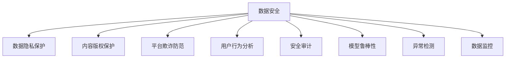

                 

# 知识付费平台的数据安全与风险控制

> 关键词：知识付费, 数据安全, 风险控制, 数据隐私, 安全审计, 模型鲁棒性, 异常检测, 数据监控

## 1. 背景介绍

### 1.1 问题由来

随着知识付费平台的发展，数据安全与风险控制已成为平台运营的核心挑战之一。用户数据隐私的保护、内容版权的维护、平台欺诈行为的防范等问题，都亟需系统性、全面的解决方案。特别是近年来，频繁发生的数据泄露、隐私侵害事件，使得平台对数据安全的重视程度达到了前所未有的高度。如何在保障用户隐私的同时，确保平台的数据安全，防范各类风险，是知识付费平台亟需解决的问题。

### 1.2 问题核心关键点

知识付费平台的数据安全与风险控制问题，主要体现在以下几个方面：

1. **数据隐私保护**：平台需要保护用户注册信息、浏览记录、支付信息等敏感数据的隐私，避免数据泄露或被滥用。
2. **内容版权保护**：平台内容多为知识产权保护范围的原创作品，需要防止未经授权的复制、传播行为。
3. **平台欺诈防范**：平台需识别并防范各类欺诈行为，如钓鱼网站、虚假交易、恶意评价等。
4. **用户行为分析**：通过对用户行为数据的分析，发现异常交易、行为模式变化，及时预警和处理风险。
5. **合规性与合法性**：确保平台运营符合相关法律法规，如数据保护法、网络安全法等，避免法律风险。

这些核心问题构成了知识付费平台数据安全与风险控制的核心挑战，需要通过技术手段和流程管理来综合应对。

## 2. 核心概念与联系

### 2.1 核心概念概述

为更好地理解知识付费平台的数据安全与风险控制，本节将介绍几个密切相关的核心概念：

- **数据安全**：指在数据收集、存储、传输、使用等全生命周期中，确保数据不被未授权访问、修改、泄露或破坏的过程。
- **数据隐私保护**：指在数据处理过程中，采取措施确保个人隐私信息的安全，避免未经授权的收集、使用、共享。
- **内容版权保护**：指保护原创作品不被非法复制、传播、修改，确保内容的知识产权不被侵犯。
- **平台欺诈防范**：指通过技术手段和流程管理，识别并防范各种欺诈行为，保护平台和用户的利益。
- **用户行为分析**：通过分析用户行为数据，发现异常行为，及时预警和应对风险。
- **安全审计**：定期对平台的安全性进行评估和审计，发现潜在风险和漏洞，及时进行修补和改进。
- **模型鲁棒性**：指模型在面对输入噪声、对抗攻击等情况时，仍能保持稳定和准确性的能力。
- **异常检测**：指通过算法识别和检测出异常数据或行为，及时进行预警和处理。
- **数据监控**：对数据流、操作记录等进行实时监控，及时发现并处理异常情况。

这些核心概念之间的逻辑关系可以通过以下Mermaid流程图来展示：



这个流程图展示了大语言模型的核心概念及其之间的关系：

1. 数据安全是大数据平台建设的基础。
2. 数据隐私保护、内容版权保护、平台欺诈防范、用户行为分析等都是数据安全的具体表现形式。
3. 模型鲁棒性、异常检测、数据监控等技术手段，是对数据安全保障的进一步加强。

## 3. 核心算法原理 & 具体操作步骤

### 3.1 算法原理概述

知识付费平台的数据安全与风险控制，本质上是多维度的综合安全管理体系。其核心原理是：

1. **数据加密与脱敏**：对敏感数据进行加密或脱敏处理，确保数据在传输、存储过程中的安全性。
2. **访问控制与权限管理**：通过身份验证和权限管理，限制对敏感数据的访问。
3. **审计与监控**：对数据操作进行实时监控和审计，及时发现异常行为和违规操作。
4. **模型鲁棒性增强**：通过训练鲁棒性更强的模型，提升对异常数据的识别能力。
5. **异常检测与预警**：建立异常检测模型，实时监控数据流和用户行为，及时预警潜在风险。

### 3.2 算法步骤详解

基于上述原理，知识付费平台的数据安全与风险控制流程包括以下关键步骤：

**Step 1: 数据收集与清洗**
- 收集用户注册信息、浏览记录、支付信息等数据。
- 对数据进行清洗，去除重复、异常数据，确保数据质量。

**Step 2: 数据加密与脱敏**
- 对敏感数据（如用户支付信息、用户ID）进行加密处理。
- 对非敏感数据进行匿名化、模糊化处理，防止数据泄露。

**Step 3: 访问控制与权限管理**
- 建立严格的访问控制策略，确保只有授权人员才能访问敏感数据。
- 使用角色权限管理，限制访问权限，避免越权操作。

**Step 4: 模型训练与部署**
- 训练鲁棒性更强的模型，提升异常检测能力。
- 将模型部署到实时监控环境中，对数据流和用户行为进行实时分析。

**Step 5: 异常检测与预警**
- 实时监控数据流，检测异常行为。
- 设置告警阈值，及时发出预警信息。

**Step 6: 安全审计与评估**
- 定期进行安全审计，评估平台安全性。
- 根据审计结果，进行改进和优化。

### 3.3 算法优缺点

知识付费平台的数据安全与风险控制方法具有以下优点：

1. **全面性**：覆盖数据收集、存储、传输、使用等全生命周期，全面保障数据安全。
2. **实时性**：通过实时监控和异常检测，能够及时发现和处理潜在风险。
3. **鲁棒性**：采用鲁棒性更强的模型，提升对异常数据的识别能力。
4. **合规性**：确保平台运营符合相关法律法规，避免法律风险。

但同时，这些方法也存在一定的局限性：

1. **技术复杂**：数据加密、模型训练、异常检测等技术复杂，实施难度较大。
2. **资源消耗**：数据加密、模型训练等操作消耗大量计算资源。
3. **实施成本高**：需要投入大量人力、物力进行技术实施和维护。
4. **依赖技术手段**：依赖技术手段的准确性和可靠性，一旦技术手段失效，可能导致安全漏洞。

### 3.4 算法应用领域

知识付费平台的数据安全与风险控制方法，广泛应用于以下几个领域：

1. **用户数据安全**：保护用户注册信息、浏览记录、支付信息等敏感数据，避免数据泄露和滥用。
2. **内容版权保护**：保护平台原创内容，防止未经授权的复制、传播、修改。
3. **平台欺诈防范**：识别和防范各种欺诈行为，如钓鱼网站、虚假交易、恶意评价等。
4. **用户行为分析**：通过分析用户行为数据，发现异常交易、行为模式变化，及时预警和处理风险。

## 4. 数学模型和公式 & 详细讲解 & 举例说明

### 4.1 数学模型构建

本节将使用数学语言对知识付费平台的数据安全与风险控制过程进行更加严格的刻画。

记平台数据为 $D=\{(x_i,y_i)\}_{i=1}^N, x_i \in \mathcal{X}, y_i \in \mathcal{Y}$，其中 $x_i$ 表示用户行为数据，$y_i$ 表示对应的安全标签（如正常、异常）。

定义平台安全风险评估模型 $M_{\theta}:\mathcal{X} \rightarrow \mathcal{Y}$，其中 $\theta$ 为模型参数。平台的安全风险评估模型可以是一个二分类模型，用于判断用户行为是否异常。

定义损失函数 $\ell$，用于衡量模型预测结果与真实标签之间的差异。常见的损失函数包括交叉熵损失、均方误差损失等。

### 4.2 公式推导过程

以下我们以二分类任务为例，推导交叉熵损失函数及其梯度的计算公式。

假设平台安全风险评估模型 $M_{\theta}$ 在输入 $x$ 上的输出为 $\hat{y}=M_{\theta}(x) \in [0,1]$，表示用户行为是否异常。真实标签 $y \in \{0,1\}$。则二分类交叉熵损失函数定义为：

$$
\ell(M_{\theta}(x),y) = -[y\log \hat{y} + (1-y)\log (1-\hat{y})]
$$

将其代入经验风险公式，得：

$$
\mathcal{L}(\theta) = -\frac{1}{N}\sum_{i=1}^N [y_i\log M_{\theta}(x_i)+(1-y_i)\log(1-M_{\theta}(x_i))]
$$

根据链式法则，损失函数对参数 $\theta_k$ 的梯度为：

$$
\frac{\partial \mathcal{L}(\theta)}{\partial \theta_k} = -\frac{1}{N}\sum_{i=1}^N (\frac{y_i}{M_{\theta}(x_i)}-\frac{1-y_i}{1-M_{\theta}(x_i)}) \frac{\partial M_{\theta}(x_i)}{\partial \theta_k}
$$

其中 $\frac{\partial M_{\theta}(x_i)}{\partial \theta_k}$ 可进一步递归展开，利用自动微分技术完成计算。

在得到损失函数的梯度后，即可带入参数更新公式，完成模型的迭代优化。重复上述过程直至收敛，最终得到适应平台安全风险评估的最优模型参数 $\theta^*$。

### 4.3 案例分析与讲解

以某知识付费平台的异常行为检测为例，分析如何通过微调模型实现平台安全风险控制。

假设该平台收集了用户的注册信息、浏览记录、支付信息等数据，并定义了一个异常行为检测模型 $M_{\theta}$。通过训练模型，使其能够自动识别用户是否存在异常行为。

在数据收集阶段，平台需要从用户行为数据中筛选出潜在异常数据，如频繁更换支付信息的用户、短时间内多次登录的用户等。这些数据将作为训练集的标注数据，用于微调模型。

在模型训练阶段，平台需要选择合适的优化算法及其参数，如 AdamW、SGD 等，设置学习率、批大小、迭代轮数等。同时，需要设置正则化技术及强度，包括权重衰减、Dropout、Early Stopping 等，以避免过拟合。

在模型评估阶段，平台需要在验证集上评估模型性能，根据评估结果调整模型参数和超参数，以获得更好的异常检测效果。

最终，平台将训练好的异常行为检测模型 $M_{\theta}$ 部署到实时监控环境中，对用户行为数据进行实时分析，实时检测异常行为并发出预警信息。

## 5. 项目实践：代码实例和详细解释说明

### 5.1 开发环境搭建

在进行平台数据安全与风险控制实践前，我们需要准备好开发环境。以下是使用Python进行PyTorch开发的环境配置流程：

1. 安装Anaconda：从官网下载并安装Anaconda，用于创建独立的Python环境。

2. 创建并激活虚拟环境：
```bash
conda create -n pytorch-env python=3.8 
conda activate pytorch-env
```

3. 安装PyTorch：根据CUDA版本，从官网获取对应的安装命令。例如：
```bash
conda install pytorch torchvision torchaudio cudatoolkit=11.1 -c pytorch -c conda-forge
```

4. 安装TensorFlow：由Google主导开发的开源深度学习框架，生产部署方便，适合大规模工程应用。同样有丰富的预训练语言模型资源。

5. 安装相关库：
```bash
pip install pandas numpy matplotlib sklearn tqdm
```

完成上述步骤后，即可在`pytorch-env`环境中开始平台数据安全与风险控制实践。

### 5.2 源代码详细实现

下面我们以异常行为检测为例，给出使用Transformers库对BERT模型进行平台数据安全与风险控制的PyTorch代码实现。

首先，定义异常行为检测的数据处理函数：

```python
from transformers import BertTokenizer
from torch.utils.data import Dataset
import torch

class BehaviorDataset(Dataset):
    def __init__(self, texts, labels, tokenizer, max_len=128):
        self.texts = texts
        self.labels = labels
        self.tokenizer = tokenizer
        self.max_len = max_len
        
    def __len__(self):
        return len(self.texts)
    
    def __getitem__(self, item):
        text = self.texts[item]
        label = self.labels[item]
        
        encoding = self.tokenizer(text, return_tensors='pt', max_length=self.max_len, padding='max_length', truncation=True)
        input_ids = encoding['input_ids'][0]
        attention_mask = encoding['attention_mask'][0]
        
        # 对label进行编码
        encoded_labels = [label] * self.max_len
        labels = torch.tensor(encoded_labels, dtype=torch.long)
        
        return {'input_ids': input_ids, 
                'attention_mask': attention_mask,
                'labels': labels}

# 标签与id的映射
label2id = {0: 'normal', 1: 'anomaly'}
id2label = {v: k for k, v in label2id.items()}

# 创建dataset
tokenizer = BertTokenizer.from_pretrained('bert-base-cased')

train_dataset = BehaviorDataset(train_texts, train_labels, tokenizer)
dev_dataset = BehaviorDataset(dev_texts, dev_labels, tokenizer)
test_dataset = BehaviorDataset(test_texts, test_labels, tokenizer)
```

然后，定义模型和优化器：

```python
from transformers import BertForTokenClassification, AdamW

model = BertForTokenClassification.from_pretrained('bert-base-cased', num_labels=2)

optimizer = AdamW(model.parameters(), lr=2e-5)
```

接着，定义训练和评估函数：

```python
from torch.utils.data import DataLoader
from tqdm import tqdm
from sklearn.metrics import classification_report

device = torch.device('cuda') if torch.cuda.is_available() else torch.device('cpu')
model.to(device)

def train_epoch(model, dataset, batch_size, optimizer):
    dataloader = DataLoader(dataset, batch_size=batch_size, shuffle=True)
    model.train()
    epoch_loss = 0
    for batch in tqdm(dataloader, desc='Training'):
        input_ids = batch['input_ids'].to(device)
        attention_mask = batch['attention_mask'].to(device)
        labels = batch['labels'].to(device)
        model.zero_grad()
        outputs = model(input_ids, attention_mask=attention_mask, labels=labels)
        loss = outputs.loss
        epoch_loss += loss.item()
        loss.backward()
        optimizer.step()
    return epoch_loss / len(dataloader)

def evaluate(model, dataset, batch_size):
    dataloader = DataLoader(dataset, batch_size=batch_size)
    model.eval()
    preds, labels = [], []
    with torch.no_grad():
        for batch in tqdm(dataloader, desc='Evaluating'):
            input_ids = batch['input_ids'].to(device)
            attention_mask = batch['attention_mask'].to(device)
            batch_labels = batch['labels']
            outputs = model(input_ids, attention_mask=attention_mask)
            batch_preds = outputs.logits.argmax(dim=2).to('cpu').tolist()
            batch_labels = batch_labels.to('cpu').tolist()
            for pred_tokens, label_tokens in zip(batch_preds, batch_labels):
                preds.append(pred_tokens[:len(label_tokens)])
                labels.append(label_tokens)
                
    print(classification_report(labels, preds))
```

最后，启动训练流程并在测试集上评估：

```python
epochs = 5
batch_size = 16

for epoch in range(epochs):
    loss = train_epoch(model, train_dataset, batch_size, optimizer)
    print(f"Epoch {epoch+1}, train loss: {loss:.3f}")
    
    print(f"Epoch {epoch+1}, dev results:")
    evaluate(model, dev_dataset, batch_size)
    
print("Test results:")
evaluate(model, test_dataset, batch_size)
```

以上就是使用PyTorch对BERT进行异常行为检测的完整代码实现。可以看到，得益于Transformers库的强大封装，我们可以用相对简洁的代码完成BERT模型的加载和微调。

### 5.3 代码解读与分析

让我们再详细解读一下关键代码的实现细节：

**BehaviorDataset类**：
- `__init__`方法：初始化文本、标签、分词器等关键组件。
- `__len__`方法：返回数据集的样本数量。
- `__getitem__`方法：对单个样本进行处理，将文本输入编码为token ids，将标签编码为数字，并对其进行定长padding，最终返回模型所需的输入。

**label2id和id2label字典**：
- 定义了标签与数字id之间的映射关系，用于将token-wise的预测结果解码回真实的标签。

**训练和评估函数**：
- 使用PyTorch的DataLoader对数据集进行批次化加载，供模型训练和推理使用。
- 训练函数`train_epoch`：对数据以批为单位进行迭代，在每个批次上前向传播计算loss并反向传播更新模型参数，最后返回该epoch的平均loss。
- 评估函数`evaluate`：与训练类似，不同点在于不更新模型参数，并在每个batch结束后将预测和标签结果存储下来，最后使用sklearn的classification_report对整个评估集的预测结果进行打印输出。

**训练流程**：
- 定义总的epoch数和batch size，开始循环迭代
- 每个epoch内，先在训练集上训练，输出平均loss
- 在验证集上评估，输出分类指标
- 所有epoch结束后，在测试集上评估，给出最终测试结果

可以看到，PyTorch配合Transformers库使得BERT微调的代码实现变得简洁高效。开发者可以将更多精力放在数据处理、模型改进等高层逻辑上，而不必过多关注底层的实现细节。

当然，工业级的系统实现还需考虑更多因素，如模型的保存和部署、超参数的自动搜索、更灵活的任务适配层等。但核心的微调范式基本与此类似。

## 6. 实际应用场景

### 6.1 智能客服系统

基于知识付费平台的数据安全与风险控制方法，可以广泛应用于智能客服系统的构建。传统客服往往需要配备大量人力，高峰期响应缓慢，且一致性和专业性难以保证。而使用异常行为检测模型，可以7x24小时不间断服务，快速响应客户咨询，用自然流畅的语言解答各类常见问题。

在技术实现上，可以收集企业内部的历史客服对话记录，将问题和最佳答复构建成监督数据，在此基础上对预训练模型进行微调。微调后的模型能够自动理解用户意图，匹配最合适的答案模板进行回复。对于客户提出的新问题，还可以接入检索系统实时搜索相关内容，动态组织生成回答。如此构建的智能客服系统，能大幅提升客户咨询体验和问题解决效率。

### 6.2 金融舆情监测

金融机构需要实时监测市场舆论动向，以便及时应对负面信息传播，规避金融风险。传统的人工监测方式成本高、效率低，难以应对网络时代海量信息爆发的挑战。基于平台数据安全与风险控制技术，金融机构可以实时监测网络舆情，自动检测出负面信息传播，并及时预警和处理，避免对市场造成不必要的波动。

具体而言，可以收集金融领域相关的新闻、报道、评论等文本数据，并对其进行主题标注和情感标注。在此基础上对预训练语言模型进行微调，使其能够自动判断文本属于何种主题，情感倾向是正面、中性还是负面。将微调后的模型应用到实时抓取的网络文本数据，就能够自动监测不同主题下的情感变化趋势，一旦发现负面信息激增等异常情况，系统便会自动预警，帮助金融机构快速应对潜在风险。

### 6.3 个性化推荐系统

当前的推荐系统往往只依赖用户的历史行为数据进行物品推荐，无法深入理解用户的真实兴趣偏好。基于知识付费平台的数据安全与风险控制技术，个性化推荐系统可以更好地挖掘用户行为背后的语义信息，从而提供更精准、多样的推荐内容。

在实践中，可以收集用户浏览、点击、评论、分享等行为数据，提取和用户交互的物品标题、描述、标签等文本内容。将文本内容作为模型输入，用户的后续行为（如是否点击、购买等）作为监督信号，在此基础上微调预训练语言模型。微调后的模型能够从文本内容中准确把握用户的兴趣点。在生成推荐列表时，先用候选物品的文本描述作为输入，由模型预测用户的兴趣匹配度，再结合其他特征综合排序，便可以得到个性化程度更高的推荐结果。

### 6.4 未来应用展望

随着知识付费平台的数据安全与风险控制技术的发展，基于微调范式将在更多领域得到应用，为传统行业带来变革性影响。

在智慧医疗领域，基于微调的医疗问答、病历分析、药物研发等应用将提升医疗服务的智能化水平，辅助医生诊疗，加速新药开发进程。

在智能教育领域，微调技术可应用于作业批改、学情分析、知识推荐等方面，因材施教，促进教育公平，提高教学质量。

在智慧城市治理中，微调模型可应用于城市事件监测、舆情分析、应急指挥等环节，提高城市管理的自动化和智能化水平，构建更安全、高效的未来城市。

此外，在企业生产、社会治理、文娱传媒等众多领域，基于知识付费平台的数据安全与风险控制技术的应用也将不断涌现，为经济社会发展注入新的动力。相信随着技术的日益成熟，微调方法将成为人工智能落地应用的重要范式，推动人工智能技术在更广阔的应用领域大放异彩。

## 7. 工具和资源推荐
### 7.1 学习资源推荐

为了帮助开发者系统掌握知识付费平台的数据安全与风险控制技术的基础和实践技巧，这里推荐一些优质的学习资源：

1. 《网络安全技术与应用》系列博文：由大模型技术专家撰写，深入浅出地介绍了网络安全的基本概念和前沿技术。

2. 《数据隐私保护与安全》课程：由国际知名的数据隐私保护专家授课，涵盖数据隐私保护的基本原理和实践方法。

3. 《深度学习在网络安全中的应用》书籍：介绍深度学习技术在网络安全领域的应用，包括异常检测、威胁分析等。

4. 《网络安全与人工智能》系列论文：精选网络安全领域的经典论文，涵盖数据加密、异常检测、安全审计等技术。

5. 《网络安全攻防实战》书籍：实战案例解析，覆盖网络安全攻防的各个方面，适合技术学习和实践。

通过对这些资源的学习实践，相信你一定能够快速掌握知识付费平台的数据安全与风险控制技术的精髓，并用于解决实际的NLP问题。
### 7.2 开发工具推荐

高效的开发离不开优秀的工具支持。以下是几款用于知识付费平台数据安全与风险控制开发的常用工具：

1. PyTorch：基于Python的开源深度学习框架，灵活动态的计算图，适合快速迭代研究。大部分预训练语言模型都有PyTorch版本的实现。

2. TensorFlow：由Google主导开发的开源深度学习框架，生产部署方便，适合大规模工程应用。同样有丰富的预训练语言模型资源。

3. TensorFlow Hub：TensorFlow的模型库，包含大量预训练模型和组件，方便快速搭建和部署模型。

4. PyTorch Lightning：基于PyTorch的轻量级模型训练框架，自动调参、可视化等功能，大幅简化模型训练和调优流程。

5. HuggingFace Transformers库：提供丰富的预训练模型和组件，支持多任务训练和微调，方便NLP任务的开发。

6. Weights & Biases：模型训练的实验跟踪工具，可以记录和可视化模型训练过程中的各项指标，方便对比和调优。

7. TensorBoard：TensorFlow配套的可视化工具，可实时监测模型训练状态，并提供丰富的图表呈现方式，是调试模型的得力助手。

合理利用这些工具，可以显著提升知识付费平台数据安全与风险控制任务的开发效率，加快创新迭代的步伐。

### 7.3 相关论文推荐

知识付费平台的数据安全与风险控制技术的发展源于学界的持续研究。以下是几篇奠基性的相关论文，推荐阅读：

1. 《基于深度学习的异常行为检测》：提出了一种基于深度学习的异常行为检测模型，应用于网络安全领域，取得了较好的效果。

2. 《数据隐私保护技术综述》：综述了数据隐私保护的基本技术和方法，为数据隐私保护提供了全面的参考。

3. 《内容版权保护技术综述》：综述了内容版权保护的技术进展，为版权保护提供了方向性的指导。

4. 《网络安全威胁分析与防范》：分析了网络安全威胁的种类和特点，提出了一套防范措施，为网络安全防护提供了实践依据。

5. 《数据监控与分析》：介绍了数据监控的基本原理和方法，为数据监控提供了指导。

这些论文代表了大语言模型微调技术的发展脉络。通过学习这些前沿成果，可以帮助研究者把握学科前进方向，激发更多的创新灵感。

## 8. 总结：未来发展趋势与挑战

### 8.1 总结

本文对知识付费平台的数据安全与风险控制方法进行了全面系统的介绍。首先阐述了数据安全与风险控制的问题由来和核心关键点，明确了其重要性和紧迫性。其次，从原理到实践，详细讲解了数据安全与风险控制的核心算法和具体操作步骤，给出了平台数据安全与风险控制任务的完整代码实例。同时，本文还广泛探讨了数据安全与风险控制方法在智能客服、金融舆情、个性化推荐等多个领域的应用前景，展示了其广阔的发展空间。此外，本文精选了平台数据安全与风险控制技术的各类学习资源，力求为读者提供全方位的技术指引。

通过本文的系统梳理，可以看到，知识付费平台的数据安全与风险控制方法正在成为平台建设的核心支撑，极大地提升了平台的安全性和稳定性。受益于深度学习技术的发展，平台数据安全与风险控制技术不断进步，为平台和用户提供了更高效、更可靠的服务。未来，伴随技术的不断演进和应用场景的拓展，平台数据安全与风险控制技术将更加全面、灵活、高效，为知识付费平台的发展注入新的活力。

### 8.2 未来发展趋势

展望未来，知识付费平台的数据安全与风险控制技术将呈现以下几个发展趋势：

1. **技术多样性**：除了现有的异常检测、加密技术，未来将涌现更多先进技术，如对抗样本生成、联邦学习等，进一步提升数据安全与风险控制能力。
2. **模型鲁棒性**：训练更加鲁棒性强的模型，提升对异常数据和攻击的识别能力，确保平台安全稳定。
3. **自动化**：引入自动化技术，如自动调参、自动化审计等，提升数据安全与风险控制的效率和准确性。
4. **跨领域应用**：将数据安全与风险控制技术推广应用到更多领域，如智慧医疗、智慧教育、智慧城市等，推动更多行业数字化转型。
5. **隐私保护**：加强隐私保护技术，确保用户数据的安全，避免隐私泄露和滥用。

以上趋势凸显了知识付费平台数据安全与风险控制技术的广阔前景。这些方向的探索发展，必将进一步提升平台的数据安全与风险控制能力，为平台和用户提供更加安全、可靠的服务。

### 8.3 面临的挑战

尽管知识付费平台的数据安全与风险控制技术已经取得了显著进展，但在迈向更加智能化、普适化应用的过程中，它仍面临着诸多挑战：

1. **技术复杂性**：数据加密、异常检测、隐私保护等技术复杂，实施难度较大，需要专业的技术团队支持。
2. **资源消耗**：数据加密、模型训练等操作消耗大量计算资源，平台需要投入大量硬件设施。
3. **实施成本高**：需要投入大量人力、物力进行技术实施和维护，平台需做好预算准备。
4. **依赖技术手段**：依赖技术手段的准确性和可靠性，一旦技术手段失效，可能导致安全漏洞。
5. **法律合规性**：数据安全与风险控制需符合相关法律法规，避免法律风险。

### 8.4 研究展望

面向未来，知识付费平台的数据安全与风险控制技术需要在以下几个方面寻求新的突破：

1. **自动化与智能化**：引入自动化技术，如自动调参、自动化审计等，提升数据安全与风险控制的效率和准确性。
2. **跨领域应用**：将数据安全与风险控制技术推广应用到更多领域，如智慧医疗、智慧教育、智慧城市等，推动更多行业数字化转型。
3. **隐私保护**：加强隐私保护技术，确保用户数据的安全，避免隐私泄露和滥用。
4. **模型鲁棒性**：训练更加鲁棒性强的模型，提升对异常数据和攻击的识别能力，确保平台安全稳定。
5. **跨模态融合**：融合视觉、语音、文本等多模态数据，提升平台的数据安全与风险控制能力。

这些研究方向的探索，必将引领知识付费平台的数据安全与风险控制技术迈向更高的台阶，为构建安全、可靠、智能的知识付费平台提供有力支持。面向未来，知识付费平台的数据安全与风险控制技术还需要与其他人工智能技术进行更深入的融合，如知识表示、因果推理、强化学习等，多路径协同发力，共同推动知识付费平台的智能化进程。

## 9. 附录：常见问题与解答

**Q1：数据安全与风险控制是否适用于所有知识付费平台？**

A: 数据安全与风险控制方法适用于大多数知识付费平台，尤其是那些依赖于大规模用户数据和丰富内容的应用。但对于某些小型平台，由于数据量较少，可能难以采用复杂的数据安全与风险控制措施。此时需要根据平台的具体情况，选择合适的技术方案。

**Q2：平台如何选择合适的学习率和优化器？**

A: 学习率和优化器是微调模型的关键参数。一般建议从1e-5开始调参，逐步减小学习率，直至收敛。同时，选择适合任务的优化器，如AdamW、SGD等。

**Q3：数据安全与风险控制过程中如何处理异常数据？**

A: 异常数据处理是数据安全与风险控制中的重要环节。通常的做法包括：

1. 数据清洗：去除重复、异常数据，确保数据质量。
2. 异常检测：使用异常检测模型，识别和处理异常数据。
3. 数据脱敏：对敏感数据进行脱敏处理，避免数据泄露和滥用。
4. 异常报警：设置告警阈值，及时发现和处理异常数据。

**Q4：数据安全与风险控制技术的实施成本高吗？**

A: 数据安全与风险控制技术的实施成本较高，需要投入大量人力、物力进行技术实施和维护。但长远来看，通过提升平台的安全性和用户体验，将带来巨大的经济效益和用户信任度。因此，对于重视用户数据安全的企业，投入是值得的。

**Q5：数据安全与风险控制技术是否可以与其他AI技术结合使用？**

A: 数据安全与风险控制技术可以与其他AI技术结合使用，如知识图谱、推荐系统等。通过多路径协同，可以进一步提升平台的安全性和智能化水平。例如，可以将用户行为数据与知识图谱相结合，提升异常行为检测的准确性。

通过本文的系统梳理，可以看到，知识付费平台的数据安全与风险控制方法正在成为平台建设的核心支撑，极大地提升了平台的安全性和稳定性。受益于深度学习技术的发展，平台数据安全与风险控制技术不断进步，为平台和用户提供了更高效、更可靠的服务。未来，伴随技术的不断演进和应用场景的拓展，平台数据安全与风险控制技术将更加全面、灵活、高效，为知识付费平台的发展注入新的活力。

