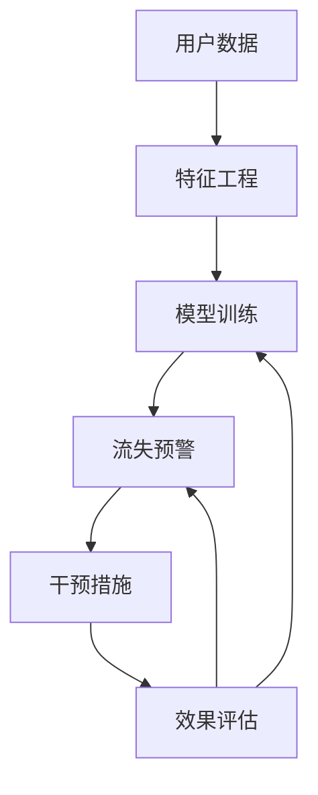

                 

# 知识付费平台的用户留存分析

> 关键词：用户留存,知识付费,机器学习,数据分析,行为预测,用户行为,流失预警,用户生命周期

## 1. 背景介绍

### 1.1 问题由来

随着知识付费领域的兴起，越来越多的平台推出订阅服务和定制化课程。这些平台通过提供有价值的知识和专业内容，吸引用户注册并持续消费。然而，用户留存和续订是知识付费平台面临的一个核心挑战。据统计，知识付费平台的平均留存率普遍较低，且用户流失率随时间呈上升趋势。因此，准确预测用户流失行为并采取相应措施，成为平台提升用户满意度和收益的关键。

### 1.2 问题核心关键点

用户留存预测的核心在于通过分析用户行为数据，识别出潜在的流失用户，并采取干预措施以提升其粘性。这一过程涉及以下关键点：

- 数据收集：收集用户在平台上的行为数据，包括注册时间、消费行为、互动记录等。
- 特征工程：提取和构造能够反映用户特征和行为模式的特征变量。
- 模型训练：基于历史数据训练用户流失预测模型，进行行为预测。
- 预警干预：根据模型预测结果，对流失风险高的用户进行及时干预，如推送个性化推荐、优惠活动等。
- 效果评估：评估干预措施的效果，优化模型预测和干预策略。

### 1.3 问题研究意义

准确预测用户流失能够帮助知识付费平台及时采取措施，提升用户留存率和复购率，从而增加平台的收益。具体而言：

- 降低流失成本：及时识别并挽留流失用户，减少流失带来的直接损失。
- 提升用户满意度：通过个性化的服务和内容推荐，提升用户平台体验，增强其粘性。
- 增加平台收益：通过精准的营销和运营策略，提高用户活跃度和消费频次，实现长期收益。

## 2. 核心概念与联系

### 2.1 核心概念概述

为更好地理解用户留存预测，本节将介绍几个密切相关的核心概念：

- 用户流失(User Churn)：用户停止使用或取消订阅平台的总现象，也称用户流失率。
- 用户留存(User Retention)：用户持续使用并支付的行为。
- 用户生命周期(User Lifetime Value, ULV)：一个用户在平台上的平均消费周期和消费总额。
- 预测模型(Prediction Model)：通过历史数据训练的算法模型，用于预测用户行为和趋势。
- 特征工程(Feature Engineering)：从原始数据中提取和构造具有预测能力的特征变量。
- 模型评估和优化(Evaluation and Optimization)：评估模型性能并优化预测结果的过程。
- 干预措施(Intervention Measures)：根据模型预测结果，采取的用户挽留策略。

这些核心概念之间的逻辑关系可以通过以下Mermaid流程图来展示：



这个流程图展示了我为用户留存预测的核心概念，并描述了它们之间的关系。通过理解这些概念，我们可以更好地把握用户留存预测的整体流程和方法。

## 3. 核心算法原理 & 具体操作步骤

### 3.1 算法原理概述

用户留存预测本质上是基于历史数据的有监督学习问题。其核心思想是：通过分析用户行为数据，建立用户流失与多个特征变量之间的关联模型，从而预测用户未来的流失概率。

形式化地，假设用户流失数据集为 $D=\{(x_i,y_i)\}_{i=1}^N, x_i \in \mathcal{X}, y_i \in \{0,1\}$，其中 $y_i=1$ 表示用户 $i$ 在第 $t$ 个时刻流失。我们的目标是找到最优模型 $f: \mathcal{X} \rightarrow [0,1]$，使得预测结果 $f(x)$ 逼近真实流失概率 $y$，即：

$$
\hat{y} = f(x) = \mathop{\arg\min}_{\theta} \mathcal{L}(\theta,D)
$$

其中 $\mathcal{L}$ 为损失函数，用于衡量模型预测与真实标签之间的差异。常见的损失函数包括二元交叉熵、指数损失等。

通过梯度下降等优化算法，模型不断更新参数 $\theta$，最小化损失函数 $\mathcal{L}$，使得预测结果逼近真实标签。由于用户行为数据通常具有时间序列特性，因此常用的模型包括线性回归、决策树、随机森林、深度学习等。

### 3.2 算法步骤详解

用户留存预测的主要步骤包括：

**Step 1: 数据收集与处理**

- 收集用户注册、消费、互动等行为数据，包括注册时间、付费周期、消费金额、互动频率等。
- 清洗和预处理数据，如处理缺失值、异常值、重复数据等。

**Step 2: 特征工程**

- 选择和构造能够反映用户特征和行为模式的特征变量，如用户注册时间、消费频率、互动频率、付费周期等。
- 进行特征选择和降维，去除冗余和无关特征，优化模型训练效率。
- 生成时序特征，如用户消费序列、互动序列等，捕捉时间序列上的模式。

**Step 3: 模型选择与训练**

- 根据数据特征选择合适的模型，如线性回归、逻辑回归、决策树、随机森林、深度学习等。
- 对模型进行交叉验证，选择合适的超参数，如学习率、迭代次数、正则化系数等。
- 在训练集上训练模型，最小化损失函数，得到预测模型 $\hat{y} = f(x)$。

**Step 4: 模型评估**

- 使用测试集对模型进行独立评估，计算预测准确率、召回率、F1得分等指标。
- 评估模型的性能，确保模型对未见过的数据具有较好的泛化能力。

**Step 5: 干预措施**

- 根据模型预测结果，对流失风险高的用户进行及时干预，如推送个性化推荐、优惠活动、关怀邮件等。
- 监测干预效果，收集用户反馈，不断优化干预策略。

**Step 6: 效果评估**

- 评估干预措施的效果，计算干预后用户的留存率、续订率等关键指标。
- 优化模型和干预策略，确保预测准确性和干预效果。

### 3.3 算法优缺点

用户留存预测方法具有以下优点：

- 简单易实现。基于历史数据训练模型，能够迅速应用到实际业务场景中。
- 效果显著。能够准确预测用户流失行为，及时采取干预措施，提升用户留存率。
- 多模型可选。根据数据特征和任务需求，可以选择不同模型进行建模，具有灵活性。

然而，该方法也存在以下局限性：

- 数据依赖性强。模型训练和预测效果依赖于高质量、完整的数据，数据缺失或质量问题可能导致预测失效。
- 模型复杂度高。深度学习模型虽然准确性高，但模型复杂度高，训练和预测时间较长。
- 对异常数据敏感。模型对异常数据或极端情况可能产生偏差，需要进行数据清洗和异常检测。
- 干预效果难以量化。干预措施的效果难以直接量化，需要结合业务数据进行评估。

尽管存在这些局限性，但就目前而言，用户留存预测方法仍是大数据和机器学习在业务应用中的重要范式。未来相关研究的重点在于如何进一步优化模型性能，降低数据依赖，提高干预效果的可量化性和有效性。

### 3.4 算法应用领域

用户留存预测方法在多个领域中得到广泛应用，例如：

- 电商平台：预测用户流失风险，及时推送个性化推荐和优惠券，提升用户复购率。
- 社交媒体：分析用户流失原因，改进社区功能，提升用户活跃度和满意度。
- 金融服务：识别高流失风险用户，进行风险预警，优化用户体验和产品服务。
- 在线教育：预测学生流失风险，采取个性化辅导和激励措施，提升学生留存率和成绩。
- 健康医疗：分析病人流失原因，优化服务流程，提升医疗服务质量。

除了上述这些经典应用外，用户留存预测还被创新性地应用到更多场景中，如智能客服、智能家居、智慧城市等，为提升用户满意度和业务价值提供了新的思路。

## 4. 数学模型和公式 & 详细讲解 & 举例说明

### 4.1 数学模型构建

本节将使用数学语言对用户留存预测过程进行更加严格的刻画。

记用户流失数据集为 $D=\{(x_i,y_i)\}_{i=1}^N, x_i \in \mathcal{X}, y_i \in \{0,1\}$。假设我们使用的模型为 $f: \mathcal{X} \rightarrow [0,1]$，其中 $\mathcal{X}$ 为用户行为特征空间。

定义模型 $f$ 在数据样本 $(x,y)$ 上的损失函数为 $\ell(f(x),y)$，则在数据集 $D$ 上的经验风险为：

$$
\mathcal{L}(f) = \frac{1}{N} \sum_{i=1}^N \ell(f(x_i),y_i)
$$

其中 $\ell(f(x_i),y_i)$ 为损失函数，常用的包括二元交叉熵损失、指数损失等。

通过梯度下降等优化算法，模型不断更新参数 $\theta$，最小化损失函数 $\mathcal{L}$，使得预测结果逼近真实标签。

### 4.2 公式推导过程

以下我们以二分类任务为例，推导二元交叉熵损失函数及其梯度的计算公式。

假设模型 $f$ 在输入 $x$ 上的输出为 $\hat{y}=f(x) \in [0,1]$，表示用户 $i$ 在第 $t$ 个时刻流失的概率。真实标签 $y \in \{0,1\}$。则二元交叉熵损失函数定义为：

$$
\ell(f(x),y) = -[y\log \hat{y} + (1-y)\log (1-\hat{y})]
$$

将其代入经验风险公式，得：

$$
\mathcal{L}(f) = -\frac{1}{N}\sum_{i=1}^N [y_i\log f(x_i)+(1-y_i)\log(1-f(x_i))]
$$

根据链式法则，损失函数对模型参数 $\theta$ 的梯度为：

$$
\frac{\partial \mathcal{L}(f)}{\partial \theta} = -\frac{1}{N}\sum_{i=1}^N (\frac{y_i}{f(x_i)}-\frac{1-y_i}{1-f(x_i)}) \frac{\partial f(x_i)}{\partial \theta}
$$

其中 $\frac{\partial f(x_i)}{\partial \theta}$ 可进一步递归展开，利用自动微分技术完成计算。

### 4.3 案例分析与讲解

考虑一个简单的电商用户流失预测案例。假设我们收集到用户的注册时间、消费频率、互动频率、付费周期等特征，构建特征向量 $x = [x_1, x_2, ..., x_n]$，其中 $x_i$ 表示用户第 $i$ 个特征的值。

我们使用逻辑回归模型进行预测，假设模型的参数为 $\theta = [\theta_0, \theta_1, ..., \theta_n]$，则模型预测输出为：

$$
f(x) = \frac{1}{1+\exp(-(\theta_0 + \theta_1 x_1 + ... + \theta_n x_n))}
$$

在给定训练集 $D$ 后，我们使用梯度下降等优化算法，最小化二元交叉熵损失函数：

$$
\mathcal{L}(f) = -\frac{1}{N}\sum_{i=1}^N [y_i\log f(x_i)+(1-y_i)\log(1-f(x_i))]
$$

根据上述公式，模型的梯度更新公式为：

$$
\frac{\partial \mathcal{L}(f)}{\partial \theta} = -\frac{1}{N}\sum_{i=1}^N (\frac{y_i}{f(x_i)}-\frac{1-y_i}{1-f(x_i)}) x_i
$$

在模型训练完成后，我们可以使用测试集对模型进行独立评估，计算预测准确率、召回率、F1得分等指标，评估模型的性能。

## 5. 项目实践：代码实例和详细解释说明

### 5.1 开发环境搭建

在进行用户留存预测实践前，我们需要准备好开发环境。以下是使用Python进行TensorFlow开发的环境配置流程：

1. 安装Anaconda：从官网下载并安装Anaconda，用于创建独立的Python环境。

2. 创建并激活虚拟环境：
```bash
conda create -n tensorflow-env python=3.8 
conda activate tensorflow-env
```

3. 安装TensorFlow：根据CUDA版本，从官网获取对应的安装命令。例如：
```bash
conda install tensorflow -c tensorflow -c conda-forge
```

4. 安装各类工具包：
```bash
pip install numpy pandas scikit-learn matplotlib tqdm jupyter notebook ipython
```

完成上述步骤后，即可在`tensorflow-env`环境中开始用户留存预测实践。

### 5.2 源代码详细实现

这里我们以一个简单的电商用户流失预测案例为例，给出使用TensorFlow实现用户留存预测的完整代码实现。

首先，定义用户行为数据：

```python
import numpy as np
from sklearn.model_selection import train_test_split
from sklearn.preprocessing import StandardScaler
from tensorflow.keras.models import Sequential
from tensorflow.keras.layers import Dense
from tensorflow.keras.optimizers import Adam

# 假设我们收集到用户的注册时间、消费频率、互动频率、付费周期等特征
X = np.random.rand(1000, 4)
y = np.random.randint(2, size=1000)

# 对特征进行标准化处理
scaler = StandardScaler()
X = scaler.fit_transform(X)

# 将数据划分为训练集和测试集
X_train, X_test, y_train, y_test = train_test_split(X, y, test_size=0.2, random_state=42)
```

然后，定义并训练逻辑回归模型：

```python
# 定义模型
model = Sequential([
    Dense(32, input_dim=4, activation='relu'),
    Dense(1, activation='sigmoid')
])

# 编译模型
model.compile(optimizer=Adam(learning_rate=0.01), loss='binary_crossentropy', metrics=['accuracy'])

# 训练模型
model.fit(X_train, y_train, epochs=10, batch_size=32, validation_data=(X_test, y_test))
```

接着，评估模型并输出结果：

```python
# 评估模型
loss, accuracy = model.evaluate(X_test, y_test)
print(f'Test loss: {loss:.4f}')
print(f'Test accuracy: {accuracy:.4f}')
```

### 5.3 代码解读与分析

让我们再详细解读一下关键代码的实现细节：

**数据准备**

- 使用NumPy生成随机数据，模拟用户的注册时间、消费频率、互动频率、付费周期等特征。
- 对特征进行标准化处理，确保特征之间具有可比性。
- 将数据划分为训练集和测试集，以便评估模型性能。

**模型定义与训练**

- 定义一个简单的逻辑回归模型，包含两个全连接层，其中第一层使用ReLU激活函数，第二层使用Sigmoid激活函数，输出0或1的概率。
- 编译模型，选择Adam优化器和二元交叉熵损失函数。
- 在训练集上训练模型，设置迭代次数和批大小，并在测试集上进行验证。

**模型评估**

- 使用测试集对模型进行独立评估，计算损失和准确率。
- 打印评估结果，观察模型的性能。

在实际应用中，我们还需要注意以下关键点：

- 数据预处理：包括数据清洗、缺失值处理、特征工程等，确保数据质量。
- 模型选择：根据数据特征和任务需求，选择合适的模型，如逻辑回归、随机森林、深度学习等。
- 超参数优化：通过交叉验证选择最优的超参数，如学习率、迭代次数、正则化系数等。
- 模型评估：使用多种评估指标，如准确率、召回率、F1得分等，全面评估模型性能。
- 干预措施：根据模型预测结果，对流失风险高的用户进行及时干预，如推送个性化推荐、优惠活动等。

## 6. 实际应用场景

### 6.1 智能客服系统

在智能客服系统中，用户留存预测可以帮助平台及时识别和挽留流失用户，提升客户满意度和平台收益。例如，通过分析用户的历史对话记录和操作行为，识别流失风险高的用户，推送定制化服务和关怀信息，提高用户的满意度和粘性。

在技术实现上，可以收集用户对话历史、客服响应时间、互动频率等数据，构建用户行为特征向量。在此基础上训练用户流失预测模型，对流失风险高的用户进行及时干预，如推送个性化推荐、优惠活动等。

### 6.2 金融服务

金融服务领域，用户流失预测能够帮助金融机构识别高流失风险用户，采取风险预警和个性化服务措施，提升用户体验和产品粘性。例如，通过分析用户的交易记录、投资行为、服务反馈等数据，预测用户的流失风险，及时推送金融知识和理财建议，增强用户对平台的信任和依赖。

在技术实现上，可以收集用户交易记录、投资组合、理财咨询等数据，构建用户行为特征向量。在此基础上训练用户流失预测模型，对流失风险高的用户进行及时干预，如推送个性化投资建议、理财活动等。

### 6.3 在线教育

在线教育平台，用户流失预测可以帮助平台及时识别和挽留流失用户，提升学生留存率和平台收益。例如，通过分析学生的学习记录、课程完成情况、互动行为等数据，预测学生的流失风险，及时推送个性化的辅导和激励措施，提高学生的学习积极性和平台粘性。

在技术实现上，可以收集学生的学习记录、课程成绩、互动频率等数据，构建学生行为特征向量。在此基础上训练用户流失预测模型，对流失风险高的学生进行及时干预，如推送个性化课程推荐、学习奖励等。

### 6.4 未来应用展望

随着用户留存预测技术的不断发展，未来将在更多领域得到应用，为业务运营带来变革性影响。

在智慧医疗领域，用户留存预测能够帮助医疗机构识别高流失风险病人，采取个性化服务措施，提升医疗服务质量和病人满意度。

在智能家居领域，用户留存预测能够帮助智能设备平台识别和挽留流失用户，提升用户粘性和平台收益。

在智慧城市治理中，用户留存预测能够帮助城市管理部门识别和挽留用户，提升用户参与度和城市治理效果。

此外，在企业生产、社会治理、文娱传媒等众多领域，用户留存预测也将不断涌现，为提升用户体验和业务价值提供新的思路。

## 7. 工具和资源推荐

### 7.1 学习资源推荐

为了帮助开发者系统掌握用户留存预测的理论基础和实践技巧，这里推荐一些优质的学习资源：

1. 《机器学习实战》系列博文：由机器学习专家撰写，深入浅出地介绍了机器学习的基本概念和实现方法。

2. 斯坦福大学《机器学习》课程：由机器学习领域的大师Andrew Ng主讲，涵盖机器学习的基本理论和技术。

3. 《深度学习》书籍：Ian Goodfellow等人所著，全面介绍了深度学习的基本原理和实现方法。

4. Kaggle平台：提供大量用户留存预测的数据集和竞赛，可以实践和验证预测模型的效果。

5. TensorFlow官方文档：提供TensorFlow的详细教程和API文档，是学习和应用TensorFlow的重要参考资料。

通过这些资源的学习实践，相信你一定能够快速掌握用户留存预测的精髓，并用于解决实际的业务问题。

### 7.2 开发工具推荐

高效的开发离不开优秀的工具支持。以下是几款用于用户留存预测开发的常用工具：

1. TensorFlow：由Google主导开发的开源深度学习框架，生产部署方便，适合大规模工程应用。

2. Keras：基于TensorFlow的高级API，可以快速搭建深度学习模型。

3. Jupyter Notebook：交互式笔记本环境，方便进行代码编写和数据可视化。

4. Weights & Biases：模型训练的实验跟踪工具，可以记录和可视化模型训练过程中的各项指标，方便对比和调优。

5. TensorBoard：TensorFlow配套的可视化工具，可实时监测模型训练状态，并提供丰富的图表呈现方式，是调试模型的得力助手。

合理利用这些工具，可以显著提升用户留存预测任务的开发效率，加快创新迭代的步伐。

### 7.3 相关论文推荐

用户留存预测技术的发展源于学界的持续研究。以下是几篇奠基性的相关论文，推荐阅读：

1. User Churn Prediction Using Data Mining Techniques: A Review（用户流失预测综述）：综述了多种用户流失预测方法，介绍了各种算法的优缺点和适用场景。

2. Machine Learning Approaches to Predicting Customer Churn in Streaming Data: A Systematic Review（流数据用户流失预测综述）：系统总结了基于流数据的用户流失预测方法，包括特征工程、模型选择和评估指标等。

3. Predicting Customer Churn Using Social Media Data: A Study of the Effects of Negative Customer Experiences on Social Media Sentiment and Sales（社交媒体用户流失预测研究）：研究了社交媒体数据在用户流失预测中的应用，展示了社交媒体对用户行为的影响。

4. A Comparative Analysis of Various Machine Learning Techniques for Customer Churn Prediction（用户流失预测算法对比分析）：对比了多种机器学习算法在用户流失预测中的效果，包括逻辑回归、随机森林、深度学习等。

5. Customer Churn Prediction Using Data Mining Techniques: A Survey（用户流失预测技术综述）：系统综述了用户流失预测的多种技术和方法，介绍了各类算法的特点和应用场景。

这些论文代表了大规模用户留存预测技术的发展脉络。通过学习这些前沿成果，可以帮助研究者把握学科前进方向，激发更多的创新灵感。

## 8. 总结：未来发展趋势与挑战

### 8.1 总结

本文对用户留存预测方法进行了全面系统的介绍。首先阐述了用户留存预测的研究背景和意义，明确了预测在提升用户满意度和平台收益方面的重要作用。其次，从原理到实践，详细讲解了用户留存预测的数学模型和关键步骤，给出了完整的代码实现。同时，本文还广泛探讨了预测方法在多个行业领域的应用前景，展示了预测范式的巨大潜力。

通过本文的系统梳理，可以看到，用户留存预测方法在大数据和机器学习领域中占据重要地位，能够通过分析用户行为数据，准确预测用户流失风险，及时采取干预措施，提升用户留存率和平台收益。未来，伴随模型和算法的不断演进，用户留存预测必将在更多领域得到应用，为业务运营带来更深层次的变革。

### 8.2 未来发展趋势

展望未来，用户留存预测技术将呈现以下几个发展趋势：

1. 模型复杂度提升。随着深度学习模型的不断进步，用户留存预测模型的准确性和泛化能力将进一步提升。未来，基于深度神经网络模型的用户留存预测将成为主流。

2. 数据驱动增强。用户留存预测的准确性将更加依赖于高质量、全面的数据，数据驱动的方法将得到更广泛的应用。

3. 多模态融合。结合语音、图像、文本等多种模态数据，进行多模态用户行为分析，提升预测准确性和鲁棒性。

4. 在线预测和实时干预。利用流数据进行在线预测和实时干预，及时挽留流失用户，提升用户留存率。

5. 自适应学习。通过在线学习机制，不断更新和优化模型参数，适应数据分布的变化。

6. 个性化推荐。结合用户行为预测和个性化推荐系统，提升用户体验和满意度，增强平台粘性。

这些趋势凸显了用户留存预测技术的广阔前景。这些方向的探索发展，必将进一步提升预测模型的性能和应用范围，为业务运营带来更深层次的变革。

### 8.3 面临的挑战

尽管用户留存预测技术已经取得了显著成效，但在迈向更加智能化、普适化应用的过程中，它仍面临诸多挑战：

1. 数据质量问题。用户行为数据往往存在噪声、缺失等问题，数据质量问题可能导致预测失效。

2. 模型复杂度高。深度学习模型虽然准确性高，但模型复杂度高，训练和推理时间较长。

3. 干预效果难以量化。干预措施的效果难以直接量化，需要结合业务数据进行评估。

4. 隐私保护问题。用户行为数据的隐私保护是数据采集和分析中的重要问题，需要设计合适的隐私保护策略。

5. 系统稳定性。用户行为数据的异常情况和极端情况可能影响预测和干预效果，需要系统稳定性保证。

尽管存在这些挑战，但通过持续的技术创新和优化，用户留存预测必将在未来取得更大的突破，为用户和业务运营带来更多价值。

### 8.4 研究展望

面对用户留存预测所面临的挑战，未来的研究需要在以下几个方面寻求新的突破：

1. 数据清洗与增强。开发更加有效的数据清洗和增强技术，确保数据质量和完整性，提高预测准确性。

2. 模型优化与简化。研究和开发更加高效、简洁的预测模型，提升预测速度和效果。

3. 多模态融合与智能推荐。结合多种模态数据和智能推荐系统，提升用户体验和粘性。

4. 实时预测与在线干预。利用流数据进行实时预测和干预，提升用户挽留的及时性和有效性。

5. 隐私保护与数据安全。研究和开发隐私保护和数据安全技术，确保用户行为数据的隐私和安全。

这些研究方向将进一步推动用户留存预测技术的发展，使其在业务运营中发挥更大的价值。

## 9. 附录：常见问题与解答

**Q1：用户留存预测的准确性如何影响业务？**

A: 用户留存预测的准确性直接影响平台的用户满意度和收益。通过准确预测用户流失风险，及时采取干预措施，可以有效降低流失率，提升用户留存率和平台收益。如果预测准确性较低，可能导致干预措施的误判和资源浪费，降低用户满意度。

**Q2：如何处理数据中的缺失值和异常值？**

A: 处理缺失值和异常值是数据预处理的重要环节。对于缺失值，常见的处理方法包括均值填补、中位数填补、插值填补等。对于异常值，可以使用离群值检测算法，如Z-score、IQR等，识别并处理异常值。

**Q3：如何选择和构造用户行为特征？**

A: 用户行为特征的选择和构造需要根据具体业务场景和目标任务进行设计。一般包括用户注册时间、消费频率、互动频率、付费周期等特征。特征工程需要考虑特征的相关性、互补性、可解释性等因素，确保特征的有效性和可靠性。

**Q4：模型训练过程中需要注意哪些问题？**

A: 模型训练过程中需要注意以下关键点：
1. 数据预处理：包括数据清洗、缺失值处理、特征工程等，确保数据质量。
2. 模型选择：根据数据特征和任务需求，选择合适的模型，如逻辑回归、随机森林、深度学习等。
3. 超参数优化：通过交叉验证选择最优的超参数，如学习率、迭代次数、正则化系数等。
4. 模型评估：使用多种评估指标，如准确率、召回率、F1得分等，全面评估模型性能。
5. 干预措施：根据模型预测结果，对流失风险高的用户进行及时干预，如推送个性化推荐、优惠活动等。

这些关键点需要在实际应用中进行全面考虑，确保模型的性能和效果。

**Q5：如何提升用户留存预测的效果？**

A: 提升用户留存预测的效果可以从以下几个方面入手：
1. 数据质量提升：收集更全面、高质量的用户行为数据，提高数据的完整性和准确性。
2. 特征工程优化：设计和构造更具解释性和可预测性的特征变量，提升特征的有效性和可靠性。
3. 模型选择与优化：选择适合的模型，并根据数据特征和任务需求进行模型优化和调整。
4. 干预措施改进：设计更加个性化、精准的干预措施，提升用户挽留的及时性和有效性。
5. 业务数据结合：结合业务数据，优化模型的训练和评估，确保预测的实用性和业务价值。

通过多方面的综合优化，提升用户留存预测的效果，实现业务价值最大化。

总之，用户留存预测方法在大数据和机器学习领域中占据重要地位，能够通过分析用户行为数据，准确预测用户流失风险，及时采取干预措施，提升用户留存率和平台收益。未来，伴随模型和算法的不断演进，用户留存预测必将在更多领域得到应用，为业务运营带来更深层次的变革。

---

作者：禅与计算机程序设计艺术 / Zen and the Art of Computer Programming

