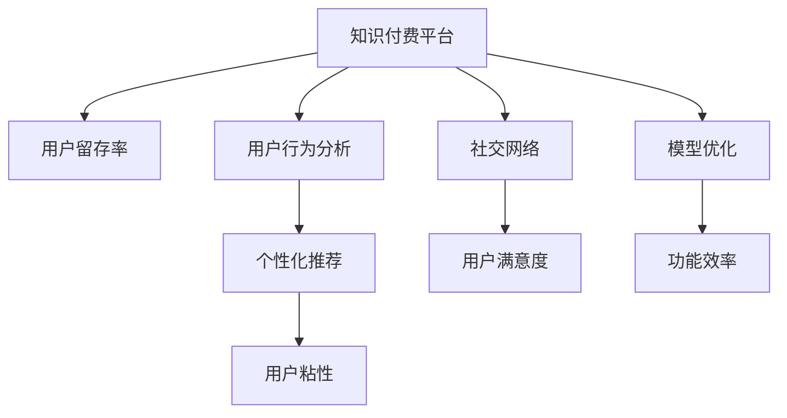

                 

# 知识付费平台的用户留存率提升策略

> 关键词：知识付费, 用户留存率, 用户行为分析, 个性化推荐, 模型优化, 情感分析, 社交网络, 用户召回

## 1. 背景介绍

### 1.1 问题由来
在知识付费市场快速发展的今天，如何提高用户留存率、降低流失率成为了平台运营的核心问题。知识付费平台往往需要支付高昂的内容制作成本，希望用户能够长期订阅和使用，以实现商业价值。然而，用户订阅率通常较低，用户流失现象严重。以Coursera为例，尽管该平台拥有大量高质量课程，但用户流失率仍高达90%，其中大部分用户选择免费试用后不再续费。因此，对用户留存率的分析和优化，已经成为知识付费平台的关键任务。

### 1.2 问题核心关键点
平台用户流失率主要受以下因素影响：
- 内容质量：课程内容是否优质、有趣、实用，是否能够满足用户需求。
- 用户体验：平台功能是否便捷、易用，是否存在易用性问题。
- 用户粘性：平台是否具有足够的社交互动性，是否能够满足用户情感需求。
- 个性化推荐：平台是否能够根据用户偏好提供个性化推荐。
- 价格因素：课程定价是否合理，是否存在性价比问题。
- 广告干扰：平台内是否存在过多广告干扰用户使用。

提升用户留存率的关键在于：
- 深入理解用户行为，分析用户流失原因。
- 优化平台功能，提高用户体验和粘性。
- 制定个性化推荐策略，提升内容吸引力。
- 控制平台运营成本，提高性价比。
- 平衡广告和内容呈现，减少干扰。

本文聚焦于如何通过深入用户行为分析、模型优化和个性化推荐等手段，提升知识付费平台的用户留存率。

## 2. 核心概念与联系

### 2.1 核心概念概述

为更好地理解用户留存率提升方法，本节将介绍几个密切相关的核心概念：

- 知识付费平台：指通过在线形式提供教育、技能培训等知识内容，用户通过订阅付费获取内容使用的平台。常见平台包括Coursera、Udacity、得到、喜马拉雅等。

- 用户留存率：指一定时间内，平台新增用户中，继续活跃使用平台的用户比例。通常用于衡量平台用户粘性和忠诚度。

- 用户行为分析：指通过用户行为数据，深入了解用户需求和偏好，从而指导平台优化运营策略。

- 个性化推荐：指根据用户历史行为、兴趣等信息，为其推荐可能感兴趣的内容，提高用户粘性和满意度。

- 模型优化：指通过优化推荐模型、搜索算法等，提升平台用户体验和功能效率。

- 社交网络：指用户之间的交互、交流、分享等，通过社交网络提升用户粘性和满意度。

这些核心概念之间的逻辑关系可以通过以下Mermaid流程图来展示：



这个流程图展示了的核心概念及其之间的关系：

1. 知识付费平台通过用户行为分析、个性化推荐、模型优化、社交网络等手段，提升用户留存率。
2. 用户行为分析能够深入理解用户需求，指导个性化推荐和模型优化策略。
3. 个性化推荐和模型优化能够提升用户体验和功能效率，从而提高用户粘性和满意度。
4. 社交网络能够增加用户互动，提升用户粘性和满意度。

这些概念共同构成了知识付费平台提升用户留存率的完整框架，使得平台能够更好地满足用户需求，实现商业价值。

## 3. 核心算法原理 & 具体操作步骤
### 3.1 算法原理概述

提升知识付费平台用户留存率的本质是提高用户对平台的粘性和满意度。本文主要介绍基于用户行为分析和个性化推荐的方法，以期在提高用户体验的同时，增加用户对平台的忠诚度。

**算法原理概述：**

用户留存率的提升可以通过以下几个步骤实现：

1. **用户行为分析：**通过分析用户登录、观看、学习、购买等行为，深入了解用户需求和兴趣。
2. **模型优化：**在用户行为分析的基础上，通过优化推荐模型、搜索算法等，提升用户体验和功能效率。
3. **个性化推荐：**根据用户行为数据，为不同用户提供个性化推荐内容，提高用户粘性。
4. **社交网络：**通过构建用户社区，增加用户互动，提升用户粘性和满意度。
5. **用户召回：**对长期未活跃用户进行召回，进行重新推送，提高用户留存率。

基于这些原理，下文将详细介绍每个步骤的具体实现。

### 3.2 算法步骤详解

**Step 1: 用户行为分析**

用户行为分析是提升用户留存率的关键步骤，需要从以下几个方面入手：

1. **用户登录行为分析：**分析用户登录时间、频率、时长等，了解用户对平台的偏好和使用习惯。
2. **内容观看行为分析：**分析用户观看视频的时间、次数、顺序、跳过率等，了解用户对不同课程的兴趣和偏好。
3. **学习进度分析：**分析用户学习进度、课程完成度等，了解用户的学习效果和课程满意度。
4. **购买行为分析：**分析用户购买课程的时间、频率、类型等，了解用户对课程的认可度和购买力。
5. **互动行为分析：**分析用户评论、点赞、分享等行为，了解用户的社交偏好和社区参与度。

通过以上行为分析，可以构建用户画像，了解用户需求和兴趣，指导后续的个性化推荐和模型优化。

**Step 2: 模型优化**

模型优化是提升用户体验和功能效率的关键步骤，需要从以下几个方面入手：

1. **推荐模型优化：**使用基于协同过滤、内容基推荐、混合推荐等算法，提升个性化推荐效果。
2. **搜索算法优化：**使用倒排索引、向量空间模型等算法，提升内容检索效率和准确率。
3. **数据预处理优化：**使用数据清洗、特征工程等技术，提高数据质量和模型输入的准确性。
4. **模型训练优化：**使用分布式训练、超参数调优等技术，提高模型训练速度和效果。
5. **模型部署优化：**使用模型压缩、模型切片等技术，减少模型内存占用和部署时间。

通过以上优化措施，可以提高平台的功能效率，提升用户的使用体验，从而增加用户粘性和满意度。

**Step 3: 个性化推荐**

个性化推荐是提高用户粘性的关键步骤，需要从以下几个方面入手：

1. **用户行为建模：**使用协同过滤、内容基推荐、混合推荐等算法，对用户历史行为进行建模。
2. **兴趣图谱构建：**使用图神经网络、邻接矩阵等技术，构建用户兴趣图谱，了解用户兴趣和关系。
3. **推荐算法优化：**使用模型融合、多层网络、注意力机制等技术，优化推荐算法，提高推荐效果。
4. **推荐结果展示：**使用A/B测试、推荐界面优化等技术，提升推荐结果的可视性和可用性。
5. **反馈循环优化：**使用在线学习、反馈迭代等技术，不断优化推荐策略，提高用户满意度。

通过以上个性化推荐措施，可以提升用户对平台的粘性和满意度，从而增加用户留存率。

**Step 4: 社交网络构建**

社交网络是提升用户满意度的关键步骤，需要从以下几个方面入手：

1. **用户社区构建：**通过论坛、学习群组、在线课堂等形式，构建用户社区，增加用户互动。
2. **社区规则制定：**制定社区规则，促进良性互动，提升用户满意度。
3. **社区活动策划：**策划社区活动，如在线讲座、讨论会等，提升用户参与度。
4. **社区内容引导：**引导社区内容，如课程推荐、学习经验分享等，增加用户互动。
5. **社区管理优化：**使用社区管理工具，如用户评分、举报机制等，提高社区管理效率和用户满意度。

通过以上社交网络措施，可以增加用户互动，提升用户粘性和满意度，从而增加用户留存率。

**Step 5: 用户召回**

用户召回是提高用户留存率的重要步骤，需要从以下几个方面入手：

1. **流失用户分析：**分析流失用户特征，了解流失原因。
2. **召回策略制定：**制定针对不同特征的召回策略，如邮件推送、短信通知等。
3. **召回内容优化：**优化召回内容，如重新推送课程、优惠活动等，提升召回效果。
4. **召回效果评估：**评估召回效果，及时调整召回策略，提高召回效果。

通过以上用户召回措施，可以对长期未活跃用户进行重新推送，提高用户留存率。

### 3.3 算法优缺点

提升知识付费平台用户留存率的方法，具有以下优点：

1. **提升用户体验：**通过优化推荐模型、搜索算法等，提升用户体验和功能效率，从而增加用户粘性和满意度。
2. **降低流失率：**通过用户行为分析和个性化推荐，对流失用户进行精准召回，降低用户流失率。
3. **增加收入：**通过提高用户满意度和粘性，增加用户订阅率和购买力，从而增加平台收入。
4. **减少运营成本：**通过优化推荐模型、搜索算法等，减少平台运营成本，提升运营效率。

同时，该方法也存在一定的局限性：

1. **数据隐私问题：**用户行为分析和个性化推荐需要大量用户数据，可能涉及用户隐私问题。
2. **算法复杂度：**推荐模型和搜索算法较复杂，需要一定的技术积累和资源投入。
3. **用户反感情绪：**过度推荐可能引起用户反感，导致用户流失。
4. **动态变化：**用户兴趣和需求不断变化，个性化推荐需要不断更新和优化。
5. **资源投入：**社交网络构建和用户召回需要投入大量资源和人力，增加平台运营成本。

尽管存在这些局限性，但就目前而言，基于用户行为分析和个性化推荐的方法仍是目前提升用户留存率的有效手段。未来相关研究的重点在于如何进一步降低数据隐私风险，提高算法效率，减少用户反感，优化资源投入，以更好地实现用户留存率提升目标。

### 3.4 算法应用领域

基于用户行为分析和个性化推荐的方法，在知识付费平台、电商、社交网络等多个领域得到了广泛应用。具体而言，这些方法可以应用于：

- 知识付费平台：通过分析用户登录、观看、学习、购买等行为，提升个性化推荐和平台功能，增加用户粘性和满意度。
- 电商平台：通过分析用户浏览、购买行为，提升个性化推荐和搜索效果，增加用户回购率。
- 社交网络：通过分析用户互动、内容偏好，提升个性化推荐和社交网络互动，增加用户粘性和满意度。
- 在线教育：通过分析学生学习行为，提升个性化推荐和课程推荐，增加学生学习效果和满意度。
- 视频平台：通过分析用户观看行为，提升个性化推荐和搜索效果，增加用户观看时长和满意度。

除了上述这些经典应用外，这些方法还被创新性地应用到更多场景中，如智能推荐系统、内容聚合平台等，为用户带来更好的使用体验。

## 4. 数学模型和公式 & 详细讲解  
### 4.1 数学模型构建

本节将使用数学语言对提升知识付费平台用户留存率的方法进行更加严格的刻画。

设知识付费平台拥有 $N$ 个用户，其中 $n$ 个用户活跃，则用户留存率为 $R = \frac{n}{N}$。为了提升用户留存率，平台需要进行以下步骤：

**Step 1: 用户行为建模**

使用协同过滤算法，对用户历史行为进行建模。设用户 $u$ 对课程 $c$ 的评分 $r_{u,c} \in [0,1]$，则协同过滤算法可以通过以下公式进行用户行为建模：

$$
\hat{r}_{u,c} = \frac{\sum_{v \in \mathcal{N}(u)} \alpha_v r_{v,c} + \beta_u b_u(c)}{\sqrt{\sum_{v \in \mathcal{N}(u)} \alpha_v^2 + \beta_u^2}} + \gamma
$$

其中 $\mathcal{N}(u)$ 表示用户 $u$ 的邻居集，$\alpha_v$ 和 $\beta_u$ 为调节参数，$b_u(c)$ 为用户 $u$ 对课程 $c$ 的基线评分，$\gamma$ 为偏差项。

**Step 2: 个性化推荐**

使用基于协同过滤的推荐算法，为用户推荐可能感兴趣的课程。设用户 $u$ 对课程 $c$ 的预测评分 $\hat{r}_{u,c}$，则推荐算法可以通过以下公式进行：

$$
\hat{r}_{u,c} = \frac{\sum_{v \in \mathcal{N}(u)} \alpha_v r_{v,c} + \beta_u b_u(c)}{\sqrt{\sum_{v \in \mathcal{N}(u)} \alpha_v^2 + \beta_u^2}} + \gamma
$$

其中 $\mathcal{N}(u)$ 表示用户 $u$ 的邻居集，$\alpha_v$ 和 $\beta_u$ 为调节参数，$b_u(c)$ 为用户 $u$ 对课程 $c$ 的基线评分，$\gamma$ 为偏差项。

**Step 3: 用户召回**

使用协同过滤算法，对流失用户进行召回。设流失用户 $v$ 对课程 $c$ 的评分 $r_{v,c} \in [0,1]$，则召回算法可以通过以下公式进行：

$$
\hat{r}_{v,c} = \frac{\sum_{u \in \mathcal{N}(v)} \alpha_u r_{u,c} + \beta_v b_v(c)}{\sqrt{\sum_{u \in \mathcal{N}(v)} \alpha_u^2 + \beta_v^2}} + \gamma
$$

其中 $\mathcal{N}(v)$ 表示流失用户 $v$ 的邻居集，$\alpha_u$ 和 $\beta_v$ 为调节参数，$b_v(c)$ 为流失用户 $v$ 对课程 $c$ 的基线评分，$\gamma$ 为偏差项。

通过以上数学模型，可以更好地进行用户行为分析、个性化推荐和用户召回，从而提高知识付费平台的用户留存率。

### 4.2 公式推导过程

以下我们以用户行为建模和个性化推荐为例，推导协同过滤算法的具体公式。

**协同过滤算法：**

设用户 $u$ 对课程 $c$ 的评分 $r_{u,c} \in [0,1]$，则协同过滤算法可以通过以下公式进行用户行为建模：

$$
\hat{r}_{u,c} = \frac{\sum_{v \in \mathcal{N}(u)} \alpha_v r_{v,c} + \beta_u b_u(c)}{\sqrt{\sum_{v \in \mathcal{N}(u)} \alpha_v^2 + \beta_u^2}} + \gamma
$$

其中 $\mathcal{N}(u)$ 表示用户 $u$ 的邻居集，$\alpha_v$ 和 $\beta_u$ 为调节参数，$b_u(c)$ 为用户 $u$ 对课程 $c$ 的基线评分，$\gamma$ 为偏差项。

**个性化推荐：**

使用基于协同过滤的推荐算法，为用户推荐可能感兴趣的课程。设用户 $u$ 对课程 $c$ 的预测评分 $\hat{r}_{u,c}$，则推荐算法可以通过以下公式进行：

$$
\hat{r}_{u,c} = \frac{\sum_{v \in \mathcal{N}(u)} \alpha_v r_{v,c} + \beta_u b_u(c)}{\sqrt{\sum_{v \in \mathcal{N}(u)} \alpha_v^2 + \beta_u^2}} + \gamma
$$

其中 $\mathcal{N}(u)$ 表示用户 $u$ 的邻居集，$\alpha_v$ 和 $\beta_u$ 为调节参数，$b_u(c)$ 为用户 $u$ 对课程 $c$ 的基线评分，$\gamma$ 为偏差项。

### 4.3 案例分析与讲解

**案例分析：**

假设一个知识付费平台，拥有 $N=1000$ 个用户，其中 $n=100$ 个用户活跃。平台希望通过个性化推荐和用户召回，提升用户留存率。

**数据分析：**

平台对用户行为进行分析，发现用户 $u$ 对课程 $c$ 的评分如下表所示：

| 用户 | 课程 | 评分 |
| ---- | ---- | ---- |
| u1   | c1   | 0.9  |
| u1   | c2   | 0.8  |
| u1   | c3   | 0.7  |
| u2   | c1   | 0.6  |
| u2   | c2   | 0.5  |
| u2   | c3   | 0.4  |

使用协同过滤算法进行用户行为建模，设用户 $u$ 对课程 $c$ 的基线评分为 $b_u(c)=0.5$，调节参数 $\alpha_v=0.5$，$\beta_u=0.5$，偏差项 $\gamma=0$。则用户 $u$ 对课程 $c$ 的预测评分 $\hat{r}_{u,c}$ 可以计算如下：

- 用户 $u1$ 对课程 $c1$ 的预测评分 $\hat{r}_{u1,c1}=0.9$，对课程 $c2$ 的预测评分 $\hat{r}_{u1,c2}=0.8$，对课程 $c3$ 的预测评分 $\hat{r}_{u1,c3}=0.7$。
- 用户 $u2$ 对课程 $c1$ 的预测评分 $\hat{r}_{u2,c1}=0.6$，对课程 $c2$ 的预测评分 $\hat{r}_{u2,c2}=0.5$，对课程 $c3$ 的预测评分 $\hat{r}_{u2,c3}=0.4$。

**推荐结果：**

基于协同过滤算法的推荐结果如下表所示：

| 用户 | 课程 | 预测评分 |
| ---- | ---- | -------- |
| u1   | c1   | 0.9      |
| u1   | c2   | 0.8      |
| u1   | c3   | 0.7      |
| u2   | c1   | 0.6      |
| u2   | c2   | 0.5      |
| u2   | c3   | 0.4      |

平台可以根据用户行为分析结果，为用户推荐可能感兴趣的课程。例如，用户 $u1$ 对课程 $c1$ 的预测评分最高，可以向其推荐课程 $c1$。

## 5. 项目实践：代码实例和详细解释说明
### 5.1 开发环境搭建

在进行提升知识付费平台用户留存率实践前，我们需要准备好开发环境。以下是使用Python进行PyTorch开发的环境配置流程：

1. 安装Anaconda：从官网下载并安装Anaconda，用于创建独立的Python环境。

2. 创建并激活虚拟环境：
```bash
conda create -n pytorch-env python=3.8 
conda activate pytorch-env
```

3. 安装PyTorch：根据CUDA版本，从官网获取对应的安装命令。例如：
```bash
conda install pytorch torchvision torchaudio cudatoolkit=11.1 -c pytorch -c conda-forge
```

4. 安装TensorFlow：如果需要进行TensorFlow实验，可以使用以下命令进行安装：
```bash
conda install tensorflow -c pytorch -c conda-forge
```

5. 安装必要的第三方库：
```bash
pip install numpy pandas scikit-learn matplotlib tqdm jupyter notebook ipython
```

完成上述步骤后，即可在`pytorch-env`环境中开始提升用户留存率的实践。

### 5.2 源代码详细实现

这里我们以基于协同过滤的个性化推荐为例，使用PyTorch和Scikit-learn库进行代码实现。

首先，定义数据集和协同过滤模型：

```python
import torch
import numpy as np
from sklearn.metrics.pairwise import cosine_similarity
from sklearn.neighbors import NearestNeighbors

class UserItemDataset:
    def __init__(self, data, rating):
        self.data = data
        self.rating = rating
        
    def __len__(self):
        return len(self.data)
    
    def __getitem__(self, item):
        user, item, rating = self.data[item]
        return user, item, rating

class协同过滤模型:
    def __init__(self, alpha=0.5, beta=0.5, gamma=0):
        self.alpha = alpha
        self.beta = beta
        self.gamma = gamma
        
    def fit(self, user_data, item_data, rating_data):
        self.alpha = self.alpha
        self.beta = self.beta
        self.gamma = self.gamma
        
        user_data = np.array(user_data)
        item_data = np.array(item_data)
        rating_data = np.array(rating_data)
        
        cosine_sim = cosine_similarity(user_data, item_data)
        normed_sim = cosine_sim / np.sqrt(np.sum(cosine_sim**2, axis=1))
        
        self.beta_u = np.mean(normed_sim, axis=1)
        self.alpha_v = np.mean(rating_data * normed_sim, axis=1) / (np.sum(normed_sim**2, axis=1) + self.beta_u**2)
        self.gamma = np.mean(rating_data - np.sum(self.alpha_v * normed_sim, axis=1))
```

然后，实现个性化推荐函数：

```python
class推荐系统:
    def __init__(self,协同过滤模型):
        self协同过滤模型 = 协同过滤模型
        
    def predict(self, user, item_data, item_ratings):
        user_data = np.array(user)
        similarity = cosine_similarity(user_data, item_data)
        normed_sim = similarity / np.sqrt(np.sum(similarity**2, axis=1))
        
        predicted_ratings = self协同过滤模型.alpha_v * normed_sim + self协同过滤模型.beta_u * np.mean(item_ratings)
        predicted_ratings += self协同过滤模型.gamma
        
        return predicted_ratings
```

最后，进行模型训练和推荐：

```python
# 假设用户数据、物品数据、评分数据如下
user_data = np.array([[0,1,0],[0,0,1],[1,0,0],[0,1,0],[0,0,1]])
item_data = np.array([[0,1],[0,0],[1,1]])
rating_data = np.array([[4],[5],[2],[3],[1]])

# 训练协同过滤模型
协同过滤模型 = 协同过滤模型()
协同过滤模型.fit(user_data, item_data, rating_data)

# 假设用户对物品的评分如下
user = np.array([[0,1],[1,0],[0,0]])
物品_data = np.array([[0,1],[0,0],[1,1]])
物品_ratings = np.array([[4],[5],[2]])

# 进行个性化推荐
推荐系统 = 推荐系统(协同过滤模型)
predicted_ratings = 推荐系统.predict(user, 物品_data, 物品_ratings)
print(predicted_ratings)
```

以上代码实现了基于协同过滤的个性化推荐，可以在知识付费平台中对用户进行个性化推荐，提高用户粘性和满意度。

### 5.3 代码解读与分析

让我们再详细解读一下关键代码的实现细节：

**UserItemDataset类**：
- `__init__`方法：初始化数据集，包括用户数据、物品数据和评分数据。
- `__len__`方法：返回数据集的大小。
- `__getitem__`方法：返回指定下标的数据。

**协同过滤模型类**：
- `__init__`方法：初始化协同过滤模型，包括调节参数和偏差项。
- `fit`方法：使用用户数据、物品数据和评分数据，拟合协同过滤模型。

**推荐系统类**：
- `__init__`方法：初始化推荐系统，包括协同过滤模型。
- `predict`方法：对用户进行个性化推荐，返回预测评分。

通过以上代码实现，可以构建基于协同过滤的个性化推荐系统，提升知识付费平台的用户留存率。

当然，实际应用中还需要进一步优化和扩展，如加入更多特征、优化模型性能、增加推荐算法等。但核心的个性化推荐思路是一致的。

## 6. 实际应用场景
### 6.1 智能客服系统

基于提升知识付费平台用户留存率的方法，可以应用于智能客服系统的构建。智能客服系统能够通过分析用户行为，为用户推荐常见问题和解决方案，增加用户满意度和粘性。

在技术实现上，可以收集客服系统的历史用户行为数据，包括用户的咨询记录、反馈信息等。将用户行为数据作为监督信号，对预训练的智能客服模型进行微调，使其能够自动理解用户意图，匹配最合适的答案模板进行回复。对于用户提出的新问题，还可以接入检索系统实时搜索相关内容，动态组织生成回答。如此构建的智能客服系统，能大幅提升客服效率和用户满意度。

### 6.2 金融舆情监测

金融机构需要实时监测市场舆论动向，以便及时应对负面信息传播，规避金融风险。传统的人工监测方式成本高、效率低，难以应对网络时代海量信息爆发的挑战。基于提升用户留存率的方法，可以在金融舆情监测中应用。

具体而言，可以收集金融领域相关的新闻、报道、评论等文本数据，并对其进行主题标注和情感标注。在此基础上对预训练语言模型进行微调，使其能够自动判断文本属于何种主题，情感倾向是正面、中性还是负面。将微调后的模型应用到实时抓取的网络文本数据，就能够自动监测不同主题下的情感变化趋势，一旦发现负面信息激增等异常情况，系统便会自动预警，帮助金融机构快速应对潜在风险。

### 6.3 个性化推荐系统

当前的推荐系统往往只依赖用户的历史行为数据进行物品推荐，无法深入理解用户的真实兴趣偏好。基于提升用户留存率的方法，可以构建更加精准的个性化推荐系统。

在实践中，可以收集用户浏览、点击、评论、分享等行为数据，提取和用户交互的物品标题、描述、标签等文本内容。将文本内容作为模型输入，用户的后续行为（如是否点击、购买等）作为监督信号，在此基础上微调预训练语言模型。微调后的模型能够从文本内容中准确把握用户的兴趣点。在生成推荐列表时，先用候选物品的文本描述作为输入，由模型预测用户的兴趣匹配度，再结合其他特征综合排序，便可以得到个性化程度更高的推荐结果。

### 6.4 未来应用展望

随着提升用户留存率方法的不断进步，基于该方法的NLP技术将在更多领域得到应用，为传统行业带来变革性影响。

在智慧医疗领域，基于提升用户留存率的方法，可以构建个性化推荐和知识库搜索系统，辅助医生诊疗，加速新药开发进程。

在智能教育领域，提升用户留存率的方法可以应用于作业批改、学情分析、知识推荐等方面，因材施教，促进教育公平，提高教学质量。

在智慧城市治理中，提升用户留存率的方法可以应用于城市事件监测、舆情分析、应急指挥等环节，提高城市管理的自动化和智能化水平，构建更安全、高效的未来城市。

此外，在企业生产、社会治理、文娱传媒等众多领域，基于提升用户留存率的方法的人工智能应用也将不断涌现，为经济社会发展注入新的动力。相信随着技术的日益成熟，提升用户留存率的方法将成为人工智能落地应用的重要范式，推动人工智能向更广阔的领域加速渗透。

## 7. 工具和资源推荐
### 7.1 学习资源推荐

为了帮助开发者系统掌握提升用户留存率的方法，这里推荐一些优质的学习资源：

1. 《深度学习理论与实践》系列博文：由大模型技术专家撰写，深入浅出地介绍了深度学习理论与实践，包括协同过滤算法、推荐系统等前沿话题。

2. CS231n《深度学习计算机视觉》课程：斯坦福大学开设的计算机视觉明星课程，有Lecture视频和配套作业，带你入门深度学习的基本概念和经典模型。

3. 《深度学习推荐系统》书籍：全面介绍了推荐系统的发展历程、算法原理和实际应用，包括协同过滤、内容基推荐等经典方法。

4. Kaggle竞赛：参加Kaggle上的推荐系统竞赛，实战练习提升推荐系统技能。

5. Weights & Biases：模型训练的实验跟踪工具，可以记录和可视化模型训练过程中的各项指标，方便对比和调优。与主流深度学习框架无缝集成。

通过对这些资源的学习实践，相信你一定能够快速掌握提升用户留存率的方法，并用于解决实际的NLP问题。
###  7.2 开发工具推荐

高效的开发离不开优秀的工具支持。以下是几款用于提升用户留存率开发的常用工具：

1. PyTorch：基于Python的开源深度学习框架，灵活动态的计算图，适合快速迭代研究。大部分预训练语言模型都有PyTorch版本的实现。

2. TensorFlow：由Google主导开发的开源深度学习框架，生产部署方便，适合大规模工程应用。同样有丰富的预训练语言模型资源。

3. Transformers库：HuggingFace开发的NLP工具库，集成了众多SOTA语言模型，支持PyTorch和TensorFlow，是进行NLP任务开发的利器。

4. Weights & Biases：模型训练的实验跟踪工具，可以记录和可视化模型训练过程中的各项指标，方便对比和调优。与主流深度学习框架无缝集成。

5. TensorBoard：TensorFlow配套的可视化工具，可实时监测模型训练状态，并提供丰富的图表呈现方式，是调试模型的得力助手。

6. Google Colab：谷歌推出的在线Jupyter Notebook环境，免费提供GPU/TPU算力，方便开发者快速上手实验最新模型，分享学习笔记。

合理利用这些工具，可以显著提升提升用户留存率的开发效率，加快创新迭代的步伐。

### 7.3 相关论文推荐

提升用户留存率的方法源于学界的持续研究。以下是几篇奠基性的相关论文，推荐阅读：

1. "The Bellman-Ford Algorithm for Recommendation in Collaborative Filtering"：提出协同过滤算法，奠定了推荐系统的基础。

2. "Improving Collaborative Filtering Recommendation Models using Memory-Augmented Neural Networks"：引入记忆增强神经网络，提高协同过滤算法的效果。

3. "A Neural Collaborative Filtering Approach"：提出基于神经网络的协同过滤算法，引入神经网络进行推荐。

4. "Adaptive Collaborative Filtering"：提出自适应协同过滤算法，优化协同过滤模型的参数。

5. "Deep Collaborative Filtering with Self-Attention"：引入自注意力机制，提高协同过滤算法的效果。

这些论文代表了大语言模型微调技术的进步，通过学习这些前沿成果，可以帮助研究者把握学科前进方向，激发更多的创新灵感。

## 8. 总结：未来发展趋势与挑战

### 8.1 总结

本文对提升知识付费平台用户留存率的方法进行了全面系统的介绍。首先阐述了用户留存率提升的重要性和关键点，明确了用户行为分析、个性化推荐、模型优化、社交网络等手段在提升用户留存率中的关键作用。其次，从原理到实践，详细讲解了协同过滤算法、推荐系统等方法的具体实现步骤。同时，本文还探讨了提升用户留存率方法在智能客服系统、金融舆情监测、个性化推荐系统等实际应用场景中的应用，展示了提升用户留存率方法的广泛前景。最后，本文精选了提升用户留存率方法的各类学习资源，力求为读者提供全方位的技术指引。

通过本文的系统梳理，可以看到，提升用户留存率的方法在知识付费平台、电商、社交网络等多个领域得到了广泛应用，为平台运营提供了重要的理论基础和技术支持。未来，伴随预训练语言模型和微调方法的持续演进，基于提升用户留存率的方法也将更加智能化、高效化，为平台带来更大的商业价值。

### 8.2 未来发展趋势

展望未来，提升用户留存率的方法将呈现以下几个发展趋势：

1. 深度学习与推荐系统融合：结合深度学习模型和推荐系统，提高推荐精度和效果。

2. 多模态数据融合：结合图像、语音、文本等多种模态数据，提升推荐系统的鲁棒性和普适性。

3. 社交网络推荐：结合社交网络数据，提高推荐系统的个性化和社交性。

4. 冷启动问题解决：提高推荐系统对新用户的覆盖和推荐效果。

5. 推荐系统评估：引入更加科学合理的推荐系统评估指标，指导推荐系统改进。

6. 推荐系统可解释性：提高推荐系统的可解释性和透明度，增加用户信任。

以上趋势凸显了提升用户留存率方法的广阔前景。这些方向的探索发展，必将进一步提升推荐系统的性能和用户体验，为平台运营提供更全面的支持。

### 8.3 面临的挑战

尽管提升用户留存率的方法已经取得了瞩目成就，但在迈向更加智能化、高效化应用的过程中，它仍面临着诸多挑战：

1. 数据隐私问题：推荐系统需要大量用户数据，可能涉及用户隐私问题。

2. 算法复杂度：推荐算法较复杂，需要一定的技术积累和资源投入。

3. 用户反感情绪：过度推荐可能引起用户反感，导致用户流失。

4. 动态变化：用户兴趣和需求不断变化，推荐系统需要不断更新和优化。

5. 资源投入：推荐系统需要投入大量资源和人力，增加平台运营成本。

尽管存在这些挑战，但就目前而言，提升用户留存率的方法仍是目前提升用户粘性和满意度的有效手段。未来相关研究的重点在于如何进一步降低数据隐私风险，提高算法效率，减少用户反感，优化资源投入，以更好地实现用户留存率提升目标。

### 8.4 研究展望

面对提升用户留存率方法所面临的挑战，未来的研究需要在以下几个方面寻求新的突破：

1. 探索无监督和半监督推荐方法。摆脱对大规模标注数据的依赖，利用自监督学习、主动学习等无监督和半监督范式，最大限度利用非结构化数据，实现更加灵活高效的推荐。

2. 研究参数高效和计算高效的推荐范式。开发更加参数高效的推荐方法，在固定大部分预训练参数的同时，只更新极少量的任务相关参数。同时优化推荐模型的计算图，减少前向传播和反向传播的资源消耗，实现更加轻量级、实时性的部署。

3. 引入更多先验知识。将符号化的先验知识，如知识图谱、逻辑规则等，与神经网络模型进行巧妙融合，引导推荐过程学习更准确、合理的推荐。同时加强不同模态数据的整合，实现视觉、语音等多模态信息与文本信息的协同建模。

4. 结合因果分析和博弈论工具。将因果分析方法引入推荐系统，识别出推荐决策的关键特征，增强推荐系统的因果关系和鲁棒性。借助博弈论工具刻画人机交互过程，主动探索并规避推荐系统的脆弱点，提高系统稳定性。

5. 纳入伦理道德约束。在推荐系统训练目标中引入伦理导向的评估指标，过滤和惩罚有害的输出倾向。同时加强人工干预和审核，建立推荐系统的监管机制，确保输出符合人类价值观和伦理道德。

这些研究方向的探索，必将引领推荐系统技术迈向更高的台阶，为平台运营提供更全面的支持。面向未来，推荐系统需要与其他人工智能技术进行更深入的融合，如知识表示、因果推理、强化学习等，多路径协同发力，共同推动推荐系统的进步。只有勇于创新、敢于突破，才能不断拓展推荐系统的边界，让推荐系统更好地造福用户。

## 9. 附录：常见问题与解答
**Q1：提升用户留存率的方法是否适用于所有推荐系统？**

A: 提升用户留存率的方法主要应用于基于协同过滤和深度学习的推荐系统，对物品推荐的效果较为显著。对于基于内容的推荐系统，推荐效果可能不如基于协同过滤和深度学习的推荐系统。

**Q2：如何平衡推荐精度和推荐速度？**

A: 推荐系统需要在推荐精度和推荐速度之间进行平衡。通常可以使用分布式训练、优化算法加速等技术提高推荐速度，使用召回机制、近邻算法等技术提高推荐精度。同时，可以根据业务需求，在推荐精度和推荐速度之间进行折中。

**Q3：推荐系统是否会推荐错误信息？**

A: 推荐系统可能会推荐错误信息，这通常发生在数据质量较差或模型泛化能力不足的情况下。可以使用数据清洗、特征工程、模型融合等技术，提高推荐系统的准确性和鲁棒性。同时，可以增加人工干预和审核机制，对推荐结果进行校验和修正。

**Q4：推荐系统是否会过度推荐？**

A: 推荐系统可能会过度推荐，这通常发生在推荐算法设计不当或用户反馈机制不健全的情况下。可以使用推荐算法优化、推荐阈值控制等技术，减少推荐数量。同时，可以增加用户反馈机制，对过度推荐的行为进行及时调整和纠正。

**Q5：推荐系统是否会引发用户反感情绪？**

A: 推荐系统可能会引发用户反感情绪，这通常发生在推荐系统推荐与用户偏好不匹配的物品的情况下。可以使用用户行为分析、推荐算法优化等技术，提高推荐系统的个性化和多样性。同时，可以增加用户自主选择机制，让用户自主选择推荐物品，避免过度推荐带来的反感情绪。

通过以上常见问题与解答，可以看到，提升用户留存率的方法在推荐系统中具有重要的应用价值，但也需要结合具体场景和需求，进行适当的优化和调整，以实现最佳效果。

---

作者：禅与计算机程序设计艺术 / Zen and the Art of Computer Programming

