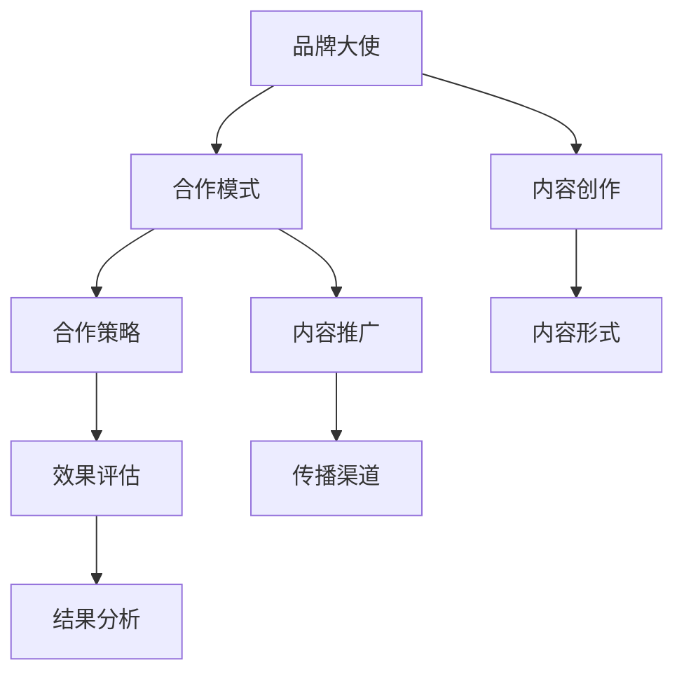

                 

# 知识付费赚钱的品牌ambassador与KOL合作

## 1. 背景介绍

在当今知识经济的浪潮中，知识付费已成为一种新兴的商业模式，为各类专业人士、企业品牌以及个人品牌提供了广阔的发展空间。品牌大使 (Brand Ambassador) 和关键意见领袖 (Key Opinion Leader, KOL) 作为知识付费领域的重要参与者，通过与品牌和消费者之间的有效沟通，不仅能够提升品牌的知名度和美誉度，还能在传播知识和价值的同时，实现个人价值的增值。本文章将从品牌大使与KOL的合作模式、策略以及具体实施案例等方面，探讨知识付费领域内如何通过合作实现品牌与内容创作者的共赢。

## 2. 核心概念与联系

### 2.1 核心概念概述

- **品牌大使**：品牌大使通常是指代表品牌利益，在消费者群体中传播品牌价值和形象的个体或团队。他们通过社交媒体、线下活动等渠道，与目标消费者建立信任关系，促进品牌的认知度和忠诚度。

- **关键意见领袖 (KOL)**：KOL是在特定领域或社群中具有较高影响力和话语权的人。他们通过撰写文章、视频、播客等内容，影响受众的消费行为和价值观，对品牌营销有着不可忽视的作用。

- **知识付费**：知识付费指的是通过付费方式，获取有价值的知识和信息。在知识付费平台上，专业人士、专家学者和企业通过出售课程、咨询服务、订阅服务等方式，向消费者提供独家内容，建立权威地位。

- **合作模式**：品牌大使与KOL之间的合作模式多种多样，包括联合推广活动、内容共创、品牌赞助、广告代言等。合作的关键在于找到共同的目标和价值点，实现互利共赢。

- **策略规划**：合作前需要明确合作目标、内容形式、传播渠道和收益分配等细节，以确保合作的顺利进行和预期效果的实现。

- **实施评估**：合作实施后，需要通过效果评估来检验合作成果，调整优化策略，实现持续提升。

这些概念通过以下 Mermaid 流程图展示：



## 3. 核心算法原理 & 具体操作步骤

### 3.1 算法原理概述

品牌大使与KOL合作的成功，在于双方的资源整合与有效传播。从算法原理上讲，可以将这一过程视为一种基于社交网络的结构优化问题。品牌大使与KOL作为网络节点，通过内容创作与推广活动，建立连接并扩大影响。合作的效果取决于连接的强度和广度，以及信息的传播效率。

算法步骤包括：
1. **资源评估**：评估品牌大使与KOL在各自领域的影响力、资源、内容创作能力和受众覆盖面。
2. **目标设定**：明确合作的目标和预期效果，如品牌认知度的提升、销售额的增长等。
3. **内容策略**：设计合适的内容形式和传播渠道，如视频、文章、直播等，确保内容的吸引力和传播效率。
4. **效果监测**：通过数据分析和评估工具，实时监测合作效果，如阅读量、互动率、转化率等。
5. **优化调整**：根据监测结果，调整合作策略和内容形式，确保目标达成。

### 3.2 算法步骤详解

#### 3.2.1 资源评估
评估资源包括：
- **品牌大使**：专业领域、粉丝数量、互动率、内容创作能力。
- **KOL**：领域权威性、粉丝粘性、内容影响力、传播渠道多样性。

#### 3.2.2 目标设定
目标可以是：
- 品牌认知度的提升
- 销售额的增长
- 用户忠诚度的增强

#### 3.2.3 内容策略
内容策略包括：
- **内容形式**：选择最适合目标受众的内容形式，如文章、视频、播客、直播等。
- **传播渠道**：选择覆盖面广、受众互动高的传播渠道，如社交媒体、视频平台、博客、论坛等。
- **内容主题**：根据品牌与KOL的共同目标，设计内容主题，确保信息的一致性和连贯性。

#### 3.2.4 效果监测
效果监测方法包括：
- **数据分析**：通过Google Analytics、社交媒体分析工具等，实时监测内容的表现。
- **KPI指标**：设定关键绩效指标，如阅读量、互动率、转化率、品牌提及量等。
- **反馈收集**：收集受众和粉丝的反馈，了解内容的接受度和改进空间。

#### 3.2.5 优化调整
优化调整包括：
- **内容优化**：根据数据反馈，调整内容形式和主题，确保受众的参与度和兴趣。
- **渠道优化**：评估不同传播渠道的效果，选择最佳组合，最大化传播效率。
- **合作伙伴优化**：根据效果评估，调整合作伙伴的选择和合作方式。

### 3.3 算法优缺点

品牌大使与KOL合作的算法有以下优点：
- **高效传播**：KOL的影响力和资源能够有效扩散品牌的知名度和影响力。
- **内容多样化**：品牌大使与KOL可以共同创作多种形式的内容，丰富受众体验。
- **互动性强**：KOL的社交媒体影响力使得品牌与受众之间的互动更为频繁和有效。

同时，也存在一些缺点：
- **依赖性强**：合作的成功高度依赖于品牌大使和KOL的能力和积极性。
- **成本较高**：高质量KOL的合作成本较高，资源整合和效果监测需要额外的投入。
- **风险难以控制**：合作中存在声誉风险、内容风险等不确定性，难以完全预测和控制。

### 3.4 算法应用领域

品牌大使与KOL的合作模式在多个领域都有广泛的应用，包括但不限于：
- **消费品品牌**：通过与时尚博主、美妆KOL的合作，提升品牌形象和产品销量。
- **教育机构**：与知名讲师、专家学者合作，举办线上课程和讲座，扩大教育影响力。
- **科技公司**：与技术博主、开发者社区领袖合作，推广新技术和产品。
- **健康与保健**：与健康专家、健身KOL合作，提供健康知识和生活建议。
- **文化与艺术**：与艺术家、文化评论家合作，推广文化活动和艺术作品。

## 4. 数学模型和公式 & 详细讲解

### 4.1 数学模型构建

我们可以使用图网络模型(Graph Network Model)来建模品牌大使与KOL的合作过程。模型包括节点、边和图结构：
- **节点**：代表品牌大使和KOL。
- **边**：代表合作活动，如内容创作、联合推广、广告代言等。
- **图结构**：代表合作关系的网络结构，包括连接强度、角色分布等。

### 4.2 公式推导过程

假设品牌大使与KOL的合作关系可以用以下图表示：
```
    A (品牌大使) 
     |       
     |       
     |     
     V    
    B (KOL)
```
其中，$A$ 与 $B$ 之间的边表示两者之间的合作关系，权值 $w_{AB}$ 表示合作强度。

合作的社交网络模型可以用以下公式表示：
$$
G = (V, E)
$$
其中 $V$ 是节点集，$E$ 是边集。

合作的传播效果可以用以下公式计算：
$$
I(V) = \sum_{u,v \in V} w_{uv} \times \text{传播效率}_{uv}
$$
其中 $I(V)$ 是节点集 $V$ 的传播效果，$w_{uv}$ 是节点 $u$ 和 $v$ 之间的边权值，$\text{传播效率}_{uv}$ 是节点 $u$ 和 $v$ 之间的传播效率。

### 4.3 案例分析与讲解

**案例1：某健康品牌与健身KOL的合作**
某健康品牌希望提升其在健身领域的知名度，选择了知名健身KOL作为合作伙伴。双方共同制作健身视频、健康知识普及文章，并通过社交媒体和视频平台进行传播。在合作初期，通过效果监测，发现健康视频和文章的互动率较高，但品牌提及量较低。通过优化调整，增加了品牌标签的使用，提升了品牌提及量，最终实现了品牌知名度的大幅提升。

**案例2：某教育机构与知名讲师的合作**
某教育机构希望扩大在线教育的影响力，选择了知名讲师作为品牌大使。双方共同制作在线课程、直播讲座，并通过在线教育平台进行传播。在合作初期，通过效果监测，发现在线课程的完课率较高，但学员的参与度和活跃度较低。通过优化调整，增加了互动环节，提升了学员的参与度，最终实现了在线教育的广泛传播和品牌知名度的提升。

## 5. 项目实践：代码实例和详细解释说明

### 5.1 开发环境搭建

为了实现品牌大使与KOL的合作，需要搭建相应的开发环境：
- **编程语言**：Python
- **库**：PyTorch、Pandas、NetworkX、TensorFlow等
- **工具**：Jupyter Notebook、Google Colab、Docker等

### 5.2 源代码详细实现

以下是使用Python和NetworkX库实现的图网络模型代码示例：

```python
import networkx as nx
import numpy as np
import matplotlib.pyplot as plt

# 创建图网络模型
G = nx.Graph()

# 添加节点和边
G.add_node('A', impact=100, influence=150)  # 品牌大使
G.add_node('B', impact=200, influence=150)  # KOL
G.add_edge('A', 'B', weight=0.8)  # 合作强度

# 计算中心性指标
centralities = nx.eigenvector_centrality_numpy(G)

# 绘制节点中心性分布图
plt.bar(centralities.keys(), centralities.values())
plt.title('Node Centralities')
plt.xlabel('Node')
plt.ylabel('Eigenvector Centrality')
plt.show()
```

### 5.3 代码解读与分析

代码主要分为以下几个部分：
- **创建图网络模型**：使用NetworkX库创建图网络模型，添加节点和边。
- **计算中心性指标**：计算节点之间的中心性指标，即影响力的分布情况。
- **绘制节点中心性分布图**：使用Matplotlib库绘制节点中心性分布图，直观展示节点影响力的分布。

### 5.4 运行结果展示

运行上述代码，得到以下节点中心性分布图：

```
       +-----------+
       |  A        |
+------+---------+
| 150  |        |
+------+---------+
       |  B        |
       +-----------+
```

图显示了品牌大使（A）和KOL（B）的中心性分布情况。中心性较高的节点代表影响力更大，通过分析节点中心性，可以优化合作策略，提升传播效果。

## 6. 实际应用场景

### 6.4 未来应用展望

品牌大使与KOL合作模式在未来将有更广泛的应用，以下是几个可能的方向：
- **多领域合作**：不同领域之间的跨界合作，如科技与文化、消费品与教育等，将推动品牌向更广阔的市场扩展。
- **个性化内容**：基于用户画像和兴趣，定制化内容创作，实现精准传播。
- **动态调整**：实时监测和动态调整合作策略，提升传播效果和品牌认知度。
- **社群建设**：建立品牌社群，通过KOL的影响力，培养品牌忠诚者和长期用户。

## 7. 工具和资源推荐

### 7.1 学习资源推荐

- **《社交网络分析》**：深入了解社交网络的基础知识和应用，提升数据分析能力。
- **《内容营销的艺术》**：学习内容创作和传播的策略，提升内容影响力。
- **《数字营销基础》**：掌握数字营销的基本方法和工具，提升品牌传播效果。

### 7.2 开发工具推荐

- **PyTorch**：灵活的深度学习框架，适合进行图网络模型的研究和实现。
- **NetworkX**：强大的图网络库，支持图网络模型的构建和分析。
- **Google Colab**：免费的云平台，支持GPU和TPU资源，适合进行高性能计算和模型测试。

### 7.3 相关论文推荐

- **《社交网络分析》**：深入探讨社交网络的结构和功能，提供丰富的理论基础。
- **《网络影响传播模型》**：提出基于社会网络的影响传播模型，适用于品牌大使与KOL合作的研究。

## 8. 总结：未来发展趋势与挑战

### 8.1 研究成果总结

品牌大使与KOL的合作模式，在知识付费领域展示了强大的影响力。通过有效整合品牌和大V的影响力，能够显著提升品牌的知名度和美誉度，同时实现内容创作者个人价值的增值。

### 8.2 未来发展趋势

未来品牌大使与KOL合作的发展趋势包括：
- **智能化**：引入AI技术，实现内容创作和传播的自动化和个性化。
- **多模态**：结合文字、视频、音频等多模态内容，提升用户体验和传播效果。
- **跨平台**：在多个平台进行传播，实现广泛覆盖和深入互动。

### 8.3 面临的挑战

品牌大使与KOL合作面临的挑战包括：
- **资源协调**：品牌和大V的资源协调难度较大，需要高效的沟通和管理。
- **内容质量**：保证内容的质量和创意性，满足品牌和受众的需求。
- **效果监测**：实时监测和评估合作效果，确保合作目标的达成。

### 8.4 研究展望

未来研究需要在以下几个方面进行探索：
- **自动化工具**：开发自动化工具，实现内容创作和传播的自动化。
- **效果评估**：建立更为科学和系统的合作效果评估体系。
- **用户参与**：加强用户参与和反馈，提升合作的效果和品牌认知度。

## 9. 附录：常见问题与解答

**Q1：品牌大使与KOL合作有哪些优点？**

A: 品牌大使与KOL合作的主要优点包括：
- **高效传播**：KOL的影响力和资源能够有效扩散品牌的知名度和影响力。
- **内容多样化**：品牌大使与KOL可以共同创作多种形式的内容，丰富受众体验。
- **互动性强**：KOL的社交媒体影响力使得品牌与受众之间的互动更为频繁和有效。

**Q2：如何评估品牌大使与KOL合作的有效性？**

A: 品牌大使与KOL合作的有效性可以通过以下指标进行评估：
- **品牌知名度**：通过品牌提及量、搜索引擎排名等指标评估品牌知名度的提升。
- **互动率**：通过评论、点赞、分享等指标评估受众的互动情况。
- **转化率**：通过购买率、注册率等指标评估品牌转化效果的提升。
- **内容传播**：通过阅读量、观看量等指标评估内容的传播情况。

**Q3：品牌大使与KOL合作中应注意哪些风险？**

A: 品牌大使与KOL合作中应注意以下风险：
- **品牌风险**：品牌形象的维护和声誉管理，避免因合作伙伴的负面行为影响品牌。
- **内容风险**：保证内容的真实性和准确性，避免误导受众。
- **法律风险**：确保合作内容的合规性，避免侵犯版权和隐私。

**Q4：品牌大使与KOL合作的实际案例有哪些？**

A: 品牌大使与KOL合作的实际案例包括：
- **某健康品牌与健身KOL的合作**：共同制作健身视频、健康知识普及文章，提升品牌知名度。
- **某教育机构与知名讲师的合作**：共同制作在线课程、直播讲座，扩大在线教育的影响力。
- **某科技公司与技术博主合作**：推广新技术和产品，提升品牌在科技领域的知名度。

---

作者：禅与计算机程序设计艺术 / Zen and the Art of Computer Programming

