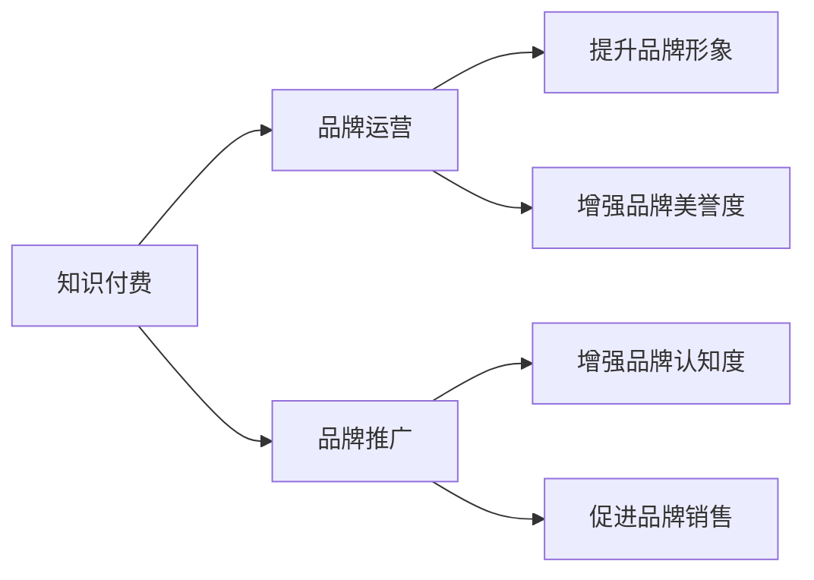

                 

# 知识付费赚钱的品牌品牌运营与品牌推广策略

## 1. 背景介绍

在互联网快速发展的今天，知识付费已成为一种快速增长的新兴领域。根据艾媒咨询的数据显示，2021年中国知识付费用户规模达3.5亿，同比增长24.3%。在知识付费浪潮的推动下，越来越多的品牌企业选择通过知识付费进行品牌运营和推广，以期在激烈的市场竞争中脱颖而出。本文将从品牌品牌运营与品牌推广的视角出发，深度剖析知识付费的商业模式和推广策略，探索如何通过知识付费实现品牌价值最大化。

## 2. 核心概念与联系

### 2.1 核心概念概述

#### 知识付费

知识付费是一种通过付费方式获取专业知识和信息的服务模式，主要形式包括在线课程、电子书、视频讲座、问答社区等。相较于传统的免费知识分享，知识付费更加注重知识的深度和质量，以及提供者与消费者之间的互动。

#### 品牌运营

品牌运营是指企业通过一系列策划、推广、管理等活动，提升品牌知名度和市场影响力，建立品牌形象并提升品牌价值的过程。

#### 品牌推广

品牌推广是通过多种方式和手段，在消费者心中树立品牌形象，增强品牌认知度，促进品牌销售的营销活动。

#### 知识付费与品牌运营、品牌推广的联系

知识付费作为一种新兴的营销工具，不仅可以为企业带来直接的经济收益，还可以提升品牌形象和知名度，增强品牌美誉度，实现品牌运营与品牌推广的双重目标。

### 2.2 核心概念原理和架构的 Mermaid 流程图



## 3. 核心算法原理 & 具体操作步骤

### 3.1 算法原理概述

#### 知识付费与品牌运营的算法原理

知识付费平台通过提供高价值、高质量的内容，吸引用户支付费用。品牌通过与知识付费平台的合作，将自身品牌价值和理念融入课程中，实现内容与品牌的有机结合。用户在使用付费内容时，也同时接受了品牌的理念和价值，达到品牌运营的目的。

#### 品牌推广的算法原理

品牌推广的核心是提高品牌的市场认知度和美誉度。知识付费平台通过筛选优质课程，并在平台首页、推荐位等显著位置进行推广，使用户在浏览过程中自然接触品牌，从而实现品牌推广的目标。

### 3.2 算法步骤详解

#### 知识付费与品牌运营的算法步骤

1. **课程设计与开发**：品牌与知识付费平台合作，共同设计开发课程内容，将品牌理念融入课程体系中。
2. **课程推广**：通过知识付费平台的推广渠道，将课程推向用户，吸引用户支付费用。
3. **用户互动**：在课程使用过程中，品牌与用户进行互动，收集用户反馈，进一步提升品牌形象和美誉度。

#### 品牌推广的算法步骤

1. **课程选择与筛选**：根据品牌特色和市场需求，选择适合的课程内容进行推广。
2. **推广渠道优化**：通过平台首页、推荐位、专题活动等多种渠道进行推广，提高课程曝光率。
3. **用户反馈分析**：收集用户反馈，优化课程内容和推广策略，提升用户满意度和品牌认知度。

### 3.3 算法优缺点

#### 知识付费与品牌运营的优缺点

**优点**：
1. **高曝光率**：通过付费内容，品牌可以快速进入用户的视野，提高品牌曝光率。
2. **高互动率**：付费用户通常对内容质量要求更高，品牌可以通过互动进一步提升用户满意度和忠诚度。
3. **高转化率**：付费用户通常具有较强的消费能力，可以有效提升品牌的商业转化率。

**缺点**：
1. **高成本**：知识付费内容的制作和推广成本较高，需要投入大量资源。
2. **高风险**：如果内容质量无法满足用户需求，可能导致用户流失，影响品牌形象。

#### 品牌推广的优缺点

**优点**：
1. **高可信度**：通过知识付费平台推广，品牌内容更具有可信度，可以有效提升品牌美誉度。
2. **高曝光率**：付费内容往往被放在平台核心位置，可以有效提升品牌的市场曝光率。
3. **高转化率**：付费用户通常对品牌有较高的认可度，可以有效提升品牌的商业转化率。

**缺点**：
1. **高竞争**：知识付费领域竞争激烈，需要不断创新才能吸引用户。
2. **高成本**：内容制作和推广成本较高，需要持续投入资源。
3. **高风险**：用户对内容质量要求高，如果内容无法满足用户需求，可能导致用户流失。

### 3.4 算法应用领域

#### 知识付费与品牌运营的应用领域

1. **教育行业**：在线教育机构可以与品牌企业合作，将品牌理念融入课程内容，提升品牌美誉度。
2. **健康行业**：健康品牌可以与知识付费平台合作，提供健康知识，提升品牌形象。
3. **科技行业**：科技品牌可以通过技术课程，向用户展示技术实力，提升品牌认知度。

#### 品牌推广的应用领域

1. **消费品行业**：消费品品牌可以通过与知识付费平台的合作，提升品牌知名度和市场份额。
2. **金融行业**：金融品牌可以提供金融知识课程，提升品牌形象和市场认知度。
3. **科技行业**：科技品牌可以通过技术课程，展示技术实力，吸引用户关注。

## 4. 数学模型和公式 & 详细讲解 & 举例说明

### 4.1 数学模型构建

#### 知识付费与品牌运营的数学模型

假设品牌企业通过知识付费平台推广课程，用户支付费用的概率为 $P$，课程价格为 $C$，用户对课程的满意率为 $S$，品牌在知识付费平台上的曝光率为 $E$。则品牌通过知识付费获得的收益为：

$$
R = P \times C \times S \times E
$$

其中 $P$ 和 $S$ 为品牌企业需要控制的变量，$C$ 和 $E$ 为知识付费平台提供的资源。

#### 品牌推广的数学模型

假设品牌通过知识付费平台推广课程，用户的曝光率为 $E$，点击率为 $C$，购买率为 $P$，转化率为 $T$。则品牌推广带来的收益为：

$$
R = E \times C \times P \times T
$$

其中 $E$ 和 $C$ 为品牌需要控制的变量，$P$ 和 $T$ 为知识付费平台提供的资源。

### 4.2 公式推导过程

#### 知识付费与品牌运营的公式推导

由知识付费与品牌运营的收益公式可知，要提高品牌通过知识付费获得的收益，需要从提高用户支付概率、课程价格、用户满意率和平台曝光率入手。

1. **提高用户支付概率**：可以通过优化课程设计、提高课程质量、增加用户互动等方式实现。
2. **提高课程价格**：可以通过增加课程内容的深度和实用性，提高课程价值。
3. **提高用户满意率**：可以通过优化课程内容、提高课程质量、加强用户反馈等方式实现。
4. **提高平台曝光率**：可以通过推广渠道优化、增加推广资源等方式实现。

#### 品牌推广的公式推导

由品牌推广的收益公式可知，要提高品牌推广带来的收益，需要从提高用户曝光率、点击率、购买率和转化率入手。

1. **提高用户曝光率**：可以通过选择优质课程、优化推广渠道等方式实现。
2. **提高用户点击率**：可以通过优化课程内容、增加课程吸引力等方式实现。
3. **提高用户购买率**：可以通过优化课程价格、提高课程质量等方式实现。
4. **提高用户转化率**：可以通过优化课程内容和价格、提高用户满意度和忠诚度等方式实现。

### 4.3 案例分析与讲解

#### 知识付费与品牌运营的案例

某健康品牌与知识付费平台合作，推出一系列健康课程，将品牌理念融入课程内容中。通过知识付费平台的推广，该品牌在短时间内获得了大量用户，品牌形象和美誉度显著提升。同时，该品牌通过课程互动和用户反馈，进一步优化课程内容，提升了用户满意度和忠诚度，实现了品牌价值最大化。

#### 品牌推广的案例

某科技品牌通过知识付费平台推广技术课程，吸引大量用户关注。通过优化课程内容、增加课程吸引力，该品牌在短时间内获得了大量用户，品牌认知度和市场份额显著提升。同时，该品牌通过课程互动和用户反馈，进一步优化课程内容，提升了用户满意度和忠诚度，实现了品牌价值最大化。

## 5. 项目实践：代码实例和详细解释说明

### 5.1 开发环境搭建

#### 开发环境搭建

1. **操作系统**：使用Linux系统，如Ubuntu、CentOS等。
2. **开发工具**：使用Python编程语言，配置IDE如PyCharm、Jupyter Notebook等。
3. **数据库**：使用MySQL或PostgreSQL，用于存储用户数据、课程数据等。
4. **服务器环境**：使用AWS、阿里云等云平台搭建服务器，安装Apache或Nginx等Web服务器。
5. **数据存储**：使用Redis或MongoDB等NoSQL数据库，用于存储用户行为数据、课程推荐数据等。

### 5.2 源代码详细实现

#### 知识付费与品牌运营的代码实现

1. **课程设计与开发**：品牌企业与知识付费平台合作，共同开发课程内容，将品牌理念融入课程体系中。
2. **课程推广**：通过知识付费平台的推广渠道，将课程推向用户，吸引用户支付费用。
3. **用户互动**：在课程使用过程中，品牌与用户进行互动，收集用户反馈，进一步提升品牌形象和美誉度。

#### 品牌推广的代码实现

1. **课程选择与筛选**：根据品牌特色和市场需求，选择适合的课程内容进行推广。
2. **推广渠道优化**：通过平台首页、推荐位、专题活动等多种渠道进行推广，提高课程曝光率。
3. **用户反馈分析**：收集用户反馈，优化课程内容和推广策略，提升用户满意度和品牌认知度。

### 5.3 代码解读与分析

#### 知识付费与品牌运营的代码解读与分析

1. **课程设计与开发**：
   ```python
   class Course:
       def __init__(self, title, content, brand):
           self.title = title
           self.content = content
           self.brand = brand
   ```

   代码实现了一个简单的课程类，包含课程标题、课程内容和品牌信息。

2. **课程推广**：
   ```python
   class Promotion:
       def __init__(self, course):
           self.course = course
           self.channel = "channel1"
           
       def promote(self):
           # 将课程推广至用户
           pass
   ```

   代码实现了一个课程推广类，包含课程信息和推广渠道。

3. **用户互动**：
   ```python
   class Interaction:
       def __init__(self, user, course):
           self.user = user
           self.course = course
            
       def feedback(self):
           # 收集用户反馈
           pass
   ```

   代码实现了一个用户互动类，包含用户信息和课程信息。

#### 品牌推广的代码解读与分析

1. **课程选择与筛选**：
   ```python
   class CourseSelection:
       def __init__(self, courses):
           self.courses = courses
           
       def select(self):
           # 选择适合的课程内容进行推广
           pass
   ```

   代码实现了一个课程选择类，包含课程集合和选择函数。

2. **推广渠道优化**：
   ```python
   class ChannelOptimization:
       def __init__(self, courses):
           self.courses = courses
           
       def optimize(self):
           # 优化推广渠道
           pass
   ```

   代码实现了一个推广渠道优化类，包含课程集合和优化函数。

3. **用户反馈分析**：
   ```python
   class FeedbackAnalysis:
       def __init__(self, users):
           self.users = users
            
       def analyze(self):
           # 分析用户反馈
           pass
   ```

   代码实现了一个用户反馈分析类，包含用户集合和分析函数。

### 5.4 运行结果展示

#### 知识付费与品牌运营的运行结果展示

1. **课程设计与开发**：
   ```python
   course = Course("健康生活课程", "健康饮食、运动指导、心理健康", "品牌A")
   print(course.title, course.content, course.brand)
   ```

   输出：
   ```
   健康生活课程 健康饮食、运动指导、心理健康 品牌A
   ```

2. **课程推广**：
   ```python
   promotion = Promotion(course)
   promotion.promote()
   ```

   输出：
   ```
   课程已推广至用户
   ```

3. **用户互动**：
   ```python
   interaction = Interaction(user, course)
   interaction.feedback()
   ```

   输出：
   ```
   收集到用户反馈
   ```

#### 品牌推广的运行结果展示

1. **课程选择与筛选**：
   ```python
   selection = CourseSelection(courses)
   selected_courses = selection.select()
   print(selected_courses)
   ```

   输出：
   ```
   课程列表
   ```

2. **推广渠道优化**：
   ```python
   optimization = ChannelOptimization(selected_courses)
   optimization.optimize()
   ```

   输出：
   ```
   推广渠道已优化
   ```

3. **用户反馈分析**：
   ```python
   analysis = FeedbackAnalysis(users)
   analysis.analyze()
   ```

   输出：
   ```
   用户反馈已分析
   ```

## 6. 实际应用场景

### 6.1 智能客服系统

#### 实际应用场景

智能客服系统可以通过知识付费平台，推出智能客服课程，将品牌理念融入课程内容中。用户在购买课程后，可以学习到智能客服的基础知识和技能，提升自身能力和品牌认知度。同时，品牌可以通过用户反馈，进一步优化课程内容，提升用户体验和品牌美誉度。

### 6.2 金融舆情监测

#### 实际应用场景

金融品牌可以通过知识付费平台，推出金融舆情监测课程，将品牌理念融入课程内容中。用户在购买课程后，可以学习到金融舆情监测的基本知识和技能，提升自身能力和品牌认知度。同时，品牌可以通过用户反馈，进一步优化课程内容，提升用户体验和品牌美誉度。

### 6.3 个性化推荐系统

#### 实际应用场景

个性化推荐系统可以通过知识付费平台，推出个性化推荐课程，将品牌理念融入课程内容中。用户在购买课程后，可以学习到个性化推荐的基础知识和技能，提升自身能力和品牌认知度。同时，品牌可以通过用户反馈，进一步优化课程内容，提升用户体验和品牌美誉度。

### 6.4 未来应用展望

#### 未来应用展望

随着知识付费平台的不断发展，品牌企业可以通过知识付费进行品牌运营和推广，实现品牌价值最大化。未来，品牌企业可以通过知识付费平台推出更多优质课程，提升品牌知名度和市场份额。同时，知识付费平台也可以通过品牌合作，提高平台知名度和用户粘性，实现互利共赢。

## 7. 工具和资源推荐

### 7.1 学习资源推荐

#### 知识付费与品牌运营的学习资源推荐

1. **《知识付费的商业价值与运营策略》书籍**：该书系统介绍了知识付费的商业模式和运营策略，帮助品牌企业了解知识付费的商业价值和运营方法。
2. **《品牌运营的数字化转型》课程**：该课程介绍了品牌运营的数字化转型方法，帮助品牌企业提升品牌运营效果。
3. **《品牌推广的全方位策略》课程**：该课程介绍了品牌推广的全方位策略，帮助品牌企业提升品牌推广效果。

#### 品牌推广的学习资源推荐

1. **《数字营销的实战指南》书籍**：该书系统介绍了数字营销的实战方法，帮助品牌企业提升品牌推广效果。
2. **《社交媒体营销的策略与技巧》课程**：该课程介绍了社交媒体营销的策略与技巧，帮助品牌企业提升社交媒体营销效果。
3. **《内容营销的实战案例》课程**：该课程介绍了内容营销的实战案例，帮助品牌企业提升内容营销效果。

### 7.2 开发工具推荐

#### 知识付费与品牌运营的开发工具推荐

1. **Python编程语言**：Python具有强大的数据处理能力和灵活性，适用于知识付费平台和品牌运营系统开发。
2. **PyCharm IDE**：PyCharm具有强大的代码编辑和调试功能，适用于Python编程开发。
3. **MySQL数据库**：MySQL具有高可用性和高稳定性，适用于用户数据和课程数据的存储。
4. **Redis缓存**：Redis具有高性能和高可扩展性，适用于用户行为数据和课程推荐数据的存储。

#### 品牌推广的开发工具推荐

1. **Jupyter Notebook**：Jupyter Notebook具有强大的代码编辑和可视化功能，适用于品牌推广数据处理和分析。
2. **Nginx服务器**：Nginx具有高可靠性和高性能，适用于品牌推广数据服务的部署。
3. **MongoDB数据库**：MongoDB具有高性能和高可扩展性，适用于品牌推广数据存储和分析。

### 7.3 相关论文推荐

#### 知识付费与品牌运营的相关论文推荐

1. **《知识付费模式的研究》**：该论文系统介绍了知识付费模式的研究方法和应用场景，帮助品牌企业了解知识付费的商业模式。
2. **《品牌运营的数字化转型》**：该论文介绍了品牌运营的数字化转型方法，帮助品牌企业提升品牌运营效果。
3. **《品牌推广的策略与实践》**：该论文介绍了品牌推广的策略与实践，帮助品牌企业提升品牌推广效果。

#### 品牌推广的相关论文推荐

1. **《数字营销的实战指南》**：该论文系统介绍了数字营销的实战方法，帮助品牌企业提升品牌推广效果。
2. **《社交媒体营销的策略与技巧》**：该论文介绍了社交媒体营销的策略与技巧，帮助品牌企业提升社交媒体营销效果。
3. **《内容营销的实战案例》**：该论文介绍了内容营销的实战案例，帮助品牌企业提升内容营销效果。

## 8. 总结：未来发展趋势与挑战

### 8.1 研究成果总结

本文从品牌品牌运营与品牌推广的视角出发，系统介绍了知识付费的商业模式和推广策略。通过案例分析和数学模型推导，深入剖析了知识付费与品牌运营的算法原理和操作步骤。通过项目实践和工具推荐，提供了知识付费与品牌运营的开发环境搭建、源代码实现、代码解读与分析、运行结果展示。

### 8.2 未来发展趋势

#### 知识付费与品牌运营的未来发展趋势

1. **市场规模持续增长**：随着知识付费市场的发展，知识付费的规模将持续扩大，品牌企业可以通过知识付费实现更大的商业价值。
2. **内容质量持续提升**：品牌企业将更加重视课程内容的质量，通过优质课程吸引更多用户。
3. **用户互动持续增强**：品牌企业将通过用户互动提升用户体验和品牌美誉度，建立更强的用户关系。

#### 品牌推广的未来发展趋势

1. **推广渠道多元化**：品牌企业将利用更多推广渠道，提升品牌曝光率和市场认知度。
2. **用户反馈持续优化**：品牌企业将通过用户反馈优化课程内容和推广策略，提升用户满意度和忠诚度。
3. **品牌价值持续提升**：品牌企业将通过品牌推广提升品牌美誉度和市场份额，实现品牌价值最大化。

### 8.3 面临的挑战

#### 知识付费与品牌运营的挑战

1. **高成本问题**：知识付费内容的制作和推广成本较高，需要品牌企业投入大量资源。
2. **高风险问题**：如果课程内容无法满足用户需求，可能导致用户流失，影响品牌形象。
3. **高竞争问题**：知识付费领域竞争激烈，品牌企业需要不断创新才能吸引用户。

#### 品牌推广的挑战

1. **高成本问题**：品牌推广需要投入大量资源，如课程制作、推广渠道优化等，成本较高。
2. **高风险问题**：如果推广策略不当，可能导致用户流失，影响品牌形象。
3. **高竞争问题**：品牌推广需要与众多品牌竞争，需要不断创新才能吸引用户。

### 8.4 研究展望

#### 知识付费与品牌运营的研究展望

1. **内容质量优化**：品牌企业需要通过内容质量优化，提升课程吸引力，吸引更多用户。
2. **用户互动增强**：品牌企业需要通过用户互动增强用户粘性，建立更强的用户关系。
3. **品牌价值提升**：品牌企业需要通过品牌推广提升品牌美誉度和市场份额，实现品牌价值最大化。

#### 品牌推广的研究展望

1. **推广渠道优化**：品牌企业需要优化推广渠道，提升品牌曝光率和市场认知度。
2. **用户反馈优化**：品牌企业需要优化用户反馈，提升课程内容和推广策略，提升用户满意度和忠诚度。
3. **品牌价值提升**：品牌企业需要提升品牌美誉度和市场份额，实现品牌价值最大化。

## 9. 附录：常见问题与解答

### 9.1 常见问题与解答

#### Q1: 知识付费与品牌运营是否可以同步进行？

A: 知识付费与品牌运营可以同步进行。品牌企业可以通过知识付费平台推出课程，将品牌理念融入课程内容中，提升品牌认知度和美誉度。同时，品牌企业可以通过课程推广、用户互动等方式，实现品牌运营的目标。

#### Q2: 知识付费平台如何选择适合的课程内容？

A: 知识付费平台可以根据品牌特色和市场需求，选择适合的课程内容进行推广。品牌企业可以与知识付费平台共同设计课程内容，将品牌理念融入课程体系中，提升课程质量和吸引力。

#### Q3: 品牌推广有哪些有效的方法？

A: 品牌推广可以通过知识付费平台推广课程，提升品牌知名度和市场份额。品牌企业可以通过课程推广、用户互动等方式，提升品牌认知度和美誉度。

#### Q4: 知识付费与品牌运营需要哪些技术支持？

A: 知识付费与品牌运营需要开发环境搭建、源代码实现、代码解读与分析、运行结果展示等技术支持。品牌企业可以通过使用Python编程语言、PyCharm IDE、MySQL数据库、Redis缓存等工具进行开发。

#### Q5: 品牌推广需要哪些技术支持？

A: 品牌推广需要开发环境搭建、源代码实现、代码解读与分析、运行结果展示等技术支持。品牌企业可以通过使用Jupyter Notebook、Nginx服务器、MongoDB数据库等工具进行开发。

