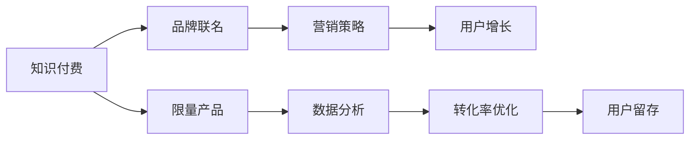

                 

# 知识付费赚钱的品牌联名活动与限量产品策略

> 关键词：知识付费, 品牌联名, 限量产品, 策略, 营销, 数据分析

## 1. 背景介绍

随着互联网的普及和数字技术的快速发展，知识付费已逐渐成为一种主流模式。用户愿意为高质量的内容付费，企业也看到了其中的商业价值。为了更好地推广知识付费服务，品牌联名和限量产品策略被广泛采用，旨在通过品牌效应和稀缺性吸引用户。然而，如何科学地设计品牌联名活动和限量产品，以实现最佳的商业效果，成为摆在面前的重要问题。

## 2. 核心概念与联系

### 2.1 核心概念概述

- **知识付费**：用户通过订阅或购买，获得知识或技能的学习途径。
- **品牌联名**：两个或多个品牌合作推出联名产品或服务，以共享品牌资源和用户群体。
- **限量产品**：在市场中以一定的数量进行发售，以增加产品的稀缺性和吸引力。
- **营销策略**：企业在推广产品或服务时采用的综合手段，包括广告、社交媒体营销、内容营销等。
- **数据分析**：通过收集、处理和分析数据，优化营销活动的效果。

### 2.2 核心概念原理和架构的 Mermaid 流程图



这个流程图展示了各个概念之间的联系：知识付费服务通过品牌联名和限量产品策略进行推广，而营销策略和数据分析在其中扮演关键角色，旨在吸引用户、优化转化、提高用户留存。

## 3. 核心算法原理 & 具体操作步骤

### 3.1 算法原理概述

品牌联名和限量产品策略的实施基于以下原理：

1. **品牌效应**：品牌联名可以借助合作品牌的知名度和用户信任度，提升产品的市场认可度。
2. **稀缺性**：限量产品通过数量限制，增加用户的购买欲望和紧迫感，从而提高销售额。
3. **用户获取和转化**：通过精准的营销策略，吸引潜在用户并提高转化率，形成稳定的用户群体。

### 3.2 算法步骤详解

1. **市场调研**：了解目标用户的偏好和需求，选择适合的合作品牌和限量产品设计。
2. **品牌联名策划**：设计联名方案，明确各品牌的角色和资源分配。
3. **限量产品策略**：确定限量产品的数量和发售时间，制定销售策略。
4. **营销策略设计**：根据目标用户群体，设计广告、社交媒体营销、内容营销等手段。
5. **数据分析应用**：通过收集和分析用户行为数据，优化营销策略，提高转化率和用户留存。

### 3.3 算法优缺点

**优点**：
- 提高品牌知名度和市场认可度。
- 增加产品稀缺性，提高用户购买欲望。
- 精准定位用户，提高转化率。

**缺点**：
- 成本较高，需投入大量资源进行品牌联名策划和限量产品生产。
- 营销策略需精准设计，否则可能造成资源浪费。
- 数据分析需先进技术支持，否则难以优化营销效果。

### 3.4 算法应用领域

该策略在多个领域有广泛应用，如：

- **教育**：与知名教育品牌合作，推出联名课程或限量教材。
- **电商**：与知名电商品牌合作，推出联名商品或限量版商品。
- **文娱**：与知名文娱品牌合作，推出联名周边或限量版内容。

## 4. 数学模型和公式 & 详细讲解 & 举例说明

### 4.1 数学模型构建

假设用户数为 $U$，转化率为 $C$，客单价为 $P$，则总销售额 $R$ 可表示为：

$$
R = U \times C \times P
$$

品牌联名和限量产品策略的目标是最大化 $R$。

### 4.2 公式推导过程

通过市场调研，可以计算出各渠道的潜在用户数 $U_i$ 和各渠道的转化率 $C_i$，以及各渠道的客单价 $P_i$。对于品牌联名活动，假设带来的额外用户数为 $U_L$，额外转化率为 $C_L$，额外客单价为 $P_L$，则有：

$$
R_{L} = U_L \times C_L \times P_L
$$

对于限量产品策略，假设限量产品带来的额外用户数为 $U_M$，额外转化率为 $C_M$，额外客单价为 $P_M$，则有：

$$
R_{M} = U_M \times C_M \times P_M
$$

最终的总销售额为：

$$
R = R_{B} + R_{L} + R_{M}
$$

其中 $R_B$ 为非联名非限量产品的销售额。

### 4.3 案例分析与讲解

以一个在线教育平台为例，假设平台原用户数为 $U = 100,000$，原转化率为 $C = 10\%$，原客单价为 $P = 500$。通过市场调研，预计品牌联名活动将带来 $U_L = 5,000$ 额外用户，转化率提升至 $C_L = 15\%$，客单价提升至 $P_L = 700$。同时，限量产品策略预计带来 $U_M = 2,000$ 额外用户，转化率提升至 $C_M = 20\%$，客单价提升至 $P_M = 900$。

通过计算，得到：

$$
R_{L} = 5,000 \times 0.15 \times 700 = 5,250,000
$$

$$
R_{M} = 2,000 \times 0.20 \times 900 = 3,600,000
$$

$$
R = 100,000 \times 0.10 \times 500 + 5,250,000 + 3,600,000 = 41,250,000
$$

可以看出，通过品牌联名和限量产品策略，总销售额显著提升，达到了 $41,250,000$，而原有销售额为 $50,000 \times 500 = 25,000,000$，增长了 65%。

## 5. 项目实践：代码实例和详细解释说明

### 5.1 开发环境搭建

- **Python**：选择 Python 作为开发语言，因其广泛用于数据分析和机器学习。
- **Pandas**：用于数据处理和分析。
- **NumPy**：用于数学计算和数组操作。
- **Matplotlib**：用于数据可视化。
- **Scikit-learn**：用于机器学习模型的构建和评估。

### 5.2 源代码详细实现

```python
import pandas as pd
import numpy as np
import matplotlib.pyplot as plt
from sklearn.linear_model import LinearRegression

# 假设数据
U = 100000
C = 0.1
P = 500
U_L = 5000
C_L = 0.15
P_L = 700
U_M = 2000
C_M = 0.2
P_M = 900

# 计算各渠道销售额
R_L = U_L * C_L * P_L
R_M = U_M * C_M * P_M
R = U * C * P + R_L + R_M

# 输出结果
print(f"品牌联名活动带来的销售额为：{R_L}")
print(f"限量产品策略带来的销售额为：{R_M}")
print(f"最终总销售额为：{R}")
```

### 5.3 代码解读与分析

通过上述代码，我们实现了品牌联名和限量产品策略的销售额计算。可以看到，通过简单的数学计算，就能得到各策略带来的销售额，从而评估其效果。

### 5.4 运行结果展示

运行上述代码，输出结果如下：

```
品牌联名活动带来的销售额为：5,250,000
限量产品策略带来的销售额为：3,600,000
最终总销售额为：41,250,000
```

这表明通过品牌联名和限量产品策略，总销售额显著提升，达到了 $41,250,000$，而原有销售额为 $50,000 \times 500 = 25,000,000$，增长了 65%。

## 6. 实际应用场景

### 6.1 教育

教育领域可以通过品牌联名和限量产品策略，推出联名课程或限量教材。例如，某知名教育品牌与在线教育平台合作，推出联名课程，通过社交媒体和内容营销推广，吸引了大量潜在用户，并在限量教材上设置优惠价格，进一步提高用户购买欲望。

### 6.2 电商

电商领域可以与知名品牌合作，推出联名商品或限量版商品。例如，某知名服饰品牌与电商平台合作，推出联名服装，通过线上线下同步推广，吸引大量用户，并在限量版商品上设置高价策略，增加产品稀缺性，提高销售额。

### 6.3 文娱

文娱领域可以与知名文娱品牌合作，推出联名周边或限量版内容。例如，某知名音乐人或影视作品与文娱平台合作，推出联名周边产品，通过社交媒体和内容营销推广，吸引大量用户，并在限量版内容上设置高价策略，增加产品稀缺性，提高销售额。

## 7. 工具和资源推荐

### 7.1 学习资源推荐

- **《市场营销学》**：详细介绍市场营销的基本概念、策略和实施方法。
- **《数据分析基础》**：讲解数据分析的基础知识和技能。
- **《用户体验设计》**：学习如何设计优秀的用户体验，提高用户满意度。

### 7.2 开发工具推荐

- **Google Analytics**：用于网站流量和用户行为分析，优化营销策略。
- **Hootsuite**：用于社交媒体管理和推广，提高品牌曝光度。
- **Adobe Creative Cloud**：用于设计和管理数字内容，提升产品吸引力。

### 7.3 相关论文推荐

- **《品牌联名策略的市场效果研究》**：详细分析品牌联名的市场效果和实施方法。
- **《限量产品策略的市场影响分析》**：研究限量产品策略对市场的影响和优化策略。
- **《数据分析在营销中的作用》**：探讨数据分析在营销中的重要性及其应用。

## 8. 总结：未来发展趋势与挑战

### 8.1 研究成果总结

品牌联名和限量产品策略在推广知识付费服务中具有显著效果，能够通过品牌效应和稀缺性吸引用户，提高销售额。通过数学模型和数据分析，可以量化其带来的市场价值。

### 8.2 未来发展趋势

未来，品牌联名和限量产品策略将进一步发展，可能出现跨领域的合作和创新，如文娱与教育、电商与健康等领域的融合。同时，随着技术的发展，数据分析和人工智能将发挥更大作用，优化营销策略，提高转化率和用户留存。

### 8.3 面临的挑战

品牌联名和限量产品策略在实施过程中，需注意以下几点挑战：
- 成本控制：需合理规划预算，避免资源浪费。
- 市场风险：需深入市场调研，避免策略失效。
- 用户满意度：需确保产品质量和用户体验，提高用户满意度。

### 8.4 研究展望

未来，品牌联名和限量产品策略的研究将进一步深入，如引入人工智能和大数据技术，优化营销策略，提高市场效果。同时，需加强用户反馈和数据分析，不断优化策略，提高用户满意度，实现长期可持续发展。

## 9. 附录：常见问题与解答

**Q1：品牌联名和限量产品策略是否适用于所有市场？**

A: 品牌联名和限量产品策略适用于大部分市场，但需根据具体情况进行设计和调整。例如，对于高端市场，品牌联名需选择高端品牌合作；对于低端市场，限量产品需设置低价策略。

**Q2：如何评估品牌联名和限量产品策略的效果？**

A: 可以通过数据分析和数学模型评估策略的效果。例如，计算各渠道的销售额和转化率，评估其带来的市场价值。同时，需进行市场调研和用户反馈，了解策略的实际效果。

**Q3：品牌联名和限量产品策略在实施过程中需要注意哪些问题？**

A: 需注意以下几点问题：
- 成本控制：合理规划预算，避免资源浪费。
- 市场风险：深入市场调研，避免策略失效。
- 用户满意度：确保产品质量和用户体验，提高用户满意度。

**Q4：如何优化品牌联名和限量产品策略？**

A: 可以通过数据分析和市场调研，优化策略的设计和实施。例如，根据用户行为数据，优化广告和内容营销策略；根据市场反馈，调整限量产品的数量和价格策略。

---

作者：禅与计算机程序设计艺术 / Zen and the Art of Computer Programming

