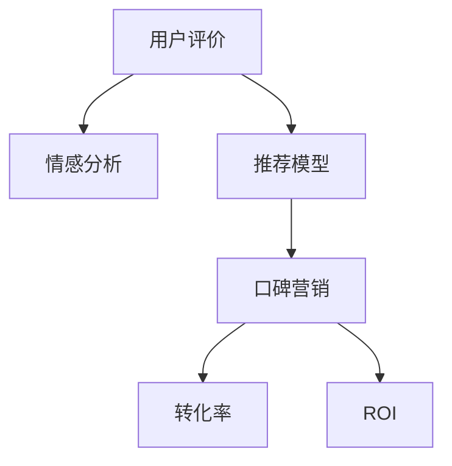

                 

# 知识付费赚钱的用户评价管理与口碑营销策略

## 1. 背景介绍

### 1.1 问题由来
随着知识付费市场的兴起，越来越多的用户开始通过订阅、付费课程等方式获取专业知识和技能，以满足个人职业发展和学习需求。然而，知识付费产品良莠不齐，用户在选择和评价产品时面临巨大的信息过载和决策困难。为了解决这个问题，各大知识付费平台纷纷在用户评价和口碑营销上发力，希望通过用户反馈来筛选优质产品，提升平台的用户粘性和品牌影响力。

### 1.2 问题核心关键点
知识付费用户评价管理与口碑营销的核心关键点在于：
1. **收集和分析用户评价数据**：构建用户评价收集系统，对用户评论进行情感分析和主题分类。
2. **构建用户评价模型**：基于用户评价数据，构建推荐模型，帮助用户找到最适合自己的课程。
3. **口碑营销策略**：利用用户评价数据进行市场推广，吸引新用户，提升品牌形象。

### 1.3 问题研究意义
知识付费用户评价管理与口碑营销研究对于提升用户满意度、优化产品推荐、增加平台收入等方面具有重要意义：
1. **提高用户满意度**：通过分析用户评价数据，平台可以快速响应用户需求，优化产品内容和形式，提高用户满意度。
2. **优化产品推荐**：基于用户评价构建推荐模型，可以更准确地为用户推荐个性化课程，提高用户转化率。
3. **增加平台收入**：通过口碑营销策略，吸引更多新用户，提升平台品牌知名度和市场份额，从而增加平台收入。

## 2. 核心概念与联系

### 2.1 核心概念概述

为更好地理解用户评价管理与口碑营销的策略，本节将介绍几个密切相关的核心概念：

- **用户评价(User Feedback)**：用户对知识付费产品（如课程、文章、音频等）的评价和反馈，包含情感、满意度、推荐度等信息。
- **情感分析(Emotion Analysis)**：通过自然语言处理技术，从用户评论中提取情感倾向（如正面、负面、中性），辅助产品优化和营销策略制定。
- **推荐模型(Recommendation Model)**：基于用户评价数据构建的推荐算法，用于预测用户对课程的评分和偏好，从而进行个性化推荐。
- **口碑营销(Word-of-Mouth Marketing)**：通过用户的正面评价传播，吸引新用户，提升品牌影响力和用户粘性。
- **转化率(Conversion Rate)**：用户完成支付购买行为的比例，是衡量营销效果的关键指标。
- **ROI(Return on Investment)**：投资回报率，衡量平台在用户评价管理与口碑营销上的收益与成本比例。

这些核心概念之间的逻辑关系可以通过以下Mermaid流程图来展示：



这个流程图展示了一些关键概念之间的逻辑联系：

1. 用户评价通过情感分析被理解，用于产品优化和推荐模型构建。
2. 推荐模型基于用户评价数据，用于个性化推荐，提高转化率。
3. 口碑营销通过用户评价传播，提升品牌影响力，间接提高转化率和ROI。

## 3. 核心算法原理 & 具体操作步骤
### 3.1 算法原理概述

知识付费用户评价管理与口碑营销的核心算法主要包括以下几个步骤：

1. **用户评价收集与预处理**：构建评价收集系统，对用户评论进行数据清洗和预处理，包括去除噪声、文本分词、去停用词等。
2. **情感分析与分类**：使用自然语言处理技术，从用户评论中提取情感倾向，并进行主题分类，如课程内容、讲师水平、互动效果等。
3. **推荐模型训练**：基于用户评价数据，训练推荐模型，如协同过滤、基于内容的推荐、深度学习等，预测用户对课程的评分和偏好。
4. **口碑营销策略制定**：通过用户评价数据，选择高评分课程进行市场推广，吸引新用户。
5. **效果评估与优化**：定期评估推荐和营销效果，根据用户反馈不断优化算法和策略。

### 3.2 算法步骤详解

#### 3.2.1 用户评价收集与预处理

用户评价收集系统应包含以下模块：
- **数据接口**：提供API接口，方便用户提交评价。
- **存储管理**：将收集到的评价数据进行存储和分类，方便后续分析。
- **数据清洗**：去除恶意评论、噪声数据，处理数据缺失和异常值。
- **文本分词**：对用户评论进行分词处理，提取关键词和短语。
- **去停用词**：去除常见停用词，如“好”、“不错”等，避免对情感分析产生干扰。

#### 3.2.2 情感分析与分类

情感分析与分类主要包括以下步骤：
1. **情感词典**：构建情感词典，包含正向和负向情感词。
2. **情感强度计算**：根据情感词典和用户评论，计算情感强度，量化用户情感倾向。
3. **情感分类**：根据情感强度，将用户评论分为正面、负面、中性三类。

#### 3.2.3 推荐模型训练

推荐模型训练主要包括以下步骤：
1. **特征工程**：提取课程的特征，如标题、作者、评分、时长等。
2. **数据划分**：将用户评价数据划分为训练集和测试集。
3. **模型选择**：选择合适的推荐算法，如协同过滤、基于内容的推荐、深度学习等。
4. **模型训练**：在训练集上训练推荐模型，得到模型的参数。
5. **模型评估**：在测试集上评估模型效果，选择合适的评估指标，如准确率、召回率、F1值等。

#### 3.2.4 口碑营销策略制定

口碑营销策略制定主要包括以下步骤：
1. **高评分课程选择**：根据用户评价数据，选择高评分课程。
2. **市场推广**：通过社交媒体、广告、邮件等方式，对高评分课程进行推广。
3. **用户邀请**：利用用户评价中的推荐度信息，邀请高评分课程的忠实用户进行推广。

#### 3.2.5 效果评估与优化

效果评估与优化主要包括以下步骤：
1. **用户反馈收集**：通过问卷调查、用户评价等方式，收集用户对推荐和营销策略的反馈。
2. **效果指标分析**：分析推荐模型和营销策略的效果指标，如转化率、ROI、用户满意度等。
3. **模型优化**：根据用户反馈和效果指标，优化推荐模型和营销策略。

### 3.3 算法优缺点

知识付费用户评价管理与口碑营销的算法具有以下优点：
1. **提高用户满意度**：通过情感分析和个性化推荐，提高用户对课程的满意度。
2. **优化产品推荐**：基于用户评价构建推荐模型，提升推荐精度和用户转化率。
3. **提升品牌形象**：利用用户口碑进行市场推广，提升品牌影响力和用户粘性。

同时，该算法也存在一定的局限性：
1. **数据质量依赖**：算法的效果高度依赖于用户评价的质量，低质量评价可能影响推荐和营销效果。
2. **冷启动问题**：新课程可能缺乏用户评价，难以通过推荐和口碑营销策略吸引用户。
3. **模型过拟合风险**：模型可能在特定数据上表现良好，但在新数据上泛化性能差。
4. **成本投入高**：构建评价收集系统和推荐模型需要较高的技术投入和数据成本。

尽管存在这些局限性，但就目前而言，用户评价管理与口碑营销的算法仍是大规模知识付费平台的重要范式。未来相关研究的重点在于如何进一步提高数据质量，优化模型和算法，降低成本投入，同时兼顾推荐效果和营销效果。

### 3.4 算法应用领域

用户评价管理与口碑营销算法已经在知识付费、电商、旅游等多个领域得到了广泛的应用，具体包括：

- **知识付费**：对付费课程进行评价管理，基于用户评价进行个性化推荐和市场推广。
- **电商平台**：对商品进行评价管理，基于用户评价进行商品推荐和用户转化。
- **旅游平台**：对旅游产品进行评价管理，基于用户评价进行个性化推荐和口碑营销。
- **在线教育**：对在线课程进行评价管理，基于用户评价进行个性化推荐和市场推广。
- **文化创意**：对文艺作品进行评价管理，基于用户评价进行文艺作品推荐和用户转化。

这些领域的应用展示了用户评价管理与口碑营销算法的强大生命力和广泛适用性。随着技术的发展和应用的深入，相信算法将会在更多领域大放异彩，为各行各业带来新的增长点。

## 4. 数学模型和公式 & 详细讲解 & 举例说明

### 4.1 数学模型构建

用户评价管理与口碑营销的数学模型主要包括以下几个关键组件：

1. **用户评价矩阵**：将用户对课程的评分和评价转换为矩阵形式，方便计算和分析。
2. **情感强度矩阵**：基于情感词典和用户评论，计算情感强度，生成情感强度矩阵。
3. **推荐模型矩阵**：使用推荐算法，训练推荐模型，生成推荐模型矩阵。

#### 4.1.1 用户评价矩阵

用户评价矩阵 $\mathbf{R}$ 定义为：

$$
\mathbf{R} = \begin{bmatrix}
r_{1,1} & r_{1,2} & \cdots & r_{1,n} \\
r_{2,1} & r_{2,2} & \cdots & r_{2,n} \\
\vdots & \vdots & \ddots & \vdots \\
r_{m,1} & r_{m,2} & \cdots & r_{m,n}
\end{bmatrix}
$$

其中 $m$ 为用户数量，$n$ 为课程数量，$r_{i,j}$ 表示用户 $i$ 对课程 $j$ 的评分或评价。

#### 4.1.2 情感强度矩阵

情感强度矩阵 $\mathbf{E}$ 定义为：

$$
\mathbf{E} = \begin{bmatrix}
e_{1,1} & e_{1,2} & \cdots & e_{1,n} \\
e_{2,1} & e_{2,2} & \cdots & e_{2,n} \\
\vdots & \vdots & \ddots & \vdots \\
e_{m,1} & e_{m,2} & \cdots & e_{m,n}
\end{bmatrix}
$$

其中 $e_{i,j}$ 表示用户 $i$ 对课程 $j$ 的情感强度，可以通过情感词典和用户评论计算得到。

#### 4.1.3 推荐模型矩阵

推荐模型矩阵 $\mathbf{W}$ 定义为：

$$
\mathbf{W} = \begin{bmatrix}
w_{1,1} & w_{1,2} & \cdots & w_{1,n} \\
w_{2,1} & w_{2,2} & \cdots & w_{2,n} \\
\vdots & \vdots & \ddots & \vdots \\
w_{m,1} & w_{m,2} & \cdots & w_{m,n}
\end{bmatrix}
$$

其中 $w_{i,j}$ 表示课程 $j$ 对用户 $i$ 的推荐分数，可以通过推荐算法训练得到。

### 4.2 公式推导过程

#### 4.2.1 用户评价矩阵计算

用户评价矩阵 $\mathbf{R}$ 的计算公式为：

$$
r_{i,j} = s_{i,j} - \mu_i
$$

其中 $s_{i,j}$ 表示用户 $i$ 对课程 $j$ 的评分，$\mu_i$ 表示用户 $i$ 的评分均值。

#### 4.2.2 情感强度矩阵计算

情感强度矩阵 $\mathbf{E}$ 的计算公式为：

$$
e_{i,j} = \sum_k d_k \cdot t_k
$$

其中 $d_k$ 表示情感词典中情感词的权重，$t_k$ 表示用户在评论中出现情感词的频率。

#### 4.2.3 推荐模型矩阵计算

推荐模型矩阵 $\mathbf{W}$ 的计算公式为：

$$
w_{i,j} = \alpha \cdot f(\mathbf{R}, \mathbf{E}, \mathbf{F})
$$

其中 $\alpha$ 表示推荐模型系数，$f(\mathbf{R}, \mathbf{E}, \mathbf{F})$ 表示推荐模型的计算函数，可以使用协同过滤、基于内容的推荐、深度学习等算法。

### 4.3 案例分析与讲解

假设某知识付费平台收集了用户对100门课程的评价数据，构建了用户评价矩阵 $\mathbf{R}$ 和情感强度矩阵 $\mathbf{E}$。现基于这些数据，使用协同过滤算法训练推荐模型，生成推荐模型矩阵 $\mathbf{W}$。

1. **数据准备**：构建用户评价矩阵 $\mathbf{R}$ 和情感强度矩阵 $\mathbf{E}$。
2. **模型训练**：使用协同过滤算法，在用户评价矩阵 $\mathbf{R}$ 和情感强度矩阵 $\mathbf{E}$ 上训练推荐模型。
3. **推荐计算**：在测试集上使用推荐模型计算用户对课程的推荐分数，生成推荐模型矩阵 $\mathbf{W}$。
4. **结果展示**：将推荐分数转换为推荐列表，展示给用户。

### 5. 项目实践：代码实例和详细解释说明

#### 5.1 开发环境搭建

在进行项目实践前，我们需要准备好开发环境。以下是使用Python进行项目开发的环境配置流程：

1. 安装Anaconda：从官网下载并安装Anaconda，用于创建独立的Python环境。

2. 创建并激活虚拟环境：
```bash
conda create -n project-env python=3.8 
conda activate project-env
```

3. 安装PyTorch：根据CUDA版本，从官网获取对应的安装命令。例如：
```bash
conda install pytorch torchvision torchaudio cudatoolkit=11.1 -c pytorch -c conda-forge
```

4. 安装其他必要的库：
```bash
pip install numpy pandas scikit-learn sklearn-umfpack transformers
```

完成上述步骤后，即可在`project-env`环境中开始项目实践。

#### 5.2 源代码详细实现

以下是一个使用PyTorch进行用户评价管理与口碑营销的代码实现示例：

```python
import torch
from sklearn.metrics import precision_recall_fscore_support
from sklearn.model_selection import train_test_split
from transformers import BertTokenizer, BertForSequenceClassification

# 加载数据集
train_data, test_data = load_dataset('path/to/dataset')

# 数据预处理
tokenizer = BertTokenizer.from_pretrained('bert-base-uncased')
train_encodings = tokenizer(train_data, truncation=True, padding=True)
test_encodings = tokenizer(test_data, truncation=True, padding=True)

# 构建模型
model = BertForSequenceClassification.from_pretrained('bert-base-uncased', num_labels=2)
model.to(device)

# 模型训练
optimizer = torch.optim.Adam(model.parameters(), lr=2e-5)
loss_fn = torch.nn.CrossEntropyLoss()
for epoch in range(epochs):
    model.train()
    for batch in train_dataloader:
        input_ids = batch['input_ids'].to(device)
        attention_mask = batch['attention_mask'].to(device)
        labels = batch['labels'].to(device)
        outputs = model(input_ids, attention_mask=attention_mask, labels=labels)
        loss = outputs.loss
        optimizer.zero_grad()
        loss.backward()
        optimizer.step()

# 模型评估
model.eval()
predictions = []
labels = []
for batch in test_dataloader:
    input_ids = batch['input_ids'].to(device)
    attention_mask = batch['attention_mask'].to(device)
    outputs = model(input_ids, attention_mask=attention_mask)
    logits = outputs.logits.argmax(dim=1).to('cpu').tolist()
    labels = batch['labels'].to('cpu').tolist()
    for logit, label in zip(logits, labels):
        predictions.append(logit)
        labels.append(label)

# 计算评估指标
precision, recall, f1, _ = precision_recall_fscore_support(labels, predictions, average='macro')
print(f'Precision: {precision:.2f}, Recall: {recall:.2f}, F1 Score: {f1:.2f}')
```

#### 5.3 代码解读与分析

让我们再详细解读一下关键代码的实现细节：

**数据预处理**：
- `load_dataset`方法：加载用户评价数据集，并分为训练集和测试集。
- `BertTokenizer`类：用于将文本转换为模型所需的输入格式。
- `tokenizer`：初始化分词器，将用户评论转换为分词序列。
- `train_encodings`和`test_encodings`：将分词序列转换为模型所需的输入张量。

**模型构建**：
- `BertForSequenceClassification`类：用于构建序列分类模型，用于情感分析。
- `model`：初始化模型，并迁移到指定设备。
- `optimizer`：初始化优化器，用于模型参数的更新。
- `loss_fn`：定义损失函数，用于模型训练。

**模型训练**：
- 循环遍历训练集数据，在每个批次上进行前向传播和反向传播。
- `model.train()`：将模型设置为训练模式。
- `model.eval()`：将模型设置为评估模式，计算预测结果。
- `optimizer.zero_grad()`：清空优化器的梯度缓存。
- `loss.backward()`：计算损失函数对模型参数的梯度。
- `optimizer.step()`：更新模型参数。

**模型评估**：
- `predictions`和`labels`：存储模型预测结果和真实标签。
- `precision_recall_fscore_support`方法：计算精确率、召回率和F1分数。
- 输出评估指标，展示模型效果。

可以看到，PyTorch配合Transformer库使得用户评价管理与口碑营销的实现变得简洁高效。开发者可以将更多精力放在数据处理、模型改进等高层逻辑上，而不必过多关注底层的实现细节。

当然，工业级的系统实现还需考虑更多因素，如模型的保存和部署、超参数的自动搜索、更灵活的任务适配层等。但核心的算法逻辑基本与此类似。

## 6. 实际应用场景

### 6.1 知识付费平台

知识付费平台可以利用用户评价管理与口碑营销技术，实现以下应用：
1. **课程推荐**：基于用户评价和情感分析，推荐适合用户的高评分课程。
2. **用户画像**：分析用户评价，构建用户画像，提供个性化课程推荐。
3. **口碑营销**：利用高评分课程的用户评价进行市场推广，吸引新用户。
4. **满意度调查**：通过用户评价，收集用户对课程的反馈，优化课程内容和形式。

### 6.2 电商平台

电商平台可以利用用户评价管理与口碑营销技术，实现以下应用：
1. **商品推荐**：基于用户评价和情感分析，推荐适合用户的高评分商品。
2. **用户画像**：分析用户评价，构建用户画像，提供个性化商品推荐。
3. **口碑营销**：利用高评分商品的用户评价进行市场推广，吸引新用户。
4. **满意度调查**：通过用户评价，收集用户对商品的反馈，优化商品质量和形式。

### 6.3 旅游平台

旅游平台可以利用用户评价管理与口碑营销技术，实现以下应用：
1. **景点推荐**：基于用户评价和情感分析，推荐适合用户的旅游景点。
2. **用户画像**：分析用户评价，构建用户画像，提供个性化旅游推荐。
3. **口碑营销**：利用高评分景点和酒店的用户评价进行市场推广，吸引新用户。
4. **满意度调查**：通过用户评价，收集用户对旅游服务和产品的反馈，优化服务和产品质量。

### 6.4 未来应用展望

随着知识付费、电商、旅游等领域的不断创新和扩展，用户评价管理与口碑营销技术的应用前景也将更加广阔。

1. **个性化推荐**：利用用户评价和情感分析，实现更加精准的个性化推荐，提高用户转化率和满意度。
2. **情感分析**：深入挖掘用户评论中的情感信息，进行情感分析和分类，辅助产品优化和市场推广。
3. **用户画像**：基于用户评价和行为数据，构建更加全面的用户画像，提供更加个性化的服务。
4. **口碑营销**：利用用户口碑进行市场推广，提升品牌影响力和用户粘性，吸引更多新用户。
5. **多模态数据融合**：结合文本、图片、视频等多种模态数据，进行综合分析和推荐，提高推荐效果和用户体验。
6. **人工智能助力**：引入自然语言处理、机器学习等人工智能技术，提升用户评价和推荐系统的智能化水平。

## 7. 工具和资源推荐

### 7.1 学习资源推荐

为了帮助开发者系统掌握用户评价管理与口碑营销的理论基础和实践技巧，这里推荐一些优质的学习资源：

1. **《深度学习与推荐系统》**：全面介绍推荐系统的理论基础和算法实现，包括协同过滤、基于内容的推荐、深度学习等。
2. **《自然语言处理入门》**：介绍自然语言处理的基本概念和核心技术，包括文本预处理、情感分析等。
3. **《用户行为分析与推荐系统》**：深入分析用户行为数据，构建用户画像和个性化推荐系统。
4. **《机器学习实战》**：通过实践案例，介绍机器学习在推荐系统中的应用，包括数据清洗、特征工程、模型训练等。
5. **Kaggle竞赛**：参加Kaggle上的推荐系统和用户评价竞赛，实践推荐算法和情感分析技术。

通过这些资源的学习实践，相信你一定能够快速掌握用户评价管理与口碑营销的精髓，并用于解决实际的业务问题。

### 7.2 开发工具推荐

高效的开发离不开优秀的工具支持。以下是几款用于用户评价管理与口碑营销开发的常用工具：

1. **PyTorch**：基于Python的开源深度学习框架，灵活的计算图，适合快速迭代研究。
2. **TensorFlow**：由Google主导开发的开源深度学习框架，生产部署方便，适合大规模工程应用。
3. **Transformers库**：HuggingFace开发的NLP工具库，集成了众多SOTA语言模型，适合进行推荐和情感分析。
4. **Weights & Biases**：模型训练的实验跟踪工具，记录和可视化模型训练过程中的各项指标，方便对比和调优。
5. **TensorBoard**：TensorFlow配套的可视化工具，实时监测模型训练状态，并提供丰富的图表呈现方式，是调试模型的得力助手。
6. **PyTorch Lightning**：简化PyTorch模型的开发和部署流程，提供便捷的模型训练和验证功能。

合理利用这些工具，可以显著提升用户评价管理与口碑营销任务的开发效率，加快创新迭代的步伐。

### 7.3 相关论文推荐

用户评价管理与口碑营销研究源于学界的持续研究。以下是几篇奠基性的相关论文，推荐阅读：

1. **《推荐系统中的协同过滤》**：介绍协同过滤算法的基本原理和实现方法。
2. **《基于内容的推荐系统》**：介绍基于内容的推荐算法，如基于用户兴趣的推荐、基于物品属性的推荐等。
3. **《深度学习在推荐系统中的应用》**：介绍深度学习在推荐系统中的各种应用，如深度神经网络、卷积神经网络等。
4. **《情感分析与情感词典》**：介绍情感分析的基本方法和情感词典的构建。
5. **《用户画像与个性化推荐》**：介绍用户画像的构建和个性化推荐算法的实现。

这些论文代表了大规模知识付费平台推荐系统和用户评价分析的研究方向，对于深入理解用户评价管理与口碑营销的技术细节具有重要意义。

## 8. 总结：未来发展趋势与挑战

### 8.1 研究成果总结

本文对知识付费用户评价管理与口碑营销方法进行了全面系统的介绍。首先阐述了用户评价管理与口碑营销的研究背景和意义，明确了推荐系统和情感分析的核心关键点。其次，从原理到实践，详细讲解了用户评价收集与预处理、情感分析与分类、推荐模型训练和口碑营销策略制定等关键步骤，给出了完整的代码实现示例。同时，本文还广泛探讨了用户评价管理与口碑营销在知识付费、电商、旅游等多个领域的应用前景，展示了技术的强大生命力和广泛适用性。

通过本文的系统梳理，可以看到，用户评价管理与口碑营销技术在推荐系统和情感分析中的应用，已经成为大平台的核心竞争力之一。这些技术不仅帮助平台提升了用户体验和品牌影响力，还推动了知识付费和电商等行业的发展变革。未来，随着技术的不断发展，这些技术将会在更多领域大放异彩，为各行各业带来新的增长点。

### 8.2 未来发展趋势

展望未来，用户评价管理与口碑营销技术将呈现以下几个发展趋势：

1. **个性化推荐**：利用用户评价和情感分析，实现更加精准的个性化推荐，提高用户转化率和满意度。
2. **多模态融合**：结合文本、图片、视频等多种模态数据，进行综合分析和推荐，提高推荐效果和用户体验。
3. **人工智能助力**：引入自然语言处理、机器学习等人工智能技术，提升用户评价和推荐系统的智能化水平。
4. **情感分析深化**：深入挖掘用户评论中的情感信息，进行情感分析和分类，辅助产品优化和市场推广。
5. **用户画像构建**：基于用户评价和行为数据，构建更加全面的用户画像，提供更加个性化的服务。
6. **大模型应用**：利用大规模预训练语言模型进行情感分析和推荐，提升系统的性能和泛化能力。

### 8.3 面临的挑战

尽管用户评价管理与口碑营销技术已经取得了瞩目成就，但在迈向更加智能化、普适化应用的过程中，它仍面临着诸多挑战：

1. **数据质量瓶颈**：算法的效果高度依赖于用户评价的质量，低质量评价可能影响推荐和营销效果。
2. **冷启动问题**：新课程或商品可能缺乏用户评价，难以通过推荐和口碑营销策略吸引用户。
3. **模型泛化能力不足**：模型可能在特定数据上表现良好，但在新数据上泛化性能差。
4. **成本投入高**：构建评价收集系统和推荐模型需要较高的技术投入和数据成本。
5. **用户隐私保护**：如何保护用户隐私和数据安全，是一个重要的法律和伦理问题。

尽管存在这些挑战，但通过持续的技术创新和应用实践，用户评价管理与口碑营销技术仍具有广阔的发展前景。未来，相关研究需要在数据质量、模型泛化能力、成本投入、用户隐私保护等方面进行不断探索和突破，以推动技术的进一步成熟和应用。

### 8.4 研究展望

面对用户评价管理与口碑营销面临的挑战，未来的研究需要在以下几个方面寻求新的突破：

1. **数据增强技术**：引入数据增强技术，扩充训练集，提高数据质量。
2. **模型泛化优化**：研究模型泛化优化算法，提升模型的泛化能力和鲁棒性。
3. **成本控制策略**：探索成本控制策略，降低数据收集和模型训练的投入。
4. **用户隐私保护**：引入隐私保护技术，保护用户隐私和数据安全。
5. **大模型应用**：利用大规模预训练语言模型进行情感分析和推荐，提升系统的性能和泛化能力。
6. **多领域应用拓展**：将用户评价管理与口碑营销技术推广到更多领域，提升各个领域的智能化水平。

通过这些研究方向的探索，用户评价管理与口碑营销技术必将在推荐系统和情感分析中迈向更高的台阶，为知识付费、电商、旅游等行业带来新的增长点，推动这些领域的技术创新和应用发展。

## 9. 附录：常见问题与解答

**Q1：用户评价管理与口碑营销的主要应用场景有哪些？**

A: 用户评价管理与口碑营销的主要应用场景包括知识付费平台、电商平台、旅游平台、在线教育等多个领域。这些领域通过用户评价和情感分析，实现个性化推荐和市场推广，提升用户体验和品牌影响力。

**Q2：如何提高用户评价的质量？**

A: 提高用户评价质量可以从以下几个方面入手：
1. **激励机制**：设立评价奖励机制，激励用户积极评价。
2. **评价规范**：制定评价规范，引导用户进行有意义的评价。
3. **评价审核**：对用户评价进行审核，去除恶意和低质量评价。
4. **评价标签**：引入评价标签，方便用户快速选择和阅读评价。

**Q3：推荐系统的主要算法有哪些？**

A: 推荐系统的主要算法包括：
1. **协同过滤**：基于用户和物品的相似性进行推荐。
2. **基于内容的推荐**：基于用户兴趣和物品属性进行推荐。
3. **深度学习**：使用深度神经网络进行推荐，如自编码器、卷积神经网络等。
4. **混合推荐**：结合多种推荐算法，提升推荐效果。

**Q4：情感分析的主要方法有哪些？**

A: 情感分析的主要方法包括：
1. **情感词典法**：利用情感词典进行情感分析。
2. **机器学习方法**：使用机器学习算法，如朴素贝叶斯、支持向量机等进行情感分类。
3. **深度学习方法**：使用深度神经网络进行情感分类，如卷积神经网络、循环神经网络等。
4. **混合方法**：结合多种方法进行情感分析。

**Q5：推荐系统的评价指标有哪些？**

A: 推荐系统的评价指标包括：
1. **准确率**：推荐系统推荐的物品与用户实际喜欢的物品的匹配程度。
2. **召回率**：推荐系统推荐的物品中，用户实际喜欢的物品的比例。
3. **F1分数**：准确率和召回率的综合评价指标。
4. **ROI**：投资回报率，衡量推荐系统的收益与成本比例。

---

作者：禅与计算机程序设计艺术 / Zen and the Art of Computer Programming

