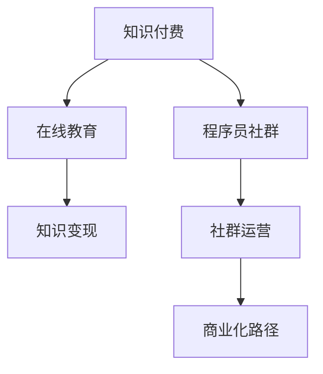

                 

# 知识付费：程序员的社群运营思路

> 关键词：知识付费, 程序员社群, 在线教育, 知识变现, 运营策略

## 1. 背景介绍

### 1.1 问题由来
近年来，随着互联网和数字化技术的发展，知识付费成为了一种新兴的教育模式，尤其在在线教育领域，通过知识付费实现了知识的快速传播和价值转化。特别是在程序员社群中，高质量的内容和深入的技术交流，更是使得知识付费成为了获取知识和技能的重要渠道。然而，面对竞争激烈的知识付费市场，如何运营一个有效的程序员社群，实现知识的高效传播和变现，成为了摆在社群管理者面前的一大挑战。

### 1.2 问题核心关键点
在知识付费的背景下，程序员社群的运营成功与否，直接影响到社群的影响力和知识变现的能力。核心关键点包括：

- **内容质量**：高质量、有价值的内容是吸引用户和付费的基础。
- **用户体验**：良好的用户体验可以提高用户粘性和满意度。
- **运营策略**：有效的运营策略能促进内容的传播和变现。
- **社群文化**：积极健康的社群文化能增强社群的凝聚力和吸引力。
- **商业化路径**：清晰的商业化路径有助于实现知识变现。

### 1.3 问题研究意义
运营成功的程序员社群，不仅能够促进程序员之间的技术交流和知识共享，还能为社群成员创造价值，提高个人技能，增强市场竞争力。同时，通过有效的商业化路径，社群也能实现知识变现，建立良性循环，促进可持续发展。

## 2. 核心概念与联系

### 2.1 核心概念概述

为更好地理解如何运营一个成功的程序员社群，本节将介绍几个密切相关的核心概念：

- **知识付费**：指通过付费获取高质量的在线教育内容，包括知识分享、技术讲解、问题解答等。知识付费打破了传统教育模式，通过网络平台实现知识的快速传播和价值转化。
- **程序员社群**：指以程序员为核心的线上或线下社交平台，通过交流技术、分享经验、解决问题等方式，促进程序员之间的互动和学习。
- **在线教育**：通过互联网平台，提供视频、音频、图文等多种形式的教育内容，实现随时随地学习。
- **知识变现**：指通过知识付费、广告、会员、赞助等形式，将知识转化为经济收益的过程。
- **社群运营**：指对社群进行内容管理、用户互动、市场推广、数据分析等活动，以提升社群的影响力和用户粘性。
- **商业化路径**：指社群通过收费、广告、增值服务等商业活动，实现知识变现的策略和途径。

这些核心概念之间的逻辑关系可以通过以下Mermaid流程图来展示：



这个流程图展示了一系列核心概念之间的联系：

1. 知识付费是程序员社群的核心驱动力。
2. 在线教育是知识付费的主要形式之一。
3. 知识变现是知识付费的商业目标。
4. 社群运营是知识付费的有效手段。
5. 商业化路径是知识变现的策略途径。

这些概念共同构成了知识付费下程序员社群运营的基本框架，有助于理解如何构建和维护一个成功的程序员社群。

## 3. 核心算法原理 & 具体操作步骤
### 3.1 算法原理概述

知识付费和程序员社群运营，本质上是一个多维度的系统工程，涉及内容管理、用户互动、市场推广等多个方面。其核心算法原理可以概括为：

- **内容管理**：高质量的内容是知识付费和社群运营的基础，需要通过筛选、评估、推荐等手段，确保内容的价值和相关性。
- **用户互动**：通过社交、讨论、问答等方式，促进用户之间的互动和交流，增强社群的凝聚力和活跃度。
- **市场推广**：通过SEO、社交媒体、广告投放等手段，扩大社群的知名度和用户规模。
- **数据分析**：通过用户行为分析、内容阅读量分析、社群互动分析等，获取运营数据，优化运营策略。
- **商业化路径**：设计合理的商业模型，通过收费、广告、会员等形式，实现知识变现。

### 3.2 算法步骤详解

一个成功的程序员社群运营，需要经过以下几个关键步骤：

**Step 1: 确定社群目标和定位**
- 明确社群的目标和定位，确定内容方向和用户群体。
- 设计社群的核心理念和价值观，引导社群文化建设。

**Step 2: 内容生产与筛选**
- 组建内容团队，进行高质量内容的生产与筛选。
- 建立内容审核机制，确保内容的准确性和相关性。
- 引入用户投稿和开源项目，丰富内容来源。

**Step 3: 用户互动与激励**
- 设计互动规则和激励机制，促进用户参与和活跃。
- 建立用户反馈和评价系统，持续优化内容和用户体验。
- 举办在线直播、技术分享、编程挑战等活动，增强社群活力。

**Step 4: 市场推广与品牌建设**
- 进行SEO优化，提升搜索引擎排名，吸引自然流量。
- 利用社交媒体和广告平台，进行有针对性的推广。
- 设计品牌标识和视觉风格，提升品牌认知度。

**Step 5: 数据分析与优化**
- 使用数据分析工具，跟踪用户行为和内容表现。
- 根据数据反馈，优化内容策略和运营手段。
- 定期评估运营效果，调整社群运营方向。

**Step 6: 商业化策略与变现**
- 设计合理的商业模型，选择合适的收费模式。
- 开发社群平台，实现内容付费和知识变现。
- 探索多种商业化途径，如广告、赞助、增值服务等。

以上是运营知识付费下程序员社群的一般流程。在实际应用中，还需要根据社群的特点和市场需求，进行具体的策略调整和优化设计。

### 3.3 算法优缺点

知识付费和程序员社群运营的优势包括：

1. 高效知识传播：通过知识付费，可以快速实现高质量内容的传播和价值转化。
2. 互动性强：社群提供了用户之间交流互动的平台，增强了社区的凝聚力和活跃度。
3. 用户粘度高：通过内容、互动、激励等方式，提高用户粘性和满意度。
4. 商业价值高：通过合理的商业化路径，实现知识变现和可持续发展。

但同时，该方法也存在一定的局限性：

1. 内容质量要求高：高质量内容的制作和筛选需要较高的投入和专业能力。
2. 用户粘性依赖强：社群活跃度和用户粘性高度依赖于内容质量和运营策略。
3. 市场竞争激烈：知识付费市场竞争激烈，需要持续创新和优化才能保持竞争力。
4. 商业模式单一：当前知识付费的商业化途径相对单一，需要探索更多模式。
5. 知识更新迅速：技术更新迭代快，需要不断更新内容以保持竞争力。

尽管存在这些局限性，但就目前而言，知识付费和程序员社群运营仍然是最主流和有效的知识传播方式。未来相关研究的重点在于如何进一步降低内容制作成本，提高内容的覆盖面和传播效果，同时兼顾商业模式的创新和多样化。

### 3.4 算法应用领域

知识付费和程序员社群运营方法，在教育、技术、金融、医疗等多个领域中得到了广泛应用：

- **在线教育**：如Coursera、Udemy等平台，通过知识付费提供高质量的在线课程。
- **技术社区**：如Stack Overflow、GitHub等，提供技术交流和问题解答。
- **金融教育**：如Khan Academy、Bogleheads等，通过知识付费提供金融知识和理财建议。
- **医疗健康**：如Healthline、WebMD等，提供健康知识和医疗建议。

除了这些经典领域外，知识付费和程序员社群运营也被创新性地应用到更多场景中，如在线医疗咨询、专业技能培训、职业发展指导等，为各行各业的知识传播和教育培训提供了新的思路。

## 4. 数学模型和公式 & 详细讲解  
### 4.1 数学模型构建

本节将使用数学语言对知识付费下程序员社群运营的数学模型进行更加严格的刻画。

设社群用户总数为 $U$，付费用户数为 $P$，内容总数为 $C$，互动总数为 $I$。知识付费的总收入为 $R$，其中 $C_{\text{付}}$ 为付费内容数，$P_{\text{付}}$ 为付费用户数。则知识付费的运营模型可以表示为：

$$
R = C_{\text{付}} \times P_{\text{付}}
$$

同时，社群的活跃度可以通过互动总数 $I$ 和内容数 $C$ 的比值来衡量：

$$
\text{活跃度} = \frac{I}{C}
$$

内容的质量和相关性可以通过用户评价和阅读量来评估：

$$
\text{内容质量} = \frac{1}{\sigma} \times \text{评价总和}
$$

其中 $\sigma$ 为评价的均方根。

### 4.2 公式推导过程

以下我们以知识付费和程序员社群运营的数学模型为例，推导运营效果的评估公式。

设社群的总用户数 $U$，付费用户数 $P$，内容总数 $C$，互动总数 $I$。知识付费的总收入为 $R$，其中 $C_{\text{付}}$ 为付费内容数，$P_{\text{付}}$ 为付费用户数。则知识付费的运营模型可以表示为：

$$
R = C_{\text{付}} \times P_{\text{付}}
$$

同时，社群的活跃度可以通过互动总数 $I$ 和内容数 $C$ 的比值来衡量：

$$
\text{活跃度} = \frac{I}{C}
$$

内容的质量和相关性可以通过用户评价和阅读量来评估：

$$
\text{内容质量} = \frac{1}{\sigma} \times \text{评价总和}
$$

其中 $\sigma$ 为评价的均方根。

在得到运营模型的基础上，我们可以进一步分析运营效果和用户行为：

1. 用户增长：通过市场推广和用户转化策略，提升社群的用户增长率。
2. 内容更新：定期更新内容，吸引新用户和提高用户粘性。
3. 互动激励：设计互动激励机制，提高用户互动频率和质量。
4. 付费策略：调整收费模式和价格，提高知识变现率。

通过这些公式，可以系统地评估和优化知识付费和程序员社群运营的效果。

## 5. 项目实践：代码实例和详细解释说明
### 5.1 开发环境搭建

在进行知识付费和程序员社群运营实践前，我们需要准备好开发环境。以下是使用Python进行Django开发的环境配置流程：

1. 安装Anaconda：从官网下载并安装Anaconda，用于创建独立的Python环境。

2. 创建并激活虚拟环境：
```bash
conda create -n python-env python=3.8 
conda activate python-env
```

3. 安装Django：通过pip安装Django框架，开启Python web开发。
```bash
pip install Django
```

4. 安装必要的第三方库：
```bash
pip install markdown django-markdown django-crispy-forms
```

5. 安装数据库：选择MySQL或PostgreSQL作为数据库，安装并配置。

完成上述步骤后，即可在`python-env`环境中开始开发实践。

### 5.2 源代码详细实现

下面是使用Django框架构建知识付费和程序员社群的示例代码：

```python
from django.shortcuts import render
from django.http import HttpResponse
from django.views.generic import TemplateView
from markdown import markdown
from .models import Content, User

class HomeView(TemplateView):
    template_name = 'home.html'
    
    def get_context_data(self, **kwargs):
        context = super().get_context_data(**kwargs)
        context['contents'] = Content.objects.all().order_by('-created_at')
        context['users'] = User.objects.all().order_by('-name')
        return context

class ContentView(TemplateView):
    template_name = 'content.html'
    
    def get_context_data(self, **kwargs):
        content = Content.objects.get(id=self.kwargs['id'])
        context = super().get_context_data(**kwargs)
        context['content'] = markdown(content.body)
        return context

class PaymentView(TemplateView):
    template_name = 'payment.html'
    
    def get_context_data(self, **kwargs):
        user = User.objects.get(username=self.kwargs['username'])
        context = super().get_context_data(**kwargs)
        context['user'] = user
        return context
```

以上代码实现了知识付费和程序员社群的基础功能：首页展示热门内容、内容详情页和用户付费页。具体实现细节包括：

- **Content模型**：用于存储内容，包含标题、作者、发布时间等字段。
- **User模型**：用于存储用户，包含用户名、余额等字段。
- **HomeView**：展示热门内容列表。
- **ContentView**：展示单个内容详情。
- **PaymentView**：用户付费页面。

### 5.3 代码解读与分析

让我们再详细解读一下关键代码的实现细节：

**Content模型**：
- `Content`模型用于存储知识付费和程序员社群中的内容，包括标题、作者、发布时间等字段。
- `__str__`方法用于返回内容简要描述。
- `get_absolute_url`方法用于返回内容的绝对URL。

**User模型**：
- `User`模型用于存储社群中的用户，包括用户名、余额等字段。
- `__str__`方法用于返回用户简要描述。
- `get_absolute_url`方法用于返回用户的绝对URL。

**HomeView**：
- 继承自`TemplateView`，用于展示热门内容列表。
- `get_context_data`方法用于获取上下文数据，包括内容列表和用户列表。
- 使用`Content.objects.all().order_by('-created_at')`获取最近发布的内容，并按时间倒序排序。

**ContentView**：
- 继承自`TemplateView`，用于展示单个内容详情。
- `get_context_data`方法用于获取上下文数据，包括内容详情。
- 使用`Content.objects.get(id=self.kwargs['id'])`获取指定ID的内容，并使用`markdown`函数将内容转换为HTML格式。

**PaymentView**：
- 继承自`TemplateView`，用于用户付费页面。
- `get_context_data`方法用于获取上下文数据，包括用户信息。
- 使用`User.objects.get(username=self.kwargs['username'])`获取指定用户的信息。

通过以上代码示例，可以看到Django框架在构建知识付费和程序员社群中的应用。开发者可以根据实际需求，进一步扩展和优化功能。

## 6. 实际应用场景
### 6.1 知识付费平台

知识付费平台是知识付费和程序员社群运营的核心场景之一。通过平台，用户可以订阅课程、购买内容、参与讨论，实现知识的高效传播和变现。

在技术实现上，可以构建一个功能完善的知识付费平台，提供内容订阅、评论互动、用户管理等功能。同时，通过广告和会员付费等商业模式，实现知识变现。

### 6.2 在线技术社区

在线技术社区是程序员社群运营的重要形式之一。通过社区，程序员可以分享技术经验、解决问题、交流心得，实现技术的共同进步和社群的活跃度提升。

在技术实现上，可以搭建一个开源的技术社区，提供技术讨论、问题解答、代码分享等功能。同时，通过开源项目贡献和内容付费等商业模式，激励社区成员的活跃和参与。

### 6.3 教育培训平台

教育培训平台是知识付费的重要应用场景之一，通过平台提供高质量的教育培训内容，实现知识的传播和价值转化。

在技术实现上，可以构建一个集成的教育培训平台，提供在线课程、视频讲座、考试测试等功能。同时，通过收费模式和广告收益等商业模式，实现知识变现。

### 6.4 未来应用展望

随着知识付费和程序员社群运营的不断发展，未来将在更多领域得到应用，为各行各业带来变革性影响。

在智慧医疗领域，通过知识付费和社群运营，可以实现医患沟通、健康管理、疾病预防等功能，提升医疗服务的智能化水平。

在智能教育领域，通过知识付费和社群运营，可以实现个性化学习、在线辅导、课程互动等功能，提升教育质量和效率。

在智慧城市治理中，通过知识付费和社群运营，可以实现城市事件监测、智慧决策、公共安全等功能，提高城市管理的自动化和智能化水平。

此外，在企业生产、社会治理、文娱传媒等众多领域，知识付费和社群运营也将不断涌现，为各行各业带来新的技术和应用方向。相信随着技术的日益成熟，知识付费和程序员社群运营必将成为知识传播和教育培训的重要手段，推动各个行业的数字化转型。

## 7. 工具和资源推荐
### 7.1 学习资源推荐

为了帮助开发者系统掌握知识付费和程序员社群运营的理论基础和实践技巧，这里推荐一些优质的学习资源：

1. **《知识付费运营手册》系列博文**：由知识付费运营专家撰写，深入浅出地介绍了知识付费和社群运营的全面知识，涵盖内容生产、用户互动、市场推广等多个方面。

2. **《程序员社群运营指南》书籍**：详细介绍了程序员社群的运营策略、技术实现和管理实践，提供了丰富的案例和实用技巧。

3. **《在线教育平台建设》课程**：由知名教育平台开设的在线课程，涵盖在线教育平台的技术架构、运营策略和用户管理等内容。

4. **Coursera官方文档**：Coursera平台的官方文档，提供了丰富的知识付费和在线教育平台开发资源，包括课程设计和运营优化方法。

5. **GitHub开源项目**：如Stack Overflow、Khan Academy等，展示了知识付费和程序员社群运营的最佳实践，提供了大量的开发案例和资源。

通过对这些资源的学习实践，相信你一定能够快速掌握知识付费和程序员社群运营的精髓，并用于解决实际的运营问题。

### 7.2 开发工具推荐

高效的开发离不开优秀的工具支持。以下是几款用于知识付费和程序员社群运营开发的常用工具：

1. **Django框架**：Python的Web开发框架，提供丰富的库和组件，适合快速开发知识付费和社群运营平台。

2. **Markdown格式**：用于在线内容编辑和展示，提供丰富的文本编辑功能，易于生成格式化内容。

3. **Django-Crispy Forms**：用于创建美观的用户表单，支持快速设计和管理用户界面。

4. **MySQL/PostgreSQL数据库**：用于存储和管理知识付费和社群运营的数据，支持高效的数据查询和管理。

5. **Git版本控制**：用于协作开发和代码管理，支持分支、合并和版本跟踪。

合理利用这些工具，可以显著提升知识付费和程序员社群运营的开发效率，加快创新迭代的步伐。

### 7.3 相关论文推荐

知识付费和程序员社群运营的研究源于学界的持续研究。以下是几篇奠基性的相关论文，推荐阅读：

1. **《知识付费的商业模式研究》**：探讨了知识付费的商业模式和运营策略，提供了丰富的实际案例和分析方法。

2. **《程序员社群的价值链分析》**：分析了程序员社群的价值链构成和运营模式，提供了详细的运营指导。

3. **《在线教育的可持续发展研究》**：探讨了在线教育的可持续发展机制，提供了多种商业化和用户激励策略。

4. **《知识付费的市场竞争策略》**：分析了知识付费市场的竞争态势和运营策略，提供了市场分析和管理实践。

这些论文代表了大语言模型微调技术的发展脉络。通过学习这些前沿成果，可以帮助研究者把握学科前进方向，激发更多的创新灵感。

## 8. 总结：未来发展趋势与挑战

### 8.1 总结

本文对知识付费下程序员社群运营的方法进行了全面系统的介绍。首先阐述了知识付费和程序员社群运营的研究背景和意义，明确了运营在知识传播和价值转化中的重要角色。其次，从原理到实践，详细讲解了知识付费和社群运营的数学模型和关键步骤，给出了知识付费和社群运营的完整代码实例。同时，本文还广泛探讨了知识付费和社群运营在知识付费平台、在线技术社区、教育培训平台等多个领域的应用前景，展示了知识付费和社群运营的巨大潜力。此外，本文精选了知识付费和社群运营的学习资源，力求为读者提供全方位的技术指引。

通过本文的系统梳理，可以看到，知识付费和程序员社群运营在知识传播和教育培训中具有广泛的应用前景，具有高效的知识传播、用户互动和商业变现能力。未来，伴随知识付费和社群运营技术的不断演进，必将在更多领域得到应用，为各行各业带来变革性影响。

### 8.2 未来发展趋势

展望未来，知识付费和程序员社群运营将呈现以下几个发展趋势：

1. **内容多样化**：内容形式将更加多样化，不仅包括文字、视频，还包括音频、直播等。

2. **用户互动增强**：通过智能推荐、实时互动等手段，提升用户参与度和社群活力。

3. **商业化模式丰富**：除了收费模式，还将探索更多商业化路径，如会员、广告、增值服务等。

4. **技术创新驱动**：通过AI和大数据技术，提升内容推荐和用户管理的效率和效果。

5. **跨界融合加速**：知识付费和程序员社群运营将与其他行业技术融合，如物联网、AI等，实现更多跨领域应用。

以上趋势凸显了知识付费和程序员社群运营的前景广阔，这些方向的探索发展，必将进一步提升知识传播的效率和质量，促进知识的广泛应用和普及。

### 8.3 面临的挑战

尽管知识付费和程序员社群运营已经取得了显著成就，但在迈向更加智能化、普适化应用的过程中，仍面临诸多挑战：

1. **内容质量控制**：高质量内容的制作和筛选需要较高的投入和专业能力，内容质量控制难度大。

2. **用户粘性保持**：社群活跃度和用户粘性高度依赖于内容质量和运营策略，需要持续优化和创新。

3. **市场竞争激烈**：知识付费市场竞争激烈，需要持续创新和优化才能保持竞争力。

4. **商业化模式单一**：当前知识付费的商业化途径相对单一，需要探索更多模式。

5. **知识更新迅速**：技术更新迭代快，需要不断更新内容以保持竞争力。

6. **用户隐私保护**：用户数据隐私保护问题需要高度重视，避免数据泄露和滥用。

正视知识付费和程序员社群运营面临的这些挑战，积极应对并寻求突破，将使这些技术更好地服务于知识传播和教育培训。

### 8.4 研究展望

面对知识付费和程序员社群运营所面临的挑战，未来的研究需要在以下几个方面寻求新的突破：

1. **内容自动生成**：通过AI和大数据技术，实现内容的自动生成和推荐，提高内容生产效率。

2. **智能推荐系统**：开发智能推荐算法，提升用户内容的发现和匹配效率，提高用户粘性。

3. **知识图谱整合**：将符号化的先验知识与神经网络模型结合，增强模型的知识整合能力，提高知识传播的广度和深度。

4. **个性化学习路径**：通过AI技术，为每位用户设计个性化的学习路径，提高学习效果和用户体验。

5. **商业模型创新**：探索多种商业化途径，如联盟营销、众包等，拓展知识付费和社群运营的商业空间。

6. **用户隐私保护**：制定严格的数据隐私保护政策，确保用户数据的安全和隐私。

这些研究方向的探索，必将引领知识付费和程序员社群运营技术迈向更高的台阶，为知识传播和教育培训带来更多创新和突破。面向未来，知识付费和程序员社群运营需要与其他人工智能技术进行更深入的融合，如知识表示、因果推理、强化学习等，多路径协同发力，共同推动知识传播和教育培训的进步。只有勇于创新、敢于突破，才能不断拓展知识付费和程序员社群运营的边界，让智能技术更好地服务于知识传播和教育培训。

## 9. 附录：常见问题与解答

**Q1：知识付费和程序员社群运营的核心竞争力是什么？**

A: 知识付费和程序员社群运营的核心竞争力在于高质量内容、高效用户互动和合理的商业化路径。通过这些手段，可以吸引和留住用户，实现知识的高效传播和变现。

**Q2：知识付费和程序员社群运营需要哪些关键技术？**

A: 知识付费和程序员社群运营需要以下关键技术：

1. **内容管理系统**：用于管理内容生产、筛选和推荐。
2. **用户管理系统**：用于管理用户注册、登录和互动。
3. **智能推荐系统**：用于提升内容的发现和匹配效率。
4. **数据分析工具**：用于跟踪用户行为和内容表现，优化运营策略。
5. **API接口**：用于提供服务接口，实现内容的快速生产和传播。

**Q3：如何平衡用户粘性和内容质量？**

A: 平衡用户粘性和内容质量，需要从以下几个方面入手：

1. **内容多样性**：提供多样化的内容形式，满足不同用户需求。
2. **互动机制**：设计有效的互动机制，提升用户参与度和满意度。
3. **用户激励**：通过积分、奖励等方式激励用户参与和活跃。
4. **内容优化**：持续优化内容质量和相关性，提高用户满意度。

**Q4：知识付费和程序员社群运营的商业模式有哪些？**

A: 知识付费和程序员社群运营的商业模式包括：

1. **内容订阅**：用户购买订阅，获取特定内容或服务。
2. **付费问答**：用户通过付费提问，获取专家解答。
3. **会员服务**：用户成为会员，享受更多特权和优惠。
4. **广告投放**：在内容中插入广告，获取广告收益。
5. **增值服务**：提供课程、工具、社区等增值服务，收取费用。

**Q5：知识付费和程序员社群运营的挑战有哪些？**

A: 知识付费和程序员社群运营的挑战包括：

1. **内容质量控制**：高质量内容的制作和筛选需要较高的投入和专业能力。
2. **用户粘性保持**：社群活跃度和用户粘性高度依赖于内容质量和运营策略，需要持续优化和创新。
3. **市场竞争激烈**：知识付费市场竞争激烈，需要持续创新和优化才能保持竞争力。
4. **商业化模式单一**：当前知识付费的商业化途径相对单一，需要探索更多模式。
5. **知识更新迅速**：技术更新迭代快，需要不断更新内容以保持竞争力。
6. **用户隐私保护**：用户数据隐私保护问题需要高度重视，避免数据泄露和滥用。

**Q6：如何提升知识付费和程序员社群运营的商业化效果？**

A: 提升知识付费和程序员社群运营的商业化效果，可以从以下几个方面入手：

1. **用户画像分析**：通过数据分析，了解用户需求和行为，提供个性化服务。
2. **精准广告投放**：根据用户画像和行为，进行精准广告投放，提高广告转化率。
3. **用户生命周期管理**：通过用户生命周期管理，提升用户留存率和复购率。
4. **多元变现渠道**：除了内容订阅，还可以探索多元变现渠道，如付费问答、会员服务、广告等。

通过以上常见问题的解答，可以更好地理解知识付费和程序员社群运营的核心竞争力、关键技术、商业模式和运营挑战，为实际操作提供指导和参考。

---

作者：禅与计算机程序设计艺术 / Zen and the Art of Computer Programming

