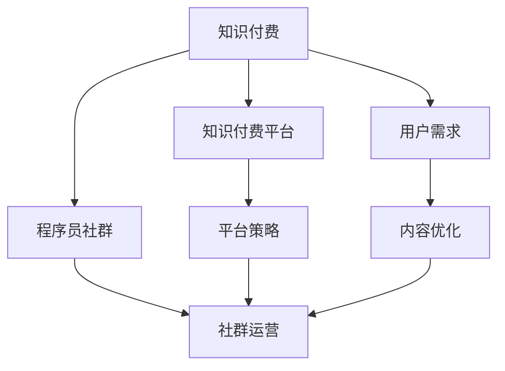

                 

# 知识付费：程序员的社群运营战术

## 1. 背景介绍

### 1.1 问题由来
随着互联网技术的快速发展和普及，程序员作为知识和技术的重要创造者，在社会各个行业中发挥着越来越重要的作用。然而，传统知识传播模式已无法满足程序员社群快速发展的需求，知识付费模式应运而生。

### 1.2 问题核心关键点
知识付费模式通过提供有价值的知识资源，为程序员社群创造了新的价值共享方式。但如何在知识付费领域取得成功，成为程序员社群运营的重要课题。

### 1.3 问题研究意义
研究知识付费模式下的程序员社群运营策略，不仅有助于提升知识付费平台的用户体验，提升内容质量和市场竞争力，还将为程序员社群创造新的增长点，激发更多知识创造和分享的动力。

## 2. 核心概念与联系

### 2.1 核心概念概述

为更好地理解知识付费模式下的程序员社群运营方法，本节将介绍几个密切相关的核心概念：

- 知识付费：指用户为获取知识资源而支付费用的模式。知识付费平台的兴起，使得程序员社群能够获得更专业、更系统的知识资源。

- 程序员社群：由程序员自发组织起来的线上或线下社区，旨在分享技术经验、交流技术问题、进行技术交流和学习。

- 知识付费平台：如得到、知乎live、微信公众号等，提供各类知识资源，并通过付费订阅、单次付费、知识星球等形式进行变现。

- 社群运营：通过策划、执行各种活动，维护社群的活跃度和用户粘性，促进内容生产和知识传播。

- 平台策略：知识付费平台针对特定用户群体的定制化运营策略，如社区管理、内容优化、活动策划等。

- 用户需求：程序员社群用户对技术、行业资讯、职业发展等知识的需求，决定了社群运营的方向和内容。

这些核心概念之间的逻辑关系可以通过以下Mermaid流程图来展示：



这个流程图展示了一知识付费模式下的程序员社群运营的基本逻辑：

1. 知识付费平台为程序员社群提供知识资源。
2. 程序员社群通过知识付费平台获取知识，促进技术和行业交流。
3. 平台通过定制化的运营策略，提升用户体验和满意度。
4. 用户需求决定着社群运营的具体方向和内容。

这些核心概念共同构成了知识付费模式下的程序员社群运营框架，为其有效发展提供了理论基础。

## 3. 核心算法原理 & 具体操作步骤
### 3.1 算法原理概述

知识付费模式下的程序员社群运营，本质上是通过社群运营策略优化知识付费平台的用户体验，提升内容质量和市场竞争力。其核心思想是：

1. 根据程序员社群用户的需求，设计合适的知识付费产品。
2. 利用社群运营技术，吸引和保留高质量的程序员用户。
3. 通过内容优化和活动策划，提升社群互动和知识传播效果。

具体而言，运营策略包括以下几个关键步骤：

**Step 1: 分析用户需求**
- 调研程序员社群的需求，通过问卷、访谈等方式收集信息，分析用户痛点和期望。
- 收集社群内的技术热点和行业发展趋势，明确知识付费的内容方向。

**Step 2: 设计付费产品**
- 根据需求分析结果，设计有针对性的付费内容，如技术教程、行业报告、职业规划等。
- 明确付费方式，如订阅、单次付费、知识星球等。

**Step 3: 用户获取与保留**
- 利用社群运营技术，如社区管理工具、内容推荐算法、社群互动活动等，吸引用户参与和付费。
- 提供优质内容和服务，通过用户反馈和数据分析优化用户体验，提升用户满意度和粘性。

**Step 4: 内容优化与互动**
- 策划内容更新和活动策划，确保内容的时效性和实用性。
- 利用社群运营工具，鼓励用户互动和参与，提升内容传播效果。

### 3.2 算法步骤详解

下面以一个典型的知识付费平台为例，详细讲解其社群运营的具体步骤：

**Step 1: 分析用户需求**
- 通过对社群成员的问卷调查和访谈，收集用户的技术问题、行业关注点、学习需求等信息。
- 通过社区讨论、文章留言等渠道，了解社群的热点话题和趋势。

**Step 2: 设计付费产品**
- 根据需求分析结果，策划各类付费内容，如针对Python程序员的《高级Python编程技巧》课程、针对Java程序员的《Java微服务架构实战》课程等。
- 选择适当的付费方式，如按月订阅、单次付费、知识星球等，确保用户能灵活选择。

**Step 3: 用户获取与保留**
- 在知识付费平台上发布课程预告和优惠信息，吸引用户点击和注册。
- 利用社区管理工具，如社区论坛、课程评价系统、用户行为数据分析等，优化用户体验，提升用户满意度。
- 定期举办技术分享会、线上问答、编程马拉松等社群活动，增强用户互动和粘性。

**Step 4: 内容优化与互动**
- 根据用户反馈和数据分析结果，优化课程内容和形式，确保内容的时效性和实用性。
- 策划内容更新和活动策划，如邀请知名程序员进行在线讲座、发布行业报告等，提升社群的活跃度和参与度。

### 3.3 算法优缺点

知识付费模式下的程序员社群运营，具有以下优点：

1. 提升内容质量：通过用户需求分析，设计符合用户期望的付费产品，提升内容的实用性和专业性。
2. 增加用户粘性：利用社群运营技术，增强用户互动和粘性，提升用户满意度和平台影响力。
3. 灵活运营：用户可以根据自身需求选择付费方式和课程内容，增加了运营的灵活性。
4. 激发创造力：知识付费模式激发了程序员社群的知识创造和分享动力，推动了技术进步和知识传播。

同时，该模式也存在以下局限性：

1. 内容成本高：高质量的知识内容需要耗费大量的时间和资源进行策划和制作，成本较高。
2. 用户需求多样：程序员社群需求多样，如何精准满足不同用户群体的需求，仍需不断优化和调整。
3. 用户转化率低：部分用户对付费内容持观望态度，如何提高用户转化率和留存率，仍需进一步探索。
4. 平台竞争激烈：知识付费平台众多，如何在激烈的市场竞争中脱颖而出，仍需不断创新和优化运营策略。

尽管存在这些局限性，但就目前而言，知识付费模式在程序员社群中已显示出其强大的吸引力和生命力，成为程序员社群获取知识、进行技术交流的重要途径。未来相关研究的重点在于如何进一步降低内容成本，提高用户转化率和留存率，同时兼顾内容的实用性和创新性等因素。

### 3.4 算法应用领域

知识付费模式下的程序员社群运营，已经在教育、技术交流、职业发展等多个领域得到广泛应用。以下是几个典型的应用场景：

- **技术教育：**知识付费平台为程序员提供各类技术课程、实战案例等，通过按月订阅、单次付费等方式，帮助程序员提升技术水平。

- **技术交流：**利用知识付费平台，进行技术分享会、编程马拉松等线上线下活动，促进程序员之间的技术交流和学习。

- **职业发展：**知识付费平台提供职业规划、简历优化、面试技巧等课程，帮助程序员进行职业发展。

除了上述这些经典应用外，知识付费模式还将继续拓展到更多场景中，如社区管理、项目协作、企业培训等，为程序员社群创造新的增长点。随着知识付费平台的不断演进，相信该模式将会在程序员社群中发挥更大的作用。

## 4. 数学模型和公式 & 详细讲解 & 举例说明
### 4.1 数学模型构建

知识付费模式下的程序员社群运营，涉及多个领域，包括用户行为分析、内容推荐、社群管理等。以下将从用户行为分析的角度，构建数学模型，并用具体例子进行讲解。

记用户行为数据为 $D=\{(x_i, y_i)\}_{i=1}^N$，其中 $x_i$ 为用户行为数据，$y_i$ 为用户类别标签。假设我们希望预测一个新用户是否会订阅某课程，可以通过构建分类模型来进行预测。

定义模型 $M_{\theta}$ 为二分类模型，输出用户订阅概率。模型参数 $\theta$ 包括模型结构、损失函数、优化算法等。模型的目标是最小化经验风险：

$$
\mathcal{L}(\theta) = -\frac{1}{N}\sum_{i=1}^N [y_i\log M_{\theta}(x_i)+(1-y_i)\log(1-M_{\theta}(x_i))]
$$

其中 $\log$ 为对数函数，$M_{\theta}(x_i)$ 为模型在输入数据 $x_i$ 上的输出，$y_i$ 为真实标签。

通过梯度下降等优化算法，最小化经验风险 $\mathcal{L}(\theta)$，更新模型参数 $\theta$。

### 4.2 公式推导过程

以二分类问题为例，利用逻辑回归模型进行详细推导：

假设模型 $M_{\theta}$ 为逻辑回归模型，输出用户订阅概率 $p(y=1|x; \theta) = \sigma(Wx+b)$，其中 $W$ 和 $b$ 为模型参数，$\sigma$ 为逻辑函数。

定义二分类交叉熵损失函数为：

$$
\ell(M_{\theta}(x),y) = -[y\log M_{\theta}(x)+(1-y)\log(1-M_{\theta}(x))]
$$

将其代入经验风险公式，得：

$$
\mathcal{L}(\theta) = -\frac{1}{N}\sum_{i=1}^N [y_i\log \sigma(Wx_i+b)+(1-y_i)\log(1-\sigma(Wx_i+b))]
$$

根据链式法则，损失函数对参数 $\theta$ 的梯度为：

$$
\frac{\partial \mathcal{L}(\theta)}{\partial \theta} = -\frac{1}{N}\sum_{i=1}^N (\frac{y_i}{\sigma(Wx_i+b)}-\frac{1-y_i}{1-\sigma(Wx_i+b)}) (Wx_i+b)'(Wx_i+b)
$$

其中 $(Wx_i+b)'$ 为 $Wx_i+b$ 的导数。

在得到损失函数的梯度后，即可带入参数更新公式，完成模型的迭代优化。重复上述过程直至收敛，最终得到适应程序员社群需求的预测模型 $\theta^*$。

### 4.3 案例分析与讲解

以下以一个简单的案例，说明如何利用数学模型对知识付费平台的用户行为进行分析和预测：

**案例背景：**
某知识付费平台收集了大量用户行为数据，包括课程浏览、购买、评价等信息。平台希望通过分析用户行为，预测用户是否会订阅某门课程。

**数据准备：**
- 收集用户行为数据 $D=\{(x_i, y_i)\}_{i=1}^N$，其中 $x_i$ 包括用户浏览课程时间、评价内容、购买次数等行为特征。
- 将用户行为数据分为训练集和测试集，如 $D_{train}$ 和 $D_{test}$。

**模型构建：**
- 选择逻辑回归模型 $M_{\theta}$ 作为分类模型，输出用户订阅概率 $p(y=1|x; \theta) = \sigma(Wx+b)$。
- 损失函数为二分类交叉熵损失 $\mathcal{L}(\theta)$。

**参数更新：**
- 使用梯度下降等优化算法，最小化损失函数 $\mathcal{L}(\theta)$，更新模型参数 $\theta$。

**结果展示：**
- 在测试集上，对模型进行评估，计算准确率、召回率、F1值等指标，评估模型的性能。
- 利用模型对新用户行为数据进行预测，判断其是否会订阅课程。

通过数学模型，知识付费平台能够对用户行为进行分析和预测，优化内容推荐和社群运营策略，提升用户满意度和平台收益。

## 5. 项目实践：代码实例和详细解释说明
### 5.1 开发环境搭建

在进行知识付费模式下的程序员社群运营实践前，我们需要准备好开发环境。以下是使用Python进行PyTorch开发的环境配置流程：

1. 安装Anaconda：从官网下载并安装Anaconda，用于创建独立的Python环境。

2. 创建并激活虚拟环境：
```bash
conda create -n pytorch-env python=3.8 
conda activate pytorch-env
```

3. 安装PyTorch：根据CUDA版本，从官网获取对应的安装命令。例如：
```bash
conda install pytorch torchvision torchaudio cudatoolkit=11.1 -c pytorch -c conda-forge
```

4. 安装TensorFlow：
```bash
pip install tensorflow
```

5. 安装各类工具包：
```bash
pip install numpy pandas scikit-learn matplotlib tqdm jupyter notebook ipython
```

完成上述步骤后，即可在`pytorch-env`环境中开始知识付费平台的用户行为分析与预测实践。

### 5.2 源代码详细实现

下面我们以一个简单的案例，给出使用PyTorch进行用户行为分析和预测的代码实现。

首先，准备数据集：

```python
import pandas as pd
from sklearn.model_selection import train_test_split

# 准备数据集
data = pd.read_csv('user_behavior_data.csv')

# 数据预处理
data = data.dropna()
data = data.drop_duplicates()

# 划分训练集和测试集
X = data.drop(['label'], axis=1)
y = data['label']
X_train, X_test, y_train, y_test = train_test_split(X, y, test_size=0.2, random_state=42)
```

然后，定义逻辑回归模型：

```python
import torch
from torch import nn

# 定义模型
class LogisticRegression(nn.Module):
    def __init__(self, input_size, output_size):
        super(LogisticRegression, self).__init__()
        self.linear = nn.Linear(input_size, output_size)

    def forward(self, x):
        return self.linear(x)

# 定义损失函数和优化器
model = LogisticRegression(input_size=X_train.shape[1], output_size=2)
criterion = nn.CrossEntropyLoss()
optimizer = torch.optim.Adam(model.parameters(), lr=0.01)

# 训练模型
for epoch in range(10):
    optimizer.zero_grad()
    y_pred = model(X_train)
    loss = criterion(y_pred, y_train)
    loss.backward()
    optimizer.step()
```

接着，训练并评估模型：

```python
# 训练模型
for epoch in range(10):
    optimizer.zero_grad()
    y_pred = model(X_train)
    loss = criterion(y_pred, y_train)
    loss.backward()
    optimizer.step()

# 评估模型
with torch.no_grad():
    y_pred = model(X_test)
    y_true = torch.argmax(y_pred, dim=1)
    accuracy = (y_true == y_test).float().mean()
    print('Accuracy:', accuracy)
```

### 5.3 代码解读与分析

让我们再详细解读一下关键代码的实现细节：

**数据准备**：
- 使用Pandas库读取CSV格式的数据集，并进行预处理，去除空值和重复记录。
- 利用sklearn的train_test_split函数，将数据集分为训练集和测试集。

**模型构建**：
- 定义逻辑回归模型，使用PyTorch框架实现。
- 定义损失函数和优化器，使用交叉熵损失和Adam优化器。

**模型训练**：
- 对模型进行10轮训练，使用训练集数据进行前向传播和反向传播，更新模型参数。
- 在测试集上评估模型性能，计算准确率。

通过这个简单的代码实现，我们可以快速构建一个基本的逻辑回归模型，并使用其对用户行为进行分析和预测。

## 6. 实际应用场景
### 6.1 智能推荐系统

知识付费平台可以基于用户行为数据，利用机器学习算法进行智能推荐。通过分析用户的学习记录、评价反馈等数据，为用户推荐合适的课程内容，提高用户满意度和平台收益。

### 6.2 社群管理

知识付费平台可以通过社群管理工具，进行社群运营和互动。例如，定期举办编程马拉松、技术分享会等线上线下活动，增强用户粘性，促进知识传播和交流。

### 6.3 课程优化

知识付费平台可以基于用户反馈和行为数据，持续优化课程内容和形式。例如，收集用户评价和互动数据，分析用户偏好和需求，优化课程设计，提升课程质量。

### 6.4 用户转化

知识付费平台可以基于用户行为数据，制定有针对性的运营策略，提升用户转化率。例如，对潜在用户进行精准推荐，提供免费试用课程，降低用户付费门槛。

## 7. 工具和资源推荐
### 7.1 学习资源推荐

为了帮助开发者系统掌握知识付费模式下的程序员社群运营方法，这里推荐一些优质的学习资源：

1. 《深度学习实战：PyTorch教程》系列博文：由深度学习领域专家撰写，全面介绍了使用PyTorch进行数据分析和模型训练的实战技巧。

2. CS224N《深度学习自然语言处理》课程：斯坦福大学开设的NLP明星课程，涵盖深度学习、自然语言处理等多个领域的基本概念和经典模型。

3. 《自然语言处理入门》书籍：介绍自然语言处理的基本概念、应用场景和算法实现，适合初学者入门。

4. PyTorch官方文档：提供丰富的API文档和样例代码，帮助开发者快速上手PyTorch进行模型开发。

5. Kaggle：数据科学和机器学习竞赛平台，可以参加各类比赛，积累实战经验。

通过对这些资源的学习实践，相信你一定能够快速掌握知识付费模式下的程序员社群运营的精髓，并用于解决实际的运营问题。

### 7.2 开发工具推荐

高效的开发离不开优秀的工具支持。以下是几款用于知识付费模式下的程序员社群运营开发的常用工具：

1. PyTorch：基于Python的开源深度学习框架，灵活的计算图，适合快速迭代研究。

2. TensorFlow：由Google主导开发的开源深度学习框架，生产部署方便，适合大规模工程应用。

3. Scikit-learn：Python的机器学习库，提供简单易用的机器学习算法和工具，适合快速原型开发。

4. Pandas：数据处理和分析库，提供灵活的数据结构和数据处理功能，适合数据预处理和清洗。

5. Weights & Biases：模型训练的实验跟踪工具，可以记录和可视化模型训练过程中的各项指标，方便对比和调优。

6. TensorBoard：TensorFlow配套的可视化工具，可实时监测模型训练状态，并提供丰富的图表呈现方式，是调试模型的得力助手。

合理利用这些工具，可以显著提升知识付费平台的用户行为分析和运营管理的开发效率，加快创新迭代的步伐。

### 7.3 相关论文推荐

知识付费模式下的程序员社群运营，涉及多个领域，包括机器学习、数据科学、社区管理等。以下是几篇奠基性的相关论文，推荐阅读：

1. Predicting User Behavior with Machine Learning：探讨使用机器学习算法对用户行为进行预测。

2. User Modeling in Recommender Systems：介绍推荐系统中的用户建模技术，如何利用用户历史行为数据进行个性化推荐。

3. Community Management in Online Platforms：探讨在线平台社群管理的策略和技术，如何通过社交网络分析增强用户互动和粘性。

4. Optimizing Online Learning Platforms through Data Mining：介绍如何使用数据挖掘技术优化在线学习平台的用户体验和课程推荐。

5. Recommender Systems in Online Education：介绍在线教育平台中的推荐系统，如何利用机器学习算法提高课程推荐效果。

这些论文代表了大数据和机器学习在知识付费领域的应用发展脉络。通过学习这些前沿成果，可以帮助研究者把握学科前进方向，激发更多的创新灵感。

## 8. 总结：未来发展趋势与挑战
### 8.1 总结

本文对知识付费模式下的程序员社群运营方法进行了全面系统的介绍。首先阐述了知识付费模式在程序员社群中的应用背景和意义，明确了社群运营的方向和目标。其次，从原理到实践，详细讲解了社群运营的数学模型和关键步骤，给出了社群运营任务开发的完整代码实例。同时，本文还广泛探讨了社群运营方法在智能推荐、社群管理、课程优化等各个环节的应用场景，展示了社群运营范式的广阔前景。此外，本文精选了社群运营技术的各类学习资源，力求为读者提供全方位的技术指引。

通过本文的系统梳理，可以看到，知识付费模式下的程序员社群运营策略在提升内容质量、增加用户粘性、激发知识创造等方面发挥了重要作用，为程序员社群创造了新的价值增长点。未来相关研究的重点在于如何进一步优化用户行为分析和推荐算法，提高用户转化率和留存率，同时兼顾内容的实用性和创新性等因素。

### 8.2 未来发展趋势

展望未来，知识付费模式下的程序员社群运营将呈现以下几个发展趋势：

1. 数据分析和建模的深入：随着数据分析技术的进步，社群运营将更加依赖于数据驱动的决策制定，通过复杂的数据模型和算法，提升运营的精确性和个性化水平。

2. 智能推荐系统的优化：推荐系统将成为知识付费平台的核心竞争力，未来的推荐算法将更加智能，能够根据用户行为和偏好进行动态调整。

3. 社群管理工具的创新：社区管理工具的不断创新，将为社群运营带来新的便利和效率提升，如智能客服、社群知识图谱等。

4. 知识付费生态的完善：知识付费平台将与其他内容生产方、技术平台等形成更紧密的合作，共同构建完整的知识生态系统。

5. 用户反馈和改进的闭环：利用用户反馈和评价数据，不断优化运营策略，提升用户满意度和平台收益。

这些趋势凸显了知识付费模式下的程序员社群运营技术的广阔前景。这些方向的探索发展，必将进一步提升知识付费平台的运营效率和用户价值，为程序员社群创造更多的增长点和发展机会。

### 8.3 面临的挑战

尽管知识付费模式下的程序员社群运营已经取得了一定成效，但在迈向更加智能化、普适化应用的过程中，仍面临诸多挑战：

1. 用户需求多样：程序员社群用户需求多样，如何精准满足不同用户群体的需求，仍需不断优化和调整。

2. 数据隐私问题：用户行为数据的收集和分析需要遵守隐私保护法律法规，如何平衡用户隐私和平台利益，仍需不断探索。

3. 数据质量问题：用户行为数据的质量和完整性直接影响推荐效果和运营决策，如何保证数据质量和可靠性，仍需进一步改进。

4. 内容成本问题：高质量的内容需要耗费大量的时间和资源进行策划和制作，成本较高，如何降低内容成本，提高运营效率，仍需不断探索。

5. 平台竞争激烈：知识付费平台众多，如何在激烈的市场竞争中脱颖而出，仍需不断创新和优化运营策略。

尽管存在这些挑战，但就目前而言，知识付费模式在程序员社群中已显示出其强大的吸引力和生命力，成为程序员社群获取知识、进行技术交流的重要途径。未来相关研究的重点在于如何进一步降低运营成本，提高用户转化率和留存率，同时兼顾内容的实用性和创新性等因素。

### 8.4 研究展望

面对知识付费模式下的程序员社群运营所面临的种种挑战，未来的研究需要在以下几个方面寻求新的突破：

1. 探索新的用户行为分析方法：如时序预测、深度学习等，提升用户行为预测的准确性和实时性。

2. 开发更加智能的推荐系统：如协同过滤、基于内容的推荐、深度学习等，提升推荐系统的个性化和多样性。

3. 引入更多社群互动元素：如虚拟助手、智能客服、社群知识图谱等，增强社群互动和粘性。

4. 融合多模态数据：如文本、图像、视频等，实现更全面的用户行为分析和预测。

5. 引入更多用户反馈机制：如在线调查、用户投票等，及时获取用户反馈，优化运营策略。

6. 强化数据隐私保护：如差分隐私、联邦学习等，保护用户隐私，增强用户信任。

这些研究方向的探索，必将引领知识付费模式下的程序员社群运营技术迈向更高的台阶，为程序员社群创造更智能、更高效的知识服务体系。面向未来，知识付费模式下的程序员社群运营需要与其他人工智能技术进行更深入的融合，如知识表示、因果推理、强化学习等，多路径协同发力，共同推动知识付费平台的创新发展。只有勇于创新、敢于突破，才能不断拓展知识付费平台的边界，让智能技术更好地造福程序员社群。

## 9. 附录：常见问题与解答

**Q1：如何评估知识付费平台的用户行为模型性能？**

A: 知识付费平台的用户行为模型性能通常通过准确率、召回率、F1值等指标进行评估。利用测试集数据进行模型评估，计算这些指标，评估模型的预测效果。

**Q2：如何选择适合的知识付费模式？**

A: 知识付费模式的选择应根据平台的用户群体、市场定位、运营目标等因素综合考虑。常见模式包括订阅制、单次付费、知识星球等，需要根据实际情况进行选择。

**Q3：如何降低知识付费平台的运营成本？**

A: 知识付费平台可以通过内容众包、合作伙伴等形式，降低高质量内容的制作成本。同时，利用社区管理工具，提升运营效率，降低人力成本。

**Q4：如何提升用户转化率？**

A: 利用精准推荐、免费试用课程、限时优惠等策略，降低用户付费门槛，提升用户转化率。同时，通过社群互动、活动策划等手段，增强用户粘性，提升用户满意度和转化率。

**Q5：如何保护用户隐私？**

A: 知识付费平台应遵守隐私保护法律法规，采用差分隐私、联邦学习等技术，保护用户隐私。同时，透明公开用户数据使用范围，增强用户信任。

通过这些问题的解答，可以帮助读者更好地理解知识付费模式下的程序员社群运营方法，提升平台的用户体验和运营效率。

---

作者：禅与计算机程序设计艺术 / Zen and the Art of Computer Programming

