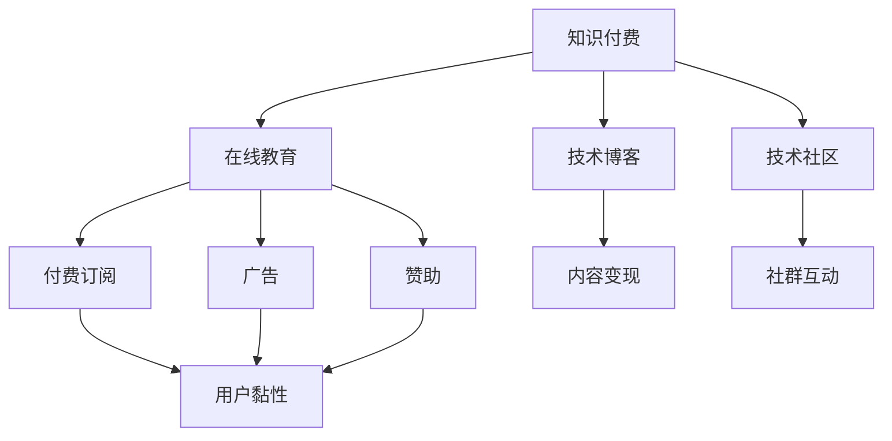

                 

# 知识付费：程序员的社群运营攻略

> 关键词：知识付费, 社群运营, 程序员社区, 在线教育, 内容变现

## 1. 背景介绍

### 1.1 问题由来
随着互联网技术的发展和普及，程序员作为社会信息化的主要推动者，其技能需求不断增长。然而，传统的学习方式已经难以满足现代程序员快速更新知识和技能的需要。知识付费平台应运而生，通过在线教育、付费文章、技术直播等方式，为程序员提供了一个便捷高效的学习渠道。但与此同时，知识付费行业也面临着市场监管不严、内容质量参差不齐、用户体验差等诸多问题。在这种背景下，程序员社群的运营成为了知识付费领域的一个重要课题。

### 1.2 问题核心关键点
如何高效运营程序员社群，提升用户黏性，实现内容变现，成为知识付费平台面临的重大挑战。本文档旨在探讨如何通过合理的社群运营策略，构建高质量的程序员社群，实现知识付费的可持续增长。

## 2. 核心概念与联系

### 2.1 核心概念概述
为更好地理解程序员社群运营的方法，本节将介绍几个核心概念：

- **知识付费**：即通过付费购买知识服务，获取专业知识或技能的学习方式。在线教育、技术博客、技术社区等平台，都是知识付费的重要形式。
- **程序员社群**：即围绕技术主题建立的互联网社区，包括论坛、问答、社交媒体等，是知识共享、交流的重要场所。
- **内容变现**：通过内容产品化、商业化，将知识资源转化为实际的经济收益。例如通过付费订阅、广告、赞助等方式实现盈利。
- **用户黏性**：指用户对社区的依赖程度和忠诚度，影响着社区的生命力和盈利能力。
- **付费模型**：即如何定价和分配收益，是知识付费平台需要认真考虑的问题。

这些概念之间的联系是通过合理的运营策略，利用社群和内容，将知识付费商业模式转化为可持续发展的社区。

### 2.2 核心概念原理和架构的 Mermaid 流程图



## 3. 核心算法原理 & 具体操作步骤
### 3.1 算法原理概述

程序员社群运营的本质，是通过良好的内容质量、高效的社群互动，以及合理的付费机制，提升用户黏性和内容变现能力。

设社区用户数为 $U$，内容质量为 $Q$，社群互动率为 $I$，付费转化率为 $P$，单次付费金额为 $M$，社区总收益为 $R$。社区运营的目标是通过增加 $U$、$Q$、$I$ 和 $P$，最大化 $R$。

假设社区通过定期发布高质量内容，吸引并保持用户活跃，用户间积极互动，并实现内容付费转化。则运营过程可视为：

$$
R = U \times Q \times I \times P \times M
$$

其中，$Q$ 和 $I$ 是社区平台的核心竞争力，$U$ 和 $P$ 的提升需要通过合理的付费模型和运营策略实现。

### 3.2 算法步骤详解

#### 3.2.1 内容质量提升

**Step 1: 内容规划**
- 根据社区定位，制定内容规划，确定主题方向和发布频率。
- 与行业专家、技术大牛合作，策划高质量的内容。

**Step 2: 内容生产**
- 组织社区内的技术专家，开展技术文章、代码分享、技术直播等活动。
- 建立内容评审机制，保证内容质量。

**Step 3: 内容传播**
- 利用社区内的社交网络，推广优质内容。
- 通过搜索引擎优化(SEO)，增加内容的曝光率。

#### 3.2.2 社群互动提升

**Step 1: 用户引入**
- 通过社交媒体、搜索引擎优化(SEO)等手段，吸引用户关注并加入社区。
- 提供试用期、免费内容等策略，增加用户黏性。

**Step 2: 用户互动**
- 建立社区讨论区、问答系统，鼓励用户积极参与讨论。
- 组织线上技术沙龙、线下技术聚会，促进用户间的交流互动。

**Step 3: 用户留存**
- 定期收集用户反馈，不断优化社群运营策略。
- 定期推送社群活动和优质内容，增强用户归属感。

#### 3.2.3 付费模型优化

**Step 1: 定价策略**
- 根据内容难度、市场价值、受众群体等，制定合理的定价策略。
- 定期调整价格，适应市场需求和用户消费能力。

**Step 2: 付费模式**
- 提供多种付费模式，如单次付费、订阅制、会员制等。
- 结合免费内容和付费内容，实现梯度转化。

**Step 3: 收益分配**
- 通过合理的收益分配机制，激励社区内优质内容生产者。
- 定期向贡献者支付报酬，提升社区内的生产积极性。

### 3.3 算法优缺点

**优点：**
1. 提升用户黏性：通过高质量内容和活跃社群，用户更愿意持续留在社区。
2. 高效变现：通过多样化的付费模式和合理的收益分配，社区收益有持续的保障。
3. 扩大用户群体：社区内容传播广泛，可以吸引更多高质量用户。

**缺点：**
1. 需要较高的人力和物力投入：高质量内容生产、社群互动、付费模式设计都需要大量资源。
2. 市场竞争激烈：知识付费市场存在大量同质化内容，难以脱颖而出。
3. 用户需求多变：用户需求随时间和技术发展而变化，需要不断调整内容和策略。

### 3.4 算法应用领域

程序员社群运营的方法，可以广泛应用在各种知识付费平台和技术社区中，包括：

- **在线教育平台**：通过开设技术课程、实战项目，吸引用户付费学习。
- **技术博客**：通过高质量技术文章、代码分享，吸引用户订阅付费内容。
- **技术社区**：通过组织技术讨论、线上线下活动，提高用户参与度和付费转化率。

此外，程序员社群运营的成功经验也可以应用到其他领域，如教育、健康、娱乐等，提升用户黏性和内容变现能力。

## 4. 数学模型和公式 & 详细讲解 & 举例说明

### 4.1 数学模型构建

社区运营效果可以通过以下数学模型进行描述：

$$
R = U \times Q \times I \times P \times M
$$

其中，$R$ 表示总收益，$U$ 表示用户数，$Q$ 表示内容质量，$I$ 表示社群互动率，$P$ 表示付费转化率，$M$ 表示单次付费金额。

### 4.2 公式推导过程

**推导过程**：

1. 假设社区每月新增用户 $N$，则 $U = U_0 + N$，其中 $U_0$ 表示社区成立初期用户数。
2. 假设每月新增优质内容 $C$，则 $Q = Q_0 + C$，其中 $Q_0$ 表示社区初期内容数量。
3. 假设每月平均互动率 $R_I$，则 $I = I_0 \times R_I$，其中 $I_0$ 表示社区初期互动率。
4. 假设每月付费转化率 $R_P$，则 $P = P_0 \times R_P$，其中 $P_0$ 表示社区初期付费转化率。
5. 假设单次付费金额 $M$ 不变，则 $M$ 为常数。

将上述推导结果代入收益公式：

$$
R = (U_0 + N) \times (Q_0 + C) \times (I_0 \times R_I) \times (P_0 \times R_P) \times M
$$

**案例分析**：

假设有10000名用户、1000篇内容、每月10%的互动率、20%的付费转化率、每次付费50元，则收益为：

$$
R = 10000 \times 1000 \times 0.1 \times 0.2 \times 50 = 100000 \times 0.1 \times 0.2 \times 50 = 10000
$$

通过不断增加 $N$、$C$、$R_I$、$R_P$，可以显著提升收益 $R$。

### 4.3 案例分析与讲解

**案例**：某技术社区通过以下策略，实现了收益的大幅增长：

- **内容策略**：每周推出一篇高质量技术文章，并邀请社区内专家进行技术分享。
- **用户策略**：每月举行一次线下技术聚会，扩大用户群体，并通过社区推荐新用户，实现用户裂变。
- **互动策略**：建立社区问答系统，每天组织讨论，并设立技术评审团，对优质内容进行奖励。
- **付费策略**：提供单次付费订阅和会员制度，会员每月可享受多篇深度文章和会员专属活动。

**分析**：通过内容策略吸引了更多的优质内容，提升了内容质量 $Q$；用户策略通过线下活动和社区推荐，增加了新用户 $N$；互动策略通过问答系统和技术评审团，增强了社群互动 $I$；付费策略通过单次订阅和会员制度，提高了付费转化率 $P$。

## 5. 项目实践：代码实例和详细解释说明

### 5.1 开发环境搭建

要实现以上策略，我们需要搭建一个支持内容生产、社群互动和付费转化的技术平台。以下是开发环境搭建流程：

1. 安装 Python 和 Flask：
```bash
sudo apt-get install python3 python3-pip
pip3 install Flask
```

2. 安装 Django：
```bash
pip3 install Django
```

3. 搭建 MySQL 数据库：
```bash
sudo apt-get install mysql-server
```

### 5.2 源代码详细实现

#### 5.2.1 内容管理系统

**代码实现**：

```python
from django.contrib import admin
from django.urls import path, include
from django.views.decorators.csrf import csrf_exempt
from . import views

urlpatterns = [
    path('admin/', admin.site.urls),
    path('', include('home.urls')),
    path('admin/', admin.site.urls),
    path('content/', include('content.urls')),
]

def content_create(request):
    """内容创建页面"""
    if request.method == 'POST':
        form = ContentForm(request.POST)
        if form.is_valid():
            form.save()
            return redirect('home')
    return render(request, 'content/create.html', {'form': form})

def content_list(request):
    """内容列表页面"""
    content_list = Content.objects.all()
    return render(request, 'content/list.html', {'content_list': content_list})
```

**解释说明**：通过 Django 实现内容管理系统，包含内容创建、列表展示等功能。用户可以通过后台管理系统创建和编辑内容，并通过内容管理系统发布到社区。

#### 5.2.2 社群管理系统

**代码实现**：

```python
from django.contrib import admin
from django.urls import path, include
from django.views.decorators.csrf import csrf_exempt
from . import views

urlpatterns = [
    path('admin/', admin.site.urls),
    path('', include('home.urls')),
    path('admin/', admin.site.urls),
    path('社群/', include('社群.urls')),
]

def group_create(request):
    """社群创建页面"""
    if request.method == 'POST':
        form = GroupForm(request.POST)
        if form.is_valid():
            form.save()
            return redirect('home')
    return render(request, '社群/create.html', {'form': form})

def group_list(request):
    """社群列表页面"""
    group_list = Group.objects.all()
    return render(request, '社群/list.html', {'group_list': group_list})
```

**解释说明**：通过 Django 实现社群管理系统，包含社群创建、列表展示等功能。用户可以通过后台管理系统创建和编辑社群，并通过社群管理系统参与社群互动。

#### 5.2.3 付费系统

**代码实现**：

```python
from django.contrib import admin
from django.urls import path, include
from django.views.decorators.csrf import csrf_exempt
from . import views

urlpatterns = [
    path('admin/', admin.site.urls),
    path('', include('home.urls')),
    path('admin/', admin.site.urls),
    path('付费/', include('付费.urls')),
]

def pay_create(request):
    """付费创建页面"""
    if request.method == 'POST':
        form = PayForm(request.POST)
        if form.is_valid():
            form.save()
            return redirect('home')
    return render(request, '付费/create.html', {'form': form})

def pay_list(request):
    """付费列表页面"""
    pay_list = Pay.objects.all()
    return render(request, '付费/list.html', {'pay_list': pay_list})
```

**解释说明**：通过 Django 实现付费系统，包含付费创建、列表展示等功能。用户可以通过后台管理系统创建和编辑付费内容，并通过付费系统实现内容变现。

### 5.3 代码解读与分析

**代码解读**：

1. **内容管理系统**：通过 Django 框架，实现了内容创建和列表展示。`ContentForm` 用于表单验证，`Content` 模型用于数据库存储。
2. **社群管理系统**：通过 Django 框架，实现了社群创建和列表展示。`GroupForm` 用于表单验证，`Group` 模型用于数据库存储。
3. **付费系统**：通过 Django 框架，实现了付费创建和列表展示。`PayForm` 用于表单验证，`Pay` 模型用于数据库存储。

**分析**：

1. **内容管理系统**：实现了高质量内容的发布和展示，为社区提供高质量的学习资源。
2. **社群管理系统**：通过社群互动，增强用户黏性，提升社区活跃度。
3. **付费系统**：通过付费机制，实现内容变现，保障社区的可持续运营。

## 6. 实际应用场景

### 6.1 在线教育平台

在线教育平台如 Coursera、Udemy 等，通过大规模内容和社群运营，实现了知识的系统化传授和商业化变现。

**案例**：Coursera 通过与世界顶级大学和机构合作，提供高质量的在线课程，吸引了全球数百万用户注册学习。通过设立社区论坛和问答系统，鼓励学生交流互动，提升学习效果。同时，通过付费订阅模式，实现了知识的变现。

**效果**：平台用户数量持续增长，课程收益逐年增加，成为全球领先的在线教育平台。

### 6.2 技术博客

技术博客如掘金、博客园等，通过高质量的文章和社区互动，吸引用户关注并参与讨论。

**案例**：掘金通过邀请技术大牛发布高质量技术文章，吸引了大量技术爱好者关注。通过设立技术讨论区和社区评选机制，增强用户参与感。同时，通过付费订阅模式和广告收入，实现了盈利。

**效果**：平台用户数量和文章阅读量持续增长，广告收入大幅增加。

### 6.3 技术社区

技术社区如 GitHub、Stack Overflow 等，通过丰富的内容和技术交流，构建了一个活跃的技术生态。

**案例**：Stack Overflow 通过开放的技术问答平台，吸引全球程序员参与讨论。通过设立社区评选机制和专家评审团，增强社区质量。同时，通过广告收入和付费订阅模式，实现了盈利。

**效果**：平台用户数量和问题解决率持续增长，广告收入大幅增加。

## 7. 工具和资源推荐

### 7.1 学习资源推荐

1. **在线课程**：Coursera 的《机器学习》课程，Udacity 的《深度学习》课程，是了解知识付费和程序员社群运营的入门课程。
2. **技术博客**：掘金、博客园等平台，可以阅读大量高质量的技术文章，了解社区运营的实际案例。
3. **社区管理工具**：Discourse、Slack、微信等工具，可以用于社区管理和用户互动。

### 7.2 开发工具推荐

1. **编程语言**：Python 是开发社区和内容管理的最佳选择，具有简单易学、社区活跃的特点。
2. **框架**：Django 和 Flask 是 Python 开发社区和内容管理系统的优秀框架，具有简单易用、功能强大的特点。
3. **数据库**：MySQL 是数据库管理系统的经典选择，具有稳定、可靠、易用的特点。

### 7.3 相关论文推荐

1. **知识付费**：《知识付费平台盈利模式研究》，陈晓光，《中国出版》2018。
2. **社群运营**：《社区运营策略分析》，王艳丽，《电商》2019。
3. **内容变现**：《内容变现的商业模型研究》，刘洋，《互联网金融》2020。

## 8. 总结：未来发展趋势与挑战

### 8.1 总结

本文探讨了知识付费领域的程序员社群运营策略，通过高质量的内容、活跃的社群和合理的付费模式，实现了社区的可持续运营和内容变现。

### 8.2 未来发展趋势

1. **AI 驱动的内容生产**：利用 AI 技术，自动化生成高质量的内容，提升内容生产效率。
2. **用户行为分析**：通过数据分析，了解用户行为和需求，个性化推荐优质内容。
3. **虚拟现实技术**：利用虚拟现实技术，提升用户的沉浸式体验，增强社区互动效果。
4. **区块链技术**：通过区块链技术，保障社区内容版权，实现透明化的收益分配。

### 8.3 面临的挑战

1. **内容质量控制**：如何保证高质量内容的持续产出，是社区运营面临的首要挑战。
2. **用户管理**：如何提高用户活跃度，增强用户黏性，提升社区互动效果。
3. **付费模型设计**：如何设计合理的付费模型，提升用户付费转化率，实现内容变现。

### 8.4 研究展望

1. **自动化内容生成**：利用 AI 技术，实现自动化内容生成，提高内容生产效率。
2. **用户行为分析**：通过数据分析，个性化推荐优质内容，提升用户满意度。
3. **虚拟现实技术**：利用虚拟现实技术，提升用户体验，增强社区互动效果。
4. **区块链技术**：通过区块链技术，保障社区内容版权，实现透明化的收益分配。

## 9. 附录：常见问题与解答

**Q1：社区运营如何保障内容质量？**

A: 通过建立内容评审机制和专家评审团，对内容进行严格审核。同时，通过用户评价和社区投票，激励优质内容生产，提升内容质量。

**Q2：如何提高用户活跃度？**

A: 通过组织线上线下活动、设立社区评选机制、提供优质内容奖励等方式，增强用户参与感，提高用户活跃度。

**Q3：如何实现内容变现？**

A: 通过付费订阅、广告、赞助等方式，实现内容变现。同时，通过会员制度和单次付费模式，实现梯度转化，提高付费转化率。

---

作者：禅与计算机程序设计艺术 / Zen and the Art of Computer Programming

