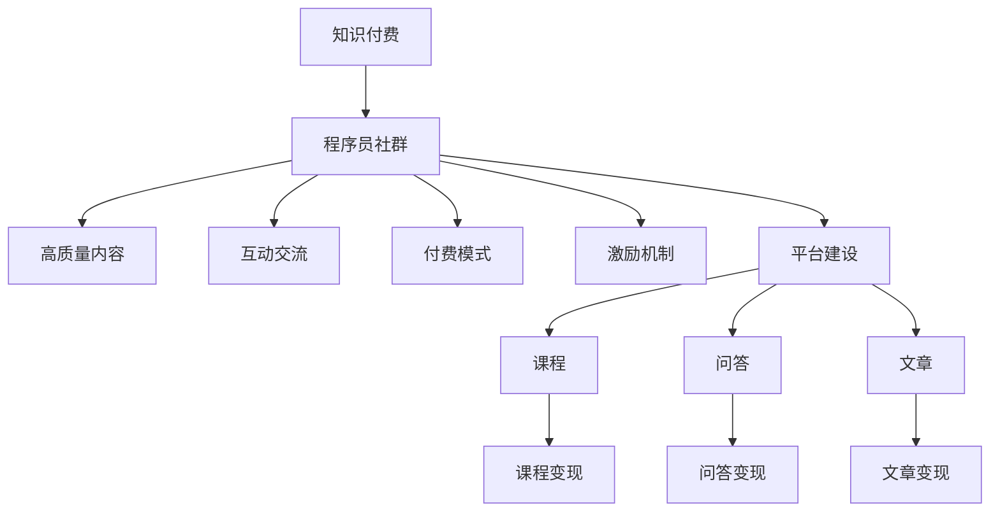

                 

# 知识付费：程序员的社群运营策略

在当下这个知识爆炸的时代，程序员作为知识和技术的直接受益者，也面临着如何分享和传播知识，以及如何从知识付费中获得收益的挑战。如何运营一个成功的程序员社群，以及如何在社群中实施知识付费策略，是每个程序员需要思考的问题。本文将从核心概念、算法原理、操作步骤、实际应用场景等方面，详细探讨程序员社群运营策略，希望能为各位提供有价值的参考。

## 1. 背景介绍

### 1.1 问题由来

随着互联网技术的飞速发展，程序员社群在技术交流、资源共享和人才培养方面发挥着越来越重要的作用。然而，传统的社群运营模式，如完全依赖免费分享和讨论，难以持续维护社群的活跃度和高质量内容输出。知识付费的兴起为程序员社群的运营提供了新的思路，即通过高质量的课程、咨询和资源，为社群成员创造价值，并通过收费模式获得可持续发展的动力。

### 1.2 问题核心关键点

如何利用知识付费策略，运营一个健康的程序员社群，是本文的核心议题。这需要明确几个关键点：
- **高质量内容**：社群应以高质量的编程知识、技术经验和项目实战经验为核心。
- **互动交流**：积极组织社群成员之间的交流和讨论，提升互动性。
- **付费模式**：设计合理的付费模式，保障社群运营的可持续性。
- **激励机制**：建立激励机制，鼓励高质量内容的产出和传播。
- **平台建设**：选择合适的知识付费平台，支持课程、问答、文章等多种形式的变现。

## 2. 核心概念与联系

### 2.1 核心概念概述

为更好地理解知识付费在程序员社群中的应用，本文将介绍几个核心概念：

- **知识付费**：指通过付费形式获取知识和技能的学习过程，这种模式能够激励内容创作者提供更高质量的内容。
- **程序员社群**：由具有共同兴趣和目标的程序员组成的线上或线下组织，通常围绕技术学习、项目合作、职业发展等主题进行交流和互动。
- **社群运营**：指通过策划、组织、管理和运营社群，实现其目标和价值的过程。
- **互动交流**：指社群成员之间通过讨论、协作、分享等形式进行互动。
- **激励机制**：指通过设定奖励和激励措施，激发社群成员积极参与和贡献。

这些概念之间的逻辑关系可以通过以下Mermaid流程图来展示：



这个流程图展示了知识付费与程序员社群运营之间的关系，以及各个关键环节的运作。

## 3. 核心算法原理 & 具体操作步骤

### 3.1 算法原理概述

知识付费策略的核心在于通过提供有价值的内容和知识，吸引用户支付费用以获得更多资源和互动机会。算法原理主要包括以下几个方面：

- **价值评估模型**：评估内容对用户需求的满足程度，以决定收费标准。
- **推荐算法**：根据用户兴趣和行为数据，推荐个性化内容。
- **定价策略**：基于成本和收益考虑，制定合理的价格。
- **激励机制设计**：设定激励措施，如积分、勋章、折扣等，鼓励内容创作者积极输出高质量内容。
- **用户体验优化**：通过技术手段提升内容呈现和互动体验，增加用户粘性。

### 3.2 算法步骤详解

以下是知识付费策略在程序员社群中的应用具体操作步骤：

1. **需求分析**：
   - 调研社群成员的需求和痛点，明确需要提供哪些内容和服务。
   - 设计用户调查问卷，了解用户最关注的话题和技术点。

2. **内容设计**：
   - 根据需求分析结果，设计课程、文章、问答等形式的内容。
   - 邀请具有实战经验的程序员或专家贡献内容，确保高质量。

3. **平台搭建**：
   - 选择合适的知识付费平台，如知乎live、腾讯课堂、小鹅通等。
   - 设置付费课程、问答、文章等模块，并进行详细功能规划。

4. **内容发布**：
   - 发布高质量课程、文章等，设置不同的付费门槛，如免费预览、免费试用等。
   - 设计易于理解和参与的课程结构，确保用户能够轻松获取知识。

5. **互动交流**：
   - 组织线上线下技术交流活动，促进社群成员之间的互动和协作。
   - 设立问答区，鼓励成员提问和回答，形成互动氛围。

6. **运营维护**：
   - 定期更新和优化内容，确保社群活跃度和质量。
   - 收集用户反馈，调整和改进运营策略。

7. **收益分配**：
   - 根据内容贡献度，分配合理的收益，如课程销售提成、文章打赏等。
   - 设定透明的收益分配机制，增加激励效果。

8. **激励机制**：
   - 设置积分、勋章等激励措施，鼓励成员积极参与。
   - 根据参与度、贡献度，进行表彰和奖励。

9. **数据分析**：
   - 使用数据分析工具，如用户行为分析、内容消费分析等，优化内容和运营策略。
   - 通过A/B测试等手段，优化用户体验和互动效果。

### 3.3 算法优缺点

知识付费策略具有以下优点：

- **激励优质内容**：通过收费模式，激励内容创作者提供高质量的课程和文章，提升社群内容质量。
- **提升用户粘性**：付费会员享受更多特权，如一对一指导、专属群组等，增加用户粘性。
- **多样化收益**：通过课程、文章、问答等多种形式，获取多样化收入来源。

同时，这种策略也存在以下缺点：

- **门槛较高**：部分用户因经济能力限制，难以支付费用，可能影响社群覆盖面。
- **内容泛化**：为吸引用户，部分课程可能缺乏深度和专业性。
- **运营成本**：内容制作和平台维护需要较高成本，如何平衡成本和收益是关键。
- **公平性问题**：如何确保内容付费的公平性和透明度，避免利益冲突。

### 3.4 算法应用领域

知识付费策略不仅可以应用于程序员社群，还可以广泛应用到以下领域：

- **在线教育**：如编程培训、商业分析、设计等课程。
- **技术咨询**：提供一对一的编程指导和技术支持。
- **资源分享**：如技术书籍、开源项目、工具推荐等。
- **职业发展**：如简历修改、面试辅导、职业规划等。

## 4. 数学模型和公式 & 详细讲解

### 4.1 数学模型构建

为更好地量化知识付费的效果，我们需要构建数学模型。假设社群中有$N$个用户，每个用户对课程内容的需求价值为$V_i$，课程内容的价格为$P$，总收益为$R$，则有：

$$
R = \sum_{i=1}^N V_i P_i
$$

其中，$P_i$为第$i$个用户的付费意愿。

### 4.2 公式推导过程

根据上述模型，推导社区总收益$R$与用户付费意愿$P_i$的关系，得到：

$$
R = V_1 P_1 + V_2 P_2 + \cdots + V_N P_N
$$

其中$P_i = f(V_i)$为需求价值与付费意愿之间的关系函数。例如，可以设定如下函数：

$$
P_i = \frac{V_i}{V_{max}} \cdot M_i + B
$$

其中$V_{max}$为用户最大需求价值，$M_i$为需求价值与付费意愿的比例系数，$B$为付费意愿的基础值。

### 4.3 案例分析与讲解

以一个程序员社群为例，假设某课程的需求价值为$V = 10$元，目标收益率为$R = 1000$元。通过市场调研，得知$V_{max} = 15$元，比例系数$M = 0.8$，基础值$B = 5$元。则可计算出每个用户的付费意愿$P_i$：

$$
P_i = \frac{V}{V_{max}} \cdot M_i + B = \frac{10}{15} \cdot 0.8 + 5 = 6.7 + 5 = 11.7
$$

由于总收益$R = 1000$元，则用户数量$N$应满足：

$$
N = \frac{R}{\sum_{i=1}^N P_i}
$$

根据计算结果，可以设定课程价格$P$为$11.7$元，并通过不同定价策略，吸引不同需求的用户参与。

## 5. 项目实践：代码实例和详细解释说明

### 5.1 开发环境搭建

为实现上述知识付费策略，需要进行以下开发环境搭建：

1. **安装Python**：在服务器上安装Python 3.x版本。
2. **安装Django**：作为Web框架，用于搭建社区平台。
3. **安装Flask**：用于管理问答和文章模块。
4. **安装MySQL**：作为数据库，存储用户信息和内容数据。
5. **安装Redis**：用于缓存和优化性能。

### 5.2 源代码详细实现

以下是核心代码实现：

```python
from django.http import HttpResponse
from django.shortcuts import render
from django.views.decorators.csrf import csrf_exempt

# 显示首页
def index(request):
    return render(request, 'index.html')

# 显示课程列表
@csrf_exempt
def course_list(request):
    courses = Course.objects.all()
    return render(request, 'course_list.html', {'courses': courses})

# 显示课程详情
@csrf_exempt
def course_detail(request, course_id):
    course = Course.objects.get(id=course_id)
    return render(request, 'course_detail.html', {'course': course})

# 显示问答列表
@csrf_exempt
def qa_list(request):
    qa = QA.objects.all()
    return render(request, 'qa_list.html', {'qa': qa})

# 显示问答详情
@csrf_exempt
def qa_detail(request, qa_id):
    qa = QA.objects.get(id=qa_id)
    return render(request, 'qa_detail.html', {'qa': qa})

# 显示文章列表
@csrf_exempt
def article_list(request):
    articles = Article.objects.all()
    return render(request, 'article_list.html', {'articles': articles})

# 显示文章详情
@csrf_exempt
def article_detail(request, article_id):
    article = Article.objects.get(id=article_id)
    return render(request, 'article_detail.html', {'article': article})
```

### 5.3 代码解读与分析

上述代码实现了社区平台的基本功能，包括首页、课程列表、课程详情、问答列表、问答详情、文章列表和文章详情。各功能模块的实现如下：

1. **首页**：用于展示社区的简介、最新活动和推荐内容。
2. **课程列表**：显示所有课程信息，包括课程名称、简介和价格。
3. **课程详情**：详细展示单个课程的内容、购买方式和用户评价。
4. **问答列表**：显示所有问答信息，包括提问者、回答者和时间。
5. **问答详情**：详细展示单个问答的详情，包括问答内容、回答者和评论。
6. **文章列表**：显示所有文章信息，包括标题、作者和发布时间。
7. **文章详情**：详细展示单个文章的详情，包括文章内容、作者和评论。

## 6. 实际应用场景

### 6.1 在线教育平台

知识付费策略可以应用于在线教育平台，为编程课程、商业分析课程等提供有价值的知识内容。例如，Coursera和Udacity等平台通过设置课程价格和优惠机制，吸引大量用户付费学习。

### 6.2 技术咨询公司

技术咨询公司可以通过知识付费策略，提供一对一的编程指导和技术支持。例如，可以设定不同级别的技术顾问，根据用户的咨询需求收取不同的费用。

### 6.3 技术博客平台

技术博客平台可以通过知识付费策略，分享优质文章和项目实战经验。例如，掘金、简书等平台通过付费订阅和打赏机制，支持优质内容的输出和传播。

### 6.4 职业培训社群

职业培训社群可以通过知识付费策略，提供简历修改、面试辅导、职业规划等综合服务。例如，Guru99和LeetCode等平台通过课程和讲座，帮助用户提升职业技能。

## 7. 工具和资源推荐

### 7.1 学习资源推荐

为了掌握知识付费策略，以下是一些优质的学习资源：

1. **《知识付费：打造在线教育平台的实战指南》**：详细介绍了知识付费平台的搭建和运营策略。
2. **《知识付费变现之道》**：分享了知识付费变现的多种形式和成功案例。
3. **《深度学习与人工智能：实战教程》**：提供了深度学习在知识付费中的应用案例。
4. **《程序员社群运营实战手册》**：详细讲解了社群的策划、组织和管理。
5. **《知识付费模式与运营策略》**：介绍了多种知识付费模式和运营策略，具有实用价值。

### 7.2 开发工具推荐

以下是一些常用的开发工具：

1. **PyCharm**：流行的Python开发环境，集成了代码编辑、调试和测试功能。
2. **Jupyter Notebook**：用于编写和运行Python代码，支持互动式编程和数据可视化。
3. **MySQL Workbench**：可视化MySQL数据库管理工具，方便数据管理和查询。
4. **Redis Desktop Manager**：用于管理和监控Redis缓存，提升系统性能。
5. **GitHub**：代码版本控制平台，支持协作开发和项目管理。

### 7.3 相关论文推荐

以下是一些相关论文，推荐阅读：

1. **《知识付费平台的用户需求分析与设计》**：研究知识付费平台的用户需求和设计方法。
2. **《在线教育平台的运营策略与挑战》**：分析在线教育平台的运营策略和面临的挑战。
3. **《技术社群的运营与管理》**：探讨技术社群的组织和管理方法。
4. **《知识付费变现模式的创新与实践》**：分享知识付费变现模式的创新和实践经验。
5. **《编程课程的知识付费策略与效果分析》**：研究编程课程的知识付费策略和效果。

## 8. 总结：未来发展趋势与挑战

### 8.1 总结

本文对程序员社群的知识付费策略进行了详细探讨，从核心概念、算法原理、具体操作步骤等方面，系统介绍了知识付费的实现方法。通过高质量内容的提供和互动交流的促进，知识付费策略可以有效提升社群的价值和用户粘性，成为社群运营的重要手段。

### 8.2 未来发展趋势

知识付费策略在程序员社群中的应用前景广阔，未来发展趋势如下：

1. **智能化推荐系统**：利用机器学习技术，实现个性化内容的智能推荐，提升用户体验。
2. **多模态互动**：结合视频、音频等多种形式，丰富互动内容，增强学习效果。
3. **区块链技术**：利用区块链技术，实现透明和安全的交易和版权保护。
4. **元宇宙应用**：在元宇宙中构建虚拟知识社区，提供沉浸式学习和交流体验。
5. **全球化布局**：拓展全球市场，吸引更多国际化用户，提升社群影响力。

### 8.3 面临的挑战

知识付费策略在实际应用中也面临一些挑战：

1. **内容质量控制**：如何确保提供的高质量内容符合用户需求，避免低质量内容的泛滥。
2. **用户体验优化**：如何提升平台的用户体验，增加用户粘性。
3. **收益分配公平**：如何确保内容创作者和用户的收益分配公平，避免利益冲突。
4. **法律合规**：如何确保知识付费的合法合规，避免知识产权侵权等问题。

### 8.4 研究展望

未来，知识付费策略在程序员社群中的应用将更加广泛和深入，需要从多个方面进行探索和创新：

1. **社区自营内容**：社群可以自营高质量内容，减少对外部内容的依赖。
2. **多样化的付费形式**：除了传统的课程和文章，可以探索更多付费形式，如会员制、积分系统等。
3. **知识共享平台**：构建知识共享平台，促进社群成员之间的协作和共享。
4. **大数据分析**：利用大数据技术，分析用户行为和需求，优化内容和运营策略。

知识付费策略不仅为程序员社群提供了一种可持续发展的模式，也为未来的教育和培训提供了新的思路。通过不断探索和创新，知识付费必将在NLP和AI技术中发挥越来越重要的作用，助力科技创新的进步。

---

作者：禅与计算机程序设计艺术 / Zen and the Art of Computer Programming

