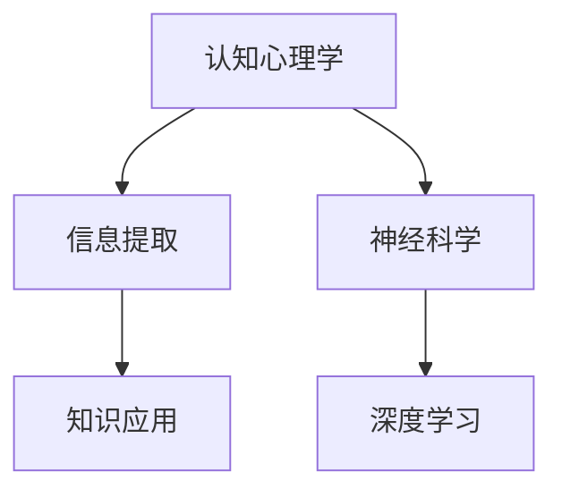

                 

# 知识内化：从输入到输出的转变

> 关键词：知识内化, 学习路径, 认知心理学, 信息提取, 人工智能, 模型构建, 深度学习, 数据处理, 应用场景

## 1. 背景介绍

### 1.1 问题由来
在信息爆炸的时代，知识的获取变得越来越容易，然而知识的理解和应用却仍然是一个重大挑战。尽管各种在线教育平台、搜索引擎和电子书籍提供了海量的学习资源，人们依然难以高效地从这些信息中内化知识，转化为实际的解决问题能力。这不仅阻碍了个人成长，也限制了社会的发展。

### 1.2 问题核心关键点
知识内化（Knowledge Internalization）是一个复杂的过程，涉及到认知心理学、神经科学、教育学等多个学科。知识内化不仅是简单的信息记忆，更是一种深入理解和应用的能力。它需要人们将新知识与已有认知结构相结合，形成新的知识结构，从而能够灵活地应用知识解决问题。

## 2. 核心概念与联系

### 2.1 核心概念概述

为了更好地理解知识内化的过程，我们将介绍几个关键概念：

- **认知心理学**：研究人类认知过程的科学，包括信息处理、记忆、思维、语言等方面的研究。知识内化涉及到认知心理学的多个方面，特别是信息编码和提取机制的研究。
- **信息提取（Retrieval）**：从长期记忆中快速检索出相关信息的过程。这一过程是知识应用的关键，涉及记忆存储、检索策略等方面。
- **神经科学**：研究大脑结构和功能的科学，揭示了记忆和学习的神经基础。通过神经科学的研究，可以更好地理解知识内化的机制。
- **深度学习**：一种基于人工神经网络的学习方法，模拟人脑的信息处理机制。深度学习在知识内化中扮演了重要角色，特别是通过构建复杂模型来模拟信息提取和应用。

这些核心概念之间的联系可以通过以下Mermaid流程图来展示：



这个流程图展示了知识内化过程中各概念之间的联系：

1. 认知心理学提供了对人类认知过程的深入理解，为知识内化提供了理论基础。
2. 信息提取是知识内化的核心步骤，帮助从长期记忆中检索信息。
3. 神经科学揭示了记忆和学习的神经机制，为信息提取提供了生物学基础。
4. 深度学习通过构建复杂的神经网络模型，模拟信息提取和应用的过程，为知识内化提供了技术手段。
5. 知识应用是知识内化的最终目标，通过信息提取和应用，实现知识的内化和外化。

## 3. 核心算法原理 & 具体操作步骤
### 3.1 算法原理概述

知识内化可以分为两个主要阶段：输入和输出。在输入阶段，通过信息提取和编码，将知识存储在长期记忆中；在输出阶段，通过信息解码和应用，将知识转化为实际解决问题的能力。

### 3.2 算法步骤详解

**输入阶段**：

1. **信息获取**：通过阅读、观察、听讲等方式获取知识信息。这一步是知识内化的起点。
2. **信息编码**：将获取的信息通过编码过程，转化为大脑可以处理的形式。编码过程包括信息选择、信息分类、信息关联等步骤。
3. **记忆存储**：将编码后的信息存储在长期记忆中，形成新的知识结构。

**输出阶段**：

1. **信息解码**：在需要应用知识时，从长期记忆中检索出相关信息。
2. **信息应用**：将检索出的信息与当前问题相结合，进行推理、决策等过程，形成解决方案。

### 3.3 算法优缺点

知识内化算法具有以下优点：

- **全面性**：通过信息提取和应用，实现了从知识的获取到应用的完整过程，更加全面地反映了知识的价值。
- **可扩展性**：信息提取和应用过程可以灵活地应用于各种学习场景，如在线教育、自主学习等。
- **灵活性**：通过深度学习模型，可以模拟不同的信息提取和应用策略，适应不同的学习需求。

同时，该算法也存在一些局限性：

- **复杂性**：知识内化的整个过程涉及多个学科，理论基础复杂，实践难度较大。
- **资源需求**：深度学习模型需要大量的数据和计算资源，对硬件要求较高。
- **个体差异**：知识内化过程受个体认知水平、学习方法等因素影响，难以一概而论。

### 3.4 算法应用领域

知识内化算法在多个领域都有广泛的应用：

- **在线教育**：通过个性化学习路径的设计，帮助学生高效地内化知识。
- **自主学习**：利用信息提取和应用模型，提供智能化的学习辅助。
- **职业培训**：为专业人士提供高效的训练方式，提升其专业技能。
- **心理健康**：通过信息提取和应用，帮助患者管理情绪和行为，提升心理健康水平。
- **智能客服**：利用深度学习模型，模拟知识内化过程，提升客服系统的智能水平。

## 4. 数学模型和公式 & 详细讲解 & 举例说明

### 4.1 数学模型构建

我们以深度学习模型为例，介绍信息提取和应用的数学模型构建。

设输入为 $x$，表示获取的知识信息。通过深度学习模型 $f(x)$，对 $x$ 进行编码，得到编码后的信息 $h$。

$$
h = f(x)
$$

编码后的信息 $h$ 存储在长期记忆中。当需要应用知识时，通过解码器 $g(h)$ 从长期记忆中检索出相关信息。

$$
y = g(h)
$$

最终，解码后的信息 $y$ 用于解决实际问题。

### 4.2 公式推导过程

以经典的卷积神经网络（CNN）为例，推导信息提取和应用的基本公式。

假设输入 $x$ 为一维信号，CNN 的基本结构包括卷积层、池化层和全连接层。

- **卷积层**：提取局部特征。卷积层的参数为卷积核 $w$，通过卷积运算，提取输入信号的局部特征。
- **池化层**：缩小特征图尺寸，保留主要信息。池化层通过降采样的方式，减少特征图的大小，提取重要信息。
- **全连接层**：将特征图转换为输出信号。全连接层通过一系列线性变换，将特征图转换为最终输出信号 $y$。

假设输入信号 $x$ 的长度为 $L$，输出信号 $y$ 的长度为 $M$。卷积层的输出特征图大小为 $H\times W$，池化层的池化窗口大小为 $K$，池化步长为 $S$。

通过卷积层和池化层的组合，可以提取出输入信号的特征，表示为 $x'$。

$$
x' = \text{CNN}(x)
$$

接着，通过全连接层对 $x'$ 进行线性变换，得到输出信号 $y$。

$$
y = \text{FC}(x')
$$

其中 $\text{FC}$ 表示全连接层的线性变换。

### 4.3 案例分析与讲解

以图像分类为例，分析信息提取和应用的具体过程。

假设输入为一幅图像 $x$，通过卷积神经网络（CNN）模型，提取图像的特征表示 $h$。

$$
h = \text{CNN}(x)
$$

接着，将特征表示 $h$ 输入到全连接层中，得到输出信号 $y$。

$$
y = \text{FC}(h)
$$

输出信号 $y$ 表示图像分类的结果，通常使用softmax函数将 $y$ 转化为概率分布。

$$
\hat{y} = \text{softmax}(y)
$$

其中 $\hat{y}$ 表示图像分类的概率分布。

通过训练，CNN 模型可以学习到图像特征的表示方式，实现从输入到输出的知识内化过程。

## 5. 项目实践：代码实例和详细解释说明

### 5.1 开发环境搭建

在进行知识内化实践前，我们需要准备好开发环境。以下是使用Python进行TensorFlow开发的环境配置流程：

1. 安装Anaconda：从官网下载并安装Anaconda，用于创建独立的Python环境。

2. 创建并激活虚拟环境：
```bash
conda create -n tf-env python=3.8 
conda activate tf-env
```

3. 安装TensorFlow：根据CUDA版本，从官网获取对应的安装命令。例如：
```bash
conda install tensorflow -c conda-forge -c pytorch -c pypi -c ibiblio
```

4. 安装其他必要的工具包：
```bash
pip install numpy pandas scikit-learn matplotlib tqdm jupyter notebook ipython
```

完成上述步骤后，即可在`tf-env`环境中开始知识内化实践。

### 5.2 源代码详细实现

下面以图像分类为例，给出使用TensorFlow进行知识内化的PyTorch代码实现。

首先，定义图像分类任务的输入和标签：

```python
from tensorflow.keras.datasets import mnist
from tensorflow.keras.utils import to_categorical

(x_train, y_train), (x_test, y_test) = mnist.load_data()
x_train, x_test = x_train / 255.0, x_test / 255.0
y_train = to_categorical(y_train, num_classes=10)
y_test = to_categorical(y_test, num_classes=10)
```

接着，定义卷积神经网络模型：

```python
from tensorflow.keras import layers, models

model = models.Sequential([
    layers.Conv2D(32, (3, 3), activation='relu', input_shape=(28, 28, 1)),
    layers.MaxPooling2D((2, 2)),
    layers.Conv2D(64, (3, 3), activation='relu'),
    layers.MaxPooling2D((2, 2)),
    layers.Conv2D(64, (3, 3), activation='relu'),
    layers.Flatten(),
    layers.Dense(64, activation='relu'),
    layers.Dense(10, activation='softmax')
])
```

然后，编译模型并进行训练：

```python
model.compile(optimizer='adam', loss='categorical_crossentropy', metrics=['accuracy'])
model.fit(x_train, y_train, epochs=5, batch_size=64, validation_data=(x_test, y_test))
```

最后，评估模型的性能：

```python
model.evaluate(x_test, y_test)
```

以上就是使用TensorFlow进行图像分类任务知识内化的完整代码实现。可以看到，借助TensorFlow和Keras，知识内化模型的构建和训练变得简洁高效。

### 5.3 代码解读与分析

让我们再详细解读一下关键代码的实现细节：

**定义输入和标签**：
- 使用MNIST数据集，加载训练集和测试集的图像和标签数据。
- 将图像数据标准化到0-1之间，将标签数据转化为one-hot编码形式。

**定义卷积神经网络模型**：
- 使用Keras API构建卷积神经网络模型。模型包括多个卷积层、池化层和全连接层。
- 卷积层使用3x3的卷积核，激活函数为ReLU，输入形状为28x28x1。
- 池化层使用2x2的池化窗口，降采样的步长为2。
- 全连接层使用64个神经元，激活函数为ReLU。
- 输出层使用10个神经元，激活函数为softmax，输出图像分类的概率分布。

**编译和训练模型**：
- 使用Adam优化器，交叉熵损失函数和准确率评估指标。
- 设置训练轮数为5，批次大小为64。
- 使用测试集进行模型评估。

**评估模型性能**：
- 使用测试集评估模型性能，输出准确率和损失函数。

可以看到，TensorFlow和Keras提供了强大的工具支持，使得知识内化模型的构建和训练变得简单直观。开发者可以将更多精力放在数据处理、模型改进等高层逻辑上，而不必过多关注底层的实现细节。

当然，工业级的系统实现还需考虑更多因素，如模型的保存和部署、超参数的自动搜索、更灵活的任务适配层等。但核心的知识内化过程基本与此类似。

## 6. 实际应用场景

### 6.1 在线教育

在线教育平台通过知识内化算法，可以为学生提供个性化的学习路径，帮助其高效地掌握知识。具体而言，系统可以记录学生的学习行为，分析其知识掌握情况，通过信息提取和应用模型，推荐合适的学习材料，引导学生进行深入学习。

在技术实现上，可以收集学生的学习行为数据，如学习时间、答题情况等，构建学生知识掌握的向量表示。通过训练，知识内化模型能够预测学生对不同知识点的掌握程度。在推荐学习材料时，系统可以根据学生的知识水平和兴趣偏好，选择适合的教材和视频资源。

### 6.2 智能客服

智能客服系统通过知识内化算法，可以快速理解用户提出的问题，并提供准确的解答。具体而言，系统可以收集用户的常见问题和经典回答，构建知识库。在用户提问时，知识内化模型通过信息提取和应用，从知识库中检索出最相关的回答，进行快速回复。

在技术实现上，可以将用户问题和答案构建成监督数据，训练知识内化模型。模型通过输入问题，从知识库中检索出最匹配的回答，生成自然流畅的回复。对于用户提出的新问题，系统可以动态搜索知识库，进行实时响应。

### 6.3 医疗诊断

医疗诊断系统通过知识内化算法，可以快速理解病人的病史和症状，提供准确的诊断建议。具体而言，系统可以收集大量的病历和诊断数据，构建知识库。在病人就诊时，知识内化模型通过信息提取和应用，从知识库中检索出最相关的诊断建议，进行快速决策。

在技术实现上，可以将病人的病历和症状构建成监督数据，训练知识内化模型。模型通过输入病人的信息，从知识库中检索出最匹配的诊断建议，生成诊断报告。对于复杂的病情，系统可以动态搜索知识库，进行深度推理和判断。

### 6.4 未来应用展望

随着知识内化算法的不断发展，其在多个领域的应用前景广阔：

- **个性化教育**：通过知识内化算法，为学生提供个性化的学习路径，提升学习效率。
- **智能客服**：快速理解用户需求，提供准确的解答，提升客户满意度。
- **医疗诊断**：快速理解病历和症状，提供准确的诊断建议，提升医疗水平。
- **金融分析**：理解市场动态，提供准确的投资建议，提升投资收益。
- **情感分析**：理解情感倾向，提供情感分析结果，提升用户满意度。

## 7. 工具和资源推荐

### 7.1 学习资源推荐

为了帮助开发者系统掌握知识内化的理论基础和实践技巧，这里推荐一些优质的学习资源：

1. 《深度学习》系列书籍：由大模型技术专家撰写，深入浅出地介绍了深度学习的基本原理和应用。
2. 《认知心理学》课程：斯坦福大学开设的心理学课程，介绍了认知过程的基本理论和应用。
3. 《神经科学原理》书籍：介绍了神经科学的基础知识和前沿研究。
4. 《机器学习》书籍：介绍了机器学习的基本原理和应用，包括监督学习、无监督学习、强化学习等。
5. TensorFlow官方文档：提供了TensorFlow的详细使用手册和样例代码，是学习知识内化算法的必备资料。

通过对这些资源的学习实践，相信你一定能够快速掌握知识内化的精髓，并用于解决实际的NLP问题。

### 7.2 开发工具推荐

高效的开发离不开优秀的工具支持。以下是几款用于知识内化开发的常用工具：

1. TensorFlow：基于Python的开源深度学习框架，提供了强大的模型构建和训练功能，适合复杂的信息提取和应用任务。
2. Keras：Keras API提供了一个高层次的API，简化了深度学习模型的构建和训练过程，适合快速原型开发和实验验证。
3. PyTorch：基于Python的开源深度学习框架，提供了灵活的计算图和动态模型构建能力，适合灵活的信息提取和应用任务。
4. Jupyter Notebook：提供了一个交互式的开发环境，方便开发者进行实验和调试。
5. Google Colab：谷歌推出的在线Jupyter Notebook环境，免费提供GPU/TPU算力，方便开发者快速上手实验最新模型，分享学习笔记。

合理利用这些工具，可以显著提升知识内化任务的开发效率，加快创新迭代的步伐。

### 7.3 相关论文推荐

知识内化算法的发展源于学界的持续研究。以下是几篇奠基性的相关论文，推荐阅读：

1. Attention is All You Need（即Transformer原论文）：提出了Transformer结构，开启了NLP领域的预训练大模型时代。
2. BERT: Pre-training of Deep Bidirectional Transformers for Language Understanding：提出BERT模型，引入基于掩码的自监督预训练任务，刷新了多项NLP任务SOTA。
3. Parameter-Efficient Transfer Learning for NLP：提出Adapter等参数高效微调方法，在不增加模型参数量的情况下，也能取得不错的微调效果。
4. Knowledge-Driven Transfer Learning for NLP：提出知识增强的转移学习模型，提高了模型的知识和泛化能力。
5. Neural Symbolic Machine Translation：将神经网络和符号逻辑结合，提高了翻译模型的准确性和可解释性。

这些论文代表了大模型知识内化技术的发展脉络。通过学习这些前沿成果，可以帮助研究者把握学科前进方向，激发更多的创新灵感。

## 8. 总结：未来发展趋势与挑战

### 8.1 总结

本文对知识内化过程进行了全面系统的介绍。首先阐述了知识内化的背景和意义，明确了信息提取和应用的过程。其次，从原理到实践，详细讲解了知识内化的数学模型和具体操作步骤，给出了知识内化任务开发的完整代码实例。同时，本文还广泛探讨了知识内化方法在多个领域的应用前景，展示了知识内化算法的广泛应用价值。最后，本文精选了知识内化的各类学习资源，力求为读者提供全方位的技术指引。

通过本文的系统梳理，可以看到，知识内化算法不仅在NLP领域具有重要应用，还广泛应用于在线教育、智能客服、医疗诊断等多个领域。知识内化通过信息提取和应用，实现了从知识获取到知识应用的完整过程，为各种智能系统的构建提供了坚实的基础。

### 8.2 未来发展趋势

展望未来，知识内化算法将呈现以下几个发展趋势：

1. **多模态知识内化**：将视觉、听觉等多模态信息与文本信息结合，构建更加全面、准确的知识模型。
2. **跨领域知识内化**：通过跨领域的信息提取和应用，构建更加通用和灵活的知识模型。
3. **自适应知识内化**：通过自适应学习机制，动态调整知识提取和应用策略，适应不同的学习需求。
4. **知识推理与逻辑推理**：引入逻辑推理和知识推理机制，提高模型的推理能力和可解释性。
5. **人机协同知识内化**：通过人机协同机制，增强知识内化的灵活性和智能性。

这些趋势展示了知识内化算法的广阔前景，为知识内化技术的进一步发展提供了方向。

### 8.3 面临的挑战

尽管知识内化算法已经取得了显著进展，但在向深度应用迈进的过程中，仍面临诸多挑战：

1. **资源瓶颈**：知识内化算法需要大量的数据和计算资源，对硬件要求较高。如何在资源受限的情况下高效地实现知识内化，是未来的重要研究方向。
2. **鲁棒性不足**：知识内化模型面对不同的数据分布，泛化性能可能不够理想。如何提高模型的鲁棒性和泛化能力，是未来的一个重要课题。
3. **可解释性不足**：知识内化模型的决策过程通常缺乏可解释性，难以对其推理逻辑进行分析和调试。如何提高模型的可解释性，是未来的重要研究方向。
4. **安全性问题**：知识内化模型可能存在误导性输出，对用户和社会造成负面影响。如何保证模型的安全性，是未来的一个重要研究方向。
5. **伦理和道德问题**：知识内化模型的应用可能涉及隐私和伦理问题，如何平衡用户隐私保护和知识内化的需求，是未来的一个重要课题。

这些挑战需要学界和产业界的共同努力，通过持续的研究和探索，才能克服。相信随着知识内化算法的不断进步，其应用前景将更加广阔，为人类认知智能的发展带来深远影响。

### 8.4 研究展望

面对知识内化算法面临的挑战，未来的研究需要在以下几个方面寻求新的突破：

1. **多模态知识内化**：将视觉、听觉等多模态信息与文本信息结合，构建更加全面、准确的知识模型。
2. **跨领域知识内化**：通过跨领域的信息提取和应用，构建更加通用和灵活的知识模型。
3. **自适应知识内化**：通过自适应学习机制，动态调整知识提取和应用策略，适应不同的学习需求。
4. **知识推理与逻辑推理**：引入逻辑推理和知识推理机制，提高模型的推理能力和可解释性。
5. **人机协同知识内化**：通过人机协同机制，增强知识内化的灵活性和智能性。
6. **隐私保护与伦理约束**：通过隐私保护和伦理约束机制，确保知识内化的安全性和公平性。

这些研究方向将推动知识内化算法的进一步发展，为构建更加智能、可靠的知识内化系统提供新的思路和方向。面向未来，知识内化算法的研究将迎来更多的机遇和挑战，为人工智能技术的发展注入新的动力。

## 9. 附录：常见问题与解答

**Q1：知识内化是否适用于所有类型的知识？**

A: 知识内化算法适用于大多数类型的知识，但不同类型知识的表示方式和提取方式可能有所不同。例如，视觉知识的内化需要图像识别和处理技术，而语言知识的内化则需要自然语言处理技术。

**Q2：如何提高知识内化算法的效率？**

A: 提高知识内化算法的效率可以通过以下方法：
1. **数据预处理**：通过数据清洗、归一化等预处理操作，提高数据的质量和效率。
2. **模型优化**：使用高效的模型结构和优化算法，减少计算资源消耗。
3. **分布式计算**：通过分布式计算技术，将任务并行化处理，提高计算速度。
4. **知识压缩**：通过知识压缩技术，减少知识表示的复杂度，提高计算效率。
5. **硬件优化**：使用高效的硬件设备，如GPU、TPU等，提高计算速度。

**Q3：知识内化算法在实际应用中面临哪些挑战？**

A: 知识内化算法在实际应用中面临以下挑战：
1. **数据获取困难**：不同领域的数据获取难度不同，数据质量也难以保证。
2. **模型复杂度高**：知识内化算法通常需要构建复杂的模型，计算资源消耗较大。
3. **模型泛化能力不足**：知识内化模型在不同领域和数据上的泛化能力有限，需要进一步优化。
4. **隐私和安全问题**：知识内化算法可能涉及隐私数据和伦理问题，需要严格的数据保护措施。
5. **可解释性不足**：知识内化算法的决策过程通常缺乏可解释性，难以对其推理逻辑进行分析和调试。

**Q4：如何评估知识内化算法的性能？**

A: 评估知识内化算法的性能通常使用以下指标：
1. **准确率**：衡量模型对输入数据进行推理和判断的准确性。
2. **召回率**：衡量模型对输入数据中重要信息的覆盖程度。
3. **F1分数**：综合考虑准确率和召回率，评估模型的整体性能。
4. **计算效率**：衡量模型在训练和推理过程中的计算速度和资源消耗。
5. **可解释性**：衡量模型决策过程的可解释性和逻辑性。

这些指标可以根据具体任务和应用场景进行灵活选择和组合，帮助评估知识内化算法的性能和效果。

---

作者：禅与计算机程序设计艺术 / Zen and the Art of Computer Programming

