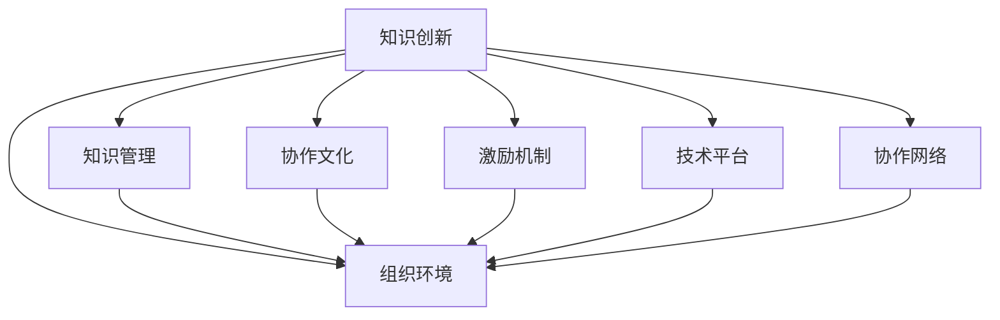

                 

# 知识创新的组织环境因素

> 关键词：知识创新、组织环境、知识管理、协作文化、激励机制、技术平台

## 1. 背景介绍

### 1.1 问题由来
在全球知识经济时代，知识创新成为了推动企业发展的重要动力。越来越多的组织认识到，拥有创新能力的企业能够在激烈的市场竞争中脱颖而出。然而，知识创新并非易事，其背后需要复杂的环境因素支撑。组织环境不仅决定了知识创新的能力，还影响了创新的持续性。本文将深入探讨知识创新的组织环境因素，分析如何通过优化这些因素，促进企业知识创新能力的提升。

### 1.2 问题核心关键点
知识创新的关键在于将知识和创新过程与组织环境紧密结合，创建有利于知识共享、创新和应用的生态。具体来说，知识创新需要：

- **知识共享**：建立高效的沟通机制，鼓励知识自由流动和共享。
- **创新文化**：营造鼓励探索、容忍失败的创新文化，激励员工勇于尝试新想法。
- **激励机制**：设计合理的激励体系，奖励创新成果，促进知识创新。
- **技术平台**：使用先进的技术平台支持知识管理，提供信息搜索、协作工具和创新工具。
- **协作网络**：建立跨部门、跨团队的协作网络，促进知识流动和协同工作。

这些关键因素相互交织，共同构成了知识创新的组织环境，影响着创新活动的成功与否。

## 2. 核心概念与联系

### 2.1 核心概念概述

为更好地理解知识创新在组织环境中的作用，本节将介绍几个密切相关的核心概念：

- **知识创新(Knowledge Innovation)**：通过知识获取、整合和创造，形成新的产品、服务或商业模式的创新过程。
- **组织环境(Organizational Environment)**：影响组织运作和发展的外部和内部因素的总和，包括文化、结构、资源、技术等。
- **知识管理(Knowledge Management)**：通过有组织、有系统的活动，促进知识创造、捕获、共享和应用，以增强组织竞争力。
- **协作文化(Collaborative Culture)**：强调团队合作、知识共享和共同目标的文化。
- **激励机制(Incentive Mechanisms)**：通过物质奖励或精神激励，激发员工进行知识创新的机制。
- **技术平台(Technological Platforms)**：支持知识管理和创新的软件系统和技术设施，如知识管理系统(KMS)、协作工具、创新平台等。
- **协作网络(Collaboration Networks)**：组织内部或跨组织的协作关系网络，促进知识流动和协同工作。

这些核心概念之间的逻辑关系可以通过以下Mermaid流程图来展示：



这个流程图展示了大语言模型的核心概念及其之间的关系：

1. 知识创新在组织环境中发生，受知识管理、协作文化、激励机制、技术平台、协作网络的影响。
2. 知识管理通过系统化管理知识，增强组织创新能力。
3. 协作文化强调团队合作，促进知识共享。
4. 激励机制通过奖励机制，激发员工进行知识创新。
5. 技术平台提供工具支持，促进知识管理、协作和创新。
6. 协作网络建立跨部门、跨团队的联系，促进知识流动。

这些概念共同构成了知识创新的组织环境，影响着创新活动的成功与否。

## 3. 核心算法原理 & 具体操作步骤

### 3.1 算法原理概述

知识创新作为组织活动，其实现过程涉及多个环节，每个环节都需要精心设计和优化。本节将详细描述知识创新的核心算法原理和具体操作步骤。

知识创新的核心算法通常包括以下几个步骤：

1. **知识获取**：从内部和外部渠道收集相关的知识信息。
2. **知识整合**：对获取的知识进行整理、分类、编码，形成结构化的知识库。
3. **知识创造**：通过组合、创造、创新等方式，形成新的知识和价值。
4. **知识应用**：将新知识应用于产品、服务或业务流程中，产生新的商业模式或价值链。

每个步骤都需要通过合理的算法和流程来支持，以确保知识创新的高效和有效。

### 3.2 算法步骤详解

#### 3.2.1 知识获取

知识获取是知识创新的第一步，通常包括以下几种方式：

- **内部来源**：从组织内部收集员工经验、专家知识、项目文档等。
- **外部来源**：通过网络搜索、市场调研、行业报告等获取外部知识。
- **员工培训**：通过培训、研讨会等方式提高员工的知识水平和创新能力。

知识获取的算法通常涉及数据收集和信息提取，可以使用爬虫、API调用、文献数据库等技术手段实现。

#### 3.2.2 知识整合

知识整合是将获取的知识进行系统化管理的步骤，通常包括：

- **知识分类**：根据知识内容进行分类，如技术、管理、市场等。
- **知识编码**：将分类后的知识进行编码，转化为可搜索、可分析的格式。
- **知识存储**：将编码后的知识存储在知识管理系统(KMS)中，便于检索和使用。

知识整合的算法可以使用分类算法、编码算法和存储算法实现。

#### 3.2.3 知识创造

知识创造是通过组合、创造、创新等方式，形成新的知识和价值。通常包括：

- **组合创新**：通过现有知识组合形成新的解决方案。
- **创新方法**：使用如TRIZ、设计思维等创新方法，激发新的想法。
- **跨学科协作**：跨部门、跨团队的协作，融合不同领域的知识。

知识创造的算法可以使用创新算法、跨学科协作算法和团队协作算法实现。

#### 3.2.4 知识应用

知识应用是将新知识应用于产品、服务或业务流程中，产生新的商业模式或价值链。通常包括：

- **产品设计**：利用新知识设计新产品，如增强现实、人工智能应用等。
- **服务创新**：创新服务模式，提升客户体验和满意度。
- **流程改进**：优化业务流程，提高效率和效益。

知识应用的算法可以使用产品设计算法、服务设计算法和流程优化算法实现。

### 3.3 算法优缺点

知识创新的核心算法具有以下优点：

- **系统化管理**：通过系统化的方法管理知识，提升组织效率。
- **跨部门协作**：促进跨部门、跨团队的协作，激发更多创新想法。
- **知识共享**：增强知识共享和传播，提升组织创新能力。

同时，该算法也存在一定的局限性：

- **成本高**：需要投入大量时间和资源进行知识管理。
- **技术复杂**：需要复杂的技术支持和系统集成。
- **数据质量**：知识的质量和准确性对算法效果有直接影响。

尽管存在这些局限性，但通过合理的算法设计和优化，知识创新算法仍能在多个组织中发挥重要作用。

### 3.4 算法应用领域

知识创新的核心算法在多个领域中得到了广泛应用，包括但不限于：

- **企业创新**：通过系统化管理企业知识，提升创新能力。
- **科研机构**：利用先进的技术平台支持科研知识管理和创新。
- **政府管理**：使用知识管理系统提高政府决策和执行效率。
- **非营利组织**：通过知识管理提升社会影响力和服务能力。

这些领域的应用展示了知识创新算法的多样性和灵活性。

## 4. 数学模型和公式 & 详细讲解 & 举例说明

### 4.1 数学模型构建

知识创新的数学模型通常涉及多个变量和参数，包括：

- **知识量**：表示组织拥有知识的数量和质量。
- **创新能力**：表示组织进行知识创新的能力。
- **创新成功率**：表示知识创新转化为实际应用的成功率。
- **知识流动率**：表示知识在组织内部和外部流动的速率。

设 $K$ 为知识量，$I$ 为创新能力，$S$ 为创新成功率，$F$ 为知识流动率，则知识创新的数学模型可以表示为：

$$
S = f(K, I, F)
$$

其中，$f$ 为知识创新成功率的函数，表示知识量、创新能力和知识流动率对创新成功的影响。

### 4.2 公式推导过程

为了推导知识创新成功率的函数 $f$，我们假设知识创新过程涉及以下步骤：

1. **知识获取**：知识量 $K$ 对创新成功率 $S$ 有正向影响。
2. **知识整合**：创新能力 $I$ 对知识流动率 $F$ 有正向影响。
3. **知识创造**：知识流动率 $F$ 对创新成功率 $S$ 有正向影响。

基于以上假设，我们可以得到以下公式：

$$
S = g(K, I, F)
$$

其中，$g$ 为创新成功率的函数，表示知识量、创新能力和知识流动率对创新成功的影响。

通过对 $g$ 进行进一步分析，可以得出以下公式：

$$
S = K \times I \times F
$$

即知识量、创新能力和知识流动率都是影响知识创新成功率的因子，且各因子之间的乘积越大，知识创新的成功率越高。

### 4.3 案例分析与讲解

假设某公司在创新过程中，拥有大量的研发知识，创新能力较强，但知识流动率较低。则其知识创新成功率公式可以表示为：

$$
S = K \times I \times F = 100 \times 0.8 \times 0.6 = 48
$$

该公司的知识创新成功率为48%。为了提升创新成功率，需要采取以下措施：

- **提高知识流动率**：加强知识共享和传播，建立跨部门、跨团队的协作网络。
- **增强创新能力**：提升员工的知识水平和创新能力，鼓励探索和尝试新想法。

通过优化知识流动率和创新能力，可以显著提升公司的知识创新成功率。

## 5. 项目实践：代码实例和详细解释说明

### 5.1 开发环境搭建

在进行知识创新项目开发前，我们需要准备好开发环境。以下是使用Python进行知识管理平台(KMS)开发的简单配置流程：

1. 安装Anaconda：从官网下载并安装Anaconda，用于创建独立的Python环境。

2. 创建并激活虚拟环境：
```bash
conda create -n kms-env python=3.8 
conda activate kms-env
```

3. 安装Python库：
```bash
pip install flask sqlalchemy sqlalchemy-engine psycopg2-binary pymysql
```

4. 安装数据库：
```bash
pip install flask-sqlalchemy flask-migrate psycopg2-binary pymysql
```

5. 创建知识库和标签系统：
```python
from flask_sqlalchemy import SQLAlchemy
from sqlalchemy import Column, Integer, String, Text, ForeignKey
from sqlalchemy.orm import relationship

db = SQLAlchemy()

class KnowledgeCategory(db.Model):
    id = Column(Integer, primary_key=True)
    name = Column(String(64), unique=True, nullable=False)
    knowledge = relationship('Knowledge', backref='category')

class Knowledge(db.Model):
    id = Column(Integer, primary_key=True)
    name = Column(String(64), nullable=False)
    category_id = Column(Integer, ForeignKey('knowledge_category.id'))
    content = Column(Text, nullable=False)
```

完成上述步骤后，即可在`kms-env`环境中开始知识管理平台的开发。

### 5.2 源代码详细实现

下面以构建一个简单的知识管理平台为例，给出使用Flask开发的代码实现。

首先，定义知识类别和知识模型：

```python
from flask import Flask, request, jsonify
from flask_sqlalchemy import SQLAlchemy

app = Flask(__name__)
app.config['SQLALCHEMY_DATABASE_URI'] = 'sqlite:///kms.db'
db = SQLAlchemy(app)

class KnowledgeCategory(db.Model):
    id = Column(Integer, primary_key=True)
    name = Column(String(64), unique=True, nullable=False)
    knowledge = relationship('Knowledge', backref='category')

class Knowledge(db.Model):
    id = Column(Integer, primary_key=True)
    name = Column(String(64), nullable=False)
    category_id = Column(Integer, ForeignKey('knowledge_category.id'))
    content = Column(Text, nullable=False)
```

然后，定义知识管理平台的路由：

```python
@app.route('/knowledge', methods=['GET', 'POST', 'PUT', 'DELETE'])
def manage_knowledge():
    if request.method == 'GET':
        knowledge = Knowledge.query.all()
        return jsonify([{'id': k.id, 'name': k.name, 'category': k.category.name, 'content': k.content} for k in knowledge])
    elif request.method == 'POST':
        data = request.json
        category = KnowledgeCategory.query.filter_by(name=data['category']).first_or_404()
        knowledge = Knowledge(name=data['name'], content=data['content'], category=category)
        db.session.add(knowledge)
        db.session.commit()
        return jsonify({'message': 'Knowledge added successfully'})
    elif request.method == 'PUT':
        data = request.json
        knowledge = Knowledge.query.filter_by(id=data['id']).first_or_404()
        knowledge.name = data['name']
        knowledge.content = data['content']
        db.session.commit()
        return jsonify({'message': 'Knowledge updated successfully'})
    elif request.method == 'DELETE':
        data = request.json
        knowledge = Knowledge.query.filter_by(id=data['id']).first_or_404()
        db.session.delete(knowledge)
        db.session.commit()
        return jsonify({'message': 'Knowledge deleted successfully'})
```

最后，启动知识管理平台：

```python
if __name__ == '__main__':
    app.run(debug=True)
```

以上代码实现了基本的知识管理平台功能，包括添加、查询、更新和删除知识。

### 5.3 代码解读与分析

让我们再详细解读一下关键代码的实现细节：

**知识类别和知识模型**：
- 使用SQLAlchemy库定义知识类别和知识模型，包含ID、名称、内容等字段。
- 在知识模型中，通过外键关系与知识类别模型关联，建立知识与类别的关系。

**路由定义**：
- 使用Flask框架定义路由，实现对知识管理平台的操作。
- 通过HTTP请求方法，实现对知识的操作，包括添加、查询、更新和删除。

**代码实现**：
- 通过Flask的request和jsonify方法，处理HTTP请求和响应数据。
- 使用SQLAlchemy的query方法，查询和更新数据库中的知识记录。
- 使用Flask的session管理数据库事务，确保数据的一致性和完整性。

这些代码实现展示了知识管理平台的基本功能，为知识创新提供了初步的技术支持。

## 6. 实际应用场景

### 6.1 企业创新

企业创新是知识创新的主要应用场景之一，可以通过知识管理平台提升企业的创新能力。企业可以利用知识管理平台进行：

- **知识共享**：建立知识库，收集员工的知识和经验，促进知识共享和传播。
- **创新激励**：建立知识创新的激励机制，奖励有创新想法的员工，激发创新动力。
- **跨部门协作**：建立跨部门、跨团队的协作网络，促进知识的融合和创新。

通过知识管理平台，企业可以系统化管理知识，提升创新能力，加速产品和服务迭代。

### 6.2 科研机构

科研机构的知识创新主要体现在科学研究和前沿技术探索。知识管理平台可以支持科研机构进行：

- **知识获取**：通过文献数据库、科研数据等渠道，获取最新的科研知识和信息。
- **知识整合**：将获取的知识进行分类和编码，建立系统的知识库。
- **知识创造**：利用知识库支持科研团队的创新和合作，加速科研成果的转化。

科研机构的知识管理平台需要具备强大的信息检索和知识管理能力，支持科研团队的创新工作。

### 6.3 政府管理

政府管理中的知识创新主要体现在决策支持和政策制定。知识管理平台可以支持政府进行：

- **数据收集**：通过数据采集和分析，获取各种数据和信息，支持政府决策。
- **知识共享**：建立政府内部和外部的知识共享平台，促进信息流动。
- **创新应用**：将知识应用于政策制定和执行，提高政府管理效率。

政府的知识管理平台需要具备数据整合和信息分析能力，支持政府的高效决策和执行。

### 6.4 未来应用展望

未来，知识创新的组织环境将进一步优化，提升知识创新的效率和效果。具体来说：

1. **智能知识管理**：通过人工智能技术，自动分析和提取知识，提高知识管理的效率。
2. **开放知识生态**：建立开放的知识生态系统，促进知识的自由流动和共享。
3. **跨领域协作**：通过跨领域协作，融合不同领域的知识，提升创新能力。
4. **实时知识更新**：利用实时数据流，动态更新知识库，保持知识的最新性和有效性。

这些技术进步将进一步推动知识创新的发展和应用。

## 7. 工具和资源推荐

### 7.1 学习资源推荐

为了帮助开发者系统掌握知识创新的原理和实践技巧，这里推荐一些优质的学习资源：

1. **《知识管理与创新》（Knowledge Management and Innovation）**：由知识管理领域专家撰写，系统介绍知识管理的基本概念、方法和应用。
2. **《创新者的窘境》（The Innovator's Dilemma）**：经典商业书籍，探讨创新过程中的挑战和解决方案，提供实际应用的案例和经验。
3. **《敏捷创新》（Agile Innovation）**：介绍敏捷开发和敏捷创新的方法和工具，提升团队创新能力。
4. **《设计思维》（Design Thinking）**：介绍设计思维的基本原理和应用方法，促进跨领域协作和创新。
5. **《知识管理技术》（Knowledge Management Technology）**：全面介绍知识管理技术的实现方法和应用场景。

通过学习这些资源，相信你一定能够掌握知识创新的核心方法和实践技巧。

### 7.2 开发工具推荐

高效的开发离不开优秀的工具支持。以下是几款用于知识管理平台开发的常用工具：

1. **Flask**：轻量级Web框架，适合快速开发和部署知识管理平台。
2. **SQLAlchemy**：高级ORM，支持复杂的数据库操作和查询。
3. **Kibana**：开源数据可视化工具，支持实时数据流分析和展示。
4. **D3.js**：强大的数据可视化库，支持交互式和自定义的可视化展示。
5. **Jupyter Notebook**：交互式编程环境，适合数据科学和创新工作的协作。

合理利用这些工具，可以显著提升知识管理平台的开发效率，加快创新迭代的步伐。

### 7.3 相关论文推荐

知识管理领域的发展源于学界的持续研究。以下是几篇奠基性的相关论文，推荐阅读：

1. **《知识管理系统的结构和过程模型》（The Structure and Process Model of Knowledge Management Systems）**：探讨知识管理系统的基本结构和过程模型。
2. **《组织知识共享和创新的社会资本机制》（Social Capital Mechanisms for Organizational Knowledge Sharing and Innovation）**：研究社会资本在知识共享和创新中的作用。
3. **《企业知识管理的系统化方法》（Systematic Methods for Enterprise Knowledge Management）**：介绍企业知识管理的系统化方法和实践案例。
4. **《跨领域协作和知识创新》（Cross-Disciplinary Collaboration and Knowledge Innovation）**：探讨跨领域协作和知识创新的方法和挑战。
5. **《人工智能在知识管理中的应用》（Application of Artificial Intelligence in Knowledge Management）**：研究人工智能技术在知识管理中的应用和效果。

这些论文代表了大语言模型微调技术的发展脉络。通过学习这些前沿成果，可以帮助研究者把握学科前进方向，激发更多的创新灵感。

## 8. 总结：未来发展趋势与挑战

### 8.1 总结

本文对知识创新的组织环境因素进行了全面系统的介绍。首先阐述了知识创新的重要性及其对组织环境的影响，明确了知识管理、协作文化、激励机制、技术平台、协作网络等关键因素对知识创新的作用。其次，从原理到实践，详细讲解了知识创新的核心算法和操作步骤，给出了知识管理平台的代码实例。同时，本文还广泛探讨了知识创新在企业创新、科研机构、政府管理等诸多领域的应用前景，展示了知识创新的广阔前景。

通过本文的系统梳理，可以看到，知识创新在组织环境中的重要性及其对组织效率和竞争力的影响。未来，伴随技术的不断进步和应用的深入推广，知识创新将成为企业竞争的重要手段，推动更多组织实现创新转型。

### 8.2 未来发展趋势

展望未来，知识创新的组织环境将呈现以下几个发展趋势：

1. **智能化**：利用人工智能技术，提升知识管理的智能化水平，实现实时分析和动态更新。
2. **网络化**：建立跨领域、跨地域的知识网络，促进知识流动和协作。
3. **社会化**：通过社会化媒体和社区，促进知识的传播和创新。
4. **多模态**：结合文本、图片、视频等多种信息形式，提升知识管理和创新的效果。
5. **协作化**：加强跨部门、跨团队的协作，激发更多创新想法。
6. **应用化**：将知识创新应用于更广泛的领域，提升社会和经济的创新能力。

这些趋势凸显了知识创新的多样性和灵活性，为组织环境的优化提供了更多可能性。

### 8.3 面临的挑战

尽管知识创新在多个组织中取得了显著成果，但在实现全面知识管理的过程中，仍然面临诸多挑战：

1. **数据质量**：知识管理的核心在于数据质量，数据的不准确和不完整会影响知识管理的效率和效果。
2. **技术复杂**：知识管理系统的开发和维护需要高水平的技术支持，对技术人员的要求较高。
3. **文化障碍**：组织内部可能存在阻碍知识共享和创新的文化障碍，需要积极推动文化变革。
4. **资源投入**：知识管理需要大量的时间和资源投入，对组织资源的消耗较大。
5. **系统集成**：知识管理平台需要与其他系统集成，如ERP、CRM等，提升系统集成能力是重要挑战。
6. **知识安全**：知识管理平台需要保护知识的安全性，防止知识泄露和滥用。

这些挑战需要组织从技术、文化、资源等多方面进行综合应对，才能实现有效的知识管理。

### 8.4 研究展望

未来，知识创新的研究需要在以下几个方面寻求新的突破：

1. **技术创新**：研究先进的技术手段和方法，提升知识管理的效率和效果。
2. **文化变革**：通过文化和制度变革，促进知识共享和创新，提升组织的创新能力。
3. **资源优化**：优化知识管理平台的资源配置，提高资源利用率。
4. **多模态融合**：研究多模态数据的融合技术，提升知识管理的全面性和深度。
5. **应用拓展**：将知识管理应用于更广泛的领域，如社会治理、城市规划等，提升社会创新的能力。

通过这些研究方向的探索，必将推动知识创新的不断发展和应用，为组织和社会的创新能力提供新的动力。

## 9. 附录：常见问题与解答

**Q1：知识管理平台需要多少资源投入？**

A: 知识管理平台的资源投入主要包括以下几个方面：

1. **人力**：需要专业的技术团队进行开发和维护，包括数据工程师、前端开发人员、后端开发人员等。
2. **技术工具**：需要选用适合的技术工具和框架，如Flask、SQLAlchemy等。
3. **硬件设施**：需要具备足够的服务器和存储资源，支持大规模数据的存储和处理。
4. **数据质量**：需要高质量的数据源，确保知识管理的准确性和有效性。

具体的资源投入需要根据平台的规模和需求进行综合考虑。通常，知识管理平台需要较高的技术投入和数据支持，以确保其高效运作。

**Q2：知识管理平台如何提升组织创新能力？**

A: 知识管理平台可以通过以下方式提升组织创新能力：

1. **知识共享**：建立知识库，收集员工的知识和经验，促进知识共享和传播。
2. **创新激励**：建立知识创新的激励机制，奖励有创新想法的员工，激发创新动力。
3. **跨部门协作**：建立跨部门、跨团队的协作网络，促进知识的融合和创新。
4. **智能分析**：利用人工智能技术，自动分析和提取知识，提高知识管理的效率。
5. **实时更新**：利用实时数据流，动态更新知识库，保持知识的最新性和有效性。

通过知识管理平台，组织可以系统化管理知识，提升创新能力，加速产品和服务迭代。

**Q3：知识管理平台如何保护知识安全？**

A: 知识管理平台需要采取多种措施保护知识安全：

1. **访问控制**：对知识库的访问进行严格控制，确保只有授权人员可以访问和修改知识。
2. **数据加密**：对存储和传输的数据进行加密，防止数据泄露和篡改。
3. **审计日志**：记录知识库的访问和修改日志，进行定期审计和监控。
4. **权限管理**：根据员工的职责和权限，分配合适的知识访问权限，防止权限滥用。
5. **备份和恢复**：定期备份知识库数据，确保数据安全性和可用性。

通过这些措施，可以有效地保护知识的安全性，防止知识泄露和滥用。

**Q4：知识管理平台如何适应多模态数据？**

A: 知识管理平台需要支持多模态数据的融合，可以通过以下方式实现：

1. **多模态数据集成**：将文本、图片、视频等多种形式的数据集成到知识库中，实现统一管理。
2. **多模态搜索**：提供多种搜索方式，如文本搜索、图像搜索、视频搜索等，支持多模态数据的检索。
3. **多模态展示**：使用多种展示形式，如文本摘要、图片缩略图、视频预览等，提升知识的展示效果。
4. **多模态分析**：利用多模态数据，进行更全面和深入的分析，提升知识管理的深度和广度。

通过这些措施，可以更好地支持多模态数据的融合和知识管理，提升知识创新和应用的效果。

**Q5：知识管理平台如何提升数据质量？**

A: 提升数据质量是知识管理平台的关键，可以通过以下方式实现：

1. **数据清洗**：对数据进行清洗和预处理，去除噪声和错误，提升数据准确性。
2. **数据标注**：对数据进行标注和注释，提供更多的上下文信息，提升数据理解性。
3. **数据验证**：建立数据验证机制，对数据进行定期验证和检测，确保数据一致性。
4. **数据集成**：整合不同来源的数据，消除数据冗余和冲突，提升数据完整性。
5. **数据治理**：建立数据治理体系，确保数据的规范化和标准化。

通过这些措施，可以提升知识管理平台的数据质量，确保知识管理的准确性和有效性。

---

作者：禅与计算机程序设计艺术 / Zen and the Art of Computer Programming

