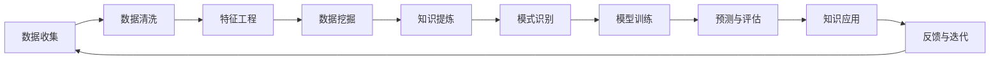

                 

## 1. 背景介绍

人工智能（AI）和知识发现（Knowledge Discovery, KD）一直是数据科学和计算机科学的交叉领域中备受关注的主题。人工智能技术的不断发展，为知识发现提供了更加先进的方法和工具。同样地，知识发现的积累和提炼，又为人工智能技术的发展提供了更丰富的数据资源和更深入的理解。

这一章节将详细介绍人工智能与知识发现的历史背景，以及它们之间相互促进的关系。

### 1.1 历史发展

人工智能的概念可以追溯到20世纪50年代，那时科学家们试图模拟人类思维和行为，通过算法实现机器的自我学习和智能决策。早期的AI研究主要集中在逻辑推理、专家系统和机器学习等领域。

随着计算能力的提升和数据量的激增，人工智能技术逐渐向更深层次的深度学习方向发展。2010年代，深度学习技术取得突破，在图像识别、语音识别、自然语言处理等领域取得了显著进展。与此同时，知识发现的理论与方法也在逐渐成熟，通过大数据分析和机器学习技术，从大量数据中挖掘有价值的知识。

### 1.2 协同进化的意义

人工智能和知识发现的协同进化，意味着两者互相促进、互相补充，共同推动数据驱动的科学和技术进步。人工智能为知识发现提供高效的工具和方法，知识发现则为人工智能提供更加全面和深入的指导和验证。这种协同进化，不仅推动了单个学科的进步，更促进了交叉学科的发展和创新。

## 2. 核心概念与联系

### 2.1 核心概念概述

- **人工智能（Artificial Intelligence, AI）**：使用算法和计算技术，使计算机系统能够模拟人类智能行为和思维过程，包括学习、推理、规划、感知、自然语言处理等。
- **知识发现（Knowledge Discovery, KD）**：通过数据挖掘、统计分析和机器学习等技术，从大量数据中提取和识别有用的信息和知识，为决策支持、商业智能、科学研究和创新提供支持。
- **数据挖掘（Data Mining）**：从原始数据中提取和挖掘有价值的模式、信息和知识的过程，是知识发现的主要技术手段。
- **机器学习（Machine Learning, ML）**：使计算机系统通过数据和经验自动学习和优化算法，实现从数据中提取规律和知识的目的。
- **深度学习（Deep Learning, DL）**：一种基于神经网络，通过多层次特征提取和数据表示，实现对复杂问题的有效学习和解决的机器学习方法。

这些核心概念之间通过数据流、算法和目标形成紧密联系，共同支撑了人工智能与知识发现技术的发展。

### 2.2 核心概念原理和架构的 Mermaid 流程图



**图示说明**：
1. 数据收集：从各个渠道获取原始数据。
2. 数据清洗：清洗和处理缺失、噪声和异常数据。
3. 特征工程：提取和构建合适的特征向量。
4. 数据挖掘：通过统计、聚类、分类等技术，从数据中发现有用的模式和规律。
5. 知识提炼：从数据挖掘结果中提炼出有价值的知识。
6. 模式识别：使用机器学习模型，从知识中识别出特征和规律。
7. 模型训练：通过训练数据，优化模型的参数。
8. 预测与评估：使用训练好的模型进行预测，并评估模型的性能。
9. 知识应用：将提取的知识应用于实际问题，如决策支持、商业智能等。
10. 反馈与迭代：根据应用结果反馈，进一步改进和优化模型。

## 3. 核心算法原理 & 具体操作步骤

### 3.1 算法原理概述

人工智能与知识发现的核心算法和技术，主要集中在数据挖掘、机器学习和深度学习领域。这些算法和技术的协同工作，使计算机能够从大量数据中挖掘出有用的信息，并构建出有效的模型，进行预测和决策。

### 3.2 算法步骤详解

**数据预处理步骤**：
1. 数据收集：从不同来源收集原始数据。
2. 数据清洗：处理缺失、噪声和异常值。
3. 特征选择和提取：从原始数据中提取有意义的特征。

**模型训练步骤**：
1. 选择合适的机器学习算法（如决策树、随机森林、支持向量机等）。
2. 使用训练数据对模型进行训练。
3. 使用验证数据集对模型进行调优。

**模型评估步骤**：
1. 使用测试数据集对模型进行评估。
2. 计算模型性能指标（如准确率、召回率、F1-score等）。

**知识提炼步骤**：
1. 从模型中提取有价值的信息和知识。
2. 将知识应用到实际问题中。

### 3.3 算法优缺点

**优点**：
- 高效性：通过算法和机器学习模型，能够快速从大量数据中提取有用的信息和知识。
- 准确性：机器学习模型通常具有较高的预测和分类准确率。
- 可解释性：某些算法和模型能够提供可解释的特征和决策路径。

**缺点**：
- 数据依赖性：需要大量高质量的标注数据才能训练出有效的模型。
- 模型复杂性：某些复杂模型（如深度神经网络）的训练和优化需要较高的计算资源和专业知识。
- 过拟合问题：在训练数据过少或数据分布不均衡时，模型可能出现过拟合。

### 3.4 算法应用领域

人工智能和知识发现技术在多个领域中得到了广泛应用，包括但不限于以下几个领域：

- **金融分析**：使用机器学习模型进行股票预测、信用风险评估等。
- **医疗健康**：通过深度学习技术分析医学图像，进行疾病诊断和治疗建议。
- **零售营销**：利用数据挖掘技术分析消费者行为，实现个性化推荐和营销。
- **制造业**：使用机器学习算法优化生产流程，进行预测性维护。
- **环境科学**：通过数据挖掘技术分析气候变化数据，进行环境监测和预测。

## 4. 数学模型和公式 & 详细讲解 & 举例说明

### 4.1 数学模型构建

在人工智能和知识发现中，常用的数学模型包括线性回归模型、逻辑回归模型、决策树模型、支持向量机模型和深度神经网络模型。

**线性回归模型**：
$$ y = \theta_0 + \theta_1 x_1 + \theta_2 x_2 + \cdots + \theta_n x_n $$

其中，$y$ 是目标变量，$\theta$ 是模型参数，$x$ 是特征变量。

**逻辑回归模型**：
$$ P(y|x) = \frac{1}{1 + e^{-\theta_0 - \theta_1 x_1 - \theta_2 x_2 - \cdots - \theta_n x_n}} $$

其中，$P(y|x)$ 是给定特征 $x$ 下，目标变量 $y$ 的条件概率。

**决策树模型**：
使用树形结构表示分类决策过程，每个节点表示一个特征，每个分支表示一个取值。

**支持向量机模型**：
$$ f(x) = w \cdot x + b $$
$$ \min_{w,b} \frac{1}{2} \Vert w \Vert^2 + C \sum_{i=1}^n \max(0, 1 - y_i (w \cdot x_i + b)) $$

其中，$w$ 是模型权重，$b$ 是偏置，$C$ 是正则化参数。

**深度神经网络模型**：
$$ f(x) = \sum_i w_i f(x; \theta_i) + b_i $$
其中，$f(x; \theta_i)$ 是第 $i$ 层的输出，$w_i$ 和 $b_i$ 是第 $i$ 层的权重和偏置。

### 4.2 公式推导过程

**线性回归模型推导**：
1. 假设目标变量 $y$ 与特征 $x$ 线性相关，即 $y = \theta_0 + \theta_1 x_1 + \theta_2 x_2 + \cdots + \theta_n x_n$。
2. 通过最小化损失函数 $L(y, \hat{y}) = \frac{1}{2} \sum (y - \hat{y})^2$，求解模型参数 $\theta$。
3. 推导出 $\theta = (X^T X)^{-1} X^T y$，其中 $X$ 是特征矩阵，$y$ 是目标向量。

**逻辑回归模型推导**：
1. 假设目标变量 $y$ 与特征 $x$ 概率相关，即 $P(y|x) = \frac{e^{-\theta_0 - \theta_1 x_1 - \theta_2 x_2 - \cdots - \theta_n x_n}}{1 + e^{-\theta_0 - \theta_1 x_1 - \theta_2 x_2 - \cdots - \theta_n x_n}}$。
2. 通过最大化似然函数 $L(y, \hat{y}) = \sum \log P(y|x)$，求解模型参数 $\theta$。
3. 推导出 $\theta = (X^T X)^{-1} X^T y$，其中 $X$ 是特征矩阵，$y$ 是目标向量。

**支持向量机模型推导**：
1. 假设目标变量 $y$ 与特征 $x$ 线性相关，即 $y = w \cdot x + b$。
2. 通过最小化损失函数 $L(w, b) = \frac{1}{2} \Vert w \Vert^2 + C \sum_{i=1}^n \max(0, 1 - y_i (w \cdot x_i + b))$，求解模型参数 $w$ 和 $b$。
3. 推导出 $w = \sum_{i=1}^n \alpha_i y_i x_i$ 和 $b = y_0 - \sum_{i=1}^n \alpha_i y_i x_i \cdot x_0$，其中 $\alpha$ 是拉格朗日乘子。

**深度神经网络模型推导**：
1. 假设目标变量 $y$ 与特征 $x$ 非线性相关，即 $f(x) = \sum_i w_i f(x; \theta_i) + b_i$。
2. 通过最小化损失函数 $L(y, \hat{y}) = \sum (y - \hat{y})^2$，求解模型参数 $w_i$ 和 $b_i$。
3. 推导出 $w_i = \frac{1}{m} \sum (y - \hat{y}) f(x_i; \theta_i)$ 和 $b_i = \hat{y} - \sum w_i f(x_i; \theta_i)$，其中 $m$ 是样本数量。

### 4.3 案例分析与讲解

**案例一：线性回归模型在房价预测中的应用**

假设有一个房屋价格预测问题，特征包括房屋面积、卧室数量、社区等，目标变量是房屋价格。使用线性回归模型进行预测，步骤如下：

1. 数据收集：收集房屋价格和相关特征数据。
2. 数据清洗：处理缺失、噪声和异常值。
3. 特征选择和提取：选择与房屋价格相关的特征，如房屋面积、卧室数量等。
4. 模型训练：使用训练数据对线性回归模型进行训练。
5. 模型评估：使用测试数据对模型进行评估，计算均方误差（MSE）等指标。
6. 知识提炼：提取模型的参数 $\theta$，得到预测公式。

**案例二：支持向量机模型在信用评分中的应用**

假设有一个信用评分问题，特征包括贷款金额、还款记录、信用历史等，目标变量是信用评分（好或坏）。使用支持向量机模型进行预测，步骤如下：

1. 数据收集：收集贷款数据和信用评分数据。
2. 数据清洗：处理缺失、噪声和异常值。
3. 特征选择和提取：选择与信用评分相关的特征，如贷款金额、还款记录等。
4. 模型训练：使用训练数据对支持向量机模型进行训练。
5. 模型评估：使用测试数据对模型进行评估，计算准确率、召回率等指标。
6. 知识提炼：提取模型的参数 $\alpha$ 和 $b$，得到预测公式。

## 5. 项目实践：代码实例和详细解释说明

### 5.1 开发环境搭建

在进行人工智能和知识发现实践前，我们需要准备好开发环境。以下是使用Python进行Scikit-learn开发的环境配置流程：

1. 安装Anaconda：从官网下载并安装Anaconda，用于创建独立的Python环境。

2. 创建并激活虚拟环境：
```bash
conda create -n sklearn-env python=3.8 
conda activate sklearn-env
```

3. 安装Scikit-learn：
```bash
pip install scikit-learn
```

4. 安装其他常用工具包：
```bash
pip install numpy pandas matplotlib seaborn scikit-image
```

完成上述步骤后，即可在`sklearn-env`环境中开始人工智能和知识发现实践。

### 5.2 源代码详细实现

这里以线性回归模型在房价预测中的应用为例，给出使用Scikit-learn库的代码实现。

首先，导入必要的库和数据：

```python
import numpy as np
from sklearn.linear_model import LinearRegression
from sklearn.model_selection import train_test_split
from sklearn.metrics import mean_squared_error
from sklearn.datasets import load_boston

# 加载波士顿房价数据集
boston = load_boston()
X = boston.data
y = boston.target
```

然后，进行数据预处理：

```python
# 数据清洗和处理
X = np.append(X, np.ones((506, 1)), axis=1) # 添加常数项
```

接着，进行模型训练和评估：

```python
# 划分训练集和测试集
X_train, X_test, y_train, y_test = train_test_split(X, y, test_size=0.2, random_state=42)

# 训练线性回归模型
model = LinearRegression()
model.fit(X_train, y_train)

# 预测并评估模型性能
y_pred = model.predict(X_test)
mse = mean_squared_error(y_test, y_pred)
print("均方误差：", mse)
```

最后，展示模型预测结果：

```python
# 展示模型预测结果
plt.scatter(y_test, y_pred)
plt.xlabel("真实值")
plt.ylabel("预测值")
plt.show()
```

以上就是使用Scikit-learn库进行线性回归模型预测房价的完整代码实现。可以看到，Scikit-learn库提供了便捷的API接口，使得模型的训练和评估变得简单高效。

### 5.3 代码解读与分析

让我们再详细解读一下关键代码的实现细节：

**数据预处理**：
- `X = np.append(X, np.ones((506, 1)), axis=1)`：在特征矩阵 $X$ 的最后一列添加常数项 1，使得模型可以截距。

**模型训练和评估**：
- `X_train, X_test, y_train, y_test = train_test_split(X, y, test_size=0.2, random_state=42)`：将数据集划分为训练集和测试集，测试集占总数据的20%。
- `model.fit(X_train, y_train)`：使用训练数据对线性回归模型进行训练。
- `y_pred = model.predict(X_test)`：使用训练好的模型对测试集进行预测。
- `mse = mean_squared_error(y_test, y_pred)`：计算均方误差作为模型评估指标。

**结果展示**：
- `plt.scatter(y_test, y_pred)`：将真实值和预测值绘制散点图。

这些代码的实现，展示了如何使用Scikit-learn库进行简单的线性回归模型训练和评估。通过进一步扩展和优化，可以构建更复杂的模型，处理更多类型的数据。

## 6. 实际应用场景

### 6.1 金融风险管理

人工智能和知识发现技术在金融风险管理中得到了广泛应用。银行和金融机构可以通过机器学习模型，分析客户的信用记录、贷款历史等数据，预测客户的违约风险，从而进行风险管理和信用评估。

**步骤**：
1. 收集客户数据，包括贷款金额、还款记录、信用历史等。
2. 数据清洗和预处理，处理缺失、噪声和异常值。
3. 特征选择和提取，选择与违约风险相关的特征，如贷款金额、还款记录等。
4. 模型训练，使用训练数据对机器学习模型进行训练，如决策树、支持向量机等。
5. 模型评估，使用测试数据对模型进行评估，计算准确率、召回率等指标。
6. 知识提炼，提取模型的参数和决策规则，用于风险管理和信用评估。

### 6.2 医疗健康诊断

在医疗健康领域，人工智能和知识发现技术可以帮助医生进行疾病诊断和治疗建议。医疗机构可以通过机器学习模型，分析患者的医疗记录、检验结果等数据，预测疾病的风险，提供个性化的治疗方案。

**步骤**：
1. 收集医疗数据，包括病历、检验结果、治疗方案等。
2. 数据清洗和预处理，处理缺失、噪声和异常值。
3. 特征选择和提取，选择与疾病诊断和治疗相关的特征，如症状、检验指标等。
4. 模型训练，使用训练数据对机器学习模型进行训练，如随机森林、神经网络等。
5. 模型评估，使用测试数据对模型进行评估，计算准确率、召回率等指标。
6. 知识提炼，提取模型的参数和决策规则，用于疾病诊断和治疗建议。

### 6.3 零售个性化推荐

在零售领域，人工智能和知识发现技术可以帮助商家进行个性化推荐，提升用户满意度和销售额。电商平台可以通过数据挖掘技术，分析用户的浏览记录、购买历史等数据，预测用户的购买意向，提供个性化的商品推荐。

**步骤**：
1. 收集用户数据，包括浏览记录、购买历史、评价等。
2. 数据清洗和预处理，处理缺失、噪声和异常值。
3. 特征选择和提取，选择与用户购买意向相关的特征，如浏览记录、购买历史等。
4. 模型训练，使用训练数据对机器学习模型进行训练，如协同过滤、深度学习等。
5. 模型评估，使用测试数据对模型进行评估，计算准确率、召回率等指标。
6. 知识提炼，提取模型的参数和推荐算法，用于个性化推荐。

## 7. 工具和资源推荐

### 7.1 学习资源推荐

为了帮助开发者系统掌握人工智能和知识发现的技术基础和应用实践，这里推荐一些优质的学习资源：

1. 《机器学习》（周志华）：系统介绍机器学习的基本概念、算法和应用，适合初学者入门。
2. 《深度学习》（Ian Goodfellow）：深入探讨深度神经网络的结构和训练方法，适合进阶学习。
3. 《Python数据科学手册》（Jake VanderPlas）：详细介绍Python数据科学库的使用，如NumPy、Pandas、Matplotlib等。
4. Coursera《机器学习》课程：由斯坦福大学开设，讲解机器学习的基本理论和实践应用。
5. Kaggle竞赛平台：提供各种数据科学竞赛，积累实践经验和解决实际问题的能力。

通过对这些资源的学习实践，相信你一定能够全面掌握人工智能和知识发现的核心技术，并用于解决实际的业务问题。

### 7.2 开发工具推荐

高效的开发离不开优秀的工具支持。以下是几款用于人工智能和知识发现开发的常用工具：

1. Python：作为数据科学的主流编程语言，Python提供丰富的库和框架，适合各种类型的模型开发。
2. R：数据科学和统计分析的标准语言，适合处理大量数据和进行复杂统计分析。
3. Scikit-learn：Python机器学习库，提供各种机器学习算法和工具，适合快速开发模型。
4. TensorFlow：Google开源的深度学习框架，支持大规模神经网络模型训练和部署。
5. PyTorch：Facebook开源的深度学习框架，支持动态计算图和高效模型训练。

合理利用这些工具，可以显著提升人工智能和知识发现任务的开发效率，加速创新迭代的步伐。

### 7.3 相关论文推荐

人工智能和知识发现技术的发展离不开学界的持续研究。以下是几篇奠基性的相关论文，推荐阅读：

1. 《支持向量机》（Cortes和Vapnik）：提出支持向量机算法，广泛应用于分类和回归问题。
2. 《随机森林》（Breiman）：提出随机森林算法，通过集成学习提升模型性能和稳定性。
3. 《深度学习》（Hinton等）：提出深度神经网络，推动深度学习在计算机视觉、自然语言处理等领域的发展。
4. 《数据挖掘：概念与技术》（Witten和Frank）：系统介绍数据挖掘的基本概念和技术方法，适合入门学习。
5. 《人工智能：现代方法》（Russell和Norvig）：全面介绍人工智能的各个分支和前沿技术，适合深入研究。

这些论文代表了大数据时代人工智能和知识发现技术的最新进展。通过学习这些前沿成果，可以帮助研究者把握学科前进方向，激发更多的创新灵感。

## 8. 总结：未来发展趋势与挑战

### 8.1 研究成果总结

本文对人工智能和知识发现的历史背景、核心概念、算法原理和操作步骤进行了详细介绍，并结合实际应用场景，展示了人工智能和知识发现技术的广泛应用。

通过深入探讨人工智能和知识发现技术的相互促进关系，本文认为两者在未来将更加紧密结合，共同推动数据驱动的科学和技术进步。

### 8.2 未来发展趋势

展望未来，人工智能和知识发现技术将呈现以下几个发展趋势：

1. **深度学习与知识发现的结合**：深度学习模型的可解释性和可理解性逐步增强，知识发现过程将更加依赖于机器学习模型的结果。
2. **自动化机器学习（AutoML）**：机器学习模型的训练和优化过程将更加自动化，减少对人类专家的依赖。
3. **数据与模型的协同进化**：数据的质量和数量将直接影响机器学习模型的性能，同时模型的训练和优化也将反作用于数据的收集和处理。
4. **跨领域知识融合**：人工智能和知识发现技术将与其他领域的技术进行更加深入的融合，如计算机视觉、自然语言处理、人机交互等。
5. **联邦学习和边缘计算**：通过分布式训练和边缘计算技术，提高模型的隐私性和计算效率。
6. **可解释性和可控性**：人工智能和知识发现技术将更加注重模型的可解释性和可控性，确保算法的公平性和安全性。

### 8.3 面临的挑战

尽管人工智能和知识发现技术已经取得了显著进展，但在迈向更加智能化、普适化应用的过程中，仍面临诸多挑战：

1. **数据隐私与安全**：数据的安全和隐私保护是人工智能应用的重要挑战，特别是在医疗、金融等敏感领域。
2. **模型鲁棒性和泛化能力**：模型在面对新数据和复杂环境时，容易发生泛化和鲁棒性问题。
3. **计算资源需求**：深度神经网络的训练和优化需要大量的计算资源，对硬件设施和网络带宽提出了高要求。
4. **模型复杂性与可解释性**：深度学习模型的复杂性和不可解释性是应用中的重要挑战，特别是在金融、医疗等高风险领域。
5. **伦理与道德问题**：人工智能和知识发现技术的应用可能带来伦理和道德问题，如算法偏见、决策透明性等。
6. **技术标准化与兼容性**：不同技术之间的兼容性问题仍需进一步解决，如模型接口、数据格式等。

### 8.4 研究展望

面对这些挑战，未来的研究需要在以下几个方面寻求新的突破：

1. **隐私保护技术**：开发更加高效的数据隐私保护技术，确保数据的安全和隐私。
2. **模型鲁棒性与泛化能力**：研究模型的鲁棒性和泛化能力，增强模型在复杂环境下的适应性和稳定性。
3. **计算资源优化**：优化计算资源使用，提高模型的训练和推理效率。
4. **可解释性与透明性**：提高模型的可解释性和透明性，确保算法的公平性和安全性。
5. **伦理与道德框架**：建立伦理与道德框架，规范人工智能和知识发现技术的应用。
6. **技术标准化**：推动人工智能和知识发现技术的标准化，提高技术的兼容性。

## 9. 附录：常见问题与解答

**Q1：什么是人工智能和知识发现？**

A: 人工智能是指使用计算机算法和计算技术，使计算机系统能够模拟人类智能行为和思维过程，包括学习、推理、规划、感知、自然语言处理等。知识发现是指通过数据挖掘、统计分析和机器学习等技术，从大量数据中提取和识别有用的信息和知识，为决策支持、商业智能、科学研究和创新提供支持。

**Q2：人工智能和知识发现之间有什么联系？**

A: 人工智能和知识发现之间存在紧密联系。人工智能提供了高效的数据处理和分析工具，知识发现则为人工智能提供了更加全面和深入的数据资源和指导。两者的协同工作，共同推动了数据驱动的科学和技术进步。

**Q3：人工智能和知识发现的主要应用领域有哪些？**

A: 人工智能和知识发现技术在金融、医疗、零售、制造业、环境科学等多个领域中得到了广泛应用。具体应用包括信用风险评估、疾病诊断和治疗、个性化推荐、生产流程优化、环境监测和预测等。

**Q4：人工智能和知识发现面临的主要挑战有哪些？**

A: 人工智能和知识发现面临的主要挑战包括数据隐私与安全、模型鲁棒性和泛化能力、计算资源需求、模型复杂性与可解释性、伦理与道德问题、技术标准化与兼容性等。

**Q5：未来人工智能和知识发现技术的发展趋势是什么？**

A: 未来人工智能和知识发现技术将呈现深度学习与知识发现结合、自动化机器学习、数据与模型协同进化、跨领域知识融合、联邦学习和边缘计算、可解释性和可控性等发展趋势。

作者：禅与计算机程序设计艺术 / Zen and the Art of Computer Programming

