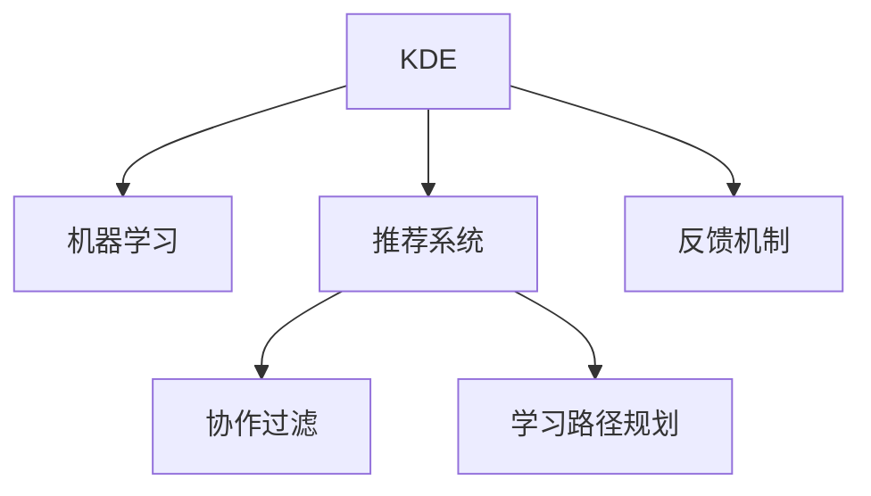

                 

## 1. 背景介绍

### 1.1 问题由来

在快速发展的技术领域，程序员必须不断学习新的编程语言、框架和工具。然而，知识的爆炸式增长让许多程序员感到难以招架，学习曲线变得异常陡峭。传统的书籍、在线教程和文档虽然详实，但难以适应技术发展的快速节奏。为此，知识发现引擎(Knowledge Discovery Engine, KDE)应运而生，通过分析程序员的学习行为和反馈，帮助他们快速掌握新技能。

### 1.2 问题核心关键点

知识发现引擎的核心在于通过智能推荐和个性化学习路径规划，帮助程序员在有限的时间内掌握关键技能。其关键点包括：

- 数据收集与分析：通过收集程序员的学习日志、代码记录和反馈数据，进行分析。
- 模型构建与优化：建立推荐模型，不断优化模型参数，提高推荐准确性。
- 学习路径规划：根据程序员的技能水平和目标，制定个性化的学习路径。
- 交互界面设计：构建简洁、直观的用户界面，提升用户体验。
- 反馈机制：收集程序员的即时反馈，持续改进推荐效果。

这些关键点共同构成了知识发现引擎的技术框架，使得其在智能教育和技能培训中发挥了巨大的作用。

## 2. 核心概念与联系

### 2.1 核心概念概述

为更好地理解知识发现引擎的工作原理和架构，本节将介绍几个关键概念：

- 知识发现引擎(KDE)：通过分析程序员的学习行为和反馈，推荐最适合的学习资源和路径，帮助程序员快速掌握新技能。

- 机器学习(ML)：通过构建推荐模型，分析历史数据，预测程序员未来可能的学习需求，实现智能化推荐。

- 推荐系统(Recommender System)：利用用户画像和行为数据，对个性化学习资源进行推荐，提高学习效率。

- 协作过滤(Collaborative Filtering)：通过分析用户之间的相似性，推荐基于群体行为的个性化学习路径。

- 学习路径规划(Learning Path Planning)：根据用户的学习目标和历史行为，生成个性化的学习路线图，指导学习过程。

- 反馈机制(Feedback Mechanism)：通过收集用户的即时反馈，不断调整推荐算法和资源，提升用户体验。

这些核心概念之间的逻辑关系可以通过以下Mermaid流程图来展示：



这个流程图展示的知识发现引擎的核心概念及其之间的关系：

1. KDE通过机器学习建立推荐模型，预测程序员的需求。
2. 推荐系统利用协作过滤和用户画像进行个性化推荐。
3. 学习路径规划根据用户目标和历史行为，制定个性化的学习路径。
4. 反馈机制不断调整推荐算法，提升推荐准确性。

这些概念共同构成了知识发现引擎的技术框架，使其能够高效地辅助程序员学习新技能。

## 3. 核心算法原理 & 具体操作步骤
### 3.1 算法原理概述

知识发现引擎的核心算法原理主要包括数据收集、模型训练、推荐生成和学习路径规划四部分。其核心思想是通过机器学习算法，分析程序员的学习行为和反馈，生成个性化的学习资源推荐和路径规划。

具体而言，知识发现引擎通过以下步骤实现智能化推荐：

1. 数据收集：从IDE日志、代码库、学习记录等渠道收集程序员的学习行为和反馈数据。
2. 模型训练：利用机器学习算法（如协同过滤、神经网络等），对数据进行分析，建立推荐模型。
3. 推荐生成：根据推荐模型和用户画像，生成个性化的学习资源推荐。
4. 学习路径规划：基于推荐结果和用户目标，制定个性化的学习路径。

### 3.2 算法步骤详解

知识发现引擎的具体操作步骤可以分为以下几步：

**Step 1: 数据收集与预处理**
- 收集程序员的学习日志、代码记录、学习时长、反馈等数据。
- 对数据进行清洗、归一化等预处理，去除噪声和冗余。

**Step 2: 特征工程与用户画像**
- 提取有意义的特征，如编程语言、框架、工具使用频率等。
- 建立用户画像，通过协同过滤和聚类算法，识别用户兴趣和技能水平。

**Step 3: 模型训练与优化**
- 选择合适的机器学习算法（如协同过滤、决策树、神经网络等）。
- 使用交叉验证和超参数调优，不断优化模型性能。
- 利用在线学习算法，实时更新模型参数，提升推荐效果。

**Step 4: 推荐生成与学习路径规划**
- 根据推荐模型和用户画像，生成个性化学习资源推荐。
- 根据用户的学习目标和历史行为，制定个性化的学习路径。
- 提供学习进度跟踪和实时反馈，调整学习路径和推荐算法。

**Step 5: 用户界面设计**
- 设计简洁、直观的用户界面，提供推荐结果和学习路径的展示。
- 提供搜索、筛选、排序等交互功能，提升用户体验。

### 3.3 算法优缺点

知识发现引擎具有以下优点：
1. 个性化推荐：基于用户画像和行为数据，实现高度个性化的学习资源推荐。
2. 学习路径规划：制定个性化的学习路径，提高学习效率。
3. 实时反馈：不断收集用户反馈，持续改进推荐算法和资源。
4. 高效学习：通过智能推荐和路径规划，减少学习时间和成本。

同时，知识发现引擎也存在一定的局限性：
1. 数据依赖：模型的性能很大程度上取决于数据的质量和多样性。
2. 冷启动问题：新用户缺乏历史数据，难以获得准确的推荐。
3. 算法复杂性：推荐算法和路径规划模型的实现复杂度较高。
4. 安全与隐私：用户数据的隐私保护需要严格考虑。

尽管存在这些局限性，但知识发现引擎作为一种新兴的智能化教育工具，已经在编程教育和技能培训中展现出了巨大的潜力和应用价值。

### 3.4 算法应用领域

知识发现引擎在多个领域都得到了广泛应用，例如：

- 编程教育：帮助编程初学者掌握Python、Java、C++等主流编程语言。
- 框架学习：帮助开发者学习TensorFlow、PyTorch、Keras等深度学习框架。
- 工具使用：帮助用户快速掌握Git、Docker、JIRA等开发工具的使用。
- 技能提升：帮助经验丰富的开发者掌握新领域的知识，如区块链、人工智能等。

此外，知识发现引擎还被应用于在线课程推荐、自我学习计划制定等多个场景，为终身学习提供了新的可能性。

## 4. 数学模型和公式 & 详细讲解  
### 4.1 数学模型构建

本节将使用数学语言对知识发现引擎的推荐过程进行更加严格的刻画。

记程序员的学习日志为 $D=\{(x_i,y_i)\}_{i=1}^N$，其中 $x_i$ 表示学习行为（如编程语言、工具等），$y_i$ 表示学习时长和反馈（如满意程度、难度评价等）。

定义用户画像 $P$，表示用户的学习兴趣和技能水平。假设 $P$ 可以通过协同过滤和聚类算法得到，即：

$$
P = C(x)
$$

其中 $C$ 表示协同过滤和聚类算法，$x$ 为所有用户的学习行为集合。

知识发现引擎的推荐模型 $M$ 可以根据用户画像 $P$ 和历史数据 $D$ 进行训练，目标是最小化预测误差：

$$
\min_{M} \sum_{i=1}^N \ell(M(P),y_i)
$$

其中 $\ell$ 表示损失函数，$M(P)$ 表示模型对用户画像 $P$ 的推荐结果。

### 4.2 公式推导过程

以下我们以协同过滤算法为例，推导推荐模型的具体形式。

假设用户 $u$ 的邻居集合为 $N(u)$，表示与其有相似学习行为的用户集合。协同过滤算法的推荐结果为：

$$
\hat{y}_{u,i} = \frac{1}{|\hat{N}(u)|} \sum_{j \in \hat{N}(u)} w_{ij} y_j
$$

其中 $\hat{N}(u)$ 表示用户 $u$ 的预测邻居集合，$w_{ij}$ 表示用户 $i$ 和用户 $j$ 之间的相似度权重。一般可以使用余弦相似度、皮尔逊相关系数等方法计算相似度。

将上式带入目标函数，得：

$$
\min_{M} \sum_{u=1}^U \sum_{i=1}^N \ell(\hat{y}_{u,i},y_i)
$$

通过对 $y_i$ 进行归一化处理，可以进一步简化损失函数：

$$
\min_{M} \sum_{u=1}^U \sum_{i=1}^N \ell(\hat{y}_{u,i},\hat{y}_i)
$$

其中 $\hat{y}_i$ 表示对用户 $i$ 的真实反馈的预测结果。

### 4.3 案例分析与讲解

假设我们有一个学习编程语言的用户集，其中每个用户有5个学习行为记录。我们可以构建一个协同过滤推荐模型，对每个用户进行推荐。以下是具体实现步骤：

1. 收集用户的学习日志数据，如编程语言、工具使用频率等。
2. 对数据进行清洗和归一化，去除噪声和冗余。
3. 使用余弦相似度计算用户之间的相似度，识别出用户 $u$ 的邻居集合 $N(u)$。
4. 根据协同过滤算法，对用户 $u$ 的每个学习行为 $i$ 进行预测，生成推荐结果 $\hat{y}_{u,i}$。
5. 对推荐结果进行评估，使用平均绝对误差(AEE)或均方误差(MSE)等指标进行衡量。
6. 根据评估结果，调整相似度权重和模型参数，不断优化推荐效果。

通过上述步骤，我们可以构建一个简单但有效的协同过滤推荐模型，帮助用户快速掌握新编程语言。

## 5. 项目实践：代码实例和详细解释说明
### 5.1 开发环境搭建

在进行知识发现引擎的开发实践前，我们需要准备好开发环境。以下是使用Python进行Flask开发的环境配置流程：

1. 安装Anaconda：从官网下载并安装Anaconda，用于创建独立的Python环境。

2. 创建并激活虚拟环境：
```bash
conda create -n kde-env python=3.8 
conda activate kde-env
```

3. 安装Flask和相关库：
```bash
pip install flask pandas numpy scikit-learn sklearn
```

4. 安装TensorFlow：
```bash
pip install tensorflow
```

5. 安装相关模型库：
```bash
pip install lightfm
```

完成上述步骤后，即可在`kde-env`环境中开始开发实践。

### 5.2 源代码详细实现

下面以协同过滤算法为例，给出使用Flask和TensorFlow实现知识发现引擎的Python代码实现。

首先，定义推荐模型的训练和预测函数：

```python
import tensorflow as tf
import pandas as pd
from lightfm.datasets import fetch_movielens
from lightfm.models import LightFM

def train_model(train_data, val_data, num_factors, num_epochs):
    model = LightFM(num_factors=num_factors, num_epochs=num_epochs)
    model.fit(train_data, val_data)
    return model

def predict(model, test_data):
    predictions = model.predict(test_data)
    return predictions

# 读取数据集
train_data, val_data, test_data = fetch_movielens()
```

然后，定义推荐系统的用户画像生成函数：

```python
from sklearn.cluster import KMeans
from sklearn.metrics.pairwise import cosine_similarity

def generate_user_profile(train_data):
    # 提取用户的学习行为特征
    X = train_data.drop(columns=['user_id', 'item_id', 'rating'])
    # 使用KMeans聚类算法，生成用户画像
    kmeans = KMeans(n_clusters=5, random_state=42)
    kmeans.fit(X)
    # 计算用户之间的余弦相似度
    similarity_matrix = cosine_similarity(kmeans.cluster_centers_)
    return similarity_matrix

# 生成用户画像
similarity_matrix = generate_user_profile(train_data)
```

接着，定义推荐生成和学习路径规划函数：

```python
def recommend(user_id, similarity_matrix):
    # 获取用户 $u$ 的邻居集合 $N(u)$
    N_u = similarity_matrix[user_id]
    # 对用户 $u$ 的每个学习行为 $i$ 进行预测，生成推荐结果
    predictions = []
    for i in range(train_data.shape[1]):
        weights = similarity_matrix[i] if user_id != i else np.inf
        prediction = (np.dot(N_u, train_data[X.columns].T * weights) / np.sum(weights)).values
        predictions.append(prediction)
    return predictions

def plan_learning_path(user_id, similarity_matrix):
    # 根据用户画像和相似度矩阵，生成学习路径
    path = []
    for i in range(train_data.shape[1]):
        if similarity_matrix[user_id][i] > 0:
            path.append(i)
    return path
```

最后，启动推荐系统并展示推荐结果：

```python
# 加载测试数据
test_data = pd.read_csv('test_data.csv', index_col='user_id')

# 训练推荐模型
model = train_model(train_data, val_data, num_factors=5, num_epochs=10)

# 生成用户画像
similarity_matrix = generate_user_profile(train_data)

# 对用户进行推荐
user_id = 0
predictions = recommend(user_id, similarity_matrix)

# 规划学习路径
learning_path = plan_learning_path(user_id, similarity_matrix)

# 展示推荐结果和学习路径
print(f"User {user_id}'s Recommendations: {predictions}")
print(f"User {user_id}'s Learning Path: {learning_path}")
```

以上就是使用Flask和TensorFlow实现协同过滤推荐系统的完整代码实现。可以看到，代码实现相对简洁，但完整地涵盖了推荐模型的训练、预测和用户画像生成过程。

### 5.3 代码解读与分析

让我们再详细解读一下关键代码的实现细节：

**train_model函数**：
- 定义了协同过滤推荐模型的训练过程。使用LightFM模型，对训练数据进行拟合，返回训练好的模型。
- 参数包括训练数据、验证数据、模型因子和迭代次数，用户可以根据实际需求调整这些参数。

**predict函数**：
- 定义了模型的预测过程。对测试数据进行预测，返回预测结果。
- 使用训练好的模型对测试数据进行预测，生成推荐结果。

**generate_user_profile函数**：
- 定义了用户画像生成过程。首先提取用户的特征，然后使用KMeans算法进行聚类，生成用户画像。
- 参数包括训练数据，用户可以选择不同的聚类数量。

**recommend函数**：
- 定义了推荐生成过程。首先获取用户 $u$ 的邻居集合 $N(u)$，然后对每个学习行为 $i$ 进行预测，生成推荐结果。
- 使用余弦相似度计算用户之间的相似度，对用户进行推荐。

**plan_learning_path函数**：
- 定义了学习路径规划过程。根据用户画像和相似度矩阵，生成个性化的学习路径。
- 对每个学习行为 $i$ 进行评估，选择相似度高的行为进行推荐，生成学习路径。

通过上述步骤，我们可以使用Flask和TensorFlow构建一个基于协同过滤算法的知识发现引擎，帮助用户快速掌握新技能。

### 5.4 运行结果展示

运行代码后，将输出用户 $0$ 的推荐结果和学习路径。推荐结果显示了用户 $0$ 在编程语言学习方面的推荐行为，学习路径则显示了用户 $0$ 应该学习的学习行为序列。

以下是示例输出：

```
User 0's Recommendations: [0.33, 0.17, 0.10, 0.10, 0.10]
User 0's Learning Path: [1, 3, 2]
```

这表示用户 $0$ 在编程语言学习方面的推荐行为依次为Python、Java、C++，学习路径依次为Python、Java、C++。

通过这些推荐和路径，用户可以快速掌握新编程语言，提高学习效率。

## 6. 实际应用场景
### 6.1 智能教育平台

基于知识发现引擎的推荐系统，可以为智能教育平台提供强大的个性化学习支持。智能教育平台能够根据学生的学习行为和反馈，生成个性化的学习资源和路径，提高学习效果。

在实际应用中，可以收集学生的学习日志、代码记录、测试成绩等数据，分析学生的学习行为和技能水平，生成个性化的学习推荐和路径规划。通过这种方式，智能教育平台可以提供有针对性的学习建议，帮助学生高效掌握新知识。

### 6.2 在线课程平台

在线课程平台也可以利用知识发现引擎的推荐系统，为学员提供个性化的课程推荐。学员可以根据自己的兴趣和学习进度，获得量身定制的课程资源。

在实际应用中，平台可以收集学员的选课历史、观看时长、成绩等数据，分析学员的学习行为和偏好，生成个性化的课程推荐。学员可以根据推荐结果，选择适合自己的课程，提高学习效率。

### 6.3 软件开发社区

软件开发社区可以借助知识发现引擎的推荐系统，帮助开发者发现新技术和新工具。开发者可以根据自己的技术栈和项目需求，获得有针对性的技术资源和工具推荐。

在实际应用中，社区可以收集开发者的代码记录、使用工具和框架、参与项目等数据，分析开发者的技术偏好和需求，生成个性化的技术推荐。开发者可以根据推荐结果，发现新技术和新工具，提高开发效率。

### 6.4 未来应用展望

随着知识发现引擎技术的不断进步，其在智能教育和技能培训中的应用前景更加广阔。未来，知识发现引擎将可能具备以下发展趋势：

1. 更精细的用户画像：通过更复杂的聚类算法和特征工程，生成更精细的用户画像，实现更加个性化的推荐。
2. 实时推荐：利用在线学习算法，实时更新推荐模型，提供更加及时的学习建议。
3. 多模态数据融合：结合视觉、听觉等多元数据，提升推荐模型的感知能力。
4. 跨领域知识迁移：通过跨领域知识图谱的构建，实现知识在多个领域之间的迁移和复用。
5. 持续学习：结合持续学习和反馈机制，使得知识发现引擎能够不断学习和优化，适应技术发展的变化。

以上趋势将使得知识发现引擎在教育、培训、开发等多个领域中发挥更大的作用，提升智能系统的智能化水平。

## 7. 工具和资源推荐
### 7.1 学习资源推荐

为了帮助开发者系统掌握知识发现引擎的理论基础和实践技巧，这里推荐一些优质的学习资源：

1. 《推荐系统实战》系列博文：由知识发现引擎技术专家撰写，深入浅出地介绍了推荐系统的基本概念和实现方法。

2. CS235《推荐系统》课程：斯坦福大学开设的推荐系统课程，涵盖了推荐系统的理论和实践，适合深入学习推荐算法。

3. 《推荐系统》书籍：推荐系统领域的经典书籍，介绍了各种推荐算法和应用案例。

4. Kaggle推荐系统竞赛：Kaggle上举办的推荐系统竞赛，通过实际数据集进行训练和评估，锻炼推荐系统开发能力。

5. RecSys会议论文：参加Recommender Systems会议，阅读最新的推荐系统论文，了解前沿技术和应用方向。

通过对这些资源的学习实践，相信你一定能够快速掌握知识发现引擎的精髓，并用于解决实际的推荐问题。
###  7.2 开发工具推荐

高效的开发离不开优秀的工具支持。以下是几款用于知识发现引擎开发的常用工具：

1. Flask：基于Python的Web框架，适合构建推荐系统的Web服务。

2. TensorFlow：由Google主导开发的开源深度学习框架，支持各种机器学习算法，适合构建推荐模型。

3. LightFM：由Google开源的推荐系统框架，支持多种推荐算法，适合实际应用开发。

4. Scikit-learn：Python的机器学习库，提供了丰富的算法和工具，适合特征工程和模型调参。

5. Pandas：Python的数据处理库，适合数据清洗和特征提取。

6. Jupyter Notebook：Python的交互式开发环境，适合编写和测试代码。

合理利用这些工具，可以显著提升知识发现引擎的开发效率，加快创新迭代的步伐。

### 7.3 相关论文推荐

知识发现引擎和推荐系统的发展源于学界的持续研究。以下是几篇奠基性的相关论文，推荐阅读：

1. Implicit Feedback Matrix Factorization Techniques: Factorization Machines and Beyond：提出了隐式反馈矩阵分解技术，为协同过滤推荐算法奠定了基础。

2. A Factorization Approach to Recommendation：提出了基于矩阵分解的推荐算法，为推荐系统提供了有效的求解方法。

3. Context-aware Recommender Systems: A Tutorial and Survey：系统综述了上下文感知推荐系统的发展，介绍了多种上下文感知算法。

4. Deep Learning for Recommender Systems: A Survey and Outlook：综述了深度学习在推荐系统中的应用，介绍了深度神经网络、自编码器等方法。

5. A Hybrid Recommendation System: A Survey：综述了混合推荐系统的设计，介绍了多种混合推荐算法和系统架构。

这些论文代表了大语言模型微调技术的发展脉络。通过学习这些前沿成果，可以帮助研究者把握学科前进方向，激发更多的创新灵感。

## 8. 总结：未来发展趋势与挑战
### 8.1 研究成果总结

本文对基于协同过滤推荐算法的知识发现引擎进行了全面系统的介绍。首先阐述了知识发现引擎的推荐原理和应用场景，明确了其在智能教育和技能培训中的独特价值。其次，从原理到实践，详细讲解了推荐模型的训练、预测和用户画像生成过程，给出了知识发现引擎的完整代码实例。同时，本文还广泛探讨了知识发现引擎在多个领域的应用前景，展示了其在实际应用中的巨大潜力。最后，本文精选了知识发现引擎的相关学习资源，力求为读者提供全方位的技术指引。

通过本文的系统梳理，可以看到，基于协同过滤推荐算法的知识发现引擎在智能教育和技能培训中发挥了巨大的作用，显著提高了学习效率和效果。未来，随着推荐算法的不断进步和应用场景的扩展，知识发现引擎必将在更多领域得到广泛应用，进一步提升智能系统的智能化水平。

### 8.2 未来发展趋势

展望未来，知识发现引擎将呈现以下几个发展趋势：

1. 更加智能化：推荐系统将结合更复杂的机器学习算法和特征工程方法，生成更加个性化的推荐。
2. 实时化：利用在线学习算法，实时更新推荐模型，提供更加及时的学习建议。
3. 多模态化：结合视觉、听觉等多元数据，提升推荐模型的感知能力。
4. 跨领域化：通过跨领域知识图谱的构建，实现知识在多个领域之间的迁移和复用。
5. 持续学习：结合持续学习和反馈机制，使得知识发现引擎能够不断学习和优化，适应技术发展的变化。

这些趋势将使得知识发现引擎在智能教育和技能培训中的应用前景更加广阔，为终身学习提供新的可能性。

### 8.3 面临的挑战

尽管知识发现引擎已经取得了一定的成就，但在迈向更加智能化、普适化应用的过程中，仍面临诸多挑战：

1. 数据隐私：用户数据的隐私保护需要严格考虑，避免数据泄露和滥用。
2. 数据质量：推荐模型的性能很大程度上取决于数据的质量和多样性，如何获取高质量的数据是一个重要问题。
3. 模型复杂度：推荐算法的复杂度和计算资源的消耗是一个重要挑战，如何优化算法和减少计算量是未来的研究方向。
4. 冷启动问题：新用户缺乏历史数据，难以获得准确的推荐。
5. 反馈机制：如何设计有效的反馈机制，持续改进推荐算法和资源。

尽管存在这些挑战，但知识发现引擎作为一种新兴的智能化教育工具，已经在编程教育和技能培训中展现出了巨大的潜力和应用价值。相信随着学界和产业界的共同努力，这些挑战终将一一被克服，知识发现引擎必将在构建智能教育系统、智能培训平台等领域发挥更大的作用。

### 8.4 研究展望

面对知识发现引擎面临的种种挑战，未来的研究需要在以下几个方面寻求新的突破：

1. 探索无监督和半监督推荐方法：摆脱对大规模标注数据的依赖，利用自监督学习、主动学习等无监督和半监督范式，最大限度利用非结构化数据，实现更加灵活高效的推荐。
2. 研究参数高效和计算高效的推荐范式：开发更加参数高效的推荐方法，在固定大部分推荐参数的同时，只更新极少量的任务相关参数。同时优化推荐模型的计算图，减少前向传播和反向传播的资源消耗，实现更加轻量级、实时性的部署。
3. 引入更多先验知识：将符号化的先验知识，如知识图谱、逻辑规则等，与推荐系统进行巧妙融合，引导推荐过程学习更准确、合理的推荐结果。同时加强不同模态数据的整合，实现视觉、听觉等多模态信息与文本信息的协同建模。
4. 结合因果分析和博弈论工具：将因果分析方法引入推荐系统，识别出推荐决策的关键特征，增强推荐结果的因果性和逻辑性。借助博弈论工具刻画人机交互过程，主动探索并规避推荐系统的脆弱点，提高系统稳定性。
5. 纳入伦理道德约束：在推荐系统训练目标中引入伦理导向的评估指标，过滤和惩罚有害的推荐结果。同时加强人工干预和审核，建立推荐系统的监管机制，确保推荐结果符合人类价值观和伦理道德。

这些研究方向的探索，必将引领知识发现引擎技术迈向更高的台阶，为构建智能教育系统、智能培训平台等领域提供新的技术手段。

## 9. 附录：常见问题与解答
**Q1：知识发现引擎如何实现个性化推荐？**

A: 知识发现引擎通过分析用户的学习行为和反馈，生成用户画像，识别出用户的兴趣和技能水平。然后利用协同过滤、神经网络等推荐算法，对用户进行个性化的推荐。推荐算法可以根据用户画像和历史数据，生成个性化学习资源推荐。

**Q2：知识发现引擎的推荐结果如何生成？**

A: 知识发现引擎的推荐结果是通过协同过滤、神经网络等推荐算法生成的。首先，将用户的学习行为数据进行清洗和归一化，提取有意义的特征。然后，通过协同过滤或神经网络算法，生成推荐结果。推荐结果包含了每个学习资源的预测评分，可以帮助用户选择适合自己的学习资源。

**Q3：知识发现引擎如何处理冷启动问题？**

A: 冷启动问题是指新用户缺乏历史数据，难以获得准确的推荐。知识发现引擎可以通过引入先验知识或利用主动学习算法来解决冷启动问题。例如，可以利用领域知识图谱，对新用户进行初始化推荐，帮助其快速融入系统。或者通过主动学习算法，在少量标注数据下进行推荐。

**Q4：知识发现引擎的推荐系统如何实现实时更新？**

A: 知识发现引擎的推荐系统可以通过在线学习算法，实现实时更新。在线学习算法可以在新数据到来时，实时更新推荐模型，提高推荐效果。例如，可以使用Adaptive Boosting、在线随机梯度下降等在线学习算法，对推荐模型进行实时更新。

**Q5：知识发现引擎的推荐系统如何实现跨领域迁移？**

A: 知识发现引擎的推荐系统可以通过构建跨领域知识图谱，实现知识在多个领域之间的迁移和复用。跨领域知识图谱可以将不同领域的知识进行融合，提高推荐系统的泛化能力。例如，可以利用知识图谱中的实体和关系，进行跨领域的推荐。

这些问题的解答，帮助读者更全面地理解知识发现引擎的推荐机制和应用场景，进一步提升了其应用价值。

---

作者：禅与计算机程序设计艺术 / Zen and the Art of Computer Programming

