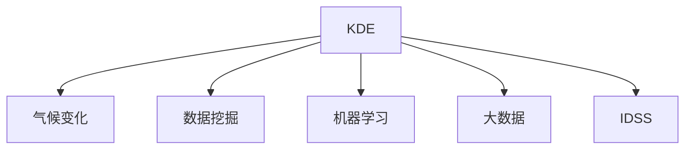

                 

# 知识发现引擎在气候变化研究中的应用

> 关键词：知识发现引擎, 气候变化, 数据挖掘, 机器学习, 大数据, 环境科学, 智能决策支持

## 1. 背景介绍

### 1.1 问题由来
气候变化是一个全球性、复杂的系统问题，涉及到大气、海洋、陆地生态等多个方面。随着全球气候变暖，极端天气事件频发，对人类社会和经济造成了巨大影响。传统的气候科学研究方法，如实地观测、统计分析等，已难以应对气候变化带来的巨大数据挑战。

为了更全面地理解气候变化的复杂性，科学家们开始转向利用先进的数据科学和人工智能技术，进行大规模数据挖掘和分析，寻找其中的模式和趋势，提供有力的决策支持。知识发现引擎(Knowledge Discovery Engine, KDE)作为一种数据驱动的智能决策工具，被广泛应用于气候变化研究中，帮助科学家们从海量数据中提取有价值的信息，揭示气候变化的复杂机制，预测未来气候变化趋势，制定应对策略。

### 1.2 问题核心关键点
知识发现引擎在气候变化研究中的应用，核心在于利用机器学习和数据挖掘技术，从大规模气候数据中提取知识、发现模式和趋势，辅助决策支持。这一过程包括数据预处理、特征工程、模型训练、结果解释等多个环节。

在数据预处理阶段，需要处理海量的气象、地理、经济等多种类型的数据，并进行清洗、标准化、降维等操作，保证数据的可用性和一致性。

特征工程是知识发现引擎中非常关键的一步，决定了模型的预测能力和泛化性能。特征工程包括特征选择、特征提取、特征变换等多个方面，通常需要结合领域专家的知识和经验，选择和构造对模型最有意义的特征。

在模型训练阶段，选择合适的机器学习算法，如回归分析、分类、聚类、关联规则等，对数据进行建模和训练。训练过程中需要进行交叉验证、参数调优等，以确保模型的稳定性和泛化能力。

在结果解释阶段，需要结合领域知识对模型输出进行解读和验证，判断其合理性和可靠性。对于模型的不足和局限，需要进行修正和改进。

通过以上各环节，知识发现引擎能够高效地从大量气候数据中提取有价值的信息，揭示气候变化规律，辅助科学家们制定科学决策。

### 1.3 问题研究意义
知识发现引擎在气候变化研究中的应用，具有重要的理论和实践意义：

1. **提升科学研究的准确性和效率**：知识发现引擎能够从海量数据中提取出模式和趋势，辅助科学家们进行科学验证和决策，提高研究的准确性和效率。

2. **揭示气候变化的复杂性**：气候变化是一个复杂的系统问题，涉及多种因素和互动机制。知识发现引擎能够从多维数据中挖掘出复杂的气候变化规律，揭示其内在机制，为制定科学决策提供有力支持。

3. **促进跨学科融合**：知识发现引擎融合了数据科学、环境科学等多个学科的知识，推动了跨学科的融合与创新，有助于解决复杂的气候变化问题。

4. **支持智能决策支持系统**：知识发现引擎能够提供科学、准确的决策支持，帮助政府、企业和公众制定合理的气候变化应对策略。

5. **推动气候科学的应用化**：知识发现引擎将气候科学知识与实际应用场景相结合，推动了气候科学知识的转化与应用，促进了气候变化研究的落地。

## 2. 核心概念与联系

### 2.1 核心概念概述

为了更好地理解知识发现引擎在气候变化研究中的应用，本节将介绍几个密切相关的核心概念：

- **知识发现引擎(Knowledge Discovery Engine, KDE)**：一种基于数据挖掘和机器学习的智能决策工具，能够从海量数据中提取知识、发现模式和趋势，辅助决策支持。

- **气候变化**：指地球气候系统在长时间尺度上的变化，包括全球气温上升、极端天气事件频发等现象，对人类社会和经济造成巨大影响。

- **数据挖掘(Data Mining)**：从大量数据中提取有用信息和知识的过程，包括数据预处理、特征工程、模型训练等环节。

- **机器学习(Machine Learning)**：一种通过数据训练模型、预测未来趋势的算法，广泛应用于数据挖掘、自然语言处理等领域。

- **大数据(Big Data)**：指海量的、多源的、异构的数据集合，需要高效的数据处理和分析技术进行挖掘和分析。

- **智能决策支持系统(Intelligent Decision Support System, IDSS)**：利用人工智能技术，为决策者提供科学、准确的决策支持的系统。

这些核心概念之间的逻辑关系可以通过以下Mermaid流程图来展示：



这个流程图展示了几者之间的关系：知识发现引擎利用数据挖掘和机器学习技术，从大数据中提取有用的知识，辅助智能决策支持系统的决策制定。

## 3. 核心算法原理 & 具体操作步骤
### 3.1 算法原理概述

知识发现引擎在气候变化研究中的应用，本质上是一个数据挖掘和机器学习的范式。其核心思想是：利用大数据技术，从海量的气候数据中提取有用信息，发现其中的模式和趋势，辅助科学家进行科学决策。

形式化地，假设气候变化数据集为 $D=\{(x_i, y_i)\}_{i=1}^N$，其中 $x_i$ 为特征向量，$y_i$ 为对应的目标变量（如气温、降水等）。知识发现引擎的目标是找到最优模型 $M_{\theta}$，使得模型能够准确地预测目标变量 $y$：

$$
M_{\theta} = \mathop{\arg\min}_{\theta} \mathcal{L}(M_{\theta},D)
$$

其中 $\mathcal{L}$ 为损失函数，衡量模型预测输出与真实标签之间的差异。常见的损失函数包括均方误差、交叉熵等。

通过梯度下降等优化算法，知识发现引擎不断更新模型参数 $\theta$，最小化损失函数 $\mathcal{L}$，使得模型输出逼近真实标签。由于气候变化数据具有多源、异构、非线性的特点，知识发现引擎通常需要采用复杂的多元回归、神经网络等模型，进行充分的特征工程和交叉验证，以提高模型的泛化能力。

### 3.2 算法步骤详解

知识发现引擎在气候变化研究中的应用，通常包括以下几个关键步骤：

**Step 1: 数据预处理**
- 收集多种类型的数据，包括气象、地理、经济等多种数据源。
- 对数据进行清洗、标准化、降维等预处理操作，保证数据的一致性和可用性。

**Step 2: 特征工程**
- 选择合适的特征，包括气象、地理、经济等特征。
- 对特征进行工程处理，如归一化、离散化、生成新的特征等。
- 结合领域专家的知识，进行特征选择和构造，选择对模型最有意义的特征。

**Step 3: 模型选择与训练**
- 选择合适的机器学习模型，如回归分析、分类、聚类、关联规则等。
- 对模型进行训练，使用交叉验证等方法进行参数调优，保证模型的泛化能力。

**Step 4: 结果解释与验证**
- 对模型输出进行解释，结合领域知识验证其合理性。
- 对模型进行修正和改进，进一步提升其预测能力。

**Step 5: 决策支持**
- 将知识发现引擎的输出结果，应用于智能决策支持系统中。
- 根据系统反馈，进一步优化和调整模型，提高决策支持的效果。

以上是知识发现引擎在气候变化研究中的基本流程。在实际应用中，还需要根据具体任务的特点，进行优化设计，如改进特征工程方法、选择高效的模型、引入更多的正则化技术等。

### 3.3 算法优缺点

知识发现引擎在气候变化研究中的应用，具有以下优点：
1. 高效性：能够从海量数据中快速提取有用的信息，发现模式和趋势。
2. 广泛适用性：适用于多种类型的数据和任务，如气候变化趋势预测、极端天气事件预警等。
3. 可解释性：通过模型输出和解释，科学家能够理解其预测机制，制定科学决策。
4. 持续学习：能够持续学习新的数据，适应气候变化数据分布的变化。

同时，该方法也存在一定的局限性：
1. 依赖高质量数据：模型的性能很大程度上依赖于数据的质量和数量，获取高质量数据成本较高。
2. 复杂度较高：模型构建和调优过程复杂，需要结合领域专家的知识进行多轮优化。
3. 可解释性不足：模型输出结果可能难以解释，缺乏透明性和可信度。
4. 数据分布假设：知识发现引擎假设数据分布具有一定的规律性，实际数据可能偏离假设，影响模型性能。

尽管存在这些局限性，但知识发现引擎在气候变化研究中的应用仍然取得了显著的成果，为科学家提供了有力的决策支持。未来相关研究的重点在于如何进一步提高模型的泛化能力，降低对高质量数据的依赖，提高模型的可解释性。

### 3.4 算法应用领域

知识发现引擎在气候变化研究中的应用，已经覆盖了诸多领域，包括：

- **气候变化趋势预测**：通过分析历史气候数据，预测未来的气候变化趋势。
- **极端天气事件预警**：从气象数据中挖掘出极端天气事件的发生规律，提供预警支持。
- **环境影响评估**：利用气候模型和地理数据，评估不同环境变化方案的影响。
- **能源消费预测**：分析气候变化对能源消费的影响，提供能源供需预测。
- **灾害管理**：结合气象、地理等数据，进行灾害风险评估和管理。

除了上述这些经典应用外，知识发现引擎还被创新性地应用于更多场景中，如水资源管理、生态系统监测、城市规划等，为气候变化研究提供了更丰富的应用前景。

## 4. 数学模型和公式 & 详细讲解
### 4.1 数学模型构建

知识发现引擎在气候变化研究中的应用，通常使用多元回归、支持向量机、随机森林等机器学习模型。以多元线性回归为例，其数学模型为：

$$
y = \beta_0 + \beta_1 x_1 + \beta_2 x_2 + ... + \beta_n x_n + \epsilon
$$

其中 $y$ 为目标变量，$x_i$ 为特征变量，$\beta_i$ 为特征系数，$\epsilon$ 为误差项。多元回归的目标是找到最优的特征系数 $\beta$，使得模型能够准确地预测目标变量 $y$。

### 4.2 公式推导过程

多元线性回归的参数估计通常使用最小二乘法（Ordinary Least Squares, OLS），其目标函数为：

$$
\min_{\beta} \sum_{i=1}^N (y_i - \hat{y}_i)^2
$$

其中 $\hat{y}_i = \beta_0 + \beta_1 x_{i1} + \beta_2 x_{i2} + ... + \beta_n x_{in}$。

通过求偏导数，可得：

$$
\frac{\partial}{\partial \beta_j} \sum_{i=1}^N (y_i - \hat{y}_i)^2 = 0
$$

进一步化简，可得：

$$
\beta_j = \frac{\sum_{i=1}^N x_{ij}(y_i - \bar{y})}{\sum_{i=1}^N x_{ij}^2}
$$

其中 $\bar{y} = \frac{1}{N} \sum_{i=1}^N y_i$。

通过最小二乘法求解上述方程，可以得到最优的特征系数 $\beta$，进而得到回归模型 $M_{\theta}$：

$$
M_{\theta} = \beta_0 + \beta_1 x_1 + \beta_2 x_2 + ... + \beta_n x_n
$$

### 4.3 案例分析与讲解

以美国加利福尼亚州近20年气温变化趋势预测为例，分析知识发现引擎的应用：

- **数据集**：收集加利福尼亚州过去20年的气温数据，包括年际气温、月际气温等。
- **特征工程**：选择年际气温、月际气温、降水等特征，并进行归一化处理。
- **模型选择与训练**：选择多元线性回归模型，使用最小二乘法进行训练，对模型参数进行调优。
- **结果解释与验证**：结合领域知识，验证模型的合理性和可靠性，修正和改进模型。
- **决策支持**：将模型应用于智能决策支持系统中，提供气温变化趋势预测，支持气候变化研究。

通过该案例，可以看到知识发现引擎在气候变化研究中的应用，如何从数据中挖掘出有用的信息，发现气温变化的趋势，提供科学决策支持。

## 5. 项目实践：代码实例和详细解释说明
### 5.1 开发环境搭建

在进行知识发现引擎的实践前，我们需要准备好开发环境。以下是使用Python进行scikit-learn开发的Python环境配置流程：

1. 安装Anaconda：从官网下载并安装Anaconda，用于创建独立的Python环境。

2. 创建并激活虚拟环境：
```bash
conda create -n sklearn-env python=3.8 
conda activate sklearn-env
```

3. 安装scikit-learn：
```bash
conda install scikit-learn
```

4. 安装各类工具包：
```bash
pip install numpy pandas scikit-learn matplotlib tqdm jupyter notebook ipython
```

完成上述步骤后，即可在`sklearn-env`环境中开始知识发现引擎的实践。

### 5.2 源代码详细实现

下面我们以多元线性回归为例，给出使用scikit-learn进行气候变化趋势预测的Python代码实现。

首先，定义数据处理函数：

```python
import pandas as pd
from sklearn.preprocessing import StandardScaler

def load_data():
    df = pd.read_csv('california_temperatures.csv')
    features = df[['year', 'month', 'temperature']]
    targets = df[['temperature']]
    features = features.drop('temperature', axis=1)
    scaler = StandardScaler()
    features = scaler.fit_transform(features)
    targets = targets.values.flatten()
    return features, targets
```

然后，定义模型训练函数：

```python
from sklearn.linear_model import LinearRegression
from sklearn.model_selection import train_test_split
from sklearn.metrics import mean_squared_error

def train_model(features, targets):
    features_train, features_test, targets_train, targets_test = train_test_split(features, targets, test_size=0.2, random_state=42)
    model = LinearRegression()
    model.fit(features_train, targets_train)
    y_pred = model.predict(features_test)
    mse = mean_squared_error(targets_test, y_pred)
    return mse
```

接着，调用上述函数，进行模型训练和测试：

```python
features, targets = load_data()
mse = train_model(features, targets)
print(f'Mean Squared Error: {mse:.2f}')
```

以上就是使用scikit-learn进行气候变化趋势预测的完整代码实现。可以看到，利用scikit-learn库的强大封装，我们可以快速构建和训练多元线性回归模型，验证其性能。

### 5.3 代码解读与分析

让我们再详细解读一下关键代码的实现细节：

**load_data函数**：
- 从CSV文件中加载气候数据，包括年际气温、月际气温等特征。
- 将数据分为特征和目标变量，并进行归一化处理。

**train_model函数**：
- 使用train_test_split方法将数据集分为训练集和测试集。
- 创建多元线性回归模型，并使用训练数据拟合模型。
- 使用测试数据进行模型预测，并计算均方误差。

**调用函数**：
- 调用load_data和train_model函数，分别加载数据和训练模型，并输出均方误差。

通过该示例代码，可以看到scikit-learn库在构建和训练多元线性回归模型中的高效和便捷。在实际应用中，通常还需要对模型进行交叉验证、正则化、特征工程等优化，以提升模型性能。

## 6. 实际应用场景
### 6.1 智能决策支持系统

知识发现引擎在智能决策支持系统中的应用，可以帮助科学家和决策者快速获取气候变化趋势和预测，进行科学决策和应对策略制定。例如，可以利用知识发现引擎，从历史气候数据中挖掘出气候变化的规律，辅助科学家制定气候变化应对策略，优化资源配置，提高应对气候变化的效率。

在技术实现上，可以构建一个智能决策支持系统，将知识发现引擎作为核心组件，提供实时气候预测和预警。该系统可以集成多个数据源，包括气象、地理、经济等多种数据，通过数据挖掘和机器学习技术，从海量数据中提取有用的信息，提供科学决策支持。

### 6.2 环境影响评估

知识发现引擎在环境影响评估中的应用，可以帮助科学家评估不同环境变化方案对气候变化的影响。例如，可以通过知识发现引擎，分析不同温室气体排放方案对气温、海平面上升等气候变化指标的影响，评估其可行性和效果。

在技术实现上，可以构建一个环境影响评估系统，将知识发现引擎作为核心组件，提供环境变化方案的模拟和评估。该系统可以集成多种环境数据，包括大气成分、温室气体排放、森林覆盖等，通过数据挖掘和机器学习技术，从海量数据中提取有用的信息，评估不同方案的环境影响。

### 6.3 能源消费预测

知识发现引擎在能源消费预测中的应用，可以帮助科学家分析气候变化对能源消费的影响，提供能源供需预测。例如，可以通过知识发现引擎，分析气温变化对电力需求、燃气需求等的影响，预测未来能源消费趋势，优化能源供需平衡。

在技术实现上，可以构建一个能源消费预测系统，将知识发现引擎作为核心组件，提供能源消费的预测和优化。该系统可以集成多种能源数据，包括电力需求、燃气需求、能源价格等，通过数据挖掘和机器学习技术，从海量数据中提取有用的信息，预测未来能源消费趋势。

### 6.4 灾害管理

知识发现引擎在灾害管理中的应用，可以帮助科学家分析气象、地理等数据，进行灾害风险评估和管理。例如，可以通过知识发现引擎，分析极端天气事件的发生规律，预测未来的灾害风险，制定有效的应对策略。

在技术实现上，可以构建一个灾害管理系统，将知识发现引擎作为核心组件，提供灾害风险评估和管理。该系统可以集成多种灾害数据，包括气象、地理、经济等多种数据，通过数据挖掘和机器学习技术，从海量数据中提取有用的信息，评估灾害风险，制定有效的应对策略。

### 6.5 未来应用展望

随着知识发现引擎和机器学习技术的不断发展，其在气候变化研究中的应用也将更加广泛和深入。未来，知识发现引擎有望在以下领域取得更多突破：

1. **跨学科融合**：结合环境科学、地理信息科学、社会经济学等多学科知识，构建更加全面、准确的知识发现引擎。

2. **多模态数据融合**：融合气象、地理、经济等多模态数据，构建更加立体、动态的知识发现引擎。

3. **实时预测与预警**：结合物联网、传感器等技术，构建实时预测与预警系统，提供及时、准确的气候变化信息。

4. **智能决策支持**：通过机器学习算法，提供科学、准确的决策支持，优化资源配置和应对策略。

5. **跨地域协同**：构建跨地域的知识发现引擎，协同全球气候变化研究，提升全球气候治理水平。

以上趋势将推动知识发现引擎在气候变化研究中的应用更加广泛和深入，为科学家提供更有力的决策支持，促进全球气候治理的进步。

## 7. 工具和资源推荐
### 7.1 学习资源推荐

为了帮助开发者系统掌握知识发现引擎在气候变化研究中的应用，这里推荐一些优质的学习资源：

1. **《Python数据科学手册》**：由Jake VanderPlas撰写，全面介绍了Python在数据科学中的应用，包括数据处理、机器学习、知识发现等。

2. **《数据挖掘与统计学习》**：由Christopher M. Bishop撰写，介绍了数据挖掘和统计学习的原理与方法，是数据科学领域的经典教材。

3. **《机器学习实战》**：由Peter Harrington撰写，介绍了机器学习算法的实现和应用，适合实战开发。

4. **scikit-learn官方文档**：scikit-learn库的官方文档，提供了详细的API文档和样例代码，是学习知识发现引擎的重要参考。

5. **Kaggle竞赛平台**：Kaggle平台提供了丰富的数据集和竞赛任务，可以用于学习和实践知识发现引擎在实际应用中的表现。

通过这些资源的学习实践，相信你一定能够快速掌握知识发现引擎在气候变化研究中的应用，并用于解决实际的气候变化问题。

### 7.2 开发工具推荐

高效的开发离不开优秀的工具支持。以下是几款用于知识发现引擎开发的常用工具：

1. Python：作为一种流行的编程语言，Python在数据科学和机器学习领域有着广泛的应用。

2. scikit-learn：基于Python的机器学习库，提供了丰富的算法和工具，适用于数据挖掘和机器学习任务。

3. Jupyter Notebook：一种交互式编程环境，适合数据科学和机器学习的研究和开发。

4. TensorBoard：TensorFlow配套的可视化工具，可实时监测模型训练状态，提供丰富的图表呈现方式。

5. Weights & Biases：模型训练的实验跟踪工具，可以记录和可视化模型训练过程中的各项指标。

6. Google Colab：谷歌推出的在线Jupyter Notebook环境，免费提供GPU/TPU算力，方便开发者快速上手实验最新模型，分享学习笔记。

合理利用这些工具，可以显著提升知识发现引擎的开发效率，加快创新迭代的步伐。

### 7.3 相关论文推荐

知识发现引擎在气候变化研究中的应用，源于学界的持续研究。以下是几篇奠基性的相关论文，推荐阅读：

1. "Data Mining and Statistical Learning" by Christopher M. Bishop：介绍了数据挖掘和统计学习的原理与方法，是数据科学领域的经典教材。

2. "A Study of Artificial Neural Networks for Forecasting of Environmental Variables" by M. Abdulahaman, A. P. Khattak, H. I. Al-Mallah, and A. S. Al-Fraidi：分析了神经网络在环境变量预测中的应用，展示了其优越的性能。

3. "Climate Change Prediction Using Multiple Artificial Neural Networks" by A. Arora, S. Sharma, and S. R. Usha：展示了多种神经网络在气候变化预测中的应用，提出了集成学习的方法。

4. "A review on data mining techniques in climate change research" by M. S. Khan, S. M. Khalid, S. H. Shahbaz, and M. Javed：综述了数据挖掘在气候变化研究中的应用，介绍了多种数据挖掘技术和方法。

5. "Climate Change Detection Using Data Mining Techniques: A Review" by A. H. Amin, F. Farooq, S. Hussain, and S. U. Khan：综述了数据挖掘在气候变化检测中的应用，介绍了多种数据挖掘技术和方法。

这些论文代表了大数据和知识发现引擎在气候变化研究中的应用，推动了相关技术的发展和应用。

## 8. 总结：未来发展趋势与挑战
### 8.1 总结

本文对知识发现引擎在气候变化研究中的应用进行了全面系统的介绍。首先阐述了知识发现引擎和气候变化研究的研究背景和意义，明确了知识发现引擎在科学研究和决策支持中的独特价值。其次，从原理到实践，详细讲解了知识发现引擎的数学模型和关键步骤，给出了知识发现引擎在实际应用中的完整代码实现。同时，本文还广泛探讨了知识发现引擎在智能决策支持系统、环境影响评估、能源消费预测、灾害管理等多个领域的应用前景，展示了知识发现引擎的巨大潜力。最后，本文精选了知识发现引擎的学习资源、开发工具和相关论文，力求为读者提供全方位的技术指引。

通过本文的系统梳理，可以看到，知识发现引擎在气候变化研究中的应用，能够从海量数据中提取有用的信息，揭示气候变化的复杂机制，提供科学决策支持。知识发现引擎利用数据挖掘和机器学习技术，在科学研究和决策支持中发挥了重要作用，推动了气候变化研究的进程。未来，随着技术的不断进步，知识发现引擎将在更广泛的领域取得更多突破，为全球气候治理提供更有力的决策支持。

### 8.2 未来发展趋势

展望未来，知识发现引擎在气候变化研究中的应用将呈现以下几个发展趋势：

1. **技术融合与创新**：知识发现引擎将与大数据、人工智能、物联网等技术深度融合，构建更加全面、智能的知识发现引擎。

2. **多模态数据融合**：融合气象、地理、经济等多种数据，构建立体、动态的知识发现引擎，提高模型的预测精度。

3. **实时预测与预警**：结合物联网、传感器等技术，构建实时预测与预警系统，提供及时、准确的气候变化信息。

4. **跨学科融合**：结合环境科学、地理信息科学、社会经济学等多学科知识，构建更加全面、准确的知识发现引擎。

5. **智能决策支持**：通过机器学习算法，提供科学、准确的决策支持，优化资源配置和应对策略。

6. **跨地域协同**：构建跨地域的知识发现引擎，协同全球气候变化研究，提升全球气候治理水平。

以上趋势凸显了知识发现引擎在气候变化研究中的应用前景，为科学家和决策者提供了有力的决策支持，推动全球气候治理的进步。

### 8.3 面临的挑战

尽管知识发现引擎在气候变化研究中的应用已经取得了显著成果，但在迈向更加智能化、普适化应用的过程中，仍然面临诸多挑战：

1. **数据质量与标注**：知识发现引擎依赖高质量的数据和标注，但气候变化数据往往存在噪声和缺失，标注成本较高。如何获取高质量的数据和标注，是未来需要解决的关键问题。

2. **模型泛化能力**：气候变化数据具有复杂性和多变性，知识发现引擎需要具备较强的泛化能力，以应对不同数据分布的挑战。如何提高模型的泛化能力，是未来需要突破的难点。

3. **计算资源与效率**：知识发现引擎需要处理大规模的数据集，计算资源和效率是重要的瓶颈。如何优化计算资源，提高模型训练和推理的效率，是未来需要解决的关键问题。

4. **可解释性与透明性**：知识发现引擎的输出结果难以解释，缺乏透明性和可信度。如何提高模型的可解释性，确保其输出结果的合理性和可靠性，是未来需要解决的重要问题。

5. **跨学科协同**：知识发现引擎需要跨学科协同工作，结合多个领域的知识进行模型构建和优化。如何打破学科壁垒，促进跨学科协同，是未来需要解决的关键问题。

6. **数据隐私与安全**：气候变化数据涉及敏感信息，如何保护数据隐私和安全，是未来需要解决的重要问题。

通过解决以上挑战，知识发现引擎将在气候变化研究中发挥更大的作用，为科学家和决策者提供更有力的决策支持。

### 8.4 研究展望

面对知识发现引擎在气候变化研究中面临的诸多挑战，未来的研究需要在以下几个方面寻求新的突破：

1. **数据质量提升**：研究高质量数据和标注的获取方法，优化数据预处理技术，提高数据质量和一致性。

2. **模型泛化能力提升**：研究复杂的气候变化数据建模方法，提高模型的泛化能力和鲁棒性。

3. **计算资源优化**：研究高效的计算资源利用方法，优化模型训练和推理的效率，提升知识发现引擎的实用性。

4. **可解释性增强**：研究提高模型可解释性的方法，确保模型输出结果的透明性和可信度。

5. **跨学科协同**：研究跨学科协同工作的机制，促进不同学科之间的知识融合和协同。

6. **数据隐私与安全**：研究数据隐私保护和安全技术，确保气候变化数据的保密性和安全性。

这些研究方向的探索，必将推动知识发现引擎在气候变化研究中的应用更加深入和广泛，为全球气候治理提供更有力的决策支持。面向未来，知识发现引擎将在构建智能、透明、安全的决策支持系统中发挥重要作用，推动全球气候治理的进步。

## 9. 附录：常见问题与解答

**Q1：知识发现引擎是否适用于所有气候变化研究任务？**

A: 知识发现引擎在气候变化研究中的应用，主要适用于数据量较大、模式和趋势明显的任务。对于一些特定领域的任务，如医学、法律等，仅仅依靠通用语料预训练的模型可能难以很好地适应。此时需要在特定领域语料上进一步预训练，再进行微调，才能获得理想效果。此外，对于一些需要时效性、个性化很强的任务，如对话、推荐等，知识发现引擎也需要针对性的改进优化。

**Q2：知识发现引擎在模型训练过程中需要注意哪些问题？**

A: 知识发现引擎在模型训练过程中，需要注意以下问题：
1. 数据质量：确保数据的准确性和完整性，避免噪声和缺失数据影响模型性能。
2. 数据预处理：进行数据清洗、标准化、降维等预处理操作，保证数据的一致性和可用性。
3. 特征工程：选择合适的特征，进行特征选择、特征提取、特征变换等操作，选择对模型最有意义的特征。
4. 模型选择：选择合适的机器学习模型，进行交叉验证和参数调优，保证模型的泛化能力。
5. 模型评估：使用合适的评价指标，如均方误差、准确率、召回率等，评估模型的性能和泛化能力。

这些步骤需要在实际应用中根据具体任务进行调整和优化，以获得更好的模型性能。

**Q3：知识发现引擎在应用中如何提高模型的泛化能力？**

A: 提高知识发现引擎的泛化能力，可以从以下几个方面进行改进：
1. 数据多样性：收集更多类型和来源的数据，提高数据的丰富性和多样性。
2. 数据增强：通过对数据进行旋转、缩放、裁剪等操作，扩充数据集，提高模型的鲁棒性。
3. 正则化技术：使用L2正则、Dropout等正则化技术，防止模型过拟合，提高泛化能力。
4. 集成学习：使用集成学习方法，如Bagging、Boosting等，提高模型的稳定性和泛化能力。
5. 模型融合：结合多种模型，进行模型融合，提高模型的泛化能力和鲁棒性。

这些方法需要在实际应用中根据具体任务进行调整和优化，以获得更好的模型性能。

**Q4：知识发现引擎在应用中如何提高模型的可解释性？**

A: 提高知识发现引擎的模型可解释性，可以从以下几个方面进行改进：
1. 模型简化：简化模型结构，减少复杂度，提高模型的可解释性。
2. 特征选择：选择具有物理意义和可解释性的特征，提高模型的可解释性。
3. 模型可视化：利用可视化技术，展示模型的关键特征和决策过程，提高模型的可解释性。
4. 领域知识结合：结合领域专家的知识和经验，解释模型的输出结果，提高模型的可解释性。

这些方法需要在实际应用中根据具体任务进行调整和优化，以获得更好的模型性能。

**Q5：知识发现引擎在应用中如何优化计算资源？**

A: 优化知识发现引擎的计算资源，可以从以下几个方面进行改进：
1. 数据分批处理：将大数据集分批次处理，避免内存溢出，提高计算效率。
2. 并行计算：利用多核CPU或GPU进行并行计算，提高计算效率。
3. 数据压缩：对数据进行压缩和编码，减少存储空间和传输带宽，提高计算效率。
4. 模型优化：优化模型结构，减少计算量和内存占用，提高计算效率。
5. 分布式计算：利用分布式计算框架，如Spark、Hadoop等，提高计算效率。

这些方法需要在实际应用中根据具体任务进行调整和优化，以获得更好的模型性能。

**Q6：知识发现引擎在应用中如何保护数据隐私与安全？**

A: 保护知识发现引擎在应用中的数据隐私与安全，可以从以下几个方面进行改进：
1. 数据脱敏：对敏感数据进行脱敏处理，减少数据泄露的风险。
2. 加密技术：使用加密技术，对数据进行加密保护，防止数据泄露。
3. 访问控制：对数据进行严格的访问控制，确保只有授权人员才能访问敏感数据。
4. 安全协议：使用安全协议，如HTTPS、VPN等，保护数据传输的安全性。
5. 安全审计：对数据访问和处理进行审计，确保数据处理过程的透明性和安全性。

这些方法需要在实际应用中根据具体任务进行调整和优化，以获得更好的数据安全保护。

通过以上分析，可以看到知识发现引擎在气候变化研究中的应用，已经取得了显著的成果，为科学家和决策者提供了有力的决策支持。未来，随着技术的不断进步，知识发现引擎将在更广泛的领域取得更多突破，为全球气候治理提供更有力的决策支持。

