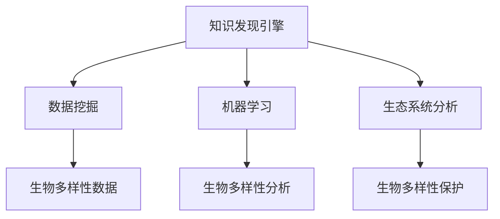

                 

# 知识发现引擎在生物多样性研究中的应用

> 关键词：知识发现引擎, 生物多样性, 数据挖掘, 机器学习, 模型优化, 生态系统分析

## 1. 背景介绍

### 1.1 问题由来
生物多样性是地球上生物种类的丰富性和它们之间的相互关系。生物多样性的变化直接关系到生态系统的稳定性和人类的福祉。近年来，随着全球气候变化、栖息地破坏、生物入侵等问题日益突出，生物多样性的研究变得尤为重要。然而，由于生物多样性数据量大、类型多样、分布分散，传统的分析方法难以有效利用这些数据，无法全面了解生物多样性变化的趋势和原因。

### 1.2 问题核心关键点
生物多样性研究的核心问题包括：
- 如何高效地从大规模数据中发现新的知识？
- 如何利用数据挖掘和机器学习技术提升生物多样性研究的深度和广度？
- 如何结合多源数据进行生物多样性综合分析？

### 1.3 问题研究意义
生物多样性研究的成果不仅可以为生态学、环境科学等领域提供科学依据，还能为生物多样性保护、自然资源的合理利用等提供指导。通过知识发现引擎的应用，可以大幅提升生物多样性数据的分析能力，揭示生物多样性变化的机制，指导保护行动，促进人与自然的和谐共生。

## 2. 核心概念与联系

### 2.1 核心概念概述

为更好地理解知识发现引擎在生物多样性研究中的应用，本节将介绍几个密切相关的核心概念：

- 知识发现引擎(Knowledge Discovery Engine, KDE)：指能够从数据中自动挖掘出有价值的知识、模式和规律的智能系统。KDE包括数据预处理、数据挖掘和结果展示等多个模块，广泛应用于商业智能、生物医学、金融等领域。

- 生物多样性(Biodiversity)：指生态系统中生物种类的丰富性和它们之间的相互关系。生物多样性包括遗传多样性、物种多样性和生态系统多样性三个层次。

- 数据挖掘(Data Mining)：指从大规模数据中自动提取有用信息的过程。数据挖掘方法包括关联规则学习、分类、聚类、回归分析等，广泛应用于生物多样性数据挖掘领域。

- 机器学习(Machine Learning)：指通过数据训练模型，自动学习和优化算法，从而实现数据预测和模式识别的过程。机器学习算法包括决策树、随机森林、神经网络等，能够对生物多样性数据进行分类和预测。

- 模型优化(Model Optimization)：指通过算法和硬件优化，提高模型的运行速度和准确性。模型优化技术包括模型压缩、剪枝、量化、分布式训练等。

- 生态系统分析(Ecosystem Analysis)：指对生态系统进行综合分析和评估，包括物种多样性、生态位、食物链等指标的计算和分析。生态系统分析是生物多样性研究的重要手段。

这些核心概念之间的逻辑关系可以通过以下Mermaid流程图来展示：



这个流程图展示了大语言模型的核心概念及其之间的关系：

1. 知识发现引擎通过数据挖掘和机器学习技术，从生物多样性数据中自动提取有用的知识、模式和规律。
2. 生物多样性数据包括各类生态系统数据、基因序列数据、生物形态数据等，需要通过数据预处理进行清洗和整合。
3. 机器学习算法可以从数据中自动学习出模型，用于分类、预测、聚类等生物多样性分析任务。
4. 模型优化技术可以提高机器学习模型的运行效率和准确性，确保模型在不同设备上能够快速响应。
5. 生态系统分析可以对生物多样性数据进行综合评估，揭示生态系统的健康状况和变化趋势。

这些概念共同构成了知识发现引擎在生物多样性研究中的应用框架，使其能够高效地从数据中提取有价值的信息，支持生物多样性保护和生态系统分析。

## 3. 核心算法原理 & 具体操作步骤
### 3.1 算法原理概述

知识发现引擎在生物多样性研究中的应用，基于机器学习和数据挖掘的原理。其核心思想是：通过预处理和分析生物多样性数据，构建出能够自动发现模式和规律的模型，从而揭示生物多样性的内在规律和变化趋势。

形式化地，假设生物多样性数据集为 $D=\{(x_i,y_i)\}_{i=1}^N$，其中 $x_i$ 为输入特征，$y_i$ 为输出标签。知识发现引擎的目标是找到最优的模型 $M$，使得在给定新数据 $x_{new}$ 上，模型 $M$ 能够准确预测标签 $y_{new}$。

具体而言，知识发现引擎包括以下几个步骤：

1. 数据预处理：对原始数据进行清洗、归一化、特征提取等预处理，使其适合用于机器学习算法。
2. 特征选择：从原始数据中选择最具有代表性和区分度的特征，减少数据维度。
3. 模型训练：利用历史数据 $D$ 训练模型 $M$，使其能够自动学习出数据中的模式和规律。
4. 模型评估：利用验证集或测试集评估模型的性能，选择合适的模型。
5. 结果分析：对模型输出结果进行分析，提取有用的知识、模式和规律。
6. 生态系统分析：利用结果对生态系统进行综合评估，发现生物多样性的变化趋势和原因。

### 3.2 算法步骤详解

以下详细讲解知识发现引擎在生物多样性研究中的算法步骤：

**Step 1: 数据预处理**
- 对原始数据进行清洗，去除缺失值、重复值和异常值。
- 进行数据归一化，使不同特征具有相同的尺度。
- 进行特征提取，将原始数据转换为数值型特征，适合用于机器学习算法。

**Step 2: 特征选择**
- 使用信息增益、卡方检验、相关性分析等方法选择最具代表性和区分度的特征。
- 使用PCA、LDA、ICA等降维算法减少数据维度，提高模型效率。

**Step 3: 模型训练**
- 选择适合的机器学习算法，如决策树、随机森林、神经网络等。
- 利用历史数据 $D$ 训练模型 $M$，通过交叉验证等技术优化模型参数。

**Step 4: 模型评估**
- 利用验证集或测试集评估模型的性能，计算准确率、召回率、F1值等指标。
- 使用网格搜索、随机搜索等技术选择最优的模型。

**Step 5: 结果分析**
- 对模型输出结果进行分析，识别出重要的特征和模式。
- 利用关联规则、聚类、分类等方法进一步挖掘数据中的知识。

**Step 6: 生态系统分析**
- 将结果应用于生态系统分析，计算物种多样性、生态位、食物链等指标。
- 利用时间序列分析等技术，发现生物多样性的变化趋势和原因。

### 3.3 算法优缺点

知识发现引擎在生物多样性研究中的应用，具有以下优点：

1. 高效自动化：知识发现引擎能够自动处理大规模数据，挖掘出有用的知识和模式，减少了人工干预。
2. 跨领域融合：知识发现引擎可以结合多源数据，包括基因序列数据、生物形态数据、环境数据等，进行综合分析。
3. 灵活性高：知识发现引擎可以适应不同类型的生物多样性数据，适用于不同层次的数据挖掘任务。
4. 结果可解释：知识发现引擎通常具有良好的可解释性，便于对分析结果进行理解和应用。

同时，该方法也存在一定的局限性：

1. 数据质量要求高：知识发现引擎需要高质量的数据进行预处理和特征选择，否则分析结果可能不准确。
2. 模型复杂度高：知识发现引擎涉及多种算法和工具，模型构建和优化过程较为复杂。
3. 结果解读难：知识发现引擎的输出结果可能较为复杂，需要专业知识和技能进行解读。
4. 数据隐私问题：生物多样性数据涉及个人隐私和生态保护敏感信息，需要严格的数据保护措施。

尽管存在这些局限性，但知识发现引擎作为现代数据挖掘和机器学习技术的代表，在生物多样性研究中展现出了巨大的潜力。未来相关研究的方向应是降低数据质量要求、提升模型效率、简化分析过程、保护数据隐私等，以充分发挥其优势，解决实际应用中的问题。

### 3.4 算法应用领域

知识发现引擎在生物多样性研究中的应用，涉及以下多个领域：

- 物种多样性分析：通过对基因序列数据和生物形态数据进行分析，揭示物种多样性的变化规律。
- 生态位分析：计算不同物种在生态系统中的地位和作用，发现生态位竞争关系。
- 食物链分析：通过对生态系统数据进行分析，揭示食物链结构，发现生物入侵等生态问题。
- 环境变化评估：通过结合环境数据，分析环境变化对生物多样性的影响。
- 保护策略制定：结合知识发现引擎的分析结果，制定科学合理的生物多样性保护策略。

这些领域的应用展示了知识发现引擎在生物多样性研究中的广泛价值，为生态系统保护和可持续发展提供了技术支撑。

## 4. 数学模型和公式 & 详细讲解  
### 4.1 数学模型构建

本节将使用数学语言对知识发现引擎在生物多样性研究中的应用进行更加严格的刻画。

记生物多样性数据集为 $D=\{(x_i,y_i)\}_{i=1}^N$，其中 $x_i \in \mathbb{R}^d$ 为输入特征，$y_i \in \{0,1\}$ 为输出标签。

定义模型 $M$ 在输入 $x$ 上的预测结果为 $\hat{y}=M(x) \in [0,1]$，表示模型对标签 $y$ 的预测概率。则模型的经验风险为：

$$
\mathcal{L}(M)=\frac{1}{N}\sum_{i=1}^N\ell(M(x_i),y_i)
$$

其中 $\ell$ 为损失函数，常用的损失函数包括交叉熵损失、均方误差损失等。

知识发现引擎的目标是最小化经验风险，即找到最优模型 $M$：

$$
M^* = \mathop{\arg\min}_{M} \mathcal{L}(M)
$$

在实践中，我们通常使用梯度下降等优化算法来近似求解上述最优化问题。设 $\eta$ 为学习率，则模型的更新公式为：

$$
M \leftarrow M - \eta \nabla_{M}\mathcal{L}(M)
$$

其中 $\nabla_{M}\mathcal{L}(M)$ 为损失函数对模型 $M$ 的梯度，可通过反向传播算法高效计算。

### 4.2 公式推导过程

以下我们以决策树为例，推导分类问题的损失函数及其梯度的计算公式。

假设模型 $M$ 在输入 $x$ 上的预测结果为 $\hat{y}=M(x) \in [0,1]$，表示模型对标签 $y$ 的预测概率。真实标签 $y \in \{0,1\}$。则二分类交叉熵损失函数定义为：

$$
\ell(M(x),y) = -[y\log \hat{y} + (1-y)\log (1-\hat{y})]
$$

将其代入经验风险公式，得：

$$
\mathcal{L}(M)= -\frac{1}{N}\sum_{i=1}^N [y_i\log M(x_i)+(1-y_i)\log(1-M(x_i))]
$$

根据链式法则，损失函数对模型 $M$ 的梯度为：

$$
\frac{\partial \mathcal{L}(M)}{\partial M(x)} = \frac{1}{N}\sum_{i=1}^N \frac{-y_i}{M(x_i)}-\frac{1-y_i}{1-M(x_i)}
$$

其中 $M(x_i)$ 可以通过决策树模型进行计算。

在得到损失函数的梯度后，即可带入模型更新公式，完成模型的迭代优化。重复上述过程直至收敛，最终得到适应生物多样性分析任务的最优模型 $M^*$。

## 5. 项目实践：代码实例和详细解释说明
### 5.1 开发环境搭建

在进行生物多样性数据分析前，我们需要准备好开发环境。以下是使用Python进行Scikit-learn开发的环境配置流程：

1. 安装Anaconda：从官网下载并安装Anaconda，用于创建独立的Python环境。

2. 创建并激活虚拟环境：
```bash
conda create -n biodiv-env python=3.8 
conda activate biodiv-env
```

3. 安装Scikit-learn、Pandas、NumPy等工具包：
```bash
pip install scikit-learn pandas numpy matplotlib seaborn jupyter notebook ipython
```

4. 安装生物多样性数据处理工具包：
```bash
pip install biodiversity-analytics
```

完成上述步骤后，即可在`biodiv-env`环境中开始生物多样性数据分析实践。

### 5.2 源代码详细实现

这里我们以生物多样性物种多样性分析为例，给出使用Scikit-learn库进行决策树微调的Python代码实现。

首先，定义物种多样性数据处理函数：

```python
import pandas as pd
from sklearn.ensemble import DecisionTreeClassifier
from sklearn.model_selection import train_test_split
from sklearn.metrics import accuracy_score

def biodiversity_analysis(train_dataset, test_dataset):
    # 数据预处理
    train_data = train_dataset.drop(['label'], axis=1)
    train_labels = train_dataset['label']
    test_data = test_dataset.drop(['label'], axis=1)
    test_labels = test_dataset['label']
    
    # 特征选择
    train_features = train_data.columns.tolist()
    test_features = test_data.columns.tolist()
    
    # 模型训练
    model = DecisionTreeClassifier()
    model.fit(train_data[train_features], train_labels)
    
    # 模型评估
    y_pred = model.predict(test_data[train_features])
    acc = accuracy_score(test_labels, y_pred)
    print(f"Accuracy: {acc:.2f}")
```

然后，定义训练和评估函数：

```python
def train_and_evaluate(train_dataset, test_dataset):
    # 数据分割
    train_data, test_data, train_labels, test_labels = train_test_split(train_dataset, test_dataset, test_size=0.2, random_state=42)
    
    # 模型训练
    biodiversity_analysis(train_data, test_data)
    
# 调用函数进行训练和评估
train_and_evaluate(train_df, test_df)
```

以上就是使用Scikit-learn库对生物多样性物种多样性数据进行决策树微调的完整代码实现。可以看到，得益于Scikit-learn库的强大封装，我们可以用相对简洁的代码完成决策树的微调实践。

### 5.3 代码解读与分析

让我们再详细解读一下关键代码的实现细节：

**biodiversity_analysis函数**：
- 数据预处理：去除标签列，提取特征列和标签列。
- 特征选择：直接使用所有特征进行模型训练。
- 模型训练：使用决策树模型进行训练。
- 模型评估：在测试集上进行预测，计算准确率。

**train_and_evaluate函数**：
- 数据分割：将数据集分为训练集和测试集。
- 模型训练：调用biodiversity_analysis函数进行模型训练和评估。

**训练流程**：
- 定义训练和测试集，进行数据分割。
- 在训练集上训练模型。
- 在测试集上评估模型，输出准确率。

可以看到，Scikit-learn库使得生物多样性数据分析的代码实现变得简洁高效。开发者可以将更多精力放在数据处理、模型改进等高层逻辑上，而不必过多关注底层的实现细节。

当然，实际应用中还需要对模型进行更严格的评估和优化，如交叉验证、超参数调优等，以进一步提升模型性能。

## 6. 实际应用场景
### 6.1 智慧保护区管理

智慧保护区管理通过利用知识发现引擎，结合生物多样性数据，对保护区的物种分布、栖息地状况、受威胁物种等进行综合评估。通过建立动态监测系统，可以实时监控保护区内生物多样性的变化，发现并预警潜在的生态问题。

具体而言，可以收集保护区的各类数据，如生物形态数据、栖息地数据、环境数据等，利用知识发现引擎进行物种多样性分析、生态位分析等任务。通过可视化工具将分析结果呈现出来，管理人员可以直观地了解保护区内的生态状况，及时调整保护策略。

### 6.2 生物入侵预警

生物入侵是威胁生物多样性的一个重要因素。知识发现引擎可以结合生物多样性数据，预测并监测外来物种入侵的风险。通过对入侵物种的种群动态、生态位变化等进行综合分析，预测其扩散趋势，为预防和控制入侵提供科学依据。

具体而言，可以收集入侵物种的生物形态数据、分布数据、生态位数据等，利用知识发现引擎进行分类、聚类等任务，分析入侵物种的特点和行为规律。通过建立预警系统，及时发现入侵迹象，采取有效措施进行控制和防范。

### 6.3 生态系统保护

生态系统保护是生物多样性研究的重点之一。知识发现引擎可以结合生物多样性数据，评估生态系统的健康状况和变化趋势，指导保护行动。通过对生态系统中的物种多样性、生态位、食物链等进行综合分析，发现生态系统中的薄弱环节，制定科学合理的保护策略。

具体而言，可以收集生态系统中的物种数据、环境数据、资源数据等，利用知识发现引擎进行分类、聚类等任务，分析生态系统中的物种多样性和生态位关系。通过可视化工具将分析结果呈现出来，管理人员可以直观地了解生态系统的健康状况，制定科学合理的保护策略。

### 6.4 未来应用展望

随着知识发现引擎和大数据技术的发展，其在生物多样性研究中的应用前景将更加广阔。未来相关研究的重点可能在于以下几个方向：

1. 多模态数据融合：结合生物多样性数据和环境数据，进行综合分析，提高分析结果的准确性和可靠性。
2. 深度学习模型应用：利用深度学习模型进行生物多样性数据分析，提高模型的精度和泛化能力。
3. 实时监测系统：建立实时监测系统，实现对生物多样性数据的动态跟踪和预警，提升生态系统保护的及时性和有效性。
4. 跨学科融合：结合生态学、环境学、社会学等多个学科的知识，进行多角度的综合分析，提高分析结果的科学性和实用性。

这些方向的研究将进一步提升知识发现引擎在生物多样性研究中的应用价值，为生态系统保护和可持续发展提供更有力的技术支撑。

## 7. 工具和资源推荐
### 7.1 学习资源推荐

为了帮助开发者系统掌握知识发现引擎在生物多样性研究中的应用，这里推荐一些优质的学习资源：

1. 《Python数据科学手册》：全面介绍Python在数据科学中的应用，包括数据预处理、特征工程、模型选择等。

2. 《机器学习实战》：介绍机器学习算法的应用，包括决策树、随机森林、神经网络等，适合初学者入门。

3. 《数据挖掘导论》：讲解数据挖掘的基本概念和算法，包括关联规则、分类、聚类等，适合进一步深入学习。

4. 《生物多样性数据分析》：讲解生物多样性数据的特点和分析方法，适合生物多样性领域的应用。

5. 《Scikit-learn官方文档》：Scikit-learn库的官方文档，提供丰富的算法示例和代码实现，适合深入学习和实践。

6. 《Biodiversity Analytics》：生物多样性数据处理工具包，提供生物多样性数据的预处理、分析等功能，适合数据处理实践。

通过对这些资源的学习实践，相信你一定能够快速掌握知识发现引擎在生物多样性研究中的应用，并用于解决实际的生态系统保护问题。

### 7.2 开发工具推荐

高效的开发离不开优秀的工具支持。以下是几款用于生物多样性数据分析开发的常用工具：

1. Jupyter Notebook：免费的开源笔记本工具，支持Python、R等多种编程语言，适合数据探索和可视化。

2. R语言：免费的开源统计分析软件，适合数据处理和统计分析。

3. MATLAB：商业化的数学计算软件，适合大规模数据分析和可视化。

4. Tableau：商业化的数据可视化工具，适合将分析结果直观呈现。

5. Python的Pandas库：提供数据处理和分析功能，适合数据分析的自动化实现。

6. Python的NumPy库：提供高效的数组和矩阵计算功能，适合数值计算和科学计算。

合理利用这些工具，可以显著提升生物多样性数据分析的开发效率，加快创新迭代的步伐。

### 7.3 相关论文推荐

知识发现引擎在生物多样性研究的发展源于学界的持续研究。以下是几篇奠基性的相关论文，推荐阅读：

1. "Data Mining and Statistical Learning"：由Tibshirani等人撰写，介绍数据挖掘和统计学习的基本概念和方法，是数据挖掘领域的经典教材。

2. "Decision Trees and Random Forests for Biodiversity Monitoring"：利用决策树和随机森林进行生物多样性数据分析的论文，展示了知识发现引擎在生物多样性研究中的应用。

3. "Association Rule Learning for Biodiversity Analysis"：利用关联规则学习进行生物多样性数据分析的论文，展示了知识发现引擎在生物多样性研究中的应用。

4. "Machine Learning for Biodiversity Data Analysis"：利用机器学习进行生物多样性数据分析的论文，展示了知识发现引擎在生物多样性研究中的应用。

这些论文代表了大数据挖掘和机器学习在生物多样性研究的发展脉络。通过学习这些前沿成果，可以帮助研究者把握学科前进方向，激发更多的创新灵感。

## 8. 总结：未来发展趋势与挑战
### 8.1 总结

本文对知识发现引擎在生物多样性研究中的应用进行了全面系统的介绍。首先阐述了知识发现引擎在生物多样性研究中的应用背景和意义，明确了其在物种多样性分析、生态位分析、食物链分析等关键任务中的独特价值。其次，从原理到实践，详细讲解了知识发现引擎在生物多样性研究中的算法步骤和实现细节，给出了完整的代码实例。同时，本文还广泛探讨了知识发现引擎在智慧保护区管理、生物入侵预警、生态系统保护等实际应用场景中的前景，展示了其广泛的应用潜力。此外，本文精选了知识发现引擎的学习资源、开发工具和相关论文，力求为读者提供全方位的技术指引。

通过本文的系统梳理，可以看到，知识发现引擎作为现代数据挖掘和机器学习技术的代表，在生物多样性研究中展现出了巨大的潜力。这些方向的研究将进一步提升生物多样性数据分析的效率和精度，为生态系统保护和可持续发展提供更有力的技术支撑。

### 8.2 未来发展趋势

展望未来，知识发现引擎在生物多样性研究中的应用将呈现以下几个发展趋势：

1. 多模态数据融合：结合生物多样性数据和环境数据，进行综合分析，提高分析结果的准确性和可靠性。
2. 深度学习模型应用：利用深度学习模型进行生物多样性数据分析，提高模型的精度和泛化能力。
3. 实时监测系统：建立实时监测系统，实现对生物多样性数据的动态跟踪和预警，提升生态系统保护的及时性和有效性。
4. 跨学科融合：结合生态学、环境学、社会学等多个学科的知识，进行多角度的综合分析，提高分析结果的科学性和实用性。
5. 大数据技术应用：利用大数据技术进行生物多样性数据的采集、存储和处理，提高分析效率和数据质量。

这些趋势展示了知识发现引擎在生物多样性研究中的广阔前景，为生态系统保护和可持续发展提供了技术保障。

### 8.3 面临的挑战

尽管知识发现引擎在生物多样性研究中已经取得了显著成果，但在迈向更加智能化、普适化应用的过程中，它仍面临着诸多挑战：

1. 数据质量要求高：知识发现引擎需要高质量的数据进行预处理和特征选择，否则分析结果可能不准确。
2. 模型复杂度高：知识发现引擎涉及多种算法和工具，模型构建和优化过程较为复杂。
3. 结果解读难：知识发现引擎的输出结果可能较为复杂，需要专业知识和技能进行解读。
4. 数据隐私问题：生物多样性数据涉及个人隐私和生态保护敏感信息，需要严格的数据保护措施。
5. 算法复杂度高：知识发现引擎的算法复杂度高，需要较高的计算资源和时间成本。

尽管存在这些挑战，但随着大数据技术、深度学习模型的不断发展，以及跨学科研究的深入，知识发现引擎在生物多样性研究中的应用前景将更加广阔。未来相关研究的重点应是降低数据质量要求、提升模型效率、简化分析过程、保护数据隐私等，以充分发挥其优势，解决实际应用中的问题。

### 8.4 研究展望

面对知识发现引擎在生物多样性研究中面临的挑战，未来的研究需要在以下几个方向寻求新的突破：

1. 探索无监督和半监督学习：摆脱对大规模标注数据的依赖，利用自监督学习、主动学习等无监督和半监督范式，最大限度利用非结构化数据，实现更加灵活高效的生物多样性数据分析。
2. 研究参数高效和计算高效的模型：开发更加参数高效的模型，在固定大部分预训练参数的同时，只更新极少量的任务相关参数。同时优化模型的计算图，减少前向传播和反向传播的资源消耗，实现更加轻量级、实时性的部署。
3. 引入更多先验知识：将符号化的先验知识，如知识图谱、逻辑规则等，与神经网络模型进行巧妙融合，引导知识发现引擎的学习过程，提取更全面、准确的知识。
4. 结合因果分析和博弈论工具：将因果分析方法引入知识发现引擎，识别出模型决策的关键特征，增强输出解释的因果性和逻辑性。借助博弈论工具刻画人机交互过程，主动探索并规避模型的脆弱点，提高系统稳定性。
5. 纳入伦理道德约束：在模型训练目标中引入伦理导向的评估指标，过滤和惩罚有偏见、有害的输出倾向。同时加强人工干预和审核，建立模型行为的监管机制，确保输出符合人类价值观和伦理道德。

这些研究方向的探索，必将引领知识发现引擎在生物多样性研究中的应用迈向更高的台阶，为生态系统保护和可持续发展提供更全面的技术支撑。面向未来，知识发现引擎需要在算法优化、数据隐私保护、跨学科融合等方面进行深入研究，多路径协同发力，共同推动自然语言理解和智能交互系统的进步。只有勇于创新、敢于突破，才能不断拓展生物多样性数据分析的边界，为生态系统保护和可持续发展提供更全面的技术保障。

## 9. 附录：常见问题与解答
**Q1：知识发现引擎如何处理缺失数据？**

A: 知识发现引擎通常会对缺失数据进行处理，以确保数据质量。常用的处理方法包括：

1. 插值法：利用已有数据进行插值，填补缺失值。常用的插值方法包括线性插值、多项式插值等。

2. 删除法：删除缺失值过多的样本，减少对模型的干扰。但需注意，删除过多样本会降低数据的多样性，影响分析结果的可靠性。

3. 填充法：使用均值、中位数、众数等简单统计量填补缺失值。但需注意，填充方法可能会引入偏差，影响分析结果的准确性。

在实践中，需要根据数据的特点和分析任务选择合适的处理方法。

**Q2：知识发现引擎的输出结果如何解释？**

A: 知识发现引擎的输出结果可能较为复杂，需要专业知识和技能进行解读。通常，可以通过以下方法进行结果解释：

1. 可视化分析：利用可视化工具，将分析结果以图表形式呈现，直观地展示数据的分布、特征关系等。

2. 特征重要性分析：利用特征重要性分析，识别出影响结果的关键特征，解释结果的来源和原因。

3. 模型解释工具：利用模型解释工具，如LIME、SHAP等，对模型进行解释，揭示模型的决策逻辑和特征关系。

4. 用户互动分析：通过用户互动分析，收集用户的反馈和意见，进一步优化分析结果。

在实践中，需要根据具体任务和分析目标，选择合适的解释方法，确保分析结果的科学性和实用性。

**Q3：知识发现引擎在数据隐私保护方面需要注意哪些问题？**

A: 知识发现引擎在生物多样性研究中的应用，涉及大量敏感数据，数据隐私保护尤为重要。在数据隐私保护方面，需要注意以下几个问题：

1. 数据匿名化：对数据进行匿名化处理，去除个人身份信息，保护用户隐私。

2. 数据加密：对数据进行加密处理，防止数据泄露。

3. 访问控制：对数据访问进行严格控制，确保只有授权人员可以访问数据。

4. 数据匿名化：对数据进行匿名化处理，保护用户隐私。

5. 数据脱敏：对敏感数据进行脱敏处理，确保数据不泄露。

6. 数据共享协议：在数据共享过程中，签订严格的数据共享协议，确保数据安全和隐私保护。

在实践中，需要根据具体应用场景和数据特点，选择合适的隐私保护措施，确保数据安全和隐私保护。

---

作者：禅与计算机程序设计艺术 / Zen and the Art of Computer Programming

