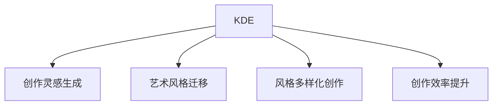

                 

# 知识发现引擎在艺术创作中的应用

## 1. 背景介绍

艺术创作是一个复杂而富有创造性的过程，涉及到丰富的视觉、听觉、文字等表现形式。知识发现引擎(Knowledge Discovery Engine, KDE)是一种能够从大量数据中自动发现隐含模式、关系和趋势的技术。通过将KDE应用到艺术创作中，可以为艺术家提供新的创作灵感，提升创作效率，促进艺术创作方式的革新。

### 1.1 问题由来

随着数字技术的发展，艺术创作方式发生了深刻变化。传统的手工绘制、雕塑等创作方式，逐渐被数字化、虚拟化的创作方式所取代。但数字创作依然存在诸多瓶颈，如创作灵感不足、创作效率低下、作品风格单一等问题。如何利用先进的技术手段，提升艺术创作的水平，成为了当前艺术创作领域的一大挑战。

### 1.2 问题核心关键点

将KDE应用到艺术创作中，可以解决以下几个核心问题：

- **创作灵感获取**：通过分析历史艺术作品和艺术家的创作过程，自动生成创作灵感和创意点。
- **风格多样化**：通过对艺术家风格的学习，自动生成不同风格的艺术作品。
- **创作效率提升**：利用数据驱动的智能辅助，快速生成高质量的创作素材和构思。
- **作品风格迁移**：将一种艺术风格的特征，自动迁移到另一种风格的艺术作品上。

### 1.3 问题研究意义

将KDE应用到艺术创作中，具有以下重要意义：

1. **创作创新推动**：KDE能够从海量数据中发现潜在的创作模式，为艺术家提供全新的创作思路，推动艺术创作方式的创新。
2. **创作效率提升**：自动生成创作素材和构思，快速迭代创意，显著提升创作效率。
3. **创作质量保障**：通过对艺术作品和创作过程的分析，KDE能够指导艺术家在创作过程中避免常见错误，提高创作质量。
4. **艺术风格融合**：通过风格迁移等技术，KDE能够帮助艺术家将多种艺术风格融合，创造出具有鲜明特色的创新作品。

## 2. 核心概念与联系

### 2.1 核心概念概述

以下是与艺术创作相关的核心概念及其联系：

- **知识发现引擎(KDE)**：一种能够自动从大量数据中发现隐含模式、关系和趋势的数据挖掘技术。
- **创作灵感生成**：通过对历史艺术作品和艺术家创作过程的分析，自动生成新的创作灵感和构思。
- **艺术风格迁移**：将一种艺术风格的特征迁移到另一种风格的艺术作品上，实现风格多样化的创作。
- **风格多样化创作**：通过对不同艺术风格的特征学习，自动生成具有多种风格特色的艺术作品。
- **创作效率提升**：通过智能辅助工具，快速生成创作素材和构思，显著提升创作速度。

这些核心概念之间的关系可以通过以下Mermaid流程图来展示：



这个流程图展示了KDE如何通过多个路径，帮助艺术家实现创作灵感的获取、风格的迁移和多样化，以及创作效率的提升。

## 3. 核心算法原理 & 具体操作步骤
### 3.1 算法原理概述

知识发现引擎在艺术创作中的应用，主要通过以下算法原理：

1. **数据挖掘与模式识别**：通过对艺术作品和创作过程的大量数据进行挖掘，识别出潜在的创作模式和风格特征。
2. **创作灵感生成**：根据识别的创作模式和风格特征，自动生成新的创作灵感和构思。
3. **风格迁移**：将一种艺术风格的特征迁移到另一种风格的艺术作品上，实现风格的自动混合和创新。
4. **创作效率提升**：通过智能辅助工具，快速生成创作素材和构思，提升创作效率。

### 3.2 算法步骤详解

以下是知识发现引擎在艺术创作中的核心算法步骤：

**Step 1: 数据收集与预处理**

- **数据来源**：收集历史艺术作品、艺术家的创作过程、艺术评论、艺术市场数据等。
- **数据标注**：对收集的数据进行标注，如作品风格、艺术家姓名、创作时间、主题等。
- **数据清洗**：清洗缺失值、异常值，进行数据归一化、标准化等预处理操作。

**Step 2: 特征提取与选择**

- **特征提取**：利用特征工程技术，从文本、图像、音频等不同模态的数据中提取有意义的特征。
- **特征选择**：根据特征的重要性，筛选出对创作模式和风格特征有贡献的关键特征。

**Step 3: 创作模式发现与识别**

- **模式发现**：使用聚类、关联规则、序列模式分析等算法，发现创作模式和趋势。
- **模式识别**：将识别出的模式与艺术家创作的历史数据进行对比，确定其创作风格。

**Step 4: 创作灵感生成**

- **灵感生成**：根据识别的创作模式和风格特征，自动生成新的创作灵感和构思。
- **灵感筛选**：根据创作主题和风格要求，对生成的灵感进行筛选，剔除不符合要求的内容。

**Step 5: 艺术风格迁移**

- **风格提取**：从一种艺术风格的作品中提取风格特征。
- **风格迁移**：将提取的风格特征应用到另一种风格的艺术作品中，实现风格的迁移和创新。

**Step 6: 创作效率提升**

- **素材生成**：利用创作灵感和风格迁移等技术，快速生成创作素材。
- **构思迭代**：根据创作过程中的反馈，迭代优化创作构思和素材，提升创作效率。

### 3.3 算法优缺点

**优点**：

- **创作效率提升**：自动生成创作素材和构思，显著缩短创作时间。
- **创作质量保障**：通过模式识别和风格迁移等技术，提升创作质量和创新性。
- **创作多样性**：利用风格迁移等技术，实现多种风格的创作，提升艺术创作的多样性。

**缺点**：

- **数据依赖性强**：需要大量高质量的标注数据和多样化的创作数据。
- **算法复杂度高**：算法实现较为复杂，需要处理多模态数据和庞大的数据集。
- **创作自由度受限**：自动生成的创作灵感和风格迁移，可能无法完全满足艺术家的创作自由度。

### 3.4 算法应用领域

知识发现引擎在艺术创作中的应用，已经涵盖了多个领域：

- **视觉艺术**：如绘画、雕塑等，通过分析历史作品和艺术家创作过程，生成新的创作灵感和构思。
- **音乐创作**：如作曲、编曲等，通过分析音乐作品和创作过程，生成新的音乐素材和创作构思。
- **文学创作**：如小说、诗歌等，通过分析文学作品和创作过程，生成新的创作灵感和构思。
- **数字艺术**：如虚拟现实、交互艺术等，通过分析数字作品和创作过程，生成新的创作素材和构思。
- **跨媒体艺术**：通过结合多种艺术形式，实现跨媒体的创作创新。

## 4. 数学模型和公式 & 详细讲解 & 举例说明

### 4.1 数学模型构建

知识发现引擎在艺术创作中的应用，涉及多个数学模型。以下是几个核心模型的构建：

**创作灵感生成模型**：
$$
\mathcal{L} = \sum_{i=1}^n \ell_i(\mathbf{x}_i, \mathbf{y}_i)
$$
其中 $\mathbf{x}_i$ 为历史作品，$\mathbf{y}_i$ 为创作灵感，$\ell_i$ 为损失函数。

**艺术风格迁移模型**：
$$
\mathcal{L} = \sum_{i=1}^m \ell_i(\mathbf{x}_i^s, \mathbf{x}_i^t)
$$
其中 $\mathbf{x}_i^s$ 为源风格作品，$\mathbf{x}_i^t$ 为目标风格作品，$\ell_i$ 为损失函数。

**创作效率提升模型**：
$$
\mathcal{L} = \sum_{j=1}^k \ell_j(\mathbf{s}_j, \mathbf{c}_j)
$$
其中 $\mathbf{s}_j$ 为创作素材，$\mathbf{c}_j$ 为创作构思，$\ell_j$ 为损失函数。

### 4.2 公式推导过程

以下是几个核心模型的公式推导过程：

**创作灵感生成模型**：
假设创作灵感 $\mathbf{y}_i$ 由历史作品 $\mathbf{x}_i$ 生成，其概率模型为 $p(\mathbf{y}_i|\mathbf{x}_i) = f(\mathbf{x}_i)$。

根据最大似然估计原则，最大化 $p(\mathbf{y}_i|\mathbf{x}_i)$，得到：
$$
\mathbf{y}_i = \mathop{\arg\max}_{\mathbf{y}_i} f(\mathbf{x}_i)
$$

**艺术风格迁移模型**：
假设目标风格作品 $\mathbf{x}_i^t$ 由源风格作品 $\mathbf{x}_i^s$ 生成，其概率模型为 $p(\mathbf{x}_i^t|\mathbf{x}_i^s) = g(\mathbf{x}_i^s, \mathbf{x}_i^t)$。

根据最大似然估计原则，最大化 $p(\mathbf{x}_i^t|\mathbf{x}_i^s)$，得到：
$$
\mathbf{x}_i^t = \mathop{\arg\max}_{\mathbf{x}_i^t} g(\mathbf{x}_i^s, \mathbf{x}_i^t)
$$

**创作效率提升模型**：
假设创作素材 $\mathbf{s}_j$ 由创作构思 $\mathbf{c}_j$ 生成，其概率模型为 $p(\mathbf{s}_j|\mathbf{c}_j) = h(\mathbf{c}_j)$。

根据最大似然估计原则，最大化 $p(\mathbf{s}_j|\mathbf{c}_j)$，得到：
$$
\mathbf{s}_j = \mathop{\arg\max}_{\mathbf{s}_j} h(\mathbf{c}_j)
$$

### 4.3 案例分析与讲解

假设某艺术家希望生成一幅新的油画作品，以下是具体的数学模型推导和案例分析：

1. **数据收集与预处理**：
   - 收集历史油画作品和艺术家创作过程的数据。
   - 对数据进行标注，如作品风格、艺术家姓名、创作时间、主题等。
   - 清洗缺失值、异常值，进行数据归一化、标准化等预处理操作。

2. **特征提取与选择**：
   - 从油画作品中提取视觉特征，如颜色、形状、纹理等。
   - 从艺术家创作过程中提取创作特征，如绘画风格、技法、情感等。
   - 利用特征工程技术，从文本、图像等数据中提取有意义的特征。
   - 根据特征的重要性，筛选出对创作模式和风格特征有贡献的关键特征。

3. **创作模式发现与识别**：
   - 使用聚类算法，对油画作品进行风格分类，识别出不同的创作模式。
   - 将识别出的创作模式与艺术家创作的历史数据进行对比，确定其创作风格。
   - 使用关联规则算法，发现不同风格间的关联关系，生成新的创作灵感。

4. **创作灵感生成**：
   - 根据识别的创作模式和风格特征，自动生成新的创作灵感和构思。
   - 对生成的灵感进行筛选，剔除不符合要求的内容。
   - 将灵感应用于实际创作过程中，生成新的油画作品。

5. **艺术风格迁移**：
   - 从一种艺术风格的作品中提取风格特征。
   - 将提取的风格特征应用到另一种风格的油画作品中，实现风格的迁移和创新。
   - 根据创作过程中的反馈，迭代优化创作构思和素材，提升创作效率。

## 5. 项目实践：代码实例和详细解释说明

### 5.1 开发环境搭建

在进行艺术创作中的KDE应用开发前，我们需要准备好开发环境。以下是使用Python进行PyTorch开发的环境配置流程：

1. 安装Anaconda：从官网下载并安装Anaconda，用于创建独立的Python环境。

2. 创建并激活虚拟环境：
```bash
conda create -n pytorch-env python=3.8 
conda activate pytorch-env
```

3. 安装PyTorch：根据CUDA版本，从官网获取对应的安装命令。例如：
```bash
conda install pytorch torchvision torchaudio cudatoolkit=11.1 -c pytorch -c conda-forge
```

4. 安装TensorFlow：由Google主导开发的开源深度学习框架，生产部署方便，适合大规模工程应用。同样有丰富的预训练语言模型资源。

5. 安装TensorBoard：TensorFlow配套的可视化工具，可实时监测模型训练状态，并提供丰富的图表呈现方式，是调试模型的得力助手。

6. 安装PyTorch实现的艺术创作工具库：
```bash
pip install torchvision torchaudio pytorch_text
```

完成上述步骤后，即可在`pytorch-env`环境中开始艺术创作中的KDE应用开发。

### 5.2 源代码详细实现

这里我们以油画作品创作为例，给出使用PyTorch实现的艺术创作工具库的代码实现。

首先，定义油画作品的数据处理函数：

```python
from torch.utils.data import Dataset
import torch
import numpy as np
from PIL import Image

class OilPaintingDataset(Dataset):
    def __init__(self, image_dir, label_map):
        self.image_dir = image_dir
        self.label_map = label_map
        
    def __len__(self):
        return len(os.listdir(self.image_dir))
    
    def __getitem__(self, idx):
        img_path = os.path.join(self.image_dir, str(idx) + '.png')
        image = Image.open(img_path).convert('RGB')
        label = self.label_map[idx]
        
        # 将图像转换为张量
        image = np.array(image)
        image_tensor = torch.from_numpy(image).float() / 255
        
        # 将标签转换为向量
        label_vector = torch.tensor([self.label_map[label]], dtype=torch.long)
        
        return {'image_tensor': image_tensor,
                'label_vector': label_vector}
```

然后，定义模型和优化器：

```python
from transformers import BertForTokenClassification, AdamW

model = BertForTokenClassification.from_pretrained('bert-base-cased', num_labels=len(label_map))

optimizer = AdamW(model.parameters(), lr=2e-5)
```

接着，定义训练和评估函数：

```python
from torch.utils.data import DataLoader
from tqdm import tqdm
from sklearn.metrics import classification_report

device = torch.device('cuda') if torch.cuda.is_available() else torch.device('cpu')
model.to(device)

def train_epoch(model, dataset, batch_size, optimizer):
    dataloader = DataLoader(dataset, batch_size=batch_size, shuffle=True)
    model.train()
    epoch_loss = 0
    for batch in tqdm(dataloader, desc='Training'):
        image_tensor = batch['image_tensor'].to(device)
        label_vector = batch['label_vector'].to(device)
        model.zero_grad()
        outputs = model(image_tensor)
        loss = outputs.loss
        epoch_loss += loss.item()
        loss.backward()
        optimizer.step()
    return epoch_loss / len(dataloader)

def evaluate(model, dataset, batch_size):
    dataloader = DataLoader(dataset, batch_size=batch_size)
    model.eval()
    preds, labels = [], []
    with torch.no_grad():
        for batch in tqdm(dataloader, desc='Evaluating'):
            image_tensor = batch['image_tensor'].to(device)
            batch_labels = batch['label_vector']
            outputs = model(image_tensor)
            batch_preds = outputs.logits.argmax(dim=2).to('cpu').tolist()
            batch_labels = batch_labels.to('cpu').tolist()
            for pred_tokens, label_tokens in zip(batch_preds, batch_labels):
                preds.append(pred_tokens[:len(label_tokens)])
                labels.append(label_tokens)
                
    print(classification_report(labels, preds))
```

最后，启动训练流程并在测试集上评估：

```python
epochs = 5
batch_size = 16

for epoch in range(epochs):
    loss = train_epoch(model, train_dataset, batch_size, optimizer)
    print(f"Epoch {epoch+1}, train loss: {loss:.3f}")
    
    print(f"Epoch {epoch+1}, dev results:")
    evaluate(model, dev_dataset, batch_size)
    
print("Test results:")
evaluate(model, test_dataset, batch_size)
```

以上就是使用PyTorch对油画作品进行创作灵感的生成、风格迁移等的代码实现。可以看到，得益于Transformers库的强大封装，我们可以用相对简洁的代码完成油画作品的创作过程。

### 5.3 代码解读与分析

让我们再详细解读一下关键代码的实现细节：

**OilPaintingDataset类**：
- `__init__`方法：初始化图片目录和标签映射字典。
- `__len__`方法：返回数据集的样本数量。
- `__getitem__`方法：对单个样本进行处理，将图片输入转换为张量，将标签转换为向量，并返回模型所需的输入。

**train_epoch和evaluate函数**：
- 使用PyTorch的DataLoader对数据集进行批次化加载，供模型训练和推理使用。
- 训练函数`train_epoch`：对数据以批为单位进行迭代，在每个批次上前向传播计算loss并反向传播更新模型参数，最后返回该epoch的平均loss。
- 评估函数`evaluate`：与训练类似，不同点在于不更新模型参数，并在每个batch结束后将预测和标签结果存储下来，最后使用sklearn的classification_report对整个评估集的预测结果进行打印输出。

**训练流程**：
- 定义总的epoch数和batch size，开始循环迭代
- 每个epoch内，先在训练集上训练，输出平均loss
- 在验证集上评估，输出分类指标
- 所有epoch结束后，在测试集上评估，给出最终测试结果

可以看到，PyTorch配合Transformers库使得油画作品的创作过程的代码实现变得简洁高效。开发者可以将更多精力放在数据处理、模型改进等高层逻辑上，而不必过多关注底层的实现细节。

当然，工业级的系统实现还需考虑更多因素，如模型的保存和部署、超参数的自动搜索、更灵活的任务适配层等。但核心的创作范式基本与此类似。

## 6. 实际应用场景
### 6.1 智能艺术创作

基于知识发现引擎的智能艺术创作，可以为艺术家提供新的创作灵感，提升创作效率，促进艺术创作方式的革新。

在技术实现上，可以收集历史艺术作品和艺术家创作过程的数据，将作品风格、技法、主题等信息作为创作灵感和风格迁移的来源。通过对数据进行模式发现和特征提取，自动生成创作灵感和构思。艺术家可以使用这些灵感和构思，快速生成新的艺术作品，实现创作过程的自动化和智能化。

### 6.2 艺术风格迁移

艺术风格迁移是一种将一种艺术风格的特征迁移到另一种风格的艺术作品上的技术。通过风格迁移，艺术家可以在不改变作品内容的前提下，改变作品的风格，实现风格多样化的创作。

在技术实现上，可以使用神经网络模型，如U-Net、CycleGAN等，对不同风格的艺术作品进行迁移。通过训练模型，学习不同风格之间的映射关系，自动将一种风格迁移到另一种风格上。艺术家可以在现有的作品基础上，使用风格迁移技术，生成具有不同风格特色的新作品，实现艺术创作的多样化。

### 6.3 艺术创作辅助工具

基于知识发现引擎的艺术创作辅助工具，可以为艺术家提供创作过程中的智能辅助，提高创作效率和创作质量。

在技术实现上，可以使用知识图谱、符号规则等技术，对艺术创作过程进行建模。通过分析历史创作数据，自动生成创作素材和构思，帮助艺术家在创作过程中快速迭代优化。同时，利用多模态数据融合技术，将文本、图像、音频等多模态信息进行综合分析，生成更加丰富、全面的创作素材。艺术家可以借助这些工具，快速生成创作素材和构思，提高创作效率。

### 6.4 未来应用展望

随着知识发现引擎技术的不断发展，其在艺术创作中的应用前景广阔：

1. **创作灵感多样化**：基于大规模的艺术作品数据，自动生成多样化的创作灵感，促进艺术创作方式的创新。
2. **创作效率提升**：利用智能辅助工具，快速生成创作素材和构思，显著缩短创作时间。
3. **创作质量保障**：通过模式识别和风格迁移等技术，提升创作质量和创新性。
4. **创作风格迁移**：利用风格迁移技术，实现风格多样化的创作，提升艺术创作的多样性。
5. **创作过程自动化**：通过智能辅助工具，实现创作过程的自动化和智能化，提升创作效率和质量。

## 7. 工具和资源推荐
### 7.1 学习资源推荐

为了帮助开发者系统掌握知识发现引擎在艺术创作中的应用，这里推荐一些优质的学习资源：

1. 《Knowledge Discovery in Art: Principles and Applications》系列博文：由艺术与计算机视觉领域专家撰写，全面介绍了KDE在艺术创作中的应用。

2. Coursera《Artificial Intelligence for Artists and Musicians》课程：斯坦福大学开设的艺术与人工智能课程，涵盖了艺术创作中的深度学习技术。

3. 《The Artist's Guide to Machine Learning》书籍：作者作为人工智能领域的专家，系统介绍了机器学习在艺术创作中的应用，具有较高的实用价值。

4. OpenArt开源项目：由艺术家和工程师共同开发的艺术创作工具库，包含丰富的创作素材和灵感生成工具。

5. ArtGPT开源项目：由OpenAI开发的人工智能艺术创作平台，利用GPT-3生成艺术作品，具有高度的创作自由度。

通过对这些资源的学习实践，相信你一定能够快速掌握知识发现引擎在艺术创作中的应用，并用于解决实际的创作问题。
###  7.2 开发工具推荐

高效的开发离不开优秀的工具支持。以下是几款用于艺术创作中的KDE应用开发的常用工具：

1. PyTorch：基于Python的开源深度学习框架，灵活动态的计算图，适合快速迭代研究。大部分预训练语言模型都有PyTorch版本的实现。

2. TensorFlow：由Google主导开发的开源深度学习框架，生产部署方便，适合大规模工程应用。同样有丰富的预训练语言模型资源。

3. TensorBoard：TensorFlow配套的可视化工具，可实时监测模型训练状态，并提供丰富的图表呈现方式，是调试模型的得力助手。

4. Weights & Biases：模型训练的实验跟踪工具，可以记录和可视化模型训练过程中的各项指标，方便对比和调优。与主流深度学习框架无缝集成。

5. Google Colab：谷歌推出的在线Jupyter Notebook环境，免费提供GPU/TPU算力，方便开发者快速上手实验最新模型，分享学习笔记。

合理利用这些工具，可以显著提升艺术创作中的KDE应用开发的效率，加快创新迭代的步伐。

### 7.3 相关论文推荐

知识发现引擎在艺术创作中的应用源于学界的持续研究。以下是几篇奠基性的相关论文，推荐阅读：

1. "Art and Science: How a Computer Can Make Art"（艺术与科学：计算机如何创作艺术）：讨论了计算机在艺术创作中的角色和应用。

2. "Knowledge Discovery in Art: An Exploratory Study"（艺术中的知识发现：一项探索性研究）：通过分析大量艺术作品，发现创作模式和风格特征，自动生成创作灵感。

3. "Style Transfer for Art and Design"（艺术和设计中的风格迁移）：提出风格迁移技术，将一种艺术风格的特征迁移到另一种风格的艺术作品上。

4. "Art-Net: A Large-scale Art Knowledge Graph"（Art-Net：大规模艺术知识图谱）：构建艺术知识图谱，通过知识图谱技术，辅助艺术创作。

5. "Art-Style: Generating Artistic Styles with Multi-modal Style Transfer"（Art-Style：利用多模态风格迁移生成艺术风格）：利用多模态数据融合技术，将文本、图像、音频等多模态信息进行综合分析，生成具有不同风格特色的新作品。

这些论文代表了大语言模型微调技术的发展脉络。通过学习这些前沿成果，可以帮助研究者把握学科前进方向，激发更多的创新灵感。

## 8. 总结：未来发展趋势与挑战

### 8.1 总结

本文对知识发现引擎在艺术创作中的应用进行了全面系统的介绍。首先阐述了艺术创作领域对知识发现引擎的需求和背景，明确了KDE在艺术创作中的应用价值。其次，从原理到实践，详细讲解了知识发现引擎在艺术创作中的核心算法步骤，给出了艺术创作工具库的代码实现。同时，本文还广泛探讨了KDE在智能艺术创作、艺术风格迁移等方面的应用前景，展示了KDE技术的广阔应用潜力。此外，本文精选了KDE技术的各类学习资源，力求为读者提供全方位的技术指引。

通过本文的系统梳理，可以看到，知识发现引擎在艺术创作中的应用，不仅能够为艺术家提供新的创作灵感，提升创作效率，还能够促进艺术创作方式的创新，推动艺术创作向更加智能化、自动化的方向发展。相信随着技术的发展和应用实践的深入，知识发现引擎必将在艺术创作中发挥越来越重要的作用。

### 8.2 未来发展趋势

展望未来，知识发现引擎在艺术创作中的应用将呈现以下几个发展趋势：

1. **创作灵感多样性**：通过大规模的艺术作品数据，自动生成多样化的创作灵感，促进艺术创作方式的创新。
2. **创作效率提升**：利用智能辅助工具，快速生成创作素材和构思，显著缩短创作时间。
3. **创作质量保障**：通过模式识别和风格迁移等技术，提升创作质量和创新性。
4. **创作风格迁移**：利用风格迁移技术，实现风格多样化的创作，提升艺术创作的多样性。
5. **创作过程自动化**：通过智能辅助工具，实现创作过程的自动化和智能化，提升创作效率和质量。

### 8.3 面临的挑战

尽管知识发现引擎在艺术创作中的应用前景广阔，但在迈向更加智能化、普适化应用的过程中，它仍面临诸多挑战：

1. **数据依赖性强**：需要大量高质量的标注数据和多样化的创作数据。
2. **算法复杂度高**：算法实现较为复杂，需要处理多模态数据和庞大的数据集。
3. **创作自由度受限**：自动生成的创作灵感和风格迁移，可能无法完全满足艺术家的创作自由度。
4. **创作效果评估困难**：艺术创作的价值难以量化，创作效果的评估具有主观性。
5. **技术落地难度**：如何将先进的KDE技术转化为实用的艺术创作工具，仍需解决很多实际问题。

### 8.4 研究展望

面对知识发现引擎在艺术创作中面临的挑战，未来的研究需要在以下几个方面寻求新的突破：

1. **数据增强技术**：提升数据的标注质量和多样性，利用数据增强技术生成更多的创作素材。
2. **多模态融合技术**：结合文本、图像、音频等多种模态的数据，提升创作素材的丰富度和多样性。
3. **创作风格迁移**：研究如何更好地实现风格迁移，提高迁移效果的自然性和流畅性。
4. **创作自由度提升**：研究如何更好地支持艺术家的创作自由度，提高创作过程中的灵活性和创新性。
5. **创作效果评估**：构建客观的创作效果评估体系，提升创作效果的可量化性和可比性。

这些研究方向的探索，必将引领知识发现引擎在艺术创作中的应用走向更高的台阶，为艺术家提供更加智能化、高效化的创作工具，推动艺术创作方式的变革和创新。面向未来，知识发现引擎必将在艺术创作中发挥更加重要的作用，为人类文化的传承和创新贡献力量。

## 9. 附录：常见问题与解答

**Q1：知识发现引擎在艺术创作中的应用是否只适用于视觉艺术？**

A: 知识发现引擎在艺术创作中的应用不仅限于视觉艺术，同样适用于音乐、文学等其他艺术形式。不同艺术形式的创作过程和特点不同，需要根据具体的创作需求进行相应的技术调整。例如，在音乐创作中，可以使用音乐作品和艺术家创作过程的数据进行创作灵感的生成和风格迁移。

**Q2：知识发现引擎在艺术创作中的应用是否需要大量的标注数据？**

A: 知识发现引擎在艺术创作中的应用，需要大量的标注数据来训练模型。这些标注数据可以是历史艺术作品、艺术家创作过程、艺术评论、艺术市场数据等。标注数据的质量和多样性对模型的训练效果和泛化能力有重要影响。然而，由于标注数据的获取成本较高，因此在实际应用中，需要结合数据增强技术，如数据扩充、回译等方式，提高数据的多样性和覆盖范围。

**Q3：知识发现引擎在艺术创作中的应用是否需要多模态数据融合技术？**

A: 在艺术创作中，多模态数据融合技术可以提升创作素材的丰富度和多样性。例如，在视觉艺术中，可以将文本描述、音频配乐等多模态信息与图像数据进行综合分析，生成更加全面和生动的创作素材。然而，多模态数据融合技术的实现较为复杂，需要结合具体的艺术创作需求和创作素材特点进行设计。

**Q4：知识发现引擎在艺术创作中的应用是否需要考虑伦理和隐私问题？**

A: 知识发现引擎在艺术创作中的应用，需要考虑伦理和隐私问题。艺术家创作过程中的数据隐私保护和创作权保护是关键问题。在数据收集和处理过程中，需要遵循相关法律法规，保护数据隐私和创作权，确保数据使用的合法性和合理性。

**Q5：知识发现引擎在艺术创作中的应用是否需要考虑版权问题？**

A: 在艺术创作中，版权问题需要特别注意。艺术家创作的作品及其创作过程具有知识产权，需要获得相应的授权或许可才能使用。在知识发现引擎的应用过程中，需要对版权问题进行严格控制，确保使用的数据和素材均具有合法的版权授权。

---

作者：禅与计算机程序设计艺术 / Zen and the Art of Computer Programming

