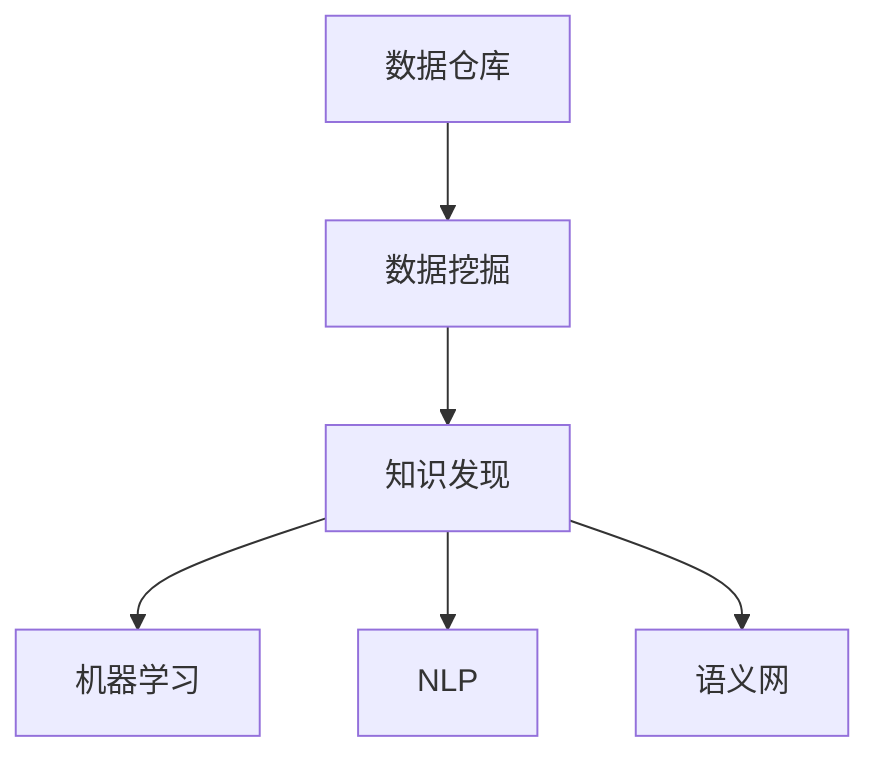

                 

# 知识发现引擎如何助力人类理解世界

## 1. 背景介绍

### 1.1 问题由来

随着数据生成速度的加快和数据量的爆炸性增长，人类面临前所未有的信息过载问题。无论是科学研究、商业决策还是日常生活中的信息筛选，都越来越依赖于有效的信息处理和知识提取技术。在此背景下，知识发现引擎应运而生，通过自动化地从大规模数据中发现和提取知识，助力人类更高效、更准确地理解世界。

### 1.2 问题核心关键点

知识发现引擎的核心目标是从海量数据中自动抽取、整合和提炼有用信息，进而形成结构化的知识库。这一过程通常涉及数据预处理、特征提取、模式识别和知识可视化等多个步骤。因此，构建一个高效、灵活且易于扩展的知识发现引擎，需要综合运用数据科学、机器学习、自然语言处理（NLP）等多领域的知识和技能。

### 1.3 问题研究意义

知识发现引擎对于提升信息获取效率、支持智能决策、驱动科学研究和推动经济社会发展具有重要意义：

1. **提高信息处理效率**：知识发现引擎能够自动分析和提炼信息，显著减少人工筛选和处理的时间成本。
2. **辅助智能决策**：通过整合多源数据和多领域知识，为决策者提供全面、客观的参考依据。
3. **促进科学研究**：自动化的知识发现过程可以帮助研究者快速定位研究方向，发现潜在的研究问题。
4. **驱动经济增长**：通过在企业、医疗、金融等领域的深入应用，知识发现引擎能够优化资源配置，提高社会生产力。
5. **促进信息透明**：通过透明的知识发现过程和结果，增强信息的公开性和可信度，推动社会公平与正义。

## 2. 核心概念与联系

### 2.1 核心概念概述

为更好地理解知识发现引擎的运作机制，本节将介绍几个核心概念及其相互之间的联系：

- **数据仓库（Data Warehouse）**：一个集成了大量结构化和半结构化数据的集中式数据存储环境，通常采用多维数据库技术支持复杂的查询和分析。
- **数据挖掘（Data Mining）**：从数据仓库中自动发现有用模式、关系和规则的过程，旨在提取潜在的知识和信息。
- **知识发现（Knowledge Discovery）**：在数据挖掘的基础上，将发现的知识整合、提炼，形成易于理解和应用的知识库。
- **机器学习（Machine Learning）**：通过算法让计算机自动学习数据中的模式和规律，实现自主决策和预测。
- **自然语言处理（NLP）**：使计算机理解和生成人类语言的技术，支持从文本数据中提取和理解知识。
- **语义网（Semantic Web）**：使用标准化的语义描述技术，将互联网上的数据集成到一个统一的框架下，便于机器理解和分析。

这些核心概念之间的逻辑关系可以通过以下Mermaid流程图来展示：



这个流程图展示了一系列关键步骤：

1. 数据仓库是知识发现的基础，存储了大量原始数据。
2. 数据挖掘通过对数据仓库中的数据进行分析，提取潜在模式和规律。
3. 知识发现将挖掘到的模式和规律提炼整合，形成结构化的知识库。
4. 机器学习和自然语言处理技术在知识发现过程中提供了强大的技术支撑。
5. 语义网技术使得知识可以被标准化的方式描述和集成，便于机器理解和分析。

## 3. 核心算法原理 & 具体操作步骤
### 3.1 算法原理概述

知识发现引擎的构建，核心在于如何将大规模数据中隐含的知识自动化地提炼和整合。这一过程通常包括以下几个步骤：

1. **数据预处理**：清洗、整合和转换原始数据，确保数据质量。
2. **特征提取**：从数据中提取有意义的特征，供后续分析使用。
3. **模式识别**：通过机器学习算法，从特征中发现数据的内在模式和规律。
4. **知识抽取**：基于模式识别结果，自动抽取和整合知识，形成知识库。
5. **知识可视化**：将知识库中的信息以直观的方式展现出来，支持进一步分析和应用。

### 3.2 算法步骤详解

知识发现引擎的核心算法步骤主要包括数据预处理、特征提取、模式识别和知识可视化。以下将详细讲解每个步骤的实现过程。

**Step 1: 数据预处理**

数据预处理是知识发现过程的第一步，目的是清洗、转换和整合原始数据，为后续分析打下基础。数据预处理通常包括以下几个步骤：

1. **数据清洗**：识别和处理缺失值、噪声和异常值，确保数据的一致性和准确性。
2. **数据转换**：将数据转换为适合分析的格式，如从文本数据转换为数值数据。
3. **数据整合**：将来自不同源的数据合并和对齐，形成一个统一的数据集。

**Step 2: 特征提取**

特征提取是从原始数据中提取有意义的特征，供后续分析使用。常见的特征提取方法包括：

1. **统计特征**：如均值、中位数、标准差等，用于描述数据的分布情况。
2. **文本特征**：如TF-IDF、词袋模型等，用于从文本数据中提取信息。
3. **时间序列特征**：如移动平均、差分等，用于处理时间序列数据。

**Step 3: 模式识别**

模式识别是利用机器学习算法，从特征中发现数据的内在模式和规律。常用的模式识别算法包括：

1. **分类算法**：如决策树、随机森林、支持向量机等，用于分类和预测。
2. **聚类算法**：如K-means、层次聚类等，用于发现数据中的自然分组。
3. **回归算法**：如线性回归、岭回归等，用于预测数值型数据。

**Step 4: 知识抽取**

知识抽取是将模式识别结果进一步提炼和整合，形成结构化的知识库。常用的知识抽取方法包括：

1. **实体抽取**：从文本中识别和抽取实体，如人名、地名、组织名等。
2. **关系抽取**：识别实体之间的关系，如“某人在某地工作”。
3. **事件抽取**：识别文本中发生的事件和事件的时间序列关系。

**Step 5: 知识可视化**

知识可视化是将知识库中的信息以直观的方式展现出来，支持进一步分析和应用。常用的知识可视化方法包括：

1. **图表展示**：如柱状图、折线图、散点图等，用于展示数据的分布和趋势。
2. **网络图**：如知识图谱、社交网络图等，用于展示实体之间的关系和网络结构。
3. **仪表盘**：如交互式仪表盘，用于实时展示和监控数据。

### 3.3 算法优缺点

知识发现引擎在信息提取和知识整合方面具有显著优势，但也存在一定的局限性：

**优点**：

1. **自动性高**：能够自动发现和提炼知识，减少了人工干预和成本。
2. **效率高**：在处理大规模数据时，比人工分析具有更高的效率。
3. **发现潜在知识**：能够发现数据中潜在的模式和规律，支持深度分析和决策。

**缺点**：

1. **数据质量依赖**：数据预处理和特征提取的准确性直接影响知识发现的效果。
2. **算法复杂度高**：常用的机器学习算法具有较高的计算复杂度，需要大量的计算资源。
3. **结果可解释性差**：知识发现的结果往往是黑盒的，难以解释其内部工作机制。
4. **领域适应性差**：通用算法可能不适用于特定领域，需要领域特定的优化。

### 3.4 算法应用领域

知识发现引擎已经广泛应用于多个领域，以下是几个典型的应用场景：

1. **科学研究**：支持论文主题、参考文献、实验结果等信息的自动发现和分析，辅助科学研究和创新。
2. **商业决策**：通过分析市场数据、客户行为、竞争态势等信息，支持企业的市场分析和决策。
3. **医疗健康**：提取和分析医疗数据中的知识，支持临床决策、疾病诊断和治疗方案优化。
4. **金融服务**：分析金融市场数据，支持投资策略、风险评估和欺诈检测。
5. **社交网络**：分析社交媒体数据，支持舆情分析、情感分析和用户行为预测。

## 4. 数学模型和公式 & 详细讲解 & 举例说明

### 4.1 数学模型构建

在知识发现引擎中，数学模型是支撑数据处理和分析的核心工具。以下是一个基于决策树的示例，说明如何构建和应用数学模型。

**数据示例**：
```
1. 性别：男
2. 年龄：25
3. 收入：5万
4. 职业：工程师
5. 购买意向：是
```

**目标**：判断该用户是否购买某产品。

**特征**：
- 性别（男女）
- 年龄（0-60岁）
- 收入（1-10万）
- 职业（工程师、教师、医生）
- 购买意向（是/否）

### 4.2 公式推导过程

假设我们构建了一个决策树，其分裂节点如下：

```
1. 性别=男：收入=5万：购买意向=是
2. 性别=女：职业=工程师：收入=5万：购买意向=是
```

**决策树算法**：

1. **选择最优特征**：选择能够最大化信息增益的特征。
2. **分裂节点**：根据特征值将数据集划分为多个子集。
3. **递归应用**：对每个子集递归应用决策树算法。
4. **生成叶子节点**：当子集无法进一步划分时，生成一个叶节点。

**信息增益公式**：

$$
Gain(D, A) = \sum_{v} \frac{|D^v|}{|D|} \cdot Ent(D^v)
$$

其中，$D$ 是样本集，$A$ 是特征，$D^v$ 是特征值为 $v$ 的样本子集，$Ent(D^v)$ 是子集 $D^v$ 的熵。

### 4.3 案例分析与讲解

以一个企业客户流失分析为例，说明知识发现引擎的应用过程：

**数据源**：企业客户历史行为数据，包括购买记录、客户反馈、服务投诉等。

**数据预处理**：
- 清洗缺失值和异常值。
- 数据转换：将文本评论转换为情感得分。
- 数据整合：将不同来源的数据合并为统一格式。

**特征提取**：
- 提取客户基本信息：如性别、年龄、职业等。
- 提取购买行为特征：如购买频率、购买金额等。
- 提取客户反馈特征：如评论情感、投诉频率等。

**模式识别**：
- 使用随机森林算法，识别出影响客户流失的关键因素。

**知识抽取**：
- 根据随机森林模型，提取和整合关键因素，形成流失预测模型。
- 生成客户流失的知识图谱，展示关键因素之间的关系。

**知识可视化**：
- 使用仪表盘展示客户流失率随时间的变化。
- 使用网络图展示关键因素之间的关系和权重。

## 5. 项目实践：代码实例和详细解释说明

### 5.1 开发环境搭建

在进行知识发现引擎的实践前，我们需要准备好开发环境。以下是使用Python进行知识发现引擎开发的环境配置流程：

1. 安装Anaconda：从官网下载并安装Anaconda，用于创建独立的Python环境。

2. 创建并激活虚拟环境：
```bash
conda create -n knowledge-discovery python=3.8 
conda activate knowledge-discovery
```

3. 安装必要的库：
```bash
conda install pandas numpy scikit-learn matplotlib seaborn plotly
```

4. 安装一些数据处理和分析库：
```bash
pip install tensorflow-gpu transformers imblearn catboost
```

5. 安装可视化库：
```bash
pip install dash plotly dask
```

完成上述步骤后，即可在`knowledge-discovery`环境中开始知识发现引擎的开发。

### 5.2 源代码详细实现

以下是一个简单的基于决策树的客户流失分析示例，展示如何使用Python实现。

```python
import pandas as pd
from sklearn.ensemble import RandomForestClassifier
from sklearn.metrics import confusion_matrix
from sklearn.model_selection import train_test_split
import matplotlib.pyplot as plt
import seaborn as sns

# 读取数据
data = pd.read_csv('customer流失数据.csv')

# 数据预处理
data.fillna(method='ffill', inplace=True)
data.drop(['customer_id'], axis=1, inplace=True)

# 特征选择
features = ['age', 'income', 'education', ' occupation', 'gender', 'purchases', 'last_purchase']
target = 'churn'

# 数据划分
train_data, test_data, train_target, test_target = train_test_split(data[features], data[target], test_size=0.3, random_state=42)

# 模型训练
model = RandomForestClassifier()
model.fit(train_data, train_target)

# 预测结果
train_pred = model.predict(train_data)
test_pred = model.predict(test_data)

# 性能评估
train_conf = confusion_matrix(train_target, train_pred)
test_conf = confusion_matrix(test_target, test_pred)
print(f"训练集混淆矩阵：{train_conf}")
print(f"测试集混淆矩阵：{test_conf}")

# 可视化
sns.heatmap(train_conf, annot=True, fmt='d', cmap='Blues', xticklabels=target, yticklabels=target)
plt.show()
sns.heatmap(test_conf, annot=True, fmt='d', cmap='Blues', xticklabels=target, yticklabels=target)
plt.show()
```

### 5.3 代码解读与分析

**数据预处理**：
- `data.fillna(method='ffill', inplace=True)`：使用前向填充法处理缺失值。
- `data.drop(['customer_id'], axis=1, inplace=True)`：删除不需要的列。

**特征选择**：
- `features = ['age', 'income', 'education', ' occupation', 'gender', 'purchases', 'last_purchase']`：选择影响流失的关键特征。

**模型训练**：
- `model = RandomForestClassifier()`：定义随机森林模型。
- `model.fit(train_data, train_target)`：训练模型。

**预测结果**：
- `train_pred = model.predict(train_data)`：训练集预测。
- `test_pred = model.predict(test_data)`：测试集预测。

**性能评估**：
- `train_conf = confusion_matrix(train_target, train_pred)`：训练集混淆矩阵。
- `test_conf = confusion_matrix(test_target, test_pred)`：测试集混淆矩阵。

**可视化**：
- `sns.heatmap(train_conf, annot=True, fmt='d', cmap='Blues', xticklabels=target, yticklabels=target)`：可视化混淆矩阵。

## 6. 实际应用场景

### 6.1 智能推荐系统

智能推荐系统通过分析用户行为数据，预测用户偏好，为用户推荐感兴趣的商品或服务。知识发现引擎在此过程中，能够自动化地发现和整合用户行为数据中的潜在模式和规律，提高推荐系统的准确性和个性化程度。

**应用场景**：
- 电商平台：推荐用户感兴趣的商品。
- 视频平台：推荐用户喜欢的视频内容。
- 社交网络：推荐用户感兴趣的朋友和话题。

**技术实现**：
- 数据预处理：清洗和整合用户行为数据。
- 特征提取：提取用户偏好特征，如浏览历史、评分、评论等。
- 模式识别：使用协同过滤、内容推荐等算法，发现用户行为中的潜在模式。
- 知识抽取：提取和整合推荐模型的关键参数和规则。
- 知识可视化：使用仪表盘展示推荐系统的性能。

### 6.2 医学研究

医学研究通过分析临床数据，发现疾病规律和治疗方法，支持临床决策和医疗创新。知识发现引擎在医学研究中，能够自动化地发现和整合临床数据中的有用知识，加速研究进程。

**应用场景**：
- 癌症研究：发现癌症的早期预警信号和治疗方法。
- 心血管疾病：分析患者数据，发现疾病发展趋势和预防措施。
- 药物开发：通过整合多源数据，发现新药物的潜在效果和副作用。

**技术实现**：
- 数据预处理：清洗和整合临床数据。
- 特征提取：提取疾病相关特征，如病历、实验室数据等。
- 模式识别：使用机器学习算法，发现疾病发展的规律和趋势。
- 知识抽取：提取和整合疾病相关的知识库，形成疾病诊疗模型。
- 知识可视化：使用知识图谱展示疾病发展的路径和关系。

### 6.3 金融风控

金融风控通过分析交易数据，识别和预防金融欺诈和风险。知识发现引擎在金融风控中，能够自动化地发现和整合交易数据中的潜在模式和规律，提升风控系统的准确性。

**应用场景**：
- 信用卡欺诈检测：识别和预防信用卡欺诈行为。
- 贷款风险评估：评估贷款申请者的信用风险。
- 股票市场分析：预测股票市场的趋势和波动。

**技术实现**：
- 数据预处理：清洗和整合交易数据。
- 特征提取：提取交易特征，如交易金额、频率、时间等。
- 模式识别：使用异常检测算法，发现异常交易行为。
- 知识抽取：提取和整合风控模型的关键参数和规则。
- 知识可视化：使用仪表盘展示风控系统的性能。

## 7. 工具和资源推荐

### 7.1 学习资源推荐

为了帮助开发者系统掌握知识发现引擎的理论基础和实践技巧，这里推荐一些优质的学习资源：

1. 《Data Science from Scratch》：由Joel Grus编写，深入浅出地介绍了数据科学的基础概念和常用技术。
2. 《Python for Data Analysis》：由Wes McKinney编写，详细介绍了使用Python进行数据处理和分析的实用技巧。
3. 《Hands-On Machine Learning with Scikit-Learn, Keras, and TensorFlow》：由Aurélien Géron编写，介绍了机器学习的基本算法和实践技巧。
4. 《Natural Language Processing with Python》：由Steven Bird、Ewan Klein和Edward Loper编写，详细介绍了使用Python进行自然语言处理的技术。
5. 《Semantic Web for the Working Ontologist》：由Raymond Naddaf编写，介绍了语义网技术的基本概念和应用。

通过对这些资源的学习实践，相信你一定能够快速掌握知识发现引擎的核心技术，并用于解决实际问题。

### 7.2 开发工具推荐

高效的开发离不开优秀的工具支持。以下是几款用于知识发现引擎开发的常用工具：

1. Jupyter Notebook：提供交互式的编程环境，支持代码块的嵌入和展示。
2. Scikit-Learn：Python机器学习库，提供各种机器学习算法和工具。
3. TensorFlow：开源机器学习框架，支持深度学习模型的构建和训练。
4. PyTorch：开源机器学习框架，提供灵活的计算图和丰富的深度学习模型。
5. Hadoop：分布式计算平台，支持大规模数据处理和分析。
6. Spark：分布式计算框架，支持大规模数据处理和分析。

合理利用这些工具，可以显著提升知识发现引擎的开发效率，加快创新迭代的步伐。

### 7.3 相关论文推荐

知识发现引擎的发展得益于学界的持续研究。以下是几篇奠基性的相关论文，推荐阅读：

1. "Knowledge Discovery in Databases: An Overview"：由Michael J. Koudas和George A. Kyriazis编写，全面介绍了知识发现的技术和应用。
2. "Data Mining Techniques for Market Basket Analysis"：由Anurag M. Agrawal、Abhi Dasgupta和Tanuj Khosla编写，介绍了数据挖掘技术在市场篮子分析中的应用。
3. "Using Association Rules for Market Basket Analysis"：由Rakesh Agrawal、Jagdish Mehrotra和David S. Umney编写，介绍了关联规则挖掘技术在市场篮子分析中的应用。
4. "Toward Knowledge Discovery in Databases"：由Jerry Kender编写，介绍了知识发现的基本概念和应用。

这些论文代表了大数据挖掘和知识发现技术的发展脉络。通过学习这些前沿成果，可以帮助研究者把握学科前进方向，激发更多的创新灵感。

## 8. 总结：未来发展趋势与挑战

### 8.1 总结

本文对知识发现引擎的理论基础和实践技术进行了全面系统的介绍。首先阐述了知识发现引擎在数据驱动决策中的重要地位和应用价值。其次，从算法原理到实际操作，详细讲解了知识发现引擎的关键步骤和实现方法，提供了完整的代码示例。同时，本文还探讨了知识发现引擎在智能推荐、医学研究、金融风控等领域的广泛应用，展示了其强大的潜力和应用前景。此外，本文精选了知识发现引擎的学习资源、开发工具和相关论文，力求为读者提供全方位的技术指引。

通过本文的系统梳理，可以看到，知识发现引擎是支撑数据驱动决策的重要技术手段，能够自动化地从海量数据中提炼和整合有用信息，助力人类更高效、更准确地理解世界。随着数据技术的不断演进，知识发现引擎必将在更多领域发挥重要作用，推动智能决策和社会进步。

### 8.2 未来发展趋势

展望未来，知识发现引擎将呈现以下几个发展趋势：

1. **自动化程度提高**：自动化数据预处理和特征提取技术将不断进步，减少人工干预和成本。
2. **模型复杂度降低**：通过更高效、更灵活的算法，降低知识发现模型的计算复杂度。
3. **多模态融合**：结合文本、图像、视频等多模态数据，提高知识发现的全面性和准确性。
4. **实时处理能力增强**：支持实时数据流的处理和分析，满足实时决策需求。
5. **分布式计算扩展**：利用分布式计算平台，处理大规模数据集，支持大范围应用。
6. **语义理解深化**：通过自然语言处理和语义网技术，提升知识的理解和应用能力。

以上趋势凸显了知识发现引擎的广阔前景。这些方向的探索发展，必将进一步提升知识发现引擎的效率和效果，为数据驱动决策提供更坚实的技术基础。

### 8.3 面临的挑战

尽管知识发现引擎已经取得了显著成就，但在迈向更加智能化、普适化应用的过程中，它仍面临诸多挑战：

1. **数据质量问题**：原始数据的噪声、缺失和不一致性，直接影响知识发现的准确性。
2. **模型可解释性不足**：许多知识发现模型往往是黑盒的，难以解释其内部工作机制和决策过程。
3. **隐私和安全风险**：知识发现过程中涉及敏感数据，如何保护数据隐私和安全是一个重要问题。
4. **跨领域应用困难**：不同领域的知识发现任务，需要特定领域的专业知识和技术支持，通用算法难以直接应用。
5. **计算资源需求高**：知识发现涉及大规模数据和复杂模型，需要高性能计算资源。

正视知识发现面临的这些挑战，积极应对并寻求突破，将使知识发现引擎迈向更加成熟和可靠。

### 8.4 研究展望

面对知识发现引擎所面临的挑战，未来的研究需要在以下几个方面寻求新的突破：

1. **数据质量增强**：引入自动化数据清洗和异常检测技术，提高原始数据的质量。
2. **模型可解释性提升**：通过可视化、符号化等方法，增强知识发现模型的可解释性和透明度。
3. **隐私和安全保障**：设计数据隐私保护算法，确保知识发现过程和结果的安全可靠。
4. **跨领域应用优化**：开发特定领域的知识发现技术，支持领域特定的应用场景。
5. **计算资源优化**：通过分布式计算、模型压缩等方法，降低知识发现算法的计算资源需求。

这些研究方向将使知识发现引擎更加适应实际应用，发挥更大的价值。面向未来，知识发现引擎的研究需要结合领域知识和应用需求，不断创新和优化，才能真正成为数据驱动决策的重要工具。

## 9. 附录：常见问题与解答

**Q1：知识发现引擎与数据挖掘有什么区别？**

A: 数据挖掘是从大量数据中发现有用模式和知识的过程，而知识发现是在数据挖掘的基础上，进一步提炼和整合知识，形成结构化的知识库。可以说，知识发现是数据挖掘的高层次应用，旨在提供更全面、更准确的知识。

**Q2：知识发现引擎如何处理数据质量问题？**

A: 知识发现引擎通常通过数据清洗和异常检测技术，处理数据质量问题。具体方法包括：
1. 数据清洗：识别和处理缺失值、噪声和异常值，确保数据的一致性和准确性。
2. 异常检测：识别数据中的异常点和异常值，剔除或修复这些异常值。

**Q3：知识发现引擎是否适用于所有领域？**

A: 知识发现引擎在大多数领域都有广泛应用，但不同领域的数据特点和应用需求不同，需要根据具体情况进行优化。例如，金融风控领域需要处理大量的交易数据，医学研究领域需要处理复杂的临床数据。因此，领域特定的优化和调整是必要的。

**Q4：知识发现引擎的计算资源需求高吗？**

A: 知识发现引擎涉及大规模数据和复杂模型，对计算资源的需求较高。但通过分布式计算、模型压缩等技术，可以在不增加成本的前提下，提升知识发现引擎的效率。同时，知识发现引擎也可以与云平台结合，利用云端的计算资源，实现高效的数据处理和分析。

**Q5：知识发现引擎的未来发展方向是什么？**

A: 知识发现引擎的未来发展方向主要包括以下几个方面：
1. 自动化和智能化：通过自动化数据预处理和特征提取，提高知识发现的效率和效果。
2. 跨领域融合：结合文本、图像、视频等多模态数据，提升知识发现的全面性和准确性。
3. 实时处理：支持实时数据流的处理和分析，满足实时决策需求。
4. 隐私保护：设计数据隐私保护算法，确保知识发现过程和结果的安全可靠。

这些方向将使知识发现引擎更加适应实际应用，发挥更大的价值。

---

作者：禅与计算机程序设计艺术 / Zen and the Art of Computer Programming

