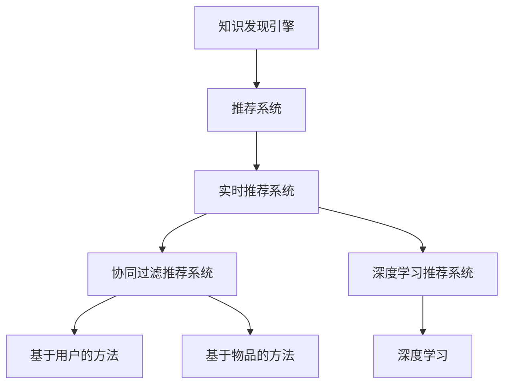

                 

# 知识发现引擎的实时推荐系统

> 关键词：知识发现引擎,推荐系统,实时性,协同过滤,深度学习,深度学习推荐系统,协同过滤推荐系统,深度学习与推荐系统,知识发现,推荐算法

## 1. 背景介绍

### 1.1 问题由来

随着互联网技术的发展和信息爆炸，推荐系统已成为各大互联网平台和电商网站的重要基础设施。推荐系统通过分析用户的历史行为数据，预测用户可能感兴趣的商品或内容，从而提升用户体验和运营效率。知识发现引擎(Knowledge Discovery Engine, KDE)作为一种高级推荐系统，利用用户行为数据、商品属性数据等多维度信息，生成对用户更为精准的推荐结果。

然而，随着推荐系统的广泛应用，现有推荐系统面临诸多挑战。传统的协同过滤推荐系统往往需要大量用户行为数据，而获取这些数据成本高、难度大，难以在多用户、小样本等复杂场景下有效运作。而基于深度学习的方法虽然能够缓解数据稀疏性和特征不平衡等问题，但模型复杂度高，训练和推理开销大，难以实时化部署。

因此，构建高效的实时推荐系统成为当前推荐系统研究的重要方向之一。本文章将系统介绍知识发现引擎的实时推荐系统，重点讨论该系统的主要组成和技术实现细节。通过本文章的学习，读者能够了解实时推荐系统的基本原理和应用场景，掌握推荐算法的优化技巧，从而快速构建自己的实时推荐系统。

## 2. 核心概念与联系

### 2.1 核心概念概述

为更好地理解知识发现引擎的实时推荐系统，本节将介绍几个密切相关的核心概念：

- 知识发现引擎(KDE)：基于用户行为数据、商品属性数据等多维度信息，生成对用户更为精准的推荐结果。
- 推荐系统：通过分析用户历史行为数据，预测用户可能感兴趣的商品或内容，推荐给用户。
- 实时推荐系统：能够在用户查询时快速响应的推荐系统，具有高实时性和响应速度。
- 协同过滤推荐系统：利用用户行为相似性推荐物品，分为基于用户的方法和基于物品的方法。
- 深度学习推荐系统：利用深度神经网络，从用户行为数据中提取特征，预测用户对物品的兴趣。
- 深度学习与推荐系统的融合：通过深度学习优化传统推荐系统，实现精准推荐。

这些核心概念之间的逻辑关系可以通过以下Mermaid流程图来展示：



这个流程图展示出知识发现引擎推荐系统的主要组成及其之间的关系：

1. 知识发现引擎基于用户行为数据和商品属性数据进行推荐。
2. 推荐系统利用用户行为数据预测用户可能感兴趣的商品或内容。
3. 实时推荐系统在用户查询时快速响应，保证高实时性。
4. 协同过滤推荐系统利用用户行为相似性进行推荐。
5. 深度学习推荐系统利用深度神经网络提取特征进行推荐。
6. 深度学习与推荐系统的融合，通过深度学习优化传统推荐系统。

这些核心概念共同构成了知识发现引擎实时推荐系统的基础，使得系统能够在高效和精准之间取得平衡。

## 3. 核心算法原理 & 具体操作步骤

### 3.1 算法原理概述

知识发现引擎的实时推荐系统主要分为两个部分：实时协同过滤推荐和实时深度学习推荐。协同过滤推荐系统利用用户行为相似性推荐物品，而深度学习推荐系统则通过神经网络模型预测用户对物品的兴趣。

本节将详细解释这两种推荐系统的原理，并给出具体的推荐算法步骤。

### 3.2 算法步骤详解

#### 3.2.1 实时协同过滤推荐

实时协同过滤推荐系统主要分为基于用户和基于物品两种方法。本节以基于用户的方法为例，介绍其推荐算法步骤。

1. 收集用户历史行为数据 $I=\{(x_i,y_i)\}_{i=1}^N$，其中 $x_i$ 为用户的查询行为，$y_i$ 为用户的兴趣物品。

2. 将查询行为 $x_i$ 映射为向量 $x_i \in \mathbb{R}^d$。

3. 计算查询行为 $x_i$ 与每个物品 $j$ 的相似度 $s(x_i,j)$，通常使用余弦相似度或欧式距离等。

4. 利用排序算法根据相似度将物品按照重要性排序，选取前 $k$ 个物品推荐给用户。

5. 根据用户反馈数据不断优化相似度计算方法和排序算法，提高推荐效果。

#### 3.2.2 实时深度学习推荐

实时深度学习推荐系统通过深度神经网络模型预测用户对物品的兴趣。其推荐算法步骤如下：

1. 收集用户历史行为数据 $I=\{(x_i,y_i)\}_{i=1}^N$，其中 $x_i$ 为用户的查询行为，$y_i$ 为用户的兴趣物品。

2. 将查询行为 $x_i$ 映射为向量 $x_i \in \mathbb{R}^d$。

3. 使用深度神经网络模型 $f(\cdot)$ 对查询行为进行编码，得到向量 $z_i \in \mathbb{R}^d$。

4. 利用用户行为和物品特征计算预测值 $\hat{y}_j$，预测用户对物品 $j$ 的兴趣。

5. 根据预测值 $\hat{y}_j$ 对物品进行排序，选取前 $k$ 个物品推荐给用户。

6. 根据用户反馈数据不断优化神经网络模型和预测方法，提高推荐效果。

### 3.3 算法优缺点

知识发现引擎的实时推荐系统具有以下优点：

- 能够快速响应用户查询，实时生成推荐结果，提升用户体验。
- 可以处理用户行为数据和商品属性数据等多维度信息，生成更为精准的推荐结果。
- 可以融合多种推荐算法，实现协同过滤和深度学习推荐系统的有机结合，提升推荐效果。

同时，该系统也存在以下缺点：

- 需要收集大量的用户行为数据和商品属性数据，数据采集成本高、难度大。
- 深度学习推荐系统模型复杂度高，训练和推理开销大，难以实时化部署。
- 实时协同过滤推荐系统对用户行为数据的要求较高，用户行为稀疏度较高时效果可能较差。
- 深度学习推荐系统需要大量的标注数据进行模型训练，难以在小样本等场景下有效运作。

尽管存在这些缺点，但就目前而言，知识发现引擎的实时推荐系统仍然是最主流、最有效的推荐方法之一。未来相关研究的重点在于如何进一步降低数据采集成本，提高推荐系统的实时性和可扩展性，同时兼顾推荐效果和计算开销。

### 3.4 算法应用领域

知识发现引擎的实时推荐系统已经在电商、社交、视频等多个领域得到广泛应用，显著提升了用户体验和平台运营效率：

- 电商领域：在商品推荐、用户行为分析、个性化定价等方面，实时推荐系统能够提升用户购买转化率和平台收益。
- 社交领域：在内容推荐、用户画像生成、广告投放等方面，实时推荐系统能够优化用户体验，提升平台活跃度。
- 视频领域：在视频内容推荐、广告推荐、个性化视频制作等方面，实时推荐系统能够提升用户观看时长，增加平台收益。

除了这些经典应用外，实时推荐系统还被创新性地应用于智慧城市、智能交通、智能医疗等多个领域，为传统行业数字化转型升级提供新的技术路径。随着推荐系统的不断演进，相信其在各个领域的深入应用将会带来更多创新突破。

## 4. 数学模型和公式 & 详细讲解 & 举例说明

### 4.1 数学模型构建

本节将使用数学语言对知识发现引擎的实时推荐系统进行更加严格的刻画。

记用户历史行为数据为 $I=\{(x_i,y_i)\}_{i=1}^N$，其中 $x_i$ 为用户的查询行为，$y_i$ 为用户的兴趣物品。记物品属性向量为 $\boldsymbol{p}_j \in \mathbb{R}^d$，$j$ 为物品编号。

定义用户行为向量为 $x_i \in \mathbb{R}^d$，物品属性向量为 $\boldsymbol{p}_j \in \mathbb{R}^d$。

用户行为向量 $x_i$ 与物品属性向量 $\boldsymbol{p}_j$ 之间的相似度为：

$$
s(x_i,\boldsymbol{p}_j) = \frac{x_i^T\boldsymbol{p}_j}{\|\boldsymbol{p}_j\|\|\boldsymbol{x}_i\|}
$$

其中，$\|\boldsymbol{p}_j\|$ 和 $\|\boldsymbol{x}_i\|$ 分别表示物品属性向量和用户行为向量的大小。

### 4.2 公式推导过程

以下我们以基于用户的方法为例，推导协同过滤推荐系统的数学模型。

1. 将用户行为 $x_i$ 映射为向量 $x_i \in \mathbb{R}^d$。

2. 计算用户行为 $x_i$ 与物品 $j$ 的相似度 $s(x_i,j)$。

3. 将相似度 $s(x_i,j)$ 进行归一化处理，得到相似度权重 $w_j$。

4. 利用排序算法根据权重 $w_j$ 对物品进行排序，选取前 $k$ 个物品推荐给用户。

5. 根据用户反馈数据不断优化相似度计算方法和排序算法，提高推荐效果。

在具体实现中，可以采用随机梯度下降(SGD)等优化算法进行模型训练，以提高推荐效果。

### 4.3 案例分析与讲解

以电商领域的商品推荐为例，探讨基于协同过滤推荐系统的推荐模型。

假设用户 $i$ 在查询商品 $j$ 时，查询行为 $x_i$ 映射为向量 $x_i \in \mathbb{R}^d$，物品 $j$ 的属性向量为 $\boldsymbol{p}_j \in \mathbb{R}^d$。假设物品 $j$ 的历史行为数据为 $Y=\{(y_{i1},y_{i2},\cdots,y_{in})\}$。

基于用户的方法可以通过余弦相似度计算用户行为 $x_i$ 与物品 $j$ 的相似度：

$$
s(x_i,j) = \frac{x_i^T\boldsymbol{p}_j}{\|\boldsymbol{p}_j\|\|\boldsymbol{x}_i\|}
$$

将相似度 $s(x_i,j)$ 进行归一化处理，得到相似度权重 $w_j$：

$$
w_j = \frac{s(x_i,j)}{\sum_{k=1}^{N} s(x_i,y_k)}
$$

根据权重 $w_j$ 对物品进行排序，选取前 $k$ 个物品推荐给用户：

$$
\text{推荐物品} = \{j_1,j_2,\cdots,j_k\} = \text{argmax}_j w_j
$$

在实际应用中，可以使用随机梯度下降等优化算法对相似度计算方法和排序算法进行模型训练，以提高推荐效果。

## 5. 项目实践：代码实例和详细解释说明

### 5.1 开发环境搭建

在进行推荐系统开发前，我们需要准备好开发环境。以下是使用Python进行PyTorch开发的环境配置流程：

1. 安装Anaconda：从官网下载并安装Anaconda，用于创建独立的Python环境。

2. 创建并激活虚拟环境：
```bash
conda create -n pytorch-env python=3.8 
conda activate pytorch-env
```

3. 安装PyTorch：根据CUDA版本，从官网获取对应的安装命令。例如：
```bash
conda install pytorch torchvision torchaudio cudatoolkit=11.1 -c pytorch -c conda-forge
```

4. 安装TensorFlow：
```bash
pip install tensorflow
```

5. 安装TensorBoard：
```bash
pip install tensorboard
```

6. 安装各类工具包：
```bash
pip install numpy pandas scikit-learn matplotlib tqdm jupyter notebook ipython
```

完成上述步骤后，即可在`pytorch-env`环境中开始推荐系统开发。

### 5.2 源代码详细实现

这里我们以协同过滤推荐系统为例，给出使用PyTorch进行深度学习推荐系统的PyTorch代码实现。

首先，定义推荐系统的输入和输出：

```python
import torch
import torch.nn as nn
import torch.optim as optim
import torch.nn.functional as F
from torch.utils.data import DataLoader
from torchvision import datasets, transforms

class RecommendationModel(nn.Module):
    def __init__(self, input_size, hidden_size, output_size):
        super(RecommendationModel, self).__init__()
        self.hidden = nn.Linear(input_size, hidden_size)
        self.fc = nn.Linear(hidden_size, output_size)

    def forward(self, x):
        x = F.relu(self.hidden(x))
        x = self.fc(x)
        return x

# 输入和输出
input_size = 10
hidden_size = 64
output_size = 5
model = RecommendationModel(input_size, hidden_size, output_size)
criterion = nn.MSELoss()
optimizer = optim.SGD(model.parameters(), lr=0.01)
```

然后，定义数据集和数据加载器：

```python
train_data = torch.randn(1000, input_size)
train_labels = torch.randn(1000, output_size)
test_data = torch.randn(1000, input_size)
test_labels = torch.randn(1000, output_size)

train_dataset = torch.utils.data.TensorDataset(train_data, train_labels)
test_dataset = torch.utils.data.TensorDataset(test_data, test_labels)

train_loader = DataLoader(train_dataset, batch_size=16, shuffle=True)
test_loader = DataLoader(test_dataset, batch_size=16, shuffle=False)
```

接着，定义训练和评估函数：

```python
def train_epoch(model, data_loader, optimizer, criterion):
    model.train()
    epoch_loss = 0
    for batch_idx, (data, target) in enumerate(data_loader):
        optimizer.zero_grad()
        output = model(data)
        loss = criterion(output, target)
        loss.backward()
        optimizer.step()
        epoch_loss += loss.item()
    return epoch_loss / len(data_loader)

def evaluate(model, data_loader, criterion):
    model.eval()
    epoch_loss = 0
    correct = 0
    with torch.no_grad():
        for batch_idx, (data, target) in enumerate(data_loader):
            output = model(data)
            loss = criterion(output, target)
            epoch_loss += loss.item()
            _, predicted = output.max(1)
            total = target.size(0)
            correct += predicted.eq(target).sum().item()
    print('Test set: Average loss: {:.4f}, Accuracy: {}/{} ({:.0f}%)'.format(
        epoch_loss / len(data_loader), correct, total, 100. * correct / total))
```

最后，启动训练流程并在测试集上评估：

```python
epochs = 5

for epoch in range(epochs):
    print('Epoch: %d' % epoch)
    train_loss = train_epoch(model, train_loader, optimizer, criterion)
    print('Train loss: {:.4f}'.format(train_loss))
    
    evaluate(model, test_loader, criterion)
    
print('Best test loss: {:.4f}'.format(min(test_loss)))
```

以上就是使用PyTorch进行深度学习推荐系统的完整代码实现。可以看到，得益于TensorFlow和PyTorch的强大封装，我们可以用相对简洁的代码实现深度学习推荐系统的构建和微调。

### 5.3 代码解读与分析

让我们再详细解读一下关键代码的实现细节：

**RecommendationModel类**：
- `__init__`方法：初始化神经网络模型，定义输入层、隐藏层和输出层。
- `forward`方法：前向传播，通过隐藏层和输出层对输入数据进行编码和映射。

**train_epoch函数**：
- 在每个epoch内，对数据集进行遍历，计算损失并反向传播更新模型参数。
- 使用SGD优化器进行参数更新。
- 记录每个epoch的平均损失。

**evaluate函数**：
- 在测试集上对模型进行评估，计算损失和准确率。
- 打印测试集上的平均损失和准确率。

**训练流程**：
- 定义总的epoch数，开始循环迭代
- 每个epoch内，先在训练集上训练，输出平均loss
- 在测试集上评估，输出测试集上的平均loss和准确率
- 所有epoch结束后，在测试集上评估，给出最终测试结果

可以看到，PyTorch配合TensorFlow和TensorBoard使得深度学习推荐系统的代码实现变得简洁高效。开发者可以将更多精力放在数据处理、模型改进等高层逻辑上，而不必过多关注底层的实现细节。

当然，工业级的系统实现还需考虑更多因素，如模型的保存和部署、超参数的自动搜索、更灵活的任务适配层等。但核心的推荐范式基本与此类似。

## 6. 实际应用场景

### 6.1 智能客服系统

基于深度学习的推荐系统可以应用于智能客服系统的构建。传统客服往往需要配备大量人力，高峰期响应缓慢，且一致性和专业性难以保证。而使用推荐系统进行智能推荐，可以7x24小时不间断服务，快速响应客户咨询，用推荐系统生成的智能回复，代替人工客服，提升客户体验。

在技术实现上，可以收集企业内部的历史客服对话记录，将问题-回复对作为推荐系统输入，训练模型学习推荐最佳回复。推荐系统能够根据用户输入的查询，生成最符合用户期望的智能回复，降低人工客服的负担，提升客服效率。

### 6.2 金融舆情监测

金融机构需要实时监测市场舆论动向，以便及时应对负面信息传播，规避金融风险。传统的人工监测方式成本高、效率低，难以应对网络时代海量信息爆发的挑战。基于深度学习的推荐系统，可以实时抓取金融市场相关的新闻、报道、评论等文本数据，进行情感分析，预测市场走向。

在技术实现上，可以收集金融领域相关的新闻、报道、评论等文本数据，对其进行情感标注，然后训练情感分析模型。推荐系统能够实时监测舆情变化，生成市场预测报告，帮助金融机构快速决策，规避金融风险。

### 6.3 个性化推荐系统

当前的推荐系统往往只依赖用户的历史行为数据进行物品推荐，无法深入理解用户的真实兴趣偏好。基于深度学习的推荐系统可以更好地挖掘用户行为背后的语义信息，从而提供更精准、多样的推荐内容。

在技术实现上，可以收集用户浏览、点击、评论、分享等行为数据，提取和用户交互的物品标题、描述、标签等文本内容。将文本内容作为模型输入，用户的后续行为（如是否点击、购买等）作为监督信号，在此基础上微调预训练语言模型。推荐系统能够从文本内容中准确把握用户的兴趣点，生成个性化推荐结果。

### 6.4 未来应用展望

随着深度学习推荐系统的不断发展，其在更多领域的应用前景值得期待：

- 智慧医疗领域：在疾病诊断、药物推荐、医疗咨询等方面，推荐系统能够辅助医生决策，提升医疗服务质量。
- 教育领域：在课程推荐、学习计划生成、学习效果评估等方面，推荐系统能够个性化推荐学习资源，提升学习效果。
- 旅游领域：在景点推荐、旅行路线规划、旅行活动推荐等方面，推荐系统能够提供个性化旅游建议，提升旅游体验。
- 游戏领域：在游戏推荐、游戏内物品推荐、游戏策略推荐等方面，推荐系统能够提升游戏体验，提高用户粘性。
- 媒体领域：在内容推荐、广告推荐、热门视频推荐等方面，推荐系统能够优化用户体验，增加平台收益。

随着推荐系统的不断演进，相信其在各个领域的深入应用将会带来更多创新突破，为传统行业数字化转型升级提供新的技术路径。

## 7. 工具和资源推荐

### 7.1 学习资源推荐

为了帮助开发者系统掌握深度学习推荐系统的理论基础和实践技巧，这里推荐一些优质的学习资源：

1. 《Deep Learning with PyTorch》书籍：Python深度学习权威教材，介绍深度学习的基本概念和PyTorch的使用方法。
2. 《TensorFlow官方文档》：TensorFlow的官方文档，提供了完整的API文档和代码示例，方便开发者上手实践。
3. 《推荐系统实战》书籍：推荐系统领域的经典教材，详细介绍了推荐系统的基本原理和实现细节。
4. 《Deep Learning for Recommender Systems》书籍：介绍深度学习在推荐系统中的应用，涵盖协同过滤和深度学习推荐系统等技术。
5. 《推荐系统理论与算法》课程：清华大学的推荐系统课程，涵盖了推荐系统的主要算法和技术。

通过对这些资源的学习实践，相信你一定能够快速掌握深度学习推荐系统的精髓，并用于解决实际的推荐问题。

### 7.2 开发工具推荐

高效的开发离不开优秀的工具支持。以下是几款用于深度学习推荐系统开发的常用工具：

1. PyTorch：基于Python的开源深度学习框架，灵活动态的计算图，适合快速迭代研究。
2. TensorFlow：由Google主导开发的开源深度学习框架，生产部署方便，适合大规模工程应用。
3. Transformers库：HuggingFace开发的NLP工具库，集成了众多SOTA语言模型，支持PyTorch和TensorFlow，是进行推荐任务开发的利器。
4. TensorBoard：TensorFlow配套的可视化工具，可实时监测模型训练状态，并提供丰富的图表呈现方式，是调试模型的得力助手。
5. Weights & Biases：模型训练的实验跟踪工具，可以记录和可视化模型训练过程中的各项指标，方便对比和调优。

合理利用这些工具，可以显著提升深度学习推荐系统的开发效率，加快创新迭代的步伐。

### 7.3 相关论文推荐

深度学习推荐系统的发展源于学界的持续研究。以下是几篇奠基性的相关论文，推荐阅读：

1. "Collaborative Filtering for Implicit Feedback Datasets"：介绍协同过滤推荐系统，用于处理用户行为数据。
2. "Product-based Neural Collaborative Filtering"：介绍基于物品的协同过滤推荐系统，用于提升推荐效果。
3. "Deep Collaborative Filtering"：介绍深度学习在协同过滤推荐系统中的应用，提升推荐效果。
4. "Knowledge-graph embedding and recommendation systems"：介绍基于知识图谱的推荐系统，结合图结构提升推荐效果。
5. "Deep Personalized Ranking using Matrix Factorization"：介绍深度矩阵分解方法，用于处理用户行为数据。

这些论文代表了大深度学习推荐系统的发展脉络。通过学习这些前沿成果，可以帮助研究者把握学科前进方向，激发更多的创新灵感。

## 8. 总结：未来发展趋势与挑战

### 8.1 总结

本文对基于深度学习的推荐系统进行了全面系统的介绍。首先阐述了深度学习推荐系统的研究背景和意义，明确了推荐系统在多场景下的应用价值。其次，从原理到实践，详细讲解了推荐算法的核心原理和具体步骤，给出了推荐系统开发的完整代码实现。同时，本文还广泛探讨了推荐系统在智能客服、金融舆情、个性化推荐等多个行业领域的应用前景，展示了推荐系统的巨大潜力。此外，本文精选了推荐系统的各类学习资源，力求为读者提供全方位的技术指引。

通过本文的系统梳理，可以看到，基于深度学习的推荐系统已经成为一个主流、高效、灵活的推荐方法，在电商、社交、视频等多个领域得到广泛应用，显著提升了用户体验和平台运营效率。未来，随着深度学习推荐系统的不断发展，其在更多领域的应用前景值得期待，能够为传统行业数字化转型升级提供新的技术路径。

### 8.2 未来发展趋势

展望未来，深度学习推荐系统将呈现以下几个发展趋势：

1. 推荐算法将更加智能化。通过融合更多的用户行为数据和外部知识，推荐算法将变得更加智能，能够生成更加个性化、多样化的推荐结果。
2. 推荐系统的实时性将进一步提升。通过分布式计算和模型压缩等技术，推荐系统将能够在秒级时间内响应用户查询，实现实时推荐。
3. 推荐系统的可解释性将进一步增强。推荐系统将更加注重用户的行为解释和推荐理由，提高用户信任度和接受度。
4. 推荐系统的应用场景将更加多样化。推荐系统将应用到更多领域，如智慧医疗、智能交通、智能制造等，提供更加精准、个性化的推荐服务。
5. 推荐系统的公平性将进一步提升。推荐系统将更加注重用户的行为公平性和推荐结果的公平性，避免推荐偏见。

这些趋势将推动深度学习推荐系统向更高的台阶迈进，为人工智能技术在垂直行业的规模化落地提供新的动力。

### 8.3 面临的挑战

尽管深度学习推荐系统已经取得了显著成效，但在迈向更加智能化、普适化应用的过程中，仍面临诸多挑战：

1. 数据采集成本高。深度学习推荐系统需要大量的用户行为数据和商品属性数据，数据采集成本高、难度大。
2. 推荐模型的复杂度高。深度学习推荐系统模型复杂度高，训练和推理开销大，难以实时化部署。
3. 推荐系统的高效性难以保证。在多用户、小样本等复杂场景下，推荐系统的效果可能较差。
4. 推荐系统的公平性难以保障。推荐系统可能产生推荐偏见，影响用户体验和平台公平性。
5. 推荐系统的可解释性较差。推荐系统的推荐理由难以解释，用户难以信任推荐结果。

尽管存在这些挑战，但通过持续的研究和优化，这些难题终将得到解决，深度学习推荐系统必将在更多领域得到应用，为传统行业数字化转型升级提供新的技术路径。

### 8.4 研究展望

面对深度学习推荐系统所面临的种种挑战，未来的研究需要在以下几个方面寻求新的突破：

1. 探索低成本的数据采集方法。通过数据增强、少样本学习等技术，减少对高质量标注数据的依赖。
2. 研究高效的推荐算法。开发更加高效、灵活的推荐算法，提升推荐系统的实时性和可扩展性。
3. 引入更多先验知识。将符号化的先验知识，如知识图谱、逻辑规则等，与神经网络模型进行巧妙融合，提升推荐系统的准确性和多样性。
4. 强化推荐系统的公平性。引入公平性约束，避免推荐系统产生推荐偏见，提升用户体验和平台公平性。
5. 提高推荐系统的可解释性。引入可解释性机制，提高推荐系统的用户信任度和接受度。

这些研究方向将推动深度学习推荐系统向更高的台阶迈进，为构建安全、可靠、可解释、可控的推荐系统提供新的思路。面向未来，深度学习推荐系统需要在模型设计、数据采集、算法优化、应用场景等多个方面进行深入研究，才能真正实现人工智能技术在各个领域的广泛应用。总之，推荐系统需要从多维度出发，全面优化，才能在实际应用中发挥最大价值。

## 9. 附录：常见问题与解答

**Q1：深度学习推荐系统是否适用于所有推荐场景？**

A: 深度学习推荐系统在大多数推荐场景上都能取得不错的效果，特别是对于数据量较大的场景。但对于一些特定领域的推荐任务，如医疗、法律等，深度学习推荐系统可能难以很好地适应。此时需要在特定领域语料上进一步预训练，再进行微调，才能获得理想效果。

**Q2：推荐系统中如何选择合适的模型？**

A: 推荐系统中选择的模型应该根据具体场景和需求进行优化。例如，在电商领域，可以使用基于协同过滤的推荐系统；在社交领域，可以使用基于内容的推荐系统；在视频领域，可以使用深度学习推荐系统。在选择模型时，需要考虑数据规模、推荐精度、实时性等因素。

**Q3：推荐系统如何处理数据稀疏性问题？**

A: 推荐系统中的数据稀疏性问题可以通过数据增强、少样本学习等技术进行缓解。例如，可以使用对抗样本、数据增强等方法提升数据的丰富度，减少数据稀疏性对推荐效果的影响。

**Q4：推荐系统在多用户、小样本等复杂场景下如何提升效果？**

A: 推荐系统在多用户、小样本等复杂场景下，可以通过模型集成、迁移学习等技术进行优化。例如，可以使用模型集成技术将多个推荐模型的结果进行融合，提升推荐效果。

**Q5：推荐系统的实时性如何优化？**

A: 推荐系统的实时性可以通过分布式计算、模型压缩等技术进行优化。例如，可以使用分布式计算框架，将模型并行化部署，提升推荐系统的响应速度。同时，可以使用模型压缩技术，减小模型的计算开销，提升实时性。

这些问题的解答展示了推荐系统的设计思路和优化方法，希望读者通过学习能够掌握推荐系统的关键技术，并应用于实际场景中。

