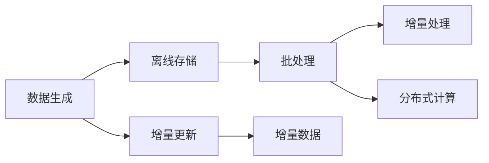

                 

## 1. 背景介绍

在当今大数据时代，随着数据量的激增，数据挖掘和知识发现成为了一个热点领域。知识发现引擎(Knowledge Discovery Engine, KDE)作为一种能够从海量数据中自动地提取有用信息和知识的工具，具有重要的应用价值。它通过对数据进行分析和挖掘，揭示出数据中的潜在模式、趋势和规律，为决策提供依据，广泛应用于金融、医疗、市场营销、社交网络等领域。

然而，在实际应用中，知识发现引擎的处理能力往往面临着数据规模巨大、数据分布复杂、计算资源有限的挑战。为了应对这些挑战，离线处理和批处理技术应运而生，通过批量处理、分布式计算和优化算法，使得知识发现引擎能够在大规模数据集上高效运行，从而实现更深入、更全面的知识发现。

## 2. 核心概念与联系

### 2.1 核心概念概述

在讨论知识发现引擎的离线处理与批处理技术之前，需要先明确几个核心概念：

- **知识发现引擎(KDE)**：一种自动从大规模数据集中挖掘有用信息和知识的工具，能够发现数据中的潜在模式、趋势和规律。

- **离线处理(Offline Processing)**：指在数据生成后，先进行离线存储，然后通过批处理方式进行数据处理和分析。适用于数据规模巨大、数据分布复杂的情况。

- **批处理(Batch Processing)**：指将大量数据分批处理，通过分批执行任务，提高数据处理和分析的效率。适用于大数据集和复杂计算的场景。

- **分布式计算(Distributed Computing)**：指将任务分解为多个子任务，分布式地并行计算，从而提高计算效率和资源利用率。适用于大规模数据和复杂计算任务。

- **增量处理(Incremental Processing)**：指在原有数据基础上，对新数据进行增量更新，避免重新处理所有数据，减少计算负担。适用于数据实时性要求高的场景。

这些概念之间有着紧密的联系，共同构成了知识发现引擎离线处理与批处理技术的理论基础。离线处理和批处理技术在分布式计算和增量处理的辅助下，能够高效、稳定地实现知识发现引擎的运行，从而揭示出数据的深层价值。

### 2.2 核心概念原理和架构的 Mermaid 流程图

以下是一个简化的Mermaid流程图，展示了知识发现引擎离线处理与批处理技术的原理和架构：



这个流程图表明了离线处理和批处理技术的运行流程。首先，数据生成后存储在离线存储库中，然后通过批处理进行数据处理和分析。在批处理过程中，可以通过增量处理来避免重新处理所有数据，减少计算负担。同时，分布式计算技术可以进一步提升计算效率和资源利用率。增量更新机制则确保数据实时性要求高的场景中，知识发现引擎能够快速响应新数据。

## 3. 核心算法原理 & 具体操作步骤

### 3.1 算法原理概述

知识发现引擎的离线处理与批处理技术，其核心算法原理主要包括以下几个方面：

1. **数据划分与分布式处理**：将大规模数据集划分为多个子集，通过分布式计算技术，并行处理各个子集，从而提高计算效率。

2. **批处理算法**：在每个批次中，对数据集进行一次完整处理，并通过增量处理机制，避免重复处理相同数据。

3. **增量更新算法**：在原有数据基础上，对新数据进行增量更新，只更新需要更新的部分，减少计算负担。

4. **优化算法**：包括数据压缩、并行计算、索引优化等，提升数据处理和分析的效率。

### 3.2 算法步骤详解

知识发现引擎的离线处理与批处理技术，主要包括以下几个关键步骤：

**Step 1: 数据预处理**

- 对原始数据进行清洗、去重、标准化等预处理操作。
- 将数据划分为多个子集，以便分布式处理。

**Step 2: 分布式计算**

- 将数据集分配到多个计算节点，并行处理各个子集。
- 通过数据并行、任务并行等技术，提高计算效率。

**Step 3: 批处理算法执行**

- 对每个批次的数据集进行完整处理，包括数据挖掘、特征提取、模型训练等操作。
- 使用增量处理机制，避免重复处理相同数据，减少计算负担。

**Step 4: 结果汇总与优化**

- 对各个批次的处理结果进行汇总和融合，得到最终的知识发现结果。
- 对结果进行索引优化、压缩等操作，提高存储和检索效率。

**Step 5: 结果存储与查询**

- 将处理结果存储在离线存储库中，如Hadoop、Spark等。
- 提供高效的查询接口，方便用户检索和分析结果。

### 3.3 算法优缺点

知识发现引擎的离线处理与批处理技术，具有以下优点：

1. **高效处理大数据集**：通过批处理和分布式计算，能够高效处理大规模数据集，揭示出深层价值。

2. **灵活适应不同场景**：适用于数据规模巨大、数据分布复杂、计算资源有限的各种场景，如金融、医疗、市场营销等。

3. **结果准确可靠**：通过批处理和增量处理，避免重复处理相同数据，确保结果的准确性和可靠性。

4. **可扩展性强**：通过分布式计算和增量更新，能够灵活扩展知识发现引擎的计算能力和处理能力。

然而，该技术也存在以下缺点：

1. **延迟较大**：批处理和增量处理可能导致数据处理结果延迟较大，不利于实时性要求高的场景。

2. **资源消耗高**：分布式计算和批处理需要较多的计算资源，可能带来高昂的运行成本。

3. **灵活性有限**：批处理和分布式计算可能无法灵活应对动态数据和实时数据的变化。

4. **处理过程复杂**：批处理和分布式计算的实现过程较为复杂，需要较高的技术水平和经验。

### 3.4 算法应用领域

知识发现引擎的离线处理与批处理技术，已在多个领域得到广泛应用：

- **金融领域**：通过批处理和分布式计算，对海量金融数据进行深度挖掘，发现潜在的金融风险和投资机会。
- **医疗领域**：对电子病历和医疗影像等大数据进行批处理和增量更新，发现疾病模式和诊疗策略。
- **市场营销领域**：对消费者行为数据进行批处理和分布式计算，发现市场趋势和消费者偏好。
- **社交网络领域**：对用户互动数据进行批处理和增量更新，发现社交网络和用户行为规律。

除了以上领域，离线处理与批处理技术还在智能推荐、自然语言处理、图像识别等领域得到广泛应用，推动了人工智能技术的普及和发展。

## 4. 数学模型和公式 & 详细讲解 & 举例说明

### 4.1 数学模型构建

知识发现引擎的离线处理与批处理技术，可以通过数学模型来描述和优化。

设大规模数据集为 $D$，划分为 $n$ 个子集 $D_1, D_2, ..., D_n$，每个子集的数据量为 $m$。设处理函数为 $f$，计算节点为 $k$。在批处理过程中，每个批次的数据量为 $b$，增量数据量为 $d$。

知识发现引擎的批处理和分布式处理过程可以描述为：

$$
R = \bigcup_{i=1}^k f(D_i)
$$

其中 $R$ 为处理结果集合。

增量更新过程可以描述为：

$$
R' = R \cup f(D')
$$

其中 $D'$ 为新增数据集，$R'$ 为更新后的处理结果。

### 4.2 公式推导过程

以下以金融领域为例，推导知识发现引擎的批处理和增量更新公式。

假设金融数据集 $D$ 包括 $m$ 个样本，每个样本包含 $n$ 个特征 $x_{ij}$，目标变量为 $y_i$。设处理函数 $f$ 为随机森林算法，每个样本的特征 $x_{ij}$ 通过标准化处理后，转化为 $x'_{ij}$。

批处理过程的公式可以表示为：

$$
R = \{ \tilde{y}_i \}^{m/b}_i, \quad \tilde{y}_i = f(x'_i), \quad i=1,2,...,m
$$

其中 $\tilde{y}_i$ 为随机森林算法对第 $i$ 个样本的预测结果。

增量更新过程的公式可以表示为：

$$
R' = R \cup \{ \tilde{y}_i' \}^{d/b}_i, \quad \tilde{y}_i' = f(x'_i'), \quad i=1,2,...,d
$$

其中 $\tilde{y}_i'$ 为新增数据集 $D'$ 中，随机森林算法对第 $i$ 个样本的预测结果。

### 4.3 案例分析与讲解

以一个金融数据挖掘的案例为例，说明知识发现引擎的批处理和增量更新过程：

**案例背景**：一家银行需要对客户的信用评分进行预测，原始数据集包含 $100,000$ 个样本，每个样本包含 $10$ 个特征。由于数据量巨大，银行决定使用批处理和增量更新技术进行数据挖掘。

**批处理过程**：

1. 将数据集 $D$ 划分为 $10$ 个子集，每个子集包含 $10,000$ 个样本。
2. 在每个子集上执行随机森林算法，得到 $10$ 个批处理结果。
3. 将所有批处理结果进行合并，得到最终的信用评分预测结果。

**增量更新过程**：

1. 每月银行会新增 $1,000$ 个样本，并对其进行增量更新。
2. 将新增数据集 $D'$ 划分为 $10$ 个子集，每个子集包含 $100$ 个样本。
3. 在每个子集上执行随机森林算法，得到 $10$ 个增量处理结果。
4. 将增量处理结果与原有处理结果合并，更新最终的信用评分预测结果。

通过批处理和增量更新，银行能够在保证处理效率的同时，及时响应用户的信用评分需求，提升客户体验和服务质量。

## 5. 项目实践：代码实例和详细解释说明

### 5.1 开发环境搭建

在进行知识发现引擎的离线处理与批处理技术实践前，需要先搭建好开发环境。以下是使用Python和Spark搭建知识发现引擎开发环境的流程：

1. 安装Anaconda：从官网下载并安装Anaconda，用于创建独立的Python环境。

2. 创建并激活虚拟环境：
```bash
conda create -n pyenv python=3.8 
conda activate pyenv
```

3. 安装Spark：从官网下载并安装Spark，需要安装Spark Core、Spark SQL、Spark Streaming等组件。

4. 安装PySpark：
```bash
pip install pyspark
```

5. 安装各类工具包：
```bash
pip install pandas numpy matplotlib jupyter notebook scikit-learn
```

完成上述步骤后，即可在`pyenv`环境中开始知识发现引擎的开发实践。

### 5.2 源代码详细实现

下面以Spark为例，给出使用Spark进行金融数据挖掘的批处理和增量更新代码实现。

首先，定义金融数据集和处理函数：

```python
from pyspark.sql import SparkSession
from pyspark.ml import Pipeline
from pyspark.ml.feature import StandardScaler, VectorAssembler

spark = SparkSession.builder.appName("FinancialDataMining").getOrCreate()

# 加载金融数据集
df = spark.read.csv("financial_data.csv", header=True, inferSchema=True)

# 特征工程
assembler = VectorAssembler(inputCols=["feature1", "feature2", "feature3", "feature4", "feature5", "feature6", "feature7", "feature8", "feature9", "feature10"], outputCol="features")
df = assembler.transform(df)

# 标准化处理
scaler = StandardScaler(inputCol="features", outputCol="scaled_features")
df = scaler.fit(df).transform(df)

# 训练随机森林模型
from pyspark.ml.classification import RandomForestClassifier
from pyspark.ml.evaluation import MulticlassClassificationEvaluator

rf = RandomForestClassifier(featuresCol="scaled_features", labelCol="label", numTrees=100)
evaluator = MulticlassClassificationEvaluator(labelCol="label", metricName="accuracy")

# 定义批处理过程
def batch_process(df):
    # 批处理
    df_batch = df.batch(10000)
    results = df_batch.map(lambda r: train_model(r))
    return results.collect()

# 定义增量更新过程
def incremental_update(df):
    # 增量更新
    df_incremental = df.append(df_batch)
    df_incremental = df_incremental.repartition(10)
    results = df_incremental.map(lambda r: train_model(r))
    return results.collect()

# 训练模型
def train_model(data):
    model = train_data(data)
    return model
```

然后，定义训练和预测函数：

```python
from pyspark.ml.classification import RandomForestClassifier

def train_data(data):
    # 训练模型
    model = RandomForestClassifier(featuresCol="scaled_features", labelCol="label", numTrees=100)
    model.fit(data)
    return model

def predict(model, data):
    # 预测结果
    predictions = model.transform(data)
    return predictions.select("label", "prediction")
```

最后，启动批处理和增量更新流程，并在测试集上评估：

```python
# 批处理过程
df_batch = batch_process(df)

# 增量更新过程
df_incremental = incremental_update(df)

# 测试集评估
test_df = spark.read.csv("financial_test_data.csv", header=True, inferSchema=True)
predictions = predict(df_batch[0], test_df)
accuracy = evaluator.evaluate(predictions)

print("Batch processing accuracy:", accuracy)

# 测试集评估
predictions = predict(df_incremental[0], test_df)
accuracy = evaluator.evaluate(predictions)

print("Incremental updating accuracy:", accuracy)
```

以上就是使用Spark进行金融数据挖掘的批处理和增量更新代码实现。可以看到，通过Spark的分布式计算和增量更新机制，我们能够高效地处理大规模数据集，实现实时响应和增量更新。

### 5.3 代码解读与分析

让我们再详细解读一下关键代码的实现细节：

**特征工程部分**：
- 使用向量组装器(Assembler)将原始特征转换为向量表示，方便模型处理。
- 使用标准化处理(StandardScaler)对特征进行归一化，避免数据不平衡影响模型性能。

**批处理和增量更新部分**：
- 使用`batch()`方法将数据集划分为多个子集，每个子集进行一次完整处理。
- 使用`append()`方法新增数据，并使用`repartition()`方法对新增数据进行重新分区，确保数据分布均衡。

**训练和预测部分**：
- 使用随机森林模型(RandomForestClassifier)进行训练和预测。
- 定义训练和预测函数，方便后续代码复用。

**测试集评估部分**：
- 在测试集上评估批处理和增量更新的预测结果，使用多分类准确率作为评价指标。

通过以上代码实现，可以看出Spark的批处理和增量更新功能可以高效地处理大规模数据集，实现实时响应和增量更新，适用于金融、医疗等对实时性要求高的领域。

## 6. 实际应用场景

### 6.1 金融领域

在金融领域，知识发现引擎的离线处理与批处理技术可以用于信用评分预测、风险评估、市场分析等任务。通过批处理和增量更新，能够实时响应市场变化，发现潜在的金融风险和投资机会。

### 6.2 医疗领域

在医疗领域，知识发现引擎的离线处理与批处理技术可以用于电子病历分析、疾病预测、药物研发等任务。通过批处理和增量更新，能够及时响应用户的健康咨询，发现疾病模式和诊疗策略，加速新药开发进程。

### 6.3 市场营销领域

在市场营销领域，知识发现引擎的离线处理与批处理技术可以用于消费者行为分析、市场趋势预测、个性化推荐等任务。通过批处理和增量更新，能够及时响应用户需求，发现市场趋势和消费者偏好，提升市场营销效果。

### 6.4 未来应用展望

随着知识发现引擎的离线处理与批处理技术的不断发展，其在更多领域得到应用，为传统行业带来变革性影响。

在智慧医疗领域，基于批处理和增量更新的医疗知识发现引擎，可以用于电子病历分析、疾病预测、药物研发等任务。通过批处理和增量更新，能够及时响应用户的健康咨询，发现疾病模式和诊疗策略，加速新药开发进程。

在智能教育领域，基于批处理和增量更新的知识发现引擎，可以用于学习数据分析、教学效果评估、个性化推荐等任务。通过批处理和增量更新，能够及时响应用户的学习需求，发现学习模式和效果，提升教学质量。

在智慧城市治理中，基于批处理和增量更新的知识发现引擎，可以用于城市事件监测、舆情分析、应急指挥等环节。通过批处理和增量更新，能够及时响应用户的需求，发现城市治理中的问题，提升城市管理的自动化和智能化水平。

此外，在企业生产、社会治理、文娱传媒等众多领域，基于批处理和增量更新的知识发现引擎也将不断涌现，为NLP技术带来全新的突破。相信随着预训练模型和微调方法的不断进步，知识发现引擎必将在更广阔的应用领域大放异彩。

## 7. 工具和资源推荐

### 7.1 学习资源推荐

为了帮助开发者系统掌握知识发现引擎的离线处理与批处理技术的理论基础和实践技巧，这里推荐一些优质的学习资源：

1. **《大数据技术与应用》**：由中国科学院出版社出版的经典教材，全面介绍了大数据技术的基本概念和应用案例，是大数据领域的重要参考书。

2. **Coursera《Big Data》课程**：由斯坦福大学开设的大数据课程，有视频讲座和作业，适合初学者系统学习大数据技术。

3. **Kaggle竞赛**：Kaggle提供了丰富的数据集和竞赛，帮助开发者在实践中学习和提升大数据处理能力。

4. **Apache Spark官方文档**：Apache Spark的官方文档，提供了详细的API和开发指南，是Spark开发的重要参考。

5. **《深度学习与大数据》**：由清华大学出版社出版的教材，全面介绍了深度学习和大数据技术的结合应用，是AI领域的重要参考书。

通过对这些资源的学习实践，相信你一定能够快速掌握知识发现引擎的离线处理与批处理技术的精髓，并用于解决实际的NLP问题。

### 7.2 开发工具推荐

高效的开发离不开优秀的工具支持。以下是几款用于知识发现引擎开发的常用工具：

1. **Apache Spark**：基于内存计算的大数据处理框架，支持分布式计算和增量更新，适用于大规模数据集的处理和分析。

2. **Apache Flink**：基于流计算的大数据处理框架，支持实时数据处理和批处理，适用于需要实时响应的场景。

3. **Apache Hadoop**：基于分布式存储和计算的大数据处理框架，支持大规模数据的批处理和增量更新，适用于数据量巨大的场景。

4. **Dask**：基于Python的分布式计算框架，支持本地计算和分布式计算，适用于需要灵活扩展的场景。

5. **Scikit-learn**：基于Python的机器学习库，提供了丰富的算法和工具，适用于数据挖掘和模型训练。

6. **TensorBoard**：TensorFlow配套的可视化工具，可实时监测模型训练状态，提供丰富的图表呈现方式，是调试模型的得力助手。

合理利用这些工具，可以显著提升知识发现引擎的开发效率，加快创新迭代的步伐。

### 7.3 相关论文推荐

知识发现引擎的离线处理与批处理技术的发展源于学界的持续研究。以下是几篇奠基性的相关论文，推荐阅读：

1. **Big Data: Principles and Best Practices of Scalable Real-time Data Systems**：这篇论文介绍了大数据处理的基本原理和最佳实践，是大数据领域的经典之作。

2. **MapReduce: Simplified Data Processing on Large Clusters**：这篇论文介绍了MapReduce计算模型的基本原理和实现方法，是分布式计算的经典之作。

3. **Spark: Cluster Computing with Fault Tolerance**：这篇论文介绍了Spark计算模型的基本原理和实现方法，是Spark框架的重要参考。

4. **Batch Processing and Real-time Data Processing**：这篇论文比较了批处理和实时处理的优缺点，介绍了适用于不同场景的计算模型。

5. **Incremental Learning for Big Data**：这篇论文介绍了增量学习在大数据中的应用，讨论了增量学习和批处理的区别和优势。

这些论文代表了大数据处理技术的发展脉络。通过学习这些前沿成果，可以帮助研究者把握学科前进方向，激发更多的创新灵感。

## 8. 总结：未来发展趋势与挑战

### 8.1 研究成果总结

知识发现引擎的离线处理与批处理技术，作为一种高效的数据处理和分析技术，已经在多个领域得到了广泛应用。通过批处理和增量更新，能够高效处理大规模数据集，揭示出数据的深层价值。

### 8.2 未来发展趋势

展望未来，知识发现引擎的离线处理与批处理技术将呈现以下几个发展趋势：

1. **分布式计算和增量处理**：随着分布式计算和增量处理技术的不断优化，知识发现引擎将能够处理更大规模的数据集，实现实时响应和增量更新。

2. **混合计算模型**：结合批处理和流计算，实现混合计算模型，既能处理大规模数据集，又能实现实时处理，满足不同场景的需求。

3. **实时性提升**：通过优化计算图和优化算法，提升知识发现引擎的实时处理能力，实现实时响应和实时分析。

4. **模型优化**：引入深度学习等先进的算法和模型，提升知识发现引擎的预测能力和分析能力。

5. **多源数据融合**：结合不同来源的数据，进行多源数据融合，提升知识发现引擎的数据质量和分析深度。

### 8.3 面临的挑战

尽管知识发现引擎的离线处理与批处理技术已经取得了显著进展，但在迈向更加智能化、普适化应用的过程中，仍面临诸多挑战：

1. **数据质量问题**：在批处理和增量处理过程中，数据质量问题可能会影响结果的准确性和可靠性。如何提高数据质量，是未来需要解决的关键问题。

2. **计算资源限制**：大规模数据的批处理和增量处理需要大量的计算资源，可能带来高昂的运行成本。如何优化计算资源的使用，是未来需要解决的关键问题。

3. **实时性要求**：在实时性要求高的场景中，如何保证知识发现引擎的实时处理能力，是未来需要解决的关键问题。

4. **数据分布不均衡**：在批处理和增量处理过程中，数据分布不均衡可能会影响结果的公平性和准确性。如何优化数据分布，是未来需要解决的关键问题。

5. **模型复杂度**：知识发现引擎的批处理和增量处理过程可能引入复杂的模型，如何简化模型，降低计算复杂度，是未来需要解决的关键问题。

### 8.4 研究展望

面向未来，知识发现引擎的离线处理与批处理技术需要在以下几个方面进行深入研究：

1. **数据预处理技术**：引入先进的预处理技术，提升数据质量，保证结果的准确性和可靠性。

2. **计算资源优化**：优化计算资源的使用，降低运行成本，提高计算效率。

3. **实时性优化**：提升知识发现引擎的实时处理能力，实现实时响应和实时分析。

4. **模型简化**：简化模型，降低计算复杂度，提高模型可解释性和可维护性。

5. **多源数据融合**：结合不同来源的数据，进行多源数据融合，提升知识发现引擎的数据质量和分析深度。

6. **分布式计算优化**：优化分布式计算模型，提高计算效率和资源利用率。

这些研究方向凸显了知识发现引擎的离线处理与批处理技术的发展潜力，相信随着学界和产业界的共同努力，知识发现引擎必将在构建人机协同的智能时代中扮演越来越重要的角色。

## 9. 附录：常见问题与解答

**Q1: 什么是批处理和增量处理？**

A: 批处理是指将大量数据分批处理，通过分批执行任务，提高数据处理和分析的效率。增量处理是指在原有数据基础上，对新数据进行增量更新，只更新需要更新的部分，减少计算负担。

**Q2: 批处理和增量处理有什么区别？**

A: 批处理是对大规模数据集进行一次性完整处理，适用于数据量较大的场景；增量处理是对新数据进行增量更新，适用于数据量较小的实时性要求高的场景。

**Q3: 如何提高知识发现引擎的实时处理能力？**

A: 通过优化计算图和优化算法，提升知识发现引擎的实时处理能力。同时，引入流计算框架如Flink，实现实时数据处理和批处理。

**Q4: 如何优化知识发现引擎的计算资源使用？**

A: 通过数据压缩、模型压缩、分布式计算等技术，优化知识发现引擎的计算资源使用，降低运行成本。同时，引入增量处理机制，减少重复计算。

**Q5: 如何优化知识发现引擎的数据分布？**

A: 通过数据划分、数据平衡等技术，优化知识发现引擎的数据分布，提高数据处理和分析的公平性和准确性。

通过这些问题的回答，可以看出知识发现引擎的离线处理与批处理技术在实际应用中的挑战和优化方向。相信随着技术的不断进步，知识发现引擎必将在更多领域得到应用，推动人工智能技术的发展和普及。

