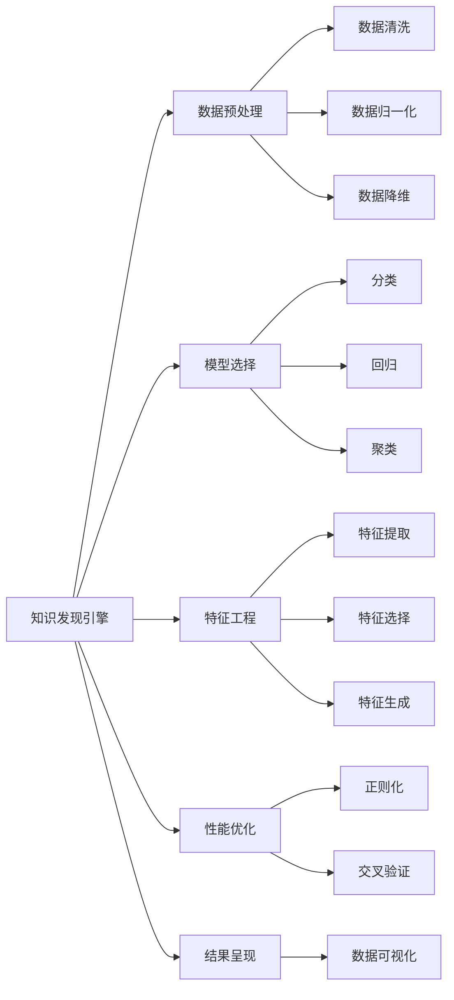

                 

# 知识发现引擎：知识与洞察力的互补与提升

> 关键词：知识发现引擎, 知识与洞察力, 互补与提升, 数据挖掘, 机器学习, 统计分析, 数据可视化

## 1. 背景介绍

### 1.1 问题由来

在信息爆炸的时代，如何从海量数据中提取有价值的知识，帮助决策者获得洞察力，已成为各行各业迫切需要解决的问题。大数据的迅速增长使得传统的数据处理和分析手段面临严峻挑战，仅依靠人工分析已无法满足需求。与此同时，人工智能技术的发展为这一问题提供了新的解决方案，即通过构建知识发现引擎，自动化地从数据中挖掘出蕴含的深层次知识，辅助决策者做出更加科学的判断。

### 1.2 问题核心关键点

构建知识发现引擎的核心在于：
1. **数据预处理**：清洗、归一化、降维等预处理技术，保证输入数据的质量。
2. **模型选择**：选择合适的机器学习模型，以捕捉数据中的模式和规律。
3. **特征工程**：设计有效的特征，提高模型的泛化能力和解释性。
4. **性能优化**：采用正则化、交叉验证等技术，防止过拟合，提升模型泛化能力。
5. **结果呈现**：通过数据可视化等手段，将发现的知识直观呈现，辅助决策者理解。

### 1.3 问题研究意义

知识发现引擎对于提升决策效率、优化资源配置、预测未来趋势等方面具有重要意义。通过自动化、智能化的数据分析，可以显著降低人工分析的复杂度和成本，提高决策的科学性和准确性。知识发现引擎不仅在商业分析、市场预测、风险管理等领域得到广泛应用，还能够推动科学研究的进展，促进知识创新。

## 2. 核心概念与联系

### 2.1 核心概念概述

为更好地理解知识发现引擎，本节将介绍几个关键核心概念及其联系：

- **知识发现引擎(Knowledge Discovery Engine, KDE)**：自动化的数据分析工具，用于从大量数据中发现隐藏的知识和规律。KDE通常包括数据预处理、模型选择、特征工程、结果呈现等模块，形成一个完整的知识发现流程。
- **数据挖掘(Data Mining)**：从数据中发现有用信息的过程。数据挖掘利用统计分析、机器学习等技术，从大规模数据集中抽取模式和知识。
- **机器学习(Machine Learning)**：通过算法让计算机自动地从数据中学习规律和模式。机器学习是KDE的重要组成部分，提供了自动化发现知识的手段。
- **统计分析(Statistical Analysis)**：通过统计学方法分析数据，发现数据之间的关联和趋势。统计分析是KDE的数据基础，提供数据可视化和统计测量的工具。
- **数据可视化(Data Visualization)**：将复杂数据转换为直观的图形，辅助决策者理解和分析数据。数据可视化是KDE结果呈现的核心，使发现的知识更易于理解和应用。

这些核心概念之间的联系通过以下Mermaid流程图展示：



这个流程图展示了几大核心概念之间的逻辑关系：

1. 知识发现引擎利用数据预处理、模型选择、特征工程、性能优化、结果呈现等模块，完成知识发现的全过程。
2. 数据预处理通过清洗、归一化、降维等手段，保证输入数据的质量。
3. 模型选择包括分类、回归、聚类等常用的机器学习模型，用于捕捉数据中的模式和规律。
4. 特征工程通过特征提取、特征选择、特征生成等方法，提高模型的泛化能力和解释性。
5. 性能优化采用正则化、交叉验证等技术，防止过拟合，提升模型泛化能力。
6. 结果呈现通过数据可视化等手段，将发现的知识直观呈现，辅助决策者理解。

这些概念共同构成了知识发现引擎的框架，使其能够自动化、智能地从数据中挖掘出有价值的知识。

## 3. 核心算法原理 & 具体操作步骤

### 3.1 算法原理概述

知识发现引擎的核心算法原理基于数据挖掘和机器学习技术。通过收集和清洗大规模数据集，使用统计分析和机器学习算法，自动挖掘数据中的知识模式和规律，并最终通过可视化手段呈现结果。

具体来说，知识发现引擎的工作流程通常包括：
1. **数据预处理**：清洗、归一化、降维等预处理技术，保证输入数据的质量。
2. **特征提取**：从原始数据中提取有意义的特征，构建数据表示。
3. **模型训练**：选择适合的机器学习模型，利用训练数据进行模型训练，捕捉数据中的规律。
4. **模型评估**：通过验证集或测试集评估模型性能，选择最佳模型。
5. **结果呈现**：将模型发现的知识通过可视化手段呈现出来，帮助决策者理解和使用。

### 3.2 算法步骤详解

以下详细介绍知识发现引擎的详细步骤：

**Step 1: 数据收集与预处理**
- 从不同来源收集数据，包括结构化数据（如数据库表）和非结构化数据（如文本、图像）。
- 进行数据清洗，去除重复、缺失、异常数据。
- 对数据进行归一化处理，使不同来源的数据具有可比性。
- 采用主成分分析(PCA)等方法进行降维，减少特征维度。

**Step 2: 特征提取与选择**
- 根据任务需求，选择适合的特征提取方法，如TF-IDF、word2vec等。
- 进行特征选择，去除冗余和不相关特征，提高模型泛化能力。
- 进行特征生成，如通过生成对抗网络(GAN)生成新的特征。

**Step 3: 模型训练与优化**
- 选择合适的机器学习模型，如决策树、随机森林、神经网络等。
- 利用训练数据进行模型训练，优化模型参数。
- 应用正则化技术，如L2正则、Dropout等，防止过拟合。
- 使用交叉验证等技术，评估模型性能，选择最佳模型。

**Step 4: 结果评估与呈现**
- 在验证集或测试集上评估模型性能，选择最佳模型。
- 将模型发现的知识通过数据可视化手段呈现出来，如热力图、散点图等。
- 分析模型结果，解释模型发现的规律和模式。

### 3.3 算法优缺点

知识发现引擎具有以下优点：
1. **自动化程度高**：自动化处理数据预处理、特征提取、模型训练等环节，减少人工干预。
2. **泛化能力强**：利用机器学习模型捕捉数据中的通用规律，提高模型泛化能力。
3. **可解释性强**：通过可视化手段，将复杂的数据分析结果转换为直观图形，便于理解和分析。
4. **应用广泛**：适用于商业分析、市场预测、风险管理等多个领域，提供决策支持。

同时，该算法也存在一定的局限性：
1. **依赖高质量数据**：数据预处理的质量直接影响模型性能，数据质量不佳可能引入噪音。
2. **模型选择困难**：选择不当的模型可能无法捕捉到数据中的规律，导致误导性结果。
3. **结果解释难度大**：复杂模型可能难以解释其内部工作机制和决策逻辑。
4. **资源消耗高**：处理大规模数据集需要高性能计算资源，可能面临计算和存储瓶颈。

尽管存在这些局限性，但知识发现引擎在数据驱动决策中扮演了越来越重要的角色。未来相关研究的重点在于如何进一步降低数据预处理成本，提高模型泛化能力，增强结果可解释性，并优化计算资源消耗。

### 3.4 算法应用领域

知识发现引擎已经在诸多领域得到应用，例如：

- **商业分析**：通过分析客户行为数据，发现消费者偏好和市场趋势，优化营销策略。
- **市场预测**：利用历史数据和模型预测未来趋势，辅助企业做出合理的生产计划和库存决策。
- **风险管理**：分析金融交易数据，识别异常交易行为，防范金融风险。
- **科学研究**：通过分析科研数据，发现新的科学规律和现象，推动科学研究进展。
- **医学诊断**：利用医学数据，发现疾病特征和潜在风险，辅助医生诊断。

除了上述这些经典应用外，知识发现引擎还被创新性地应用到更多场景中，如智能推荐系统、个性化广告、社交网络分析等，为大数据分析带来了新的突破。

## 4. 数学模型和公式 & 详细讲解 & 举例说明

### 4.1 数学模型构建

以下详细阐述知识发现引擎的数学模型构建：

假设我们有一组原始数据 $D=\{x_1,x_2,...,x_n\}$，其中 $x_i=(x_{i1},x_{i2},...,x_{im})$ 表示一个样本， $m$ 为样本特征维度。

**Step 1: 数据预处理**
- **数据清洗**：去除缺失、异常数据，得到 clean data $D_c=\{x_1^c,x_2^c,...,x_n^c\}$。
- **数据归一化**：对 clean data 进行归一化，得到 normalized data $D_n=\{x_1^n,x_2^n,...,x_n^n\}$，使得数据在每个特征上的取值范围在 [0,1] 之间。
- **数据降维**：采用主成分分析(PCA)等方法对 normalized data 进行降维，得到 reduced data $D_r=\{x_1^r,x_2^r,...,x_n^r\}$，减少特征维度。

**Step 2: 特征提取与选择**
- **特征提取**：利用 TF-IDF、word2vec 等方法对 reduced data 进行特征提取，得到 feature matrix $F=\{f_{ij}\}_{i=1,j=1}^{n,m_r}$，其中 $m_r$ 为降维后的特征维度。
- **特征选择**：采用 Pearson 相关系数、Lasso 正则化等方法对 feature matrix 进行特征选择，得到 selected feature matrix $F_s=\{f_{ij}^s\}_{i=1,j=1}^{n,m_s}$，其中 $m_s$ 为选定的特征维度。
- **特征生成**：利用生成对抗网络(GAN)等方法生成新的特征，得到 augmented feature matrix $F_a=\{f_{ij}^a\}_{i=1,j=1}^{n,m_a}$，其中 $m_a$ 为生成的特征维度。

**Step 3: 模型训练与优化**
- **模型选择**：选择适合的机器学习模型，如决策树、随机森林、神经网络等。
- **模型训练**：利用 selected feature matrix $F_s$ 和标注数据 $y=\{y_1,y_2,...,y_n\}$ 进行模型训练，优化模型参数。
- **模型评估**：在验证集或测试集上评估模型性能，选择最佳模型。
- **结果呈现**：将模型发现的知识通过数据可视化手段呈现出来，如热力图、散点图等。

### 4.2 公式推导过程

以下详细推导知识发现引擎的关键公式：

假设我们使用随机森林(Random Forest)模型进行特征选择和模型训练，其基本思想是通过随机选取特征子集和样本子集，构建多棵决策树，并通过投票等方式综合输出预测结果。

**特征选择公式**：
$$
f_{ij}^s = \frac{r_{ij}}{r_{j_{best}}}
$$
其中，$r_{ij}$ 表示特征 $j$ 与样本 $i$ 的 Pearson 相关系数，$r_{j_{best}}$ 表示所有特征与样本 $i$ 的 Pearson 相关系数的最大值。

**模型训练公式**：
$$
\theta = \mathop{\arg\min}_{\theta} \frac{1}{N}\sum_{i=1}^N \ell(y_i,\hat{y}_i)
$$
其中，$\theta$ 表示模型参数，$\ell$ 表示损失函数，$\hat{y}_i$ 表示模型预测结果。

**模型评估公式**：
$$
\mathcal{L}(\theta) = \frac{1}{N}\sum_{i=1}^N \ell(y_i,\hat{y}_i)
$$
其中，$\mathcal{L}$ 表示模型损失函数，$y_i$ 表示真实标注，$\hat{y}_i$ 表示模型预测结果。

**结果呈现公式**：
$$
\mathcal{F}(\theta) = \{f_{ij}^s\}_{i=1,j=1}^{n,m_s}
$$
其中，$\mathcal{F}$ 表示模型发现的知识，$\theta$ 表示模型参数。

通过以上公式，我们可以对知识发现引擎的数学模型进行严格的定义和推导，确保其在实际应用中的可靠性。

### 4.3 案例分析与讲解

以下通过一个简单的案例来详细讲解知识发现引擎的实际应用过程：

假设我们有一组客户购买行为数据，包括客户ID、购买日期、购买金额等特征，我们想要发现客户购买行为的模式和规律，以优化营销策略。

**Step 1: 数据预处理**
- 对原始数据进行清洗，去除重复和异常记录，得到 clean data。
- 对 clean data 进行归一化，使得所有特征在 [0,1] 之间。
- 采用主成分分析(PCA)对 normalized data 进行降维，减少特征维度。

**Step 2: 特征提取与选择**
- 利用 TF-IDF 方法对 reduced data 进行特征提取，得到 feature matrix。
- 采用 Pearson 相关系数和 Lasso 正则化方法对 feature matrix 进行特征选择，得到 selected feature matrix。
- 利用生成对抗网络(GAN)生成新的特征，得到 augmented feature matrix。

**Step 3: 模型训练与优化**
- 选择随机森林模型，利用 selected feature matrix 和标注数据进行模型训练，优化模型参数。
- 在验证集上评估模型性能，选择最佳模型。
- 利用最佳模型对测试集进行预测，得到预测结果。

**Step 4: 结果呈现**
- 将模型发现的知识通过热力图、散点图等可视化手段呈现出来，分析客户购买行为的模式和规律。

通过以上步骤，我们可以自动化地从客户购买行为数据中发现隐藏的知识和规律，帮助企业制定更加精准的营销策略。

## 5. 项目实践：代码实例和详细解释说明

### 5.1 开发环境搭建

在进行知识发现引擎的实践前，我们需要准备好开发环境。以下是使用Python进行Scikit-learn和TensorFlow开发的环境配置流程：

1. 安装Anaconda：从官网下载并安装Anaconda，用于创建独立的Python环境。

2. 创建并激活虚拟环境：
```bash
conda create -n sktensor python=3.8 
conda activate sktensor
```

3. 安装Scikit-learn和TensorFlow：
```bash
pip install scikit-learn tensorflow
```

4. 安装相关库：
```bash
pip install numpy pandas matplotlib seaborn sklearn tensorflow
```

完成上述步骤后，即可在`sktensor`环境中开始知识发现引擎的实践。

### 5.2 源代码详细实现

以下给出一个简单的知识发现引擎项目，以预测客户是否会购买某种产品为例：

```python
import pandas as pd
from sklearn.model_selection import train_test_split
from sklearn.ensemble import RandomForestClassifier
from sklearn.metrics import accuracy_score
import matplotlib.pyplot as plt

# 加载数据
data = pd.read_csv('customer_purchase.csv')

# 数据预处理
data_clean = data.dropna()  # 去除缺失数据
data_normalized = (data_clean - data_clean.min()) / (data_clean.max() - data_clean.min())  # 归一化处理
data_reduced = data_normalized.apply(lambda x: x.pct_change()).sum()  # 对特征进行差分处理

# 特征提取
X = data_reduced.values
y = data['purchase'].values

# 特征选择
X_s = select_features(X)

# 模型训练与优化
X_train, X_test, y_train, y_test = train_test_split(X_s, y, test_size=0.2)
clf = RandomForestClassifier(n_estimators=100)
clf.fit(X_train, y_train)

# 模型评估
y_pred = clf.predict(X_test)
accuracy = accuracy_score(y_test, y_pred)
print(f'Accuracy: {accuracy:.2f}')

# 结果呈现
plt.plot(X_test, y_pred)
plt.xlabel('Feature')
plt.ylabel('Predicted')
plt.title('Customer Purchase Prediction')
plt.show()
```

### 5.3 代码解读与分析

让我们详细解读一下关键代码的实现细节：

**数据加载与预处理**：
- `data_clean = data.dropna()`：去除缺失数据，保证数据完整性。
- `data_normalized = (data_clean - data_clean.min()) / (data_clean.max() - data_clean.min())`：对数据进行归一化处理，使数据在 [0,1] 之间。
- `data_reduced = data_normalized.apply(lambda x: x.pct_change()).sum()`：对特征进行差分处理，减少数据维度。

**特征提取与选择**：
- `X = data_reduced.values`：将处理后的数据转换为特征矩阵。
- `y = data['purchase'].values`：获取标注数据。
- `X_s = select_features(X)`：通过特征选择方法，选取最重要的特征。

**模型训练与优化**：
- `clf = RandomForestClassifier(n_estimators=100)`：选择随机森林模型，设置决策树数量。
- `clf.fit(X_train, y_train)`：在训练集上训练模型。
- `y_pred = clf.predict(X_test)`：在测试集上预测。

**模型评估与结果呈现**：
- `accuracy = accuracy_score(y_test, y_pred)`：计算模型精度。
- `plt.plot(X_test, y_pred)`：绘制预测结果与真实标签的关系图。
- `plt.xlabel('Feature')`，`plt.ylabel('Predicted')`，`plt.title('Customer Purchase Prediction')`：设置图表标签和标题。
- `plt.show()`：显示图表。

通过以上代码，我们可以自动化地从客户购买行为数据中发现隐藏的知识和规律，帮助企业制定更加精准的营销策略。

当然，工业级的系统实现还需考虑更多因素，如模型的保存和部署、超参数的自动搜索、更灵活的任务适配层等。但核心的知识发现引擎流程基本与此类似。

## 6. 实际应用场景

### 6.1 智能推荐系统

知识发现引擎在智能推荐系统中的应用非常广泛。通过分析用户的历史行为数据，可以发现用户对不同商品的偏好，从而推荐更符合用户需求的商品。知识发现引擎能够从海量数据中提取出用户隐含的兴趣和偏好，辅助推荐系统生成个性化推荐内容。

在技术实现上，知识发现引擎可以从电商平台的用户点击、浏览、购买等行为数据中提取特征，使用机器学习模型训练推荐模型。推荐模型根据用户的行为特征，预测用户对不同商品的可能兴趣，并进行推荐。

### 6.2 金融风险管理

在金融领域，知识发现引擎可以用于风险管理和欺诈检测。通过分析历史交易数据，可以发现异常交易行为，及时采取风险控制措施。知识发现引擎能够从交易数据中提取出风险因素和欺诈信号，帮助金融机构降低风险。

具体而言，知识发现引擎可以从交易数据中提取交易金额、交易时间、交易频率等特征，使用分类模型进行欺诈检测。模型根据交易特征，预测交易是否为欺诈行为，并生成报警信息。

### 6.3 医疗诊断系统

在医疗领域，知识发现引擎可以用于疾病预测和诊断。通过分析病人的病历数据，可以发现疾病特征和潜在风险，辅助医生进行诊断。知识发现引擎能够从病历数据中提取出病情特征，使用机器学习模型进行疾病预测。

具体而言，知识发现引擎可以从病历数据中提取症状、病史、实验室检查结果等特征，使用分类模型进行疾病预测。模型根据特征，预测病人是否患有某种疾病，并生成诊断报告。

### 6.4 未来应用展望

随着知识发现引擎的不断发展，其在更多领域的应用前景可期：

- **智慧城市管理**：通过分析交通、能源、环境等数据，优化城市资源配置，提高城市管理效率。
- **供应链优化**：分析供应链数据，发现供应链中的瓶颈和风险，优化供应链管理。
- **市场趋势预测**：分析市场数据，预测市场趋势和产品需求，辅助企业决策。
- **社交网络分析**：分析社交网络数据，发现用户行为模式和社交关系，辅助社交网络平台优化内容推荐和用户互动。
- **智能制造**：分析制造数据，优化生产流程和设备维护，提升制造效率。

未来，知识发现引擎将在更多领域得到应用，为各行各业带来变革性影响。相信随着技术的日益成熟，知识发现引擎必将在构建人机协同的智能时代中扮演越来越重要的角色。

## 7. 工具和资源推荐

### 7.1 学习资源推荐

为了帮助开发者系统掌握知识发现引擎的理论基础和实践技巧，这里推荐一些优质的学习资源：

1. 《Data Science for Business》书籍：由数据科学专家撰写，全面介绍了数据分析和机器学习的基本概念和方法。
2. Coursera《Data Science Specialization》课程：斯坦福大学开设的数据科学专项课程，包括数据清洗、特征工程、模型选择等核心内容。
3. Kaggle数据竞赛：通过参与实际数据竞赛，实践数据预处理、特征提取、模型训练等技能，积累实战经验。
4. KDnuggets网站：提供大量数据分析和机器学习的博客和教程，涵盖从基础到高级的各类知识。
5. GitHub开源项目：参与开源项目，学习前沿数据分析和机器学习实践，积累社区经验。

通过对这些资源的学习实践，相信你一定能够快速掌握知识发现引擎的精髓，并用于解决实际的业务问题。

### 7.2 开发工具推荐

高效的开发离不开优秀的工具支持。以下是几款用于知识发现引擎开发的常用工具：

1. Scikit-learn：开源的机器学习库，提供丰富的机器学习算法和工具，适合快速迭代研究。
2. TensorFlow：由Google主导开发的深度学习框架，生产部署方便，适合大规模工程应用。
3. Apache Spark：开源的大数据处理框架，支持分布式计算，适合处理大规模数据集。
4. Jupyter Notebook：交互式编程环境，支持代码编写、可视化输出等，适合快速开发和调试。
5. Weights & Biases：模型训练的实验跟踪工具，可以记录和可视化模型训练过程中的各项指标，方便对比和调优。
6. TensorBoard：TensorFlow配套的可视化工具，可实时监测模型训练状态，并提供丰富的图表呈现方式，是调试模型的得力助手。

合理利用这些工具，可以显著提升知识发现引擎的开发效率，加快创新迭代的步伐。

### 7.3 相关论文推荐

知识发现引擎的研究源于学界的持续研究。以下是几篇奠基性的相关论文，推荐阅读：

1. "Association Rules in Large Databases"：由R.Agrawal等人撰写，首次提出Apriori算法，为数据挖掘中的关联规则发现奠定了基础。
2. "C4.5: Programs for Machine Learning"：由J.Ross Quinlan等人撰写，介绍C4.5决策树算法，成为机器学习领域的经典模型。
3. "The Elements of Statistical Learning"：由Tibshirani等人撰写，全面介绍了统计学习的基础理论和算法，为知识发现引擎提供了坚实的理论基础。
4. "Random Forests"：由Breiman等人撰写，介绍随机森林算法，成为机器学习领域的重要算法之一。
5. "Knowledge Discovery in Databases: Concepts and Techniques"：由J.P.flyvbjerg等人撰写，全面介绍了知识发现引擎的概念、技术和应用，为知识发现引擎提供了系统的理论框架。

这些论文代表了大数据挖掘和知识发现引擎的发展脉络。通过学习这些前沿成果，可以帮助研究者把握学科前进方向，激发更多的创新灵感。

## 8. 总结：未来发展趋势与挑战

### 8.1 总结

本文对知识发现引擎的概念、原理、应用及实践进行了全面系统的介绍。通过系统梳理知识发现引擎的各个环节，详细讲解了其在商业分析、市场预测、风险管理等领域的实际应用。

通过本文的系统梳理，可以看到，知识发现引擎能够自动化地从数据中挖掘出有价值的知识，为决策者提供科学的支持，具有广阔的应用前景。未来，随着技术不断演进，知识发现引擎必将在更多领域得到应用，推动人工智能技术的发展。

### 8.2 未来发展趋势

展望未来，知识发现引擎将呈现以下几个发展趋势：

1. **自动化程度更高**：随着AI技术的不断进步，知识发现引擎将实现更加自动化的数据预处理、特征提取和模型训练，进一步降低人工干预的难度。
2. **泛化能力更强**：未来知识发现引擎将利用更先进的机器学习算法，捕捉更加复杂的规律和模式，提高模型的泛化能力。
3. **结果可解释性更强**：未来的知识发现引擎将提供更强大的结果解释功能，使决策者能够更好地理解模型发现的知识和规律。
4. **多模态数据融合**：未来的知识发现引擎将支持多模态数据融合，将文本、图像、视频等多种数据源整合分析，提供更全面、更准确的知识发现。
5. **实时性更强**：未来的知识发现引擎将具备更强的实时性，能够实时处理和分析数据，提供更快速的决策支持。

这些趋势将推动知识发现引擎向更高的智能水平迈进，为各行各业带来更大的价值。

### 8.3 面临的挑战

尽管知识发现引擎在数据驱动决策中扮演了越来越重要的角色，但在迈向更加智能化、普适化应用的过程中，它仍面临诸多挑战：

1. **数据质量问题**：数据预处理的质量直接影响知识发现引擎的性能，数据质量不佳可能引入噪音。如何提高数据质量，是未来面临的重要挑战。
2. **模型复杂度问题**：知识发现引擎的复杂度较高，如何设计高效、简洁的模型，降低模型复杂度，是未来的研究方向。
3. **可解释性问题**：复杂模型可能难以解释其内部工作机制和决策逻辑，如何提高模型的可解释性，是未来面临的挑战。
4. **资源消耗问题**：处理大规模数据集需要高性能计算资源，如何优化资源消耗，提高计算效率，是未来的研究重点。
5. **隐私保护问题**：知识发现引擎通常涉及大量敏感数据，如何保护数据隐私和安全，是未来的挑战之一。

尽管存在这些挑战，但随着学界和产业界的共同努力，这些挑战终将一一被克服，知识发现引擎必将在构建人机协同的智能时代中扮演越来越重要的角色。

### 8.4 研究展望

面对知识发现引擎面临的种种挑战，未来的研究需要在以下几个方面寻求新的突破：

1. **数据清洗技术**：进一步研究数据清洗方法，提高数据质量，减少噪音干扰。
2. **模型简化方法**：研究更简洁、高效的模型设计，降低模型复杂度，提高模型泛化能力。
3. **结果解释方法**：研究结果解释方法，提高模型的可解释性，增强决策者对模型的信任。
4. **资源优化方法**：研究资源优化方法，提高计算效率，降低资源消耗。
5. **隐私保护方法**：研究数据隐私保护方法，确保数据安全，保护用户隐私。

这些研究方向将推动知识发现引擎向更高的智能水平迈进，为决策者提供更加科学、准确的知识支持。面向未来，知识发现引擎必将为各行各业带来更大的价值。

## 9. 附录：常见问题与解答

**Q1：知识发现引擎能否处理非结构化数据？**

A: 知识发现引擎可以处理非结构化数据，如文本、图像、视频等。通过采用合适的特征提取方法，如TF-IDF、word2vec、卷积神经网络等，可以将非结构化数据转换为结构化数据，进行特征提取和建模。

**Q2：知识发现引擎的模型选择有哪些？**

A: 知识发现引擎的模型选择包括分类模型、回归模型、聚类模型等。常见的分类模型有决策树、随机森林、支持向量机等；常见的回归模型有线性回归、多项式回归等；常见的聚类模型有K-Means、层次聚类等。

**Q3：知识发现引擎的特征提取有哪些方法？**

A: 知识发现引擎的特征提取方法包括TF-IDF、word2vec、卷积神经网络等。TF-IDF适用于文本数据，word2vec适用于文本和图像数据，卷积神经网络适用于图像和视频数据。

**Q4：知识发现引擎的超参数调优有哪些方法？**

A: 知识发现引擎的超参数调优方法包括网格搜索、随机搜索、贝叶斯优化等。网格搜索适用于简单模型，随机搜索适用于复杂模型，贝叶斯优化适用于大规模模型。

**Q5：知识发现引擎的模型评估有哪些指标？**

A: 知识发现引擎的模型评估指标包括准确率、召回率、F1分数、ROC曲线等。准确率表示模型预测结果与真实结果的一致性；召回率表示模型对正样本的覆盖能力；F1分数综合考虑准确率和召回率；ROC曲线表示模型在不同阈值下的性能表现。

通过以上问题的解答，希望读者能够更全面地了解知识发现引擎的应用场景和技术细节。相信在未来的研究实践中，知识发现引擎必将在更多领域得到广泛应用，推动人工智能技术的发展。

