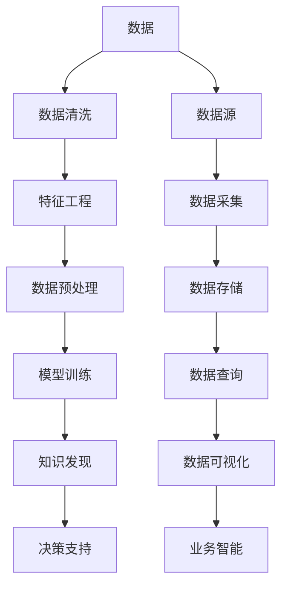

                 

# 知识发现引擎：知识与洞察力的完美结合体

> 关键词：知识发现, 数据挖掘, 人工智能, 机器学习, 深度学习, 自然语言处理

## 1. 背景介绍

### 1.1 问题由来
在现代社会，数据无处不在。从互联网到物联网，从社交媒体到金融交易，数据已成为推动经济和社会发展的关键资源。然而，面对海量数据，如何从中提取有价值的信息和知识，成为当前数据科学领域的核心挑战。

为了解决这一问题，人们提出了多种数据挖掘和知识发现技术。其中，知识发现引擎（Knowledge Discovery Engine, KDE）因其强大的数据处理能力和智能分析能力，成为许多企业选择的数据挖掘工具。KDE集成了先进的机器学习和深度学习算法，能够自动发现数据中的隐含规律和潜在的知识，辅助决策者进行科学决策。

### 1.2 问题核心关键点
知识发现引擎的核心在于其高效的数据处理能力、智能化的分析算法以及良好的可扩展性。以下是知识发现引擎的主要特征：

1. **高效数据处理能力**：KDE能够高效地处理大规模数据集，利用分布式计算、内存计算等技术，提升数据处理效率。
2. **智能化分析算法**：KDE内置了多种机器学习算法，如分类、聚类、关联规则挖掘、时序分析等，能够从数据中挖掘出有价值的模式和规律。
3. **可扩展性**：KDE支持多维度、多源数据输入，能够轻松应对复杂的业务场景和不断变化的业务需求。
4. **可视化展示**：KDE提供了丰富的可视化工具，能够以图表、仪表盘等方式直观展示分析结果，便于决策者理解和应用。

这些特征使得KDE在企业数据挖掘和商业智能（Business Intelligence, BI）领域得到广泛应用，成为企业数字化转型和智能化升级的重要工具。

### 1.3 问题研究意义
研究知识发现引擎，对于拓展数据科学的应用范围，提升企业的数据处理能力，加速智能化进程，具有重要意义：

1. **提升决策科学性**：通过自动发现数据中的潜在知识和规律，辅助决策者进行更科学、合理的决策。
2. **优化资源配置**：通过数据分析，识别业务瓶颈和改进空间，优化资源配置，提升企业运营效率。
3. **推动商业智能发展**：知识发现引擎是BI系统的重要组成部分，能够为企业提供精准的商业洞察和预测分析，推动企业智能化发展。
4. **增强客户体验**：通过深度学习和大数据技术，KDE能够分析客户行为和需求，提供个性化的服务和产品推荐，提升客户满意度和忠诚度。
5. **降低运营成本**：自动化、智能化分析能够减少人工干预和错误，降低运营成本，提升企业竞争力。

## 2. 核心概念与联系

### 2.1 核心概念概述

为更好地理解知识发现引擎的工作原理和架构，本节将介绍几个密切相关的核心概念：

- **知识发现(Knowledge Discovery)**：从大规模数据中自动提取有价值的模式、规律和知识，辅助决策者进行科学决策。
- **数据挖掘(Data Mining)**：利用统计学、机器学习等技术，从数据中挖掘出潜在信息和规律。
- **人工智能(Artificial Intelligence, AI)**：通过模拟人类智能行为，实现自动化决策和智能化操作。
- **机器学习(Machine Learning, ML)**：利用算法和模型，从数据中学习规律并进行预测和决策。
- **深度学习(Deep Learning, DL)**：利用神经网络等技术，从数据中提取高级特征和规律。
- **自然语言处理(Natural Language Processing, NLP)**：使计算机能够理解和处理自然语言，实现语言与机器的交互。

这些概念之间的逻辑关系可以通过以下Mermaid流程图来展示：



这个流程图展示知识发现引擎的核心概念及其之间的关系：

1. 数据源输入：收集各类数据，存储在数据仓库中。
2. 数据采集：对数据进行清洗、去重和标准化处理，以提升数据质量。
3. 特征工程：提取和构造特征，将数据转化为机器学习模型可用的格式。
4. 模型训练：利用机器学习或深度学习模型，从数据中学习规律和模式。
5. 知识发现：自动发现数据中的潜在知识和规律。
6. 决策支持：基于知识发现的结果，辅助决策者进行决策。

这些概念共同构成了知识发现引擎的核心工作流程，使得企业能够高效地利用数据，提升业务智能水平。

## 3. 核心算法原理 & 具体操作步骤
### 3.1 算法原理概述

知识发现引擎的核心算法主要基于机器学习和深度学习技术，用于从数据中自动提取和挖掘知识。其核心思想是利用统计学和算法技术，从大规模数据中发现潜在的模式和规律，辅助决策者进行科学决策。

具体来说，知识发现引擎通常包括以下几个步骤：

1. **数据采集和预处理**：收集企业内部的业务数据，对数据进行清洗、去重、标准化处理，以提升数据质量。
2. **特征工程**：提取和构造特征，将数据转化为机器学习模型可用的格式。
3. **模型训练**：利用机器学习或深度学习模型，从数据中学习规律和模式。
4. **知识发现**：自动发现数据中的潜在知识和规律。
5. **决策支持**：基于知识发现的结果，辅助决策者进行决策。

### 3.2 算法步骤详解

知识发现引擎的具体操作步骤如下：

**Step 1: 数据采集和预处理**

数据采集和预处理是知识发现引擎的第一步，也是基础环节。具体步骤如下：

1. **数据采集**：通过API接口、日志文件、数据库查询等方式，从企业内部系统采集业务数据。
2. **数据清洗**：对数据进行去重、去噪、填补缺失值等处理，以提升数据质量。
3. **数据标准化**：对数据进行格式统一、单位转换等标准化处理，以便后续分析。

**Step 2: 特征工程**

特征工程是将原始数据转化为模型可用的特征的过程，是知识发现引擎的核心环节。具体步骤如下：

1. **特征提取**：从原始数据中提取有用的特征，如时间戳、地理位置、用户行为等。
2. **特征选择**：利用特征选择算法，选择对目标变量有显著影响的特征。
3. **特征变换**：对特征进行离散化、归一化、编码等变换，提升特征表示的性能。

**Step 3: 模型训练**

模型训练是知识发现引擎的关键步骤，用于从数据中学习规律和模式。具体步骤如下：

1. **选择合适的模型**：根据业务需求选择合适的机器学习或深度学习模型，如分类、回归、聚类、关联规则等。
2. **模型训练**：利用历史数据训练模型，调整模型参数，优化模型性能。
3. **模型评估**：在验证集上评估模型性能，选择最优模型进行后续分析。

**Step 4: 知识发现**

知识发现是知识发现引擎的核心功能，用于从数据中自动发现潜在知识和规律。具体步骤如下：

1. **算法选择**：选择适合当前业务的算法，如分类、聚类、关联规则挖掘、时序分析等。
2. **模型训练**：利用历史数据训练模型，发现数据中的潜在模式和规律。
3. **结果分析**：对知识发现的结果进行分析和可视化展示，辅助决策者进行决策。

**Step 5: 决策支持**

决策支持是基于知识发现的结果，辅助决策者进行决策。具体步骤如下：

1. **结果展示**：通过仪表盘、报表等方式展示知识发现的结果。
2. **决策支持**：根据知识发现的结果，辅助决策者进行决策，提出改进建议。

### 3.3 算法优缺点

知识发现引擎在数据挖掘和商业智能领域具有以下优点：

1. **自动化程度高**：自动发现数据中的潜在知识和规律，辅助决策者进行科学决策。
2. **覆盖面广**：涵盖多种数据挖掘算法，能够处理多种类型的数据。
3. **可扩展性强**：支持多维度、多源数据输入，能够轻松应对复杂的业务场景。
4. **结果可视化**：提供丰富的可视化工具，便于决策者理解和应用。

同时，知识发现引擎也存在一定的局限性：

1. **对数据质量要求高**：数据质量直接影响知识发现的准确性和可靠性。
2. **算法复杂度较高**：一些复杂算法（如深度学习）需要大量的计算资源和时间，对硬件设备要求较高。
3. **对业务理解要求高**：知识发现引擎需要结合业务需求选择合适的算法和模型，对业务理解要求较高。
4. **结果可解释性不足**：一些高级算法（如深度学习）的决策过程缺乏可解释性，难以对其推理逻辑进行分析和调试。

尽管存在这些局限性，但知识发现引擎凭借其强大的数据处理能力和智能化的分析算法，已经成为了企业数据挖掘和商业智能的重要工具。

### 3.4 算法应用领域

知识发现引擎在多个领域得到了广泛应用，包括但不限于以下方面：

- **金融行业**：通过数据分析和预测，帮助金融机构进行风险评估、投资决策、客户关系管理等。
- **零售行业**：通过客户行为分析，优化产品推荐、库存管理、定价策略等。
- **制造业**：通过设备监控和数据分析，优化生产流程、设备维护、质量控制等。
- **医疗行业**：通过患者数据分析，提供精准的医疗建议、疾病预测、患者管理等。
- **物流行业**：通过货物运输数据分析，优化物流路线、仓储管理、配送效率等。
- **政府行业**：通过公共数据挖掘，提升政策制定、城市管理、社会服务等方面的决策能力。

除了这些领域，知识发现引擎还被广泛应用于科学研究、环境保护、智能交通等多个领域，成为推动各行业数字化转型和智能化升级的重要工具。

## 4. 数学模型和公式 & 详细讲解 & 举例说明
### 4.1 数学模型构建

知识发现引擎通常使用多种机器学习算法，如分类、聚类、关联规则挖掘等，用于从数据中发现规律和模式。以下以分类算法为例，介绍其数学模型构建过程。

设训练数据集为 $D=\{(x_i,y_i)\}_{i=1}^N$，其中 $x_i \in \mathcal{X}$ 为输入特征， $y_i \in \{0,1\}$ 为输出标签。分类算法的目标是最小化预测误差，即：

$$
\mathop{\arg\min}_{\theta} \frac{1}{N}\sum_{i=1}^N \ell(y_i,f_\theta(x_i))
$$

其中 $f_\theta(x)$ 为模型预测函数， $\ell$ 为损失函数，如交叉熵损失。

假设模型 $f_\theta(x)$ 为逻辑回归模型，则预测函数为：

$$
f_\theta(x) = \sigma(\theta^Tx + b)
$$

其中 $\sigma$ 为Sigmoid函数， $\theta$ 和 $b$ 为模型参数。

### 4.2 公式推导过程

逻辑回归模型的目标是最小化交叉熵损失，推导过程如下：

设训练数据集为 $D=\{(x_i,y_i)\}_{i=1}^N$，其中 $x_i \in \mathcal{X}$ 为输入特征， $y_i \in \{0,1\}$ 为输出标签。模型预测函数为：

$$
f_\theta(x) = \sigma(\theta^Tx + b)
$$

其中 $\sigma$ 为Sigmoid函数， $\theta$ 和 $b$ 为模型参数。

交叉熵损失定义为：

$$
\ell(y_i,f_\theta(x_i)) = -y_i\log f_\theta(x_i) - (1-y_i)\log (1-f_\theta(x_i))
$$

分类算法的目标是最小化预测误差，即：

$$
\mathop{\arg\min}_{\theta} \frac{1}{N}\sum_{i=1}^N \ell(y_i,f_\theta(x_i))
$$

将 $f_\theta(x)$ 代入上式，得：

$$
\mathop{\arg\min}_{\theta} \frac{1}{N}\sum_{i=1}^N [-y_i\log f_\theta(x_i) - (1-y_i)\log (1-f_\theta(x_i))]
$$

对损失函数求导，得：

$$
\nabla_{\theta}\mathcal{L}(\theta) = -\frac{1}{N}\sum_{i=1}^N [y_i(f_\theta(x_i) - 1) - (1-y_i)f_\theta(x_i)]x_i
$$

使用梯度下降等优化算法，更新模型参数 $\theta$，最小化损失函数 $\mathcal{L}$，使得模型输出逼近真实标签。

### 4.3 案例分析与讲解

以下以客户行为分析为例，展示知识发现引擎在实际中的应用。

假设某电商平台收集了用户的浏览、购买、评价等行为数据，目标是预测用户是否会回购产品。假设数据集为 $D=\{(x_i,y_i)\}_{i=1}^N$，其中 $x_i$ 包含用户的浏览时间、购买频率、评价内容等特征， $y_i$ 为是否回购的标签。

首先，对数据进行预处理，去除无效数据和噪声。然后，选择逻辑回归模型进行训练，调整模型参数。最后，利用训练好的模型对新数据进行预测，评估模型性能。

假设模型训练后的参数为 $\theta^*$，则在新的测试数据集上，模型的预测函数为：

$$
f_{\theta^*}(x) = \sigma(\theta^Tx + b)
$$

预测用户是否回购的阈值 $\alpha$ 可设定为0.5，即当 $f_{\theta^*}(x) \geq \alpha$ 时，预测用户会回购。

## 5. 项目实践：代码实例和详细解释说明
### 5.1 开发环境搭建

在进行知识发现引擎实践前，我们需要准备好开发环境。以下是使用Python进行PyTorch开发的环境配置流程：

1. 安装Anaconda：从官网下载并安装Anaconda，用于创建独立的Python环境。

2. 创建并激活虚拟环境：
```bash
conda create -n kde-env python=3.8 
conda activate kde-env
```

3. 安装PyTorch：根据CUDA版本，从官网获取对应的安装命令。例如：
```bash
conda install pytorch torchvision torchaudio cudatoolkit=11.1 -c pytorch -c conda-forge
```

4. 安装其他依赖包：
```bash
pip install pandas numpy scikit-learn matplotlib seaborn jupyter notebook ipython
```

完成上述步骤后，即可在`kde-env`环境中开始知识发现引擎的实践。

### 5.2 源代码详细实现

下面我们以客户行为分析为例，给出使用PyTorch进行逻辑回归模型的PyTorch代码实现。

首先，定义客户行为分析的数据处理函数：

```python
import pandas as pd
import numpy as np
from sklearn.model_selection import train_test_split
from torch.utils.data import Dataset
from torch import nn
from torch.utils.data import DataLoader
from torch.optim import SGD
from sklearn.preprocessing import StandardScaler
from sklearn.metrics import confusion_matrix, classification_report

class CustomerBehaviorDataset(Dataset):
    def __init__(self, df, target):
        self.df = df
        self.target = target
        self.scaler = StandardScaler()
        
    def __len__(self):
        return len(self.df)
    
    def __getitem__(self, item):
        x = self.df.iloc[item,:-1].values
        x = self.scaler.fit_transform(x)
        y = self.df.iloc[item, -1]
        return torch.tensor(x, dtype=torch.float32), torch.tensor(y, dtype=torch.float32)

# 准备数据集
df = pd.read_csv('customer_data.csv')
target = df['re purchase']
X = df.drop(['re purchase'], axis=1)

# 数据预处理
X = StandardScaler().fit_transform(X)
X = pd.DataFrame(X, columns=X.columns)

# 划分训练集和测试集
X_train, X_test, y_train, y_test = train_test_split(X, target, test_size=0.2, random_state=42)

# 创建数据集
train_dataset = CustomerBehaviorDataset(X_train, y_train)
test_dataset = CustomerBehaviorDataset(X_test, y_test)

# 模型定义
class LogisticRegression(nn.Module):
    def __init__(self, input_dim):
        super(LogisticRegression, self).__init__()
        self.linear = nn.Linear(input_dim, 1)
    
    def forward(self, x):
        return self.linear(x)

# 模型训练
model = LogisticRegression(X_train.shape[1])
optimizer = SGD(model.parameters(), lr=0.01)
criterion = nn.BCELoss()

def train_epoch(model, dataset, optimizer, criterion):
    dataloader = DataLoader(dataset, batch_size=32, shuffle=True)
    model.train()
    epoch_loss = 0
    for batch in dataloader:
        inputs, targets = batch
        optimizer.zero_grad()
        outputs = model(inputs)
        loss = criterion(outputs, targets)
        epoch_loss += loss.item()
        loss.backward()
        optimizer.step()
    return epoch_loss / len(dataloader)

def evaluate(model, dataset, criterion):
    dataloader = DataLoader(dataset, batch_size=32)
    model.eval()
    preds, labels = [], []
    with torch.no_grad():
        for batch in dataloader:
            inputs, targets = batch
            outputs = model(inputs)
            batch_preds = outputs.sigmoid().round().tolist()
            batch_labels = targets.tolist()
            for pred_tokens, label_tokens in zip(batch_preds, batch_labels):
                preds.append(pred_tokens)
                labels.append(label_tokens)
                
    print(classification_report(labels, preds))
```

然后，定义训练和评估函数：

```python
epochs = 10
batch_size = 32

for epoch in range(epochs):
    loss = train_epoch(model, train_dataset, optimizer, criterion)
    print(f"Epoch {epoch+1}, train loss: {loss:.3f}")
    
    print(f"Epoch {epoch+1}, test results:")
    evaluate(model, test_dataset, criterion)
    
print("Final results:")
evaluate(model, test_dataset, criterion)
```

以上就是使用PyTorch对逻辑回归模型进行客户行为分析的完整代码实现。可以看到，得益于PyTorch的强大封装，我们可以用相对简洁的代码完成逻辑回归模型的训练和评估。

### 5.3 代码解读与分析

让我们再详细解读一下关键代码的实现细节：

**CustomerBehaviorDataset类**：
- `__init__`方法：初始化数据集，包含数据框、目标变量和特征标准化器。
- `__len__`方法：返回数据集的样本数量。
- `__getitem__`方法：对单个样本进行处理，将特征转化为模型可用的张量，同时标准化数据。

**模型定义**：
- 定义了逻辑回归模型类，包含一个线性层，将输入映射为二分类结果。
- 利用SGD优化器进行模型训练，使用二元交叉熵损失函数。

**训练和评估函数**：
- 使用PyTorch的DataLoader对数据集进行批次化加载，供模型训练和推理使用。
- 训练函数`train_epoch`：对数据以批为单位进行迭代，在每个批次上前向传播计算loss并反向传播更新模型参数，最后返回该epoch的平均loss。
- 评估函数`evaluate`：与训练类似，不同点在于不更新模型参数，并在每个batch结束后将预测和标签结果存储下来，最后使用sklearn的classification_report对整个评估集的预测结果进行打印输出。

**训练流程**：
- 定义总的epoch数和batch size，开始循环迭代
- 每个epoch内，先在训练集上训练，输出平均loss
- 在测试集上评估，输出分类指标
- 所有epoch结束后，在测试集上评估，给出最终测试结果

可以看到，PyTorch配合PyTorch的强大封装，使得逻辑回归模型的训练和评估变得简洁高效。开发者可以将更多精力放在数据处理、模型改进等高层逻辑上，而不必过多关注底层的实现细节。

当然，工业级的系统实现还需考虑更多因素，如模型的保存和部署、超参数的自动搜索、更灵活的任务适配层等。但核心的微调范式基本与此类似。

## 6. 实际应用场景
### 6.1 智能客服系统

基于知识发现引擎的智能客服系统，能够通过自动分析用户咨询数据，快速响应客户问题，提供个性化服务。

在技术实现上，可以收集企业内部的历史客服咨询记录，将问题和最佳答复构建成监督数据，在此基础上对知识发现引擎进行训练。训练后的系统能够自动理解用户意图，匹配最合适的答案模板进行回复。对于客户提出的新问题，还可以接入检索系统实时搜索相关内容，动态组织生成回答。如此构建的智能客服系统，能大幅提升客户咨询体验和问题解决效率。

### 6.2 金融舆情监测

金融机构需要实时监测市场舆论动向，以便及时应对负面信息传播，规避金融风险。传统的人工监测方式成本高、效率低，难以应对网络时代海量信息爆发的挑战。基于知识发现引擎的文本分类和情感分析技术，为金融舆情监测提供了新的解决方案。

具体而言，可以收集金融领域相关的新闻、报道、评论等文本数据，并对其进行主题标注和情感标注。在此基础上对知识发现引擎进行训练，使其能够自动判断文本属于何种主题，情感倾向是正面、中性还是负面。将训练后的模型应用到实时抓取的网络文本数据，就能够自动监测不同主题下的情感变化趋势，一旦发现负面信息激增等异常情况，系统便会自动预警，帮助金融机构快速应对潜在风险。

### 6.3 个性化推荐系统

当前的推荐系统往往只依赖用户的历史行为数据进行物品推荐，无法深入理解用户的真实兴趣偏好。基于知识发现引擎的个性化推荐系统，能够更好地挖掘用户行为背后的语义信息，从而提供更精准、多样的推荐内容。

在实践中，可以收集用户浏览、点击、评论、分享等行为数据，提取和用户交互的物品标题、描述、标签等文本内容。将文本内容作为模型输入，用户的后续行为（如是否点击、购买等）作为监督信号，在此基础上训练知识发现引擎。训练后的系统能够从文本内容中准确把握用户的兴趣点。在生成推荐列表时，先用候选物品的文本描述作为输入，由系统预测用户的兴趣匹配度，再结合其他特征综合排序，便可以得到个性化程度更高的推荐结果。

### 6.4 未来应用展望

随着知识发现引擎的发展，其在更多领域的应用前景将更加广阔。

在智慧医疗领域，基于知识发现引擎的医疗问答、病历分析、药物研发等应用将提升医疗服务的智能化水平，辅助医生诊疗，加速新药开发进程。

在智能教育领域，知识发现引擎可应用于作业批改、学情分析、知识推荐等方面，因材施教，促进教育公平，提高教学质量。

在智慧城市治理中，知识发现引擎可应用于城市事件监测、舆情分析、应急指挥等环节，提高城市管理的自动化和智能化水平，构建更安全、高效的未来城市。

此外，在企业生产、社会治理、文娱传媒等众多领域，基于知识发现引擎的人工智能应用也将不断涌现，为经济社会发展注入新的动力。相信随着技术的日益成熟，知识发现引擎必将在构建人机协同的智能时代中扮演越来越重要的角色。

## 7. 工具和资源推荐
### 7.1 学习资源推荐

为了帮助开发者系统掌握知识发现引擎的理论基础和实践技巧，这里推荐一些优质的学习资源：

1. 《Python数据科学手册》系列博文：由知名数据科学家撰写，深入浅出地介绍了Python在数据科学中的应用，包括数据清洗、特征工程、模型训练等基本概念和实践技巧。

2. 《深度学习入门：基于PyTorch的实践》书籍：深入讲解了PyTorch框架的使用方法，并结合实际案例演示了深度学习模型的训练和评估。

3. Kaggle平台：世界领先的数据科学竞赛平台，汇集了大量数据集和Kaggle数据集的实战项目，提供了丰富的学习资源和社区支持。

4. 斯坦福大学机器学习课程：由机器学习领域的权威教授Andrew Ng主讲，系统讲解了机器学习的基本概念和经典算法，适合初学者和进阶学习者。

5. 《机器学习实战》书籍：通过大量实例和代码，讲解了机器学习算法的实现过程和应用场景，适合初学者学习。

通过对这些资源的学习实践，相信你一定能够快速掌握知识发现引擎的核心技术和应用方法，并用于解决实际的NLP问题。
###  7.2 开发工具推荐

高效的开发离不开优秀的工具支持。以下是几款用于知识发现引擎开发的常用工具：

1. Python：数据科学领域的标准语言，拥有丰富的数据处理、机器学习、深度学习库，如Pandas、NumPy、Scikit-learn、TensorFlow、PyTorch等。

2. Jupyter Notebook：用于编写和运行代码，支持实时展示结果和交互式调试。

3. Scikit-learn：Python的机器学习库，包含多种经典算法和工具函数，如分类、聚类、回归、特征选择等。

4. TensorFlow：由Google开发的深度学习框架，支持分布式计算和GPU加速，适合大规模模型训练。

5. PyTorch：由Facebook开发的深度学习框架，适合动态计算图和模型训练，适合快速迭代和实验。

6. Keras：高层次的深度学习框架，支持多种模型和算法，适合快速原型开发和模型部署。

合理利用这些工具，可以显著提升知识发现引擎的开发效率，加快创新迭代的步伐。

### 7.3 相关论文推荐

知识发现引擎的发展源于学界的持续研究。以下是几篇奠基性的相关论文，推荐阅读：

1. "Knowledge Discovery in Databases: Algorithms, Methods, and Tools" 系列论文：阐述了知识发现引擎的核心概念和基本算法，奠定了知识发现引擎的研究基础。

2. "The Quest for the Holy Grail: From Data to Knowledge"：介绍了知识发现的过程和方法，强调了数据质量对知识发现的重要性。

3. "Predictive Maintenance of Industrial Assets"：展示了知识发现引擎在工业物联网中的应用，通过预测设备故障，提高了工业生产的稳定性和安全性。

4. "A Survey on Deep Learning Based Customer Behavior Prediction"：综述了基于深度学习的客户行为预测方法，展示了知识发现引擎在客户关系管理中的应用。

5. "A Survey on Knowledge Discovery Technologies for Big Data"：介绍了大数据环境下的知识发现技术，展示了知识发现引擎在大数据场景中的应用。

这些论文代表了大规模数据挖掘和知识发现技术的发展脉络。通过学习这些前沿成果，可以帮助研究者把握学科前进方向，激发更多的创新灵感。

## 8. 总结：未来发展趋势与挑战

### 8.1 总结

本文对知识发现引擎的核心算法和应用方法进行了全面系统的介绍。首先阐述了知识发现引擎的研究背景和应用意义，明确了其在数据挖掘和商业智能领域的重要作用。其次，从原理到实践，详细讲解了知识发现引擎的数学模型和操作步骤，给出了知识发现引擎的完整代码实例。同时，本文还广泛探讨了知识发现引擎在智能客服、金融舆情、个性化推荐等多个行业领域的应用前景，展示了知识发现引擎的广泛应用价值。

通过本文的系统梳理，可以看到，知识发现引擎凭借其高效的数据处理能力和智能化的分析算法，已经成为企业数据挖掘和商业智能的重要工具。未来，随着大数据和深度学习技术的不断进步，知识发现引擎将迎来更广阔的应用前景。

### 8.2 未来发展趋势

展望未来，知识发现引擎的发展趋势主要体现在以下几个方面：

1. **模型多样性增加**：未来知识发现引擎将结合多种机器学习和深度学习算法，提供更加丰富的数据分析功能。如结合时序分析、图像识别、自然语言处理等技术，拓展知识发现引擎的应用范围。

2. **计算资源优化**：随着计算资源的日益丰富，知识发现引擎将利用分布式计算、GPU/TPU加速等技术，提升数据处理和模型训练的速度。

3. **数据源扩展**：未来知识发现引擎将支持多种数据源，如实时数据流、社交媒体数据、物联网数据等，能够处理更大规模、更复杂的数据集。

4. **业务场景深化**：随着各行业的数字化转型，知识发现引擎将在更多业务场景中得到应用，如智慧医疗、智能教育、智慧城市等。

5. **用户交互增强**：未来知识发现引擎将提供更智能的用户界面和交互方式，如自然语言查询、可视化仪表盘等，提升用户体验和数据可用性。

6. **伦理和安全考量**：随着知识发现引擎在更多领域的广泛应用，如何保护数据隐私、避免偏见和歧视、确保算法透明度和可解释性，将成为重要的研究方向。

以上趋势凸显了知识发现引擎的广阔前景，未来必将在数据科学和人工智能领域扮演更加重要的角色。

### 8.3 面临的挑战

尽管知识发现引擎已经取得了显著成就，但在迈向更加智能化、普适化应用的过程中，仍面临诸多挑战：

1. **数据质量要求高**：数据质量直接影响知识发现的准确性和可靠性，如何保证数据的高质量输入，是一大挑战。

2. **算法复杂度高**：部分高级算法（如深度学习）需要大量的计算资源和时间，对硬件设备要求较高。

3. **业务理解要求高**：知识发现引擎需要结合业务需求选择合适的算法和模型，对业务理解要求较高。

4. **结果可解释性不足**：一些高级算法（如深度学习）的决策过程缺乏可解释性，难以对其推理逻辑进行分析和调试。

5. **数据安全和隐私**：知识发现引擎涉及大量敏感数据，如何保护数据隐私和安全，避免数据泄露和滥用，是一大挑战。

6. **模型公平性和鲁棒性**：知识发现引擎需要避免偏见和歧视，确保模型公平性，同时提升模型的鲁棒性，避免因数据偏差导致的不良后果。

尽管存在这些挑战，但知识发现引擎凭借其强大的数据处理能力和智能化的分析算法，已经成为了企业数据挖掘和商业智能的重要工具。未来，伴随着技术的发展和应用的深入，这些挑战终将逐步克服，知识发现引擎必将在更多领域发挥重要作用。

### 8.4 研究展望

面对知识发现引擎所面临的挑战，未来的研究需要在以下几个方面寻求新的突破：

1. **数据增强和预处理**：引入更多的数据增强技术，提升数据的质量和多样性，减少数据偏差和噪音。

2. **模型优化和压缩**：开发更加高效的模型压缩和优化算法，减小模型体积和计算资源消耗，提升模型训练和推理效率。

3. **业务场景适应性**：深入研究不同业务场景的特征，开发适应性强的知识发现算法和工具。

4. **伦理和安全机制**：引入伦理导向的算法设计和评价指标，保护数据隐私和安全，避免偏见和歧视，确保算法的透明度和可解释性。

5. **多模态数据融合**：研究多模态数据的融合方法，提升知识发现引擎在视觉、听觉、文本等多种模态数据上的表现。

6. **持续学习和自适应**：开发持续学习的知识发现引擎，使其能够不断从新数据中学习，提升模型的泛化能力和适应性。

这些研究方向的探索，必将引领知识发现引擎走向更高的台阶，为构建安全、可靠、可解释、可控的智能系统铺平道路。面向未来，知识发现引擎还需要与其他人工智能技术进行更深入的融合，如自然语言处理、计算机视觉、强化学习等，多路径协同发力，共同推动人工智能技术的发展和应用。

## 9. 附录：常见问题与解答

**Q1：知识发现引擎是否适用于所有行业？**

A: 知识发现引擎适用于大多数行业，但不同的行业可能需要不同的数据处理和算法选择。例如，医疗行业需要处理多种类型的医疗数据，金融行业需要处理多种类型的金融数据。知识发现引擎需要根据具体行业特点进行调整和优化。

**Q2：如何选择合适的知识发现算法？**

A: 选择合适的知识发现算法需要考虑多个因素，包括数据类型、业务需求、模型复杂度等。一般建议先从简单的算法开始尝试，如回归、分类、聚类等，逐步提升算法复杂度。同时，可以参考已有案例和最佳实践，选择适合自身业务场景的算法。

**Q3：知识发现引擎是否需要大量的计算资源？**

A: 部分高级算法（如深度学习）确实需要大量的计算资源，但通过分布式计算和GPU/TPU加速等技术，可以显著降低计算成本。对于中小型企业，可以选择轻量级的算法和模型，减少硬件设备的投入。

**Q4：知识发现引擎是否需要高度专业知识？**

A: 知识发现引擎的设计和应用需要一定的专业知识，但可以通过学习相关书籍、在线课程和社区交流等方式提升自身能力。对于初学者，可以从简单的数据清洗和特征工程开始，逐步掌握更复杂的算法和模型。

**Q5：知识发现引擎是否能够解决所有业务问题？**

A: 知识发现引擎能够解决大多数业务问题，但并非万能的。一些特殊场景下，可能还需要结合业务专家和经验判断，进行人工干预和修正。

通过这些常见问题的解答，相信你对知识发现引擎有了更全面的了解，能够更好地应用于实际业务场景中。

