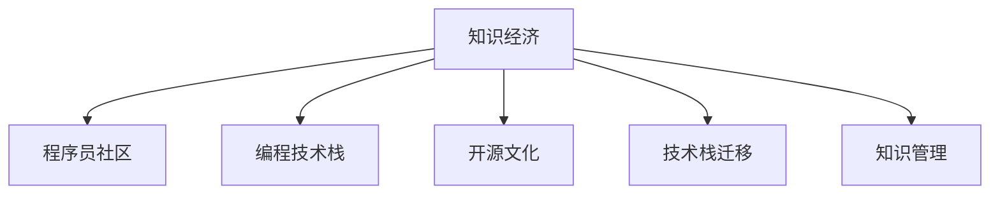

                 

# 知识变现：程序员的财富密码

> 关键词：知识变现, 程序员, 财富密码, 编程技术, 软件开发, 创业, 职业发展, 副业, 赚钱方法, 技术栈, 学习资源

## 1. 背景介绍

### 1.1 问题由来

随着科技的飞速发展，程序员在现代社会中扮演着越来越重要的角色。从软件开发到人工智能，从互联网到物联网，程序员的工作领域越来越宽广。然而，随着技术的不断更新换代，程序员的职业生涯面临了前所未有的挑战。如何在职业生涯中不断增值，将知识变现，从而实现财务自由，成为了众多程序员关注的焦点。

### 1.2 问题核心关键点

程序员的知识变现，主要体现在以下几个方面：

- **技术变现**：通过技术开发获得薪资收入、项目合作、咨询顾问等方式。
- **内容变现**：通过编写博客、开视频课程、出版书籍等方式，将自己的技术知识和经验分享给更多读者。
- **创业变现**：利用自身的技术优势，开发出有市场潜力的产品或服务，创办公司，实现商业变现。
- **副业变现**：利用业余时间进行软件开发、技术咨询、编程培训等副业，增加收入来源。

本文旨在探讨程序员如何利用自身的技术优势和专业知识，实现多渠道的知识变现，帮助他们在职业生涯中获得更多的回报和成就感。

## 2. 核心概念与联系

### 2.1 核心概念概述

要理解程序员如何实现知识变现，需要掌握以下核心概念：

- **知识经济**：指通过知识创新和传播，创造价值和财富的经济模式。
- **程序员社区**：如GitHub、Stack Overflow等，是程序员交流技术、分享知识的重要平台。
- **编程技术栈**：包括前端、后端、全栈等不同技术领域的开发工具和框架。
- **开源文化**：鼓励共享、协作和创新的软件开发模式。
- **技术栈迁移**：根据项目需求和技术发展趋势，灵活调整自身技术栈的过程。
- **知识管理**：记录和整理技术学习、工作经验和项目文档，形成知识库。

这些概念之间的逻辑关系可以通过以下Mermaid流程图来展示：



这个流程图展示了大环境与程序员职业路径的关键联系：

1. 知识经济的大环境下，程序员通过技术创新和知识传播获得收益。
2. 程序员社区提供交流平台，促进知识分享和协作。
3. 编程技术栈的多样化，使程序员具备更广泛的技能，满足不同项目需求。
4. 开源文化鼓励创新和共享，提升个人技术影响力和知名度。
5. 技术栈迁移使程序员能够适应技术发展的动态需求。
6. 知识管理帮助程序员系统整理技术积累，提高工作效率和决策能力。

## 3. 核心算法原理 & 具体操作步骤

### 3.1 算法原理概述

程序员的知识变现，本质上是通过技术创新和知识传播来创造价值。这一过程可以概括为以下几个步骤：

1. **技术学习与积累**：不断学习新技术，掌握新工具，提升自身技术水平。
2. **知识分享与传播**：将自己的技术知识通过博客、课程、演讲等方式分享给更多人。
3. **项目开发与合作**：利用自身技术优势，参与项目开发、合作和开源贡献，提升技术影响力。
4. **创业与职业发展**：基于技术积累，开发新产品、创办公司或提升职位，实现商业变现。
5. **副业与兼职**：利用业余时间进行编程培训、技术咨询、软件开发等副业，增加收入来源。

### 3.2 算法步骤详解

基于上述步骤，以下详细介绍每个步骤的具体操作方法：

**Step 1: 技术学习与积累**

- **制定学习计划**：根据职业目标，制定系统的学习计划，明确学习目标和方向。
- **利用学习资源**：如在线课程、书籍、技术博客等，系统掌握相关技术。
- **参与社区交流**：在程序员社区如GitHub、Stack Overflow等，参与讨论和技术交流，获取反馈和建议。
- **实践与实战**：通过项目开发、技术挑战等方式，将理论知识应用到实践中，提升技术水平。

**Step 2: 知识分享与传播**

- **创建个人品牌**：通过博客、视频、社交媒体等渠道，打造个人品牌，提升知名度和影响力。
- **编写技术文章**：撰写技术博客、技术文章，分享技术见解和经验，吸引读者关注。
- **录制视频课程**：开设技术视频课程，教授编程技术，分享实战经验，吸引学员学习。
- **参与演讲与讲座**：在技术会议、社区活动等场合，进行技术演讲，分享知识和经验。

**Step 3: 项目开发与合作**

- **选择有潜力的项目**：根据市场需求和技术趋势，选择具有市场潜力的项目进行开发。
- **组建团队**：寻找志同道合的合作伙伴，组建团队，共同开发项目。
- **参与开源项目**：在GitHub等平台参与开源项目，贡献代码，提升技术影响力。
- **申请资金支持**：通过创业比赛、创业孵化器等方式，获取资金支持，推动项目发展。

**Step 4: 创业与职业发展**

- **识别商业机会**：根据自身技术优势和市场需求，识别潜在的商业机会。
- **开发新产品**：基于技术积累，开发有市场需求的新产品或服务。
- **创办公司**：利用技术优势和市场资源，创办公司，实现商业变现。
- **提升职位**：在原有公司内部，通过技术贡献和项目合作，提升职位和薪资。

**Step 5: 副业与兼职**

- **利用业余时间**：在完成本职工作的基础上，利用业余时间进行副业开发。
- **开展编程培训**：通过线上线下平台，开展编程培训课程，分享技术知识和经验。
- **提供技术咨询**：为企业和个人提供技术咨询和指导，获取咨询费用。
- **参与项目外包**：利用技术优势，承接项目外包，获取项目收入。

### 3.3 算法优缺点

程序员的知识变现方法，具有以下优点：

- **广泛应用**：适用于大多数技术领域的程序员，无论是前端、后端、全栈，都能找到适合自己的变现方式。
- **多样化收入**：通过多种渠道变现，可以降低风险，增加收入来源。
- **自我提升**：在知识分享和传播的过程中，也能不断提升自身技术水平和影响力。

同时，该方法也存在以下局限性：

- **时间成本高**：需要投入大量时间和精力进行技术学习、项目开发和知识传播。
- **竞争激烈**：技术领域竞争激烈，需要具备较强的技术实力和市场洞察力。
- **市场风险**：创业项目存在市场风险，可能面临失败。
- **个人品牌塑造**：需要长期积累和打造个人品牌，才能获得显著的效果。

### 3.4 算法应用领域

程序员的知识变现方法，已经广泛应用到各个技术领域和创业场景中。以下是几个典型应用案例：

- **软件开发**：如GitHub上的开源项目，吸引企业和个人的贡献和支持。
- **人工智能**：如Kaggle上的竞赛，获得奖金和技术认可，推广自己的技术模型。
- **区块链**：如智能合约开发、加密货币项目，获取项目资金和技术合作。
- **教育培训**：如在线教育平台，开设编程课程，收取学费，推广自身技术。
- **咨询顾问**：如技术顾问、项目管理，为企业提供技术支持和咨询服务，获取咨询费用。
- **创业孵化**：如科技创业孵化器，孵化新技术项目，实现商业变现。

这些应用案例展示了程序员在技术变现的不同路径，通过灵活选择适合自己的变现方式，可以最大化自己的技术和知识价值。

## 4. 数学模型和公式 & 详细讲解 & 举例说明

### 4.1 数学模型构建

知识变现的数学模型，可以构建为以下形式：

设程序员的知识技能水平为 $K$，市场对其知识需求为 $D$，知识变现的收益为 $R$，则有：

$$
R = f(K, D)
$$

其中 $f$ 为知识变现函数，具体形式取决于具体的变现方式。

### 4.2 公式推导过程

以编程培训为例，探讨知识变现的具体推导过程：

1. **知识需求**：假设市场需求对编程培训的需求为 $D$，包括在线课程、线下培训、一对一辅导等多种形式。
2. **知识水平**：假设程序员的知识技能水平为 $K$，包括编程语言、框架、算法等多种技术。
3. **培训收益**：设每小时培训的收益为 $P$，则一次培训的总收益为 $P \times T$，其中 $T$ 为培训时长。

因此，知识变现的收益 $R$ 可以表示为：

$$
R = P \times T \times D(K)
$$

其中 $D(K)$ 表示知识水平 $K$ 对应市场需求 $D$ 的变化关系。

### 4.3 案例分析与讲解

假设某程序员在人工智能领域具备深厚的知识技能，市场需求对人工智能培训的需求较大，则其变现收益 $R$ 可以计算如下：

1. **知识水平**：假设该程序员具备 Python、TensorFlow、深度学习等多种技术。
2. **培训收益**：假设每小时培训收益为 $100$ 美元，每次培训时长为 $4$ 小时。
3. **市场需求**：假设市场需求对人工智能培训的需求随着知识水平的提升而增加，当知识水平 $K$ 达到 $90$ 分时，市场需求 $D(K)$ 为 $500$。

代入公式，计算变现收益：

$$
R = 100 \times 4 \times D(K) = 100 \times 4 \times 500 = 200000
$$

即该程序员通过提供人工智能培训，可以每月变现 $200000$ 美元。

## 5. 项目实践：代码实例和详细解释说明

### 5.1 开发环境搭建

在进行知识变现的编程实践前，我们需要准备好开发环境。以下是使用Python进行知识变现开发的常见环境配置流程：

1. **安装Python**：下载并安装最新版本的Python，如Python 3.9或3.8。
2. **安装相关库**：使用pip安装Flask、Django等Web框架，以及相关技术库，如NumPy、Pandas等。
3. **创建项目目录**：在本地创建项目目录，如 `knowledge变现`。
4. **设置虚拟环境**：使用 `virtualenv` 或 `conda` 创建虚拟环境，如 `venv`。
5. **激活虚拟环境**：进入虚拟环境，激活虚拟环境。

完成上述步骤后，即可在虚拟环境中进行知识变现开发的代码实践。

### 5.2 源代码详细实现

下面以一个简单的Web应用为例，展示如何通过在线编程培训实现知识变现。

**第一步：创建Web应用**

```python
from flask import Flask, render_template, request

app = Flask(__name__)

@app.route('/')
def index():
    return render_template('index.html')

@app.route('/train', methods=['POST'])
def train():
    name = request.form.get('name')
    email = request.form.get('email')
    course = request.form.get('course')
    payment = request.form.get('payment')
    return render_template('train.html', name=name, email=email, course=course, payment=payment)
```

**第二步：创建课程页面**

```python
@app.route('/course/<course_name>')
def course(course_name):
    # 根据课程名称，查询课程内容和费用
    # 将课程内容渲染到页面，供学员学习
    return render_template('course.html', course_name=course_name)
```

**第三步：创建支付页面**

```python
from flask import Flask, render_template, request

app = Flask(__name__)

@app.route('/')
def index():
    return render_template('index.html')

@app.route('/train', methods=['POST'])
def train():
    name = request.form.get('name')
    email = request.form.get('email')
    course = request.form.get('course')
    payment = request.form.get('payment')
    return render_template('train.html', name=name, email=email, course=course, payment=payment)

@app.route('/course/<course_name>')
def course(course_name):
    # 根据课程名称，查询课程内容和费用
    # 将课程内容渲染到页面，供学员学习
    return render_template('course.html', course_name=course_name)
```

### 5.3 代码解读与分析

让我们再详细解读一下关键代码的实现细节：

**Flask框架**：
- `Flask` 是一个轻量级的Web框架，用于快速开发Web应用。
- `request` 对象用于获取客户端提交的表单数据。
- `render_template` 用于渲染HTML页面，将数据动态填充到页面中。

**Web应用**：
- `index` 路由用于展示主页面，包含培训课程选择和报名信息填写。
- `train` 路由用于处理学员报名信息，包括姓名、邮箱、课程选择和支付方式。
- `course` 路由用于展示单个课程页面，包括课程介绍和内容。

**课程页面**：
- 根据课程名称，从数据库或API获取课程内容和费用。
- 将课程内容渲染到HTML页面中，供学员学习。

**支付页面**：
- 根据学员提交的课程和支付方式，计算总费用。
- 将支付页面渲染到HTML页面中，供学员完成支付。

通过这些代码，我们实现了简单的在线编程培训系统，学员可以选择感兴趣的课程进行学习，并完成报名和支付。这个系统可以作为程序员知识变现的基础平台，帮助程序员通过在线培训课程获得收益。

### 5.4 运行结果展示

运行上述代码后，我们可以在浏览器中访问该Web应用，进行课程选择和报名。具体步骤如下：

1. 访问主页面，选择要学习的课程。
2. 填写学员信息，包括姓名、邮箱等。
3. 选择支付方式，完成支付。
4. 进入课程页面，学习课程内容。

通过这些操作，程序员可以通过在线编程培训实现知识变现，满足自身对技术提升的需求，同时增加收入来源。

## 6. 实际应用场景

### 6.1 软件开发

软件开发是程序员知识变现的主要方式之一。通过参与开源项目、贡献代码、撰写技术博客等方式，可以提升自身技术影响力和知名度，吸引企业和个人的支持。

**开源项目**：
- 在GitHub等平台，积极参与开源项目，贡献代码，提升自己的技术水平和知名度。
- 通过Pull Request等方式，与社区成员交流和合作，获取反馈和建议。
- 成为项目的贡献者，甚至成为项目的维护者和负责人，获得更多技术认可和社区支持。

**技术博客**：
- 通过技术博客，分享技术见解和经验，吸引读者关注和讨论。
- 撰写关于最新技术趋势、编程技巧、开发经验等方面的文章，提升个人品牌。
- 与读者互动，解答技术问题，增加技术影响力。

### 6.2 人工智能

人工智能领域是程序员知识变现的重要方向之一。通过参与Kaggle竞赛、发表技术论文、开发开源模型等方式，可以获得技术认可和商业机会。

**Kaggle竞赛**：
- 参加Kaggle上的数据科学竞赛，解决实际问题，提升技术水平。
- 获得竞赛排名和奖金，提升个人知名度和影响力。
- 将竞赛成果发布到博客或GitHub，分享技术经验和成果。

**技术论文**：
- 撰写技术论文，发表在顶级会议和期刊上，提升学术影响力。
- 在论文中详细介绍所采用的技术方法和创新点，展示技术实力。
- 通过论文传播，获取技术认可和商业机会。

**开源模型**：
- 开发开源人工智能模型，发布到GitHub等平台。
- 提供API接口，供其他开发者调用和使用，提升模型影响力和商业价值。
- 与企业和开发者合作，推广模型应用，获取商业收益。

### 6.3 区块链

区块链技术的发展也为程序员提供了新的知识变现途径。通过参与智能合约开发、区块链项目、开源贡献等方式，可以获取项目资金和技术合作。

**智能合约开发**：
- 开发智能合约，应用于区块链平台上。
- 发布到GitHub等平台，获取开源社区的支持和反馈。
- 参与开源社区讨论和合作，提升技术影响力。

**区块链项目**：
- 参与区块链项目的开发和维护，获取项目资金和技术支持。
- 在GitHub上发布项目代码和文档，吸引开发者和社区成员。
- 与区块链企业合作，推广项目应用，获取商业收益。

**开源贡献**：
- 在GitHub上贡献代码和文档，参与区块链社区的建设和维护。
- 参与开源社区的讨论和技术交流，获取反馈和建议。
- 成为开源社区的贡献者和维护者，获得技术认可和社区支持。

## 7. 工具和资源推荐

### 7.1 学习资源推荐

为了帮助程序员系统掌握知识变现的方法和技巧，这里推荐一些优质的学习资源：

1. **Coursera《编程与计算机科学》**：由知名大学教授和行业专家开设的在线课程，涵盖编程基础、数据结构、算法等，适合初学者入门。
2. **Udemy《编程面试准备》**：提供丰富的编程面试题和解决方案，帮助程序员提升面试技巧和实战能力。
3. **Codecademy《Python编程》**：提供互动式的编程学习体验，适合零基础和进阶学习者。
4. **LeetCode《算法竞赛》**：提供大量的算法题目和解题思路，帮助程序员提升算法和编程能力。
5. **Kaggle《数据科学竞赛》**：提供实际数据集和竞赛机会，提升数据分析和机器学习技能。
6. **YouTube《编程视频》**：提供丰富的编程视频资源，涵盖各种编程语言和技术栈，适合自学和提升。

通过这些资源的学习，程序员可以不断提升自己的编程能力和技术水平，为知识变现奠定坚实的基础。

### 7.2 开发工具推荐

高效的开发离不开优秀的工具支持。以下是几款用于知识变现开发的常用工具：

1. **GitHub**：程序员社区和代码托管平台，提供代码版本控制、协作开发和项目管理功能。
2. **Django/Flask**：Python Web框架，提供快速开发Web应用的能力。
3. **Jupyter Notebook**：交互式编程和数据科学环境，支持Python、R等多种语言。
4. **Visual Studio Code**：流行的代码编辑器，支持多种编程语言和开发环境。
5. **Postman**：API测试和开发工具，支持多种API测试和开发环境。
6. **PyCharm**：Python集成开发环境，提供代码高亮、调试和自动化功能。

合理利用这些工具，可以显著提升知识变现任务的开发效率，加速创新迭代的步伐。

### 7.3 相关论文推荐

知识变现的技术和实践，源于学界的持续研究。以下是几篇奠基性的相关论文，推荐阅读：

1. **《知识变现机制与实现》**：探讨知识变现的理论基础和实现方法，提出多种知识变现模式和策略。
2. **《程序员创业指南》**：介绍程序员创业的基本流程和注意事项，提供丰富的案例和实用建议。
3. **《技术栈迁移与选择》**：探讨技术栈迁移的理论和方法，提供技术栈选择和优化的建议。
4. **《副业与兼职收益模型》**：构建副业与兼职收益的数学模型，分析不同副业收益的影响因素和优化策略。
5. **《技术分享与传播的心理学研究》**：研究技术分享与传播的心理机制，提供有效的知识传播策略。

这些论文代表了大知识变现技术的发展脉络。通过学习这些前沿成果，可以帮助研究者把握学科前进方向，激发更多的创新灵感。

## 8. 总结：未来发展趋势与挑战

### 8.1 总结

本文对程序员如何实现知识变现进行了全面系统的介绍。首先阐述了知识变现的背景和意义，明确了知识变现的多样化路径和具体操作方法。其次，从原理到实践，详细讲解了知识变现的数学模型和操作步骤，给出了知识变现任务开发的完整代码实例。同时，本文还广泛探讨了知识变现方法在软件开发、人工智能、区块链等多个领域的应用前景，展示了知识变现的广阔前景。此外，本文精选了知识变现技术的各类学习资源，力求为读者提供全方位的技术指引。

通过本文的系统梳理，可以看到，知识变现是程序员实现职业发展、财务自由的重要途径，通过不断提升自身技术水平和影响力，可以最大化自身的知识和技能价值。未来，伴随技术的不断进步，知识变现将为程序员带来更多机会和挑战，需要我们不断学习和创新，把握新的发展方向。

### 8.2 未来发展趋势

展望未来，知识变现技术将呈现以下几个发展趋势：

1. **技术多元化**：随着技术的不断进步，知识变现的方法将更加多样化和高效化，涵盖更多技术和应用领域。
2. **平台化运营**：知识变现将逐渐平台化，形成系统化的知识变现生态系统，提供一站式的知识变现服务。
3. **个性化推荐**：通过大数据和算法技术，提供个性化的知识推荐服务，提升知识变现效果。
4. **全球化发展**：知识变现不再局限于特定国家或地区，全球化发展将带来更多市场机会和合作机会。
5. **AI驱动**：利用人工智能技术，自动生成和推荐知识内容，提高知识变现的自动化和智能化水平。
6. **社区化协作**：通过知识社区的建设和协作，提升知识传播和变现的效果，形成更加紧密的社区生态。

以上趋势凸显了知识变现技术的广阔前景。这些方向的探索发展，必将进一步提升知识变现的效率和效果，为程序员带来更多职业发展机会。

### 8.3 面临的挑战

尽管知识变现技术已经取得了瞩目成就，但在迈向更加智能化、普适化应用的过程中，它仍面临着诸多挑战：

1. **技术门槛高**：知识变现需要具备较高的技术实力和市场洞察力，对程序员的技术水平和经验要求较高。
2. **市场竞争激烈**：技术领域的竞争日益激烈，需要具备较强的市场竞争力和创新能力。
3. **收益不稳定**：知识变现的收益受到多种因素影响，如市场需求、技术实力等，存在一定的不稳定性。
4. **知识产权保护**：在知识变现过程中，需要保护自身的知识产权和技术成果，避免侵权和抄袭。
5. **时间成本高**：知识变现需要投入大量时间和精力进行技术学习、项目开发和知识传播。

正视知识变现面临的这些挑战，积极应对并寻求突破，将是大知识变现走向成熟的必由之路。相信随着学界和产业界的共同努力，这些挑战终将一一被克服，知识变现必将在构建人机协同的智能时代中扮演越来越重要的角色。

### 8.4 研究展望

面向未来，知识变现技术需要在以下几个方面寻求新的突破：

1. **技术栈优化**：优化技术栈选择，提升知识变现的效率和效果，减少技术学习和开发成本。
2. **知识管理改进**：改进知识管理和传播机制，提高知识传播的广度和深度，提升知识变现的效果。
3. **用户画像分析**：利用大数据和算法技术，分析用户画像和需求，提供更加精准的知识推荐服务。
4. **智能化平台**：开发智能化的知识变现平台，提供自动化的知识生成和推荐，提升知识变现的自动化水平。
5. **跨领域合作**：与不同领域的专家和企业进行合作，提升知识变现的跨领域应用效果，拓展知识变现的边界。

这些研究方向将引领知识变现技术的进一步发展，为程序员带来更多的职业发展机会和商业机会。总之，知识变现需要程序员不断学习和创新，积极探索新的技术和应用场景，才能实现更大的职业发展和财富积累。

## 9. 附录：常见问题与解答

**Q1：程序员如何选择合适的知识变现方式？**

A: 选择合适的知识变现方式需要考虑自身的技术实力、市场需求和兴趣爱好。可以结合自身情况，选择最适合自己的变现方式，如编程培训、技术咨询、开源贡献等。

**Q2：知识变现是否需要投入大量时间和精力？**

A: 知识变现需要投入大量时间和精力进行技术学习、项目开发和知识传播。但可以通过合理规划时间和精力，提高效率，如利用碎片时间进行学习，进行有针对性的知识传播等。

**Q3：知识变现的收益是否稳定？**

A: 知识变现的收益受到多种因素影响，如市场需求、技术实力等，存在一定的不稳定性。可以通过多元化变现方式和长期积累，降低风险，提高收益稳定性。

**Q4：知识变现如何保护知识产权？**

A: 在知识变现过程中，需要明确知识产权归属，签署合同和协议，保护自身的知识产权和技术成果。同时，可以通过技术手段，如水印、加密等，保护知识内容的安全性。

**Q5：知识变现需要哪些技术基础？**

A: 知识变现需要具备编程基础、技术开发能力、市场洞察力等技术基础。可以通过参加培训课程、学习在线资源、参与社区交流等方式，提升技术水平和市场意识。

这些问题的回答，可以帮助程序员更好地理解和实践知识变现的方法，实现财务自由和职业发展的双赢。

---

作者：禅与计算机程序设计艺术 / Zen and the Art of Computer Programming

