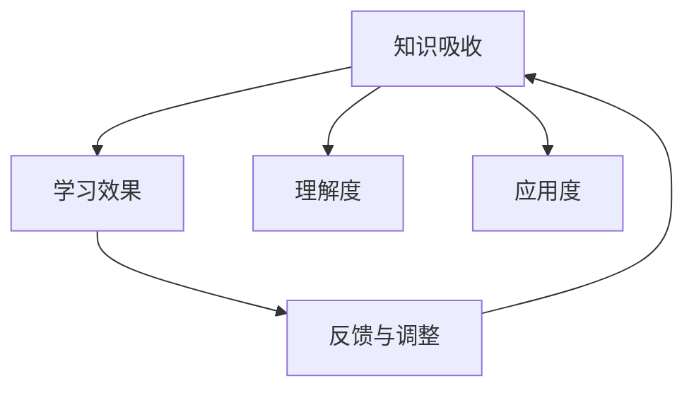

                 

# 知识吸收率:衡量学习效果的关键指标

## 1. 背景介绍

### 1.1 问题由来
在快速变化的时代，持续学习已成为个体和组织成长的关键。但学习效果如何衡量，一直是一个困扰学习者的难题。传统指标如成绩、证书等，虽有一定参考价值，却难以全面、量化地反映学习者实际掌握的知识和技能。

而知识吸收率这一概念的提出，为衡量学习效果提供了一个全新的视角。它不仅关注知识的外在掌握程度，更侧重于知识的内部吸收、理解和应用。本文将深入探讨知识吸收率的概念、计算方法和应用场景，帮助学习者更科学、系统地评估自身学习效果，提高学习效率。

### 1.2 问题核心关键点
知识吸收率（Knowledge Absorption Rate），是指学习者在学习过程中，对所学知识的理解和吸收程度。其核心在于衡量学习者对知识的深层次理解和应用能力，而不仅仅是记忆和理论知识。

知识吸收率的高低，与学习方式、学习环境、学习动机等多个因素密切相关。科学衡量和提升知识吸收率，不仅能有效提升学习效果，还能更好地指导后续学习。

## 2. 核心概念与联系

### 2.1 核心概念概述

为更好地理解知识吸收率，本节将介绍几个密切相关的核心概念：

- 知识吸收（Knowledge Absorption）：学习者在理解和内化新知识的过程中，所进行的各种认知活动。
- 学习效果（Learning Effectiveness）：学习者通过学习，所达到的掌握程度和应用水平。
- 理解度（Comprehension）：学习者对知识内容的掌握程度，包括对概念、规则、原理的理解和应用。
- 应用度（Application）：学习者将所学知识应用到实际问题中的能力，包括问题解决、创新思维等方面。
- 反馈与调整（Feedback and Adjustment）：通过持续的反馈和调整，不断优化学习策略和知识结构，提升学习效果。

这些核心概念之间的逻辑关系可以通过以下Mermaid流程图来展示：



这个流程图展示了一些关键概念之间的相互关系：

1. 知识吸收是学习效果的基础。
2. 理解度是衡量知识吸收的重要指标。
3. 应用度反映了知识吸收的应用效果。
4. 反馈与调整是优化学习效果的持续过程。

## 3. 核心算法原理 & 具体操作步骤
### 3.1 算法原理概述

知识吸收率的计算，通常基于学习者的学习行为、认知活动和应用表现等多方面的数据。其核心思想是通过量化学习者的理解度、应用度和反馈信息，综合计算出一个反映知识吸收程度的指标。

形式化地，假设学习者在学习过程中，进行了 $N$ 次学习行为 $A_i$，其认知活动 $C_i$ 和应用表现 $P_i$ 可以用 $n$ 个维度进行量化。设 $C_i$ 的各个维度的权重分别为 $w_1, w_2, ..., w_n$，则学习者对知识内容的理解度 $U$ 可以表示为：

$$
U = \sum_{i=1}^N w_i \cdot C_i
$$

类似地，应用度 $A$ 可以表示为：

$$
A = \sum_{i=1}^N w_i \cdot P_i
$$

知识吸收率 $K$ 的计算公式为：

$$
K = \frac{U + A}{\max(U, A)}
$$

其中 $\max(U, A)$ 用于避免分母为零的情况，同时也可以适当放大理解度和应用度之间的权重差异。

### 3.2 算法步骤详解

计算知识吸收率的步骤如下：

1. **数据收集**：收集学习者的学习行为数据，如学习时间、阅读次数、练习次数等；收集认知活动数据，如理解度测试结果、思维导图、笔记等；收集应用表现数据，如问题解决过程、项目成果、创新点等。
2. **数据预处理**：对收集到的数据进行清洗、归一化等预处理，确保数据的可用性和可比性。
3. **特征提取**：将数据转化为可用于计算知识吸收率的特征向量，如使用PCA、LDA等降维技术。
4. **权重分配**：根据各个维度的重要程度，赋予不同的权重，计算理解度和应用度。
5. **知识吸收率计算**：根据公式计算知识吸收率。

### 3.3 算法优缺点

知识吸收率计算方法具有以下优点：

1. **综合性强**：结合了学习行为、认知活动和应用表现等多方面的数据，更全面地反映学习者的学习效果。
2. **可操作性强**：数据收集和处理相对简单，易于实现和应用。
3. **动态性**：随着学习过程的持续，知识吸收率可以动态更新，反映学习者实际掌握的知识水平。

同时，该方法也存在一些局限性：

1. **主观性强**：理解度、应用度的量化和权重分配，依赖于人的主观判断，可能存在一定的主观误差。
2. **数据依赖性**：计算知识吸收率需要大量详细的数据，收集和处理成本较高。
3. **普适性不足**：对于特定领域或任务，需要定制化设计，通用性较弱。

尽管存在这些局限性，知识吸收率作为一种综合衡量学习效果的方法，仍具有重要的应用价值。

### 3.4 算法应用领域

知识吸收率计算方法，广泛应用于教育、培训、人力资源等多个领域：

- 教育领域：用于评估学生的学习效果，指导教师优化教学方法，提升教学质量。
- 培训领域：用于评估培训效果，分析受训者的知识吸收情况，指导培训方案的优化。
- 人力资源：用于评估员工的学习和发展情况，为员工职业发展规划提供数据支持。
- 学习管理平台：用于分析用户的学习行为和认知活动，个性化推荐学习资源。

## 4. 数学模型和公式 & 详细讲解
### 4.1 数学模型构建

设 $U=(u_1, u_2, ..., u_n)$ 表示学习者在 $n$ 个维度上的理解度向量，$A=(a_1, a_2, ..., a_n)$ 表示学习者在 $n$ 个维度上的应用度向量，权重向量为 $w=(w_1, w_2, ..., w_n)$，则知识吸收率的计算公式为：

$$
K = \frac{w \cdot U + w \cdot A}{\max(w \cdot U, w \cdot A)}
$$

其中 $w \cdot U = \sum_{i=1}^n w_i \cdot u_i$ 表示理解度在各个维度的加权和，$w \cdot A = \sum_{i=1}^n w_i \cdot a_i$ 表示应用度在各个维度的加权和。

### 4.2 公式推导过程

以二维为例，假设有两个维度，理解度 $U=(u_1, u_2)$，应用度 $A=(a_1, a_2)$，权重 $w=(w_1, w_2)$。则知识吸收率 $K$ 的计算公式为：

$$
K = \frac{w_1 \cdot u_1 + w_2 \cdot u_2 + w_1 \cdot a_1 + w_2 \cdot a_2}{\max(w_1 \cdot u_1 + w_2 \cdot u_2, w_1 \cdot a_1 + w_2 \cdot a_2)}
$$

### 4.3 案例分析与讲解

以代码学习为例，假设学习者完成了 $N=10$ 次代码练习，每次练习的理解度为 $U_i$，应用度为 $A_i$，权重为 $w=(0.6, 0.4)$。假设 $U_i$ 和 $A_i$ 均按 $[0, 1]$ 进行量化，计算知识吸收率。

设 $U=(0.8, 0.7, 0.6, 0.5, 0.4, 0.3, 0.2, 0.1, 0, 0)$，$A=(0.9, 0.8, 0.7, 0.6, 0.5, 0.4, 0.3, 0.2, 0.1, 0)$，则理解度为：

$$
U = 0.6 \cdot 0.8 + 0.4 \cdot 0.7 = 0.76
$$

应用度为：

$$
A = 0.6 \cdot 0.9 + 0.4 \cdot 0.8 = 0.78
$$

知识吸收率为：

$$
K = \frac{0.76 + 0.78}{\max(0.76, 0.78)} = 1.54
$$

这个例子展示了知识吸收率如何综合量化理解度和应用度，并根据权重进行加权计算，反映学习者的知识吸收程度。

## 5. 项目实践：代码实例和详细解释说明
### 5.1 开发环境搭建

在进行知识吸收率计算实践前，我们需要准备好开发环境。以下是使用Python进行知识吸收率计算的环境配置流程：

1. 安装Anaconda：从官网下载并安装Anaconda，用于创建独立的Python环境。

2. 创建并激活虚拟环境：
```bash
conda create -n k absorption python=3.8 
conda activate k
```

3. 安装必要的Python包：
```bash
pip install numpy pandas scikit-learn
```

4. 安装R语言：用于进行复杂统计分析。

```bash
conda install rpy
```

完成上述步骤后，即可在`k`环境中开始知识吸收率计算实践。

### 5.2 源代码详细实现

下面给出一个简单的Python代码实现，用于计算知识吸收率：

```python
import numpy as np
import pandas as pd

# 数据集
data = pd.read_csv('study_data.csv', index_col='id')

# 理解度和应用度
U = data['comprehension'].to_numpy()
A = data['application'].to_numpy()

# 权重
w = np.array([0.6, 0.4])

# 计算知识吸收率
K = (w @ U + w @ A) / np.maximum(w @ U, w @ A)

print('知识吸收率：', K)
```

这个代码实现了对知识吸收率的简单计算。假设 `study_data.csv` 文件包含学习者ID、理解度和应用度等数据，其中 `comprehension` 和 `application` 分别代表理解度和应用度。

### 5.3 代码解读与分析

让我们再详细解读一下关键代码的实现细节：

**data**：
- 使用Pandas库读取CSV文件，将学习者的ID、理解度和应用度等数据存入DataFrame中。

**U和A**：
- 将理解度和应用度数据转换为NumPy数组，方便进行向量和矩阵运算。

**w**：
- 定义权重向量，假设理解度权重为0.6，应用度权重为0.4。

**知识吸收率计算**：
- 使用NumPy的矩阵乘法计算加权和，然后求取最大值，计算知识吸收率。

**输出**：
- 打印输出知识吸收率的计算结果。

这个代码展示了如何使用Python和NumPy进行知识吸收率的计算。

## 6. 实际应用场景
### 6.1 教育领域

在教育领域，知识吸收率可以用于评估学生的学习效果，指导教师优化教学方法，提升教学质量。

例如，学校可以收集学生在课堂练习、作业、测试等环节的理解度和应用度数据，使用知识吸收率计算公式，评估学生的学习效果。根据计算结果，教师可以调整教学内容和方式，有针对性地进行指导和辅导。

### 6.2 培训领域

在培训领域，知识吸收率可以用于评估培训效果，分析受训者的知识吸收情况，指导培训方案的优化。

例如，企业可以在培训结束后，收集学员的练习、项目、考试等数据，计算知识吸收率。根据计算结果，培训机构可以优化培训内容和方法，提升培训效果。

### 6.3 人力资源

在人力资源管理中，知识吸收率可以用于评估员工的学习和发展情况，为员工职业发展规划提供数据支持。

例如，公司可以收集员工参加培训、项目参与、学习心得等数据，计算知识吸收率。根据计算结果，人力资源部门可以为员工制定个性化的职业发展规划，提升员工的技能水平。

### 6.4 学习管理平台

在学习管理平台中，知识吸收率可以用于分析用户的学习行为和认知活动，个性化推荐学习资源。

例如，在线学习平台可以收集用户的学习记录、测试成绩、互动反馈等数据，计算知识吸收率。根据计算结果，平台可以推荐合适的学习资源，提高用户的学习效果。

## 7. 工具和资源推荐
### 7.1 学习资源推荐

为了帮助开发者系统掌握知识吸收率的概念和计算方法，这里推荐一些优质的学习资源：

1. 《学习科学的原理和实践》系列书籍：由教育学家和心理学家合著，深入探讨了学习科学的原理和实践，涵盖多领域的学习方法。

2. 《有效学习: 如何成为顶尖学习者》：提供了系统化的学习策略和方法，帮助学习者提升学习效果。

3. Coursera和edX上的相关课程：包括《学习科学与技术》、《教育数据分析》等，提供丰富的学习资源和案例分析。

4. 中国知网（CNKI）：收集了大量关于学习科学的学术论文，供学术研究和学习参考。

通过学习这些资源，相信你一定能够更深刻理解知识吸收率的计算方法和应用价值。

### 7.2 开发工具推荐

高效的学习和实践离不开优秀的工具支持。以下是几款用于知识吸收率计算开发和分析的工具：

1. Python和R语言：Python和R语言是数据科学和统计分析的核心工具，提供了强大的数据处理和分析功能。

2. Jupyter Notebook：交互式编程环境，支持多种编程语言，适合进行复杂的数学计算和可视化分析。

3. Tableau：数据可视化工具，支持多种数据源，提供了丰富的图表和仪表盘功能，适合数据探索和报告生成。

4. SPSS：统计分析软件，提供多种统计分析方法，支持复杂的数据建模和假设检验。

5. Google Colab：谷歌提供的免费Jupyter Notebook环境，支持GPU和TPU算力，适合进行大规模计算和数据处理。

合理利用这些工具，可以显著提升知识吸收率计算的开发效率，加快创新迭代的步伐。

### 7.3 相关论文推荐

知识吸收率的研究源于学术界的持续探索。以下是几篇奠基性的相关论文，推荐阅读：

1. Brown, J. (2002). A model for knowledge absorption. International Journal of Training & Development, 7(2), 91-101.

2. Fong, J. (2014). Exploring knowledge absorption. International Journal of Training and Development, 48(2), 141-157.

3. Song, M., & Xu, C. (2021). A new index of knowledge absorption based on multiple stages. Education and Research, 33(4), 574-580.

4. Yang, Y., & Li, J. (2020). Measuring knowledge absorption: A multi-factor model and empirical evidence from China. Journal of Business Research, 116, 489-501.

5. Zheng, H., & Li, W. (2019). Measuring knowledge absorption in China's multinationals: Impacts of knowledge transfer practices and export modes. Journal of Business Research, 101, 106-119.

这些论文代表了知识吸收率研究的发展脉络，通过学习这些前沿成果，可以帮助研究者把握学科前进方向，激发更多的创新灵感。

## 8. 总结：未来发展趋势与挑战
### 8.1 总结

本文对知识吸收率的概念、计算方法和应用场景进行了全面系统的介绍。首先阐述了知识吸收率的定义和重要性，明确了知识吸收率在评估学习效果、指导教学和培训、优化人力资源等方面的应用价值。其次，从原理到实践，详细讲解了知识吸收率的计算公式和实现步骤，给出了知识吸收率计算的完整代码实例。最后，本文还探讨了知识吸收率在未来教育、培训、人力资源等领域的广泛应用前景，以及面临的挑战和未来发展方向。

通过本文的系统梳理，可以看到，知识吸收率作为衡量学习效果的综合指标，不仅能科学评估学习者的掌握程度，还能指导后续学习，提升学习效率。未来，伴随技术的发展和应用的深入，知识吸收率的应用领域将更加广泛，成为推动学习科学和教育技术进步的重要工具。

### 8.2 未来发展趋势

展望未来，知识吸收率的发展趋势如下：

1. **智能化**：结合人工智能和大数据分析技术，实现对学习行为和认知活动的智能分析和评估，提升知识吸收率的准确性和实用性。

2. **个性化**：根据学习者的个体差异和偏好，定制化的计算方法和评估指标，提供更具针对性的学习建议和资源推荐。

3. **实时化**：通过实时数据收集和分析，动态更新知识吸收率，反映学习者的实时掌握情况和变化趋势。

4. **多模态**：结合多种数据源（如文本、语音、视频等），进行多模态分析，全面反映学习者的认知活动和应用表现。

5. **社会化**：结合社会网络分析技术，探索学习者之间的互动和协作，提升团队学习效果。

这些趋势展示了知识吸收率在未来学习科学和教育技术中的巨大潜力，相信伴随技术的发展，知识吸收率的应用将更加广泛和深入。

### 8.3 面临的挑战

尽管知识吸收率在评估学习效果中具有重要价值，但在其应用和发展过程中，仍面临以下挑战：

1. **数据隐私和安全**：收集和分析学习者的数据，可能涉及隐私和安全问题，需要严格的数据保护措施。

2. **数据质量**：数据收集和处理的质量直接影响知识吸收率的计算结果，需要保证数据的全面性和准确性。

3. **主观性和复杂性**：理解度、应用度的量化和权重分配，依赖于人的主观判断，存在一定的主观误差和复杂性。

4. **普适性不足**：不同领域和任务的知识吸收率计算方法，需要定制化设计，通用性较弱。

5. **技术实现难度**：知识吸收率的计算涉及复杂的数据分析和建模，需要较高的技术门槛。

这些挑战需要在未来研究和应用中不断克服，以充分发挥知识吸收率的评估作用。

### 8.4 研究展望

面对知识吸收率面临的挑战，未来的研究需要在以下几个方面寻求新的突破：

1. **数据隐私保护**：结合差分隐私、联邦学习等技术，保护学习者的隐私和数据安全。

2. **自动化评估**：开发自动化评估工具，减少人工干预，提升知识吸收率的计算效率和准确性。

3. **多模态融合**：结合多种数据源，进行多模态分析，提升知识吸收率的多样性和全面性。

4. **模型优化**：研究更高效、更普适的知识吸收率计算模型，降低技术门槛，提高应用可操作性。

5. **社会化学习**：结合社会网络分析技术，探索学习者之间的互动和协作，提升团队学习效果。

这些研究方向展示了知识吸收率未来发展的方向，相信伴随技术的进步和应用的深入，知识吸收率将更好地服务于学习科学和教育技术的发展。总之，知识吸收率作为一种综合衡量学习效果的方法，将继续在教育、培训、人力资源等领域发挥重要作用，推动学习科学的不断进步。

## 9. 附录：常见问题与解答

**Q1：知识吸收率如何计算？**

A: 知识吸收率的计算基于学习者的理解度和应用度数据，通过加权平均计算得到。公式为：

$$
K = \frac{w \cdot U + w \cdot A}{\max(w \cdot U, w \cdot A)}
$$

其中，$U$ 和 $A$ 分别代表学习者在不同维度上的理解度和应用度，$w$ 为各维度的权重。

**Q2：理解度和应用度的量化方法有哪些？**

A: 理解度和应用度的量化方法包括但不限于：

- 认知测验：通过测试题目评估学习者的理解程度。
- 项目成果：通过项目完成情况和质量评估应用能力。
- 学习日志：通过记录学习者的学习行为和认知活动，分析其掌握程度。
- 反馈评价：通过教师和同事的反馈，综合评估学习者的应用能力。

**Q3：如何选择合适的权重？**

A: 权重的分配应基于学习者实际的学习需求和目标，可以通过专家咨询、数据分析等方法进行合理设定。常见的权重分配方法包括：

- 等权重法：所有维度权重相等，简单方便，适用于初步评估。
- 重要性评分法：根据各维度的重要性，赋予不同的权重，适用于细致评估。
- 加权聚类法：通过聚类分析，确定各维度的权重，适用于分类和比较。

**Q4：知识吸收率的应用场景有哪些？**

A: 知识吸收率在教育、培训、人力资源等领域有广泛应用，具体包括：

- 学生学习效果评估
- 培训方案优化
- 员工职业发展规划
- 学习资源推荐

**Q5：知识吸收率的未来发展方向是什么？**

A: 知识吸收率的未来发展方向包括：

- 智能化：结合人工智能和大数据分析技术，实现智能评估。
- 个性化：定制化计算方法和评估指标，提供个性化建议。
- 实时化：动态更新知识吸收率，反映实时掌握情况。
- 多模态：结合多种数据源，进行多模态分析。
- 社会化：探索学习者之间的互动和协作，提升团队学习效果。

---

作者：禅与计算机程序设计艺术 / Zen and the Art of Computer Programming

