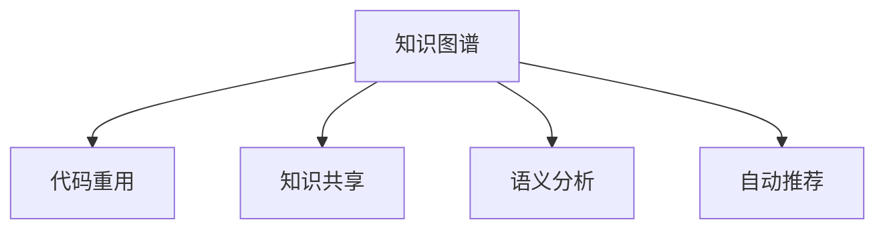

                 

# 知识图谱在代码重用与知识共享中的应用

> 关键词：知识图谱,代码重用,知识共享,软件开发,自然语言处理(NLP),语义分析

## 1. 背景介绍

### 1.1 问题由来

在软件开发中，代码重用和知识共享一直是一个重要的议题。传统的代码重用主要依赖程序员的经验积累和开源社区的贡献，然而这些方式的局限性明显：
- **经验依赖**：依赖个人经验容易导致重用效果不稳定，缺乏通用性和可复用性。
- **社区依赖**：依赖开源社区的贡献可能遇到兼容性问题，重用难度大。
- **重用局限**：代码重用往往局限于低层次功能，难以适应高层次复杂需求。

为了解决这些问题，知识图谱应运而生。知识图谱是一种语义化的数据结构，通过建立实体间的关系网络，使得信息更容易被理解和利用。在代码重用和知识共享中，知识图谱可以提供更丰富的上下文信息，帮助开发者更高效地重用代码、分享知识。

### 1.2 问题核心关键点

知识图谱在代码重用和知识共享中的应用主要体现在以下几个关键点：

- **语义表示**：知识图谱通过语义化的方式描述实体间的关系，帮助代码和知识更自然地关联起来。
- **上下文信息**：知识图谱能够提供更全面的上下文信息，帮助开发者理解代码和知识的背景和应用场景。
- **自动推荐**：通过知识图谱的自动推荐系统，可以快速找到合适的代码和知识，加速开发效率。
- **版本控制**：知识图谱能够记录代码和知识的演变历史，支持版本控制，方便追踪和回顾。

### 1.3 问题研究意义

知识图谱在代码重用和知识共享中的应用，对于提升软件开发效率、降低开发成本、提高代码质量具有重要意义：

1. **提升开发效率**：通过知识图谱的自动推荐和语义关联，开发者可以快速找到可重用的代码和知识，减少重复开发，提升开发效率。
2. **降低开发成本**：代码重用可以减少人力和时间的投入，降低开发成本，加速产品上市。
3. **提高代码质量**：知识图谱能够提供更丰富的上下文信息，帮助开发者理解代码的设计意图和实现细节，提升代码的可维护性和可靠性。
4. **支持版本控制**：知识图谱记录代码和知识的演变历史，支持版本控制，方便追踪和回顾，降低版本管理的复杂度。
5. **促进社区协作**：知识图谱能够促进开源社区的知识共享，增强社区成员之间的协作，提高社区整体的技术水平。

## 2. 核心概念与联系

### 2.1 核心概念概述

知识图谱在代码重用和知识共享中的应用主要涉及以下几个核心概念：

- **知识图谱(Knowledge Graph)**：一种语义化的数据结构，通过实体和关系描述知识，帮助机器理解和推理。
- **代码重用(Code Reuse)**：在软件开发中，重复使用已有的代码片段以避免重复开发。
- **知识共享(Knowledge Sharing)**：将已有的知识和经验共享给其他开发者，提高团队的协作效率。
- **语义分析(Semantic Analysis)**：通过自然语言处理技术，提取和理解代码和知识中的语义信息。
- **自动推荐(Recommendation)**：基于知识图谱的推荐系统，帮助开发者快速找到合适的代码和知识。

这些核心概念之间的逻辑关系可以通过以下Mermaid流程图来展示：



这个流程图展示了这个系统的主要功能和组件：

1. 知识图谱作为系统的核心，通过描述代码和知识的语义信息，实现自动推荐和语义关联。
2. 代码重用和知识共享是系统的应用目标，通过知识图谱提供上下文信息，实现更高效的重用和共享。
3. 语义分析是知识图谱的基础功能，通过自然语言处理技术，提取和理解代码和知识的语义信息。
4. 自动推荐是知识图谱的高级功能，基于语义分析和知识图谱，帮助开发者快速找到合适的代码和知识。

## 3. 核心算法原理 & 具体操作步骤

### 3.1 算法原理概述

知识图谱在代码重用和知识共享中的应用主要基于以下几个算法原理：

1. **知识抽取与构建**：通过自然语言处理技术，从代码注释、文档、源代码等文本中抽取实体和关系，构建知识图谱。
2. **语义关联与匹配**：将代码和知识映射到知识图谱中的实体和关系，实现语义上的关联和匹配。
3. **自动推荐与排序**：基于知识图谱的语义信息，使用推荐算法计算相似度，对可重用的代码和知识进行排序和推荐。

### 3.2 算法步骤详解

知识图谱在代码重用和知识共享中的应用主要包括以下几个关键步骤：

**Step 1: 知识抽取与构建**

1. **代码注释解析**：使用自然语言处理技术，解析代码注释中的实体和关系，抽取代码元数据。
2. **代码文档分析**：对代码的文档字符串进行解析，提取文档中的实体和关系。
3. **源代码扫描**：扫描源代码中的关键字和命名空间，构建代码实体和关系图谱。

**Step 2: 语义关联与匹配**

1. **实体映射**：将代码中的变量、函数、类等实体映射到知识图谱中的实体，建立语义关联。
2. **关系映射**：将代码中的调用、继承、关联等关系映射到知识图谱中的关系，进一步增强语义理解。
3. **知识整合**：将代码和知识整合并存放在知识图谱中，形成全面的知识库。

**Step 3: 自动推荐与排序**

1. **相似度计算**：基于知识图谱中的语义信息，计算代码和知识之间的相似度。
2. **推荐排序**：根据相似度对代码和知识进行排序，推荐最符合需求的代码和知识。
3. **反馈循环**：根据用户的选择和反馈，不断优化推荐算法和知识图谱，提升推荐效果。

### 3.3 算法优缺点

知识图谱在代码重用和知识共享中的应用具有以下优点：

1. **全面覆盖**：能够全面覆盖代码和知识中的语义信息，提供更丰富的上下文信息。
2. **高效推荐**：通过自动推荐和相似度计算，快速找到合适的代码和知识，提升开发效率。
3. **版本控制**：记录代码和知识的演变历史，支持版本控制，方便追踪和回顾。

同时，该方法也存在一定的局限性：

1. **依赖语料质量**：知识抽取和构建的准确性依赖于代码注释、文档和源代码的质量，质量不高的代码和文档可能影响知识图谱的构建效果。
2. **复杂性高**：知识图谱的构建和维护较为复杂，需要专业的自然语言处理和知识图谱构建技术。
3. **数据隐私**：代码和知识的共享需要考虑数据隐私和安全问题，避免泄露敏感信息。
4. **扩展性差**：当前的知识图谱系统往往局限于特定的编程语言或技术栈，扩展性有待提高。

### 3.4 算法应用领域

知识图谱在代码重用和知识共享中的应用，已经广泛应用于以下领域：

- **开源社区**：帮助开源社区的开发者快速找到可重用的代码和知识，促进社区协作。
- **企业内部**：提升企业的代码重用率和知识共享效率，加速产品开发和迭代。
- **教育培训**：为教育机构提供代码和知识的共享平台，支持教学和培训。
- **软件开发平台**：集成知识图谱，提供代码重用和知识共享功能，提升平台的用户体验。
- **智能搜索与推荐**：基于知识图谱实现智能搜索和推荐，提供更个性化的服务。

## 4. 数学模型和公式 & 详细讲解 & 举例说明

### 4.1 数学模型构建

在知识图谱的应用中，主要涉及以下几个数学模型：

- **知识图谱(KG)**：由实体($R$)、关系($E$)和属性($A$)构成，表示为$\mathcal{G}=(\mathcal{R}, \mathcal{E}, \mathcal{A})$。
- **代码图谱(CG)**：由代码实体($C$)、调用关系($U$)和代码注释($N$)构成，表示为$\mathcal{CG}=(\mathcal{C}, \mathcal{U}, \mathcal{N})$。
- **语义关联(SA)**：通过代码实体和知识实体的映射关系，实现语义上的关联，表示为$\mathcal{SA}(\mathcal{C}, \mathcal{R})$。

### 4.2 公式推导过程

假设知识图谱中有一个实体$e$，其属性集合为$\mathcal{A}(e)$，代码图谱中有一个代码片段$c$，其注释集合为$\mathcal{N}(c)$，关系集合为$\mathcal{U}(c)$。语义关联的计算公式为：

$$
\text{SA}(e, c) = \sum_{a \in \mathcal{A}(e)} \sum_{n \in \mathcal{N}(c)} \text{L}(a, n) \times \text{K}(a, n)
$$

其中，$\text{L}(a, n)$表示属性$a$和注释$n$的语义相似度，$\text{K}(a, n)$表示属性$a$和注释$n$的关键词匹配度。

### 4.3 案例分析与讲解

假设知识图谱中有两个实体$e_1$和$e_2$，分别表示两个函数，代码图谱中有两个代码片段$c_1$和$c_2$，分别表示两个方法。根据上述公式，计算这两个实体和代码片段的语义关联度：

1. 首先，将代码片段$c_1$和$c_2$的注释和调用关系映射到知识图谱中，形成语义关联。
2. 然后，计算每个代码片段和每个实体的语义相似度。例如，$c_1$和$e_1$的语义相似度为$\text{L}(a_1, n_1) \times \text{K}(a_1, n_1)$。
3. 最后，将所有属性和注释的相似度相加，得到两个实体和两个代码片段之间的语义关联度。

通过这种方式，知识图谱可以准确地计算出实体和代码片段之间的语义关联度，帮助开发者快速找到可重用的代码和知识。

## 5. 项目实践：代码实例和详细解释说明

### 5.1 开发环境搭建

在进行代码实践前，我们需要准备好开发环境。以下是使用Python进行开发的环境配置流程：

1. 安装Anaconda：从官网下载并安装Anaconda，用于创建独立的Python环境。

2. 创建并激活虚拟环境：
```bash
conda create -n code-reuse-env python=3.8 
conda activate code-reuse-env
```

3. 安装相关依赖：
```bash
pip install graphsurgeon transformers pykggraph inflect
```

4. 安装其他工具包：
```bash
pip install pandas numpy matplotlib jupyter notebook
```

完成上述步骤后，即可在`code-reuse-env`环境中开始开发实践。

### 5.2 源代码详细实现

下面我们以代码重用的实践为例，给出使用GraphSurgeon库构建知识图谱的PyTorch代码实现。

首先，定义代码注释解析函数：

```python
from transformers import AutoTokenizer

def parse_code_comments(code_str):
    tokenizer = AutoTokenizer.from_pretrained('bert-base-uncased')
    tokens = tokenizer(code_str, return_tensors='pt', padding='max_length', truncation=True)
    comments = tokens['input_ids'].tolist()
    return comments
```

然后，定义代码文档解析函数：

```python
def parse_code_doc(code_str):
    doc_str = code_str.split('\n')[1:]  # 去除第一行的注释
    doc_tokens = ' '.join(doc_str)
    return doc_tokens
```

接着，定义源代码解析函数：

```python
def parse_source_code(code_file):
    with open(code_file, 'r') as file:
        code_str = file.read()
    lines = code_str.split('\n')
    source_tokens = []
    for line in lines:
        tokens = line.split(':')  # 假设代码的注释和代码分离
        if tokens[0].strip() == '':
            continue
        if tokens[0].strip().startswith('#'):
            source_tokens.append(tokens[0].strip())
        else:
            source_tokens.append(tokens[1].strip())
    return source_tokens
```

最后，使用GraphSurgeon库构建知识图谱：

```python
from graphsurgeon import Graph
from pykggraph import KG

def build_kg(code_file):
    graph = Graph()
    code_tokens = parse_source_code(code_file)
    kg = KG(graph)
    for token in code_tokens:
        entity = kg.add_entity(token)
        entity.add_attribute('name', token)
        entity.add_attribute('type', 'Code')
    return kg

kg = build_kg('example.py')
kg.draw()
```

在这个代码实例中，我们首先使用Transformers库解析代码注释，然后解析代码文档，最后扫描源代码，构建代码实体和关系图谱。使用GraphSurgeon库创建知识图谱，将代码实体和关系存入知识图谱中。

### 5.3 代码解读与分析

让我们再详细解读一下关键代码的实现细节：

**代码注释解析函数**：
- 使用Transformers库中的BERT tokenizer，将代码注释转换为token序列，提取其中的关键词和短语。

**代码文档解析函数**：
- 将代码文档字符串按照行进行分割，去掉第一行的注释，拼接剩余行，形成完整的文档字符串。

**源代码解析函数**：
- 将源代码字符串按照行进行分割，分离出注释和代码，将注释添加到知识图谱中，将代码添加到知识图谱中。

**知识图谱构建函数**：
- 使用GraphSurgeon库创建知识图谱，将代码实体和关系存入知识图谱中。

这个代码实例展示了如何使用GraphSurgeon库和Transformers库构建知识图谱。开发者可以通过自定义解析函数和关系映射，进一步扩展和优化知识图谱的构建过程。

## 6. 实际应用场景

### 6.1 开源社区

开源社区中，开发者通过Github等平台共享代码，需要快速找到可重用的代码和库。使用知识图谱技术，开源社区的开发者可以：

1. **代码搜索**：通过代码关键词和库名称搜索知识图谱，快速找到可重用的代码和库。
2. **语义关联**：通过语义关联发现类似功能的代码和库，避免重复开发。
3. **版本追踪**：记录代码和库的版本演变历史，方便追踪和回顾。

### 6.2 企业内部

企业内部，开发者需要共享代码和知识，提高开发效率和代码质量。使用知识图谱技术，企业内部的开发者可以：

1. **代码重用**：通过知识图谱快速找到可重用的代码片段和函数，减少重复开发。
2. **知识共享**：将企业内部的知识库和经验库整合并存入知识图谱，方便共享和复用。
3. **版本控制**：记录代码和知识的演变历史，支持版本控制，方便追踪和回顾。

### 6.3 教育培训

教育机构中，教师需要共享教学资源和代码，帮助学生更好地学习。使用知识图谱技术，教育机构可以：

1. **资源共享**：将教学资源和代码整合并存入知识图谱，方便教师和学生查找和使用。
2. **知识探索**：通过语义关联发现相关的知识和代码，帮助学生深入理解课程内容。
3. **学习辅助**：记录学生的学习记录和代码实践，支持学习分析和反馈。

### 6.4 未来应用展望

随着知识图谱技术的不断发展，其在代码重用和知识共享中的应用将更加广泛和深入。未来，知识图谱技术有望在以下几个方面进一步拓展：

1. **多模态融合**：将代码、注释、文档等多模态数据整合并存入知识图谱，提供更全面的上下文信息。
2. **语义推理**：利用知识图谱进行语义推理，自动生成代码和知识之间的关联。
3. **自适应推荐**：根据用户的历史行为和偏好，自适应推荐最符合需求的代码和知识。
4. **联邦学习**：通过联邦学习技术，跨企业共享知识图谱，提升知识共享和重用的效率。
5. **智能助手**：基于知识图谱实现智能搜索和推荐，为开发者提供更个性化的开发辅助。

这些方向的应用，将进一步提升知识图谱在代码重用和知识共享中的应用效果，为开发者提供更高效、便捷的开发环境。

## 7. 工具和资源推荐

### 7.1 学习资源推荐

为了帮助开发者系统掌握知识图谱技术，这里推荐一些优质的学习资源：

1. **《知识图谱：构建和应用》**：系统介绍知识图谱的基本概念、构建方法和应用场景。
2. **GraphSurgeon官方文档**：GraphSurgeon库的官方文档，提供了详尽的使用指南和代码示例。
3. **《自然语言处理》课程**：斯坦福大学开设的NLP课程，涵盖自然语言处理和知识图谱的相关内容。
4. **Knowledge Graphs and Semantic Web**：一本系统介绍知识图谱和语义网的经典教材，适合深入学习。
5. **PyKGGraph官方文档**：PyKGGraph库的官方文档，提供了丰富的知识图谱构建和查询功能。

通过对这些资源的学习实践，相信你一定能够系统掌握知识图谱技术，并将其应用于实际的代码重用和知识共享中。

### 7.2 开发工具推荐

高效的知识图谱开发离不开优秀的工具支持。以下是几款用于知识图谱开发常用的工具：

1. **GraphSurgeon**：用于创建和操作知识图谱的Python库，支持灵活的实体和关系定义。
2. **PyKGGraph**：一个基于Neo4j的Python知识图谱库，提供了丰富的查询和分析功能。
3. **Gephi**：一个可视化的知识图谱工具，支持交互式探索和分析。
4. **YAGO**：一个大型知识图谱，涵盖丰富的世界知识，支持查询和推理。
5. **Google Dataset Search**：Google推出的数据集搜索工具，支持搜索和浏览大规模知识图谱。

合理利用这些工具，可以显著提升知识图谱的开发效率，加速知识图谱应用的迭代和优化。

### 7.3 相关论文推荐

知识图谱技术的发展源于学界的持续研究。以下是几篇奠基性的相关论文，推荐阅读：

1. **《知识图谱构建的框架与方法》**：详细介绍了知识图谱的构建过程和方法，是知识图谱领域的重要入门读物。
2. ****《语义表示学习在知识图谱中的应用》**：探讨了语义表示学习在知识图谱中的作用，为知识图谱的语义推理提供了理论支持。
3. **《基于深度学习的知识图谱表示学习》**：研究了深度学习技术在知识图谱表示学习中的应用，提升了知识图谱的推理和查询能力。
4. **《联邦学习：一种新的分布式机器学习方法》**：介绍了联邦学习技术，支持跨企业共享知识图谱，提升知识共享的效率和质量。
5. **《智能搜索与推荐系统》**：探讨了智能搜索和推荐系统在知识图谱中的应用，提供了系统的知识图谱应用案例。

这些论文代表了大规模知识图谱技术的发展脉络。通过学习这些前沿成果，可以帮助研究者把握学科前进方向，激发更多的创新灵感。

## 8. 总结：未来发展趋势与挑战

### 8.1 总结

本文对知识图谱在代码重用和知识共享中的应用进行了全面系统的介绍。首先阐述了知识图谱在提高代码重用率和促进知识共享方面的重要意义，明确了知识图谱技术在软件开发中的应用潜力。其次，从原理到实践，详细讲解了知识图谱的构建方法、语义关联和自动推荐过程，给出了知识图谱应用实践的完整代码实例。同时，本文还广泛探讨了知识图谱在开源社区、企业内部、教育培训等多个行业领域的应用前景，展示了知识图谱技术的广阔前景。

通过本文的系统梳理，可以看到，知识图谱技术在代码重用和知识共享中的应用前景广阔，将为软件开发和知识管理带来新的解决方案。未来，伴随知识图谱技术的不断演进，代码重用和知识共享将迎来更高的效率和更强的灵活性，大大提升软件开发和知识管理的水平。

### 8.2 未来发展趋势

展望未来，知识图谱在代码重用和知识共享中的应用将呈现以下几个发展趋势：

1. **多模态融合**：将代码、注释、文档等多模态数据整合并存入知识图谱，提供更全面的上下文信息。
2. **语义推理**：利用知识图谱进行语义推理，自动生成代码和知识之间的关联。
3. **自适应推荐**：根据用户的历史行为和偏好，自适应推荐最符合需求的代码和知识。
4. **联邦学习**：通过联邦学习技术，跨企业共享知识图谱，提升知识共享和重用的效率。
5. **智能助手**：基于知识图谱实现智能搜索和推荐，为开发者提供更个性化的开发辅助。

这些趋势凸显了知识图谱技术的广阔前景。这些方向的探索发展，将进一步提升知识图谱在代码重用和知识共享中的应用效果，为开发者提供更高效、便捷的开发环境。

### 8.3 面临的挑战

尽管知识图谱技术已经取得了瞩目成就，但在迈向更加智能化、普适化应用的过程中，它仍面临着诸多挑战：

1. **数据质量依赖**：知识图谱的构建和应用依赖于数据的质量，数据不完整或不准确会导致知识图谱的构建效果不佳。
2. **复杂性高**：知识图谱的构建和维护较为复杂，需要专业的自然语言处理和知识图谱构建技术。
3. **数据隐私**：代码和知识的共享需要考虑数据隐私和安全问题，避免泄露敏感信息。
4. **扩展性差**：当前的知识图谱系统往往局限于特定的编程语言或技术栈，扩展性有待提高。

### 8.4 研究展望

面对知识图谱面临的这些挑战，未来的研究需要在以下几个方面寻求新的突破：

1. **高质量数据获取**：通过数据清洗、数据增强等技术，获取高质量的代码和知识数据，提升知识图谱的构建效果。
2. **自动化构建工具**：开发自动化工具，简化知识图谱的构建过程，提高知识图谱的构建效率。
3. **隐私保护技术**：研究隐私保护技术，保护代码和知识数据的安全性，支持数据共享和交换。
4. **跨领域扩展**：扩展知识图谱的应用领域，支持跨语言、跨技术栈的知识图谱构建和应用。
5. **联邦学习框架**：开发联邦学习框架，支持跨企业共享知识图谱，提升知识共享的效率和质量。

这些研究方向将引领知识图谱技术迈向更高的台阶，为代码重用和知识共享带来新的解决方案。

## 9. 附录：常见问题与解答

**Q1：知识图谱如何提升代码重用率？**

A: 知识图谱通过语义关联和自动推荐，能够帮助开发者快速找到可重用的代码和知识。例如，通过解析代码注释和文档，提取其中的实体和关系，构建知识图谱。在需要重用代码时，通过知识图谱的语义关联，快速找到最符合需求的代码片段和函数。

**Q2：知识图谱的应用难点有哪些？**

A: 知识图谱的应用难点主要在于：
1. **数据质量依赖**：依赖高质量的代码和知识数据，数据不完整或不准确会导致构建效果不佳。
2. **复杂性高**：知识图谱的构建和维护较为复杂，需要专业的自然语言处理和知识图谱构建技术。
3. **数据隐私**：代码和知识的共享需要考虑数据隐私和安全问题，避免泄露敏感信息。
4. **扩展性差**：当前的知识图谱系统往往局限于特定的编程语言或技术栈，扩展性有待提高。

**Q3：如何评估知识图谱的应用效果？**

A: 知识图谱的应用效果可以通过以下几个指标进行评估：
1. **代码重用率**：统计可重用代码片段和函数的使用频率，评估知识图谱对代码重用的贡献。
2. **知识共享率**：统计共享知识库和文档的访问次数，评估知识图谱对知识共享的贡献。
3. **开发效率**：统计开发者使用知识图谱后的开发时间，评估知识图谱对开发效率的提升效果。
4. **代码质量**：评估开发者使用知识图谱后的代码质量和可维护性，评估知识图谱对代码质量的提升效果。

这些指标可以帮助开发者全面评估知识图谱的应用效果，不断优化和改进知识图谱技术。

**Q4：知识图谱如何与其他技术结合？**

A: 知识图谱可以与其他技术结合，提升知识图谱的应用效果。例如：
1. **自然语言处理**：利用自然语言处理技术，提取和理解代码和知识中的语义信息，提升知识图谱的构建效果。
2. **数据挖掘**：利用数据挖掘技术，发现代码和知识之间的关联和模式，提升知识图谱的推理和查询能力。
3. **机器学习**：利用机器学习技术，自动构建知识图谱，提升知识图谱的构建效率和准确性。
4. **人工智能**：利用人工智能技术，实现智能搜索和推荐，提供更个性化的开发辅助。

这些技术的结合，将进一步提升知识图谱的应用效果，为开发者提供更高效、便捷的开发环境。

**Q5：知识图谱如何保护数据隐私？**

A: 知识图谱的数据隐私保护主要通过以下方法实现：
1. **数据匿名化**：将代码和知识数据进行匿名化处理，避免泄露敏感信息。
2. **访问控制**：对知识图谱的访问进行严格的权限控制，只允许授权用户访问。
3. **数据加密**：对知识图谱中的数据进行加密处理，保护数据的安全性。
4. **隐私计算**：利用隐私计算技术，实现数据在本地计算，保护数据的隐私性。

通过这些方法，可以保障代码和知识数据的安全性，避免泄露敏感信息，保护数据隐私。

---

作者：禅与计算机程序设计艺术 / Zen and the Art of Computer Programming

