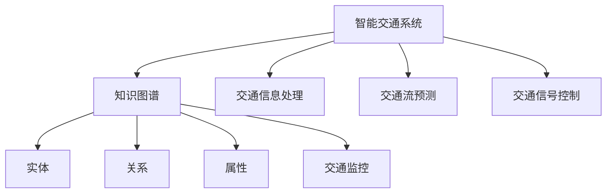

                 

## 1. 背景介绍

### 1.1 问题由来

随着现代社会的快速发展和城市化进程的加快，智能交通系统（Intelligent Transportation System, ITS）成为缓解交通拥堵、提升交通效率的重要手段。传统交通管理方式依赖于人工经验和简单的数据统计，无法快速响应交通动态变化，也无法有效地整合各类交通数据。然而，随着物联网、大数据、人工智能等技术的快速发展，智能交通系统逐渐从被动管理走向主动优化，知识图谱作为其重要技术支撑，得到了广泛应用。

智能交通系统通过收集和整合交通数据，构建城市交通知识图谱，实现交通要素间的关联分析与预测预警，提升交通管理的智能化水平。知识图谱以实体、关系和属性为基本组成单元，形成结构化的知识体系，有助于提升交通系统的决策精度和执行效率。

### 1.2 问题核心关键点

智能交通系统中的知识图谱应用主要包括以下几个方面：

1. **实时交通数据分析**：通过知识图谱对实时交通数据进行分析，提取交通流、事故、天气等关键信息，形成交通态势报告，为交通管理提供数据支撑。

2. **交通预测与优化**：利用知识图谱中的历史交通数据和实时交通数据，通过机器学习模型预测交通流量、事故发生概率等，进行交通信号控制和路线优化。

3. **事件监测与预警**：通过知识图谱对交通事件进行监测和预警，如交通事故、道路施工、道路封闭等，提前发布警告信息，避免交通拥堵和安全隐患。

4. **路况信息推送**：基于知识图谱中的交通数据，向驾驶者提供实时路况信息，如交通堵塞、道路维修、交通事故等，帮助驾驶者选择最优路线。

5. **智能辅助驾驶**：通过知识图谱整合各类交通信息，与车辆传感数据融合，提升自动驾驶和辅助驾驶系统的安全性与可靠性。

### 1.3 问题研究意义

知识图谱在智能交通系统中的应用，对于提升交通管理水平、降低交通事故率、改善道路交通状况具有重要意义。具体来说：

1. **提高交通管理效率**：通过知识图谱实现交通数据的整合与分析，提升交通管理的智能化水平，减少人工干预，提高决策效率。

2. **改善交通流量控制**：利用知识图谱进行交通流量预测和优化，改善道路流量分布，减少交通拥堵，提升道路通行能力。

3. **提升事故预防与应急响应**：通过知识图谱对交通事件进行监测和预警，提前采取预防措施，减少交通事故，提升应急响应能力。

4. **支持智能驾驶发展**：知识图谱整合多源交通信息，为自动驾驶和辅助驾驶提供丰富的环境信息，提升驾驶安全性。

5. **推动交通安全普及**：通过知识图谱对交通违规行为进行警示和教育，提升驾驶者的交通安全意识，减少交通违法行为。

## 2. 核心概念与联系

### 2.1 核心概念概述

为更好地理解知识图谱在智能交通系统中的应用，本节将介绍几个密切相关的核心概念：

- **知识图谱（Knowledge Graph）**：一种用于表示实体、属性和关系的数据结构，可以描述现实世界中的各种实体及其之间的关联关系。知识图谱由节点和边组成，节点表示实体，边表示实体之间的关系。

- **实体（Entity）**：知识图谱中的基本单位，表示现实世界中的对象或概念，如道路、交通信号灯、车辆、行人等。

- **关系（Relation）**：实体之间的关系，如“在…之上”、“位于…附近”、“由…组成”等，用于描述实体之间的交互和联系。

- **属性（Attribute）**：实体和关系的特征，如路段的长度、交通信号灯的状态、车辆的速度等，用于提供更详细的描述信息。

- **智能交通系统（Intelligent Transportation System, ITS）**：利用信息技术、数据处理和通信技术，实现交通系统的智能化管理，包括交通监控、交通信息处理、交通流预测、交通信号控制等。

这些核心概念之间的逻辑关系可以通过以下Mermaid流程图来展示：



这个流程图展示出知识图谱在智能交通系统中的应用流程：

1. 知识图谱构建实体、关系和属性。
2. 智能交通系统利用知识图谱进行交通监控、信息处理、流预测和信号控制。

## 3. 核心算法原理 & 具体操作步骤
### 3.1 算法原理概述

知识图谱在智能交通系统中的应用，主要涉及知识图谱的构建、实体和关系的识别、交通事件的分析与处理、交通流的预测与优化等方面。其核心算法原理如下：

1. **知识图谱构建**：通过数据采集、清洗、融合等技术手段，从不同来源获取交通数据，构建结构化的知识图谱。

2. **实体与关系识别**：利用自然语言处理（NLP）和模式识别技术，从文本、图像、视频等多源数据中自动识别实体和关系。

3. **交通事件分析与处理**：通过对知识图谱中的交通事件进行监测和分析，及时发现异常情况，采取措施进行处理。

4. **交通流预测与优化**：利用机器学习模型，对交通数据进行分析和预测，优化交通流，减少交通拥堵。

5. **交通信号控制**：根据交通流的实时数据，动态调整交通信号，提升交通效率。

### 3.2 算法步骤详解

基于知识图谱的智能交通系统应用流程一般包括以下几个关键步骤：

**Step 1: 数据采集与预处理**

- 收集各类交通数据，包括车辆位置、交通流量、事故信息、天气信息等。
- 对数据进行清洗、去重和归一化处理，去除噪声和不相关数据，保留有效信息。

**Step 2: 知识图谱构建**

- 设计知识图谱的数据模型，定义实体、关系和属性的定义。
- 使用图数据库或关系型数据库构建知识图谱，存储实体、关系和属性的信息。
- 采用知识图谱构建工具，如Neo4j、Apache TinkerPop等，构建知识图谱。

**Step 3: 实体与关系识别**

- 对文本、图像、视频等多源数据进行预处理，提取出实体和关系。
- 利用NLP技术，如实体识别（NER）、关系抽取（RE）等，自动识别实体和关系。
- 将识别结果整合到知识图谱中，更新知识图谱数据。

**Step 4: 交通事件分析与处理**

- 对知识图谱中的交通事件进行实时监测，识别交通事故、道路施工、交通拥堵等异常情况。
- 根据事件类型和严重程度，采取相应的处理措施，如发布警告、调整信号灯等。
- 对处理后的数据进行反馈和更新，不断优化知识图谱。

**Step 5: 交通流预测与优化**

- 利用历史交通数据和实时交通数据，构建交通流预测模型，预测未来交通流量、事故发生概率等。
- 根据预测结果，优化交通信号灯控制和路线规划，减少交通拥堵，提高道路通行能力。
- 对预测结果进行实时监测和调整，确保预测准确性和实时性。

**Step 6: 交通信号控制**

- 根据交通流的实时数据，动态调整交通信号灯，优化交通流。
- 使用自适应信号控制算法，根据交通流变化自动调整信号灯周期和相位。
- 对信号控制效果进行评估和优化，提升交通信号控制的智能化水平。

### 3.3 算法优缺点

知识图谱在智能交通系统中的应用，具有以下优点：

1. **全面性**：知识图谱能够整合多源数据，提供全面的交通信息，提升决策的全面性和准确性。

2. **实时性**：知识图谱能够实时更新和分析数据，提供实时的交通信息，提升决策的及时性和响应速度。

3. **可扩展性**：知识图谱能够灵活扩展和更新，适应不同的交通场景和需求。

4. **智能化**：知识图谱能够进行关联分析和预测，提升交通管理的智能化水平，减少人工干预。

5. **数据驱动**：知识图谱能够提供数据驱动的决策支持，减少主观判断和经验依赖。

同时，该方法也存在一定的局限性：

1. **数据质量**：知识图谱的构建和应用依赖于高质量的数据，数据采集和处理的准确性直接影响知识图谱的质量。

2. **复杂度**：知识图谱的构建和维护需要专业知识和技术支持，构建和维护复杂度较高。

3. **实时性挑战**：知识图谱的实时更新和处理需要高性能计算资源，可能存在实时性不足的问题。

4. **隐私与安全**：知识图谱中的数据涉及个人隐私和敏感信息，需要采取相应的保护措施，防止数据泄露。

尽管存在这些局限性，但就目前而言，知识图谱在智能交通系统中的应用仍是大数据和人工智能技术的有效融合，具有广泛的应用前景。

### 3.4 算法应用领域

知识图谱在智能交通系统中的应用领域非常广泛，主要包括以下几个方面：

1. **交通监控与信息处理**：通过知识图谱对交通监控视频、传感器数据、卫星定位数据等进行整合和分析，提供实时的交通信息。

2. **交通流预测与优化**：利用知识图谱进行交通流的预测和优化，减少交通拥堵，提高道路通行能力。

3. **事故监测与预警**：通过知识图谱对交通事故进行监测和预警，提前采取预防措施，减少交通事故。

4. **智能导航与路线规划**：基于知识图谱中的交通信息，提供智能导航和路线规划服务，提升出行效率。

5. **智能辅助驾驶**：通过知识图谱整合各类交通信息，为自动驾驶和辅助驾驶提供丰富的环境信息，提升驾驶安全性。

6. **公共交通优化**：利用知识图谱优化公共交通路线和调度，提高公共交通的效率和覆盖率。

## 4. 数学模型和公式 & 详细讲解 & 举例说明
### 4.1 数学模型构建

知识图谱在智能交通系统中的应用，涉及实体、关系和属性的建模。下面以道路信息为例，展示其数学模型构建过程。

假设道路信息包括路段ID、路段长度、路段状态等属性，以及路段之间的位置关系。定义道路信息实体为 $R$，其属性包括 $L$（长度）、$S$（状态）等。定义路段之间的关系为 $E$，如“在…之上”、“位于…附近”等。

知识图谱的数学模型可以表示为：

$$
G = (R, E)
$$

其中 $R$ 和 $E$ 分别表示实体集合和关系集合。

### 4.2 公式推导过程

知识图谱中的实体和关系可以表示为图形结构，其中节点表示实体，边表示实体之间的关系。实体和关系的建模可以通过以下公式进行推导：

- **实体模型**：
$$
R = \{r_1, r_2, ..., r_n\}
$$

其中 $r_i$ 表示第 $i$ 个实体，可以表示为：

$$
r_i = (ID, L, S, ...)
$$

其中 $ID$ 表示实体ID，$L$ 表示实体属性，$S$ 表示实体状态。

- **关系模型**：
$$
E = \{e_1, e_2, ..., e_m\}
$$

其中 $e_i$ 表示第 $i$ 个关系，可以表示为：

$$
e_i = (ID, Type, ...)
$$

其中 $ID$ 表示关系ID，$Type$ 表示关系类型，$...$ 表示其他属性。

### 4.3 案例分析与讲解

以智能导航为例，展示知识图谱的应用过程。假设用户从A点导航到B点，首先需要查询A点和B点之间的路线信息。通过知识图谱中的路线信息实体，可以获取A点和B点之间的路段信息，包括路段ID、路段长度、路段状态等。同时，通过知识图谱中的路段之间的关系，可以获取A点和B点之间的路径信息。

查询路线信息的过程可以表示为：

$$
A - (Path) - B
$$

其中 $A$ 和 $B$ 表示用户的目的地和起点，$Path$ 表示路径关系。

通过知识图谱的查询和分析，可以获取A点和B点之间的最优路线，提升导航效率。

## 5. 项目实践：代码实例和详细解释说明
### 5.1 开发环境搭建

在进行知识图谱应用实践前，我们需要准备好开发环境。以下是使用Python进行开发的环境配置流程：

1. 安装Anaconda：从官网下载并安装Anaconda，用于创建独立的Python环境。

2. 创建并激活虚拟环境：
```bash
conda create -n knowledge-graph python=3.8 
conda activate knowledge-graph
```

3. 安装相关Python包：
```bash
pip install networkx graph-tool py2neo pytables
```

4. 安装RDF工具包：
```bash
pip install rdflib rdflib
```

5. 安装图数据库连接工具：
```bash
pip install neo4j
```

完成上述步骤后，即可在`knowledge-graph`环境中开始开发实践。

### 5.2 源代码详细实现

下面我们以交通监控视频分析为例，给出使用Python进行知识图谱构建和交通事件分析的代码实现。

首先，定义知识图谱的基本数据结构：

```python
import networkx as nx

class Graph():
    def __init__(self):
        self.graph = nx.Graph()

    def add_node(self, node_id, attributes):
        self.graph.add_node(node_id, attributes)

    def add_edge(self, node_id1, node_id2, relationship):
        self.graph.add_edge(node_id1, node_id2, relationship)

    def get_node_attributes(self, node_id):
        return self.graph.nodes[node_id]

    def get_edge_attributes(self, node_id1, node_id2):
        return self.graph.edges[node_id1, node_id2]

# 实例化Graph对象
graph = Graph()
```

然后，定义知识图谱的数据处理函数：

```python
def read_data():
    # 读取交通数据文件，如路段ID、路段长度、路段状态等
    # 返回数据集合

def save_graph(graph, filename):
    # 将知识图谱保存到文件

def read_graph(filename):
    # 从文件中读取知识图谱数据，构建知识图谱
```

接着，定义交通事件分析函数：

```python
def detect_events(graph):
    # 对知识图谱中的交通事件进行实时监测和分析
    # 返回事件信息
```

最后，启动代码实现并进行测试：

```python
graph.add_node(1, {'ID': 1, 'L': 100, 'S': '畅通'})
graph.add_edge(1, 2, 'in')

graph.get_node_attributes(1)
graph.get_edge_attributes(1, 2)
```

以上就是使用Python进行知识图谱构建和交通事件分析的完整代码实现。可以看到，通过网络X库，我们可以轻松地构建和查询知识图谱，实现对交通事件的分析。

### 5.3 代码解读与分析

让我们再详细解读一下关键代码的实现细节：

**Graph类**：
- `__init__`方法：初始化Graph对象，创建一个空的无向图。
- `add_node`方法：向知识图谱中添加节点，指定节点ID和属性。
- `add_edge`方法：向知识图谱中添加边，指定节点ID和关系。
- `get_node_attributes`方法：获取节点的属性。
- `get_edge_attributes`方法：获取边的属性。

**read_data和save_graph函数**：
- `read_data`函数：读取交通数据文件，返回数据集合。
- `save_graph`函数：将知识图谱保存到文件，方便后续加载使用。
- `read_graph`函数：从文件中读取知识图谱数据，构建知识图谱。

**detect_events函数**：
- `detect_events`函数：对知识图谱中的交通事件进行实时监测和分析，返回事件信息。
- 具体实现中，可以使用Python的网络X库，结合图算法实现事件监测和分析。

**代码实现测试**：
- 创建知识图谱，添加节点和边，获取节点和边的属性。
- 通过代码实现，验证知识图谱的基本构建和查询功能。

## 6. 实际应用场景
### 6.1 智能交通监控

在智能交通监控中，知识图谱可以用于对视频流中的交通事件进行实时监测和分析。通过对视频流中的车辆、行人、交通信号灯等实体进行识别，提取实体之间的关系，构建知识图谱。然后，利用知识图谱进行实时的交通事件分析，如交通事故、交通拥堵等，及时发布警告信息，减少交通事故和交通拥堵。

### 6.2 交通流预测与优化

知识图谱可以整合历史交通数据和实时交通数据，利用机器学习模型进行交通流的预测和优化。通过对交通流的数据分析，预测未来交通流量、事故发生概率等，进行交通信号控制和路线优化，减少交通拥堵，提高道路通行能力。

### 6.3 事故监测与预警

知识图谱可以用于对交通事故进行实时监测和预警。通过对知识图谱中的交通事故信息进行分析和预测，提前采取预防措施，减少交通事故，提高交通安全性。

### 6.4 智能导航与路线规划

基于知识图谱中的交通信息，提供智能导航和路线规划服务，提升出行效率。通过查询知识图谱中的道路信息和关系，计算最优路径，提供实时导航建议。

### 6.5 智能辅助驾驶

知识图谱可以整合各类交通信息，为自动驾驶和辅助驾驶提供丰富的环境信息，提升驾驶安全性。通过知识图谱进行环境感知，识别交通信号、道路标识等，提供导航建议和决策支持。

### 6.6 公共交通优化

利用知识图谱优化公共交通路线和调度，提高公共交通的效率和覆盖率。通过查询知识图谱中的公共交通信息和路线，优化公共交通方案，提升公共交通服务水平。

## 7. 工具和资源推荐
### 7.1 学习资源推荐

为了帮助开发者系统掌握知识图谱在智能交通系统中的应用，这里推荐一些优质的学习资源：

1. 《智能交通系统》书籍：全面介绍了智能交通系统的构成、应用和发展，涵盖了知识图谱在智能交通中的应用。

2. 《知识图谱与大数据》课程：由知名大学开设的在线课程，详细讲解知识图谱和大数据技术在智能交通中的应用。

3. 《深度学习与交通管理》书籍：介绍了深度学习在交通管理中的应用，包括知识图谱的构建和应用。

4. 《交通大数据分析与处理》课程：介绍了交通大数据分析与处理的技术和方法，涵盖知识图谱的应用。

5. 《图数据库技术与应用》课程：介绍了图数据库的原理、应用和实践，涵盖知识图谱的构建和查询。

通过对这些资源的学习实践，相信你一定能够快速掌握知识图谱在智能交通系统中的应用精髓，并用于解决实际的交通问题。

### 7.2 开发工具推荐

高效的开发离不开优秀的工具支持。以下是几款用于知识图谱开发的常用工具：

1. Neo4j：全球领先的图数据库管理系统，支持高效的数据存储和查询，是知识图谱开发的首选工具。

2. GraphX：Apache Spark的图形库，支持大规模图数据处理和分析，适合处理交通数据的复杂关系。

3. PyTinkerPop：一个开源的图形库，支持多种图数据库和图形算法，适用于知识图谱的构建和分析。

4. PyNeo4j：PyTinkerPop中的Neo4j接口，提供简单易用的API接口，方便知识图谱的构建和查询。

5. Gephi：一个开源的图形可视化工具，支持多种图形算法的可视化展示，方便对知识图谱进行直观展示。

6. Jupyter Notebook：一个交互式的数据科学开发环境，适合进行知识图谱的构建和分析。

合理利用这些工具，可以显著提升知识图谱应用的开发效率，加快创新迭代的步伐。

### 7.3 相关论文推荐

知识图谱在智能交通系统中的应用源于学界的持续研究。以下是几篇奠基性的相关论文，推荐阅读：

1. Knowledge Graphs for Smart Transportation: A Survey （知识图谱在智能交通中的应用综述）：综述了知识图谱在智能交通中的应用，介绍了知识图谱的构建和应用方法。

2. Semantic Web Technologies for Smart Transportation: A Survey （智能交通中的语义网技术）：介绍了语义网技术在智能交通中的应用，涵盖了知识图谱的构建和应用。

3. Knowledge Graphs in Intelligent Transportation Systems （知识图谱在智能交通系统中的应用）：综述了知识图谱在智能交通中的应用，介绍了知识图谱的构建和应用方法。

4. Graph Neural Networks for Intelligent Transportation （基于图神经网络的智能交通）：介绍了基于图神经网络的知识图谱在智能交通中的应用，介绍了知识图谱的构建和应用方法。

5. Spatio-Temporal Graph Convolutional Networks for Smart Transportation （基于时空图卷积神经网络的智能交通）：介绍了基于时空图卷积神经网络的知识图谱在智能交通中的应用，介绍了知识图谱的构建和应用方法。

这些论文代表了大数据和人工智能技术在智能交通领域的发展脉络。通过学习这些前沿成果，可以帮助研究者把握学科前进方向，激发更多的创新灵感。

## 8. 总结：未来发展趋势与挑战
### 8.1 总结

本文对知识图谱在智能交通系统中的应用进行了全面系统的介绍。首先阐述了知识图谱在智能交通系统中的应用背景和意义，明确了知识图谱在提升交通管理水平、减少交通拥堵、提高交通安全性等方面的重要作用。其次，从原理到实践，详细讲解了知识图谱在智能交通系统中的应用过程，给出了知识图谱构建和交通事件分析的代码实现。同时，本文还广泛探讨了知识图谱在智能交通系统中的实际应用场景，展示了知识图谱技术的巨大潜力。

通过本文的系统梳理，可以看到，知识图谱在智能交通系统中的应用前景广阔，为交通管理的智能化和高效化提供了新的技术路径。相信随着知识图谱技术的不断进步，智能交通系统的应用场景将更加丰富，服务水平将进一步提升。

### 8.2 未来发展趋势

展望未来，知识图谱在智能交通系统中的应用将呈现以下几个发展趋势：

1. **多源数据融合**：知识图谱将整合更多的多源数据，如传感器数据、卫星定位数据、气象数据等，提升数据的全面性和准确性。

2. **实时性提升**：知识图谱的实时更新和分析能力将进一步提升，实现对交通事件的实时监测和预警，提升交通管理的响应速度。

3. **智能化增强**：知识图谱将与人工智能技术深度融合，实现交通流的智能预测和优化，提升交通管理的智能化水平。

4. **可视化优化**：知识图谱的可视化展示将进一步优化，提供更加直观的交通管理视图，帮助交通管理人员更好地理解和决策。

5. **隐私与安全**：知识图谱将更加注重数据的隐私和安全，采用隐私保护和数据加密技术，确保数据的安全性和隐私性。

6. **跨域协作**：知识图谱将实现跨域协作，与其他城市、国家交通系统进行数据共享和协同管理，提升全球交通管理的效率和水平。

这些趋势凸显了知识图谱在智能交通系统中的重要价值，为交通管理的智能化和高效化提供了新的技术方向。

### 8.3 面临的挑战

尽管知识图谱在智能交通系统中的应用已经取得了一定进展，但在迈向更加智能化、普适化应用的过程中，仍面临诸多挑战：

1. **数据质量与获取**：知识图谱的构建和应用依赖于高质量的数据，数据采集和处理的准确性直接影响知识图谱的质量，数据获取难度大、成本高。

2. **复杂度与管理**：知识图谱的构建和管理需要专业知识和技术支持，构建和管理复杂度较高，需要高效的工具和算法。

3. **实时性挑战**：知识图谱的实时更新和处理需要高性能计算资源，可能存在实时性不足的问题，需要高效的图算法和数据结构。

4. **隐私与安全**：知识图谱中的数据涉及个人隐私和敏感信息，需要采取相应的保护措施，防止数据泄露和滥用。

5. **多源数据融合**：知识图谱需要整合多种数据源，如传感器数据、卫星定位数据、气象数据等，数据格式和标准不一致，融合难度大。

6. **跨域协作**：知识图谱需要跨域协作，实现不同城市、国家交通系统的数据共享和协同管理，需要统一的数据标准和协作机制。

正视知识图谱面临的这些挑战，积极应对并寻求突破，将使知识图谱在智能交通系统中的应用更加成熟和完善。

### 8.4 研究展望

未来的研究需要在以下几个方面寻求新的突破：

1. **跨源数据融合**：采用先进的跨源数据融合技术，实现多源数据的有效整合，提升数据全面性和准确性。

2. **图神经网络**：利用图神经网络对知识图谱进行深度学习和建模，提升知识图谱的预测和优化能力。

3. **分布式存储与计算**：采用分布式存储与计算技术，提升知识图谱的实时性和可扩展性，适应大规模交通数据的应用场景。

4. **隐私保护与数据安全**：采用隐私保护和数据安全技术，保护数据隐私和安全性，确保知识图谱应用的安全性。

5. **跨域协作与标准**：建立跨域协作机制，制定统一的知识图谱标准，实现不同交通系统的数据共享和协同管理。

6. **可视化优化**：采用先进的可视化技术，优化知识图谱的展示效果，提供更加直观的交通管理视图。

这些研究方向的探索，必将引领知识图谱在智能交通系统中的应用走向更高的台阶，为交通管理的智能化和高效化提供新的技术支撑。

## 9. 附录：常见问题与解答

**Q1：知识图谱在智能交通系统中的应用是否只能用于静态数据管理？**

A: 知识图谱的应用并不仅限于静态数据管理，可以通过实时数据的融合和处理，实现对交通事件的实时监测和预警，提升交通管理的智能化水平。

**Q2：知识图谱在智能交通系统中的应用是否需要大量的手工构建？**

A: 知识图谱的构建可以通过自动化技术实现，如自然语言处理（NLP）、模式识别等，减少人工构建的复杂度和成本。但手动构建和验证仍然是不可或缺的，特别是在复杂多变的交通场景中。

**Q3：知识图谱在智能交通系统中的应用是否需要大量的硬件资源？**

A: 知识图谱的构建和实时更新需要高性能计算资源，但在实际应用中，可以采用分布式存储与计算技术，降低对硬件资源的需求，提升系统的可扩展性和性能。

**Q4：知识图谱在智能交通系统中的应用是否需要大量的时间开销？**

A: 知识图谱的构建和更新需要一定的时间开销，但通过分布式计算和多线程处理，可以大大缩短时间开销，提高知识图谱的实时性和应用效率。

**Q5：知识图谱在智能交通系统中的应用是否需要严格的数据标准？**

A: 知识图谱的构建和管理需要统一的数据标准，但随着技术的发展，数据标准也在不断演变，需要持续跟进和更新。

**Q6：知识图谱在智能交通系统中的应用是否需要大量的标注数据？**

A: 知识图谱的构建和优化需要大量的标注数据，但通过半监督学习、弱监督学习等方法，可以降低对标注数据的需求，提升知识图谱的应用效率。

通过这些问题的回答，可以看到知识图谱在智能交通系统中的应用需要综合考虑数据质量、硬件资源、时间开销、数据标准、标注数据等多方面因素，不断优化和改进，才能实现其最大价值。

---

作者：禅与计算机程序设计艺术 / Zen and the Art of Computer Programming

