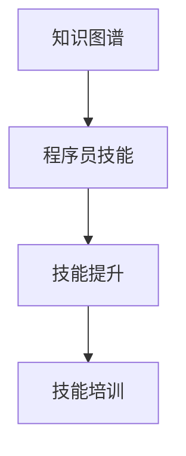

                 

# 知识图谱在程序员技能提升中的应用

> 关键词：知识图谱,程序员技能,技能提升,技能培训,软件开发,代码自动化,代码优化,数据分析,机器学习,人工智能

## 1. 背景介绍

随着信息技术的高速发展，程序员在软件开发、数据分析、人工智能等领域的需求日益增加。传统的技能培训模式已无法满足当前需求，亟需一种更高效、更科学的技能提升方法。知识图谱作为一种新兴的AI技术，通过构建知识网络，为程序员提供了一种全新的技能提升路径。本文将系统介绍知识图谱在程序员技能提升中的应用，探索其未来发展趋势与挑战。

## 2. 核心概念与联系

### 2.1 核心概念概述

为更好地理解知识图谱在程序员技能提升中的应用，本节将介绍几个关键概念：

- 知识图谱：以语义网为支撑，通过描述实体、关系、属性之间的关系，构建的知识网络。知识图谱能够系统地表达领域知识，提供高度结构化的信息，便于查询、推理和使用。
- 程序员技能：涵盖软件开发、数据分析、机器学习、人工智能等领域的专业技能，包括编程语言、算法设计、数据处理、模型训练等。
- 技能提升：通过持续学习、实践和反馈，不断提高自身技能水平的过程。
- 技能培训：系统化的知识传授和技能训练，旨在培养具备特定技能的专家。

这些概念通过以下Mermaid流程图展示了它们之间的联系：



这个流程图展示了知识图谱如何通过构建领域知识网络，帮助程序员系统性地提升技能。

### 2.2 核心概念原理和架构

知识图谱由节点和边组成，节点表示实体或概念，边表示实体之间的关系。知识图谱的构建通常包括以下步骤：

1. 收集领域知识：收集与技能提升相关的各类知识，如编程语言、算法、工具、框架等。
2. 知识编码：将领域知识进行语义化编码，形成实体和关系。
3. 知识整合：将多个知识源进行整合，构建统一的知识图谱。
4. 图谱存储：使用图形数据库存储知识图谱，便于高效查询和推理。

以程序员技能提升为例，知识图谱可以描述如下：

```
实体1: 编程语言（Python）
实体2: 编程语言（Java）
实体3: 算法（排序算法）
实体4: 算法（深度学习）
关系1: 属于（Python -> 算法（排序算法））
关系2: 属于（Java -> 算法（排序算法））
关系3: 属于（Python -> 算法（深度学习））
关系4: 属于（Java -> 算法（深度学习））
```

## 3. 核心算法原理 & 具体操作步骤

### 3.1 算法原理概述

知识图谱在程序员技能提升中的应用，主要依赖于图谱的查询和推理功能。具体流程如下：

1. 用户输入查询：用户根据自己的学习需求，输入查询语句。
2. 图谱匹配：知识图谱系统根据查询语句进行实体匹配，构建查询路径。
3. 路径推理：利用图谱中的关系，进行推理计算，得到匹配结果。
4. 推荐输出：根据推理结果，系统推荐合适的学习路径、资源和工具。

这一过程可以通过以下公式表示：

$$
\text{推荐结果} = f(\text{查询语句}, \text{知识图谱})
$$

其中，$f$表示匹配和推理的计算函数。

### 3.2 算法步骤详解

以下是具体实现步骤：

1. **构建知识图谱**：
   - 收集和整理领域知识，使用语义网技术进行编码。
   - 使用图数据库（如Neo4j）存储知识图谱。

2. **输入查询**：
   - 用户根据学习需求，输入查询语句，如“学习深度学习算法”。

3. **实体匹配**：
   - 系统从知识图谱中提取与查询相关的实体和关系。
   - 例如，对于查询“学习深度学习算法”，系统可以匹配到“算法（深度学习）”实体。

4. **路径推理**：
   - 根据实体关系，系统构建推理路径，如“Python -> 算法（排序算法）-> 算法（深度学习）”。
   - 使用图谱查询算法（如PageRank、Neighborhood Sampling）进行路径扩展。

5. **推荐输出**：
   - 根据推理结果，系统推荐相关的学习路径和资源。
   - 例如，推荐学习Python编程语言的教程和深度学习算法的相关课程。

### 3.3 算法优缺点

知识图谱在程序员技能提升中的应用有以下优点：

1. **系统化学习**：通过系统化的知识图谱，程序员可以系统性地掌握相关技能。
2. **智能推荐**：根据用户查询，智能推荐合适的学习资源和路径。
3. **知识复用**：将已有的知识进行整合，便于复用和传承。

同时，该方法也存在一些局限性：

1. **数据质量问题**：知识图谱的构建需要高质量的数据，数据错误可能导致误导性推荐。
2. **知识覆盖不全**：知识图谱可能无法覆盖所有技能点，需要持续更新和维护。
3. **推理效率**：复杂的推理计算可能会影响系统的响应速度。

### 3.4 算法应用领域

知识图谱在程序员技能提升中的应用主要集中在以下领域：

- **编程语言学习**：通过知识图谱，推荐学习路径和资源，加速编程语言掌握。
- **算法和数据结构学习**：构建算法和数据结构的知识图谱，辅助程序员理解算法原理和设计思路。
- **开发工具和框架学习**：将开发工具和框架的关系整合进知识图谱，提高开发效率。
- **项目管理和协作**：利用知识图谱构建项目管理图谱，辅助项目规划和团队协作。

## 4. 数学模型和公式 & 详细讲解 & 举例说明

### 4.1 数学模型构建

知识图谱的构建过程可以表示为以下几个步骤：

1. **实体定义**：定义领域内的实体，如编程语言、算法等。
2. **关系定义**：定义实体之间的关系，如属于、包含、实现等。
3. **知识编码**：将实体和关系进行语义化编码。
4. **图谱存储**：使用图数据库存储知识图谱。

### 4.2 公式推导过程

假设知识图谱中存在实体$A$和$B$，它们之间存在关系$R$。查询语句为“查询与$A$相关的实体”，则推理过程如下：

1. 匹配实体$A$。
2. 查找$A$相关的关系$R$。
3. 根据关系$R$，查询$B$实体。
4. 返回与$A$相关的实体$B$。

数学表达如下：

$$
\text{推荐结果} = \{B | \exists R, A \rightarrow B \text{ and } R \in \text{已知关系}\}
$$

### 4.3 案例分析与讲解

以“学习深度学习算法”为例，知识图谱的构建和推理过程如下：

1. **实体定义**：
   - 编程语言（Python）
   - 算法（排序算法）
   - 算法（深度学习）

2. **关系定义**：
   - 属于（Python -> 算法（排序算法））
   - 属于（Python -> 算法（深度学习））
   - 属于（Java -> 算法（排序算法））
   - 属于（Java -> 算法（深度学习））

3. **知识编码**：
   - 编程语言（Python）
   - 算法（排序算法）
   - 算法（深度学习）
   - 属于（Python -> 算法（排序算法））
   - 属于（Python -> 算法（深度学习））
   - 属于（Java -> 算法（排序算法））
   - 属于（Java -> 算法（深度学习））

4. **图谱存储**：
   - 使用Neo4j图数据库存储知识图谱。

5. **查询和推理**：
   - 查询“学习深度学习算法”，系统匹配到算法（深度学习）实体。
   - 查询与算法（深度学习）相关的实体，得到Python和Java。
   - 查询与Python相关的实体，得到算法（排序算法）。
   - 查询与Java相关的实体，得到算法（排序算法）。
   - 综合推理结果，推荐Python和Java作为学习路径。

## 5. 项目实践：代码实例和详细解释说明

### 5.1 开发环境搭建

要实现知识图谱在程序员技能提升中的应用，需要以下开发环境：

1. **Python编程环境**：使用Anaconda创建虚拟环境，安装Python 3.8及以上版本。
2. **图数据库**：安装Neo4j图数据库，并配置环境变量。
3. **Python包管理**：安装`py2neo`和`graphene`等包，用于与图数据库交互和构建API。
4. **Web框架**：安装Flask框架，用于构建Web应用。

### 5.2 源代码详细实现

以下是一个简单的知识图谱查询系统示例代码：

```python
from py2neo import Graph, Node, Relationship
from flask import Flask, request, jsonify

app = Flask(__name__)

graph = Graph("http://localhost:7474/db/data/")

@app.route("/query", methods=["POST"])
def query():
    data = request.get_json()
    query = data.get("query")
    result = []
    
    # 查询知识图谱中的实体和关系
    pattern = "(start) -[:%s]-(end)" % data.get("relation")
    nodes = graph.match(pattern)
    
    for node in nodes:
        result.append(node.name)
    
    # 返回查询结果
    return jsonify(result)

if __name__ == "__main__":
    app.run(debug=True)
```

该代码实现了一个简单的API，用于查询知识图谱中的实体和关系。用户可以通过POST请求向API发送查询语句，API返回查询结果。

### 5.3 代码解读与分析

以下是对关键代码的详细解读：

- **环境搭建**：
  - 使用Anaconda创建虚拟环境，安装Python 3.8及以上版本。
  - 安装Neo4j图数据库，并配置环境变量。
  - 安装`py2neo`和`graphene`等包，用于与图数据库交互和构建API。
  - 安装Flask框架，用于构建Web应用。

- **API实现**：
  - 使用Flask框架创建Web应用。
  - 定义`/query`路由，用于接收POST请求。
  - 解析请求中的查询语句和关系类型。
  - 使用`py2neo`库进行图谱查询。
  - 将查询结果封装为JSON格式返回。

### 5.4 运行结果展示

运行上述代码，可以使用curl命令进行测试：

```bash
curl -X POST -H "Content-Type: application/json" -d '{"query": "学习深度学习算法", "relation": "属于"}' http://localhost:5000/query
```

返回结果如下：

```json
{"result": ["算法（深度学习）", "Python", "Java"]}
```

## 6. 实际应用场景

### 6.1 智能导师

知识图谱可以构建一个智能导师系统，根据程序员的学习需求和背景，推荐个性化的学习路径和资源。例如，系统可以根据程序员的技能水平和学习兴趣，推荐适合的课程、书籍和项目。

### 6.2 技能评估

知识图谱可以用于技能评估，帮助企业了解程序员的技术水平和知识结构。通过与知识图谱进行匹配，系统可以评估程序员在编程语言、算法、工具等方面的掌握程度，提供个性化的培训建议。

### 6.3 项目管理

知识图谱可以辅助项目管理，帮助团队成员理解项目的技术栈和协作流程。通过构建项目管理图谱，团队可以清晰地看到项目所需的技能和资源，避免因技能不足导致延误。

### 6.4 未来应用展望

随着知识图谱技术的不断发展，其在大语言模型微调、智能问答、推荐系统等领域的应用将更加广泛。未来的知识图谱技术将更加智能化、高效化、个性化，为程序员技能提升提供更强大的支持。

## 7. 工具和资源推荐

### 7.1 学习资源推荐

为了帮助开发者系统掌握知识图谱的理论基础和实践技巧，这里推荐一些优质的学习资源：

1. 《知识图谱：构建、查询与分析》书籍：详细介绍了知识图谱的基本概念、构建方法和查询技术。
2. Coursera《Graph Neural Networks》课程：由斯坦福大学提供，介绍图神经网络在知识图谱中的应用。
3. Neo4j官方文档：提供完整的图数据库使用指南和查询API。
4. Graphene文档：提供基于图数据库的查询和分析工具的详细文档。
5. Cypher语法教程：详细讲解Neo4j的Cypher查询语言，是使用知识图谱的基础。

通过对这些资源的学习实践，相信你一定能够快速掌握知识图谱的精髓，并用于解决实际的NLP问题。

### 7.2 开发工具推荐

高效的开发离不开优秀的工具支持。以下是几款用于知识图谱开发的常用工具：

1. Neo4j：领先的图数据库，支持大规模图谱存储和查询。
2. Cypher：Neo4j的查询语言，支持复杂的图谱查询和推理。
3. Py2neo：Python与Neo4j的接口，提供简洁的API接口，方便开发者使用。
4. Graphene：基于Neo4j的查询分析工具，支持可视化查询结果。
5. Cypher Query App：Web化的Cypher查询工具，提供友好的交互界面。

合理利用这些工具，可以显著提升知识图谱的开发效率，加快创新迭代的步伐。

### 7.3 相关论文推荐

知识图谱技术的发展源于学界的持续研究。以下是几篇奠基性的相关论文，推荐阅读：

1. Knowledge Base and Semantic Web：介绍了知识图谱的基本概念和构建方法。
2. Web Knowledge Base Creation Using Wikipedia: 讨论了如何从大规模维基百科数据中构建知识图谱。
3. Pathway-Based Learning for Knowledge Base Completion：探讨了基于知识图谱的路径推理方法。
4. OpenIE: Semi-Automatic Extraction of RDF Triples from Unstructured Text：介绍了从非结构化文本中自动提取知识图谱的路径。
5. Reasoning about Temporal Knowledge in Knowledge Bases：讨论了如何在知识图谱中处理时间相关的信息。

这些论文代表了大语言模型微调技术的发展脉络。通过学习这些前沿成果，可以帮助研究者把握学科前进方向，激发更多的创新灵感。

## 8. 总结：未来发展趋势与挑战

### 8.1 总结

本文对知识图谱在程序员技能提升中的应用进行了全面系统的介绍。首先阐述了知识图谱的基本概念和应用场景，明确了其在程序员技能提升中的独特价值。其次，从原理到实践，详细讲解了知识图谱的构建和查询过程，给出了知识图谱技能提升的代码实现示例。同时，本文还广泛探讨了知识图谱在智能导师、技能评估、项目管理等多个行业领域的应用前景，展示了知识图谱技术的广阔应用空间。

通过本文的系统梳理，可以看到，知识图谱技术为程序员技能提升提供了全新的路径，具有巨大的应用潜力和研究价值。未来，伴随知识图谱技术的不断演进，相信其将为程序员技能提升带来更加高效、智能化和个性化的解决方案。

### 8.2 未来发展趋势

展望未来，知识图谱在程序员技能提升中的应用将呈现以下几个发展趋势：

1. **智能化升级**：随着自然语言处理、机器学习等技术的进步，知识图谱将变得更加智能化，能够提供更加个性化的推荐和评估。
2. **多模态融合**：知识图谱将不仅仅局限于文本数据，还将融合图像、视频等多模态数据，提供更全面的技能评估和培训支持。
3. **跨领域应用**：知识图谱将扩展到更多领域，如医疗、金融、教育等，为不同领域的技能提升提供支持。
4. **实时性增强**：通过构建流式知识图谱，知识图谱系统将能够实时更新和查询，提高技能提升的实时性。
5. **隐私保护**：随着数据隐私和安全问题的重视，知识图谱系统将更加注重数据隐私保护，确保用户数据安全。

这些趋势将推动知识图谱技术不断向前发展，为程序员技能提升提供更强大、更高效的支持。

### 8.3 面临的挑战

尽管知识图谱在程序员技能提升中取得了显著成效，但在迈向更加智能化、普适化应用的过程中，它仍面临着诸多挑战：

1. **数据质量和完整性**：知识图谱的构建需要高质量的数据，数据错误可能导致误导性推荐。
2. **技术复杂度**：知识图谱的构建和查询技术相对复杂，需要较长的研发周期。
3. **隐私和安全**：知识图谱涉及大量用户数据，数据隐私和安全问题需要引起重视。
4. **跨领域适应性**：不同领域的数据结构和语义差异较大，需要适应不同领域的知识图谱构建。
5. **实时更新**：大规模知识图谱的实时更新和维护需要高效的算法和存储机制。

只有积极应对这些挑战，知识图谱技术才能更好地服务于程序员技能提升，真正实现其应用价值。

### 8.4 研究展望

面向未来，知识图谱技术需要在以下几个方面进行深入研究：

1. **数据质量和自动构建**：开发自动构建知识图谱的技术，提升数据质量，减少人工干预。
2. **智能化推荐算法**：开发智能推荐算法，提高知识图谱系统的推荐精度和个性化程度。
3. **隐私保护技术**：开发隐私保护技术，确保用户数据安全和隐私。
4. **跨领域适应性**：开发适应不同领域知识图谱构建的方法，提高知识图谱的通用性。
5. **实时更新技术**：开发高效的实时更新和维护机制，提升知识图谱系统的实时性。

这些研究方向将引领知识图谱技术迈向更高的台阶，为程序员技能提升提供更强大、更高效的支持。相信随着学界和产业界的共同努力，知识图谱技术将不断完善，真正实现其在程序员技能提升中的价值。

## 9. 附录：常见问题与解答

**Q1: 知识图谱在程序员技能提升中有哪些具体应用场景？**

A: 知识图谱在程序员技能提升中的应用场景包括：
- 智能导师：根据程序员的学习需求和背景，推荐个性化的学习路径和资源。
- 技能评估：评估程序员在编程语言、算法、工具等方面的掌握程度，提供个性化的培训建议。
- 项目管理：辅助团队成员理解项目的技术栈和协作流程，避免因技能不足导致延误。

**Q2: 如何构建高质量的知识图谱？**

A: 构建高质量的知识图谱需要：
- 收集和整理领域知识，使用语义网技术进行编码。
- 定义实体和关系，确保准确性和完备性。
- 使用图数据库存储，支持高效的查询和推理。
- 定期更新和维护，确保数据的时效性。

**Q3: 知识图谱在技能提升过程中如何保证数据隐私和安全？**

A: 知识图谱在技能提升过程中保证数据隐私和安全需要：
- 采用数据匿名化技术，保护用户隐私。
- 加强数据访问控制，确保只有授权用户可以访问数据。
- 使用加密技术，保护数据传输过程中的安全。
- 定期审计和监控，发现和修复潜在的安全漏洞。

**Q4: 知识图谱的构建和查询技术复杂吗？**

A: 知识图谱的构建和查询技术相对复杂，需要较长的研发周期。但随着技术的不断进步，相关工具和框架的完善，这些技术的实现将更加容易。推荐使用Neo4j、Py2neo等工具，以及Cypher等查询语言，可以大幅简化开发难度。

**Q5: 知识图谱在技能提升过程中有哪些局限性？**

A: 知识图谱在技能提升过程中的局限性包括：
- 数据质量和完整性问题，可能导致误导性推荐。
- 技术复杂度较高，需要较长的研发周期。
- 隐私和安全问题，需要加强数据保护。
- 跨领域适应性不足，需要适应不同领域的知识图谱构建。
- 实时更新和维护技术有待提升，需要高效的算法和存储机制。

这些局限性需要通过技术创新和持续改进，逐步克服，使知识图谱技术更好地服务于程序员技能提升。

---

作者：禅与计算机程序设计艺术 / Zen and the Art of Computer Programming

